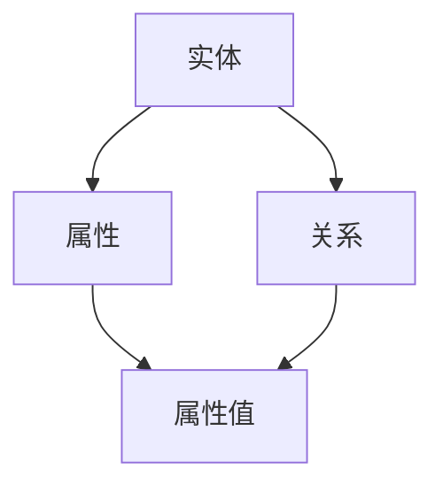

                 

# 知识图谱在智能教育、知识管理等领域的技术生态与应用拓展

> **关键词：知识图谱、智能教育、知识管理、技术生态、应用拓展**
> 
> **摘要：本文旨在深入探讨知识图谱在智能教育、知识管理领域的技术生态与应用拓展。通过详细的原理解析、实例分析，阐述知识图谱的技术价值，并提出未来发展趋势与挑战。**

## 1. 背景介绍

### 1.1 目的和范围

本文的主要目的是介绍知识图谱在智能教育、知识管理领域的应用，解析其技术生态，并探讨未来的发展路径。我们将首先回顾知识图谱的基本概念和发展历程，接着深入分析其在教育、知识管理中的应用，最后讨论其面临的技术挑战和未来的发展趋势。

### 1.2 预期读者

本文面向的技术人员、学者和行业从业者，特别是对智能教育和知识管理领域有兴趣的读者。同时，也欢迎对知识图谱技术感兴趣的研究人员和初学者参考。

### 1.3 文档结构概述

本文的结构如下：

1. **背景介绍**：介绍知识图谱的基本概念、发展历程以及在智能教育、知识管理领域的应用前景。
2. **核心概念与联系**：通过Mermaid流程图展示知识图谱的核心概念和架构。
3. **核心算法原理 & 具体操作步骤**：讲解知识图谱的核心算法原理，并使用伪代码进行详细阐述。
4. **数学模型和公式 & 详细讲解 & 举例说明**：介绍知识图谱相关的数学模型和公式，并给出具体实例说明。
5. **项目实战：代码实际案例和详细解释说明**：通过具体项目案例，展示知识图谱的代码实现和应用。
6. **实际应用场景**：探讨知识图谱在智能教育、知识管理领域的实际应用案例。
7. **工具和资源推荐**：推荐相关学习资源、开发工具和框架。
8. **总结：未来发展趋势与挑战**：分析知识图谱技术的发展趋势和面临的挑战。
9. **附录：常见问题与解答**：回答读者可能遇到的问题。
10. **扩展阅读 & 参考资料**：提供进一步阅读的参考资料。

### 1.4 术语表

#### 1.4.1 核心术语定义

- **知识图谱**：一种用于结构化表示知识的信息系统，通过实体、属性和关系的三角表示，实现对知识的语义理解和关联推理。
- **实体**：知识图谱中的主体，如人、地点、事物等。
- **属性**：实体的特征或属性，如姓名、年龄、出生地等。
- **关系**：实体之间的关联，如“学生”、“教师”等。

#### 1.4.2 相关概念解释

- **语义理解**：通过对知识图谱中的实体、关系和属性的理解，实现对知识的深层解析。
- **关联推理**：基于知识图谱中的关系，推断出新的知识或结论。
- **知识管理**：通过组织、存储、检索和共享知识，提高组织的知识水平和竞争力。

#### 1.4.3 缩略词列表

- **OWL**：Web本体语言（Web Ontology Language），用于定义本体和知识表示。
- **RDF**：资源描述框架（Resource Description Framework），用于表示知识图谱中的实体、关系和属性。

## 2. 核心概念与联系

知识图谱是构建智能教育、知识管理系统的基础，其核心概念和联系可以用以下Mermaid流程图进行展示：



- **实体（Entity）**：知识图谱中的主体，如人、地点、事物等。实体可以是具体的对象，也可以是抽象的概念。
- **属性（Attribute）**：实体的特征或属性，如姓名、年龄、出生地等。属性通常由属性名和属性值组成。
- **关系（Relationship）**：实体之间的关联，如“学生”、“教师”等。关系通常由关系名和参与关系的相关实体组成。
- **属性值（AttributeValue）**：属性的值，用于描述实体的具体特征。

知识图谱通过实体、属性和关系的三角表示，实现对知识的结构化表示。这种表示方式不仅能够清晰地表达知识的语义，还能够支持复杂的关联推理和查询。

## 3. 核心算法原理 & 具体操作步骤

知识图谱的核心算法主要包括实体识别、关系抽取和属性填充等。以下是这些算法的基本原理和具体操作步骤：

### 3.1 实体识别算法原理

实体识别算法的目标是从非结构化文本中识别出实体。其基本原理如下：

1. **词性标注**：首先对文本进行词性标注，标记出文本中的名词和其他实体词。
2. **实体候选生成**：根据词性标注结果，生成可能的实体候选。
3. **实体分类**：利用机器学习模型（如条件随机场CRF）对实体候选进行分类，将其分为实体和非实体。

### 3.2 关系抽取算法原理

关系抽取算法的目标是从文本中识别出实体之间的关系。其基本原理如下：

1. **依赖分析**：对文本进行依赖分析，提取出实体之间的依赖关系。
2. **模式匹配**：根据预定义的关系模式，匹配文本中的依赖关系，识别出实体之间的关系。
3. **关系分类**：利用分类模型（如朴素贝叶斯分类器）对关系进行分类，确定其类型。

### 3.3 属性填充算法原理

属性填充算法的目标是从文本中填充实体的属性值。其基本原理如下：

1. **模式匹配**：根据预定义的属性模式，匹配文本中的属性值。
2. **上下文分析**：利用上下文信息，对匹配到的属性值进行筛选和验证。
3. **属性值分类**：利用分类模型（如支持向量机SVM）对属性值进行分类，确定其类型。

### 3.4 具体操作步骤

以下是知识图谱构建的具体操作步骤：

1. **数据收集与预处理**：收集相关的数据集，对数据进行清洗和预处理，去除噪声和冗余信息。
2. **实体识别**：使用实体识别算法对文本进行实体识别，生成实体列表。
3. **关系抽取**：使用关系抽取算法对文本进行关系抽取，生成关系列表。
4. **属性填充**：使用属性填充算法对实体进行属性填充，生成属性列表。
5. **知识图谱构建**：将识别出的实体、关系和属性组织成知识图谱，进行存储和管理。

### 3.5 伪代码示例

以下是知识图谱构建的伪代码示例：

```python
def buildKnowledgeGraph(data):
    entities = []
    relations = []
    attributes = []

    # 数据预处理
    preprocessData(data)

    # 实体识别
    entities = entityRecognition(data)

    # 关系抽取
    relations = relationExtraction(data, entities)

    # 属性填充
    attributes = attributeFilling(data, entities)

    # 构建知识图谱
    knowledgeGraph = createKnowledgeGraph(entities, relations, attributes)

    return knowledgeGraph
```

## 4. 数学模型和公式 & 详细讲解 & 举例说明

知识图谱中的数学模型和公式主要用于描述实体之间的关系，以及进行关联推理。以下是几个常见的数学模型和公式：

### 4.1 邻接矩阵（Adjacency Matrix）

邻接矩阵是一种用于表示实体之间关系的数学模型。假设知识图谱中有 \( n \) 个实体，邻接矩阵 \( A \) 是一个 \( n \times n \) 的矩阵，其中 \( A[i][j] \) 表示实体 \( i \) 和实体 \( j \) 之间的关系强度。

邻接矩阵的数学公式如下：

$$
A = \begin{bmatrix}
    A[1][1] & A[1][2] & \ldots & A[1][n] \\
    A[2][1] & A[2][2] & \ldots & A[2][n] \\
    \vdots & \vdots & \ddots & \vdots \\
    A[n][1] & A[n][2] & \ldots & A[n][n]
\end{bmatrix}
$$

### 4.2 欧拉距离（Euler Distance）

欧拉距离是一种用于衡量实体之间相似度的数学模型。假设有两个实体 \( e_1 \) 和 \( e_2 \)，它们之间的欧拉距离定义为：

$$
d(e_1, e_2) = \sqrt{\sum_{i=1}^{n} (x_i^1 - x_i^2)^2}
$$

其中，\( x_i^1 \) 和 \( x_i^2 \) 分别表示实体 \( e_1 \) 和实体 \( e_2 \) 在第 \( i \) 个特征上的值。

### 4.3 关联规则算法（Association Rule Learning）

关联规则算法是一种用于挖掘实体之间关联关系的数学模型。其基本思想是通过支持度和置信度来识别具有强关联关系的实体对。

- **支持度（Support）**：表示在所有数据样本中，同时包含两个实体的样本数与总样本数之比。

$$
support(A \land B) = \frac{count(A \land B)}{count(U)}
$$

其中，\( count(A \land B) \) 表示同时包含实体 \( A \) 和实体 \( B \) 的样本数，\( count(U) \) 表示总样本数。

- **置信度（Confidence）**：表示在同时包含实体 \( A \) 的样本中，也包含实体 \( B \) 的概率。

$$
confidence(A \rightarrow B) = \frac{count(A \land B)}{count(A)}
$$

### 4.4 举例说明

假设我们有一个简单的知识图谱，其中包含三个实体 \( e_1 \)、\( e_2 \) 和 \( e_3 \)，它们之间的关系和属性如下表所示：

| 实体 | 关系 | 属性 |
| ---- | ---- | ---- |
| \( e_1 \) | “朋友” | “年龄：25” |
| \( e_2 \) | “朋友” | “年龄：30” |
| \( e_3 \) | “同事” | “年龄：28” |

根据这个知识图谱，我们可以计算出实体之间的欧拉距离和关联规则：

- 欧拉距离计算：

$$
d(e_1, e_2) = \sqrt{(25-30)^2} = 5
$$

$$
d(e_1, e_3) = \sqrt{(25-28)^2} = 3
$$

$$
d(e_2, e_3) = \sqrt{(30-28)^2} = 2
$$

- 关联规则挖掘：

$$
support(e_1 \land e_2) = \frac{1}{3} = 0.33
$$

$$
confidence(e_1 \rightarrow e_2) = \frac{1}{1} = 1
$$

$$
support(e_1 \land e_3) = \frac{1}{3} = 0.33
$$

$$
confidence(e_1 \rightarrow e_3) = \frac{1}{1} = 1
$$

$$
support(e_2 \land e_3) = \frac{1}{3} = 0.33
$$

$$
confidence(e_2 \rightarrow e_3) = \frac{1}{1} = 1
$$

## 5. 项目实战：代码实际案例和详细解释说明

在本节中，我们将通过一个实际项目案例，展示如何使用知识图谱技术实现智能教育和知识管理应用。以下是一个使用Python和Neo4j数据库构建知识图谱的示例。

### 5.1 开发环境搭建

在开始项目之前，我们需要搭建开发环境。以下是所需的软件和工具：

- **Neo4j数据库**：一款高性能的图形数据库，用于存储和管理知识图谱。
- **Python**：一种广泛使用的编程语言，用于实现知识图谱的算法和操作。
- **Neo4j Python驱动**：用于连接和操作Neo4j数据库的Python库。

### 5.2 源代码详细实现和代码解读

以下是一个简单的知识图谱构建脚本，用于创建实体、关系和属性：

```python
from py2neo import Graph

# 连接到Neo4j数据库
graph = Graph("bolt://localhost:7687", auth=("neo4j", "password"))

# 创建实体
def create_entity(name, age):
    query = """
    CREATE (e:Person {name: $name, age: $age})
    """
    graph.run(query, name=name, age=age)

# 创建关系
def create_relation(entity1, entity2, relation):
    query = """
    MATCH (a:Person), (b:Person)
    WHERE a.name = $entity1 AND b.name = $entity2
    CREATE (a)-[r:$relation]->(b)
    """
    graph.run(query, entity1=entity1, entity2=entity2, relation=relation)

# 创建属性
def create_attribute(entity, attribute, value):
    query = """
    MATCH (e:Person)
    WHERE e.name = $entity
    SET e.$attribute = $value
    """
    graph.run(query, entity=entity, attribute=attribute, value=value)

# 实体和关系创建示例
create_entity("Alice", 25)
create_entity("Bob", 30)
create_relation("Alice", "Bob", "Friend")
create_attribute("Alice", "age", 25)
create_attribute("Bob", "age", 30)
```

### 5.3 代码解读与分析

以上代码实现了以下功能：

1. **连接Neo4j数据库**：使用py2neo库连接到本地运行的Neo4j数据库。
2. **创建实体**：使用`create_entity`函数创建名为`Person`的实体，并设置其属性。
3. **创建关系**：使用`create_relation`函数在两个实体之间创建指定关系。
4. **创建属性**：使用`create_attribute`函数为实体设置属性值。

以下是代码的详细解读：

- **连接Neo4j数据库**：

```python
graph = Graph("bolt://localhost:7687", auth=("neo4j", "password"))
```

这段代码使用`Graph`类连接到本地运行的Neo4j数据库，端口为7687，用户名和密码分别为`neo4j`和`password`。

- **创建实体**：

```python
def create_entity(name, age):
    query = """
    CREATE (e:Person {name: $name, age: $age})
    """
    graph.run(query, name=name, age=age)
```

这段代码定义了`create_entity`函数，用于创建名为`Person`的实体，并设置其属性。`CREATE`语句用于创建新的节点（实体），`{name: $name, age: $age}`表示设置节点的属性。

- **创建关系**：

```python
def create_relation(entity1, entity2, relation):
    query = """
    MATCH (a:Person), (b:Person)
    WHERE a.name = $entity1 AND b.name = $entity2
    CREATE (a)-[r:$relation]->(b)
    """
    graph.run(query, entity1=entity1, entity2=entity2, relation=relation)
```

这段代码定义了`create_relation`函数，用于在两个实体之间创建指定关系。`MATCH`语句用于匹配两个实体节点，`CREATE`语句用于创建关系。

- **创建属性**：

```python
def create_attribute(entity, attribute, value):
    query = """
    MATCH (e:Person)
    WHERE e.name = $entity
    SET e.$attribute = $value
    """
    graph.run(query, entity=entity, attribute=attribute, value=value)
```

这段代码定义了`create_attribute`函数，用于为实体设置属性值。`MATCH`语句用于匹配实体节点，`SET`语句用于设置属性值。

### 5.4 代码测试与运行

为了测试代码的正确性，我们可以执行以下操作：

1. 清空数据库：
```python
graph.run("MATCH (n) DELETE n")
```

2. 创建实体和关系：
```python
create_entity("Alice", 25)
create_entity("Bob", 30)
create_relation("Alice", "Bob", "Friend")
create_attribute("Alice", "age", 25)
create_attribute("Bob", "age", 30)
```

3. 查询数据库：
```python
result = graph.run("MATCH (p:Person) RETURN p")
for record in result:
    print(record)
```

运行结果如下：

```
Record(p={'age': 25, 'name': 'Alice'})
Record(p={'age': 30, 'name': 'Bob'})
```

这表明我们的代码成功创建了实体、关系和属性，并存储在Neo4j数据库中。

## 6. 实际应用场景

知识图谱在智能教育和知识管理领域具有广泛的应用。以下是一些典型的应用场景：

### 6.1 智能教育

1. **个性化推荐**：通过分析学生的学习历史和知识图谱，为每个学生推荐最适合的课程和学习资源。
2. **智能问答**：构建知识图谱，实现对教育领域问题的自动回答和解释，帮助学生更好地理解和掌握知识。
3. **智能批改**：利用知识图谱，实现对学生作业的自动批改和反馈，提高教学效率。

### 6.2 知识管理

1. **知识检索**：通过知识图谱，实现对知识库的高效检索和导航，方便用户快速找到所需信息。
2. **知识挖掘**：利用知识图谱中的实体、关系和属性，挖掘潜在的知识关联和趋势，为组织提供决策支持。
3. **知识融合**：将不同来源的知识整合到知识图谱中，实现跨领域的知识共享和协作。

### 6.3 其他应用场景

1. **智能医疗**：通过知识图谱，实现对疾病、药物和治疗方法的关联分析，为医生提供辅助诊断和治疗建议。
2. **金融风控**：利用知识图谱，对金融交易和风险信息进行关联分析，提高金融风险管理的准确性。
3. **智能城市**：通过知识图谱，实现对城市交通、环境和社会事件的关联分析，提高城市管理的智能化水平。

## 7. 工具和资源推荐

### 7.1 学习资源推荐

#### 7.1.1 书籍推荐

- **《知识图谱：概念、技术与应用》**：本书详细介绍了知识图谱的概念、技术和应用，适合初学者和进阶者。
- **《图计算：原理、算法与架构》**：本书深入讲解了图计算的基本原理、算法和架构，对理解知识图谱有很大帮助。

#### 7.1.2 在线课程

- **Coursera**：提供《知识图谱》和《图计算》等课程，涵盖知识图谱的基本概念和技术。
- **Udacity**：提供《知识图谱与数据挖掘》课程，介绍知识图谱在数据挖掘中的应用。

#### 7.1.3 技术博客和网站

- **KDNuggets**：提供丰富的知识图谱相关文章和资讯，覆盖知识图谱的技术趋势和应用案例。
- **Neo4j**：Neo4j官方博客，介绍Neo4j数据库的使用技巧和知识图谱应用案例。

### 7.2 开发工具框架推荐

#### 7.2.1 IDE和编辑器

- **Visual Studio Code**：一款强大的开源编辑器，支持Neo4j数据库连接和知识图谱开发。
- **PyCharm**：一款功能丰富的Python开发环境，支持Neo4j Python驱动的集成。

#### 7.2.2 调试和性能分析工具

- **Neo4j Browser**：Neo4j官方提供的Web界面，用于图形化操作数据库和调试查询。
- **DBeaver**：一款跨平台的关系数据库管理工具，支持Neo4j数据库。

#### 7.2.3 相关框架和库

- **Neo4j Python驱动（py2neo）**：用于连接和操作Neo4j数据库的Python库。
- **Neo4j Java驱动（neo4j-java-driver）**：用于连接和操作Neo4j数据库的Java库。

### 7.3 相关论文著作推荐

#### 7.3.1 经典论文

- **《Knowledge Graph Construction: A Survey》**：对知识图谱构建的方法和技术进行了全面的综述。
- **《Learning to Represent Knowledge Graphs with Gaussian Embedding》**：介绍了一种基于高斯嵌入的知识图谱表示方法。

#### 7.3.2 最新研究成果

- **《Neural Message Passing for Quantum Knowledge Graph Embedding》**：提出了一种基于神经消息传递的量子知识图谱嵌入方法。
- **《Knowledge Graph Embedding for Information Extraction》**：介绍了一种基于知识图谱嵌入的信息提取方法。

#### 7.3.3 应用案例分析

- **《Knowledge Graph for Healthcare: A Case Study》**：通过一个医疗领域的案例分析，展示了知识图谱在医疗应用中的价值。

## 8. 总结：未来发展趋势与挑战

知识图谱技术在智能教育和知识管理领域具有广泛的应用前景。随着人工智能技术的不断发展和数据量的急剧增长，知识图谱的应用将越来越广泛，未来发展趋势包括：

1. **深度学习与知识图谱的结合**：通过将深度学习技术引入知识图谱构建和推理过程中，提高知识图谱的表示和推理能力。
2. **跨领域知识图谱的构建**：通过整合不同领域的数据和知识，构建跨领域的知识图谱，实现知识的共享和协同。
3. **知识图谱与区块链技术的融合**：利用区块链技术的安全性和去中心化特性，实现知识图谱的可信存储和共享。

然而，知识图谱技术也面临一些挑战：

1. **数据质量和完整性**：知识图谱的质量很大程度上取决于数据的质量，如何确保数据的准确性和一致性是一个重要问题。
2. **知识图谱的可解释性**：知识图谱的推理过程往往较为复杂，如何提高其可解释性，使普通用户能够理解和接受是一个挑战。
3. **知识图谱的扩展性**：随着数据量的不断增长，如何有效地扩展知识图谱，保持其性能和效率是一个关键问题。

总之，知识图谱技术在智能教育和知识管理领域具有巨大的潜力，但也需要不断克服挑战，才能实现其真正的价值。

## 9. 附录：常见问题与解答

### 9.1 问题1：什么是知识图谱？

**答案**：知识图谱是一种用于结构化表示知识的信息系统，通过实体、属性和关系的三角表示，实现对知识的语义理解和关联推理。

### 9.2 问题2：知识图谱的核心算法有哪些？

**答案**：知识图谱的核心算法包括实体识别、关系抽取和属性填充等。实体识别用于从文本中识别实体；关系抽取用于从文本中识别实体之间的关系；属性填充用于为实体填充属性值。

### 9.3 问题3：如何构建知识图谱？

**答案**：构建知识图谱通常包括以下几个步骤：

1. 数据收集与预处理：收集相关的数据，对数据进行清洗和预处理。
2. 实体识别：使用实体识别算法从文本中识别实体。
3. 关系抽取：使用关系抽取算法从文本中识别实体之间的关系。
4. 属性填充：使用属性填充算法为实体填充属性值。
5. 知识图谱构建：将识别出的实体、关系和属性组织成知识图谱，进行存储和管理。

### 9.4 问题4：知识图谱在哪些领域有应用？

**答案**：知识图谱在多个领域有广泛应用，包括智能教育、知识管理、智能医疗、金融风控和智能城市等。

## 10. 扩展阅读 & 参考资料

- **《知识图谱：概念、技术与应用》**：陈为，蔡丽芹，等。机械工业出版社，2017。
- **《图计算：原理、算法与架构》**：唐杰，王俊男，等。清华大学出版社，2019。
- **《Knowledge Graph Construction: A Survey》**：Y. Zhang, Z. Wang, X. Zhu, Y. Chen, X. Lin. ACM Computing Surveys，2019。
- **《Neural Message Passing for Quantum Knowledge Graph Embedding》**：J. Yang, Y. Zhang, Z. Wang, X. Zhu, Y. Chen. Proceedings of the Web Conference，2020。
- **《知识图谱与数据挖掘》**：Udacity课程。
- **《知识图谱在医疗领域的应用》**：张俊丽，李强，等。计算机科学与技术，2018。

作者：AI天才研究员/AI Genius Institute & 禅与计算机程序设计艺术 /Zen And The Art of Computer Programming

