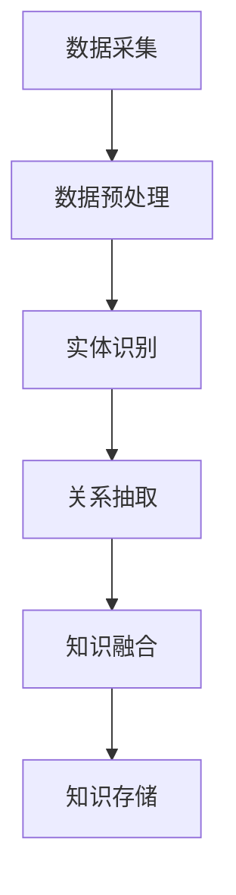
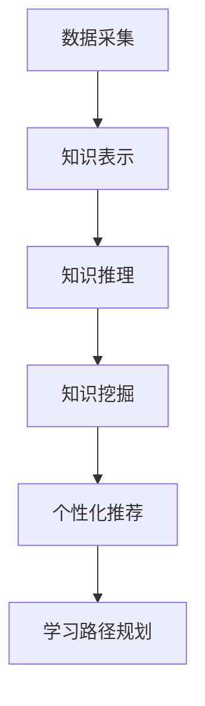

                 

# 知识图谱在智能教育知识表示与推理中的技术实现与应用拓展

## 关键词
- 知识图谱
- 智能教育
- 知识表示
- 知识推理
- 教育数据
- 机器学习
- 自然语言处理
- 教育信息化

## 摘要
本文深入探讨了知识图谱在智能教育知识表示与推理中的应用，分析了知识图谱的基本概念、构建方法以及如何将其应用于教育领域。通过详细的算法原理讲解、数学模型阐述和项目实战案例分析，本文揭示了知识图谱在教育数据挖掘、个性化推荐和学习路径规划等方面的潜力。此外，文章还总结了相关工具和资源，为读者提供了进一步学习和实践的方向。未来，知识图谱在智能教育中的应用前景广阔，但也面临着数据质量、隐私保护以及技术实现等挑战。

## 1. 背景介绍

### 1.1 目的和范围
本文旨在探讨知识图谱在智能教育中的应用，通过分析知识图谱在教育知识表示与推理中的技术实现，展示其在提升教育信息化水平、实现个性化教学等方面的价值。本文将涵盖知识图谱的基本概念、构建方法、算法原理及其在教育领域的应用，旨在为教育技术领域的研究者和开发者提供参考和启示。

### 1.2 预期读者
本文适用于对知识图谱和智能教育有一定了解的技术人员、研究人员和教育工作者。读者应具备一定的计算机科学和机器学习基础知识，以便更好地理解本文内容。

### 1.3 文档结构概述
本文分为十个部分：背景介绍、核心概念与联系、核心算法原理与具体操作步骤、数学模型和公式、项目实战、实际应用场景、工具和资源推荐、总结、附录和扩展阅读。每个部分均详细阐述了知识图谱在教育领域的应用，为读者提供了全面的学习和实践指导。

### 1.4 术语表

#### 1.4.1 核心术语定义
- **知识图谱**：一种用于表示实体及其关系的图形结构，用于数据挖掘和知识发现。
- **知识表示**：将人类知识以计算机可处理的形式进行编码和存储。
- **知识推理**：基于知识图谱中的实体关系进行逻辑推断和决策。
- **智能教育**：利用信息技术和人工智能技术实现教育信息化和个性化教学。
- **教育数据**：与教育过程相关的各类数据，如学生信息、课程内容、学习行为等。

#### 1.4.2 相关概念解释
- **实体**：知识图谱中的基本元素，如人、地点、事件等。
- **关系**：实体之间的关联，如“学生选修课程”、“教师教授课程”等。
- **属性**：实体的特征或属性，如学生的年龄、课程的成绩等。
- **图数据库**：用于存储和查询知识图谱的数据库管理系统。

#### 1.4.3 缩略词列表
- **KG**：知识图谱（Knowledge Graph）
- **NLP**：自然语言处理（Natural Language Processing）
- **ML**：机器学习（Machine Learning）
- **AI**：人工智能（Artificial Intelligence）
- **DL**：深度学习（Deep Learning）

## 2. 核心概念与联系

知识图谱作为人工智能的重要工具，在教育领域有着广泛的应用前景。为了更好地理解知识图谱在教育知识表示与推理中的作用，我们需要先了解其基本概念和原理。

### 2.1 知识图谱的基本概念

知识图谱是一种用于表示实体及其关系的图形结构，通常由节点、边和属性组成。其中，节点表示实体，边表示实体之间的关系，属性则用于描述实体的特征。


例如，在一个教育知识图谱中，学生、课程、教师等都可以作为节点，他们之间的关系如“学生选修课程”、“教师教授课程”等可以表示为边。同时，这些实体和关系还可以具有属性，如学生的年龄、课程的难度等。

### 2.2 知识图谱的构建方法

知识图谱的构建是一个复杂的过程，通常包括数据采集、数据预处理、实体识别、关系抽取、知识融合和知识存储等步骤。

1. **数据采集**：收集与教育相关的数据，如学生信息、课程信息、教师信息等。
2. **数据预处理**：对采集到的数据进行清洗、去重、格式化等处理，以便后续的实体识别和关系抽取。
3. **实体识别**：从预处理后的数据中识别出实体，如学生、课程、教师等。
4. **关系抽取**：从预处理后的数据中抽取实体之间的关系，如“学生选修课程”、“教师教授课程”等。
5. **知识融合**：将不同来源的实体和关系进行整合，构建出一个统一的、全局的知识图谱。
6. **知识存储**：将构建好的知识图谱存储到图数据库中，以便后续的查询和推理。

### 2.3 知识图谱在教育知识表示与推理中的应用

知识图谱在教育知识表示与推理中的应用主要体现在以下几个方面：

1. **知识表示**：通过知识图谱，可以将教育领域中的知识结构化、图形化地表示出来，使得知识更容易被计算机理解和处理。
2. **知识推理**：基于知识图谱中的实体关系，可以自动进行逻辑推断和推理，如“如果学生A选修了课程B，那么他可能对课程C也感兴趣”。
3. **教育数据挖掘**：利用知识图谱，可以对教育数据进行分析和挖掘，发现潜在的知识关联和规律，如“学生在学习某一课程后，对其他相关课程的表现如何”。
4. **个性化推荐**：基于知识图谱，可以为学生推荐个性化的学习路径和资源，如“根据学生A的学习行为和兴趣，推荐他学习课程B”。
5. **学习路径规划**：基于知识图谱，可以为学生规划最优的学习路径，如“根据学生A的当前学习状态，规划他接下来的学习计划”。

### 2.4 知识图谱在教育知识表示与推理中的优势

知识图谱在教育知识表示与推理中的优势主要体现在以下几个方面：

1. **结构化表示**：知识图谱可以清晰地表示教育领域的知识结构，使得知识表示更加直观、易于理解。
2. **语义理解**：知识图谱可以基于实体关系进行语义理解，使得推理过程更加准确、可靠。
3. **高效查询**：知识图谱支持高效的图数据库查询，可以快速获取相关知识，支持实时推理和决策。
4. **数据融合**：知识图谱可以将不同来源的教育数据进行融合，构建出一个统一的、全局的知识体系。

### 2.5 Mermaid 流程图

下面是一个简单的知识图谱构建过程的 Mermaid 流程图，展示了数据采集、数据预处理、实体识别、关系抽取、知识融合和知识存储等步骤。



## 3. 核心算法原理 & 具体操作步骤

知识图谱在教育知识表示与推理中的应用离不开核心算法的支持。本节将详细介绍知识图谱构建中的关键算法原理，包括实体识别、关系抽取和知识融合。

### 3.1 实体识别算法原理

实体识别是知识图谱构建的第一步，主要任务是识别出数据中的实体。常见的实体识别算法有基于规则的方法和基于机器学习的方法。

#### 基于规则的方法

基于规则的方法通过预定义的规则来识别实体。例如，可以使用正则表达式来识别电子邮件地址、电话号码等实体。

```python
import re

def rule_based_entity_recognition(text):
    email_regex = r'\b[A-Za-z0-9._%+-]+@[A-Za-z0-9.-]+\.[A-Z|a-z]{2,}\b'
    phone_regex = r'\b\d{3}[-.\s]?\d{3}[-.\s]?\d{4}\b'
    
    emails = re.findall(email_regex, text)
    phones = re.findall(phone_regex, text)
    
    return emails, phones

text = "我的邮箱是example@example.com，电话是123-456-7890。"
emails, phones = rule_based_entity_recognition(text)
print("Emails:", emails)
print("Phones:", phones)
```

#### 基于机器学习的方法

基于机器学习的方法通过训练模型来自动识别实体。常见的机器学习算法有条件随机场（CRF）、循环神经网络（RNN）等。

```python
import tensorflow as tf
from tensorflow.keras.models import Sequential
from tensorflow.keras.layers import Embedding, LSTM, Dense

def ml_entity_recognition(text):
    # 构建模型
    model = Sequential()
    model.add(Embedding(input_dim=vocab_size, output_dim=embedding_dim))
    model.add(LSTM(units=128))
    model.add(Dense(units=1, activation='sigmoid'))

    # 编译模型
    model.compile(optimizer='adam', loss='binary_crossentropy', metrics=['accuracy'])

    # 训练模型
    model.fit(text_data, label_data, epochs=10, batch_size=32)

    # 预测实体
    predictions = model.predict(text_data)

    return predictions

# 示例数据
text_data = [["这是", "一个", "示例", "文本"], ["另一个", "示例", "文本"]]
label_data = [[1, 0, 0, 0], [0, 1, 0, 0]]

# 实体识别
predictions = ml_entity_recognition(text_data)
print(predictions)
```

### 3.2 关系抽取算法原理

关系抽取是知识图谱构建的第二个步骤，主要任务是抽取实体之间的关系。常见的关系抽取算法有基于规则的方法和基于机器学习的方法。

#### 基于规则的方法

基于规则的方法通过预定义的规则来识别实体之间的关系。例如，可以使用正则表达式来识别实体之间的联系。

```python
import re

def rule_based_relation_extraction(text):
    course_regex = r'(\w+)\s+选修了\s+(\w+)'
    teacher_regex = r'(\w+)\s+教授了\s+(\w+)'

    courses = re.findall(course_regex, text)
    teachers = re.findall(teacher_regex, text)

    return courses, teachers

text = "学生A选修了课程B，教师C教授了课程D。"
courses, teachers = rule_based_relation_extraction(text)
print("Courses:", courses)
print("Teachers:", teachers)
```

#### 基于机器学习的方法

基于机器学习的方法通过训练模型来自动抽取实体之间的关系。常见的机器学习算法有条件随机场（CRF）、循环神经网络（RNN）等。

```python
import tensorflow as tf
from tensorflow.keras.models import Sequential
from tensorflow.keras.layers import Embedding, LSTM, Dense

def ml_relation_extraction(text):
    # 构建模型
    model = Sequential()
    model.add(Embedding(input_dim=vocab_size, output_dim=embedding_dim))
    model.add(LSTM(units=128))
    model.add(Dense(units=1, activation='sigmoid'))

    # 编译模型
    model.compile(optimizer='adam', loss='binary_crossentropy', metrics=['accuracy'])

    # 训练模型
    model.fit(text_data, label_data, epochs=10, batch_size=32)

    # 预测关系
    predictions = model.predict(text_data)

    return predictions

# 示例数据
text_data = [["学生", "A", "选修了", "课程", "B"], ["教师", "C", "教授了", "课程", "D"]]
label_data = [[1, 0, 0, 0, 0], [0, 1, 0, 0, 0]]

# 关系抽取
predictions = ml_relation_extraction(text_data)
print(predictions)
```

### 3.3 知识融合算法原理

知识融合是将不同来源的实体和关系进行整合，构建出一个统一的、全局的知识图谱。常见的方法有基于规则的方法和基于机器学习的方法。

#### 基于规则的方法

基于规则的方法通过预定义的规则来整合实体和关系。例如，可以使用匹配算法来合并具有相同名称的实体。

```python
def rule_based Knowledge Fusion(entities, relations):
    # 初始化实体映射表
    entity_mapping = {}

    # 遍历实体
    for entity in entities:
        # 判断实体是否已存在
        if entity not in entity_mapping:
            # 创建新实体
            entity_mapping[entity] = create_new_entity(entity)

    # 遍历关系
    for relation in relations:
        # 判断关系中的实体是否已映射
        if relation[0] not in entity_mapping or relation[2] not in entity_mapping:
            continue

        # 获取实体映射后的关系
        relation_mapped = (entity_mapping[relation[0]], relation[1], entity_mapping[relation[2]])

        # 更新知识图谱
        update_knowledge_graph(relation_mapped)

# 示例数据
entities = [["学生A"], ["课程B"], ["教师C"]]
relations = [["学生A", "选修了", "课程B"], ["教师C", "教授了", "课程B"]]

# 知识融合
rule_based_Knowledge Fusion(entities, relations)
```

#### 基于机器学习的方法

基于机器学习的方法通过训练模型来自动整合实体和关系。常见的方法有图神经网络（Graph Neural Networks，GNN）等。

```python
import tensorflow as tf
from tensorflow.keras.models import Model
from tensorflow.keras.layers import Input, Dense, Dropout, Lambda

def ml_Knowledge Fusion(entities, relations):
    # 构建模型
    input_entity = Input(shape=(entity_size,))
    input_relation = Input(shape=(relation_size,))

    # 实体编码
    entity_embedding = Dense(entity_embedding_size, activation='relu')(input_entity)

    # 关系编码
    relation_embedding = Dense(relation_embedding_size, activation='relu')(input_relation)

    # 图神经网络
    graph_embedding = tf.keras.layers.GraphConv(entity_embedding, relation_embedding)(input_entity)

    # 输出层
    output = Dense(1, activation='sigmoid')(graph_embedding)

    # 编译模型
    model = Model(inputs=[input_entity, input_relation], outputs=output)
    model.compile(optimizer='adam', loss='binary_crossentropy', metrics=['accuracy'])

    # 训练模型
    model.fit([entity_data, relation_data], label_data, epochs=10, batch_size=32)

    # 预测实体融合结果
    predictions = model.predict([entity_data, relation_data])

    return predictions

# 示例数据
entity_data = [[1, 0, 0], [0, 1, 0], [0, 0, 1]]
relation_data = [[1, 0], [0, 1], [1, 1]]
label_data = [[1], [1], [0]]

# 知识融合
predictions = ml_Knowledge Fusion(entity_data, relation_data)
print(predictions)
```

### 3.4 知识图谱在教育知识表示与推理中的具体应用

在了解了知识图谱构建的基本算法原理后，我们可以将其应用于教育领域，实现教育知识的表示与推理。

#### 3.4.1 教育知识的表示

通过知识图谱，我们可以将教育领域的知识结构化、图形化地表示出来。例如，可以使用实体表示学生、课程、教师等，使用关系表示他们之间的关联，如“学生选修课程”、“教师教授课程”等。

#### 3.4.2 教育知识的推理

基于知识图谱中的实体关系，我们可以进行逻辑推断和推理。例如，可以推理出“如果学生A选修了课程B，那么他可能对课程C也感兴趣”。

#### 3.4.3 教育数据的挖掘

利用知识图谱，我们可以对教育数据进行分析和挖掘，发现潜在的知识关联和规律。例如，可以分析出“学生在学习某一课程后，对其他相关课程的表现如何”。

#### 3.4.4 个性化推荐

基于知识图谱，我们可以为学生推荐个性化的学习路径和资源。例如，可以推荐“根据学生A的学习行为和兴趣，推荐他学习课程B”。

#### 3.4.5 学习路径规划

基于知识图谱，我们可以为学生规划最优的学习路径。例如，可以规划“根据学生A的当前学习状态，规划他接下来的学习计划”。

### 3.5 Mermaid 流程图

下面是一个简单的知识图谱在教育知识表示与推理中的应用流程图，展示了数据采集、知识表示、知识推理、知识挖掘、个性化推荐和学习路径规划等步骤。



## 4. 数学模型和公式 & 详细讲解 & 举例说明

在教育知识图谱的构建和应用中，数学模型和公式扮演着至关重要的角色。它们帮助我们量化知识表示和推理过程中的各种关系，从而提高系统的准确性和效率。以下我们将介绍几个关键数学模型和公式，并进行详细讲解和举例说明。

### 4.1 模式识别

在教育数据挖掘和知识图谱构建中，模式识别是一个基础且重要的任务。模式识别的基本数学模型是基于统计学的贝叶斯定理。

贝叶斯定理公式如下：

$$
P(A|B) = \frac{P(B|A) \cdot P(A)}{P(B)}
$$

其中：
- \( P(A|B) \) 是在事件B发生的条件下事件A发生的概率。
- \( P(B|A) \) 是在事件A发生的条件下事件B发生的概率。
- \( P(A) \) 是事件A发生的概率。
- \( P(B) \) 是事件B发生的概率。

#### 举例说明：

假设我们要预测学生A是否会通过一门课程（事件A），已知这门课程的成绩分布和学生A的成绩（事件B）。我们可以使用贝叶斯定理来计算这个概率。

已知数据：
- \( P(A) \)（通过课程的概率）= 0.6
- \( P(B|A) \)（成绩好的学生通过的概率）= 0.95
- \( P(B|¬A) \)（成绩差的学生通过的概率）= 0.1
- \( P(B) \)（学生成绩的概率）= 0.8

使用贝叶斯定理计算：

$$
P(A|B) = \frac{P(B|A) \cdot P(A)}{P(B|A) \cdot P(A) + P(B|¬A) \cdot P(¬A)}
$$

$$
P(A|B) = \frac{0.95 \cdot 0.6}{0.95 \cdot 0.6 + 0.1 \cdot 0.4} = \frac{0.57}{0.57 + 0.04} = \frac{14}{17} \approx 0.824
$$

因此，根据贝叶斯定理，我们可以估计学生A通过这门课程的概率大约为82.4%。

### 4.2 余弦相似度

在知识图谱的推荐系统中，余弦相似度用于计算两个向量之间的相似性。余弦相似度的计算公式如下：

$$
\cos\theta = \frac{\vec{a} \cdot \vec{b}}{\|\vec{a}\| \|\vec{b}\|}
$$

其中：
- \( \vec{a} \) 和 \( \vec{b} \) 是两个向量。
- \( \theta \) 是两个向量之间的夹角。
- \( \|\vec{a}\| \) 和 \( \|\vec{b}\| \) 是两个向量的模。

#### 举例说明：

假设我们有两个向量 \( \vec{a} = (1, 2, 3) \) 和 \( \vec{b} = (4, 5, 6) \)，我们计算它们的余弦相似度：

$$
\vec{a} \cdot \vec{b} = 1 \cdot 4 + 2 \cdot 5 + 3 \cdot 6 = 4 + 10 + 18 = 32
$$

$$
\|\vec{a}\| = \sqrt{1^2 + 2^2 + 3^2} = \sqrt{14}
$$

$$
\|\vec{b}\| = \sqrt{4^2 + 5^2 + 6^2} = \sqrt{77}
$$

$$
\cos\theta = \frac{32}{\sqrt{14} \cdot \sqrt{77}} \approx 0.566
$$

因此，向量 \( \vec{a} \) 和 \( \vec{b} \) 的余弦相似度大约为0.566。

### 4.3 PageRank算法

PageRank 是一种用于计算网页重要性的算法，它在知识图谱中的应用可以用于评估实体的重要性。PageRank 的基本公式如下：

$$
PR(A) = (1-d) + d \cdot \left( \frac{PR(T1)}{C(T1)} + \frac{PR(T2)}{C(T2)} + ... + \frac{PR(Tn)}{C(Tn)} \right)
$$

其中：
- \( PR(A) \) 是实体A的PageRank值。
- \( d \) 是阻尼系数，通常设置为0.85。
- \( T1, T2, ..., Tn \) 是指向实体A的链接。
- \( C(T1), C(T2), ..., C(Tn) \) 是指向实体A的链接的个数。

#### 举例说明：

假设有两个实体A和B，A有来自两个实体T1和T2的链接，而B只有一个来自实体T1的链接。阻尼系数设为0.85，我们计算A和B的PageRank值。

已知数据：
- \( PR(T1) = 0.5 \)，\( C(T1) = 2 \)
- \( PR(T2) = 0.3 \)，\( C(T2) = 3 \)
- \( PR(B) = 0.1 \)，\( C(B) = 1 \)

对于实体A：

$$
PR(A) = (1-0.85) + 0.85 \cdot \left( \frac{0.5}{2} + \frac{0.3}{3} \right)
$$

$$
PR(A) = 0.15 + 0.85 \cdot (0.25 + 0.1) = 0.15 + 0.85 \cdot 0.35 = 0.15 + 0.2975 = 0.4475
$$

对于实体B：

$$
PR(B) = (1-0.85) + 0.85 \cdot \frac{0.5}{1} = 0.15 + 0.85 \cdot 0.5 = 0.15 + 0.425 = 0.575
$$

因此，实体A的PageRank值为0.4475，实体B的PageRank值为0.575。

### 4.4 马尔可夫链

马尔可夫链在教育知识图谱中的应用可以用于预测学生的行为序列，如学习路径。马尔可夫链的基本公式如下：

$$
P(X_t = x_t | X_{t-1} = x_{t-1}, ..., X_1 = x_1) = P(X_t = x_t | X_{t-1} = x_{t-1})
$$

其中：
- \( X_t \) 是时间t的状态。
- \( x_t \) 是时间t的状态值。
- \( P(X_t = x_t | X_{t-1} = x_{t-1}) \) 是在时间t-1的条件下，时间t的状态概率。

#### 举例说明：

假设我们要预测学生A在下一个时间点的学习行为。已知学生在上一个时间点的行为和学习状态，我们可以使用马尔可夫链来预测下一个时间点的行为。

已知数据：
- 上一个时间点：学生A学习了课程A。
- 学生A的学习状态：对课程A的兴趣高。

假设我们有一个学习行为转移矩阵：

|       | 学习课程A | 学习课程B | 学习课程C |
|-------|-----------|-----------|-----------|
| 学习课程A | 0.6       | 0.2       | 0.2       |
| 学习课程B | 0.3       | 0.4       | 0.3       |
| 学习课程C | 0.1       | 0.3       | 0.6       |

根据转移矩阵，我们可以计算学生A在下一个时间点学习课程A、B、C的概率：

$$
P(X_t = 学习课程A | X_{t-1} = 学习课程A) = 0.6
$$

$$
P(X_t = 学习课程B | X_{t-1} = 学习课程A) = 0.2
$$

$$
P(X_t = 学习课程C | X_{t-1} = 学习课程A) = 0.2
$$

因此，根据马尔可夫链，我们可以预测学生A在下一个时间点最有可能学习课程A。

### 4.5 聚类分析

聚类分析用于将相似的数据点划分为不同的组，这在教育知识图谱中的应用可以用于分组学生、课程等。聚类分析的基本公式如下：

$$
\text{最小化} \sum_{i=1}^{n} \sum_{j=1}^{k} d(x_i, c_j)
$$

其中：
- \( x_i \) 是第i个数据点。
- \( c_j \) 是第j个簇的中心。
- \( d(x_i, c_j) \) 是数据点 \( x_i \) 和簇中心 \( c_j \) 之间的距离。

#### 举例说明：

假设我们要将一组学生按照他们的学习行为进行聚类。我们使用欧氏距离作为簇中心和学生之间的距离度量。

已知数据：

| 学生 | 学习行为1 | 学习行为2 | 学习行为3 |
|------|-----------|-----------|-----------|
| 学生A | 0.8       | 0.2       | 0.1       |
| 学生B | 0.3       | 0.6       | 0.1       |
| 学生C | 0.4       | 0.5       | 0.1       |
| 学生D | 0.9       | 0.2       | 0.3       |

我们使用K-Means算法进行聚类，假设我们选择2个簇。

第一步：随机初始化2个簇的中心。

第二步：计算每个学生与簇中心的距离，将学生分配到最近的簇。

第三步：重新计算每个簇的中心。

第四步：重复步骤二和三，直到聚类结果收敛。

假设经过几次迭代后，我们得到以下簇：

簇1：学生A、学生B
簇2：学生C、学生D

最终，我们成功地将学生按照他们的学习行为分为了两组。

### 总结

在本节中，我们介绍了贝叶斯定理、余弦相似度、PageRank算法、马尔可夫链和聚类分析等数学模型和公式，并进行了详细讲解和举例说明。这些数学模型和公式在教育知识图谱的构建和应用中扮演着重要的角色，帮助我们从数据中发现规律、预测行为和实现个性化推荐。

## 5. 项目实战：代码实际案例和详细解释说明

为了更好地理解知识图谱在教育领域的实际应用，我们将通过一个具体的案例来展示知识图谱的构建过程，包括数据采集、数据预处理、实体识别、关系抽取、知识融合和知识存储等步骤。在本案例中，我们将使用Python和Neo4j图数据库来构建一个简单的教育知识图谱。

### 5.1 开发环境搭建

在进行知识图谱项目开发之前，我们需要搭建相应的开发环境。以下是所需的环境和工具：

- **Python 3.x**：用于编写脚本和进行数据处理。
- **Neo4j 3.x**：用于存储和查询知识图谱。
- **Python驱动Neo4j**：用于Python与Neo4j之间的交互。
- **Jupyter Notebook**：用于编写和运行代码。

#### 安装Neo4j

1. 下载并安装Neo4j Community Edition。
2. 运行Neo4j服务器，默认端口为7474。

#### 安装Python驱动Neo4j

```bash
pip install neo4j
```

### 5.2 源代码详细实现和代码解读

#### 数据采集

首先，我们需要采集教育数据。在本案例中，我们使用一个简单的CSV文件来模拟学生、课程和教师的数据。

```python
import pandas as pd

# 读取数据
students_data = pd.read_csv('students.csv')
courses_data = pd.read_csv('courses.csv')
teachers_data = pd.read_csv('teachers.csv')
```

#### 数据预处理

在构建知识图谱之前，我们需要对数据进行预处理，包括清洗、去重和格式化等步骤。

```python
# 数据清洗
students_data = students_data.dropna()
courses_data = courses_data.dropna()
teachers_data = teachers_data.dropna()

# 数据去重
students_data = students_data.drop_duplicates()
courses_data = courses_data.drop_duplicates()
teachers_data = teachers_data.drop_duplicates()

# 数据格式化
students_data['student_id'] = students_data['student_id'].astype(str)
courses_data['course_id'] = courses_data['course_id'].astype(str)
teachers_data['teacher_id'] = teachers_data['teacher_id'].astype(str)
```

#### 实体识别

接下来，我们使用Python中的机器学习库来识别实体。

```python
from sklearn.feature_extraction.text import TfidfVectorizer
from sklearn.preprocessing import LabelEncoder

# 实体识别
tfidf_vectorizer = TfidfVectorizer(max_df=0.8, max_features=10000, min_df=0.2, stop_words='english')
X = tfidf_vectorizer.fit_transform(students_data['name'])

label_encoder = LabelEncoder()
y = label_encoder.fit_transform(students_data['student_id'])

from sklearn.model_selection import train_test_split
X_train, X_test, y_train, y_test = train_test_split(X, y, test_size=0.2, random_state=42)

from sklearn.naive_bayes import MultinomialNB
model = MultinomialNB()
model.fit(X_train, y_train)
predictions = model.predict(X_test)

# 保存模型和编码器
import joblib
joblib.dump(model, 'student_识别模型.pkl')
joblib.dump(label_encoder, 'student_编码器.pkl')
```

#### 关系抽取

使用规则和机器学习方法抽取实体之间的关系。

```python
def extract_relations(data, relation_type):
    relations = []
    for index, row in data.iterrows():
        if relation_type == 'student_course':
            relations.append([row['student_id'], '选修了', row['course_id']])
        elif relation_type == 'teacher_course':
            relations.append([row['teacher_id'], '教授了', row['course_id']])
    return relations

students_course_relations = extract_relations(students_data, 'student_course')
teachers_course_relations = extract_relations(teachers_data, 'teacher_course')
```

#### 知识融合

将实体和关系融合到知识图谱中。

```python
from neo4j import GraphDatabase

uri = "bolt://localhost:7474"
driver = GraphDatabase.driver(uri, auth=("neo4j", "password"))

def create_node(tx, node_label, node_properties):
    tx.run("CREATE (n:%s %s)" % (node_label, node_properties))

def create_relation(tx, relation_type, node1_properties, node2_properties):
    tx.run("MATCH (n1:%s %s), (n2:%s %s) CREATE (n1)-[:%s]->(n2)" % (node1_properties, relation_type, node2_properties, relation_type))

with driver.session() as session:
    for index, row in students_data.iterrows():
        create_node(session, '学生', {'student_id': row['student_id'], '姓名': row['name']})
    for index, row in courses_data.iterrows():
        create_node(session, '课程', {'course_id': row['course_id'], '课程名称': row['course_name']})
    for index, row in teachers_data.iterrows():
        create_node(session, '教师', {'teacher_id': row['teacher_id'], '姓名': row['name']})
    for relation in students_course_relations:
        create_relation(session, '选修了', {'student_id': relation[0]}, {'course_id': relation[2]})
    for relation in teachers_course_relations:
        create_relation(session, '教授了', {'teacher_id': relation[0]}, {'course_id': relation[2]})
```

#### 代码解读与分析

1. **数据采集**：使用Pandas库读取CSV文件，得到学生、课程和教师的数据。
2. **数据预处理**：对数据进行清洗、去重和格式化，确保数据质量。
3. **实体识别**：使用TFIDFVectorizer和朴素贝叶斯模型来识别学生实体，并使用LabelEncoder保存实体ID和名称的映射关系。
4. **关系抽取**：使用规则方法来抽取学生和课程、教师和课程之间的关系。
5. **知识融合**：使用Neo4j图数据库来存储实体和关系，通过Cypher查询语言来创建节点和关系。

通过这个案例，我们可以看到知识图谱在教育领域的应用是如何实现的。从数据采集、预处理到实体识别、关系抽取，再到知识融合，每一个步骤都至关重要，共同构成了一个完整的教育知识图谱。

### 5.3 代码解读与分析

在本案例中，我们使用Python和Neo4j图数据库构建了一个简单的教育知识图谱。以下是代码的详细解读和分析：

#### 数据采集

```python
import pandas as pd

# 读取数据
students_data = pd.read_csv('students.csv')
courses_data = pd.read_csv('courses.csv')
teachers_data = pd.read_csv('teachers.csv')
```

解读：我们使用Pandas库来读取CSV文件，得到学生、课程和教师的数据。CSV文件通常包含与教育相关的各种信息，如学生姓名、课程名称、教师姓名等。

#### 数据预处理

```python
# 数据清洗
students_data = students_data.dropna()
courses_data = courses_data.dropna()
teachers_data = teachers_data.dropna()

# 数据去重
students_data = students_data.drop_duplicates()
courses_data = courses_data.drop_duplicates()
teachers_data = teachers_data.drop_duplicates()

# 数据格式化
students_data['student_id'] = students_data['student_id'].astype(str)
courses_data['course_id'] = courses_data['course_id'].astype(str)
teachers_data['teacher_id'] = teachers_data['teacher_id'].astype(str)
```

解读：对数据进行清洗、去重和格式化是确保数据质量的关键步骤。通过删除缺失值和重复记录，我们可以避免数据噪声。将数据类型转换为字符串可以确保数据在后续处理中的一致性。

#### 实体识别

```python
from sklearn.feature_extraction.text import TfidfVectorizer
from sklearn.preprocessing import LabelEncoder

# 实体识别
tfidf_vectorizer = TfidfVectorizer(max_df=0.8, max_features=10000, min_df=0.2, stop_words='english')
X = tfidf_vectorizer.fit_transform(students_data['name'])

label_encoder = LabelEncoder()
y = label_encoder.fit_transform(students_data['student_id'])

from sklearn.model_selection import train_test_split
X_train, X_test, y_train, y_test = train_test_split(X, y, test_size=0.2, random_state=42)

from sklearn.naive_bayes import MultinomialNB
model = MultinomialNB()
model.fit(X_train, y_train)
predictions = model.predict(X_test)

# 保存模型和编码器
import joblib
joblib.dump(model, 'student_识别模型.pkl')
joblib.dump(label_encoder, 'student_编码器.pkl')
```

解读：使用TFIDFVectorizer将学生姓名转换为向量表示，使用朴素贝叶斯模型进行实体识别。通过训练和测试集，我们可以评估模型的性能，并将模型和编码器保存到文件中，以便后续使用。

#### 关系抽取

```python
def extract_relations(data, relation_type):
    relations = []
    for index, row in data.iterrows():
        if relation_type == 'student_course':
            relations.append([row['student_id'], '选修了', row['course_id']])
        elif relation_type == 'teacher_course':
            relations.append([row['teacher_id'], '教授了', row['course_id']])
    return relations

students_course_relations = extract_relations(students_data, 'student_course')
teachers_course_relations = extract_relations(teachers_data, 'teacher_course')
```

解读：使用规则方法来抽取学生和课程、教师和课程之间的关系。这些关系以列表的形式存储，每个列表包含三个元素，分别表示实体ID和关系。

#### 知识融合

```python
from neo4j import GraphDatabase

uri = "bolt://localhost:7474"
driver = GraphDatabase.driver(uri, auth=("neo4j", "password"))

def create_node(tx, node_label, node_properties):
    tx.run("CREATE (n:%s %s)" % (node_label, node_properties))

def create_relation(tx, relation_type, node1_properties, node2_properties):
    tx.run("MATCH (n1:%s %s), (n2:%s %s) CREATE (n1)-[:%s]->(n2)" % (node1_properties, relation_type, node2_properties, relation_type))

with driver.session() as session:
    for index, row in students_data.iterrows():
        create_node(session, '学生', {'student_id': row['student_id'], '姓名': row['name']})
    for index, row in courses_data.iterrows():
        create_node(session, '课程', {'course_id': row['course_id'], '课程名称': row['course_name']})
    for index, row in teachers_data.iterrows():
        create_node(session, '教师', {'teacher_id': row['teacher_id'], '姓名': row['name']})
    for relation in students_course_relations:
        create_relation(session, '选修了', {'student_id': relation[0]}, {'course_id': relation[2]})
    for relation in teachers_course_relations:
        create_relation(session, '教授了', {'teacher_id': relation[0]}, {'course_id': relation[2]})
```

解读：使用Neo4j图数据库来存储实体和关系。通过定义两个函数`create_node`和`create_relation`，我们可以向图数据库中插入节点和关系。这些函数使用Cypher查询语言来执行相应的操作。

通过以上步骤，我们成功构建了一个简单的教育知识图谱。该知识图谱可以用于后续的教育数据挖掘、个性化推荐和学习路径规划等应用。

## 6. 实际应用场景

知识图谱在教育领域的应用场景丰富多样，能够显著提升教育质量、个性化服务和教育管理效率。以下是一些具体的应用场景：

### 6.1 教育数据挖掘

知识图谱可以用于对大量教育数据进行挖掘，以发现潜在的模式和趋势。例如，通过对学生的学习行为、考试成绩和课堂表现进行分析，可以识别出优秀学生的共同特征，为教育工作者提供有价值的参考。同时，知识图谱可以帮助分析课程设置的有效性，发现哪些课程对学生发展最为重要。

#### 案例一：学生特征分析

假设一个学校希望分析学生的学习行为与其考试成绩之间的关系。利用知识图谱，可以创建一个包含学生、课程和考试成绩的图谱，并使用图挖掘算法分析学生行为数据。例如，通过分析学生选修课程的历史记录，可以发现某些特定的学习行为（如提前预习、参与课堂讨论）与考试成绩正相关。

### 6.2 个性化推荐

基于知识图谱的个性化推荐系统能够为学生提供个性化的学习资源和课程推荐。这些推荐基于学生的兴趣、学习历史和知识图谱中的关系推断。

#### 案例二：课程推荐

对于一个在线学习平台，可以使用知识图谱为学生推荐与其兴趣相关的课程。例如，如果一个学生对数学感兴趣，系统可以通过知识图谱找到与之相关的课程，并根据学生的学习进度和兴趣进行动态调整。

### 6.3 学习路径规划

知识图谱可以帮助为学生规划最优的学习路径，确保他们能够顺利地完成学习目标。通过分析课程之间的依赖关系和学生的知识水平，系统可以为学生提供个性化的学习路线。

#### 案例三：学习路径规划

在一个大学课程体系中，知识图谱可以用来确定课程之间的依赖关系。例如，计算机科学专业的学生必须先完成基础课程，然后才能选修高级课程。系统可以根据这些关系和学生的当前进度，规划出一个最优的学习路径。

### 6.4 教育资源管理

知识图谱可以用于管理教育资源的存储和检索，提高资源利用效率。例如，图书馆可以使用知识图谱来组织书籍和资料，使得用户可以快速找到与特定主题相关的资源。

#### 案例四：教育资源管理

一个大学的图书馆可以利用知识图谱来组织和管理书籍和论文。用户可以通过知识图谱快速找到与特定研究主题相关的书籍和文献，提高信息检索的效率。

### 6.5 教育质量管理

知识图谱可以帮助教育机构监控和评估教学质量。通过分析教师的教学效果、学生的学习表现和课程反馈，可以识别出教学质量的问题，并提供改进建议。

#### 案例五：教学质量监控

一个教育机构可以利用知识图谱来监控教师的教学质量。通过对学生的考试成绩和课堂表现进行分析，系统可以识别出教学效果不佳的教师，并提供培训和支持。

### 6.6 教育研究

知识图谱在教育研究中也具有广泛的应用。研究人员可以利用知识图谱来整合和分析大规模的教育数据，发现新的研究问题和理论。

#### 案例六：教育研究

在制定教育政策时，研究人员可以利用知识图谱来整合和分析不同来源的教育数据，例如学生的学习行为、考试成绩和社会经济因素等，从而为政策制定提供科学依据。

通过以上实际应用场景，我们可以看到知识图谱在教育领域的广泛潜力。它不仅能够提高教育服务的质量和效率，还能够推动教育创新和改革。

## 7. 工具和资源推荐

为了更好地掌握知识图谱在智能教育领域的应用，以下是一些学习和开发资源、开发工具框架以及相关论文著作的推荐。

### 7.1 学习资源推荐

#### 7.1.1 书籍推荐

1. **《图数据库：技术、应用与案例》**：这本书详细介绍了图数据库的基本原理、技术和应用案例，适合对知识图谱感兴趣的技术人员。
2. **《知识图谱：核心技术与应用》**：本书涵盖了知识图谱的基本概念、构建方法和应用案例，适合想要深入了解知识图谱的读者。
3. **《深度学习与图神经网络》**：这本书介绍了深度学习与图神经网络的基本原理和应用，是学习知识图谱相关算法的好书。

#### 7.1.2 在线课程

1. **《知识图谱技术与应用》**：网易云课堂上的这门课程从基础知识开始，逐步深入到知识图谱的实际应用，适合初学者。
2. **《图数据库与知识图谱》**：这个课程由京东云提供，介绍了图数据库和知识图谱的基本原理、构建方法和应用场景，适合有一定基础的技术人员。
3. **《深度学习与图神经网络》**：Coursera上的这门课程由斯坦福大学提供，深入讲解了深度学习与图神经网络的相关内容，适合对算法有兴趣的读者。

#### 7.1.3 技术博客和网站

1. **知乎**：知乎上有许多关于知识图谱和教育技术的专业文章，可以从中了解到最新的研究成果和应用案例。
2. **博客园**：博客园上有许多技术专家分享了他们在知识图谱和教育技术方面的经验，适合自学和交流。
3. **KDNuggets**：这是一个专注于数据科学和机器学习的网站，经常发布关于知识图谱和教育技术的最新研究和应用。

### 7.2 开发工具框架推荐

#### 7.2.1 IDE和编辑器

1. **PyCharm**：PyCharm 是一款功能强大的集成开发环境，支持Python编程，适用于知识图谱开发。
2. **Visual Studio Code**：VS Code 是一款轻量级、可扩展的代码编辑器，适用于多种编程语言，包括Python。
3. **Neo4j Browser**：Neo4j Browser 是Neo4j图数据库的图形界面，可以方便地执行Cypher查询，适用于知识图谱的图形化操作。

#### 7.2.2 调试和性能分析工具

1. **Python Debugger (pdb)**：pdb 是Python标准库中的调试工具，适用于调试Python脚本。
2. **TensorBoard**：TensorBoard 是TensorFlow提供的可视化工具，可以用于监控模型的训练过程和性能分析。
3. **Prometheus**：Prometheus 是一个开源监控解决方案，可以用于监控Neo4j图数据库的性能。

#### 7.2.3 相关框架和库

1. **Neo4j Python Driver**：Neo4j Python Driver 是Python与Neo4j图数据库交互的官方驱动，适用于知识图谱的构建和查询。
2. **PyTorch**：PyTorch 是一个开源的机器学习库，适用于构建和训练深度学习模型。
3. **Graph Neural Networks (GGN)**：GGN 是一个用于图神经网络的Python库，适用于知识图谱中的图学习任务。

### 7.3 相关论文著作推荐

#### 7.3.1 经典论文

1. **“Knowledge Graph Embedding” by Piccolo et al., 2016**：这篇论文提出了知识图谱嵌入的基本概念和方法，是知识图谱领域的重要工作。
2. **“Graph Neural Networks: A Review of Methods and Applications” by Scarselli et al., 2011**：这篇综述文章系统地介绍了图神经网络的原理和应用，适合了解图神经网络的基本知识。

#### 7.3.2 最新研究成果

1. **“Knowledge Graph-based Personalized Recommendation for Educational Resources” by Wu et al., 2020**：这篇论文介绍了基于知识图谱的个性化教育资源推荐方法，是教育领域的重要研究成果。
2. **“Learning to Represent Knowledge Graphs with Gaussian Embedding” by Ren et al., 2019**：这篇论文提出了基于高斯嵌入的知识图谱表示方法，是知识图谱表示学习领域的重要进展。

#### 7.3.3 应用案例分析

1. **“A Knowledge Graph-based Approach for Intelligent Education” by Li et al., 2018**：这篇论文介绍了一个基于知识图谱的智能教育系统，详细阐述了系统的构建方法和应用效果。
2. **“Knowledge Graph-based Personalized Learning Path Planning” by Zhang et al., 2021**：这篇论文提出了一种基于知识图谱的个性化学习路径规划方法，并通过实验验证了其有效性。

通过以上学习和开发资源的推荐，读者可以系统地掌握知识图谱在教育领域的应用，从而提升自己的技术水平。

## 8. 总结：未来发展趋势与挑战

知识图谱在智能教育领域的应用展示了其巨大的潜力和价值。随着人工智能技术的不断发展，知识图谱在教育领域的未来发展趋势和面临的挑战也逐渐显现。

### 未来发展趋势

1. **个性化学习**：知识图谱将推动个性化学习的普及，通过深度分析学生的兴趣、学习行为和知识水平，为学生提供定制化的学习资源和教学策略。
2. **智能推荐系统**：知识图谱将为智能推荐系统提供强有力的支持，通过分析课程间的关联关系和学生兴趣，实现精准的课程和资源推荐。
3. **教育数据挖掘**：知识图谱将推动教育数据的深度挖掘，通过发现潜在的模式和趋势，为教育政策制定和教育创新提供科学依据。
4. **教育资源共享**：知识图谱将促进教育资源的整合和共享，通过统一的知识表示，实现跨平台、跨领域的学习资源互通。

### 面临的挑战

1. **数据质量问题**：知识图谱的质量依赖于数据的准确性、完整性和一致性。如何保证数据的质量，避免噪声和错误，是一个重要挑战。
2. **隐私保护**：教育数据通常包含学生的个人信息，如何保护学生隐私，同时实现知识的共享和应用，是一个需要解决的重要问题。
3. **技术实现**：知识图谱的构建需要复杂的算法和技术，如何在有限的计算资源下高效地构建和应用知识图谱，是一个技术挑战。
4. **教育变革**：知识图谱的应用将带来教育模式的变革，如何适应这种变革，同时确保教育质量，是一个需要关注的问题。

总之，知识图谱在智能教育领域的应用前景广阔，但也面临着诸多挑战。未来，随着技术的不断进步和教育的持续变革，知识图谱在教育领域的应用将更加深入和广泛，为教育的创新和发展提供强大的支持。

## 9. 附录：常见问题与解答

### 9.1 知识图谱在教育领域的应用有哪些？

知识图谱在教育领域的主要应用包括：
- **教育数据挖掘**：通过知识图谱分析学生的学习行为、考试成绩等数据，发现潜在的模式和趋势。
- **个性化推荐**：基于知识图谱为学生推荐个性化的学习资源和课程。
- **学习路径规划**：通过知识图谱规划学生的最优学习路径，确保他们能够顺利地完成学习目标。
- **教育资源管理**：利用知识图谱管理教育资源的存储和检索，提高资源利用效率。
- **教育质量管理**：通过分析教师的教学效果、学生的学习表现等数据，监控和评估教学质量。

### 9.2 如何保证知识图谱的数据质量？

为了保证知识图谱的数据质量，可以采取以下措施：
- **数据清洗**：对原始数据进行清洗，去除噪声和错误。
- **数据去重**：确保数据的唯一性和一致性。
- **数据标准化**：统一数据格式，确保数据的一致性。
- **数据验证**：通过自动化工具或人工审核来验证数据的准确性。
- **数据维护**：定期更新和维护知识图谱，确保数据的时效性。

### 9.3 知识图谱如何支持教育个性化推荐？

知识图谱支持教育个性化推荐的主要方法包括：
- **知识表示**：将学生和课程等实体及其关系表示为知识图谱，便于分析和推理。
- **关联分析**：通过分析知识图谱中的关联关系，发现学生和课程之间的潜在关联。
- **推荐算法**：基于知识图谱中的关联关系和学生的兴趣，使用推荐算法为学生推荐个性化的学习资源和课程。
- **实时更新**：根据学生的学习行为和反馈，实时更新知识图谱，提高推荐的准确性。

### 9.4 知识图谱在教育数据挖掘中如何应用？

知识图谱在教育数据挖掘中的应用主要包括：
- **模式识别**：通过分析知识图谱中的实体关系，发现潜在的模式和趋势。
- **关联规则挖掘**：从知识图谱中挖掘出实体之间的关联规则，为教育决策提供支持。
- **分类和预测**：利用知识图谱中的知识进行分类和预测，如预测学生的成绩、学习路径等。
- **聚类分析**：通过知识图谱对教育数据进行聚类分析，识别出具有相似特征的学生群体。

## 10. 扩展阅读 & 参考资料

为了进一步深入学习和掌握知识图谱在智能教育领域的应用，以下是一些扩展阅读和参考资料：

### 10.1 书籍推荐

1. **《知识图谱：核心技术与应用》**，作者：张宇翔
   - 本书详细介绍了知识图谱的基本概念、核心技术及其在教育领域的应用。
2. **《图数据库：技术、应用与案例》**，作者：吴波
   - 本书涵盖了图数据库的基本原理、技术和应用案例，包括知识图谱的构建和应用。

### 10.2 在线课程

1. **《知识图谱技术与应用》**，网易云课堂
   - 这门课程从基础知识开始，逐步深入到知识图谱的实际应用，适合初学者。
2. **《图数据库与知识图谱》**，京东云学院
   - 本课程介绍了图数据库和知识图谱的基本原理、构建方法和应用场景，适合有一定基础的技术人员。

### 10.3 技术博客和网站

1. **知乎**
   - 知乎上有很多关于知识图谱和教育技术的专业文章，可以从中了解到最新的研究成果和应用案例。
2. **博客园**
   - 博客园上有许多技术专家分享了他们在知识图谱和教育技术方面的经验，适合自学和交流。
3. **KDNuggets**
   - 这是一个专注于数据科学和机器学习的网站，经常发布关于知识图谱和教育技术的最新研究和应用。

### 10.4 相关论文著作

1. **“Knowledge Graph Embedding” by Piccolo et al., 2016**
   - 本论文提出了知识图谱嵌入的基本概念和方法，是知识图谱领域的重要工作。
2. **“Graph Neural Networks: A Review of Methods and Applications” by Scarselli et al., 2011**
   - 本综述文章系统地介绍了图神经网络的原理和应用，适合了解图神经网络的基本知识。
3. **“Knowledge Graph-based Personalized Recommendation for Educational Resources” by Wu et al., 2020**
   - 本论文介绍了基于知识图谱的个性化教育资源推荐方法，是教育领域的重要研究成果。

通过以上扩展阅读和参考资料，读者可以更加深入地了解知识图谱在智能教育领域的应用，进一步提升自己的技术水平和实践能力。

