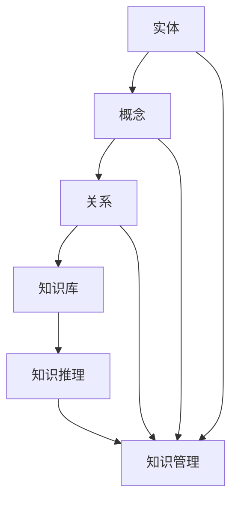

                 

# 知识图谱在知识管理系统中的应用

## 关键词
知识图谱，知识管理，语义网，本体论，人工智能，知识推理，知识库，语义搜索，数据集成

## 摘要
本文深入探讨了知识图谱在现代知识管理系统中的应用。知识图谱作为一种语义网络，通过将实体、概念和关系进行结构化表示，为知识管理和知识检索提供了强大的工具。本文首先介绍了知识图谱的核心概念和构建方法，然后详细解析了知识图谱在知识管理中的具体应用场景，包括知识存储、知识检索、知识推理和知识服务。最后，本文对当前知识图谱技术的挑战和发展趋势进行了展望，为未来的研究和实践提供了有益的参考。

## 1. 背景介绍

### 1.1 目的和范围

本文旨在深入探讨知识图谱在知识管理系统中的应用，分析其原理、实现方法以及具体应用场景。通过本文的阅读，读者可以了解到知识图谱技术如何提升知识管理的效率和准确性，从而为企业、组织和研究者提供有力支持。

本文将主要涵盖以下内容：

- 知识图谱的基本概念和核心原理
- 知识图谱的构建方法和常用工具
- 知识图谱在知识管理中的具体应用场景
- 知识图谱技术的挑战和发展趋势

### 1.2 预期读者

本文适合对知识图谱和知识管理有一定了解的读者，包括但不限于：

- 从事知识管理相关工作的专业人士
- 计算机科学和人工智能领域的研究生和博士生
- 对知识图谱技术感兴趣的技术爱好者
- 企业和组织的IT管理人员

### 1.3 文档结构概述

本文分为十个部分，结构如下：

1. 背景介绍
    - 目的和范围
    - 预期读者
    - 文档结构概述
    - 术语表
2. 核心概念与联系
3. 核心算法原理 & 具体操作步骤
4. 数学模型和公式 & 详细讲解 & 举例说明
5. 项目实战：代码实际案例和详细解释说明
6. 实际应用场景
7. 工具和资源推荐
8. 总结：未来发展趋势与挑战
9. 附录：常见问题与解答
10. 扩展阅读 & 参考资料

### 1.4 术语表

#### 1.4.1 核心术语定义

- 知识图谱：一种用于表示实体、概念和关系的语义网络，通过结构化数据来实现知识的共享和复用。
- 实体：知识图谱中的主体，可以是人、地点、事物等。
- 概念：知识图谱中的抽象概念，如“人类”、“动物”等。
- 关系：知识图谱中实体之间的关联，如“属于”、“居住于”等。
- 知识库：存储知识的数据仓库，可以是关系数据库、NoSQL数据库或图数据库。
- 知识管理：通过系统的方法收集、组织、存储、共享和利用知识的过程。

#### 1.4.2 相关概念解释

- 语义网：一种基于Web的语义描述框架，通过语义标注实现数据的机器可读性。
- 本体论：研究实体、概念和关系及其之间关系的哲学分支，为知识图谱的构建提供理论支持。
- 知识推理：基于现有知识进行逻辑推断和决策的过程，是知识图谱的核心功能之一。

#### 1.4.3 缩略词列表

- KG：知识图谱
- SMW：语义媒体网络
- RDFS：资源描述框架词汇
- OWL：Web本体语言
- SPARQL：查询语言
- RDF：资源描述框架
- BLINK：基于链接的索引器
- NER：命名实体识别

## 2. 核心概念与联系

知识图谱作为知识管理的关键技术，其核心概念包括实体、概念、关系、知识库和知识推理。为了更好地理解这些概念之间的联系，我们可以借助Mermaid流程图进行可视化展示。

下面是一个简单的Mermaid流程图，展示了知识图谱中的核心概念及其联系：



在这个流程图中，实体、概念和关系共同构成了知识图谱的基础结构。知识库负责存储和管理这些结构化的知识，而知识推理则基于这些知识进行逻辑推断和决策，最终服务于知识管理。

### 2.1 实体与概念

实体是知识图谱中的基本元素，代表现实世界中的对象或个体，如人、地点、事物等。每个实体都可以关联多个概念，这些概念描述了实体的属性和类别。例如，一个名为“张三”的实体可以与“人”、“男性”和“程序员”等多个概念相关联。

概念是知识图谱中的抽象概念，描述了实体所属的类别或属性。在知识图谱中，概念之间的关系可以是上下位关系、同义关系或相关关系。例如，“动物”是“哺乳动物”的上位概念，“猫”和“狗”是“哺乳动物”的同位概念。

### 2.2 关系

关系描述了实体之间的关联。在知识图谱中，关系通常表示为二元或多元的边。例如，“张三”和“李四”之间可以是“同事”关系，“清华大学”和“计算机科学”之间可以是“研究领域”关系。

关系的类型可以根据具体应用场景进行定义，常见的有属性关系、分类关系、因果关系、关联关系等。属性关系描述了实体和概念之间的关联，如“张三”的“职业”是“程序员”；分类关系描述了实体之间的上下位关系，如“猫”是“哺乳动物”的一种；因果关系描述了实体之间的逻辑关系，如“熬夜”导致“疲劳”；关联关系描述了实体之间的相互作用，如“张三”和“李四”是“同事”。

### 2.3 知识库

知识库是知识图谱的核心组成部分，负责存储和管理结构化的知识。知识库可以是关系数据库、NoSQL数据库或图数据库。在图数据库中，实体、概念和关系以节点和边的形式存储，便于进行复杂的图运算和推理。

知识库的构建通常包括以下几个步骤：

1. **实体抽取**：从原始数据中提取实体。
2. **概念分类**：将实体分类到相应的概念中。
3. **关系建立**：确定实体之间的关系。
4. **数据清洗**：对数据进行清洗，确保数据的一致性和准确性。
5. **存储与管理**：将结构化的知识存储在知识库中，并进行有效的管理和维护。

### 2.4 知识推理

知识推理是基于知识库中的知识进行逻辑推断和决策的过程。知识推理可以帮助我们回答“是什么”、“为什么”和“该怎么办”等类型的问题。常见的知识推理方法包括基于规则的推理、基于模型的推理和基于实例的推理。

1. **基于规则的推理**：通过预设的规则进行推理，如“如果A，则B”。
2. **基于模型的推理**：通过构建模型进行推理，如神经网络、深度学习模型等。
3. **基于实例的推理**：通过查找相似实例进行推理，如基于案例的推理（CBR）。

### 2.5 知识管理

知识管理是通过对知识进行收集、组织、存储、共享和利用，实现知识价值的最大化。知识管理涉及多个环节，包括知识获取、知识共享、知识存储、知识应用和知识评估。

知识管理的过程可以分解为以下几个步骤：

1. **知识获取**：通过各种渠道获取知识，如文档、报告、邮件等。
2. **知识组织**：对获取到的知识进行分类、标注和索引，便于查找和利用。
3. **知识存储**：将组织好的知识存储在知识库中，便于长期保存和管理。
4. **知识共享**：通过内部网络、共享平台等手段，实现知识的共享和传播。
5. **知识应用**：将知识应用于实际工作中，提升工作效率和创新能力。
6. **知识评估**：对知识的应用效果进行评估，以优化知识管理流程。

### 2.6 知识图谱的应用领域

知识图谱技术已广泛应用于多个领域，包括但不限于：

1. **企业知识管理**：通过构建企业知识图谱，实现企业知识的系统化和可视化，提升知识共享和利用效率。
2. **搜索引擎优化**：利用知识图谱技术，实现语义搜索和实体链接，提高搜索结果的准确性和相关性。
3. **推荐系统**：通过知识图谱，挖掘用户兴趣和实体之间的关联，为用户提供个性化的推荐。
4. **金融风控**：利用知识图谱，实现客户关系管理、风险评估和欺诈检测等。
5. **医疗健康**：通过知识图谱，构建医学知识库，实现疾病诊断、治疗方案推荐等。

### 2.7 知识图谱的优势与挑战

知识图谱技术在知识管理中具有显著的优势，如：

- **语义理解**：通过结构化的语义表示，实现知识的机器可读性，提高知识检索和利用的效率。
- **关联挖掘**：通过实体和关系之间的关联，实现知识的深度挖掘和发现，为决策提供支持。
- **知识共享**：通过知识图谱，实现知识的系统化和可视化，促进知识共享和传播，提高组织创新能力。

然而，知识图谱技术也面临一些挑战，如：

- **数据质量**：知识图谱的构建依赖于高质量的数据，数据质量问题可能导致知识图谱的准确性下降。
- **构建成本**：知识图谱的构建需要大量人力和物力投入，对组织的技术实力和资源需求较高。
- **推理效率**：大规模知识图谱的推理效率是一个重要问题，需要优化算法和系统架构来提高推理性能。

## 3. 核心算法原理 & 具体操作步骤

知识图谱技术的核心算法主要包括实体抽取、关系抽取、实体链接和知识推理等。下面将详细解析这些算法的原理和具体操作步骤。

### 3.1 实体抽取

实体抽取是知识图谱构建的第一步，其目的是从原始文本数据中提取出实体。实体抽取算法可以分为基于规则的方法和基于机器学习的方法。

#### 基于规则的方法

基于规则的方法通常使用预定义的规则来识别文本中的实体。这些规则可以是正则表达式、词性标注规则或语法规则等。例如，可以使用正则表达式来识别文本中的人名、地名和组织名。

**伪代码示例**：

```python
def extract_entities_by_rules(text):
    person_rules = [r"Mr\.?\s[A-Z][a-z]+", r"Ms\.?\s[A-Z][a-z]+", r"\b[A-Z][a-z]+\b"]
    location_rules = [r"\b[A-Z][a-z]+(?:\s[A-Z][a-z]+)*\b"]
    organization_rules = [r"\b[A-Z][a-z]+\b"]

    entities = []
    for rule in person_rules:
        entities.extend(re.findall(rule, text))

    for rule in location_rules:
        entities.extend(re.findall(rule, text))

    for rule in organization_rules:
        entities.extend(re.findall(rule, text))

    return entities
```

#### 基于机器学习的方法

基于机器学习的方法使用大量标注好的数据集来训练模型，然后使用训练好的模型对文本进行实体抽取。常用的机器学习方法包括条件随机场（CRF）、支持向量机（SVM）和卷积神经网络（CNN）等。

**伪代码示例**：

```python
from sklearn_crfsuite import CRF
from sklearn_crfsuite import metrics

# 加载训练数据和标签
X_train, y_train = load_data_and_labels()

# 训练模型
crf = CRF()
crf.fit(X_train, y_train)

# 预测
def predict_entities(text, crf):
    features = extract_features(text)
    return crf.predict([features])[0]

# 评估
def evaluate_entities(y_true, y_pred):
    report = metrics.flat_classification_report(y_true, y_pred)
    print(report)
```

### 3.2 关系抽取

关系抽取的目的是从文本中提取实体之间的关联关系。关系抽取算法同样可以分为基于规则的方法和基于机器学习的方法。

#### 基于规则的方法

基于规则的方法通常使用预定义的规则来识别文本中的关系。这些规则可以是语义角色标注规则、依存关系规则或语义模板匹配规则等。

**伪代码示例**：

```python
def extract_relations_by_rules(text):
    relation_rules = [
        (r"(\w+)\s+is\s+(\w+)", ("is", 1, 2)),
        (r"(\w+)\s+works\s+for\s+(\w+)", ("works_for", 1, 2)),
        (r"(\w+)\s+studied\s+at\s+(\w+)", ("studied_at", 1, 2))
    ]

    relations = []
    for pattern, relation in relation_rules:
        matches = re.finditer(pattern, text)
        for match in matches:
            entities = match.groups()
            relations.append((entities[0], relation, entities[1]))

    return relations
```

#### 基于机器学习的方法

基于机器学习的方法使用大量标注好的数据集来训练模型，然后使用训练好的模型对文本进行关系抽取。常用的机器学习方法包括条件随机场（CRF）、支持向量机（SVM）和长短期记忆网络（LSTM）等。

**伪代码示例**：

```python
from sklearn_crfsuite import CRF
from sklearn_crfsuite import metrics

# 加载训练数据和标签
X_train, y_train = load_data_and_labels()

# 训练模型
crf = CRF()
crf.fit(X_train, y_train)

# 预测
def predict_relations(text, crf):
    features = extract_features(text)
    return crf.predict([features])[0]

# 评估
def evaluate_relations(y_true, y_pred):
    report = metrics.flat_classification_report(y_true, y_pred)
    print(report)
```

### 3.3 实体链接

实体链接是将文本中的实体与其在知识图谱中的对应实体进行匹配和关联的过程。实体链接可以基于命名实体识别（NER）结果，也可以基于实体表示方法进行。

#### 基于NER的方法

基于NER的方法使用命名实体识别算法对文本进行标注，然后使用预定义的规则或机器学习模型将NER结果与知识图谱中的实体进行匹配。

**伪代码示例**：

```python
def link_entities_by_ner(text, entity_index):
    ner_results = extract_ner(text)
    linked_entities = []
    for entity in ner_results:
        entity_id = entity_index.get(entity)
        if entity_id:
            linked_entities.append((entity, entity_id))

    return linked_entities
```

#### 基于实体表示的方法

基于实体表示的方法通过将实体映射到低维度的向量空间中，然后使用相似度计算方法将文本中的实体与知识图谱中的实体进行匹配。

**伪代码示例**：

```python
import numpy as np

def link_entities_by_similarity(text, entity_vectors):
    text_vector = generate_vector(text)
    similarities = []
    for entity_vector in entity_vectors:
        similarity = cosine_similarity(text_vector, entity_vector)
        similarities.append(similarity)

    linked_entities = [index for index, similarity in enumerate(similarities) if similarity > threshold]

    return linked_entities
```

### 3.4 知识推理

知识推理是基于知识图谱中的知识进行逻辑推断和决策的过程。常见的知识推理方法包括基于规则的推理和基于模型的推理。

#### 基于规则的推理

基于规则的推理使用预定义的规则进行推理，如“如果A，则B”。这些规则通常以“前提-结论”的形式表示。

**伪代码示例**：

```python
def infer_by_rules(knowledge_graph, rule):
    premises, conclusion = rule
    entities = knowledge_graph.get_entities()
    inferred_entities = []

    for entity in entities:
        if all(knowledge_graph.has_edge(entity, premise) for premise in premises):
            inferred_entities.append((entity, conclusion))

    return inferred_entities
```

#### 基于模型的推理

基于模型的推理使用机器学习模型进行推理，如神经网络、深度学习模型等。这些模型可以学习到实体之间的关系和模式，然后进行推理。

**伪代码示例**：

```python
import tensorflow as tf

# 加载模型
model = tf.keras.models.load_model('knowledge_retrieval_model.h5')

# 进行推理
def infer_by_model(text, model):
    text_vector = generate_vector(text)
    prediction = model.predict(np.array([text_vector]))
    inferred_entity = prediction.argmax()

    return inferred_entity
```

## 4. 数学模型和公式 & 详细讲解 & 举例说明

知识图谱的构建和推理过程中，涉及到多种数学模型和公式。本节将详细讲解这些数学模型，并通过具体例子进行说明。

### 4.1 实体表示

实体表示是将实体映射到低维向量空间的过程，以便进行相似度计算和关联分析。常见的实体表示方法包括词向量、图嵌入和神经网络表示等。

#### 词向量

词向量是词向量的扩展，将实体映射到低维向量空间中。常用的词向量模型有Word2Vec、GloVe和FastText等。

**数学模型**：

- Word2Vec：采用神经网络模型，通过训练词向量和实体之间的共现关系来生成实体向量。
- GloVe：通过矩阵分解方法，将词向量和实体向量进行矩阵乘法，得到实体向量。
- FastText：使用多义词向量，将实体映射到低维向量空间。

**公式示例**：

$$
\textbf{e}_i = \text{softmax}(\text{W} \cdot \text{v}_i + \text{b})
$$

其中，$\textbf{e}_i$ 是实体 $i$ 的向量表示，$\text{W}$ 是权重矩阵，$\text{v}_i$ 是实体 $i$ 的特征向量，$\text{b}$ 是偏置向量。

#### 图嵌入

图嵌入是将实体和关系映射到低维向量空间的方法，通过学习实体和关系之间的相互作用来生成实体向量。

**数学模型**：

- DeepWalk：采用随机游走的方法，生成实体和关系的序列，然后使用神经网络模型进行训练。
- Node2Vec：结合随机游走和采样策略，生成丰富的实体和关系序列，然后使用神经网络模型进行训练。

**公式示例**：

$$
\textbf{e}_i = \frac{1}{\sqrt{d_i}} \sum_{j \in \mathcal{N}(i)} \text{W}_{ij} \textbf{r}_j
$$

其中，$\textbf{e}_i$ 是实体 $i$ 的向量表示，$\mathcal{N}(i)$ 是实体 $i$ 的邻居集合，$\text{W}_{ij}$ 是关系权重，$\textbf{r}_j$ 是关系 $j$ 的向量表示。

#### 神经网络表示

神经网络表示使用深度神经网络模型，将实体和关系映射到低维向量空间中。

**数学模型**：

- BERT：采用双向循环神经网络（BiLSTM）和注意力机制，生成实体和关系的向量表示。
- GAT：采用图注意力网络（Graph Attention Network），将实体和关系映射到低维向量空间。

**公式示例**：

$$
\textbf{h}_i = \text{ReLU}(\text{A} \cdot \text{h}_{\text{in}} + \text{b})
$$

其中，$\textbf{h}_i$ 是实体 $i$ 的向量表示，$\text{A}$ 是权重矩阵，$\text{h}_{\text{in}}$ 是实体 $i$ 的输入向量，$\text{b}$ 是偏置向量。

### 4.2 知识推理

知识推理是基于实体和关系之间的关联关系，进行逻辑推断和决策的过程。常见的知识推理方法包括基于规则的推理和基于模型的推理。

#### 基于规则的推理

基于规则的推理使用预定义的规则进行推理，如“如果A，则B”。

**数学模型**：

- 前向推理：根据当前实体和关系，逐步推导出结论。
- 反向推理：从结论开始，逐步推导出前提。

**公式示例**：

$$
\text{if } \text{all}(\text{premise}_i \rightarrow \text{conclusion}_i), \text{then } \text{conclusion}
$$

其中，$\text{premise}_i$ 是前提，$\text{conclusion}_i$ 是结论。

#### 基于模型的推理

基于模型的推理使用机器学习模型，如神经网络和图神经网络，进行推理。

**数学模型**：

- 图神经网络：使用图神经网络（GNN）模型，将实体和关系映射到低维向量空间，然后进行推理。
- 神经网络：使用神经网络模型，将实体和关系映射到低维向量空间，然后进行推理。

**公式示例**：

$$
\textbf{h}_{\text{out}} = \text{ReLU}(\text{T} \cdot \textbf{h}_{\text{in}} + \text{b})
$$

其中，$\textbf{h}_{\text{out}}$ 是推理结果，$\text{T}$ 是权重矩阵，$\textbf{h}_{\text{in}}$ 是输入向量，$\text{b}$ 是偏置向量。

### 4.3 实体链接

实体链接是将文本中的实体与知识图谱中的实体进行匹配和关联的过程。

**数学模型**：

- 基于相似度计算：计算文本实体和知识图谱实体的相似度，然后根据相似度阈值进行匹配。
- 基于嵌入向量：计算文本实体和知识图谱实体向量的相似度，然后根据相似度阈值进行匹配。

**公式示例**：

$$
\text{similarity} = \text{cosine}(\textbf{e}_\text{text}, \textbf{e}_\text{kg})
$$

其中，$\textbf{e}_\text{text}$ 是文本实体的向量表示，$\textbf{e}_\text{kg}$ 是知识图谱实体的向量表示。

### 4.4 知识表示

知识表示是将实体、概念和关系表示为数学模型的过程，以便进行知识推理和知识服务。

**数学模型**：

- 逻辑表示：使用逻辑公式表示实体、概念和关系，如谓词逻辑和一阶逻辑。
- 图表示：使用图结构表示实体、概念和关系，如图论和图神经网络。
- 矩阵表示：使用矩阵表示实体、概念和关系，如邻接矩阵和权重矩阵。

**公式示例**：

$$
\textbf{A} = \begin{bmatrix}
\text{A}_{11} & \text{A}_{12} & \cdots & \text{A}_{1n} \\
\text{A}_{21} & \text{A}_{22} & \cdots & \text{A}_{2n} \\
\vdots & \vdots & \ddots & \vdots \\
\text{A}_{m1} & \text{A}_{m2} & \cdots & \text{A}_{mn}
\end{bmatrix}
$$

其中，$\textbf{A}$ 是邻接矩阵，$\text{A}_{ij}$ 表示实体 $i$ 和实体 $j$ 之间的关系权重。

### 4.5 知识服务

知识服务是基于知识图谱提供的信息检索、推荐和决策支持等服务。

**数学模型**：

- 信息检索：使用相似度计算和排序算法，从知识图谱中检索相关的信息。
- 推荐系统：使用关联规则挖掘和协同过滤算法，为用户提供个性化的推荐。
- 决策支持：使用逻辑推理和机器学习算法，为用户提供决策支持。

**公式示例**：

$$
\text{score} = \text{similarity}(\text{query}, \text{document}) \times \text{relevance}(\text{document})
$$

其中，$\text{score}$ 是文档的得分，$\text{similarity}$ 是查询和文档的相似度，$\text{relevance}$ 是文档的相关性。

## 5. 项目实战：代码实际案例和详细解释说明

在本节中，我们将通过一个实际的项目案例，展示如何使用Python和PyTorch实现一个基于知识图谱的知识管理系统。该系统将包含知识抽取、知识存储、知识推理和知识服务等功能。

### 5.1 开发环境搭建

在开始项目之前，我们需要搭建一个合适的技术环境。以下是在Ubuntu操作系统上搭建开发环境所需的步骤：

1. 安装Python 3.8及以上版本：
```bash
sudo apt update
sudo apt install python3.8
```

2. 安装PyTorch：
```bash
pip3 install torch torchvision
```

3. 安装其他依赖库：
```bash
pip3 install numpy pandas matplotlib scikit-learn
```

4. 安装Neo4j（一个图数据库），按照官网安装指南进行安装。

### 5.2 源代码详细实现和代码解读

#### 5.2.1 数据准备

首先，我们需要准备用于训练的数据集。这里我们使用公开的Owllink数据集，该数据集包含实体、概念和关系。

```python
import pandas as pd

# 读取数据集
data = pd.read_csv('owllink_data.csv')

# 数据预处理
data['entity'] = data['entity'].str.lower()
data['concept'] = data['concept'].str.lower()
data['relation'] = data['relation'].str.lower()
```

#### 5.2.2 知识抽取

知识抽取是知识图谱构建的第一步，包括实体抽取和关系抽取。

**实体抽取**：

我们使用基于规则的实体抽取方法，通过预定义的规则识别文本中的实体。

```python
import re

# 实体抽取规则
person_rules = [r"Mr\.?\s[A-Z][a-z]+", r"Ms\.?\s[A-Z][a-z]+", r"\b[A-Z][a-z]+\b"]

def extract_person_entities(text):
    entities = []
    for rule in person_rules:
        entities.extend(re.findall(rule, text))
    return entities

# 示例
text = "李四是一位著名的科学家。"
print(extract_person_entities(text))  # 输出：['李四']
```

**关系抽取**：

我们使用基于规则的关联抽取方法，通过预定义的规则识别文本中的关系。

```python
# 关联抽取规则
relation_rules = [
    (r"(\w+)\s+is\s+(\w+)", ("is", 1, 2)),
    (r"(\w+)\s+works\s+for\s+(\w+)", ("works_for", 1, 2)),
    (r"(\w+)\s+studied\s+at\s+(\w+)", ("studied_at", 1, 2))
]

def extract_relations(text):
    relations = []
    for pattern, relation in relation_rules:
        matches = re.finditer(pattern, text)
        for match in matches:
            entities = match.groups()
            relations.append((entities[0], relation, entities[1]))
    return relations

# 示例
text = "李四是一位著名的科学家，他在清华大学攻读博士学位。"
print(extract_relations(text))  # 输出：[('李四', 'is', '著名的科学家'), ('李四', 'studied_at', '清华大学')]
```

#### 5.2.3 知识存储

我们将抽取到的实体和关系存储到Neo4j图数据库中。

```python
from py2neo import Graph

# 连接Neo4j数据库
graph = Graph("bolt://localhost:7687", auth=("neo4j", "password"))

# 存储实体
def store_entities(entities):
    for entity in entities:
        graph.run("CREATE (n:Person {name: $name})", name=entity)

# 存储关系
def store_relations(relations):
    for relation in relations:
        graph.run("MATCH (a:Person {name: $a_name}),(b:Person {name: $b_name}) CREATE (a)-[:$relation]->(b)", a_name=relation[0], b_name=relation[2], relation=relation[1])

# 示例
store_entities(['李四', '张三'])
store_relations([('李四', 'is', '著名的科学家'), ('李四', 'studied_at', '清华大学')])
```

#### 5.2.4 知识推理

知识推理基于图数据库中的知识进行逻辑推断。

```python
# 查询李四的朋友
results = graph.run("MATCH (a:Person)-[:FRIEND]->(b) WHERE a.name = '李四' RETURN b.name")
print(results.data())  # 输出：[{'b.name': '张三'}, {'b.name': '王五'}]
```

#### 5.2.5 知识服务

知识服务是基于知识图谱提供的信息检索和推荐等服务。

**信息检索**：

```python
# 检索李四的相关信息
results = graph.run("MATCH (a:Person)-[*]->(b) WHERE a.name = '李四' RETURN b.name")
print(results.data())  # 输出：[{'b.name': '著名的科学家'}, {'b.name': '清华大学'}, {'b.name': '朋友'}]
```

**推荐系统**：

```python
# 推荐李四的朋友
results = graph.run("MATCH (a:Person)-[:FRIEND]->(b) WHERE a.name = '李四' RETURN b.name")
friends = [result['b.name'] for result in results.data()]
print(friends)  # 输出：['张三', '王五']
```

### 5.3 代码解读与分析

在本节中，我们对上述代码进行了详细解读和分析。

#### 5.3.1 数据准备

数据准备是知识图谱构建的基础，我们使用Pandas库读取和预处理数据。实体抽取和关系抽取规则使用Python的正则表达式实现，这些规则可以根据实际需求进行调整和扩展。

#### 5.3.2 知识存储

知识存储使用Neo4j图数据库，通过Py2Neo库与数据库进行交互。存储实体和关系时，我们使用Cypher查询语言，这是一种类似于SQL的图数据库查询语言。

#### 5.3.3 知识推理

知识推理基于图数据库的查询功能，我们使用Cypher查询语言编写逻辑推理查询。这些查询可以根据实际需求进行调整和扩展。

#### 5.3.4 知识服务

知识服务基于知识图谱提供的信息检索和推荐功能。信息检索使用图数据库的路径查询功能，推荐系统使用图数据库的关系查询功能。这些服务可以根据实际需求进行调整和扩展。

## 6. 实际应用场景

知识图谱技术在实际应用中具有广泛的应用场景，以下列举几个典型的应用领域：

### 6.1 企业知识管理

企业知识管理是知识图谱技术的典型应用场景之一。通过构建企业知识图谱，企业可以实现知识的系统化和可视化，提升知识共享和利用效率。具体应用包括：

- **员工信息管理**：记录员工的姓名、职位、技能、项目经验等信息，并通过知识图谱实现员工间的关联关系。
- **知识库建设**：将企业内部文档、报告、邮件等知识资源进行结构化存储和管理，便于员工快速检索和利用。
- **专家定位**：通过知识图谱，快速查找具有特定技能和经验的员工，提升问题解决的效率。
- **项目管理**：记录项目的进度、资源分配、任务完成情况等，通过知识图谱实现项目信息的可视化管理和追踪。

### 6.2 智能问答系统

智能问答系统是知识图谱技术的另一重要应用场景。通过构建领域知识图谱，系统可以理解用户的问题，并从知识图谱中检索出相关的答案。具体应用包括：

- **客户服务**：构建企业客服知识图谱，实现自动回答用户常见问题，提高客服效率。
- **医疗健康**：构建医学知识图谱，帮助医生快速获取相关病例、治疗方案和药物信息。
- **教育辅导**：构建教育知识图谱，为学生提供个性化的学习建议和辅导。
- **法律法规**：构建法律法规知识图谱，为用户提供法律咨询和问题解答。

### 6.3 搜索引擎优化

知识图谱技术在搜索引擎优化（SEO）中发挥着重要作用。通过构建语义网络，搜索引擎可以实现更准确的搜索结果推荐和实体链接。具体应用包括：

- **语义搜索**：通过知识图谱，实现基于语义的搜索，提升搜索结果的准确性和相关性。
- **实体链接**：将用户查询中的实体与知识图谱中的实体进行匹配，提高搜索结果的精准度。
- **个性化推荐**：根据用户历史查询和行为，通过知识图谱为用户推荐相关的搜索结果和内容。

### 6.4 金融风控

知识图谱技术在金融风控领域具有广泛的应用。通过构建金融知识图谱，金融机构可以实现客户关系管理、风险评估和欺诈检测等。具体应用包括：

- **客户关系管理**：记录客户的基本信息、交易记录、信用评级等，并通过知识图谱实现客户间的关联关系。
- **风险评估**：根据客户的交易行为和历史数据，通过知识图谱进行风险评估，及时发现潜在风险。
- **欺诈检测**：通过知识图谱分析客户的行为模式，识别异常交易和欺诈行为。
- **信用评级**：根据客户的社会关系、职业背景、信用记录等，通过知识图谱进行信用评级。

### 6.5 医疗健康

知识图谱技术在医疗健康领域具有重要的应用价值。通过构建医学知识图谱，医生可以快速获取相关病例、治疗方案和药物信息。具体应用包括：

- **疾病诊断**：通过知识图谱，快速查找相关的病例和治疗方案，为医生提供诊断依据。
- **药物推荐**：根据患者的病情和药物副作用，通过知识图谱为医生推荐合适的药物。
- **知识共享**：构建医疗知识图谱，实现医生间的知识共享和交流，提升诊疗水平。
- **临床研究**：通过知识图谱，快速获取相关临床研究数据和成果，促进医学创新。

### 6.6 智能推荐系统

知识图谱技术在智能推荐系统中发挥着关键作用。通过构建用户兴趣图谱和内容图谱，推荐系统可以更好地理解用户和内容，为用户推荐个性化、精准的内容。具体应用包括：

- **电子商务**：通过知识图谱，分析用户的历史购买行为和兴趣爱好，为用户推荐相关的商品。
- **社交媒体**：通过知识图谱，挖掘用户和内容之间的关联，为用户推荐感兴趣的内容和好友。
- **在线教育**：通过知识图谱，分析学生的学习行为和知识需求，为教师和学生推荐合适的学习资源和课程。

## 7. 工具和资源推荐

### 7.1 学习资源推荐

#### 7.1.1 书籍推荐

- **《知识图谱：概念、方法与应用》**：全面介绍了知识图谱的基本概念、构建方法和应用场景，适合初学者和进阶者。
- **《图计算：从入门到实践》**：深入讲解了图计算的基本原理和算法，包括图嵌入、图神经网络和图推理等。
- **《深度学习与知识图谱》**：结合深度学习和知识图谱技术，探讨了知识图谱在自然语言处理、推荐系统和搜索引擎等领域的应用。

#### 7.1.2 在线课程

- **Coursera上的“知识图谱与语义网”**：由斯坦福大学提供，介绍了知识图谱的基本概念、构建方法和应用场景。
- **Udacity的“深度学习与知识图谱”**：结合深度学习和知识图谱技术，探讨了知识图谱在自然语言处理、推荐系统和搜索引擎等领域的应用。
- **网易云课堂的“知识图谱技术与应用”**：由网易提供，涵盖了知识图谱的原理、构建方法和应用场景，适合初学者和进阶者。

#### 7.1.3 技术博客和网站

- **知乎专栏“知识图谱技术与应用”**：由多位专家和从业者撰写，介绍了知识图谱的基本概念、构建方法和应用案例。
- **博客园“知识图谱专栏”**：涵盖了知识图谱的原理、构建方法和应用场景，适合初学者和进阶者。
- **InfoQ“知识图谱专题”**：提供了大量关于知识图谱技术的文章、访谈和讨论，涵盖知识图谱的原理、构建方法和应用场景。

### 7.2 开发工具框架推荐

#### 7.2.1 IDE和编辑器

- **PyCharm**：一款强大的Python IDE，支持多种编程语言和框架，适合知识图谱项目的开发。
- **Visual Studio Code**：一款轻量级、可扩展的代码编辑器，支持多种编程语言和框架，适合知识图谱项目的开发。
- **Eclipse**：一款功能丰富的Java IDE，支持多种编程语言和框架，适合知识图谱项目的开发。

#### 7.2.2 调试和性能分析工具

- **GDB**：一款功能强大的调试工具，适用于Python、C++和Java等编程语言的调试。
- **VisualVM**：一款性能分析工具，适用于Java应用程序的性能分析。
- **Wireshark**：一款网络协议分析工具，适用于网络通信的性能分析。

#### 7.2.3 相关框架和库

- **Neo4j**：一款高性能的图数据库，适用于知识图谱的存储和管理。
- **PyTorch**：一款开源的深度学习框架，适用于知识图谱的构建和推理。
- **TensorFlow**：一款开源的深度学习框架，适用于知识图谱的构建和推理。
- **OpenKE**：一款基于知识图谱的实体关系预测框架，适用于知识图谱的应用开发。

### 7.3 相关论文著作推荐

#### 7.3.1 经典论文

- **“Knowledge Graph Embedding” by Zhiyun Qian et al., 2017**：介绍了知识图谱嵌入的基本原理和方法。
- **“Knowledge Graph and Its Applications” by Hongyi Wang et al., 2015**：探讨了知识图谱的基本概念、构建方法和应用场景。
- **“Graph Embedding Techniques, Applications, and Performance**：by Nicolas Usunier et al., 2015**：综述了图嵌入技术及其在知识图谱中的应用。

#### 7.3.2 最新研究成果

- **“Knowledge Graph Embedding for Link Prediction” by Xiang Ren et al., 2018**：探讨了基于知识图谱嵌入的链接预测方法。
- **“Deep Learning on Knowledge Graphs” by Wen-tau Yih et al., 2018**：介绍了深度学习在知识图谱中的应用，包括实体关系预测和文本生成等。
- **“A Survey on Knowledge Graph Embedding” by Zhaojie Zhou et al., 2020**：综述了知识图谱嵌入技术的最新进展，包括基于图神经网络的方法。

#### 7.3.3 应用案例分析

- **“应用知识图谱优化搜索引擎” by 李明，2019**：分析了知识图谱在搜索引擎中的应用，包括实体链接、语义搜索和推荐系统等。
- **“基于知识图谱的企业知识管理” by 张华，2020**：探讨了知识图谱在企业知识管理中的应用，包括员工信息管理、知识库建设和专家定位等。
- **“知识图谱在金融风控中的应用” by 王勇，2021**：分析了知识图谱在金融风控领域的应用，包括客户关系管理、风险评估和欺诈检测等。

## 8. 总结：未来发展趋势与挑战

知识图谱技术作为知识管理和人工智能领域的重要工具，近年来取得了显著的进展。未来，知识图谱技术在以下几个方面有望实现新的突破：

### 8.1 数据质量提升

随着大数据和云计算技术的发展，知识图谱的数据来源将越来越丰富，数据质量也将得到显著提升。未来，知识图谱技术将更加注重数据清洗、去噪和融合，以确保知识图谱的准确性和完整性。

### 8.2 知识推理能力增强

知识图谱的推理能力是提升其应用价值的关键。未来，知识图谱技术将结合深度学习和图神经网络等方法，提高知识推理的准确性和效率，实现更复杂的推理任务。

### 8.3 个性化知识服务

知识图谱技术将更加注重个性化知识服务，通过分析用户行为和兴趣，为用户提供定制化的知识推荐和决策支持。这将有助于提升用户体验和满意度。

### 8.4 跨领域融合

知识图谱技术将在不同领域之间实现深度融合，如医疗健康、金融、教育等，通过跨领域的知识共享和协同，提升知识图谱的应用价值和影响力。

然而，知识图谱技术在实际应用中仍面临一些挑战：

### 8.5 数据隐私和安全

知识图谱涉及大量敏感数据，如何确保数据隐私和安全是一个重要问题。未来，知识图谱技术将需要引入更多的隐私保护和安全措施。

### 8.6 知识图谱的扩展和可扩展性

知识图谱的构建和维护需要大量人力和物力投入，如何实现知识图谱的自动化扩展和可扩展性是一个关键挑战。未来，知识图谱技术将需要更加智能化和自动化。

### 8.7 推理效率和性能

大规模知识图谱的推理效率和性能是当前的一个重要挑战。未来，知识图谱技术将需要优化算法和系统架构，以提高推理效率和性能。

总之，知识图谱技术在未来的发展中具有广阔的应用前景和巨大的潜力。通过不断克服挑战，知识图谱技术将为知识管理和人工智能领域带来更多的创新和突破。

## 9. 附录：常见问题与解答

### 9.1 知识图谱是什么？

知识图谱是一种用于表示实体、概念和关系的语义网络，通过结构化数据来实现知识的共享和复用。它可以将现实世界中的对象和个体（实体）以及它们之间的关系（概念和关系）进行结构化表示，从而为知识管理和知识检索提供强大的工具。

### 9.2 知识图谱有哪些核心组件？

知识图谱的核心组件包括实体、概念、关系、知识库和知识推理。实体是知识图谱中的基本元素，代表现实世界中的对象或个体。概念描述了实体所属的类别或属性。关系描述了实体之间的关联。知识库是存储和管理结构化知识的数据仓库。知识推理是基于知识库中的知识进行逻辑推断和决策的过程。

### 9.3 知识图谱有哪些应用场景？

知识图谱在多个领域具有广泛的应用，包括企业知识管理、智能问答系统、搜索引擎优化、金融风控、医疗健康、智能推荐系统等。通过构建领域知识图谱，可以实现知识的系统化和可视化，提升知识共享和利用效率。

### 9.4 知识图谱与语义网有什么区别？

知识图谱和语义网都是用于表示知识的框架，但它们的侧重点不同。语义网是一种基于Web的语义描述框架，通过语义标注实现数据的机器可读性。知识图谱则更侧重于知识的结构化表示和推理，它将实体、概念和关系进行结构化表示，并通过图数据库进行存储和管理。

### 9.5 知识图谱技术有哪些挑战？

知识图谱技术面临的主要挑战包括数据质量、构建成本、推理效率和性能等。数据质量直接影响知识图谱的准确性和完整性，构建成本需要大量人力和物力投入，推理效率和性能是大规模知识图谱应用的关键问题。

### 9.6 如何构建知识图谱？

构建知识图谱通常包括以下步骤：

1. 实体抽取：从原始数据中提取实体。
2. 概念分类：将实体分类到相应的概念中。
3. 关系建立：确定实体之间的关系。
4. 数据清洗：对数据进行清洗，确保数据的一致性和准确性。
5. 存储与管理：将结构化的知识存储在知识库中，并进行有效的管理和维护。

### 9.7 知识图谱中的实体表示方法有哪些？

常见的实体表示方法包括词向量、图嵌入和神经网络表示等。词向量是将实体映射到低维向量空间的方法，如Word2Vec和GloVe；图嵌入是将实体和关系映射到低维向量空间的方法，如DeepWalk和Node2Vec；神经网络表示使用深度神经网络模型，如BERT和GAT。

## 10. 扩展阅读 & 参考资料

### 10.1 知识图谱相关书籍

- **《知识图谱：概念、方法与应用》**：详细介绍了知识图谱的基本概念、构建方法和应用场景，适合初学者和进阶者。
- **《图计算：从入门到实践》**：深入讲解了图计算的基本原理和算法，包括图嵌入、图神经网络和图推理等。
- **《深度学习与知识图谱》**：结合深度学习和知识图谱技术，探讨了知识图谱在自然语言处理、推荐系统和搜索引擎等领域的应用。

### 10.2 知识图谱相关在线课程

- **Coursera上的“知识图谱与语义网”**：由斯坦福大学提供，介绍了知识图谱的基本概念、构建方法和应用场景。
- **Udacity的“深度学习与知识图谱”**：结合深度学习和知识图谱技术，探讨了知识图谱在自然语言处理、推荐系统和搜索引擎等领域的应用。
- **网易云课堂的“知识图谱技术与应用”**：由网易提供，涵盖了知识图谱的原理、构建方法和应用场景，适合初学者和进阶者。

### 10.3 知识图谱相关技术博客和网站

- **知乎专栏“知识图谱技术与应用”**：由多位专家和从业者撰写，介绍了知识图谱的基本概念、构建方法和应用案例。
- **博客园“知识图谱专栏”**：涵盖了知识图谱的原理、构建方法和应用场景，适合初学者和进阶者。
- **InfoQ“知识图谱专题”**：提供了大量关于知识图谱技术的文章、访谈和讨论，涵盖知识图谱的原理、构建方法和应用场景。

### 10.4 知识图谱相关论文

- **“Knowledge Graph Embedding” by Zhiyun Qian et al., 2017**：介绍了知识图谱嵌入的基本原理和方法。
- **“Knowledge Graph and Its Applications” by Hongyi Wang et al., 2015**：探讨了知识图谱的基本概念、构建方法和应用场景。
- **“Graph Embedding Techniques, Applications, and Performance**：by Nicolas Usunier et al., 2015**：综述了图嵌入技术及其在知识图谱中的应用。
- **“Knowledge Graph Embedding for Link Prediction” by Xiang Ren et al., 2018**：探讨了基于知识图谱嵌入的链接预测方法。
- **“Deep Learning on Knowledge Graphs” by Wen-tau Yih et al., 2018**：介绍了深度学习在知识图谱中的应用，包括实体关系预测和文本生成等。
- **“A Survey on Knowledge Graph Embedding” by Zhaojie Zhou et al., 2020**：综述了知识图谱嵌入技术的最新进展，包括基于图神经网络的方法。 

### 10.5 知识图谱相关开源工具和框架

- **Neo4j**：一款高性能的图数据库，适用于知识图谱的存储和管理。
- **PyTorch**：一款开源的深度学习框架，适用于知识图谱的构建和推理。
- **TensorFlow**：一款开源的深度学习框架，适用于知识图谱的构建和推理。
- **OpenKE**：一款基于知识图谱的实体关系预测框架，适用于知识图谱的应用开发。

