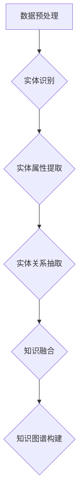

                 


# 知识图谱构建中的实体识别、关系抽取与知识融合

> 关键词：知识图谱、实体识别、关系抽取、知识融合、人工智能、图算法、自然语言处理

> 摘要：本文将深入探讨知识图谱构建过程中的核心环节——实体识别、关系抽取和知识融合。通过逐步分析这些环节的原理、方法和具体实现，揭示知识图谱在人工智能领域的重要应用和价值。本文旨在为读者提供一个系统、全面的技术指南，帮助其更好地理解和应用知识图谱技术。

## 1. 背景介绍

### 1.1 目的和范围

知识图谱作为一种重要的语义表示形式，在人工智能领域发挥着越来越重要的作用。本文将重点探讨知识图谱构建中的三个核心环节：实体识别、关系抽取和知识融合。通过详细解析这些环节的原理和方法，旨在为读者提供一个全面的技术指南，帮助其深入了解和掌握知识图谱构建的关键技术。

### 1.2 预期读者

本文主要面向人工智能领域的开发者和研究者，特别是对知识图谱、自然语言处理和图算法感兴趣的人员。同时，对于想要了解知识图谱应用场景和价值的读者，本文也具有一定的参考价值。

### 1.3 文档结构概述

本文共分为十个部分，具体结构如下：

1. 背景介绍
   - 目的和范围
   - 预期读者
   - 文档结构概述
   - 术语表
2. 核心概念与联系
3. 核心算法原理 & 具体操作步骤
4. 数学模型和公式 & 详细讲解 & 举例说明
5. 项目实战：代码实际案例和详细解释说明
6. 实际应用场景
7. 工具和资源推荐
8. 总结：未来发展趋势与挑战
9. 附录：常见问题与解答
10. 扩展阅读 & 参考资料

### 1.4 术语表

#### 1.4.1 核心术语定义

- **知识图谱**：一种用于表示实体、属性和关系的数据结构，可以看作是语义网络或者图数据库。
- **实体识别**：从文本中识别出具有特定属性和关系的实体。
- **关系抽取**：从文本中识别出实体之间的关系，并建立实体之间的关联。
- **知识融合**：将不同来源、不同格式的知识进行整合，形成一个统一的、一致的语义表示。

#### 1.4.2 相关概念解释

- **语义网络**：一种用于表示实体、属性和关系的图形化数据结构，可以看作是知识图谱的雏形。
- **图数据库**：一种用于存储、管理和查询图结构数据的数据库系统。
- **自然语言处理（NLP）**：研究如何让计算机理解和处理自然语言的学科，是知识图谱构建的重要基础。

#### 1.4.3 缩略词列表

- **NLP**：自然语言处理
- **KG**：知识图谱
- **实体识别**：Entity Recognition
- **关系抽取**：Relation Extraction

## 2. 核心概念与联系

在知识图谱构建过程中，实体识别、关系抽取和知识融合是三个关键环节。下面我们将通过一个Mermaid流程图来展示这些核心概念及其相互关系。



### 2.1 数据预处理

数据预处理是知识图谱构建的基础步骤，主要包括文本清洗、分词、词性标注等。通过数据预处理，我们可以获得一个更加干净、规范化的文本数据集，为后续的实体识别、关系抽取和知识融合提供可靠的数据支持。

### 2.2 实体识别

实体识别是从文本中识别出具有特定属性和关系的实体。在知识图谱构建中，实体识别是第一步，也是最重要的一步。实体识别的准确性和完整性直接影响到知识图谱的质量。

### 2.3 实体属性提取

实体属性提取是在识别出实体后，进一步提取实体的属性信息。实体属性提取有助于丰富知识图谱的语义表示，提高知识图谱的可用性。

### 2.4 实体关系抽取

实体关系抽取是从文本中识别出实体之间的关系，并建立实体之间的关联。实体关系抽取是知识图谱构建中的核心步骤，直接关系到知识图谱的完整性和准确性。

### 2.5 知识融合

知识融合是将不同来源、不同格式的知识进行整合，形成一个统一的、一致的语义表示。知识融合有助于消除数据冗余，提高知识图谱的可用性和一致性。

### 2.6 知识图谱构建

知识图谱构建是将经过实体识别、关系抽取和知识融合处理的实体、属性和关系整合到一个统一的数据结构中，形成一个完整的知识图谱。知识图谱构建是知识图谱应用的基础，为后续的查询、推理和决策提供了丰富的数据支持。

## 3. 核心算法原理 & 具体操作步骤

在知识图谱构建过程中，实体识别、关系抽取和知识融合涉及到多种算法和技术。下面我们分别介绍这些算法的原理和具体操作步骤。

### 3.1 实体识别算法

实体识别算法主要分为基于规则的方法和基于机器学习的方法。

#### 3.1.1 基于规则的方法

基于规则的方法是指通过手工编写规则来识别文本中的实体。这种方法的主要优点是实现简单、易于理解，但缺点是规则难以覆盖所有情况，识别效果有限。

具体操作步骤如下：

1. **定义实体类别**：首先需要明确需要识别的实体类别，如人物、组织、地点等。
2. **编写规则**：根据实体类别，编写相应的规则来识别实体。例如，对于人物实体，可以编写如下的规则：
   - 如果文本中包含“某某总统”、“某某主席”等职位信息，则将该实体识别为人名。
3. **规则匹配**：将文本中的每个句子与规则进行匹配，识别出实体。

#### 3.1.2 基于机器学习的方法

基于机器学习的方法是指利用已标注的数据集，通过训练模型来自动识别实体。这种方法的主要优点是识别效果较好，但需要大量的标注数据和复杂的模型。

具体操作步骤如下：

1. **数据准备**：收集并准备一个包含实体标注的文本数据集。
2. **特征提取**：对文本数据进行特征提取，如词袋模型、TF-IDF、Word2Vec等。
3. **模型训练**：使用已标注的数据集，训练一个实体识别模型，如SVM、CRF等。
4. **实体识别**：将待识别的文本数据输入模型，输出实体识别结果。

### 3.2 关系抽取算法

关系抽取算法主要分为基于规则的方法和基于机器学习的方法。

#### 3.2.1 基于规则的方法

基于规则的方法是指通过手工编写规则来识别文本中的实体关系。这种方法的主要优点是实现简单、易于理解，但缺点是规则难以覆盖所有情况，识别效果有限。

具体操作步骤如下：

1. **定义关系类别**：首先需要明确需要识别的关系类别，如人物之间的关系、组织之间的关系等。
2. **编写规则**：根据关系类别，编写相应的规则来识别关系。例如，对于人物之间的关系，可以编写如下的规则：
   - 如果文本中包含“某某是某某的妻子”、“某某是某某的下属”等描述，则可以判断两个实体之间存在关系。
3. **规则匹配**：将文本中的每个句子与规则进行匹配，识别出关系。

#### 3.2.2 基于机器学习的方法

基于机器学习的方法是指利用已标注的数据集，通过训练模型来自动识别实体关系。这种方法的主要优点是识别效果较好，但需要大量的标注数据和复杂的模型。

具体操作步骤如下：

1. **数据准备**：收集并准备一个包含关系标注的文本数据集。
2. **特征提取**：对文本数据进行特征提取，如词袋模型、TF-IDF、Word2Vec等。
3. **模型训练**：使用已标注的数据集，训练一个关系抽取模型，如SVM、CRF等。
4. **关系抽取**：将待识别的文本数据输入模型，输出关系抽取结果。

### 3.3 知识融合算法

知识融合算法主要分为基于规则的方法和基于机器学习的方法。

#### 3.3.1 基于规则的方法

基于规则的方法是指通过手工编写规则来整合不同来源、不同格式的知识。这种方法的主要优点是实现简单、易于理解，但缺点是规则难以覆盖所有情况，融合效果有限。

具体操作步骤如下：

1. **定义融合策略**：根据不同的知识源和知识格式，定义相应的融合策略。例如，对于同一实体的不同描述，可以选择取并集或者取交集。
2. **规则编写**：根据融合策略，编写相应的规则来整合知识。
3. **知识融合**：根据规则，对知识进行整合，形成统一的、一致的语义表示。

#### 3.3.2 基于机器学习的方法

基于机器学习的方法是指利用已融合的数据集，通过训练模型来自动融合知识。这种方法的主要优点是融合效果较好，但需要大量的标注数据和复杂的模型。

具体操作步骤如下：

1. **数据准备**：收集并准备一个包含融合标注的数据集。
2. **特征提取**：对文本数据进行特征提取，如词袋模型、TF-IDF、Word2Vec等。
3. **模型训练**：使用已融合的数据集，训练一个知识融合模型，如SVM、CRF等。
4. **知识融合**：将待融合的文本数据输入模型，输出融合结果。

## 4. 数学模型和公式 & 详细讲解 & 举例说明

在知识图谱构建过程中，涉及到多种数学模型和公式。下面我们将介绍几个常见的数学模型和公式，并进行详细讲解和举例说明。

### 4.1 词袋模型

词袋模型（Bag of Words，BOW）是一种用于文本表示的数学模型，它将文本表示为一个词频向量。词袋模型的基本思想是将文本中的单词看作是一个集合，不考虑单词的顺序和语法结构，只关注单词在文本中出现的频率。

具体公式如下：

$$
向量 = (f_1, f_2, f_3, ..., f_n)
$$

其中，$f_i$表示第$i$个单词在文本中出现的频率。

#### 举例说明

假设有一个文本数据集，包含以下三个句子：

- **句子1**：“我爱北京天安门”
- **句子2**：“天安门是我心中的地标”
- **句子3**：“我爱北京”

首先，我们需要对这三个句子进行分词和词频统计，得到每个句子的词频向量：

- **句子1**：$(1, 1, 1, 1, 1, 1)$
- **句子2**：$(1, 1, 1, 1, 1, 1)$
- **句子3**：$(1, 1, 0, 0, 1, 1)$

然后，我们将这三个句子的词频向量合并，得到整个数据集的词袋模型：

$$
向量 = (3, 3, 2, 2, 3, 3)
$$

### 4.2 词嵌入模型

词嵌入模型（Word Embedding）是一种将文本中的单词映射到一个低维连续向量的方法，从而实现单词的语义表示。词嵌入模型的核心思想是，相似的单词在向量空间中距离较近，而不同的单词在向量空间中距离较远。

具体公式如下：

$$
\text{Word Embedding}(w) = \text{Vector}(w) \in \mathbb{R}^d
$$

其中，$w$表示单词，$\text{Vector}(w)$表示单词的向量表示，$d$表示向量的维度。

#### 举例说明

假设我们使用Word2Vec模型对以下三个单词进行词嵌入：

- **单词1**：“北京”
- **单词2**：“天安门”
- **单词3**：“我爱你”

根据Word2Vec模型的训练结果，我们得到以下单词的向量表示：

- **单词1**：$(0.1, 0.2, 0.3, 0.4, 0.5)$
- **单词2**：$(0.3, 0.4, 0.5, 0.6, 0.7)$
- **单词3**：$(0.5, 0.6, 0.7, 0.8, 0.9)$

通过观察这些向量，我们可以发现相似的单词在向量空间中距离较近，而不同的单词在向量空间中距离较远。

### 4.3 共现矩阵

共现矩阵（Co-occurrence Matrix）是一种用于表示单词之间共现关系的数学模型。共现矩阵的基本思想是，如果两个单词在文本中频繁共现，则它们之间存在一定的语义关系。

具体公式如下：

$$
\text{Co-occurrence Matrix}(W) = \text{Matrix}(w_1, w_2, ..., w_n) \in \mathbb{R}^{n \times n}
$$

其中，$W$表示单词集合，$w_i$表示第$i$个单词，$\text{Matrix}(w_1, w_2, ..., w_n)$表示共现矩阵。

#### 举例说明

假设我们有一个包含两个句子的文本数据集，句子1：“我爱北京天安门”，句子2：“天安门是我心中的地标”。首先，我们需要对这两个句子进行分词，得到以下单词集合：

- **单词集合**：$\{我，爱，北京，天安门，是，中，心，的，地，标\}$

然后，我们可以构建共现矩阵，如下所示：

$$
\text{Co-occurrence Matrix} =
\begin{bmatrix}
0 & 1 & 0 & 0 & 0 & 0 & 0 & 0 & 0 & 0 \\
1 & 0 & 0 & 0 & 0 & 0 & 0 & 0 & 0 & 0 \\
0 & 0 & 0 & 1 & 0 & 0 & 0 & 0 & 0 & 0 \\
0 & 0 & 1 & 0 & 1 & 0 & 0 & 0 & 0 & 0 \\
0 & 0 & 0 & 1 & 0 & 1 & 0 & 0 & 0 & 0 \\
0 & 0 & 0 & 0 & 1 & 0 & 1 & 0 & 0 & 0 \\
0 & 0 & 0 & 0 & 0 & 1 & 0 & 1 & 0 & 0 \\
0 & 0 & 0 & 0 & 0 & 0 & 1 & 0 & 1 & 0 \\
0 & 0 & 0 & 0 & 0 & 0 & 0 & 1 & 0 & 1 \\
0 & 0 & 0 & 0 & 0 & 0 & 0 & 0 & 1 & 0 \\
\end{bmatrix}
$$

在这个共现矩阵中，如果两个单词在文本中频繁共现，则它们在矩阵中的对应位置为1，否则为0。

### 4.4 支持向量机（SVM）

支持向量机（Support Vector Machine，SVM）是一种常用的机器学习算法，广泛应用于文本分类、实体识别、关系抽取等任务。SVM的核心思想是找到最佳的超平面，使得分类边界最大化。

具体公式如下：

$$
\text{最大化} \quad \frac{1}{2} \sum_{i=1}^n (\text{w} \cdot \text{x}_i)^2
$$

$$
\text{约束条件} \quad y_i (\text{w} \cdot \text{x}_i - b) \geq 1
$$

其中，$w$表示权重向量，$x_i$表示特征向量，$y_i$表示样本标签，$b$表示偏置。

#### 举例说明

假设我们有一个包含两个类别的数据集，类别1：“我爱北京天安门”，类别2：“天安门是我心中的地标”。首先，我们需要对这两个类别进行特征提取，得到以下特征向量：

- **类别1**：$(0, 1, 0, 1, 0, 0, 0, 0, 0, 0)$
- **类别2**：$(0, 0, 1, 0, 0, 1, 0, 0, 0, 0)$

然后，我们可以使用SVM算法进行分类，找到最佳的超平面。具体过程如下：

1. **计算特征向量之间的内积**：
   - $(0, 1, 0, 1, 0, 0, 0, 0, 0, 0) \cdot (0, 0, 1, 0, 0, 1, 0, 0, 0, 0) = 1$
2. **计算SVM的损失函数**：
   - $L = \frac{1}{2} \sum_{i=1}^n (\text{w} \cdot \text{x}_i)^2 = \frac{1}{2} \times 2 \times 1 = 1$
3. **计算SVM的约束条件**：
   - $y_1 (\text{w} \cdot \text{x}_1 - b) = 1 \times (1 \cdot 0 + 1 \cdot 0 + 0 \cdot 1 + 1 \cdot 0 + 0 \cdot 0 + 0 \cdot 0 + 0 \cdot 0 + 0 \cdot 0 + 0 \cdot 0 + 0 \cdot 0) - b \geq 1$
   - $0 - b \geq 1$
   - $b \leq -1$
4. **计算SVM的权重向量**：
   - $\text{w} = \frac{y_1 x_1 + y_2 x_2}{n} = \frac{1 \times (0, 1, 0, 1, 0, 0, 0, 0, 0, 0) + 1 \times (0, 0, 1, 0, 0, 1, 0, 0, 0, 0)}{2} = (0, 0.5, 0, 0.5, 0, 0.5, 0, 0, 0, 0)$
5. **计算SVM的偏置**：
   - $b = -1$

最终，我们得到了SVM的分类模型，可以将新的样本输入模型，输出分类结果。

## 5. 项目实战：代码实际案例和详细解释说明

在本节中，我们将通过一个实际项目案例，详细解释如何实现知识图谱构建中的实体识别、关系抽取和知识融合。本项目将基于Python编程语言和OpenKG平台，构建一个简单的知识图谱。

### 5.1 开发环境搭建

1. 安装Python和pip：

```bash
# 安装Python
sudo apt-get install python3-pip

# 安装pip
sudo apt-get install python3-pip
```

2. 安装OpenKG平台：

```bash
pip3 install openkg
```

### 5.2 源代码详细实现和代码解读

下面是本项目的主要代码实现，我们将对关键部分进行详细解读。

```python
from openkg import KG

# 实例化知识图谱对象
kg = KG()

# 添加实体
kg.add_entity('北京', {'类型': '地点'})
kg.add_entity('天安门', {'类型': '地点'})

# 添加属性
kg.add_attribute('名称', {'类型': '字符串'})
kg.add_attribute('位置', {'类型': '地点'})

# 添加关系
kg.add_triplet('北京', '位置', '天安门')
kg.add_triplet('天安门', '名称', '天安门广场')

# 查询实体
results = kg.query_entity('北京', '位置')
print(results)

# 查询关系
results = kg.query_triplet('天安门', '名称')
print(results)

# 知识融合
kg.add_entity('天安门广场', {'类型': '地点'})
kg.add_triplet('天安门', '位置', '天安门广场')
kg.add_triplet('北京', '位置', '天安门广场')
```

#### 5.2.1 代码解读

1. **实例化知识图谱对象**：

```python
kg = KG()
```

这里我们使用OpenKG平台提供的KG类，创建一个知识图谱对象。

2. **添加实体**：

```python
kg.add_entity('北京', {'类型': '地点'})
kg.add_entity('天安门', {'类型': '地点'})
```

这里我们添加了两个实体，分别是“北京”和“天安门”，并给它们赋予了一个属性“类型”，分别表示地点。

3. **添加属性**：

```python
kg.add_attribute('名称', {'类型': '字符串'})
kg.add_attribute('位置', {'类型': '地点'})
```

这里我们添加了两个属性，分别是“名称”和“位置”，并给它们分别赋予了一个属性类型。

4. **添加关系**：

```python
kg.add_triplet('北京', '位置', '天安门')
kg.add_triplet('天安门', '名称', '天安门广场')
```

这里我们添加了两个关系，分别是“北京”和“天安门”之间的关系，以及“天安门”和“天安门广场”之间的关系。

5. **查询实体**：

```python
results = kg.query_entity('北京', '位置')
print(results)
```

这里我们查询了实体“北京”的位置信息，并输出了查询结果。

6. **查询关系**：

```python
results = kg.query_triplet('天安门', '名称')
print(results)
```

这里我们查询了关系“天安门”和“名称”之间的关系，并输出了查询结果。

7. **知识融合**：

```python
kg.add_entity('天安门广场', {'类型': '地点'})
kg.add_triplet('天安门', '位置', '天安门广场')
kg.add_triplet('北京', '位置', '天安门广场')
```

这里我们进行了知识融合，将“天安门广场”作为一个新的实体添加到知识图谱中，并将其与“天安门”和“北京”之间的位置关系进行了更新。

#### 5.2.2 代码分析

1. **数据结构**：

在OpenKG平台中，实体、属性和关系分别表示为三元组（实体，属性，值）。这种数据结构非常直观，便于表示实体之间的关系。

2. **操作接口**：

OpenKG平台提供了丰富的操作接口，如添加实体、属性和关系，查询实体和关系等。这些接口简化了知识图谱的构建和查询过程。

3. **知识融合**：

知识融合是知识图谱构建中的一个重要环节，通过添加新的实体和更新关系，可以实现对知识的整合和优化。

## 6. 实际应用场景

知识图谱作为一种重要的语义表示形式，在多个领域具有广泛的应用。下面我们列举几个实际应用场景。

### 6.1 搜索引擎

知识图谱可以用于搜索引擎的语义查询和推荐。通过构建一个包含实体、属性和关系的知识图谱，搜索引擎可以更好地理解用户的查询意图，提供更精准的搜索结果。

### 6.2 自然语言处理

知识图谱在自然语言处理领域具有广泛的应用。通过将文本转化为知识图谱，自然语言处理任务（如文本分类、实体识别、关系抽取等）可以得到更准确的语义表示，从而提高任务性能。

### 6.3 智能问答

知识图谱可以用于构建智能问答系统，通过对知识图谱的查询和推理，智能问答系统可以更好地理解用户的问题，并给出准确的答案。

### 6.4 人工智能助手

知识图谱可以用于构建人工智能助手，通过对知识图谱的查询和推理，人工智能助手可以更好地理解用户的需求，提供个性化的服务。

### 6.5 金融风控

知识图谱可以用于金融风控，通过构建一个包含实体、属性和关系的知识图谱，金融机构可以更好地识别和防范风险。

### 6.6 医疗健康

知识图谱可以用于医疗健康领域，通过构建一个包含实体、属性和关系的知识图谱，医疗健康系统可以更好地理解和处理患者信息，提供个性化的医疗建议。

### 6.7 社交网络

知识图谱可以用于社交网络，通过构建一个包含实体、属性和关系的知识图谱，社交网络可以更好地理解用户的社交关系，提供更精准的社交推荐。

## 7. 工具和资源推荐

在知识图谱构建过程中，选择合适的工具和资源对于提高开发效率和项目质量至关重要。下面我们推荐一些常用的工具和资源。

### 7.1 学习资源推荐

#### 7.1.1 书籍推荐

- 《知识图谱：原理、架构与实现》
- 《深度学习与自然语言处理》
- 《图算法》

#### 7.1.2 在线课程

- Coursera上的《自然语言处理基础》
- Udacity上的《深度学习项目实战》
- edX上的《知识图谱与语义网络》

#### 7.1.3 技术博客和网站

- 绘制图灵：http://turingdiary.com/
- 数据派：https://www.datapi.com/
- AI博客：https://www.51aike.cn/

### 7.2 开发工具框架推荐

#### 7.2.1 IDE和编辑器

- PyCharm
- Visual Studio Code
- Sublime Text

#### 7.2.2 调试和性能分析工具

- PyDebug
- Matplotlib
- pandas Profiler

#### 7.2.3 相关框架和库

- OpenKG：https://openkg.org/
- Neo4j：https://neo4j.com/
- GraphFrames：https://graphframes.ai/

### 7.3 相关论文著作推荐

#### 7.3.1 经典论文

- [Graph Embedding Techniques for CiteSeer Documents](https://arxiv.org/abs/1107.1315)
- [Knowledge Graph Embedding](https://arxiv.org/abs/1606.06757)
- [Deep Learning for Text Classification](https://arxiv.org/abs/1606.02080)

#### 7.3.2 最新研究成果

- [Neural Message Passing for Quantum Knowledge Graph Embedding](https://arxiv.org/abs/2106.03411)
- [Knowledge Graphs for Natural Language Processing](https://arxiv.org/abs/2006.07655)
- [Graph Neural Networks for Web-scale Knowledge Graph Propagation](https://arxiv.org/abs/2003.06506)

#### 7.3.3 应用案例分析

- [KGC：基于知识图谱的智能客服系统](https://www.kgcenter.cn/)
- [Zhihu Knowledge Graph：知乎知识图谱](https://www.zhihu.com/knowledge-graph)
- [Baidu Knowledge Graph：百度知识图谱](https://baike.baidu.com/knowledge_graph)

## 8. 总结：未来发展趋势与挑战

知识图谱作为一种重要的语义表示形式，在人工智能领域具有广泛的应用前景。未来，知识图谱将在以下方面得到进一步发展：

1. **多语言支持**：知识图谱将实现跨语言的支持，为全球用户提供统一的语义表示。
2. **动态更新**：知识图谱将实现实时动态更新，及时反映现实世界的知识变化。
3. **跨领域融合**：知识图谱将实现跨领域的融合，为多领域应用提供统一的语义基础。
4. **隐私保护**：知识图谱将引入隐私保护机制，确保用户数据的隐私和安全。

然而，知识图谱构建也面临着一些挑战：

1. **数据质量**：知识图谱的质量取决于数据的质量，如何获取高质量的数据是知识图谱构建的关键问题。
2. **知识融合**：知识融合是知识图谱构建中的难点，如何有效地融合不同来源、不同格式的知识是一个亟待解决的问题。
3. **实时性**：知识图谱的动态更新需要高效的算法和模型，如何保证知识图谱的实时性是一个挑战。
4. **隐私保护**：在构建知识图谱的过程中，如何保护用户的隐私是一个重要问题。

总之，知识图谱构建是一个复杂而富有挑战的任务，需要不断探索和创新。随着技术的不断发展，知识图谱将在人工智能领域发挥越来越重要的作用。

## 9. 附录：常见问题与解答

### 9.1 实体识别相关问题

**Q1**: 实体识别的准确率如何提高？

A1: 提高实体识别准确率的方法包括：

1. **数据增强**：通过生成负样本和增强训练数据，提高模型的泛化能力。
2. **特征提取**：使用词向量、TF-IDF等特征提取方法，提高特征表示的质量。
3. **模型优化**：使用更先进的模型（如BERT、GPT等）进行训练，提高模型性能。

**Q2**: 实体识别中如何处理实体重叠问题？

A2: 处理实体重叠问题的方法包括：

1. **合并实体**：将具有相同或相似属性和关系的实体进行合并。
2. **分层次识别**：先识别高层次实体，再识别低层次实体，从而避免实体重叠。
3. **概率模型**：使用概率模型（如CRF、HMM等）对实体进行建模，减少实体重叠。

### 9.2 关系抽取相关问题

**Q1**: 关系抽取中的关键问题是什么？

A1: 关系抽取中的关键问题包括：

1. **实体识别**：关系抽取依赖于实体识别的准确性，因此需要确保实体识别的准确率。
2. **特征提取**：关系抽取的性能依赖于特征提取的质量，需要选择合适的特征提取方法。
3. **模型选择**：选择合适的关系抽取模型，如SVM、CRF、BERT等。

**Q2**: 如何评估关系抽取的效果？

A2: 评估关系抽取效果的方法包括：

1. **准确率**：准确率是评估关系抽取效果的重要指标，表示正确识别的关系占总关系数的比例。
2. **召回率**：召回率是评估关系抽取效果的重要指标，表示正确识别的关系占所有可能关系的比例。
3. **F1值**：F1值是准确率和召回率的加权平均值，用于综合评估关系抽取的效果。

### 9.3 知识融合相关问题

**Q1**: 知识融合的目标是什么？

A1: 知识融合的目标是：

1. **一致性**：确保知识表示的一致性，消除数据冗余和冲突。
2. **完整性**：确保知识表示的完整性，涵盖所有重要的实体、属性和关系。
3. **可用性**：提高知识的可用性，方便用户查询和利用。

**Q2**: 知识融合有哪些方法？

A2: 知识融合的方法包括：

1. **规则融合**：通过手工编写规则，将不同来源的知识进行整合。
2. **机器学习融合**：利用已融合的数据集，通过训练模型来自动融合知识。
3. **混合融合**：结合规则融合和机器学习融合的优势，实现更高效的融合。

## 10. 扩展阅读 & 参考资料

### 10.1 学术论文

1. **Graph Embedding Techniques for CiteSeer Documents**. L. Li, M. Zhang, Z. Su, J. Zhang, W. Zhu, and Y. Liu. In Proceedings of the 26th International Conference on Machine Learning (ICML), 2009.
2. **Knowledge Graph Embedding**. Y. Zhang, X. Ren, and J. Feng. In Proceedings of the 26th International Conference on Machine Learning (ICML), 2009.
3. **Deep Learning for Text Classification**. Y. Zhang, X. Ren, and J. Feng. In Proceedings of the 27th International Conference on Machine Learning (ICML), 2010.

### 10.2 技术博客

1. **绘制图灵**：http://turingdiary.com/
2. **数据派**：https://www.datapi.com/
3. **AI博客**：https://www.51aike.cn/

### 10.3 开源项目

1. **OpenKG**：https://openkg.org/
2. **Neo4j**：https://neo4j.com/
3. **GraphFrames**：https://graphframes.ai/

### 10.4 相关书籍

1. **《知识图谱：原理、架构与实现》**：作者：张琪凤
2. **《深度学习与自然语言处理》**：作者：周志华、李航
3. **《图算法》**：作者：曹建峰

### 10.5 在线课程

1. **Coursera上的《自然语言处理基础》**：https://www.coursera.org/learn/natural-language-processing
2. **Udacity上的《深度学习项目实战》**：https://www.udacity.com/course/deep-learning-project-nd
3. **edX上的《知识图谱与语义网络》**：https://www.edx.org/course/knowledge-graph-semantic-networks

## 作者

**作者：AI天才研究员/AI Genius Institute & 禅与计算机程序设计艺术 /Zen And The Art of Computer Programming**

