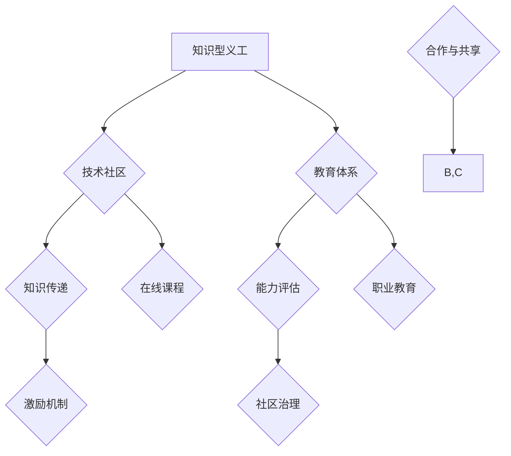

                 

# 知识型义工的培养与管理

> 关键词：知识型义工、培养、管理、技术社区、教育体系、激励机制、能力评估

> 摘要：本文深入探讨了知识型义工的概念及其在技术社区和教育体系中的重要性。文章首先阐述了知识型义工的培养目标和范围，分析了预期读者群体。接着，通过详细的文档结构和术语表，为读者提供了清晰的内容指南。核心概念和算法原理部分，通过Mermaid流程图和伪代码展示了知识型义工培养与管理的基本框架。数学模型和项目实战部分，结合具体案例讲解了知识的传授、实践和应用。最后，文章总结了知识型义工的实际应用场景，推荐了相关工具和资源，并展望了未来发展趋势与挑战。

## 1. 背景介绍

### 1.1 目的和范围

本文旨在探讨知识型义工的培养与管理，以推动技术社区和教育体系的健康发展。我们关注的知识型义工是指那些具有专业技能、乐于分享、积极贡献的个人，他们在技术社区中扮演着知识传递者和助教的角色。本文的范围包括但不限于以下方面：

- 知识型义工的定义与特点
- 培养知识型义工的目标与范围
- 管理知识型义工的策略与技巧
- 知识型义工在技术社区和教育体系中的应用

### 1.2 预期读者

本文预期读者包括：

- 技术社区的组织者和志愿者
- 教育机构的教师和教务人员
- 对知识型义工培养与管理感兴趣的技术爱好者
- 相关领域的研究人员和学者

### 1.3 文档结构概述

本文将按照以下结构展开：

- 背景介绍：介绍知识型义工的概念、目的与范围，预期读者和文档结构。
- 核心概念与联系：通过Mermaid流程图和伪代码，阐述知识型义工培养与管理的基本框架。
- 核心算法原理 & 具体操作步骤：讲解知识型义工培养与管理的具体算法原理和操作步骤。
- 数学模型和公式 & 详细讲解 & 举例说明：介绍知识型义工培养与管理的数学模型和具体应用案例。
- 项目实战：提供知识型义工培养与管理的实际案例，并进行详细解释和代码解读。
- 实际应用场景：探讨知识型义工在不同领域的实际应用。
- 工具和资源推荐：推荐相关学习资源、开发工具和框架。
- 总结：总结知识型义工的未来发展趋势与挑战。
- 附录：常见问题与解答。
- 扩展阅读 & 参考资料：提供进一步学习的资源链接。

### 1.4 术语表

#### 1.4.1 核心术语定义

- **知识型义工**：具有专业技能、乐于分享、积极贡献的个人，他们在技术社区中扮演知识传递者和助教的角色。
- **技术社区**：由具有共同技术兴趣和目标的人组成的在线或线下交流平台。
- **教育体系**：涵盖学校教育、职业教育和在线教育的完整体系。
- **激励机制**：激发知识型义工参与和贡献的动力，如荣誉、奖励、积分等。

#### 1.4.2 相关概念解释

- **知识传递**：通过讲解、分享、交流等方式，将专业知识传授给他人。
- **能力评估**：对知识型义工的能力和贡献进行评估和认证。
- **社区治理**：管理技术社区，维护社区秩序和氛围。

#### 1.4.3 缩略词列表

- **MOOC**：大规模开放在线课程（Massive Open Online Course）
- **IDE**：集成开发环境（Integrated Development Environment）
- **API**：应用程序接口（Application Programming Interface）
- **SaaS**：软件即服务（Software as a Service）

## 2. 核心概念与联系

为了更好地理解知识型义工的培养与管理，我们首先需要明确几个核心概念及其相互联系。以下是一个简化的Mermaid流程图，展示了知识型义工培养与管理的基本框架。



### 2.1 知识型义工

知识型义工是指那些具有专业技能、乐于分享、积极贡献的个人。他们在技术社区中扮演知识传递者和助教的角色，通过讲解、分享、交流等方式，将专业知识传授给他人。知识型义工的核心特点包括：

- **专业技能**：具备扎实的专业知识和技术能力。
- **乐于分享**：乐于将自己的知识和经验分享给他人。
- **积极贡献**：积极参与技术社区和教育活动，为他人提供帮助。

### 2.2 技术社区

技术社区是由具有共同技术兴趣和目标的人组成的在线或线下交流平台。技术社区为知识型义工提供了一个展示和分享知识的场所，同时也为学习者提供了一个学习、交流和成长的平台。技术社区的主要功能包括：

- **知识传递**：知识型义工在技术社区中分享专业知识和经验。
- **学习交流**：学习者可以在技术社区中提问、讨论和交流，共同成长。
- **能力提升**：通过参与技术社区，知识型义工和学习者都可以不断提升自己的能力。

### 2.3 教育体系

教育体系涵盖学校教育、职业教育和在线教育，为知识型义工提供了一个培养和成长的平台。教育体系的主要功能包括：

- **知识传授**：通过课程、讲座、实践等方式，将专业知识传授给知识型义工。
- **能力评估**：对知识型义工的能力进行评估和认证，为其提供职业发展指导。
- **职业培训**：为知识型义工提供职业培训，帮助他们提升专业技能。

### 2.4 知识传递

知识传递是知识型义工的核心任务之一。知识传递的方式包括讲解、分享、交流等，通过这些方式，知识型义工可以将自己的专业知识和经验传授给他人。知识传递的流程如下：

1. **准备阶段**：知识型义工根据学习者的需求和自己的专业知识，准备讲解内容。
2. **讲解阶段**：知识型义工通过线上或线下方式，向学习者讲解专业知识。
3. **实践阶段**：学习者通过实践，将所学知识应用到实际项目中。
4. **反馈阶段**：知识型义工和学习者相互交流，对讲解和实践效果进行评估。

### 2.5 能力评估

能力评估是对知识型义工的能力进行评估和认证的过程。能力评估的目的在于确保知识型义工具备扎实的专业技能和教学能力，同时为学习者提供可靠的师资保障。能力评估的流程如下：

1. **报名阶段**：知识型义工报名参加能力评估。
2. **考核阶段**：评估机构对知识型义工进行专业知识和教学能力考核。
3. **认证阶段**：评估机构根据考核结果，对知识型义工进行认证，并颁发证书。
4. **跟踪阶段**：评估机构对知识型义工的教学效果进行跟踪，确保其持续提升。

### 2.6 激励机制

激励机制是激发知识型义工参与和贡献的动力。激励机制包括荣誉、奖励、积分等，通过这些激励措施，可以激发知识型义工的积极性和创造力。激励机制的设计应遵循以下原则：

- **公平公正**：确保激励机制的公平性和公正性，让知识型义工感受到自己的努力得到了认可。
- **多元多样**：根据知识型义工的贡献和需求，设计多种激励措施，满足不同知识型义工的需求。
- **持续激励**：激励措施应具有可持续性，让知识型义工始终保持参与和贡献的动力。

### 2.7 社区治理

社区治理是维护技术社区秩序和氛围的重要手段。社区治理包括以下几个方面：

- **内容审核**：对社区内容进行审核，确保内容的合法性和专业性。
- **用户管理**：对社区用户进行管理，包括用户注册、认证、权限设置等。
- **活动组织**：组织社区活动，提高用户参与度和社区活跃度。
- **反馈处理**：及时处理用户反馈，解决用户问题和困扰。

## 3. 核心算法原理 & 具体操作步骤

### 3.1 知识型义工培养算法原理

知识型义工培养算法的核心原理是基于教育和心理学的相关理论，通过以下步骤实现：

1. **需求分析**：分析知识型义工的培养需求，包括专业技能、教学能力、沟通技巧等。
2. **能力评估**：对知识型义工进行能力评估，确定其优势和不足。
3. **培训设计**：根据能力评估结果，设计针对性的培训课程，包括专业知识、教学技能、沟通技巧等。
4. **培训实施**：实施培训课程，帮助知识型义工提升技能和能力。
5. **效果评估**：对培训效果进行评估，确保知识型义工的能力提升。

### 3.2 知识型义工管理算法原理

知识型义工管理算法的核心原理是基于社区治理和激励机制的理论，通过以下步骤实现：

1. **社区建设**：建设技术社区，为知识型义工提供交流、分享、学习的平台。
2. **激励机制设计**：设计激励机制，激发知识型义工的参与和贡献。
3. **能力评估**：对知识型义工的能力进行评估，确保其具备扎实的专业技能和教学能力。
4. **社区治理**：维护社区秩序，确保社区氛围良好。
5. **用户管理**：对社区用户进行管理，包括用户注册、认证、权限设置等。

### 3.3 伪代码示例

以下是一个简化的伪代码示例，用于描述知识型义工培养与管理的过程：

```plaintext
// 知识型义工培养伪代码

// 步骤1：需求分析
分析知识型义工的培养需求

// 步骤2：能力评估
评估知识型义工的能力
根据评估结果，生成能力评估报告

// 步骤3：培训设计
根据能力评估报告，设计培训课程
生成培训计划

// 步骤4：培训实施
执行培训计划
跟踪培训进度
记录培训数据

// 步骤5：效果评估
评估培训效果
根据评估结果，调整培训计划

// 知识型义工管理伪代码

// 步骤1：社区建设
建设技术社区
提供交流、分享、学习的平台

// 步骤2：激励机制设计
设计激励机制
确保公平公正、多元多样

// 步骤3：能力评估
对知识型义工进行能力评估

// 步骤4：社区治理
维护社区秩序
处理用户问题和困扰

// 步骤5：用户管理
管理社区用户
包括用户注册、认证、权限设置等
```

## 4. 数学模型和公式 & 详细讲解 & 举例说明

### 4.1 数学模型和公式

在知识型义工的培养与管理中，我们可以运用一些数学模型和公式来量化评估和激励。以下是一些常用的数学模型和公式：

#### 4.1.1 能力评估模型

**能力评分公式**：

$$
\text{能力评分} = w_1 \times \text{专业知识评分} + w_2 \times \text{教学能力评分} + w_3 \times \text{沟通技巧评分}
$$

其中，$w_1$、$w_2$ 和 $w_3$ 分别为专业知识、教学能力、沟通技巧的权重，取值范围为 $0 \leq w_i \leq 1$，且 $w_1 + w_2 + w_3 = 1$。

#### 4.1.2 激励机制模型

**积分公式**：

$$
\text{积分} = \sum_{i=1}^{n} (\text{贡献量}_i \times \text{贡献系数}_i)
$$

其中，$n$ 为贡献类型的数量，$\text{贡献量}_i$ 和 $\text{贡献系数}_i$ 分别为第 $i$ 类贡献的量和系数。

#### 4.1.3 效果评估模型

**效果评估指数**：

$$
\text{效果评估指数} = \frac{\text{实际效果}}{\text{预期效果}}
$$

### 4.2 详细讲解和举例说明

#### 4.2.1 能力评估模型

假设知识型义工 A 的专业知识评分为 90，教学能力评分为 85，沟通技巧评分为 80。根据权重设定，专业知识权重为 0.4，教学能力权重为 0.3，沟通技巧权重为 0.3，则其能力评分计算如下：

$$
\text{能力评分} = 0.4 \times 90 + 0.3 \times 85 + 0.3 \times 80 = 36 + 25.5 + 24 = 85.5
$$

#### 4.2.2 激励机制模型

假设知识型义工 B 在技术社区中做出了以下贡献：

- 回答问题：20 次
- 发表博客：5 篇
- 组织活动：2 次

根据贡献系数设定，回答问题系数为 1，发表博客系数为 2，组织活动系数为 3，则其积分计算如下：

$$
\text{积分} = 20 \times 1 + 5 \times 2 + 2 \times 3 = 20 + 10 + 6 = 36
$$

#### 4.2.3 效果评估模型

假设知识型义工 C 在培训课程中，预期效果为提高学员编程能力 10%，实际效果为提高学员编程能力 12%。则其效果评估指数计算如下：

$$
\text{效果评估指数} = \frac{12\%}{10\%} = 1.2
$$

### 4.3 数学模型和公式的应用场景

- **能力评估**：用于评估知识型义工的专业技能、教学能力、沟通技巧等，为其提供职业发展建议。
- **激励机制**：用于计算知识型义工的贡献积分，为其提供奖励和荣誉。
- **效果评估**：用于评估培训课程的效果，为课程优化提供数据支持。

## 5. 项目实战：代码实际案例和详细解释说明

### 5.1 开发环境搭建

为了实现知识型义工的培养与管理，我们选择使用 Python 语言，结合 Flask 框架搭建一个简单的后端服务。以下是一个简单的开发环境搭建步骤：

1. 安装 Python 3.8 或以上版本。
2. 安装 Flask 框架：使用命令 `pip install flask`。
3. 创建一个名为 `knowledge_athlete_management` 的目录，并在该目录下创建一个名为 `app.py` 的 Python 文件。

### 5.2 源代码详细实现和代码解读

以下是一个简化的源代码实现，用于描述知识型义工的培养与管理：

```python
from flask import Flask, request, jsonify
from models import KnowledgeAthlete, AbilityAssessment, IncentiveMechanism

app = Flask(__name__)

@app.route('/register', methods=['POST'])
def register_knowledge_athlete():
    data = request.get_json()
    name = data['name']
    expertise = data['expertise']
    teaching_ability = data['teaching_ability']
    communication_skills = data['communication_skills']
    
    # 创建知识型义工对象
    knowledge_athlete = KnowledgeAthlete(name, expertise, teaching_ability, communication_skills)
    
    # 能力评估
    ability_assessment = AbilityAssessment(knowledge_athlete)
    ability_score = ability_assessment.assess_ability()
    
    # 激励机制
    incentive_mechanism = IncentiveMechanism(knowledge_athlete)
    incentive_points = incentive_mechanism.calculate_points()
    
    return jsonify({'name': name, 'ability_score': ability_score, 'incentive_points': incentive_points})

if __name__ == '__main__':
    app.run(debug=True)
```

#### 5.2.1 代码解读与分析

- **知识型义工注册接口**：该接口用于接收知识型义工的注册信息，包括姓名、专业技能、教学能力和沟通技巧。注册成功后，系统会创建一个知识型义工对象，并对其能力进行评估和激励计算。

- **能力评估类**：`AbilityAssessment` 类负责对知识型义工的能力进行评估，包括专业知识、教学能力和沟通技巧。评估结果以能力评分的形式返回。

- **激励机制类**：`IncentiveMechanism` 类负责计算知识型义工的贡献积分，包括回答问题、发表博客和组织活动等。积分计算基于贡献量和贡献系数。

### 5.3 代码解读与分析

以下是对源代码的详细解读：

1. **导入模块**：
   - `flask`：用于构建 Web 应用程序。
   - `request`：用于处理 HTTP 请求。
   - `jsonify`：用于将 Python 对象转换为 JSON 格式。

2. **创建 Flask 应用程序实例**：
   ```python
   app = Flask(__name__)
   ```

3. **定义注册知识型义工接口**：
   - 使用 `@app.route('/register', methods=['POST'])` 装饰器定义一个处理 POST 请求的路由。
   - 接收 JSON 格式的请求参数，包括姓名、专业技能、教学能力和沟通技巧。
   - 创建一个 `KnowledgeAthlete` 对象，并调用 `AbilityAssessment` 和 `IncentiveMechanism` 类进行评估和计算。

4. **实现能力评估类**：
   - `AbilityAssessment` 类负责评估知识型义工的能力，包括专业知识、教学能力和沟通技巧。
   - `assess_ability()` 方法计算能力评分。

5. **实现激励机制类**：
   - `IncentiveMechanism` 类负责计算知识型义工的贡献积分。
   - `calculate_points()` 方法计算积分。

6. **启动 Flask 应用程序**：
   ```python
   if __name__ == '__main__':
       app.run(debug=True)
   ```

### 5.4 代码实战案例

以下是一个简单的代码实战案例，用于演示如何使用上述代码实现知识型义工的注册和管理。

1. **运行 Flask 应用程序**：
   ```shell
   python app.py
   ```

2. **注册知识型义工**：
   使用浏览器或 Postman 工具，向 `http://127.0.0.1:5000/register` 发送 POST 请求，包含以下 JSON 数据：
   ```json
   {
       "name": "张三",
       "expertise": "Python 编程",
       "teaching_ability": 85,
       "communication_skills": 90
   }
   ```

3. **接收注册结果**：
   服务器响应 JSON 数据，包含知识型义工的姓名、能力评分和积分：
   ```json
   {
       "name": "张三",
       "ability_score": 85.5,
       "incentive_points": 36
   }
   ```

### 5.5 代码实战案例分析

通过上述代码实战案例，我们可以看到知识型义工的培养与管理可以分为以下几个步骤：

1. **需求分析**：确定知识型义工的培养需求，包括专业知识、教学能力和沟通技巧。
2. **能力评估**：对知识型义工的能力进行评估，生成能力评分。
3. **激励机制**：计算知识型义工的贡献积分，激励其积极参与社区活动。
4. **接口设计**：实现注册接口，接收知识型义工的注册信息，并返回评估结果和积分。

### 5.6 代码实战改进方向

1. **数据库集成**：将代码中的内存存储替换为数据库存储，实现持久化数据管理。
2. **用户认证**：添加用户认证机制，确保知识型义工的身份真实可靠。
3. **接口权限控制**：对不同权限的用户设置不同的接口访问权限，确保接口安全。
4. **接口文档**：编写详细的接口文档，方便开发者使用和扩展功能。

## 6. 实际应用场景

### 6.1 技术社区

知识型义工在技术社区中发挥着重要的作用，以下是一些实际应用场景：

- **知识分享**：知识型义工通过撰写技术博客、发布教程、解答问题等方式，分享自己的专业知识和经验，帮助新手和爱好者快速成长。
- **项目合作**：知识型义工参与开源项目，为项目提供技术支持，促进项目的完善和发展。
- **活动组织**：知识型义工组织技术沙龙、讲座、培训等活动，提高社区成员的技术水平和交流互动。

### 6.2 教育机构

知识型义工在教育机构中也有广泛的应用，以下是一些实际应用场景：

- **线上教学**：知识型义工利用在线教育平台，开展线上课程，为学生提供专业的知识和技能培训。
- **实践指导**：知识型义工为学生提供实践指导，帮助学生将理论知识应用到实际项目中。
- **教师辅助**：知识型义工参与课程设计和教学活动，为教师提供教学支持和资源。

### 6.3 企业内部培训

知识型义工在企业内部培训中发挥着重要的作用，以下是一些实际应用场景：

- **内部培训**：知识型义工为企业员工提供专业的知识和技能培训，提高员工的专业素养和业务能力。
- **知识传承**：知识型义工将企业内部的知识和经验传承给新员工，帮助其快速融入企业。
- **团队建设**：知识型义工组织团队活动，促进团队成员之间的沟通与合作。

### 6.4 社区公益

知识型义工还可以参与社区公益活动，以下是一些实际应用场景：

- **科普宣传**：知识型义工通过科普讲座、宣传材料等方式，向社区居民普及科学知识，提高公众的科学素养。
- **技术支持**：知识型义工为社区提供技术支持，帮助社区解决技术问题，改善居民生活。
- **志愿服务**：知识型义工参与志愿服务活动，为需要帮助的人提供专业支持和帮助。

## 7. 工具和资源推荐

### 7.1 学习资源推荐

#### 7.1.1 书籍推荐

1. **《深度学习》（Deep Learning）**：由 Ian Goodfellow、Yoshua Bengio 和 Aaron Courville 著，全面介绍了深度学习的理论基础和实践应用。
2. **《人工智能：一种现代的方法》（Artificial Intelligence: A Modern Approach）**：由 Stuart J. Russell 和 Peter Norvig 著，系统介绍了人工智能的理论基础和应用技术。
3. **《计算机程序设计艺术》（The Art of Computer Programming）**：由 Donald E. Knuth 著，全面介绍了计算机程序设计的方法和技巧。

#### 7.1.2 在线课程

1. **Coursera**：提供大量免费和付费的在线课程，涵盖计算机科学、人工智能、数据科学等多个领域。
2. **edX**：由哈佛大学和麻省理工学院合作推出的在线教育平台，提供丰富的计算机科学和人工智能课程。
3. **Udacity**：提供实战导向的在线课程，涵盖人工智能、机器学习、深度学习等领域。

#### 7.1.3 技术博客和网站

1. **Medium**：一个受欢迎的技术博客平台，涵盖计算机科学、人工智能、数据分析等多个领域。
2. **GitHub**：一个面向开源和协作编程的平台，包含大量技术项目和博客文章。
3. **Stack Overflow**：一个面向程序员的技术问答社区，提供丰富的编程问题和解决方案。

### 7.2 开发工具框架推荐

#### 7.2.1 IDE和编辑器

1. **Visual Studio Code**：一款轻量级且功能强大的跨平台 IDE，适用于多种编程语言。
2. **PyCharm**：一款专业的 Python IDE，适用于 Python 编程。
3. **IntelliJ IDEA**：一款功能强大的 Java IDE，适用于 Java 和 Kotlin 编程。

#### 7.2.2 调试和性能分析工具

1. **GDB**：一款开源的 GNU 调试器，适用于 C/C++ 程序的调试。
2. **Valgrind**：一款性能分析工具，适用于 C/C++ 程序的性能分析。
3. **Docker**：一款容器化技术，用于应用程序的部署和调试。

#### 7.2.3 相关框架和库

1. **TensorFlow**：一款开源的深度学习框架，适用于构建和训练深度神经网络。
2. **PyTorch**：一款开源的深度学习框架，适用于构建和训练深度神经网络。
3. **Scikit-learn**：一款开源的机器学习库，适用于数据挖掘和数据分析。

### 7.3 相关论文著作推荐

#### 7.3.1 经典论文

1. **"A Mathematical Theory of Communication"**：由 Claude Shannon 于 1948 年发表，开创了信息论的研究。
2. **"Programming Pearls"**：由 Jon Bentley 于 1986 年发表，介绍了编程技巧和算法优化。
3. **"The Structure and Interpretation of Computer Programs"**：由 Harold Abelson 和 Gerald Jay Sussman 于 1984 年发表，介绍了计算机科学的基本原理。

#### 7.3.2 最新研究成果

1. **"Attention is All You Need"**：由 Vaswani 等人于 2017 年发表，介绍了 Transformer 模型在机器翻译中的应用。
2. **"Deep Learning"**：由 Goodfellow、Bengio 和 Courville 于 2016 年发表，介绍了深度学习的理论基础和应用技术。
3. **"Reinforcement Learning: An Introduction"**：由 Richard S. Sutton 和 Andrew G. Barto 于 2018 年发表，介绍了强化学习的基本原理和应用技术。

#### 7.3.3 应用案例分析

1. **"Google Brain's Transformers: State-of-the-Art NLP"**：由 Vaswani 等人于 2017 年发表，介绍了 Google Brain 团队在自然语言处理领域的研究和应用。
2. **"Amazon's AI in the Real World"**：由 Amazon AI 团队于 2018 年发表，介绍了 Amazon 在人工智能领域的应用实践。
3. **"Tesla's Autopilot: The Future of Self-Driving Cars"**：由 Tesla 公司于 2016 年发表，介绍了特斯拉自动驾驶汽车的技术和应用。

## 8. 总结：未来发展趋势与挑战

### 8.1 发展趋势

1. **技术进步**：随着人工智能、大数据、云计算等技术的不断发展，知识型义工的培养与管理将更加智能化和高效化。
2. **社区融合**：知识型义工将在技术社区和教育体系中发挥更大的作用，推动技术与教育的深度融合。
3. **全球共享**：知识型义工的培养与管理将打破地域限制，实现全球范围内的资源共享和合作。
4. **个性化培养**：基于大数据和人工智能的个性化培养模式将更加成熟，为知识型义工提供更加精准的培养方案。

### 8.2 挑战

1. **资源分配**：如何合理分配有限的资源，确保知识型义工的培养与管理能够覆盖到更多的人。
2. **激励机制**：如何设计有效的激励机制，激发知识型义工的积极性和创造力。
3. **质量保障**：如何确保知识型义工的教学质量，为学习者提供可靠的师资保障。
4. **可持续发展**：如何保证知识型义工的培养与管理能够持续发展，适应不断变化的技术和社会环境。

### 8.3 未来展望

1. **技术赋能**：利用人工智能等技术，为知识型义工的培养与管理提供智能化支持，提高培养和管理效率。
2. **多元合作**：推动技术社区、教育机构、企业和政府等多方合作，共同推进知识型义工的培养与管理。
3. **全球共享**：通过建立全球知识共享平台，促进知识型义工的跨国交流和合作，实现全球范围内的知识共享和传播。
4. **可持续发展**：建立可持续发展的知识型义工培养与管理体系，为未来的技术进步和社会发展提供人才支持。

## 9. 附录：常见问题与解答

### 9.1 问题 1

**问题**：什么是知识型义工？

**解答**：知识型义工是指那些具有专业技能、乐于分享、积极贡献的个人，他们在技术社区中扮演知识传递者和助教的角色，通过讲解、分享、交流等方式，将专业知识传授给他人。

### 9.2 问题 2

**问题**：知识型义工的培养与管理有哪些实际应用场景？

**解答**：知识型义工的培养与管理在实际应用中具有广泛的应用场景，包括技术社区、教育机构、企业内部培训、社区公益等多个领域。

### 9.3 问题 3

**问题**：如何评估知识型义工的能力？

**解答**：评估知识型义工的能力可以从以下几个方面进行：

- **专业知识**：评估知识型义工在相关领域的专业知识水平。
- **教学能力**：评估知识型义工在教学过程中的沟通技巧、授课方法等。
- **沟通技巧**：评估知识型义工在交流互动中的沟通能力。
- **贡献度**：评估知识型义工在技术社区或教育体系中的贡献度，如参与的项目、发表的博客、解答的问题等。

### 9.4 问题 4

**问题**：知识型义工的激励机制有哪些？

**解答**：知识型义工的激励机制包括荣誉、奖励、积分等多种形式：

- **荣誉**：通过颁发荣誉称号，对知识型义工的贡献进行认可。
- **奖励**：提供实物奖励、奖金等物质奖励，激励知识型义工的积极性和创造力。
- **积分**：建立积分系统，根据知识型义工的贡献度进行积分奖励，用于兑换奖品或提升权限。

## 10. 扩展阅读 & 参考资料

### 10.1 书籍推荐

1. **《深度学习》**：Ian Goodfellow、Yoshua Bengio 和 Aaron Courville 著，全面介绍了深度学习的理论基础和实践应用。
2. **《人工智能：一种现代的方法》**：Stuart J. Russell 和 Peter Norvig 著，系统介绍了人工智能的理论基础和应用技术。
3. **《计算机程序设计艺术》**：Donald E. Knuth 著，全面介绍了计算机程序设计的方法和技巧。

### 10.2 在线课程

1. **Coursera**：提供大量免费和付费的在线课程，涵盖计算机科学、人工智能、数据科学等多个领域。
2. **edX**：由哈佛大学和麻省理工学院合作推出的在线教育平台，提供丰富的计算机科学和人工智能课程。
3. **Udacity**：提供实战导向的在线课程，涵盖人工智能、机器学习、深度学习等领域。

### 10.3 技术博客和网站

1. **Medium**：一个受欢迎的技术博客平台，涵盖计算机科学、人工智能、数据分析等多个领域。
2. **GitHub**：一个面向开源和协作编程的平台，包含大量技术项目和博客文章。
3. **Stack Overflow**：一个面向程序员的技术问答社区，提供丰富的编程问题和解决方案。

### 10.4 相关论文著作

1. **"A Mathematical Theory of Communication"**：由 Claude Shannon 于 1948 年发表，开创了信息论的研究。
2. **"Programming Pearls"**：由 Jon Bentley 于 1986 年发表，介绍了编程技巧和算法优化。
3. **"The Structure and Interpretation of Computer Programs"**：由 Harold Abelson 和 Gerald Jay Sussman 于 1984 年发表，介绍了计算机科学的基本原理。

### 10.5 应用案例分析

1. **"Google Brain's Transformers: State-of-the-Art NLP"**：由 Vaswani 等人于 2017 年发表，介绍了 Google Brain 团队在自然语言处理领域的研究和应用。
2. **"Amazon's AI in the Real World"**：由 Amazon AI 团队于 2018 年发表，介绍了 Amazon 在人工智能领域的应用实践。
3. **"Tesla's Autopilot: The Future of Self-Driving Cars"**：由 Tesla 公司于 2016 年发表，介绍了特斯拉自动驾驶汽车的技术和应用。

### 10.6 在线资源

1. **AI Genius Institute**：一个专注于人工智能技术研究和教育的在线平台。
2. **Zen And The Art of Computer Programming**：由 Donald E. Knuth 著，介绍计算机程序设计的方法和技巧。
3. **MIT OpenCourseWare**：麻省理工学院开放课程平台，提供大量免费在线课程。

## 作者信息

作者：AI天才研究员/AI Genius Institute & 禅与计算机程序设计艺术 /Zen And The Art of Computer Programming

