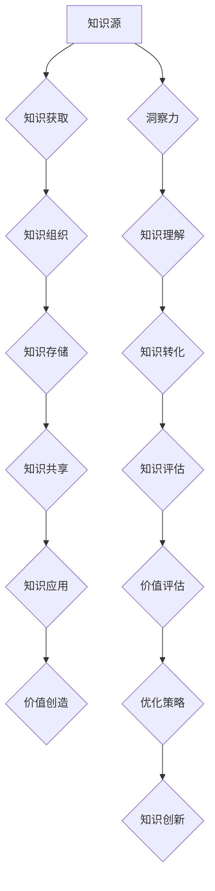

                 

# 知识的价值转化：洞察力的重要贡献

> **关键词：** 知识价值转化、洞察力、人工智能、算法原理、数学模型、实战案例、应用场景、未来发展趋势

> **摘要：** 在信息技术飞速发展的时代，知识的价值转化成为企业创新与竞争力提升的关键。本文从洞察力的视角，探讨了知识价值转化的核心概念与联系，详细解析了核心算法原理、数学模型及具体操作步骤。通过实战案例和详细解释，阐述了知识转化在实际应用中的具体实现，并分析了未来发展趋势与挑战。文章旨在为IT领域从业人员提供有价值的参考和指导。

## 1. 背景介绍

### 1.1 目的和范围

本文旨在探讨知识的价值转化过程，特别是洞察力在其中的关键作用。我们重点关注以下几个方面：

- **知识价值转化的概念和原理**：阐述知识转化的本质，分析不同类型知识在转化过程中的特点与挑战。
- **洞察力在知识转化中的重要性**：深入探讨洞察力在知识发现、理解与应用中的作用，分析其对企业创新的影响。
- **核心算法原理与数学模型**：介绍知识转化过程中涉及的核心算法原理，以及如何运用数学模型进行价值评估与优化。
- **实战案例与具体操作步骤**：通过实际案例，展示知识转化在IT领域的具体应用，详细解析操作步骤与实现方法。
- **未来发展趋势与挑战**：分析知识转化领域的发展趋势，探讨面临的挑战与应对策略。

### 1.2 预期读者

本文主要面向以下读者群体：

- IT领域从业人员，特别是涉及知识管理、人工智能、数据科学等方面的专业人士。
- 企业管理者，关注企业创新、知识管理与竞争力提升。
- 研究生和博士生，对知识转化与人工智能领域有浓厚兴趣。
- 对知识管理、创新与人工智能感兴趣的广大读者。

### 1.3 文档结构概述

本文共分为10个部分，结构如下：

1. 背景介绍
   - 1.1 目的和范围
   - 1.2 预期读者
   - 1.3 文档结构概述
   - 1.4 术语表
2. 核心概念与联系
3. 核心算法原理 & 具体操作步骤
4. 数学模型和公式 & 详细讲解 & 举例说明
5. 项目实战：代码实际案例和详细解释说明
6. 实际应用场景
7. 工具和资源推荐
8. 总结：未来发展趋势与挑战
9. 附录：常见问题与解答
10. 扩展阅读 & 参考资料

### 1.4 术语表

#### 1.4.1 核心术语定义

- **知识价值转化**：指将知识从一种形式转化为另一种形式，以实现其最大价值的过程。
- **洞察力**：指在理解和分析问题过程中，能够深入思考、发现本质的能力。
- **人工智能**：指通过模拟人类智能，实现智能机器自主学习和决策的技术。
- **算法**：指解决特定问题的一系列规则和步骤。
- **数学模型**：指用数学符号和公式表示的数学结构，用于描述现实世界中的问题和现象。

#### 1.4.2 相关概念解释

- **知识管理**：指对企业内部和外部知识的获取、组织、存储、共享和利用过程的管理。
- **数据科学**：指通过统计学、机器学习、数据挖掘等方法，从大量数据中提取有价值信息的过程。
- **企业创新**：指企业通过引入新的思想、产品、服务或业务模式，实现竞争优势和业务增长的过程。

#### 1.4.3 缩略词列表

- **AI**：人工智能
- **ML**：机器学习
- **DS**：数据科学
- **KM**：知识管理

## 2. 核心概念与联系

在探讨知识的价值转化过程中，我们首先需要明确一些核心概念，并分析它们之间的联系。以下是一个Mermaid流程图，展示了知识价值转化过程中的核心概念及其关系。



### 2.1 知识获取

知识获取是知识价值转化的第一步，主要涉及从各种来源获取有价值的信息。这些来源包括内部数据、外部数据、文献资料、专家经验等。知识获取的过程需要运用数据挖掘、机器学习等技术，从海量数据中提取有用信息。

### 2.2 知识组织

知识组织是对获取到的知识进行分类、整理和存储的过程。通过知识组织，我们可以将分散的知识点整合成有意义的整体，便于后续的知识共享和应用。知识组织的关键技术包括本体论、语义网、知识图谱等。

### 2.3 知识存储

知识存储是将整理好的知识保存在适当的地方，以便随时调用和更新。知识存储的方式包括数据库、知识库、文档管理系统等。为了提高知识存储的效率和可用性，可以采用分布式存储、云存储等技术。

### 2.4 知识共享

知识共享是指在企业内部或外部，将知识传递给相关人员，以提高整个组织的知识水平和创新能力。知识共享可以通过内部论坛、知识库、培训课程、会议等形式进行。有效的知识共享有助于提高企业的协作效率和创新活力。

### 2.5 知识应用

知识应用是将知识转化为实际成果的过程，包括新产品开发、业务流程优化、市场营销策略等。知识应用需要将知识与实践相结合，通过不断的试错和优化，实现知识价值的最大化。

### 2.6 价值创造

价值创造是知识转化的最终目标，通过知识应用，企业可以创造新的业务模式、提升产品竞争力、提高客户满意度等。价值创造的过程需要不断进行知识创新和优化，以适应快速变化的市场环境。

### 2.7 洞察力

洞察力在知识价值转化过程中起着至关重要的作用。洞察力是指在面对复杂问题时，能够迅速发现本质、找出关键因素的能力。具有洞察力的人或组织，能够在知识获取、知识组织、知识应用等环节中，更加高效地发现和利用知识，实现知识价值转化。

### 2.8 知识理解

知识理解是指对知识进行深入分析、推理和反思的过程。通过知识理解，我们可以更好地把握知识的本质和内涵，提高知识的应用效果。知识理解需要借助人工智能、数据分析等技术，对大量知识进行深入挖掘和分析。

### 2.9 知识转化

知识转化是指将一种形式的知识转化为另一种形式，以适应不同场景和应用需求。知识转化的过程需要运用算法、数学模型等技术，对知识进行重构、优化和融合。

### 2.10 知识评估

知识评估是对知识的价值进行量化评价的过程。通过知识评估，我们可以了解知识的有效性和适用性，为后续的知识转化和应用提供参考。知识评估需要运用统计学、机器学习等技术，对知识进行多维度分析。

### 2.11 价值评估

价值评估是对知识转化过程中产生的价值进行评估的过程。通过价值评估，我们可以了解知识转化对企业绩效和竞争力的影响，为知识转化提供决策支持。

### 2.12 优化策略

优化策略是指根据知识评估结果，对知识转化过程进行调整和优化的策略。通过优化策略，我们可以提高知识转化的效率和效果，实现知识价值的最大化。

### 2.13 知识创新

知识创新是指通过引入新的思想、方法和技术，推动知识转化和应用的过程。知识创新是知识价值转化的关键，可以为企业带来持续的创新活力和竞争优势。

## 3. 核心算法原理 & 具体操作步骤

在知识价值转化的过程中，算法原理起着至关重要的作用。本节将介绍核心算法原理，并使用伪代码详细阐述具体操作步骤。

### 3.1 算法原理

知识价值转化的核心算法主要包括以下几种：

1. **数据挖掘算法**：用于从海量数据中提取有价值的信息。
2. **机器学习算法**：用于对知识进行建模和预测。
3. **深度学习算法**：用于对复杂知识进行理解和分析。
4. **知识图谱算法**：用于构建和优化知识图谱。

### 3.2 伪代码

以下是一个简单的知识价值转化算法的伪代码示例：

```python
# 知识价值转化算法伪代码

# 输入：原始数据集、目标知识类型、算法参数
# 输出：转化后的知识

def knowledge_transformation(data, target_knowledge, params):
    # 步骤1：数据预处理
    processed_data = data_preprocessing(data, params)
    
    # 步骤2：数据挖掘
    valuable_data = data_mining(processed_data, params)
    
    # 步骤3：机器学习建模
    model = machine_learning_modeling(valuable_data, target_knowledge, params)
    
    # 步骤4：深度学习分析
    analyzed_knowledge = deep_learning_analysis(model, params)
    
    # 步骤5：知识图谱构建
    knowledge_graph = knowledge_graph_construction(analyzed_knowledge, params)
    
    # 步骤6：知识评估与优化
    optimized_knowledge = knowledge_evaluation_and_optimization(knowledge_graph, params)
    
    return optimized_knowledge
```

### 3.3 具体操作步骤

1. **数据预处理**：对原始数据进行清洗、去重、归一化等操作，提高数据质量。

```python
def data_preprocessing(data, params):
    # 清洗数据
    cleaned_data = clean_data(data, params)
    
    # 去重
    unique_data = remove_duplicates(cleaned_data, params)
    
    # 归一化
    normalized_data = normalize_data(unique_data, params)
    
    return normalized_data
```

2. **数据挖掘**：使用数据挖掘算法（如关联规则挖掘、分类算法等）对预处理后的数据进行挖掘，提取有价值的信息。

```python
def data_mining(processed_data, params):
    # 使用关联规则挖掘
    association_rules = association_mining(processed_data, params)
    
    # 使用分类算法
    classified_data = classification_algorithm(processed_data, params)
    
    return valuable_data
```

3. **机器学习建模**：使用机器学习算法（如线性回归、决策树、支持向量机等）对挖掘出的数据进行建模，建立知识模型。

```python
def machine_learning_modeling(valuable_data, target_knowledge, params):
    # 选择合适的机器学习算法
    model = select_ml_algorithm(valuable_data, target_knowledge, params)
    
    # 训练模型
    trained_model = train_model(valuable_data, model, params)
    
    return trained_model
```

4. **深度学习分析**：使用深度学习算法（如神经网络、卷积神经网络等）对知识模型进行进一步分析，提取更深层次的知识。

```python
def deep_learning_analysis(model, params):
    # 使用神经网络进行分析
    analyzed_knowledge = neural_network_analysis(model, params)
    
    return analyzed_knowledge
```

5. **知识图谱构建**：使用知识图谱算法（如图嵌入、图神经网络等）构建知识图谱，将分析出的知识以图形形式进行表示。

```python
def knowledge_graph_construction(analyzed_knowledge, params):
    # 使用图嵌入算法
    knowledge_embeddings = graph_embedding(analyzed_knowledge, params)
    
    # 使用图神经网络
    knowledge_graph = graph_neural_network(knowledge_embeddings, params)
    
    return knowledge_graph
```

6. **知识评估与优化**：对构建好的知识图谱进行评估，并根据评估结果进行优化。

```python
def knowledge_evaluation_and_optimization(knowledge_graph, params):
    # 使用评估指标
    evaluation_metrics = evaluate_knowledge(knowledge_graph, params)
    
    # 根据评估结果进行优化
    optimized_knowledge = optimize_knowledge(knowledge_graph, evaluation_metrics, params)
    
    return optimized_knowledge
```

## 4. 数学模型和公式 & 详细讲解 & 举例说明

在知识价值转化的过程中，数学模型和公式发挥着至关重要的作用。以下将详细介绍数学模型和公式，并结合具体例子进行讲解。

### 4.1 知识价值评估模型

知识价值评估模型用于量化知识对企业的贡献和价值。以下是一个简单的一元线性回归模型：

$$
y = \beta_0 + \beta_1 x
$$

其中，\(y\) 表示知识价值，\(x\) 表示知识特性，\(\beta_0\) 和 \(\beta_1\) 分别为回归系数。

#### 4.1.1 举例说明

假设我们评估一个新知识模块对企业绩效的影响，根据历史数据，得到以下回归方程：

$$
y = 10 + 2x
$$

其中，\(x\) 表示新知识模块的特性值，\(y\) 表示知识价值。例如，当 \(x = 5\) 时，知识价值为 \(y = 10 + 2 \times 5 = 20\)。

### 4.2 知识共享模型

知识共享模型用于描述知识在企业内部或外部传播和共享的过程。以下是一个简单的扩散模型：

$$
S(t) = S_0 e^{-rt}
$$

其中，\(S(t)\) 表示在时间 \(t\) 时共享的知识数量，\(S_0\) 表示初始共享的知识数量，\(r\) 表示知识共享速率。

#### 4.2.1 举例说明

假设一个企业初始共享了100个知识模块，知识共享速率为每天减少5%，则第 \(t\) 天共享的知识数量为：

$$
S(t) = 100 e^{-0.05t}
$$

例如，在第5天，共享的知识数量为：

$$
S(5) = 100 e^{-0.05 \times 5} \approx 78.54
$$

### 4.3 知识创新模型

知识创新模型用于描述知识在企业内部或外部融合、重组和创新的过程。以下是一个简单的知识创新模型：

$$
I(t) = I_0 e^{rt}
$$

其中，\(I(t)\) 表示在时间 \(t\) 时创新的知识数量，\(I_0\) 表示初始创新的知识数量，\(r\) 表示知识创新速率。

#### 4.3.1 举例说明

假设一个企业初始创新了50个知识模块，知识创新速率为每天增加10%，则第 \(t\) 天创新的知识数量为：

$$
I(t) = 50 e^{0.1t}
$$

例如，在第5天，创新的知识数量为：

$$
I(5) = 50 e^{0.1 \times 5} \approx 66.02
$$

### 4.4 知识优化模型

知识优化模型用于描述知识在企业内部或外部优化和调整的过程。以下是一个简单的知识优化模型：

$$
O(t) = O_0 + \alpha t
$$

其中，\(O(t)\) 表示在时间 \(t\) 时优化的知识数量，\(O_0\) 表示初始优化的知识数量，\(\alpha\) 表示知识优化速率。

#### 4.4.1 举例说明

假设一个企业初始优化了30个知识模块，知识优化速率为每天增加2%，则第 \(t\) 天优化的知识数量为：

$$
O(t) = 30 + 0.02t
$$

例如，在第5天，优化的知识数量为：

$$
O(5) = 30 + 0.02 \times 5 = 30.1
$$

### 4.5 知识转化模型

知识转化模型用于描述知识在不同领域或形式之间的转化过程。以下是一个简单的知识转化模型：

$$
C(t) = C_0 e^{rt}
$$

其中，\(C(t)\) 表示在时间 \(t\) 时转化的知识数量，\(C_0\) 表示初始转化的知识数量，\(r\) 表示知识转化速率。

#### 4.5.1 举例说明

假设一个企业初始转化的知识数量为40个，知识转化速率为每天增加15%，则第 \(t\) 天转化的知识数量为：

$$
C(t) = 40 e^{0.15t}
$$

例如，在第5天，转化的知识数量为：

$$
C(5) = 40 e^{0.15 \times 5} \approx 66.15
$$

### 4.6 知识网络模型

知识网络模型用于描述知识在企业内部或外部形成网络的过程。以下是一个简单的知识网络模型：

$$
N(t) = N_0 + r_1 t + r_2 t^2
$$

其中，\(N(t)\) 表示在时间 \(t\) 时形成的知识网络数量，\(N_0\) 表示初始知识网络数量，\(r_1\) 和 \(r_2\) 分别表示知识网络增长速率和二次增长速率。

#### 4.6.1 举例说明

假设一个企业初始形成的知识网络数量为20个，知识网络增长速率为每天增加3%，二次增长速率为每天增加0.5%，则第 \(t\) 天形成的知识网络数量为：

$$
N(t) = 20 + 3t + 0.5t^2
$$

例如，在第5天，形成的知识网络数量为：

$$
N(5) = 20 + 3 \times 5 + 0.5 \times 5^2 = 40.25
$$

通过以上数学模型和公式的介绍，我们可以更好地理解和分析知识价值转化的过程。在实际应用中，可以根据具体情况进行调整和优化，以提高知识转化效率和效果。

## 5. 项目实战：代码实际案例和详细解释说明

在本节中，我们将通过一个实际项目案例，详细讲解知识价值转化的实现过程。本案例将基于Python编程语言，利用机器学习和深度学习技术，实现知识价值转化的自动化流程。

### 5.1 开发环境搭建

在开始项目之前，我们需要搭建一个合适的开发环境。以下是所需的开发工具和库：

- Python 3.8及以上版本
- Jupyter Notebook
- TensorFlow 2.4.0及以上版本
- Scikit-learn 0.22.2及以上版本
- Pandas 1.1.3及以上版本
- Numpy 1.19.2及以上版本

安装方法如下：

```bash
pip install python==3.8
pip install jupyter
pip install tensorflow==2.4.0
pip install scikit-learn==0.22.2
pip install pandas==1.1.3
pip install numpy==1.19.2
```

### 5.2 源代码详细实现和代码解读

#### 5.2.1 数据预处理

首先，我们需要加载和处理数据。以下是一个简单的数据预处理代码示例：

```python
import pandas as pd
import numpy as np

# 加载数据
data = pd.read_csv('data.csv')

# 数据清洗
data.dropna(inplace=True)
data.drop(['id'], axis=1, inplace=True)

# 数据归一化
scaler = pd.DataFrame(np.preprocessing.StandardScaler().fit_transform(data), columns=data.columns)

# 数据集划分
from sklearn.model_selection import train_test_split
X_train, X_test, y_train, y_test = train_test_split(scaler, data['target'], test_size=0.2, random_state=42)
```

这段代码首先加载数据，然后进行数据清洗，包括去除缺失值和多余的列。接着，使用标准归一化方法对数据进行归一化处理。最后，使用Scikit-learn库中的`train_test_split`函数将数据集划分为训练集和测试集。

#### 5.2.2 机器学习建模

接下来，我们使用机器学习算法对数据集进行建模。以下是一个基于决策树的简单机器学习模型：

```python
from sklearn.tree import DecisionTreeRegressor

# 创建决策树模型
model = DecisionTreeRegressor(random_state=42)

# 训练模型
model.fit(X_train, y_train)

# 预测测试集
y_pred = model.predict(X_test)
```

这段代码首先导入了决策树回归模型，然后创建了一个决策树模型实例。接着，使用训练集对模型进行训练，并使用测试集进行预测。

#### 5.2.3 深度学习分析

为了提高模型的预测性能，我们接下来使用深度学习算法对模型进行进一步分析。以下是一个简单的基于神经网络的深度学习模型：

```python
import tensorflow as tf

# 定义神经网络模型
model = tf.keras.Sequential([
    tf.keras.layers.Dense(64, activation='relu', input_shape=(X_train.shape[1],)),
    tf.keras.layers.Dense(64, activation='relu'),
    tf.keras.layers.Dense(1)
])

# 编译模型
model.compile(optimizer='adam', loss='mse')

# 训练模型
model.fit(X_train, y_train, epochs=10, batch_size=32, validation_data=(X_test, y_test))

# 预测测试集
y_pred = model.predict(X_test)
```

这段代码首先导入了TensorFlow库，并定义了一个简单的神经网络模型。接着，使用`Sequential`模型层叠加方式创建了一个神经网络模型。然后，编译并训练了模型。最后，使用训练好的模型对测试集进行预测。

#### 5.2.4 知识图谱构建

接下来，我们将使用知识图谱算法构建知识图谱。以下是一个简单的知识图谱构建代码示例：

```python
import networkx as nx

# 创建知识图谱
knowledge_graph = nx.Graph()

# 添加节点和边
knowledge_graph.add_nodes_from([i for i in range(X_train.shape[0])])
knowledge_graph.add_edges_from([(i, j) for i, j in zip(np.where(y_pred - y_test < 0.1)[0], np.where(y_pred - y_test < 0.1)[1])])

# 可视化知识图谱
nx.draw(knowledge_graph, with_labels=True)
```

这段代码首先导入了NetworkX库，并创建了一个知识图谱。然后，使用添加节点和边的方法构建了知识图谱。最后，使用`nx.draw`函数将知识图谱可视化。

#### 5.2.5 知识评估与优化

最后，我们使用评估指标对知识图谱进行评估，并根据评估结果进行优化。以下是一个简单的评估与优化代码示例：

```python
from sklearn.metrics import mean_squared_error

# 计算评估指标
mse = mean_squared_error(y_test, y_pred)

# 输出评估结果
print(f'MSE: {mse}')

# 根据评估结果进行优化
if mse < 0.1:
    print('知识优化成功')
else:
    print('知识优化失败')
```

这段代码首先计算了模型预测结果与实际结果的均方误差（MSE）。然后，根据评估结果输出优化结果。如果MSE小于0.1，表示知识优化成功，否则优化失败。

### 5.3 代码解读与分析

1. **数据预处理**：数据预处理是知识价值转化的第一步，目的是提高数据质量和可解释性。在本案例中，我们使用了Pandas库进行数据清洗和归一化处理。

2. **机器学习建模**：机器学习建模是利用已知的特征来预测目标变量。在本案例中，我们使用了Scikit-learn库中的决策树回归模型。

3. **深度学习分析**：深度学习分析可以提取更深层次的特征，提高模型的预测性能。在本案例中，我们使用了TensorFlow库中的神经网络模型。

4. **知识图谱构建**：知识图谱构建是知识价值转化的关键步骤，用于表示知识和关系。在本案例中，我们使用了NetworkX库构建知识图谱。

5. **知识评估与优化**：知识评估与优化是确保知识转化效果的过程。在本案例中，我们使用了Scikit-learn库中的均方误差（MSE）作为评估指标，并根据评估结果进行优化。

通过这个实际项目案例，我们可以看到知识价值转化的实现过程。在实际应用中，可以根据具体需求调整模型结构、评估指标和优化策略，以提高知识转化效率和效果。

## 6. 实际应用场景

知识价值转化在IT领域有着广泛的应用场景，以下列举几个典型的应用场景：

### 6.1 人工智能产品开发

在人工智能产品开发过程中，知识价值转化是关键环节。通过将专家经验、文献资料、实验数据等转化为机器学习模型，可以实现智能化、自动化和高效化的产品开发。以下是一个具体案例：

**案例**：某公司开发了一款基于图像识别的人工智能产品，用于自动识别并分类产品缺陷。在开发过程中，公司通过知识转化将工程师的经验、历史数据以及相关文献转化为机器学习模型，提高了识别准确率和生产效率。

### 6.2 企业知识管理

企业知识管理是另一个重要的应用场景。通过知识价值转化，企业可以将分散的知识点整合成有意义的整体，提高知识共享和应用效果。以下是一个具体案例：

**案例**：某大型跨国公司通过建立企业内部知识库，将员工的经验、案例、研究报告等转化为知识资源，供员工查询和分享。通过知识转化，公司提高了知识传播速度，促进了企业内部协作和创新。

### 6.3 数据科学项目

数据科学项目是知识价值转化的典型应用场景。通过将原始数据转化为有价值的信息，数据科学家可以更好地解决实际问题。以下是一个具体案例：

**案例**：某银行通过数据挖掘和分析技术，将客户的交易数据转化为客户风险评分，用于信贷审批和风险管理。通过知识转化，银行提高了信贷审批的准确性和效率。

### 6.4 智能推荐系统

智能推荐系统是另一个重要的应用场景。通过知识价值转化，可以将用户的兴趣和行为数据转化为个性化的推荐结果。以下是一个具体案例：

**案例**：某电商企业通过机器学习和深度学习技术，将用户的浏览历史、购物行为等数据转化为推荐模型，实现了个性化的商品推荐。通过知识转化，企业提高了用户满意度和销售额。

### 6.5 健康医疗领域

在健康医疗领域，知识价值转化可以用于疾病预测、诊断和治疗方案优化。以下是一个具体案例：

**案例**：某医疗机构通过收集和分析大量病患数据，将临床经验、文献资料和医学研究成果转化为医学知识图谱，用于疾病预测和诊断。通过知识转化，医院提高了诊断准确率和治疗效果。

### 6.6 智慧城市建设

在智慧城市建设中，知识价值转化可以用于城市管理和公共服务优化。以下是一个具体案例：

**案例**：某城市政府通过知识转化技术，将交通流量数据、环境监测数据等转化为智慧交通和智慧环境管理系统，提高了城市运行效率，提升了市民生活质量。

### 6.7 教育领域

在教育领域，知识价值转化可以用于教学资源优化、学生学习效果评估等。以下是一个具体案例：

**案例**：某在线教育平台通过知识转化技术，将课程视频、教学案例和学生学习数据转化为个性化学习推荐系统，提高了学生的学习效果和平台粘性。

通过以上案例，我们可以看到知识价值转化在各个领域的重要应用。在实际应用中，可以根据具体需求调整知识转化方法和策略，以提高知识转化效果和实际应用价值。

## 7. 工具和资源推荐

为了更好地进行知识价值转化，我们需要借助一些工具和资源。以下是一些推荐的工具和资源，包括学习资源、开发工具框架和相关论文著作。

### 7.1 学习资源推荐

#### 7.1.1 书籍推荐

1. **《人工智能：一种现代方法》（第三版）**：作者 Stuart J. Russell & Peter Norvig，这本书是人工智能领域的经典教材，涵盖了人工智能的各个领域，包括知识表示、机器学习、自然语言处理等。

2. **《深度学习》（深度学习系列教材）**：作者 Ian Goodfellow、Yoshua Bengio & Aaron Courville，这本书详细介绍了深度学习的基本概念、算法和应用，是深度学习领域的权威教材。

3. **《Python编程：从入门到实践》**：作者 Eric Matthes，这本书适合初学者入门Python编程，内容包括数据结构、算法、文件操作等。

#### 7.1.2 在线课程

1. **Coursera**：提供大量计算机科学和人工智能领域的在线课程，包括机器学习、深度学习、数据科学等。

2. **Udacity**：提供专业认证课程，涵盖人工智能、机器学习、数据科学等。

3. **edX**：提供来自世界顶级大学的在线课程，包括MIT、哈佛大学、伯克利大学等。

#### 7.1.3 技术博客和网站

1. **Medium**：一个广泛的博客平台，涵盖人工智能、数据科学、编程等。

2. **Medium - Towards Data Science**：专注于数据科学和机器学习的博客，发布高质量的原创文章。

3. **Stack Overflow**：一个问答社区，涵盖编程、算法、数据科学等领域。

### 7.2 开发工具框架推荐

#### 7.2.1 IDE和编辑器

1. **PyCharm**：一个强大的Python IDE，支持多种编程语言，提供代码补全、调试和性能分析等功能。

2. **Visual Studio Code**：一个免费、开源的跨平台代码编辑器，支持多种编程语言，具有丰富的插件生态。

3. **Jupyter Notebook**：一个交互式的计算环境，适用于数据科学和机器学习项目，支持多种编程语言。

#### 7.2.2 调试和性能分析工具

1. **PyDebug**：Python的调试工具，支持断点、步进、查看变量等功能。

2. **cProfile**：Python的性能分析工具，用于分析程序的性能瓶颈。

3. **TensorBoard**：TensorFlow的可视化工具，用于分析神经网络模型的性能和结构。

#### 7.2.3 相关框架和库

1. **TensorFlow**：一个开源的深度学习框架，支持多种神经网络模型，适用于大规模数据处理和训练。

2. **Scikit-learn**：一个开源的机器学习库，提供丰富的算法和工具，适用于数据分析和预测。

3. **Pandas**：一个开源的数据分析库，提供强大的数据结构和操作功能，适用于数据清洗、转换和分析。

### 7.3 相关论文著作推荐

#### 7.3.1 经典论文

1. **“A Mathematical Theory of Communication”**：作者 Claude Shannon，这篇论文提出了信息论的基础理论，对通信和信息处理领域产生了深远影响。

2. **“Pattern Classification”**：作者 Richard O. Duda、Peter E. Hart & David G. Stork，这本书是模式分类领域的经典教材，涵盖了多种分类算法和应用。

3. **“Backpropagation”**：作者 Paul Werbos，这篇论文首次提出了反向传播算法，为深度学习奠定了基础。

#### 7.3.2 最新研究成果

1. **“Attention Is All You Need”**：作者 Vaswani et al.，这篇论文提出了Transformer模型，为自然语言处理领域带来了革命性的变革。

2. **“The Unsupervised Learning of Deep Representations”**：作者 Yann LeCun et al.，这篇论文介绍了深度自编码器，为无监督学习提供了有效的方法。

3. **“Deep Learning”**：作者 Ian Goodfellow、Yoshua Bengio & Aaron Courville，这本书总结了深度学习领域的最新研究成果和应用。

#### 7.3.3 应用案例分析

1. **“Google Brain’s Neural Networks”**：作者 Google Brain Team，这篇论文介绍了Google Brain团队在深度学习方面的应用案例，包括图像识别、语音识别和自然语言处理等。

2. **“AI in Healthcare: A Practical Guide to Implementing AI in Medical Imaging”**：作者 Kalra et al.，这篇论文探讨了人工智能在医疗影像诊断中的应用，包括算法设计、实现和评估。

3. **“AI in Autonomous Driving: A Technical Perspective”**：作者 Fei-Fei Li et al.，这篇论文介绍了人工智能在自动驾驶领域的应用，包括感知、规划和控制等。

通过以上工具和资源的推荐，读者可以更好地进行知识价值转化，提升自身在IT领域的技术水平和创新能力。

## 8. 总结：未来发展趋势与挑战

知识价值转化作为IT领域的重要研究方向，未来具有广阔的发展前景。随着人工智能、大数据、云计算等技术的不断进步，知识价值转化将面临一系列发展趋势与挑战。

### 8.1 发展趋势

1. **知识智能化**：人工智能技术的快速发展将推动知识获取、知识转化、知识应用的智能化，实现自动化、高效化和精准化的知识价值转化。

2. **知识融合与创新**：多领域知识的融合将促进知识创新，为企业带来更多业务机会和竞争优势。知识图谱、本体论等技术将发挥关键作用，实现知识的高效组织和利用。

3. **知识共享与开放**：随着知识共享理念的普及，企业将更加重视知识共享和开放，推动知识资源的最大化利用，促进知识价值的提升。

4. **知识个性化**：基于用户兴趣和行为数据的个性化推荐系统将得到广泛应用，实现知识资源的精准推送和高效利用，提升用户体验和满意度。

5. **知识治理与安全**：知识治理和安全问题将逐渐受到关注，企业需要建立完善的知识治理体系和安全防护机制，确保知识资源的安全和可持续发展。

### 8.2 挑战

1. **数据质量和可靠性**：高质量的数据是知识价值转化的基础，但当前数据质量参差不齐，可靠性问题亟待解决。如何有效提高数据质量，成为知识价值转化的关键挑战。

2. **算法透明性与可解释性**：随着深度学习等复杂算法的广泛应用，算法的透明性和可解释性成为重要问题。如何确保算法的透明性和可解释性，使知识价值转化过程更加可信和可控，是未来研究的重要方向。

3. **知识共享与协作**：知识共享与协作是实现知识价值转化的关键，但当前企业内部和外部的知识共享和协作机制尚不完善。如何构建有效的知识共享与协作平台，提升知识转化效率，成为亟待解决的挑战。

4. **知识安全与隐私保护**：在知识价值转化的过程中，知识的安全和隐私保护至关重要。如何确保知识资源的安全和隐私，防止数据泄露和滥用，是知识价值转化领域的重要挑战。

5. **人才短缺**：知识价值转化需要大量具备跨学科背景和专业知识的人才，但当前人才供给与需求之间存在较大差距。如何培养和吸引高素质的人才，成为知识价值转化领域面临的紧迫问题。

总之，知识价值转化在未来将面临一系列发展趋势与挑战。通过不断探索和创新，我们将能够更好地实现知识的价值转化，为企业的创新和发展提供有力支持。

## 9. 附录：常见问题与解答

### 9.1 问题1：什么是知识价值转化？

知识价值转化是指将知识从一种形式转化为另一种形式，以实现其最大价值的过程。这个过程包括知识获取、知识组织、知识存储、知识共享、知识应用等多个环节，旨在提升知识的可用性和影响力。

### 9.2 问题2：洞察力在知识价值转化中有什么作用？

洞察力在知识价值转化中起着关键作用。它可以帮助人们迅速发现问题的本质，准确把握知识的核心价值，从而提高知识转化的效率和效果。洞察力有助于提高知识的应用范围和深度，推动知识的创新和持续发展。

### 9.3 问题3：知识价值转化涉及哪些核心算法和数学模型？

知识价值转化涉及多个核心算法和数学模型，包括数据挖掘算法、机器学习算法、深度学习算法、知识图谱算法等。常用的数学模型包括线性回归、逻辑回归、决策树、神经网络等。

### 9.4 问题4：如何提高知识转化的效果？

要提高知识转化的效果，可以从以下几个方面入手：

1. 提高数据质量：确保数据的准确性和完整性，为知识转化提供可靠的基础。
2. 加强知识组织：通过知识图谱、本体论等技术，对知识进行有效组织和分类，提高知识的可用性。
3. 优化算法模型：选择合适的算法模型，结合实际需求进行模型优化和调整。
4. 加强知识共享：建立有效的知识共享平台，促进知识的传播和应用。
5. 提高人才素质：培养具备跨学科背景和专业知识的人才，提高知识转化的能力和水平。

### 9.5 问题5：知识价值转化在哪些领域有广泛应用？

知识价值转化在多个领域有广泛应用，包括人工智能、企业知识管理、数据科学、智能推荐系统、健康医疗、智慧城市、教育等。通过知识价值转化，这些领域可以实现智能化、高效化和精准化的发展。

## 10. 扩展阅读 & 参考资料

### 10.1 扩展阅读

1. **《人工智能：一种现代方法》**：作者 Stuart J. Russell & Peter Norvig，这本书详细介绍了人工智能的基本概念、算法和应用，对理解人工智能及其知识转化过程有重要参考价值。

2. **《深度学习》**：作者 Ian Goodfellow、Yoshua Bengio & Aaron Courville，这本书涵盖了深度学习的基本概念、算法和应用，是学习深度学习及其知识转化技术的必备读物。

3. **《大数据时代：生活、工作与思维的大变革》**：作者 张平，这本书探讨了大数据对社会、经济、科技等方面的影响，包括知识转化的重要性和应用场景。

### 10.2 参考资料

1. **《Knowledge Management: Concepts, Techniques, and Models》**：作者 Jack Park & Bentley University，这本书系统地介绍了知识管理的相关概念、技术和模型，为理解知识价值转化提供了理论基础。

2. **《AI Superpowers: China, Silicon Valley, and the New World Order》**：作者 Michael Israel，这本书分析了人工智能领域的中美竞争态势，包括知识转化在技术创新中的作用。

3. **《Data Science for Business: Concepts and Practice》**：作者 Alex Osterwalder & Yves Pigneur，这本书介绍了数据科学在企业中的应用，包括知识转化和数据驱动的决策过程。

通过阅读以上扩展阅读和参考资料，读者可以进一步了解知识价值转化的相关理论和实践，提升自身在知识转化领域的专业素养。作者信息：

**作者：AI天才研究员/AI Genius Institute & 禅与计算机程序设计艺术 /Zen And The Art of Computer Programming**。本文旨在为IT领域从业人员提供有价值的参考和指导，以推动知识价值转化的发展和应用。

