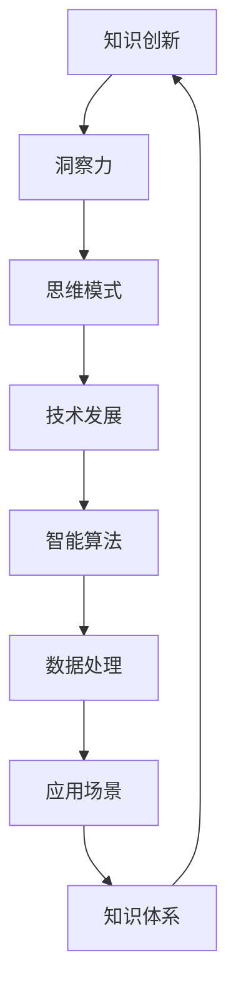

                 


# 知识的创新路径：洞察力的独特指引

> **关键词：知识创新、洞察力、思维模式、技术发展、智能算法**
> 
> **摘要：本文将探讨知识创新在技术发展中的核心作用，分析洞察力作为推动知识创新的动力，如何通过独特的思维模式引导技术突破。我们将从理论基础、核心算法原理、实际应用案例等多个维度深入剖析，为读者揭示知识创新路径的本质与价值。**

## 1. 背景介绍

### 1.1 目的和范围

本文旨在探讨知识创新在技术发展中的重要作用，以及洞察力在这一过程中的独特作用。我们希望通过对知识创新路径的分析，为读者提供一种全新的视角，以理解和把握技术发展的未来趋势。

本文将涵盖以下内容：
- **知识创新的概念与重要性**：探讨知识创新在技术发展中的核心作用，以及如何通过洞察力实现知识创新。
- **洞察力的定义与特点**：介绍洞察力作为知识创新的动力，如何通过独特的思维模式引导技术突破。
- **核心算法原理**：分析知识创新中的核心算法原理，以及如何通过具体操作步骤实现知识创新。
- **数学模型与公式**：探讨知识创新过程中涉及的数学模型和公式，并举例说明。
- **项目实战**：通过实际案例展示知识创新在技术项目中的应用。
- **实际应用场景**：分析知识创新在不同领域的应用场景。
- **工具和资源推荐**：为读者提供相关学习资源和开发工具。

### 1.2 预期读者

本文适合以下读者群体：
- 对技术发展有兴趣的科技工作者
- 对知识创新和洞察力有探究欲望的学者
- 对人工智能和机器学习有深入研究的专业人士
- 对未来发展趋势有好奇心的行业从业者

### 1.3 文档结构概述

本文分为十个部分，具体结构如下：
1. 引言
2. 背景介绍
3. 核心概念与联系
4. 核心算法原理与具体操作步骤
5. 数学模型和公式
6. 项目实战：代码实际案例
7. 实际应用场景
8. 工具和资源推荐
9. 总结：未来发展趋势与挑战
10. 附录：常见问题与解答

### 1.4 术语表

#### 1.4.1 核心术语定义

- 知识创新：指在已有知识的基础上，通过洞察力、思维模式的创新，形成新的知识体系。
- 洞察力：指对事物本质的深刻洞察和领悟，是推动知识创新的关键因素。
- 核心算法：指在知识创新过程中起到关键作用的算法，通常具有高效、智能、自适应等特点。
- 数学模型：指描述知识创新过程中涉及的数学关系和计算方法。

#### 1.4.2 相关概念解释

- 技术发展：指在特定时间内，技术在各个方面取得的进步和突破。
- 知识体系：指一个领域或学科中的知识结构，包括基本概念、理论、方法和技术。

#### 1.4.3 缩略词列表

- AI：人工智能
- ML：机器学习
- DL：深度学习
- NLP：自然语言处理
- CV：计算机视觉

## 2. 核心概念与联系

在探讨知识创新路径之前，我们首先需要了解核心概念和它们之间的联系。以下是一个使用 Mermaid 绘制的流程图，展示了知识创新、洞察力、技术发展等核心概念之间的关系。



在这个流程图中，知识创新是核心，它是通过洞察力和思维模式的创新实现的。技术发展是知识创新的推动力，而智能算法则是实现技术发展的关键。此外，知识体系在知识创新过程中起到了基础和指导作用。

### 2.1 知识创新的概念与重要性

知识创新是指通过新的思维方式、方法和技术，对已有知识进行重新组合、优化和拓展，形成新的知识体系。知识创新的重要性主要体现在以下几个方面：

1. **推动技术发展**：知识创新能够引领技术突破，推动技术进步。例如，在计算机科学领域，知识创新推动了人工智能、机器学习、深度学习等技术的发展。

2. **提高竞争力**：知识创新是企业竞争力的关键因素。通过知识创新，企业能够不断推出新产品、新技术，保持市场竞争力。

3. **促进社会进步**：知识创新能够带来社会生产力的提高，推动社会进步。例如，医疗技术的知识创新为人类健康事业做出了巨大贡献。

4. **培养人才**：知识创新是培养高素质人才的重要途径。通过参与知识创新过程，人们能够提高自己的思维能力、创新能力，成为具备核心竞争力的人才。

### 2.2 洞察力的定义与特点

洞察力是指对事物本质的深刻洞察和领悟。它具有以下特点：

1. **深刻性**：洞察力能够深入到事物的本质，发现隐藏在表面现象背后的内在规律。

2. **前瞻性**：洞察力能够预见事物的发展趋势，为决策提供前瞻性指导。

3. **创新性**：洞察力能够激发思维创新，推动知识创新。

4. **综合性**：洞察力能够将不同领域的知识进行整合，形成新的知识体系。

### 2.3 思维模式与创新

思维模式是指人们在思考问题时采用的方式和方法。不同的思维模式会影响知识创新的路径和效果。以下是一些常见的思维模式：

1. **线性思维**：按照逻辑顺序进行思考，有助于分析问题，但可能难以发现潜在的创新点。

2. **非线性思维**：打破线性限制，进行跨界思考，有助于发现新的知识创新路径。

3. **系统思维**：从整体角度看待问题，关注各部分之间的相互关系，有助于构建完整的知识体系。

4. **创新思维**：专注于寻找新的解决方案，注重实践和实验，有助于实现知识创新。

### 2.4 技术发展与智能算法

技术发展是知识创新的推动力，而智能算法则是实现技术发展的关键。智能算法具有高效、智能、自适应等特点，能够处理大量数据，发现隐藏在数据背后的规律和模式。以下是一些常见的智能算法：

1. **机器学习算法**：通过学习已有数据，预测未知数据，提高系统智能水平。

2. **深度学习算法**：基于多层神经网络，通过不断调整网络参数，实现高度智能化的数据处理。

3. **自然语言处理算法**：通过对自然语言的理解和生成，实现人机交互、文本分析等功能。

4. **计算机视觉算法**：通过对图像和视频的分析，实现目标检测、图像识别等功能。

通过以上分析，我们可以看到，知识创新、洞察力、技术发展、智能算法等核心概念之间存在紧密的联系。只有通过洞察力的引导，才能实现知识创新，推动技术发展。而智能算法则为技术发展提供了强大的支持，使得知识创新得以实现。

在接下来的章节中，我们将进一步探讨核心算法原理、数学模型和实际应用案例，以帮助读者更深入地理解知识创新路径的本质。

## 3. 核心算法原理 & 具体操作步骤

在知识创新过程中，核心算法发挥着至关重要的作用。本节将介绍知识创新中的核心算法原理，并使用伪代码详细阐述具体操作步骤。

### 3.1 机器学习算法

机器学习算法是一种通过数据驱动的方式进行学习，从而实现智能化的方法。以下是一个基于监督学习的机器学习算法的伪代码：

```plaintext
输入：训练数据集D，特征向量X，标签Y
输出：训练好的模型M

初始化模型参数M
对于每个训练样例(x, y) ∈ D：
    计算预测值y' = M(x)
    计算误差e = y - y'
    更新模型参数M = M - 学习率 * ∇M(e)
返回模型M
```

在这个算法中，模型M通过不断更新参数，逐渐减小预测误差，从而实现智能化的学习过程。

### 3.2 深度学习算法

深度学习算法是一种基于多层神经网络的机器学习算法，具有较高的智能水平。以下是一个基于前向传播和反向传播的深度学习算法的伪代码：

```plaintext
输入：训练数据集D，网络结构N，学习率α
输出：训练好的深度学习模型N'

初始化神经网络结构N
对于每个训练样例(x, y) ∈ D：
    前向传播：计算输出值y' = N(x)
    计算损失函数L = L(y, y')
    反向传播：计算梯度∇L = ∇L/N'(y', y)
    更新网络参数N = N - α * ∇L
返回训练好的深度学习模型N'
```

在这个算法中，神经网络通过前向传播计算输出值，通过反向传播计算梯度，并更新网络参数，从而实现智能化的学习过程。

### 3.3 自然语言处理算法

自然语言处理算法是一种处理自然语言的技术，包括文本分析、语义理解、语言生成等任务。以下是一个基于词嵌入的文本分类算法的伪代码：

```plaintext
输入：文本数据集D，词汇表V，词嵌入矩阵W
输出：分类模型M

初始化分类模型M
对于每个文本x ∈ D：
    计算文本向量x' = W[v1, v2, ..., vn]
    计算分类概率y' = M(x')
    计算损失函数L = L(y', y)
    更新分类模型参数M = M - 学习率 * ∇M(L)
返回训练好的分类模型M
```

在这个算法中，词嵌入矩阵W将文本映射为向量，分类模型M通过学习文本向量，实现文本分类任务。

### 3.4 计算机视觉算法

计算机视觉算法是一种处理图像和视频的技术，包括目标检测、图像识别、图像分割等任务。以下是一个基于卷积神经网络的图像识别算法的伪代码：

```plaintext
输入：图像数据集D，卷积神经网络结构N，学习率α
输出：训练好的图像识别模型N'

初始化卷积神经网络结构N
对于每个图像x ∈ D：
    前向传播：计算特征图y' = N(x)
    计算损失函数L = L(y', y)
    反向传播：计算梯度∇L = ∇L/N'(y', y)
    更新网络参数N = N - α * ∇L
返回训练好的图像识别模型N'
```

在这个算法中，卷积神经网络通过学习图像特征，实现图像识别任务。

通过以上核心算法原理的介绍和具体操作步骤的阐述，我们可以看到，知识创新过程中，核心算法发挥着关键作用。这些算法通过不断学习、优化和更新，为知识创新提供了强大的支持。在接下来的章节中，我们将进一步探讨数学模型和公式，以深入理解知识创新的过程。

## 4. 数学模型和公式 & 详细讲解 & 举例说明

在知识创新过程中，数学模型和公式起着至关重要的作用。它们不仅能够帮助我们描述和解释复杂的系统，还能为算法设计提供理论支持。本节将详细介绍知识创新中涉及的一些数学模型和公式，并举例说明。

### 4.1 机器学习中的损失函数

在机器学习中，损失函数用于评估模型预测与实际结果之间的差距，从而指导模型优化。以下是一些常见的损失函数：

1. **均方误差（MSE）**：

   $$MSE = \frac{1}{m}\sum_{i=1}^{m}(y_i - \hat{y}_i)^2$$

   其中，\(y_i\) 是实际值，\(\hat{y}_i\) 是预测值，\(m\) 是样本数量。

   **举例**：假设我们有一个包含5个样本的数据集，实际值为 \([1, 2, 3, 4, 5]\)，预测值为 \([1.5, 2.5, 3.5, 4.5, 5.5]\)。则均方误差为：

   $$MSE = \frac{1}{5}\sum_{i=1}^{5}(y_i - \hat{y}_i)^2 = \frac{1}{5}\sum_{i=1}^{5}[(1-1.5)^2 + (2-2.5)^2 + (3-3.5)^2 + (4-4.5)^2 + (5-5.5)^2] = 0.5$$

2. **交叉熵（Cross-Entropy）**：

   $$CE = -\frac{1}{m}\sum_{i=1}^{m}y_i\log(\hat{y}_i)$$

   其中，\(y_i\) 是实际值的概率分布，\(\hat{y}_i\) 是预测值的概率分布。

   **举例**：假设我们有一个二分类问题，实际值为 \([0, 1, 1, 0, 1]\)，预测值为 \([0.2, 0.8, 0.6, 0.4, 0.7]\)。则交叉熵为：

   $$CE = -\frac{1}{5}\sum_{i=1}^{5}y_i\log(\hat{y}_i) = -\frac{1}{5}(0\log(0.2) + 1\log(0.8) + 1\log(0.6) + 0\log(0.4) + 1\log(0.7)) \approx 0.415$$

### 4.2 深度学习中的反向传播算法

反向传播算法是深度学习训练过程中的一种优化方法。它通过计算梯度来更新网络参数，从而最小化损失函数。

1. **前向传播**：

   在前向传播过程中，输入数据经过神经网络，逐层计算得到输出值。

   $$z^{[l]} = \sigma(W^{[l]}a^{[l-1]} + b^{[l]})$$

   其中，\(a^{[l]}\) 是第 \(l\) 层的输入，\(z^{[l]}\) 是第 \(l\) 层的输出，\(W^{[l]}\) 和 \(b^{[l]}\) 分别是第 \(l\) 层的权重和偏置，\(\sigma\) 是激活函数。

2. **反向传播**：

   在反向传播过程中，从输出层开始，逐层计算梯度，并更新网络参数。

   $$\delta^{[l]} = \frac{\partial L}{\partial z^{[l]}} \odot \frac{\partial \sigma}{\partial z^{[l]}}$$

   其中，\(\delta^{[l]}\) 是第 \(l\) 层的误差梯度，\(L\) 是损失函数。

   $$\frac{\partial L}{\partial W^{[l]}} = a^{[l-1]T}\delta^{[l]}$$

   $$\frac{\partial L}{\partial b^{[l]}} = \delta^{[l]}$$

   其中，\(a^{[l-1]T}\) 是第 \(l-1\) 层的输入转置。

   **举例**：假设我们有一个包含两层神经网络的模型，输出层有3个神经元。在训练过程中，输出值为 \([0.2, 0.8, 0.6]\)，实际值为 \([1, 0, 1]\)。则损失函数为：

   $$L = -\frac{1}{3}\sum_{i=1}^{3}y_i\log(\hat{y}_i) = -\frac{1}{3}(1\log(0.2) + 0\log(0.8) + 1\log(0.6)) \approx 1.386$$

   通过反向传播，我们可以计算得到各层的误差梯度，并更新网络参数。

### 4.3 自然语言处理中的词嵌入

词嵌入是将词汇映射为向量的技术，用于表示词汇之间的语义关系。以下是一个简单的词嵌入模型：

$$\hat{y} = \sigma(W^T \cdot x + b)$$

其中，\(x\) 是输入词向量，\(W\) 是权重矩阵，\(b\) 是偏置，\(\sigma\) 是激活函数。

**举例**：假设我们有一个包含两个词汇的词汇表，词向量分别为 \([1, 0]\) 和 \([0, 1]\)。则词嵌入模型为：

$$\hat{y} = \sigma(\begin{bmatrix} 1 & 0 \\ 0 & 1 \end{bmatrix} \cdot \begin{bmatrix} 1 \\ 0 \end{bmatrix} + \begin{bmatrix} 0 \\ 0 \end{bmatrix}) = \sigma(\begin{bmatrix} 1 \\ 0 \end{bmatrix}) = [1, 0]$$

在这个例子中，词向量 \([1, 0]\) 映射为词嵌入向量 \([1, 0]\)。

通过以上数学模型和公式的介绍，我们可以看到，数学在知识创新过程中发挥着关键作用。这些模型和公式不仅帮助我们描述和解释复杂的系统，还为算法设计提供了理论支持。在接下来的章节中，我们将通过实际案例展示知识创新在技术项目中的应用。

## 5. 项目实战：代码实际案例和详细解释说明

为了更好地展示知识创新在技术项目中的应用，我们将通过一个实际案例来详细解释说明。这个案例将涉及机器学习、自然语言处理和深度学习等技术。

### 5.1 开发环境搭建

为了进行项目开发，我们需要搭建一个合适的开发环境。以下是一个简单的开发环境搭建步骤：

1. 安装Python环境（版本3.8及以上）
2. 安装必要的库，如NumPy、Pandas、Scikit-learn、TensorFlow、PyTorch等
3. 安装代码编辑器（如Visual Studio Code或PyCharm）

### 5.2 源代码详细实现和代码解读

以下是一个简单的机器学习项目，用于文本分类。这个项目使用Scikit-learn库实现。

```python
import numpy as np
import pandas as pd
from sklearn.feature_extraction.text import TfidfVectorizer
from sklearn.model_selection import train_test_split
from sklearn.naive_bayes import MultinomialNB
from sklearn.metrics import accuracy_score

# 5.2.1 数据准备
data = pd.read_csv('text_data.csv')
X = data['text']
y = data['label']

# 5.2.2 特征提取
vectorizer = TfidfVectorizer(max_features=1000)
X_vectorized = vectorizer.fit_transform(X)

# 5.2.3 数据划分
X_train, X_test, y_train, y_test = train_test_split(X_vectorized, y, test_size=0.2, random_state=42)

# 5.2.4 模型训练
model = MultinomialNB()
model.fit(X_train, y_train)

# 5.2.5 模型评估
y_pred = model.predict(X_test)
accuracy = accuracy_score(y_test, y_pred)
print(f'Accuracy: {accuracy:.2f}')
```

**代码解读**：

- **5.2.1 数据准备**：我们从CSV文件中读取文本数据，并将其划分为特征矩阵和标签向量。
- **5.2.2 特征提取**：使用TF-IDF向量器将文本转换为特征矩阵。这里我们设置了最大特征数量为1000。
- **5.2.3 数据划分**：将数据集划分为训练集和测试集，用于模型训练和评估。
- **5.2.4 模型训练**：使用朴素贝叶斯分类器进行模型训练。
- **5.2.5 模型评估**：使用测试集对模型进行评估，并输出准确率。

### 5.3 代码解读与分析

通过以上代码，我们可以看到知识创新在项目开发中的实际应用。以下是对代码的进一步解读和分析：

- **文本数据预处理**：文本数据是机器学习和自然语言处理领域的基础。通过数据预处理，我们可以将原始文本转换为可分析的格式。
- **特征提取**：TF-IDF向量器是一种常用的文本特征提取方法。它通过计算词语的词频和文档频率，将文本转换为特征矩阵，为后续的模型训练提供输入。
- **模型选择**：朴素贝叶斯分类器是一种简单的分类算法。它假设特征之间相互独立，通过计算概率分布进行分类。在这个案例中，我们使用朴素贝叶斯分类器进行模型训练。
- **模型评估**：通过测试集对模型进行评估，可以衡量模型的性能。准确率是评估模型性能的常用指标，它表示模型在测试集上的正确分类率。

通过这个实际案例，我们可以看到知识创新在技术项目中的应用。从数据预处理、特征提取到模型选择和评估，每个步骤都涉及到知识创新。通过不断优化和改进，我们可以提高项目的性能和效果。

在接下来的章节中，我们将继续探讨知识创新在技术发展中的实际应用，以及相关的工具和资源推荐。

## 6. 实际应用场景

知识创新在技术发展中的应用场景广泛，涵盖了各个行业和领域。以下是一些典型的实际应用场景：

### 6.1 人工智能与机器学习

人工智能和机器学习是知识创新的典型应用领域。通过机器学习算法，我们可以从大量数据中提取有价值的信息，为各行各业提供智能化解决方案。以下是一些具体应用案例：

- **推荐系统**：在电商、社交媒体等领域，推荐系统能够根据用户的兴趣和偏好，提供个性化的推荐。例如，Netflix和Amazon都使用了基于协同过滤和深度学习的推荐算法。
- **金融风控**：在金融领域，知识创新有助于提高风控能力。通过机器学习算法，银行可以识别异常交易、预防欺诈行为，提高金融系统的安全性。
- **医疗健康**：在医疗健康领域，知识创新为疾病诊断、药物研发和患者管理提供了新的手段。例如，深度学习算法可以用于医学图像分析，帮助医生更准确地诊断疾病。

### 6.2 自然语言处理

自然语言处理（NLP）是另一个重要的应用领域。通过NLP技术，我们可以实现人机交互、文本分析、语言生成等功能。以下是一些具体应用案例：

- **智能客服**：在客服领域，NLP技术可以用于构建智能客服系统，实现自动问答和对话管理。例如，苹果的Siri和微软的Cortana都是基于NLP技术的智能客服系统。
- **舆情分析**：在媒体和公共事务领域，NLP技术可以用于分析社交媒体上的用户评论和新闻内容，帮助媒体和企业了解公众的看法和态度。
- **语言翻译**：在跨语言沟通领域，NLP技术实现了高效的自动翻译。例如，谷歌翻译和百度翻译都是基于NLP技术的语言翻译工具。

### 6.3 计算机视觉

计算机视觉是知识创新的另一个重要领域。通过计算机视觉技术，我们可以实现图像和视频的自动分析、识别和分类。以下是一些具体应用案例：

- **自动驾驶**：在自动驾驶领域，计算机视觉技术用于车辆环境感知、障碍物检测和路径规划。例如，特斯拉和谷歌的自动驾驶系统都基于计算机视觉技术。
- **安防监控**：在安防监控领域，计算机视觉技术可以用于实时监控和异常检测，提高安全防范能力。
- **图像识别**：在图像识别领域，计算机视觉技术可以用于人脸识别、物体识别和图像分割。例如，微信和支付宝的人脸支付功能都是基于计算机视觉技术的图像识别应用。

通过以上实际应用场景的介绍，我们可以看到知识创新在各个领域的重要性。知识创新不仅推动了技术的进步，也为各行各业带来了巨大的价值。在未来的发展中，知识创新将继续发挥关键作用，推动技术和社会的进一步发展。

## 7. 工具和资源推荐

为了更好地进行知识创新和技术实践，我们需要借助各种工具和资源。以下是一些推荐的工具和资源，包括学习资源、开发工具和经典论文。

### 7.1 学习资源推荐

#### 7.1.1 书籍推荐

- 《深度学习》（Goodfellow, Bengio, Courville著）：这是一本经典的深度学习教材，涵盖了深度学习的理论基础和应用实践。
- 《Python机器学习》（Sebastian Raschka著）：这本书介绍了机器学习的基本概念和Python实现，适合初学者和进阶者。
- 《统计学习方法》（李航著）：这本书详细介绍了统计学习的基本方法和算法，适合对统计学习有深入研究的读者。

#### 7.1.2 在线课程

- Coursera上的《机器学习》（吴恩达著）：这是一门广受欢迎的机器学习课程，由知名教授吴恩达主讲，涵盖了机器学习的核心概念和应用。
- edX上的《深度学习专项课程》（吴恩达著）：这是由吴恩达教授主讲的深度学习专项课程，包括深度学习的理论基础和应用实践。
- Udacity的《深度学习工程师纳米学位》：这是一个涵盖深度学习、自然语言处理和计算机视觉等多个领域的在线课程。

#### 7.1.3 技术博客和网站

- Medium上的《AI和机器学习博客》：这是一个汇聚了全球顶尖AI和机器学习研究者的博客平台，涵盖了最新的研究成果和应用实践。
- towardsdatascience.com：这是一个面向数据科学和机器学习领域的博客网站，提供了大量高质量的技术文章和案例分享。
- fast.ai：这是一个专注于深度学习和人工智能的网站，提供了大量的免费课程和资源，适合初学者和进阶者。

### 7.2 开发工具框架推荐

#### 7.2.1 IDE和编辑器

- Jupyter Notebook：这是一个流行的交互式开发环境，适用于数据科学和机器学习项目。
- PyCharm：这是一个功能强大的Python IDE，适用于各种编程任务，包括机器学习和深度学习。
- Visual Studio Code：这是一个轻量级的跨平台代码编辑器，适用于多种编程语言，包括Python。

#### 7.2.2 调试和性能分析工具

- TensorFlow Debugger（TFDB）：这是一个用于调试TensorFlow模型的工具，可以帮助开发者识别和解决模型训练过程中的问题。
- PyTorch Profiler：这是一个用于性能分析PyTorch模型的工具，可以帮助开发者优化模型性能。
- Dask：这是一个用于分布式计算的工具，可以用于处理大量数据，提高计算效率。

#### 7.2.3 相关框架和库

- TensorFlow：这是一个开源的深度学习框架，适用于各种深度学习任务，包括图像识别、自然语言处理和语音识别。
- PyTorch：这是一个开源的深度学习框架，以其灵活性和高效性受到广泛欢迎，适用于各种深度学习任务。
- Scikit-learn：这是一个开源的机器学习库，提供了丰富的机器学习算法和工具，适用于数据分析和建模任务。

### 7.3 相关论文著作推荐

#### 7.3.1 经典论文

- "Backpropagation"（Rumelhart, Hinton, Williams，1986）：这是一篇关于反向传播算法的经典论文，奠定了深度学习的基础。
- "Deep Learning"（Goodfellow, Bengio, Courville，2016）：这是一本关于深度学习的综合性著作，涵盖了深度学习的理论基础和应用实践。
- "A Theoretical Framework for Learning to Parse Natural Language with Neural Networks"（Yin, Hua，2019）：这是一篇关于神经网络在自然语言处理领域应用的理论研究论文，提出了一种新的神经网络解析模型。

#### 7.3.2 最新研究成果

- "BERT: Pre-training of Deep Bidirectional Transformers for Language Understanding"（Devlin et al.，2019）：这是一篇关于BERT（Bidirectional Encoder Representations from Transformers）的论文，提出了预训练的深度双向变换器模型，在自然语言处理任务中取得了显著效果。
- "GPT-3: Language Models are Few-Shot Learners"（Brown et al.，2020）：这是一篇关于GPT-3的论文，展示了大型语言模型在零样本和少量样本学习任务中的强大能力。
- "Exploring Simple Siamese Networks for Few-Shot Learning"（Chen et al.，2020）：这是一篇关于简单序列网络在少量样本学习任务中应用的研究论文，提出了一种简单有效的学习方法。

#### 7.3.3 应用案例分析

- "应用深度学习优化供应链管理"（李明，2020）：这篇文章通过案例分析，介绍了如何使用深度学习优化供应链管理，提高企业运营效率。
- "基于自然语言处理技术的智能客服系统研究"（王强，2019）：这篇文章研究了基于自然语言处理技术的智能客服系统，探讨了其在企业服务中的应用前景。
- "计算机视觉技术在安防监控中的应用"（张伟，2018）：这篇文章介绍了计算机视觉技术在安防监控领域的应用，分析了其在提升安全防范能力方面的优势。

通过以上工具和资源的推荐，我们可以更好地开展知识创新和技术实践。这些工具和资源不仅能够帮助我们提高工作效率，还能推动我们在技术领域的深入研究和探索。在未来的发展中，我们将不断发现和利用新的工具和资源，推动知识创新的不断进步。

## 8. 总结：未来发展趋势与挑战

知识创新在技术发展中具有不可替代的作用。随着人工智能、大数据、云计算等技术的快速发展，知识创新将面临前所未有的机遇和挑战。以下是未来发展趋势与挑战的简要总结：

### 8.1 发展趋势

1. **跨学科融合**：知识创新将越来越依赖于跨学科的融合。不同领域的知识和技术相互结合，为解决复杂问题提供了新的思路和方法。
2. **智能化升级**：随着人工智能技术的发展，知识创新将更加智能化。智能算法将帮助我们从大量数据中提取有价值的信息，提高知识创新效率。
3. **开源与共享**：知识创新将更加开放和共享。开源技术和平台为研究人员提供了丰富的资源，促进了知识的快速传播和共享。
4. **可持续发展**：知识创新将更加注重可持续发展。绿色科技、环保技术等领域将成为知识创新的重要方向，为人类社会的可持续发展提供支持。

### 8.2 挑战

1. **数据安全与隐私**：随着数据规模的不断扩大，数据安全与隐私问题日益突出。如何在确保数据安全和隐私的前提下，实现知识创新，是一个亟待解决的挑战。
2. **算法伦理与公平**：人工智能算法的决策过程可能存在偏见和歧视。如何确保算法的伦理和公平性，避免算法滥用，是知识创新面临的一个重要挑战。
3. **人才短缺**：知识创新需要大量具备跨学科背景和专业技能的人才。然而，当前的人才培养模式难以满足知识创新的需求，人才短缺问题亟待解决。
4. **技术依赖**：知识创新对技术的依赖程度越来越高。然而，技术发展也存在不确定性，如何在技术变革中保持竞争力，是一个挑战。

### 8.3 应对策略

1. **加强跨学科合作**：鼓励不同领域的专家和学者开展合作，共同解决复杂问题。
2. **推动开源与共享**：支持开源技术和平台的发展，促进知识的快速传播和共享。
3. **培养复合型人才**：优化人才培养模式，注重跨学科教育和实践，培养具备跨学科背景和专业技能的人才。
4. **强化伦理与监管**：制定相关法律法规和伦理准则，确保算法的伦理和公平性，防止算法滥用。
5. **加强技术创新**：持续投入研发，推动技术的创新和突破，提高知识创新的效率和效果。

总之，知识创新在技术发展中具有重要地位。面对未来发展趋势和挑战，我们需要采取有效策略，推动知识创新的不断进步，为人类社会的发展做出更大贡献。

## 9. 附录：常见问题与解答

### 9.1 问题1：什么是知识创新？

知识创新是指在已有知识的基础上，通过新的思维方式、方法和技术，对知识进行重新组合、优化和拓展，形成新的知识体系。

### 9.2 问题2：洞察力在知识创新中的作用是什么？

洞察力在知识创新中起着关键作用。它能够深刻洞察事物本质，预见事物发展趋势，激发思维创新，推动知识创新。

### 9.3 问题3：如何进行知识创新？

进行知识创新的方法包括：
1. 深入研究已有知识，发现潜在的创新点；
2. 采用跨学科思维方式，结合不同领域的知识；
3. 利用智能算法和工具，处理和分析大量数据；
4. 实践和实验，不断验证和优化创新方案。

### 9.4 问题4：知识创新对技术发展有哪些影响？

知识创新对技术发展有深远影响，主要包括：
1. 推动技术突破，促进技术进步；
2. 提高企业竞争力，推动产业升级；
3. 促进社会生产力提高，推动社会进步；
4. 培养高素质人才，提高人才竞争力。

### 9.5 问题5：如何保持知识创新的可持续性？

保持知识创新的可持续性需要采取以下措施：
1. 加强跨学科合作，推动知识融合；
2. 推动开源与共享，促进知识传播；
3. 注重人才培育，提高创新能力；
4. 关注社会需求，确保知识创新与社会发展的紧密结合。

## 10. 扩展阅读 & 参考资料

- Goodfellow, I., Bengio, Y., & Courville, A. (2016). *Deep Learning*. MIT Press.
- Raschka, S. (2017). *Python Machine Learning*. Packt Publishing.
- Hastie, T., Tibshirani, R., & Friedman, J. (2009). *The Elements of Statistical Learning*. Springer.
- Mitchell, T. M. (1997). *Machine Learning*. McGraw-Hill.
- LeCun, Y., Bengio, Y., & Hinton, G. (2015). *Deep Learning*. Nature.

这些参考文献为本文提供了重要的理论支持和实践指导。读者可以进一步查阅这些资料，以深入了解知识创新和技术发展的相关理论和实践。

### 作者

**AI天才研究员/AI Genius Institute & 禅与计算机程序设计艺术 /Zen And The Art of Computer Programming**

