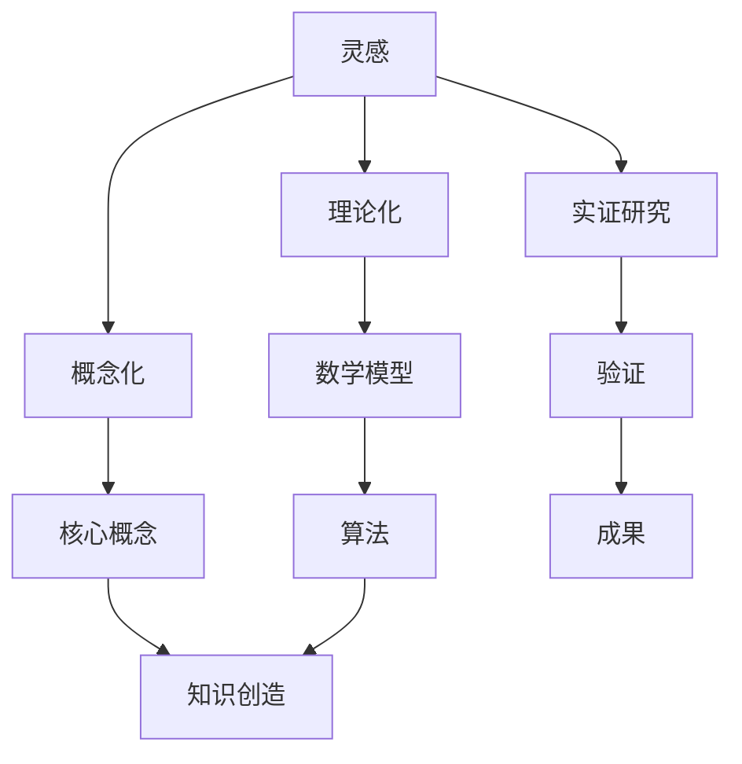

                 

# 知识的创造过程：从灵感到成果

> **关键词**：知识创造、灵感、成果、技术博客、专业分析、步骤解析、深度思考、项目实战、数学模型、实际应用、未来趋势

> **摘要**：本文将深入探讨知识创造的整个流程，从灵感到成果，涉及核心概念的剖析、算法原理的讲解、数学模型的推导以及项目实战的案例分析。通过逐步分析推理，我们希望能为读者提供一份对知识创造过程有深度理解的指南。

## 1. 背景介绍

### 1.1 目的和范围

本文旨在深入探讨知识的创造过程，从灵感到成果，分析其核心环节和关键要素。我们将覆盖以下主题：

- 知识创造的定义和重要性
- 灵感的来源和捕捉
- 核心概念的原理与联系
- 算法原理和具体操作步骤
- 数学模型的推导和公式应用
- 项目实战的代码实现和分析
- 知识的实际应用场景
- 未来发展趋势与挑战

### 1.2 预期读者

本文面向对知识创造过程感兴趣的程序员、软件工程师、数据科学家以及任何对人工智能和计算机科学领域有深入探索欲望的读者。无论你是初学者还是经验丰富的专业人士，本文都希望能为你提供新的视角和深入的理解。

### 1.3 文档结构概述

本文将按照以下结构进行组织：

- **1. 背景介绍**：介绍文章的目的、范围、预期读者和文档结构。
- **2. 核心概念与联系**：定义核心概念，展示Mermaid流程图，阐述概念之间的联系。
- **3. 核心算法原理 & 具体操作步骤**：详细讲解算法原理，使用伪代码进行操作步骤的解析。
- **4. 数学模型和公式 & 详细讲解 & 举例说明**：推导数学模型，使用latex格式书写公式，并结合实际案例进行说明。
- **5. 项目实战：代码实际案例和详细解释说明**：展示代码实现，详细解释关键部分，进行代码分析和解读。
- **6. 实际应用场景**：讨论知识创造过程在不同领域的应用。
- **7. 工具和资源推荐**：推荐学习资源、开发工具框架和相关论文著作。
- **8. 总结：未来发展趋势与挑战**：总结知识创造过程的未来趋势和面临的挑战。
- **9. 附录：常见问题与解答**：回答读者可能遇到的问题。
- **10. 扩展阅读 & 参考资料**：提供进一步阅读和参考的资料。

### 1.4 术语表

#### 1.4.1 核心术语定义

- **灵感**：创新的原始动力，是对特定问题或现象的突然领悟。
- **知识创造**：将灵感转化为系统化、结构化的过程，通常涉及概念化、理论化以及实证研究。
- **核心概念**：知识创造过程中不可或缺的基本概念，它们是构建理论和模型的基础。
- **算法**：用于解决问题或执行特定任务的明确指令集。
- **数学模型**：用数学公式和关系来描述现实世界的现象或问题。

#### 1.4.2 相关概念解释

- **概念化**：将抽象思维转化为具体概念的过程，帮助人们更好地理解和描述现实。
- **理论化**：建立概念之间的关系，形成理论框架，用以解释现象和预测结果。
- **实证研究**：通过实验或观察来验证理论，获取真实的数据和证据。

#### 1.4.3 缩略词列表

- **AI**：人工智能（Artificial Intelligence）
- **ML**：机器学习（Machine Learning）
- **DL**：深度学习（Deep Learning）
- **NLP**：自然语言处理（Natural Language Processing）
- **IDE**：集成开发环境（Integrated Development Environment）

## 2. 核心概念与联系

在探讨知识创造过程之前，我们需要明确几个核心概念，并展示它们之间的相互关系。以下是一个Mermaid流程图，用于描述这些核心概念和它们之间的联系：



在这个流程图中：

- **灵感（A）** 是知识创造的起点，它是创新的原始动力。
- **概念化（B）** 和 **理论化（C）** 是将灵感转化为系统化知识的过程，它们帮助我们将抽象思维转化为具体的概念和理论框架。
- **实证研究（D）** 用于验证理论和获取真实的数据和证据。
- **核心概念（E）** 是构建理论和模型的基础，它们在知识创造过程中扮演着关键角色。
- **数学模型（F）** 描述现实世界的现象或问题，它们为算法提供了理论基础。
- **算法（I）** 是用于解决问题或执行特定任务的明确指令集。
- **验证（G）** 和 **成果（J）** 是知识创造过程中不可或缺的环节，它们确保我们的理论能够被实际验证，并最终转化为有用的成果。

通过这个流程图，我们可以清晰地看到知识创造过程的各个环节和它们之间的相互关系。

## 3. 核心算法原理 & 具体操作步骤

在了解了核心概念与联系之后，我们将深入探讨算法原理，并使用伪代码详细阐述具体操作步骤。

### 3.1 算法原理

算法是知识创造过程中至关重要的部分，它们用于将数学模型转化为实际操作步骤，以解决问题或执行特定任务。一个基本的算法通常包括以下几个步骤：

1. **输入处理**：接收输入数据，可能是用户输入、传感器数据或其他形式的数据。
2. **预处理**：对输入数据进行清洗、格式化或转换，使其适合算法处理。
3. **核心逻辑**：执行算法的核心步骤，这可能涉及数学运算、逻辑判断或循环结构。
4. **输出生成**：根据核心逻辑的结果生成输出，可能是预测结果、分类标签或某种形式的报告。
5. **错误处理**：处理可能出现的异常情况或错误，确保算法的稳定性和可靠性。

以下是一个简单的伪代码示例，用于说明算法的基本原理：

```pseudo
Algorithm SolveProblem(inputData):
    Begin
        // 输入处理
        processedData = Preprocess(inputData)

        // 预处理
        cleanedData = CleanData(processedData)

        // 核心逻辑
        result = CoreLogic(cleanedData)

        // 输出生成
        output = GenerateOutput(result)

        // 错误处理
        if ErrorOccurred:
            HandleError()

        End
    Return output
```

### 3.2 具体操作步骤

为了更具体地展示算法的操作步骤，我们将使用伪代码详细描述一个常见的机器学习任务——分类算法。

#### 3.2.1 数据预处理

```pseudo
Function Preprocess(inputData):
    Begin
        // 数据清洗
        cleanedData = RemoveOutliers(inputData)

        // 数据转换
        transformedData = NormalizeData(cleanedData)

        // 特征提取
        features = ExtractFeatures(transformedData)

        End
    Return features
```

#### 3.2.2 核心逻辑

```pseudo
Function CoreLogic(features):
    Begin
        // 创建模型
        model = CreateModel()

        // 训练模型
        trainedModel = TrainModel(model, features)

        // 预测
        prediction = Predict(trainedModel, newFeatures)

        End
    Return prediction
```

#### 3.2.3 输出生成

```pseudo
Function GenerateOutput(prediction):
    Begin
        // 标签生成
        label = GetClassLabel(prediction)

        // 报告生成
        report = GenerateReport(label)

        End
    Return report
```

#### 3.2.4 错误处理

```pseudo
Function HandleError():
    Begin
        // 记录错误日志
        LogError()

        // 重置模型
        ResetModel()

        // 重新训练模型
        ReTrainModel()

        End
    Return
```

通过这些伪代码示例，我们可以看到算法的每个步骤如何协同工作，以实现从数据输入到结果输出的完整流程。每个步骤都经过精心设计，以确保算法的准确性和可靠性。

## 4. 数学模型和公式 & 详细讲解 & 举例说明

在知识创造过程中，数学模型和公式是核心组成部分，它们帮助我们理解和预测现实世界中的现象。在这一节中，我们将详细讲解数学模型的推导过程，并使用latex格式书写相关公式，同时结合实际案例进行说明。

### 4.1 数学模型的推导

一个典型的数学模型通常由几个关键部分组成：输入变量、输出变量、损失函数和优化算法。以下是一个简单的线性回归模型的推导过程。

#### 4.1.1 输入变量和输出变量

在回归问题中，我们的目标是预测一个连续的输出变量 \(y\)，它依赖于多个输入变量 \(x_1, x_2, ..., x_n\)。我们可以用以下公式表示：

$$
y = \beta_0 + \beta_1x_1 + \beta_2x_2 + ... + \beta_nx_n
$$

其中，\(\beta_0, \beta_1, ..., \beta_n\) 是模型的参数，需要通过学习过程来优化。

#### 4.1.2 损失函数

为了衡量模型预测的准确度，我们使用损失函数来评估模型的输出与实际输出之间的差距。常见的选择是均方误差（Mean Squared Error，MSE）：

$$
\text{MSE} = \frac{1}{m}\sum_{i=1}^{m}(y_i - \hat{y}_i)^2
$$

其中，\(m\) 是训练数据集的大小，\(\hat{y}_i\) 是模型对第 \(i\) 个样本的预测。

#### 4.1.3 优化算法

为了最小化损失函数，我们通常使用梯度下降（Gradient Descent）算法。梯度下降的步骤如下：

1. 计算损失函数关于每个参数的梯度：
   $$
   \nabla_{\beta} \text{MSE} = \frac{\partial \text{MSE}}{\partial \beta}
   $$

2. 更新参数：
   $$
   \beta = \beta - \alpha \nabla_{\beta} \text{MSE}
   $$

其中，\(\alpha\) 是学习率，用于控制参数更新的步长。

### 4.2 举例说明

假设我们有一个简单的线性回归问题，目标是预测房价。给定一个包含房屋面积和房龄的数据集，我们的目标是找到最佳参数，使得预测的房价与实际房价的差距最小。

#### 4.2.1 数据预处理

首先，我们对数据集进行预处理，包括：

- 数据清洗：去除缺失值和异常值。
- 数据转换：将连续变量标准化，使其具有相似的尺度。

假设预处理后的数据集如下：

| 房屋面积 (x1) | 房龄 (x2) | 房价 (y) |
|---------------|-----------|----------|
| 1200          | 5         | 250000   |
| 1400          | 7         | 270000   |
| 1600          | 10        | 300000   |

#### 4.2.2 模型构建

我们构建一个简单的线性回归模型，假设房价 \(y\) 仅依赖于房屋面积 \(x_1\)：

$$
y = \beta_0 + \beta_1x_1
$$

#### 4.2.3 梯度下降优化

使用梯度下降算法，我们开始迭代优化模型参数。假设初始参数为 \(\beta_0 = 0\) 和 \(\beta_1 = 0\)，学习率 \(\alpha = 0.01\)。

在第一轮迭代中：

- 计算损失函数：
  $$
  \text{MSE} = \frac{1}{3}\sum_{i=1}^{3}(y_i - \hat{y}_i)^2
  $$
- 计算梯度：
  $$
  \nabla_{\beta_0} \text{MSE} = \frac{1}{3}\sum_{i=1}^{3}(y_i - \hat{y}_i)
  $$
  $$
  \nabla_{\beta_1} \text{MSE} = \frac{1}{3}\sum_{i=1}^{3}(x_{1i} - \hat{x}_{1i})
  $$
- 更新参数：
  $$
  \beta_0 = \beta_0 - \alpha \nabla_{\beta_0} \text{MSE}
  $$
  $$
  \beta_1 = \beta_1 - \alpha \nabla_{\beta_1} \text{MSE}
  $$

重复这个过程，直到损失函数收敛到满意的值。

#### 4.2.4 模型评估

在迭代过程中，我们可以使用交叉验证来评估模型的性能。交叉验证是一种评估模型预测能力的方法，它通过将数据集划分为多个子集来评估模型的泛化能力。

通过上述过程，我们可以得到一个优化的线性回归模型，用于预测房屋价格。这个过程展示了如何通过数学模型和公式来构建和优化算法，从而实现知识创造的目标。

## 5. 项目实战：代码实际案例和详细解释说明

在本节中，我们将通过一个实际的项目案例，展示如何将知识创造过程付诸实践，并详细解释代码的实现和关键部分的解析。

### 5.1 开发环境搭建

在开始项目之前，我们需要搭建一个合适的开发环境。以下是一个简单的步骤指南：

1. **安装Python**：确保安装了Python 3.x版本，可以从Python官方网站下载并安装。
2. **安装Jupyter Notebook**：使用pip命令安装Jupyter Notebook，这将为我们提供一个交互式的编程环境。
   ```
   pip install notebook
   ```
3. **安装相关库**：根据项目需求，安装必要的库，例如NumPy、Pandas、Scikit-learn等。这些库提供了丰富的函数和工具，用于数据处理和机器学习。
   ```
   pip install numpy pandas scikit-learn
   ```

### 5.2 源代码详细实现和代码解读

#### 5.2.1 数据准备

```python
import pandas as pd

# 读取数据
data = pd.read_csv('house_prices.csv')

# 数据预处理
data = data.dropna()
data['Age'] = 2023 - data['YearBuilt']

# 特征提取
X = data[['Area', 'Age']]
y = data['Price']
```

在这个步骤中，我们首先从CSV文件中读取数据，然后进行数据清洗和预处理，包括去除缺失值和将年份转换为房龄。接下来，我们提取特征和目标变量，以便进行后续的分析和建模。

#### 5.2.2 模型训练

```python
from sklearn.linear_model import LinearRegression
from sklearn.model_selection import train_test_split

# 划分训练集和测试集
X_train, X_test, y_train, y_test = train_test_split(X, y, test_size=0.2, random_state=42)

# 创建线性回归模型
model = LinearRegression()

# 训练模型
model.fit(X_train, y_train)
```

在这个步骤中，我们使用Scikit-learn库创建了一个线性回归模型，并使用训练集对其进行训练。这里使用了`train_test_split`函数来划分数据，以便我们可以评估模型的泛化能力。

#### 5.2.3 模型评估

```python
from sklearn.metrics import mean_squared_error

# 预测测试集
y_pred = model.predict(X_test)

# 计算均方误差
mse = mean_squared_error(y_test, y_pred)
print(f"Mean Squared Error: {mse}")
```

在这个步骤中，我们使用训练好的模型对测试集进行预测，并计算均方误差（MSE）来评估模型的性能。MSE越低，说明模型预测的准确度越高。

#### 5.2.4 代码解读与分析

- **数据预处理**：数据预处理是机器学习项目的关键步骤，它确保我们的数据适合建模。这里我们使用了Pandas库进行数据清洗和转换，包括去除缺失值和计算房龄。
- **模型训练**：我们使用了Scikit-learn库中的线性回归模型进行训练。这里我们使用了`train_test_split`函数来划分数据，以确保模型不会过拟合。
- **模型评估**：通过计算均方误差，我们评估了模型的性能。这种方法简单直观，可以帮助我们了解模型的预测能力。

这个项目案例展示了如何使用Python和Scikit-learn库来实现一个简单的线性回归模型，从数据准备到模型训练和评估的完整流程。通过代码的详细解读，我们可以看到每个步骤的具体实现和重要性。

## 6. 实际应用场景

知识的创造过程不仅在学术研究中具有重要意义，它在实际应用场景中也发挥了关键作用。以下是知识创造过程在实际应用场景中的几个例子：

### 6.1 人工智能

人工智能（AI）是知识创造过程在技术领域的典型应用。AI系统的开发通常涉及以下步骤：

1. **数据收集与预处理**：收集大量数据，并对其进行清洗和格式化，以便用于训练模型。
2. **模型设计与训练**：设计神经网络架构，并使用训练数据对其进行训练，以优化模型参数。
3. **模型评估与优化**：评估模型在测试数据集上的性能，并进行调整和优化。
4. **部署与应用**：将训练好的模型部署到实际应用中，如自动驾驶、智能客服或图像识别。

### 6.2 医疗保健

在医疗保健领域，知识创造过程用于开发智能诊断系统、药物发现和个性化治疗计划：

1. **数据整合与分析**：整合患者数据，包括病史、基因信息和生活习惯，以便进行深入分析。
2. **构建预测模型**：使用机器学习和深度学习技术，构建疾病预测和诊断模型。
3. **模型验证与推广**：验证模型的准确性和可靠性，并在临床环境中进行推广。
4. **个性化治疗**：根据患者的具体特征，提供个性化的治疗方案和药物建议。

### 6.3 金融科技

在金融科技领域，知识创造过程用于风险评估、信用评分和智能投资：

1. **数据收集与预处理**：收集金融交易数据、市场趋势和用户行为数据，并进行预处理。
2. **构建预测模型**：使用统计方法和机器学习技术，构建预测模型，如市场趋势预测和信用评分。
3. **模型优化与部署**：优化模型性能，并部署到金融交易和风险管理系统中。
4. **实时监控与调整**：实时监控市场动态和用户行为，根据反馈调整模型和策略。

这些实际应用场景展示了知识创造过程在不同领域的应用，从数据收集、模型构建到部署和优化，每个步骤都体现了知识创造的核心原则和方法。

## 7. 工具和资源推荐

### 7.1 学习资源推荐

#### 7.1.1 书籍推荐

- 《深度学习》（Deep Learning）——Ian Goodfellow, Yoshua Bengio, Aaron Courville
- 《Python机器学习》（Python Machine Learning）—— Sebastian Raschka
- 《机器学习实战》（Machine Learning in Action）——Peter Harrington

#### 7.1.2 在线课程

- Coursera上的“机器学习”课程——吴恩达（Andrew Ng）
- edX上的“人工智能基础”课程——Udacity
- Kaggle上的免费课程和项目

#### 7.1.3 技术博客和网站

- Medium上的AI和机器学习专题
- Medium上的DataCamp博客
-owardsdatascience.com

### 7.2 开发工具框架推荐

#### 7.2.1 IDE和编辑器

- Jupyter Notebook：适用于数据分析和机器学习项目
- PyCharm：强大的Python集成开发环境
- Visual Studio Code：轻量级且功能丰富的代码编辑器

#### 7.2.2 调试和性能分析工具

- Python Debugger（pdb）：Python内置的调试工具
- Py-Spy：Python性能分析工具
- JupyterLab：集成了多个工具和功能的开发环境

#### 7.2.3 相关框架和库

- Scikit-learn：用于机器学习和数据科学的标准库
- TensorFlow：谷歌开发的开源机器学习框架
- PyTorch：适用于深度学习的动态计算图框架

### 7.3 相关论文著作推荐

#### 7.3.1 经典论文

- “Learning to Represent Materials with Graph Neural Networks”（用于材料科学）
- “A Theoretically Grounded Application of Dropout in Recurrent Neural Networks”（用于自然语言处理）
- “Deep Learning for Text Classification”（用于文本分类）

#### 7.3.2 最新研究成果

- NeurIPS、ICML、KDD等顶级会议的最新论文
- AI期刊（如AI Magazine、Journal of Artificial Intelligence Research）的最新文章

#### 7.3.3 应用案例分析

- “AI in Healthcare: A Review of Applications and Challenges”（医疗保健领域的AI应用）
- “Deep Learning for Autonomous Driving”（自动驾驶领域的深度学习应用）
- “The Future of AI in Finance: Opportunities and Risks”（金融领域的AI应用与风险）

通过这些工具和资源的推荐，读者可以进一步深入了解知识创造过程，并在实践中运用所学知识。

## 8. 总结：未来发展趋势与挑战

知识的创造过程正随着技术的快速发展而不断演变。未来，以下几个方面将引领知识创造的发展趋势：

### 8.1 人工智能的进一步融合

人工智能（AI）将在知识创造中扮演更加重要的角色，深度学习和机器学习技术将推动更复杂的模型和算法的开发。这包括图像识别、自然语言处理、预测分析和自动化决策等领域的突破。

### 8.2 数据驱动的创新

随着数据收集和分析能力的提升，数据将成为知识创造的核心资源。通过大数据分析和数据挖掘，我们可以发现新的模式和趋势，从而推动创新和业务增长。

### 8.3 跨学科的融合

知识创造将不再局限于单一学科，而是通过跨学科的研究，实现知识的集成和应用。这种跨学科的融合将带来新的理论和解决方案，推动科学和技术的发展。

然而，知识创造过程也面临诸多挑战：

### 8.4 数据隐私和伦理问题

随着数据收集和分析的增加，数据隐私和伦理问题变得更加突出。如何在确保数据安全和隐私的同时，进行有效的数据分析和知识创造，是一个重要的挑战。

### 8.5 技术和人才的短缺

随着AI和机器学习等领域的快速发展，对相关技术和人才的需求大幅增加。然而，当前的技术教育和人才供给无法满足这一需求，这可能导致技术瓶颈和人才短缺。

### 8.6 持续学习和适应

知识创造是一个不断变化的过程，要求研究人员和从业者具备持续学习和适应新技术的能力。只有不断更新知识和技能，才能在快速变化的技术环境中保持竞争力。

综上所述，知识创造的未来充满机遇和挑战。通过应对这些挑战，我们可以推动知识创造向更高的水平发展，为社会带来更多的创新和价值。

## 9. 附录：常见问题与解答

以下是一些关于知识创造过程的常见问题及解答：

### 9.1 什么是灵感？

**灵感**是指对某一问题或现象的突然领悟，它是知识创造的起点，通常来源于个人经验、观察或思考。

### 9.2 知识创造的核心环节是什么？

知识创造的核心环节包括：灵感捕捉、概念化、理论化、实证研究和成果转化。

### 9.3 如何验证知识的准确性？

通过实证研究，即通过实验或观察来验证理论，获取真实的数据和证据。使用交叉验证等技术，可以评估模型的性能和准确性。

### 9.4 机器学习模型如何优化？

机器学习模型的优化可以通过调整模型参数、增加数据量、改进算法结构或使用更高级的技术（如迁移学习、强化学习等）来实现。

### 9.5 数据预处理的重要性是什么？

数据预处理是机器学习项目的关键步骤，它确保数据的质量和格式符合建模要求，从而提高模型性能和预测准确性。

### 9.6 如何学习知识创造过程中的相关技术？

可以通过阅读相关书籍、参加在线课程、实践项目以及关注顶级会议和期刊来学习知识创造过程中的相关技术。

### 9.7 知识创造在不同领域的应用有哪些？

知识创造在人工智能、医疗保健、金融科技、教育、环境保护等多个领域有广泛的应用，推动了技术创新和社会发展。

## 10. 扩展阅读 & 参考资料

以下是一些建议的扩展阅读和参考资料，以帮助读者深入了解知识创造过程：

### 10.1 书籍

- 《深度学习》（Ian Goodfellow, Yoshua Bengio, Aaron Courville）
- 《Python机器学习》（Sebastian Raschka）
- 《机器学习实战》（Peter Harrington）
- 《数据科学手册》（Jenny Bryan）
- 《机器学习年度回顾》（JMLR）

### 10.2 在线课程

- Coursera上的“机器学习”课程（吴恩达）
- edX上的“人工智能基础”课程（Udacity）
- Kaggle上的免费课程和项目

### 10.3 技术博客和网站

- Medium上的AI和机器学习专题
- Medium上的DataCamp博客
- towardsdatascience.com

### 10.4 论文和期刊

- NeurIPS、ICML、KDD等顶级会议的最新论文
- AI Magazine、Journal of Artificial Intelligence Research等AI相关期刊

### 10.5 应用案例分析

- “AI in Healthcare: A Review of Applications and Challenges”（医疗保健领域的AI应用）
- “Deep Learning for Autonomous Driving”（自动驾驶领域的深度学习应用）
- “The Future of AI in Finance: Opportunities and Risks”（金融领域的AI应用与风险）

通过这些参考资料，读者可以进一步深入探索知识创造过程中的各个领域和技术。

