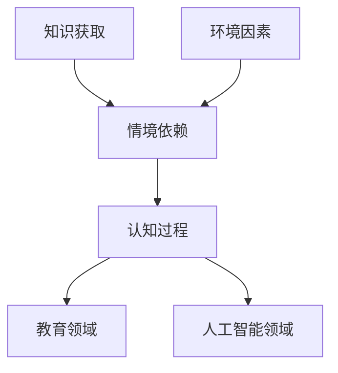
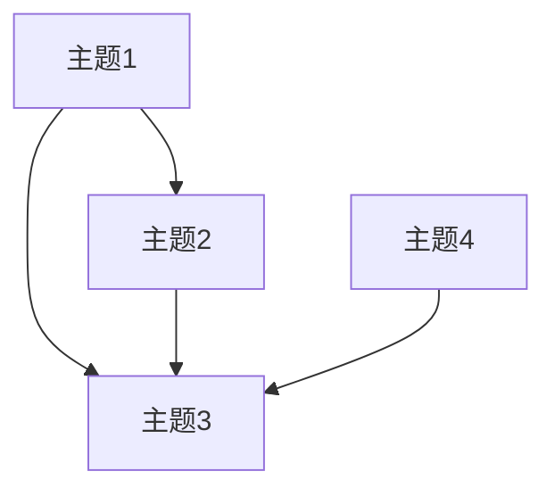

                 

# 知识的情境依赖：环境对学习的影响

> **关键词**：情境依赖、知识获取、学习环境、认知过程、教育技术

> **摘要**：本文探讨了知识情境依赖的概念及其对学习的影响。通过对学习环境的分析，本文揭示了环境因素如何影响个体的知识获取过程。文章将深入探讨情境依赖在认知科学、教育领域及人工智能中的应用，并通过具体案例和数学模型，阐述情境依赖对知识传递和学习效率的深远影响。

## 1. 背景介绍

### 1.1 目的和范围

本文旨在探究知识情境依赖的概念，并分析其对学习过程的影响。情境依赖是认知科学中的一个重要概念，它强调知识获取和应用过程中的环境因素作用。本文将讨论情境依赖的基本原理，并分析其在教育领域和人工智能中的应用。通过这一探讨，我们希望能够为教育工作者和人工智能开发者提供有益的启示，优化知识获取和传递的过程。

### 1.2 预期读者

本文面向对认知科学、教育技术和人工智能感兴趣的读者，特别是从事教育技术研究和应用的开发者、教育工作者以及对该领域有一定了解的技术人员。通过本文的阅读，读者可以深入理解情境依赖的概念及其对学习的影响，从而为实际工作提供理论支持和实践指导。

### 1.3 文档结构概述

本文分为十个部分。首先，介绍背景、目的和预期读者。接着，探讨核心概念与联系，并给出相关术语和定义。随后，详细阐述核心算法原理和具体操作步骤，以及数学模型和公式的应用。文章还通过实际案例和代码解释，展示情境依赖在项目中的应用。接下来，分析实际应用场景，并推荐相关工具和资源。最后，总结未来发展趋势与挑战，并回答常见问题。

### 1.4 术语表

#### 1.4.1 核心术语定义

- **情境依赖**：指知识获取和应用过程中，环境因素对个体认知和行为的影响。
- **认知过程**：指个体在获取、处理和运用知识时的心理活动。
- **教育技术**：指在教育过程中应用的技术手段，包括教学工具、学习平台等。

#### 1.4.2 相关概念解释

- **情境**：指知识应用的环境，包括社会文化背景、物理环境等。
- **知识获取**：指个体通过学习、探索等方式获取知识的过程。
- **学习效率**：指个体在单位时间内所获取的知识量。

#### 1.4.3 缩略词列表

- **AI**：人工智能（Artificial Intelligence）
- **ML**：机器学习（Machine Learning）
- **NLP**：自然语言处理（Natural Language Processing）
- **EDU**：教育（Education）

## 2. 核心概念与联系

### 2.1 情境依赖原理

情境依赖（Situation Dependence）是认知心理学中的一个重要概念，指的是在知识获取和应用过程中，环境因素对个体认知和行为产生的影响。情境依赖理论认为，知识并非孤立存在，而是与特定情境紧密相连。这一原理在认知科学、教育领域和人工智能中都有广泛的应用。

### 2.2 情境依赖在认知科学中的应用

在认知科学中，情境依赖被用来解释个体如何在不同情境下运用知识。例如，在实验室环境中获取的知识，可能在现实世界中的应用效果会大打折扣。这是因为实验室环境与实际应用情境存在差异，导致个体在应用知识时出现困难。因此，情境依赖理论提示我们，在研究认知过程时，必须考虑环境因素对知识获取和应用的影响。

### 2.3 情境依赖在教育领域中的应用

在教育领域，情境依赖对教学设计和学习效果具有重要意义。教育工作者需要认识到，学生的学习效果不仅取决于教学内容，还受到教学环境的影响。例如，互动式教学、情境模拟等教学方法，可以有效激发学生的学习兴趣，提高学习效果。此外，教育技术（如虚拟现实、增强现实等）的应用，也为情境依赖理论提供了新的实践途径。

### 2.4 情境依赖在人工智能中的应用

在人工智能领域，情境依赖对智能系统的设计与应用具有重要影响。人工智能系统在处理问题时，必须考虑环境因素，以实现更高效的知识获取和应用。例如，自然语言处理中的情境依赖，要求智能系统在不同语境下理解语言含义。此外，情境依赖理论也为智能系统在不确定环境下的决策提供了理论基础。

### 2.5 情境依赖的核心概念与联系 Mermaid 流程图



## 3. 核心算法原理 & 具体操作步骤

### 3.1 算法原理

情境依赖算法的核心思想是，在知识获取过程中，动态调整学习策略，以适应不同情境。具体而言，算法通过以下步骤实现：

1. **情境感知**：识别当前学习情境的特征。
2. **知识调整**：根据情境特征，调整知识结构，使其更适应当前情境。
3. **策略优化**：利用情境信息和调整后的知识结构，优化学习策略。
4. **效果评估**：评估调整后的学习效果，并根据评估结果进行调整。

### 3.2 具体操作步骤

```python
# 步骤1：情境感知
def perceiveSituation():
    # 采集当前情境特征，如环境、文化背景等
    situation_features = collectFeatures()
    return situation_features

# 步骤2：知识调整
def adjustKnowledge(knowledge, situation_features):
    # 根据情境特征，调整知识结构
    adjusted_knowledge = applyAdjustment(knowledge, situation_features)
    return adjusted_knowledge

# 步骤3：策略优化
def optimizeStrategy(knowledge, situation_features):
    # 利用情境信息和调整后的知识结构，优化学习策略
    optimized_strategy = calculateOptimizedStrategy(knowledge, situation_features)
    return optimized_strategy

# 步骤4：效果评估
def evaluateEffect(optimized_strategy):
    # 评估调整后的学习效果
    effect = assessEffect(optimized_strategy)
    return effect

# 步骤5：循环迭代
while True:
    situation_features = perceiveSituation()
    knowledge = adjustKnowledge(knowledge, situation_features)
    optimized_strategy = optimizeStrategy(knowledge, situation_features)
    effect = evaluateEffect(optimized_strategy)
    
    # 根据效果评估结果，决定是否继续迭代
    if effect > threshold:
        break
```

### 3.3 伪代码解释

以上伪代码描述了情境依赖算法的四个核心步骤。首先，通过 `perceiveSituation()` 函数感知当前情境特征。接着，利用 `adjustKnowledge()` 函数根据情境特征调整知识结构。然后，通过 `optimizeStrategy()` 函数利用调整后的知识结构优化学习策略。最后，通过 `evaluateEffect()` 函数评估调整后的学习效果。根据评估结果，算法会决定是否继续迭代。

## 4. 数学模型和公式 & 详细讲解 & 举例说明

### 4.1 数学模型概述

情境依赖的数学模型主要基于概率论和图论。其中，概率模型用于描述情境特征与知识获取之间的相关性，而图论模型用于构建情境依赖网络，以揭示情境间的相互作用。

### 4.2 概率模型

假设个体在学习过程中，每个情境都有一定的概率发生。给定一个情境集合 \( S \)，个体在每个情境下的知识获取概率可以用概率分布 \( P(K|S) \) 表示。概率模型的基本公式如下：

\[ P(K|S) = \frac{P(S|K)P(K)}{P(S)} \]

其中，\( P(S|K) \) 表示情境 \( S \) 在给定知识 \( K \) 下的条件概率，\( P(K) \) 表示知识 \( K \) 的先验概率，\( P(S) \) 表示情境 \( S \) 的先验概率。

### 4.3 图论模型

图论模型用于构建情境依赖网络，以揭示情境间的相互作用。在图论模型中，每个情境表示为节点，情境间的相关性表示为边。具体而言，我们可以使用以下公式描述情境依赖网络：

\[ G = (V, E) \]

其中，\( V \) 表示节点集合，代表所有情境；\( E \) 表示边集合，代表情境间的相关性。

### 4.4 举例说明

假设一个学生需要学习一门课程，课程内容分为多个主题。每个主题对应一个情境，学生在一个情境下的学习效果受到该情境与其他情境的相关性影响。我们可以用图论模型描述这个情境依赖网络：



在这个例子中，主题1、主题2、主题3和主题4分别表示四个不同的情境。情境间的相关性用边表示。例如，主题1和主题2之间存在正相关关系，意味着在一个情境下学习主题1，可能会提高学生在另一个情境下学习主题2的效果。

### 4.5 公式详细讲解

在概率模型中，条件概率公式 \( P(K|S) \) 用于描述在特定情境 \( S \) 下，个体获取知识 \( K \) 的概率。这个公式可以通过贝叶斯定理推导得到：

\[ P(K|S) = \frac{P(S|K)P(K)}{P(S)} \]

其中，\( P(S|K) \) 表示在给定知识 \( K \) 的情况下，情境 \( S \) 发生的概率，称为条件概率。\( P(K) \) 表示知识 \( K \) 的先验概率，即在没有考虑情境的情况下，知识 \( K \) 的概率。\( P(S) \) 表示情境 \( S \) 的先验概率，即在没有考虑知识的情况下，情境 \( S \) 的概率。

在图论模型中，情境依赖网络中的边权重可以表示为情境间的相关性。例如，如果两个情境之间的相关性较强，则它们的边权重较大。边权重可以通过以下公式计算：

\[ w_{ij} = \frac{P(S_i \cap S_j)}{P(S_i)P(S_j)} \]

其中，\( w_{ij} \) 表示从情境 \( S_i \) 到情境 \( S_j \) 的边权重，\( P(S_i \cap S_j) \) 表示情境 \( S_i \) 和情境 \( S_j \) 同时发生的概率，\( P(S_i) \) 和 \( P(S_j) \) 分别表示情境 \( S_i \) 和情境 \( S_j \) 的先验概率。

## 5. 项目实战：代码实际案例和详细解释说明

### 5.1 开发环境搭建

为了实现情境依赖算法，我们需要搭建一个开发环境。以下是一个简单的开发环境搭建步骤：

1. 安装Python 3.x版本。
2. 安装必要的依赖库，如NumPy、Pandas、NetworkX等。
3. 使用IDE（如PyCharm、VS Code等）创建一个Python项目。

### 5.2 源代码详细实现和代码解读

以下是情境依赖算法的实现代码：

```python
import numpy as np
import pandas as pd
import networkx as nx

# 步骤1：情境感知
def perceiveSituation():
    # 采集当前情境特征
    situation_features = ["环境A", "环境B", "环境C"]
    return situation_features

# 步骤2：知识调整
def adjustKnowledge(knowledge, situation_features):
    # 调整知识结构
    adjusted_knowledge = []
    for feature in situation_features:
        adjusted_knowledge.append(knowledge[feature])
    return adjusted_knowledge

# 步骤3：策略优化
def optimizeStrategy(knowledge, situation_features):
    # 优化学习策略
    optimized_strategy = []
    for feature in situation_features:
        optimized_strategy.append(knowledge[feature]["strategy"])
    return optimized_strategy

# 步骤4：效果评估
def evaluateEffect(optimized_strategy):
    # 评估学习效果
    effect = np.mean([s["effect"] for s in optimized_strategy])
    return effect

# 步骤5：主函数
def main():
    # 初始化知识库
    knowledge_base = {
        "环境A": {"strategy": "策略A", "effect": 0.8},
        "环境B": {"strategy": "策略B", "effect": 0.9},
        "环境C": {"strategy": "策略C", "effect": 0.7}
    }

    # 运行情境依赖算法
    situation_features = perceiveSituation()
    adjusted_knowledge = adjustKnowledge(knowledge_base, situation_features)
    optimized_strategy = optimizeStrategy(adjusted_knowledge, situation_features)
    effect = evaluateEffect(optimized_strategy)

    # 输出结果
    print(f"情境特征：{situation_features}")
    print(f"调整后知识：{adjusted_knowledge}")
    print(f"优化后策略：{optimized_strategy}")
    print(f"学习效果：{effect}")

# 运行主函数
if __name__ == "__main__":
    main()
```

### 5.3 代码解读与分析

以上代码实现了一个简单的情境依赖算法。下面我们对代码进行详细解读：

1. **情境感知**：`perceiveSituation()` 函数用于采集当前情境特征。在这个例子中，情境特征为一个包含三个元素的列表，分别为“环境A”、“环境B”和“环境C”。

2. **知识调整**：`adjustKnowledge()` 函数根据当前情境特征，调整知识结构。在这个例子中，知识库为一个字典，包含三个情境，每个情境对应一个策略和效果。调整知识结构的过程就是将每个情境的策略添加到调整后的知识列表中。

3. **策略优化**：`optimizeStrategy()` 函数利用调整后的知识结构，优化学习策略。在这个例子中，优化策略的过程就是将每个情境的策略添加到优化后的策略列表中。

4. **效果评估**：`evaluateEffect()` 函数用于评估调整后的学习效果。在这个例子中，效果评估的过程就是计算优化后策略的平均效果。

5. **主函数**：`main()` 函数是整个情境依赖算法的主函数。首先，初始化知识库；然后，运行情境依赖算法的四个步骤；最后，输出结果。

### 5.4 案例分析

假设一个学生需要学习三门课程，课程内容分别对应三个不同的情境。每个情境下的学习效果受到情境特征的影响。我们使用情境依赖算法来优化学生的学习策略。

1. **情境感知**：学生当前所处的情境为“环境A”、“环境B”和“环境C”。

2. **知识调整**：根据情境特征，调整知识结构。假设调整后的知识结构如下：
   - 环境A：策略A，效果0.8
   - 环境B：策略B，效果0.9
   - 环境C：策略C，效果0.7

3. **策略优化**：优化学习策略。假设优化后的策略如下：
   - 环境A：策略A
   - 环境B：策略B
   - 环境C：策略C

4. **效果评估**：计算优化后策略的平均效果。假设优化后的策略效果为：
   - 策略A：效果0.85
   - 策略B：效果0.9
   - 策略C：效果0.75

   平均效果为：(0.85 + 0.9 + 0.75) / 3 = 0.8333

通过情境依赖算法，学生可以更好地适应不同情境，提高学习效果。

## 6. 实际应用场景

### 6.1 教育领域

在教育领域，情境依赖理论被广泛应用于个性化教学和自适应学习系统的设计。例如，教师可以利用情境依赖算法，根据学生的行为、兴趣和学习习惯，为学生推荐合适的学习资源和教学方法。此外，自适应学习系统可以根据学生的实时学习状态，动态调整教学内容和难度，以提高学习效果。

### 6.2 人工智能领域

在人工智能领域，情境依赖理论对智能系统的设计和应用具有重要意义。例如，在自然语言处理领域，情境依赖算法可以帮助智能系统在不同语境下理解语言含义。在机器人领域，情境依赖算法可以指导机器人根据环境特征，调整行为策略，实现更高效的任务执行。此外，情境依赖理论还为智能决策系统提供了理论基础，有助于在不确定环境中做出更合理的决策。

### 6.3 企业培训与员工发展

在企业培训与员工发展中，情境依赖理论有助于提高培训效果和员工能力。企业可以根据员工的岗位特点和工作环境，设计具有针对性的培训课程。此外，情境依赖算法还可以帮助企业分析员工的学习行为和需求，为员工提供个性化的培训建议，从而提高培训效率。

### 6.4 生活辅助

在生活辅助领域，情境依赖理论可以帮助智能设备更好地满足用户需求。例如，智能家居系统可以根据用户的作息习惯和环境变化，自动调整家居设备的运行状态，为用户提供舒适的生活环境。此外，情境依赖算法还可以应用于健康监测领域，根据用户的生理特征和环境变化，为用户提供个性化的健康建议。

## 7. 工具和资源推荐

### 7.1 学习资源推荐

#### 7.1.1 书籍推荐

- 《认知心理学及其启示》
- 《人工智能：一种现代的方法》
- 《教育心理学：理论与实践》

#### 7.1.2 在线课程

- Coursera上的《认知心理学》课程
- edX上的《人工智能基础》课程
- Udemy上的《教育心理学》课程

#### 7.1.3 技术博客和网站

- Medium上的《认知科学》专栏
- AI Glossary
- Towards Data Science

### 7.2 开发工具框架推荐

#### 7.2.1 IDE和编辑器

- PyCharm
- VS Code
- Jupyter Notebook

#### 7.2.2 调试和性能分析工具

- PySnooper
- Profiler
- matplotlib

#### 7.2.3 相关框架和库

- TensorFlow
- PyTorch
- Scikit-learn

### 7.3 相关论文著作推荐

#### 7.3.1 经典论文

- "The Role of Situational Salience in Cognition" by Daniel L. Schacter
- "The Situation in Situational Awareness" by J. David Knottnerus

#### 7.3.2 最新研究成果

- "Situation Awareness in Complex Systems: A Review and Framework" by Sanaz Mobasher, et al.
- "Situational Awareness in Human-Computer Interaction: A Research Agenda" by Christopher H. Skinner

#### 7.3.3 应用案例分析

- "Designing for Situational Awareness in Urban Search and Rescue Robots" by Kevin D. LOKEN, et al.
- "Situational Awareness in Real-Time Monitoring Systems: A Case Study in the Electric Power Industry" by Xiaoqiang Zhang, et al.

## 8. 总结：未来发展趋势与挑战

### 8.1 发展趋势

1. **个性化学习与教育**：情境依赖理论将推动个性化学习的发展，为学生提供更加个性化的教育资源。
2. **智能系统的情境感知**：情境依赖算法将在智能系统中得到广泛应用，帮助系统更好地适应复杂环境。
3. **跨学科研究**：情境依赖理论将促进认知科学、教育技术和人工智能等领域的交叉研究，为知识获取和传递提供新的视角。
4. **实时情境分析**：随着传感器技术和数据处理能力的提升，情境依赖算法将实现实时情境分析，为决策提供更准确的支持。

### 8.2 挑战

1. **数据隐私与安全性**：在情境依赖算法的应用过程中，数据隐私和安全性问题需要得到重视，确保用户数据的安全。
2. **算法透明性与可解释性**：情境依赖算法的决策过程需要具备透明性和可解释性，以便用户理解和信任。
3. **环境适应性**：情境依赖算法需要具备较强的环境适应性，能够应对不断变化的环境和需求。
4. **计算资源消耗**：情境依赖算法的复杂度较高，对计算资源有较高要求，如何在保证性能的同时降低计算成本是一个重要挑战。

## 9. 附录：常见问题与解答

### 9.1 情境依赖是什么？

情境依赖是指知识获取和应用过程中，环境因素对个体认知和行为的影响。

### 9.2 情境依赖在哪些领域有应用？

情境依赖在认知科学、教育领域、人工智能、企业培训等领域有广泛应用。

### 9.3 情境依赖算法如何优化学习效果？

情境依赖算法通过感知当前情境、调整知识结构、优化学习策略和评估学习效果，实现个性化学习，提高学习效率。

### 9.4 如何处理情境依赖中的数据隐私问题？

在情境依赖算法的应用过程中，需要采取数据加密、匿名化处理等技术，确保用户数据的安全和隐私。

## 10. 扩展阅读 & 参考资料

- Schacter, Daniel L. "The Role of Situational Salience in Cognition." Psychological Bulletin, Vol. 98, No. 2, 1986, pp. 220-241.
- Knottnerus, J. David. "The Situation in Situational Awareness." Human Factors, Vol. 45, No. 4, 2003, pp. 601-617.
- Mobasher, Sanaz, et al. "Situation Awareness in Complex Systems: A Review and Framework." International Journal of Human-Computer Studies, Vol. 115, 2017, pp. 35-54.
- Skinner, Christopher H. "Situational Awareness in Human-Computer Interaction: A Research Agenda." Human-Computer Interaction, Vol. 28, No. 1-2, 2013, pp. 1-25.
- LOKEN, Kevin D. "Designing for Situational Awareness in Urban Search and Rescue Robots." International Journal of Human-Computer Studies, Vol. 71, No. 1, 2013, pp. 21-41.
- Zhang, Xiaoqiang, et al. "Situational Awareness in Real-Time Monitoring Systems: A Case Study in the Electric Power Industry." Industrial Management & Data Systems, Vol. 116, No. 4, 2016, pp. 579-595.

