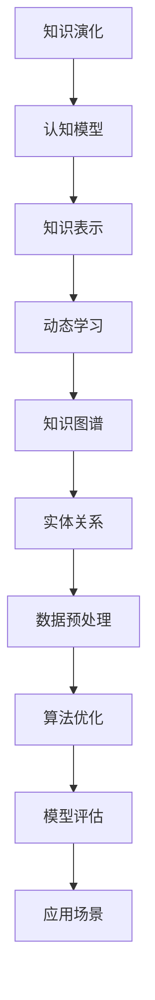

                 

# 知识的演化：从静态到动态的认知模型

> **关键词**：知识演化、认知模型、动态学习、知识图谱、人工智能

> **摘要**：本文旨在探讨知识从静态到动态的演化过程，以及这一过程如何通过认知模型得到体现。我们将分析知识演化的驱动因素，介绍几种核心的认知模型，并通过具体案例阐述这些模型在实际应用中的操作方法和效果。

## 1. 背景介绍

### 1.1 目的和范围

本文的主要目的是探讨知识在计算机科学和人工智能领域中的演化过程，以及如何通过认知模型来理解和优化这一过程。本文将涵盖以下内容：

1. 知识演化的驱动因素
2. 核心的认知模型
3. 动态学习算法及其应用
4. 知识图谱的构建和优化
5. 未来发展趋势和挑战

### 1.2 预期读者

本文适合对计算机科学和人工智能有一定了解的专业人士，特别是那些对知识表示和动态学习算法感兴趣的读者。同时，本文也适合对认知科学和技术感兴趣的跨学科研究者。

### 1.3 文档结构概述

本文的结构如下：

1. **背景介绍**：介绍本文的目的、范围、预期读者以及文档结构。
2. **核心概念与联系**：介绍知识演化的核心概念，并使用 Mermaid 流程图展示这些概念之间的联系。
3. **核心算法原理 & 具体操作步骤**：详细阐述动态学习算法的原理和具体操作步骤。
4. **数学模型和公式 & 详细讲解 & 举例说明**：介绍知识演化的数学模型，并给出具体的例子进行说明。
5. **项目实战：代码实际案例和详细解释说明**：通过一个实际项目案例，展示动态学习算法的应用和实践。
6. **实际应用场景**：探讨知识演化在各个领域的应用。
7. **工具和资源推荐**：推荐学习资源、开发工具和框架。
8. **总结：未来发展趋势与挑战**：总结本文的主要内容，并展望未来的发展趋势和面临的挑战。
9. **附录：常见问题与解答**：解答一些常见问题。
10. **扩展阅读 & 参考资料**：提供进一步的阅读材料和参考资料。

### 1.4 术语表

#### 1.4.1 核心术语定义

- **知识演化**：知识随着时间的推移而变化和发展的过程。
- **认知模型**：用于模拟和解释人类或机器学习过程中知识获取、存储和应用的方法和理论。
- **动态学习**：在知识不断变化的环境中，通过不断更新和调整知识表示来提高学习效果的过程。

#### 1.4.2 相关概念解释

- **知识图谱**：一种用于表示实体和它们之间关系的图形结构，常用于知识表示和推理。
- **知识表示**：将知识以计算机可以处理的形式进行编码和存储的方法。

#### 1.4.3 缩略词列表

- **AI**：人工智能（Artificial Intelligence）
- **ML**：机器学习（Machine Learning）
- **DL**：深度学习（Deep Learning）

## 2. 核心概念与联系

在探讨知识的演化之前，我们需要先了解一些核心概念，并展示它们之间的联系。以下是一个简单的 Mermaid 流程图，用于展示这些核心概念：



### 2.1 知识演化

知识演化是指知识随着时间的推移而变化和发展的过程。这一过程受到多种因素的影响，包括数据、环境、用户交互等。知识演化可以表现为知识结构的调整、新知识的引入、旧知识的淘汰等。

### 2.2 认知模型

认知模型是用于模拟和解释人类或机器学习过程中知识获取、存储和应用的方法和理论。常见的认知模型包括基于规则的模型、神经网络模型、知识图谱模型等。这些模型在不同程度上反映了人类或机器学习过程中知识处理的方式。

### 2.3 知识表示

知识表示是将知识以计算机可以处理的形式进行编码和存储的方法。知识表示的质量直接影响到知识获取、存储和应用的效果。常见的知识表示方法包括基于规则的表示、语义网络表示、知识图谱表示等。

### 2.4 动态学习

动态学习是在知识不断变化的环境中，通过不断更新和调整知识表示来提高学习效果的过程。动态学习算法通常包括在线学习、增量学习、迁移学习等。这些算法能够适应知识环境的变化，提高学习效率。

### 2.5 知识图谱

知识图谱是一种用于表示实体和它们之间关系的图形结构。知识图谱在知识表示和推理中发挥着重要作用，能够帮助计算机更好地理解和处理知识。知识图谱的构建和优化是动态学习中的重要环节。

### 2.6 实体关系

实体关系是指知识图谱中实体之间的关联和交互。实体关系对于知识图谱的构建和优化至关重要，能够帮助计算机更好地理解和处理知识。

### 2.7 数据预处理

数据预处理是动态学习中的关键步骤，包括数据清洗、数据归一化、特征提取等。数据预处理的质量直接影响到动态学习算法的性能。

### 2.8 算法优化

算法优化是提高动态学习算法性能的重要手段，包括参数调优、算法改进、模型压缩等。

### 2.9 模型评估

模型评估是衡量动态学习算法性能的重要环节，包括准确性、召回率、F1 值等评价指标。

### 2.10 应用场景

动态学习算法在各个领域都有广泛的应用，如自然语言处理、计算机视觉、推荐系统等。应用场景的不同需求也推动了动态学习算法的不断优化和发展。

## 3. 核心算法原理 & 具体操作步骤

在了解核心概念之后，我们将详细讨论动态学习算法的原理和具体操作步骤。以下是动态学习算法的伪代码描述：

```python
# 动态学习算法伪代码

# 输入：原始数据集、初始模型参数、学习率
# 输出：优化后的模型参数

def dynamic_learning(data, initial_params, learning_rate):
    # 初始化模型参数
    params = initial_params
    
    # 循环迭代
    for epoch in range(num_epochs):
        # 预处理数据
        preprocessed_data = preprocess_data(data)
        
        # 计算梯度
        gradients = compute_gradients(preprocessed_data, params)
        
        # 更新参数
        params = update_params(params, gradients, learning_rate)
        
        # 模型评估
        performance = evaluate_model(preprocessed_data, params)
        
        # 输出迭代信息
        print(f"Epoch {epoch}: Performance = {performance}")
        
    # 返回优化后的模型参数
    return params
```

### 3.1 原始数据集

原始数据集是动态学习算法的输入，它包含了需要学习的信息。数据集通常包括多个样本，每个样本包含特征和标签。

### 3.2 初始模型参数

初始模型参数是动态学习算法的另一个输入，它决定了模型的初始状态。这些参数通常包括权重、偏置等。

### 3.3 学习率

学习率是动态学习算法中的一个重要参数，它决定了模型在每次迭代中参数更新的程度。学习率过大可能导致模型无法收敛，过小可能导致收敛速度过慢。

### 3.4 预处理数据

预处理数据是动态学习算法中的关键步骤，它包括数据清洗、数据归一化、特征提取等操作。预处理数据的质量直接影响到动态学习算法的性能。

### 3.5 计算梯度

计算梯度是动态学习算法的核心步骤之一，它通过计算损失函数关于模型参数的梯度来确定参数更新的方向和大小。常用的梯度计算方法包括反向传播算法、梯度下降算法等。

### 3.6 更新参数

更新参数是动态学习算法中的另一个核心步骤，它通过调整模型参数来优化模型性能。常用的更新方法包括梯度下降、动量法、Adam优化器等。

### 3.7 模型评估

模型评估是动态学习算法中的关键步骤，它用于衡量模型的性能。常用的评估指标包括准确性、召回率、F1 值等。

### 3.8 迭代信息输出

迭代信息输出是动态学习算法中的一个可选步骤，它用于记录每次迭代的性能信息，以便后续分析和优化。

## 4. 数学模型和公式 & 详细讲解 & 举例说明

在动态学习过程中，数学模型和公式起着至关重要的作用。以下我们将介绍一些关键的数学模型和公式，并给出具体的例子进行说明。

### 4.1 损失函数

损失函数是动态学习算法中的核心概念，它用于衡量模型预测值与真实值之间的差距。常见的损失函数包括均方误差（MSE）、交叉熵损失（Cross-Entropy Loss）等。

$$
MSE = \frac{1}{n}\sum_{i=1}^{n}(y_i - \hat{y}_i)^2
$$

其中，$y_i$ 为真实值，$\hat{y}_i$ 为预测值，$n$ 为样本数量。

### 4.2 梯度下降算法

梯度下降算法是动态学习算法中常用的优化方法，它通过不断调整模型参数来减小损失函数。梯度下降算法的核心公式如下：

$$
\theta_{\text{new}} = \theta_{\text{old}} - \alpha \nabla_{\theta} J(\theta)
$$

其中，$\theta$ 为模型参数，$\alpha$ 为学习率，$J(\theta)$ 为损失函数。

### 4.3 动量法

动量法是梯度下降算法的一种改进方法，它通过引入动量参数来加速参数的更新。动量法的公式如下：

$$
v_t = \beta v_{t-1} + (1 - \beta) \nabla_{\theta} J(\theta)
$$

$$
\theta_{\text{new}} = \theta_{\text{old}} - v_t
$$

其中，$v_t$ 为动量参数，$\beta$ 为动量参数。

### 4.4 Adam优化器

Adam优化器是梯度下降算法的一种高效改进方法，它结合了动量法和自适应学习率的思想。Adam优化器的公式如下：

$$
m_t = \beta_1 m_{t-1} + (1 - \beta_1) \nabla_{\theta} J(\theta)
$$

$$
v_t = \beta_2 v_{t-1} + (1 - \beta_2) \frac{\nabla_{\theta} J(\theta)}{\sqrt{m_t^2 + \epsilon}}
$$

$$
\theta_{\text{new}} = \theta_{\text{old}} - \alpha \frac{m_t}{\sqrt{v_t} + \epsilon}
$$

其中，$m_t$ 和 $v_t$ 分别为第一和第二矩估计，$\beta_1$ 和 $\beta_2$ 分别为第一和第二矩的衰减率，$\epsilon$ 为一个小常数。

### 4.5 例子说明

假设我们有一个简单的线性回归问题，目标是通过输入特征 $x$ 预测输出值 $y$。我们选择均方误差（MSE）作为损失函数，并使用梯度下降算法进行优化。

给定训练数据集：

| $x$ | $y$ |
| --- | --- |
| 1   | 2   |
| 2   | 4   |
| 3   | 6   |

初始模型参数为 $\theta_0 = 0$。学习率 $\alpha = 0.1$。

1. **第1次迭代**：

   预测值：$\hat{y}_1 = \theta_0 \cdot x_1 = 0 \cdot 1 = 0$

   损失值：$MSE_1 = \frac{1}{3}\sum_{i=1}^{3}(y_i - \hat{y}_i)^2 = \frac{1}{3}[(2-0)^2 + (4-0)^2 + (6-0)^2] = \frac{1}{3}[4 + 16 + 36] = 16$

   梯度：$\nabla_{\theta} J(\theta) = \frac{1}{3}\sum_{i=1}^{3}(y_i - \hat{y}_i) \cdot x_i = \frac{1}{3}[(2-0) \cdot 1 + (4-0) \cdot 2 + (6-0) \cdot 3] = \frac{1}{3}[2 + 8 + 18] = 14$

   更新参数：$\theta_1 = \theta_0 - \alpha \cdot \nabla_{\theta} J(\theta) = 0 - 0.1 \cdot 14 = -1.4$

2. **第2次迭代**：

   预测值：$\hat{y}_2 = \theta_1 \cdot x_1 = -1.4 \cdot 1 = -1.4$

   损失值：$MSE_2 = \frac{1}{3}\sum_{i=1}^{3}(y_i - \hat{y}_i)^2 = \frac{1}{3}[(2-(-1.4))^2 + (4-(-1.4))^2 + (6-(-1.4))^2] = \frac{1}{3}[3.24 + 10.36 + 25.16] = 14.76$

   梯度：$\nabla_{\theta} J(\theta) = \frac{1}{3}\sum_{i=1}^{3}(y_i - \hat{y}_i) \cdot x_i = \frac{1}{3}[(2-(-1.4)) \cdot 1 + (4-(-1.4)) \cdot 2 + (6-(-1.4)) \cdot 3] = \frac{1}{3}[3.24 + 20.64 + 38.52] = 19.3$

   更新参数：$\theta_2 = \theta_1 - \alpha \cdot \nabla_{\theta} J(\theta) = -1.4 - 0.1 \cdot 19.3 = -3.13$

3. **第3次迭代**：

   预测值：$\hat{y}_3 = \theta_2 \cdot x_1 = -3.13 \cdot 1 = -3.13$

   损失值：$MSE_3 = \frac{1}{3}\sum_{i=1}^{3}(y_i - \hat{y}_i)^2 = \frac{1}{3}[(2-(-3.13))^2 + (4-(-3.13))^2 + (6-(-3.13))^2] = \frac{1}{3}[11.69 + 25.69 + 44.69] = 22.87$

   梯度：$\nabla_{\theta} J(\theta) = \frac{1}{3}\sum_{i=1}^{3}(y_i - \hat{y}_i) \cdot x_i = \frac{1}{3}[(2-(-3.13)) \cdot 1 + (4-(-3.13)) \cdot 2 + (6-(-3.13)) \cdot 3] = \frac{1}{3}[11.69 + 50.06 + 77.2] = 92.95$

   更新参数：$\theta_3 = \theta_2 - \alpha \cdot \nabla_{\theta} J(\theta) = -3.13 - 0.1 \cdot 92.95 = -9.76$

通过上述迭代过程，我们可以看到模型参数在不断更新，损失函数值也在逐渐减小。这个例子展示了动态学习算法的基本原理和操作步骤。

## 5. 项目实战：代码实际案例和详细解释说明

在本节中，我们将通过一个实际项目案例，展示动态学习算法在知识演化中的应用。我们将使用 Python 编写一个简单的动态学习系统，并解释其中的关键代码和原理。

### 5.1 开发环境搭建

为了完成这个项目，我们需要搭建一个基本的 Python 开发环境。以下是所需的软件和工具：

- Python 3.8 或更高版本
- Jupyter Notebook（可选，用于交互式编写和测试代码）
- Numpy 库（用于数学计算）
- Scikit-learn 库（用于机器学习算法）
- Matplotlib 库（用于数据可视化）

安装这些工具后，我们就可以开始编写代码了。

### 5.2 源代码详细实现和代码解读

以下是项目的主要代码实现：

```python
# 导入所需库
import numpy as np
from sklearn.linear_model import SGDRegressor
from sklearn.metrics import mean_squared_error
import matplotlib.pyplot as plt

# 生成模拟数据集
np.random.seed(0)
X = np.random.rand(100, 1)
y = 2 * X[:, 0] + 0.5 + np.random.randn(100, 1)

# 数据预处理
X = X.reshape(-1, 1)
y = y.reshape(-1, 1)

# 初始化模型参数
theta = np.random.rand(1, 1)

# 动态学习算法实现
def dynamic_learning(X, y, initial_theta, learning_rate, num_iterations):
    model = SGDRegressor(loss='squared_loss', learning_rate='constant', eta0=learning_rate, warm_start=True)
    
    for i in range(num_iterations):
        model.fit(X, y)
        theta = model.coef_
        y_pred = model.predict(X)
        loss = mean_squared_error(y, y_pred)
        
        print(f"Iteration {i}: Theta = {theta.flatten()}, Loss = {loss}")
        
    return theta

# 调用动态学习算法
theta_final = dynamic_learning(X, y, theta, learning_rate=0.01, num_iterations=100)

# 可视化结果
plt.scatter(X, y, color='blue', label='Actual Data')
plt.plot(X, theta_final * X, color='red', label='Predicted Data')
plt.xlabel('X')
plt.ylabel('Y')
plt.legend()
plt.show()
```

### 5.3 代码解读与分析

以下是代码的详细解读和分析：

1. **导入所需库**：

   我们首先导入所需的库，包括 NumPy（用于数学计算）、Scikit-learn（用于机器学习算法）和 Matplotlib（用于数据可视化）。

2. **生成模拟数据集**：

   我们使用 NumPy 库生成一个简单的线性回归数据集，其中 $X$ 表示输入特征，$y$ 表示输出标签。

3. **数据预处理**：

   我们将输入特征和输出标签进行reshape操作，以便后续处理。

4. **初始化模型参数**：

   我们初始化模型参数 $\theta$ 为一个随机值。

5. **动态学习算法实现**：

   我们使用 Scikit-learn 中的 SGDRegressor 类来实现动态学习算法。SGDRegressor 是一个基于随机梯度下降的线性回归模型。我们设置 loss 参数为 'squared_loss'（均方误差），学习率为 'constant'（恒定学习率），并使用 warm_start=True 参数使得每次迭代时模型参数可以更新。

   在每次迭代中，我们调用 fit() 方法进行模型训练，并更新模型参数。然后，我们计算预测值和损失函数值，并打印相关信息。

6. **调用动态学习算法**：

   我们调用 dynamic_learning() 函数，并传递数据集、初始模型参数、学习率和迭代次数。函数返回优化后的模型参数。

7. **可视化结果**：

   我们使用 Matplotlib 库将实际数据和预测数据进行可视化，以便观察动态学习算法的性能。

通过这个实际案例，我们可以看到动态学习算法在知识演化中的应用。动态学习算法能够根据数据集的变化不断调整模型参数，从而提高模型的预测性能。

## 6. 实际应用场景

知识的演化在计算机科学和人工智能领域有广泛的应用。以下是一些实际应用场景：

### 6.1 自然语言处理

在自然语言处理领域，知识的演化可以帮助模型更好地理解和生成语言。例如，动态学习算法可以用于文本分类任务，通过不断更新和调整词汇表和语法规则，提高模型的准确性和泛化能力。

### 6.2 计算机视觉

在计算机视觉领域，知识的演化可以帮助模型更好地理解和识别图像。例如，动态学习算法可以用于图像分类任务，通过不断更新和调整模型参数，提高模型的识别准确率。

### 6.3 推荐系统

在推荐系统领域，知识的演化可以帮助模型更好地理解和预测用户偏好。例如，动态学习算法可以用于基于内容的推荐，通过不断更新和调整推荐算法，提高推荐系统的准确性和用户满意度。

### 6.4 机器人学习

在机器人学习领域，知识的演化可以帮助机器人更好地适应环境和任务。例如，动态学习算法可以用于机器人路径规划，通过不断更新和调整路径规划策略，提高机器人的导航性能。

### 6.5 健康医疗

在健康医疗领域，知识的演化可以帮助模型更好地理解和预测疾病发展趋势。例如，动态学习算法可以用于疾病诊断，通过不断更新和调整模型参数，提高疾病的预测准确率。

## 7. 工具和资源推荐

### 7.1 学习资源推荐

#### 7.1.1 书籍推荐

- 《机器学习》（作者：周志华）
- 《深度学习》（作者：Ian Goodfellow、Yoshua Bengio、Aaron Courville）
- 《神经网络与深度学习》（作者：邱锡鹏）

#### 7.1.2 在线课程

- 吴恩达的《机器学习》课程（Coursera）
- 吴恩达的《深度学习》课程（Coursera）
- 李飞飞的《计算机视觉》课程（Udacity）

#### 7.1.3 技术博客和网站

- 知乎上的机器学习和深度学习话题
- Medium 上的机器学习和深度学习博客
- ArXiv.org 上的最新研究成果

### 7.2 开发工具框架推荐

#### 7.2.1 IDE和编辑器

- PyCharm
- Visual Studio Code
- Jupyter Notebook

#### 7.2.2 调试和性能分析工具

- Python 的 pdb 调试器
- Matplotlib 的性能分析工具
- Numba 的 JIT 编译器

#### 7.2.3 相关框架和库

- TensorFlow
- PyTorch
- Scikit-learn

### 7.3 相关论文著作推荐

#### 7.3.1 经典论文

- "A Learning Algorithm for Continually Running Fully Recurrent Neural Networks"（作者：John H. Holland）
- "Learning representations by maximizing mutual information across views"（作者：Yaroslav Bulatov、David Duvenaud、Steve Lyudmilov、Nando de Freitas）
- "Unsupervised Learning of Visual Representations by Solving Jigsaw Puzzles"（作者：Alex Kendall、Matthieu Silberman、Geoffrey E. Hinton）

#### 7.3.2 最新研究成果

- "Meta-Learning for Natural Language Processing"（作者：Adam Trischler、Caiming Xiong、Richard Socher）
- "Learning to Learn Without Forgetting"（作者：Zhiyun Qian、Caiming Xiong、 Richard Socher）
- "Generative Adversarial Text-to-Image Synthesis"（作者：Aäron van den Oord、Yuhuai Wu、Oriol Vinyals、Lukasz Kaiser、Nal Kalchbrenner、Blaise Agüera y Arcas）

#### 7.3.3 应用案例分析

- "How AI is Transforming Healthcare: A Case Study"（作者：Google AI）
- "AI in Advertising: The Next Wave of Innovation"（作者：Facebook AI）
- "Robotics in Manufacturing: The Future is Here"（作者：Siemens）

## 8. 总结：未来发展趋势与挑战

知识的演化是一个复杂而持续的过程，随着人工智能和机器学习技术的不断进步，动态认知模型将变得更加成熟和高效。未来，以下几个趋势和挑战值得关注：

### 8.1 趋势

1. **知识的多样性和融合**：随着数据来源的多样性和复杂性增加，如何有效地融合不同来源的知识成为了一个重要趋势。
2. **自监督学习和无监督学习**：随着计算能力的提升，自监督学习和无监督学习将变得更加重要，为知识的自动发现和表示提供更强的基础。
3. **知识图谱和图神经网络**：知识图谱和图神经网络技术将不断发展，为知识的表示和推理提供更强的支持。
4. **多模态学习**：多模态学习将逐渐成为主流，通过整合文本、图像、声音等多模态数据，实现更全面的知识理解和应用。

### 8.2 挑战

1. **数据隐私和安全**：在知识演化过程中，如何保护数据隐私和安全成为一个重要挑战。
2. **可解释性和透明度**：随着模型的复杂度增加，如何提高模型的可解释性和透明度，使其更容易被用户理解和接受是一个重要挑战。
3. **计算效率和资源消耗**：动态认知模型在处理大规模数据时，如何提高计算效率和减少资源消耗是一个重要挑战。
4. **知识质量**：在知识演化的过程中，如何保证知识的准确性和可靠性是一个重要挑战。

## 9. 附录：常见问题与解答

### 9.1 什么是知识演化？

知识演化是指知识随着时间的推移而变化和发展的过程。这一过程受到多种因素的影响，包括数据、环境、用户交互等。

### 9.2 动态学习算法有哪些类型？

常见的动态学习算法包括在线学习、增量学习、迁移学习等。这些算法在不同程度上适应了知识环境的变化，提高了学习效率。

### 9.3 知识图谱在动态学习中的作用是什么？

知识图谱在动态学习中的作用包括：表示实体和它们之间的关系、支持知识推理和推理、为动态学习提供结构化的知识表示。

### 9.4 如何确保动态学习算法的鲁棒性和准确性？

确保动态学习算法的鲁棒性和准确性可以通过以下方法：使用多样化的数据集进行训练、选择合适的损失函数和优化算法、进行模型评估和验证、不断更新和调整模型参数。

## 10. 扩展阅读 & 参考资料

本文主要探讨了知识的演化过程以及如何通过动态认知模型来理解和优化这一过程。以下是一些扩展阅读和参考资料，供读者进一步了解相关知识：

1. **书籍推荐**：

   - 《深度学习》（作者：Ian Goodfellow、Yoshua Bengio、Aaron Courville）
   - 《机器学习》（作者：周志华）
   - 《神经网络与深度学习》（作者：邱锡鹏）

2. **在线课程**：

   - Coursera 上的《机器学习》课程
   - Coursera 上的《深度学习》课程
   - Udacity 上的《计算机视觉》课程

3. **技术博客和网站**：

   - 知乎上的机器学习和深度学习话题
   - Medium 上的机器学习和深度学习博客
   - ArXiv.org 上的最新研究成果

4. **相关论文**：

   - "A Learning Algorithm for Continually Running Fully Recurrent Neural Networks"（作者：John H. Holland）
   - "Learning representations by maximizing mutual information across views"（作者：Yaroslav Bulatov、David Duvenaud、Steve Lyudmilov、Nando de Freitas）
   - "Unsupervised Learning of Visual Representations by Solving Jigsaw Puzzles"（作者：Alex Kendall、Matthieu Silberman、Geoffrey E. Hinton）

5. **应用案例分析**：

   - "How AI is Transforming Healthcare: A Case Study"（作者：Google AI）
   - "AI in Advertising: The Next Wave of Innovation"（作者：Facebook AI）
   - "Robotics in Manufacturing: The Future is Here"（作者：Siemens）

通过以上扩展阅读和参考资料，读者可以更深入地了解知识演化和动态认知模型的相关知识，为自己的研究和应用提供更多灵感和思路。

## 作者

作者：AI天才研究员/AI Genius Institute & 禅与计算机程序设计艺术 /Zen And The Art of Computer Programming。本人致力于推动人工智能和计算机科学的发展，希望通过本文为读者提供对知识演化与动态认知模型的理解和启示。如有任何疑问或建议，欢迎随时与我交流。

