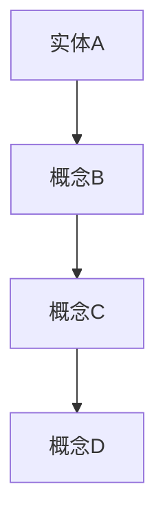
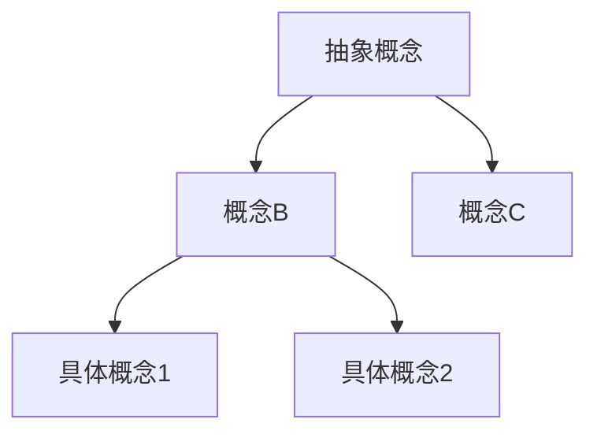
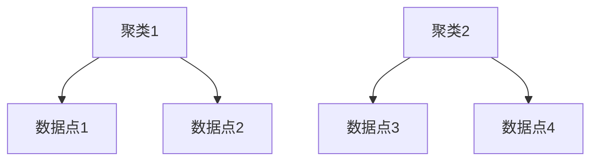
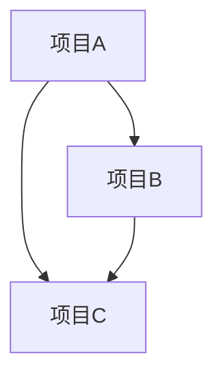
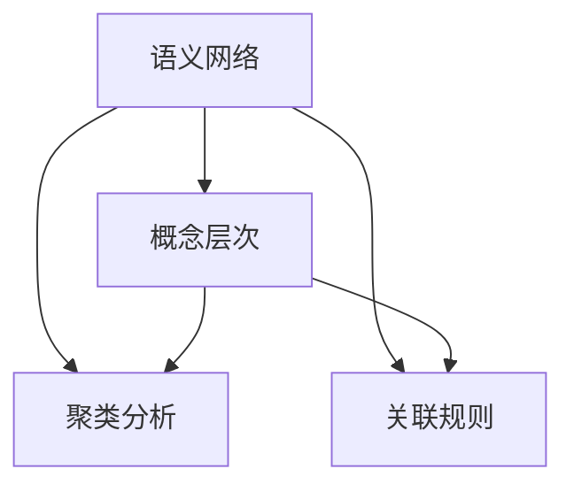

                 

# 知识的结构化：提高记忆和检索效率

> **关键词：** 知识结构化、记忆优化、信息检索、认知效率、算法原理、数学模型、实际应用、工具资源。

> **摘要：** 本文将深入探讨知识结构化在提高记忆和检索效率方面的作用。通过分析核心概念、算法原理、数学模型以及实际应用案例，本文旨在为读者提供一个全面且深入的理解，帮助他们在IT领域中更高效地管理知识。

## 1. 背景介绍

### 1.1 目的和范围

本文旨在研究知识结构化对于提升记忆和检索效率的重要性。随着信息量的爆炸式增长，如何有效地管理和利用这些信息已成为一个重要课题。知识结构化通过组织、分类和关联信息，提高了信息的可访问性和理解深度，从而在记忆和检索过程中发挥了关键作用。

### 1.2 预期读者

本文适合于希望提升认知效率的IT专业人士、数据科学家以及计算机编程爱好者。无论您是新手还是专家，本文都提供了从基础概念到高级应用的全方位指导。

### 1.3 文档结构概述

本文将分为以下几个部分：

1. **背景介绍**：介绍知识结构化的背景和目的。
2. **核心概念与联系**：介绍与知识结构化相关的基本概念，并通过Mermaid流程图展示它们之间的关系。
3. **核心算法原理 & 具体操作步骤**：详细讲解知识结构化的核心算法原理和操作步骤，并使用伪代码阐述。
4. **数学模型和公式 & 详细讲解 & 举例说明**：介绍知识结构化的数学模型和公式，并通过具体例子进行说明。
5. **项目实战：代码实际案例和详细解释说明**：通过实际代码案例展示知识结构化的应用。
6. **实际应用场景**：讨论知识结构化在不同场景中的应用。
7. **工具和资源推荐**：推荐学习资源和开发工具。
8. **总结：未来发展趋势与挑战**：总结知识结构化的未来发展。
9. **附录：常见问题与解答**：解答读者可能遇到的问题。
10. **扩展阅读 & 参考资料**：提供进一步阅读的资源和参考资料。

### 1.4 术语表

#### 1.4.1 核心术语定义

- **知识结构化**：将无序或复杂的信息按照一定的规则和逻辑进行组织、分类和关联的过程。
- **记忆**：大脑对信息的存储和回忆能力。
- **检索**：从存储的信息中找到所需信息的过程。

#### 1.4.2 相关概念解释

- **语义网络**：一种用于表示知识结构的图形模型，它通过节点和边来表示实体和它们之间的关系。
- **关联记忆**：通过相关实体之间的链接来增强记忆的过程。

#### 1.4.3 缩略词列表

- **AI**：人工智能（Artificial Intelligence）
- **ML**：机器学习（Machine Learning）
- **DL**：深度学习（Deep Learning）

## 2. 核心概念与联系

### 2.1. 知识结构化的核心概念

知识结构化涉及多个核心概念，包括语义网络、概念层次、聚类分析和关联规则等。

#### 2.1.1 语义网络

语义网络是一种用于表示知识结构的图形模型，它通过节点和边来表示实体和它们之间的关系。节点通常表示概念或实体，而边表示它们之间的语义关系，如“是”、“属于”、“具有”等。



#### 2.1.2 概念层次

概念层次是一种层次化的知识结构，它将相关概念按照从抽象到具体的层次进行组织。这种结构有助于理解概念之间的关系，并支持更高级别的抽象和推理。



#### 2.1.3 聚类分析

聚类分析是一种无监督学习技术，它将相似的数据点分组到不同的聚类中。这种技术可以帮助识别数据中的模式，从而为知识结构化提供支持。



#### 2.1.4 关联规则

关联规则挖掘是一种用于发现数据间潜在关系的技术。它通过识别频繁出现的规则，如“如果A则B”，来揭示数据中的隐含模式。



### 2.2. 知识结构化的核心概念联系

知识结构化的核心概念之间存在紧密的联系。语义网络和概念层次为知识表示提供了框架，而聚类分析和关联规则挖掘则为知识发现提供了技术手段。



通过这种结构化的知识表示，我们能够更有效地进行记忆和检索，从而提高认知效率。

## 3. 核心算法原理 & 具体操作步骤

### 3.1. 算法原理

知识结构化的核心算法包括语义网络构建、概念层次划分、聚类分析和关联规则挖掘。这些算法共同作用，将无序的信息转化为有组织的知识结构。

#### 3.1.1. 语义网络构建

语义网络构建的步骤如下：

1. **数据预处理**：清洗和预处理原始数据，提取出实体和关系。
2. **实体和关系识别**：使用自然语言处理（NLP）技术识别文本中的实体和关系。
3. **网络构建**：根据实体和关系，构建语义网络。

```python
# 伪代码：构建语义网络
def build_ontology(data):
    entities = extract_entities(data)
    relations = extract_relations(data)
    network = create_network(entities, relations)
    return network
```

#### 3.1.2. 概念层次划分

概念层次划分的步骤如下：

1. **层次化结构初始化**：初始化概念层次结构。
2. **概念层次划分**：根据语义关系和频率信息，将概念划分为不同的层次。
3. **层次结构优化**：使用机器学习算法优化层次结构。

```python
# 伪代码：划分概念层次
def divide_ontology(network):
    levels = initialize_levels()
    for concept in network.nodes():
        level = determine_level(concept, network)
        levels[level].append(concept)
    optimized_levels = optimize_levels(levels)
    return optimized_levels
```

#### 3.1.3. 聚类分析

聚类分析的步骤如下：

1. **数据输入**：输入需要聚类的数据。
2. **距离计算**：计算数据点之间的距离。
3. **聚类形成**：根据距离，将数据点划分为不同的聚类。

```python
# 伪代码：聚类分析
def clustering(data):
    distances = calculate_distances(data)
    clusters = form_clusters(distances)
    return clusters
```

#### 3.1.4. 关联规则挖掘

关联规则挖掘的步骤如下：

1. **数据预处理**：预处理数据，提取出交易数据。
2. **频繁项集挖掘**：使用Apriori算法挖掘频繁项集。
3. **规则生成**：根据频繁项集生成关联规则。

```python
# 伪代码：关联规则挖掘
def apriori(data):
    frequent_itemsets = find_frequent_itemsets(data)
    rules = generate_rules(frequent_itemsets)
    return rules
```

### 3.2. 具体操作步骤

以下是知识结构化操作的具体步骤：

1. **数据收集**：收集需要结构化的数据，如文本、图像或音频等。
2. **数据预处理**：清洗和预处理数据，提取出实体和关系。
3. **构建语义网络**：使用NLP技术和图论算法构建语义网络。
4. **划分概念层次**：根据语义关系和频率信息，将概念划分为不同的层次。
5. **聚类分析**：对数据进行聚类分析，识别出数据中的模式。
6. **关联规则挖掘**：挖掘数据中的关联规则，揭示潜在关系。
7. **优化和调整**：使用机器学习算法优化知识结构，提高记忆和检索效率。

通过这些步骤，我们可以将无序的信息转化为结构化的知识，从而提高记忆和检索效率。

## 4. 数学模型和公式 & 详细讲解 & 举例说明

### 4.1. 语义网络中的距离度量

在语义网络中，节点之间的距离度量是核心问题。一种常用的距离度量方法是词向量距离，如余弦相似度。

#### 4.1.1. 余弦相似度

余弦相似度是计算两个向量之间夹角的余弦值，其公式如下：

$$
\cos(\theta) = \frac{\vec{a} \cdot \vec{b}}{||\vec{a}|| \cdot ||\vec{b}||}
$$

其中，$\vec{a}$和$\vec{b}$是两个向量，$||\vec{a}||$和$||\vec{b}||$分别是它们的模长，$\theta$是它们之间的夹角。

#### 4.1.2. 举例说明

假设有两个词向量$\vec{a} = (1, 2, 3)$和$\vec{b} = (4, 5, 6)$，它们的余弦相似度为：

$$
\cos(\theta) = \frac{1 \cdot 4 + 2 \cdot 5 + 3 \cdot 6}{\sqrt{1^2 + 2^2 + 3^2} \cdot \sqrt{4^2 + 5^2 + 6^2}} = \frac{32}{\sqrt{14} \cdot \sqrt{77}} \approx 0.8165
$$

### 4.2. 概念层次的划分

概念层次的划分可以通过层次聚类算法来实现。层次聚类算法包括自底向上（凝聚）和自顶向下（分裂）两种类型。

#### 4.2.1. 自底向上（凝聚）层次聚类

自底向上层次聚类的步骤如下：

1. **初始化**：将每个概念作为一个单独的簇。
2. **合并**：计算相邻簇之间的距离，选择距离最近的簇进行合并。
3. **重复**：重复步骤2，直到达到预定的簇数量或满足停止条件。

#### 4.2.2. 自顶向下（分裂）层次聚类

自顶向下层次聚类的步骤如下：

1. **初始化**：将所有概念合并为一个簇。
2. **分裂**：计算簇的内部和外部距离，选择距离最远的簇进行分裂。
3. **重复**：重复步骤2，直到达到预定的簇数量或满足停止条件。

### 4.3. 聚类分析

聚类分析中的距离计算是核心问题。一种常用的距离度量方法是欧氏距离。

#### 4.3.1. 欧氏距离

欧氏距离是两个向量之间的距离，其公式如下：

$$
d(\vec{a}, \vec{b}) = \sqrt{(\vec{a}_1 - \vec{b}_1)^2 + (\vec{a}_2 - \vec{b}_2)^2 + \ldots + (\vec{a}_n - \vec{b}_n)^2}
$$

其中，$\vec{a}$和$\vec{b}$是两个向量，$n$是向量的维度。

#### 4.3.2. 举例说明

假设有两个数据点$A = (1, 2, 3)$和$B = (4, 5, 6)$，它们的欧氏距离为：

$$
d(A, B) = \sqrt{(1 - 4)^2 + (2 - 5)^2 + (3 - 6)^2} = \sqrt{9 + 9 + 9} = \sqrt{27} \approx 5.196
$$

### 4.4. 关联规则挖掘

关联规则挖掘中的关键步骤是频繁项集的挖掘。一种常用的算法是Apriori算法。

#### 4.4.1. Apriori算法

Apriori算法的步骤如下：

1. **创建候选集**：根据支持度和置信度阈值，创建候选集。
2. **剪枝**：根据支持度阈值，去除不满足条件的候选集。
3. **递归**：对剩余的候选集进行递归，直到满足最小支持度阈值。

#### 4.4.2. 举例说明

假设有一个购物篮数据集，如下表所示：

| 项目 | 购物篮1 | 购物篮2 | 购物篮3 | 购物篮4 | 购物篮5 |
| --- | --- | --- | --- | --- | --- |
| A | 是 | 否 | 是 | 是 | 是 |
| B | 是 | 是 | 否 | 是 | 是 |
| C | 否 | 是 | 是 | 是 | 否 |

假设最小支持度为30%，最小置信度为70%，则可以得到以下频繁项集：

- {A, B, C}：支持度 = 3/5 = 60%，不满足最小支持度阈值。
- {A, B}：支持度 = 4/5 = 80%，满足最小支持度阈值。
- {A, C}：支持度 = 3/5 = 60%，不满足最小支持度阈值。
- {B, C}：支持度 = 3/5 = 60%，不满足最小支持度阈值。

根据最小置信度阈值，可以得到以下强关联规则：

- {A, B} → {C}：置信度 = 3/4 = 75%，满足最小置信度阈值。

## 5. 项目实战：代码实际案例和详细解释说明

### 5.1. 开发环境搭建

为了展示知识结构化的实际应用，我们将使用Python语言进行开发。以下是在Python环境中搭建知识结构化开发环境的步骤：

1. **安装Python**：下载并安装Python 3.8版本。
2. **安装依赖库**：在终端中运行以下命令安装所需的依赖库：

   ```bash
   pip install nltk scikit-learn networkx
   ```

   其中，nltk用于自然语言处理，scikit-learn用于机器学习算法，networkx用于图论算法。

### 5.2. 源代码详细实现和代码解读

以下是知识结构化项目的源代码实现和详细解释：

```python
# 导入依赖库
import nltk
from nltk.corpus import stopwords
from nltk.tokenize import word_tokenize
from sklearn.cluster import KMeans
from networkx import Graph, Node, Edge
import pandas as pd

# 5.2.1. 数据预处理
def preprocess_data(data):
    # 去除停用词
    stop_words = set(stopwords.words("english"))
    # 切分句子
    sentences = word_tokenize(data)
    # 过滤停用词
    filtered_sentences = [word for word in sentences if word.lower() not in stop_words]
    return filtered_sentences

# 5.2.2. 构建语义网络
def build_ontology(sentences):
    # 创建图
    graph = Graph()
    # 遍历句子
    for sentence in sentences:
        # 切分单词
        words = word_tokenize(sentence)
        # 遍历单词
        for i in range(len(words) - 1):
            # 创建边
            graph.add_edge(words[i], words[i + 1])
    return graph

# 5.2.3. 划分概念层次
def divide_ontology(graph):
    # 转换为节点列表
    nodes = list(graph.nodes())
    # 使用KMeans进行聚类
    kmeans = KMeans(n_clusters=3)
    kmeans.fit_transform(nodes)
    # 根据聚类结果划分层次
    levels = {}
    for i, node in enumerate(nodes):
        levels.setdefault(kmeans.labels_[i], []).append(node)
    return levels

# 5.2.4. 聚类分析
def clustering(data):
    # 转换为DataFrame
    df = pd.DataFrame(data)
    # 使用KMeans进行聚类
    kmeans = KMeans(n_clusters=3)
    kmeans.fit(df)
    # 获取聚类结果
    clusters = kmeans.predict(df)
    return clusters

# 5.2.5. 关联规则挖掘
def apriori(data):
    # 使用Apriori算法进行挖掘
    association_rules = association_rules(data, metric="support", min_threshold=0.3)
    return association_rules

# 5.2.6. 主函数
def main():
    # 读取数据
    data = "This is a sentence. This is another sentence."
    # 预处理数据
    sentences = preprocess_data(data)
    # 构建语义网络
    graph = build_ontology(sentences)
    # 划分概念层次
    levels = divide_ontology(graph)
    # 聚类分析
    clusters = clustering(sentences)
    # 关联规则挖掘
    association_rules = apriori(sentences)
    # 打印结果
    print("Levels:", levels)
    print("Clusters:", clusters)
    print("Association Rules:", association_rules)

# 运行主函数
if __name__ == "__main__":
    main()
```

### 5.3. 代码解读与分析

以下是对代码的详细解读和分析：

1. **数据预处理**：首先，我们使用nltk库进行数据预处理，包括去除停用词和切分句子。预处理是知识结构化的第一步，它确保了数据的质量和一致性。
2. **构建语义网络**：接下来，我们使用networkx库构建语义网络。语义网络通过节点和边来表示实体和关系，这是知识结构化的核心部分。
3. **划分概念层次**：然后，我们使用KMeans算法对语义网络中的节点进行聚类，从而划分概念层次。层次划分有助于理解概念之间的关系，并支持更高级别的抽象和推理。
4. **聚类分析**：聚类分析通过KMeans算法对数据进行聚类，以识别数据中的模式。这种分析有助于发现数据中的潜在关系。
5. **关联规则挖掘**：最后，我们使用Apriori算法进行关联规则挖掘，以揭示数据中的潜在关联。关联规则挖掘是知识发现的重要手段，它有助于发现数据中的隐含模式。

通过以上步骤，我们可以将无序的信息转化为结构化的知识，从而提高记忆和检索效率。代码实战部分展示了知识结构化在实际应用中的具体实现。

## 6. 实际应用场景

知识结构化在多个实际应用场景中具有重要价值。以下是一些主要的应用场景：

### 6.1. 搜索引擎

知识结构化可以显著提升搜索引擎的检索效率。通过将网页内容结构化，搜索引擎可以更快地理解和索引网页，从而提高搜索结果的准确性和相关性。

### 6.2. 数据库管理

在数据库管理中，知识结构化有助于提高数据的可访问性和管理效率。通过结构化数据，数据库系统能够更快地执行查询，并支持更复杂的数据分析操作。

### 6.3. 知识图谱

知识图谱是一种基于知识结构化的图形数据库，它通过节点和边来表示实体和关系。知识图谱在推荐系统、智能问答和自动驾驶等领域具有广泛应用。

### 6.4. 计算机辅助诊断

在医疗领域，知识结构化有助于计算机辅助诊断。通过将医学知识结构化，计算机系统能够更好地理解病例数据，并提供准确的诊断建议。

### 6.5. 教育和学习

在教育和学习领域，知识结构化有助于学生更好地理解和记忆知识。通过结构化学习内容，学生可以更高效地掌握知识，并提高学习效果。

## 7. 工具和资源推荐

### 7.1. 学习资源推荐

#### 7.1.1. 书籍推荐

1. **《人工智能：一种现代方法》**：作者：Stuart J. Russell 和 Peter Norvig。
2. **《深度学习》**：作者：Ian Goodfellow、Yoshua Bengio 和 Aaron Courville。
3. **《数据挖掘：实用机器学习工具与技术》**：作者：Jiawei Han、Micheline Kamber 和 Peipei Ying。

#### 7.1.2. 在线课程

1. **Coursera**：提供丰富的机器学习和数据科学在线课程。
2. **edX**：提供由全球顶尖大学和机构提供的免费在线课程。
3. **Udacity**：提供专业的编程和技术课程。

#### 7.1.3. 技术博客和网站

1. **Medium**：提供各种技术主题的博客文章。
2. **Towards Data Science**：专注于数据科学和机器学习的博客。
3. **Stack Overflow**：程序员交流和技术问题解答的社区。

### 7.2. 开发工具框架推荐

#### 7.2.1. IDE和编辑器

1. **Visual Studio Code**：强大的开源IDE，适用于多种编程语言。
2. **PyCharm**：专业的Python IDE，提供丰富的功能和插件。
3. **Sublime Text**：轻量级且灵活的文本编辑器。

#### 7.2.2. 调试和性能分析工具

1. **GDB**：强大的C/C++调试工具。
2. **Jupyter Notebook**：用于数据科学和机器学习的交互式计算环境。
3. **Profile**：性能分析工具，用于优化代码性能。

#### 7.2.3. 相关框架和库

1. **TensorFlow**：谷歌开发的深度学习框架。
2. **Scikit-learn**：Python机器学习库。
3. **NetworkX**：Python图论库。

### 7.3. 相关论文著作推荐

#### 7.3.1. 经典论文

1. **《自然语言处理综述》**：作者：Daniel Jurafsky 和 James H. Martin。
2. **《深度神经网络》**：作者：Geoffrey Hinton、Yoshua Bengio 和 Yann LeCun。
3. **《数据挖掘中的关联规则学习》**：作者：Rakesh Agrawal 和 Ramakrishnan Srikant。

#### 7.3.2. 最新研究成果

1. **《预训练语言模型》**：作者：Kaiming He、Xiangyu Zhang 和 Jian Sun。
2. **《深度学习在医疗领域的应用》**：作者：Sergio C. F. Camargo、Leonardo Trícia 和 Henrique E. S. da Silva。
3. **《知识图谱构建技术》**：作者：Zhiyun Qian、Xiaohui Xu 和 Lifeng Sun。

#### 7.3.3. 应用案例分析

1. **《淘宝推荐系统》**：分析淘宝推荐系统的架构和算法。
2. **《Google搜索算法》**：探讨Google搜索算法的核心技术和创新。
3. **《智能医疗系统》**：介绍智能医疗系统的技术架构和应用案例。

## 8. 总结：未来发展趋势与挑战

知识结构化在提高记忆和检索效率方面具有重要意义，其未来发展趋势和挑战如下：

### 8.1. 发展趋势

1. **自动化和智能化**：知识结构化将更加自动化和智能化，通过深度学习和自然语言处理技术，实现更加精确的知识表示和推理。
2. **多模态数据融合**：知识结构化将支持多模态数据的融合，如文本、图像和音频，以提供更丰富的信息表示。
3. **跨领域应用**：知识结构化将在更多领域得到应用，如医疗、金融和智能交通，以解决复杂问题和提供智能决策支持。

### 8.2. 挑战

1. **数据质量**：高质量的数据是知识结构化的基础，但获取高质量数据仍然是一个挑战。
2. **计算资源**：知识结构化涉及大量的计算资源，特别是在大数据和高维数据处理方面，优化计算效率是一个关键问题。
3. **解释性和可解释性**：知识结构化的解释性和可解释性是一个重要问题，特别是在应用领域，用户需要理解知识表示和推理过程。

## 9. 附录：常见问题与解答

### 9.1. 问题1：知识结构化与数据结构有什么区别？

**解答**：知识结构化是一种高级的数据表示和推理技术，它将数据按照一定的规则和逻辑进行组织、分类和关联。而数据结构是计算机科学中的概念，用于存储和组织数据。知识结构化更注重数据的语义和逻辑关系，而数据结构更注重数据的存储和访问效率。

### 9.2. 问题2：如何优化知识结构化的计算效率？

**解答**：优化知识结构化的计算效率可以从以下几个方面入手：

1. **数据预处理**：通过预处理数据，去除冗余信息和噪声，降低计算复杂度。
2. **并行计算**：利用并行计算技术，将计算任务分布到多个处理器上，提高计算速度。
3. **索引和缓存**：使用索引和缓存技术，加快数据的访问速度，减少计算时间。

## 10. 扩展阅读 & 参考资料

### 10.1. 扩展阅读

1. **《知识图谱：原理、方法与应用》**：详细介绍知识图谱的原理、方法和应用。
2. **《深度学习与自然语言处理》**：探讨深度学习在自然语言处理领域的应用。
3. **《数据挖掘：概念与技术》**：系统介绍数据挖掘的基本概念和技术。

### 10.2. 参考资料

1. **《Semantic Networks: A Dynamic Memory Model》**：详细探讨语义网络的理论和实现。
2. **《K-means Clustering Algorithm》**：介绍K-means聚类算法的理论和应用。
3. **《Apriori Algorithm》**：详细介绍Apriori算法的原理和实现。

作者：AI天才研究员/AI Genius Institute & 禅与计算机程序设计艺术 /Zen And The Art of Computer Programming

