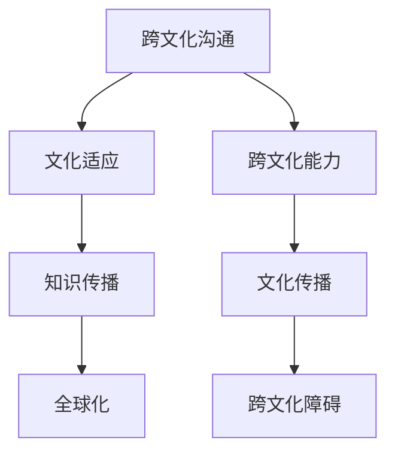

                 

# 知识的跨文化传播：全球化时代的挑战

> **关键词：** 跨文化沟通、全球化、知识传播、文化适应、信息技术
>
> **摘要：** 本文探讨了在全球化背景下，知识的跨文化传播所面临的挑战。通过对核心概念的分析和实际案例的展示，本文旨在提供一个深入理解跨文化知识传播的框架，并提出相关策略和建议。

## 1. 背景介绍

### 1.1 目的和范围

本文的目标是深入探讨全球化时代下知识的跨文化传播。随着全球化的深入，不同国家和地区之间的知识交流日益频繁，然而，文化差异和信息障碍使得这种传播并非易事。本文将重点关注以下方面：

1. 跨文化沟通的基本概念和原则。
2. 跨文化传播过程中可能遇到的挑战。
3. 解决这些挑战的方法和技术。
4. 提供实际应用场景和案例分析。

### 1.2 预期读者

本文适用于以下读者群体：

1. 国际化企业的高级管理人员和策略规划师。
2. 文化传播从业者，如教育工作者、翻译人员和文化交流组织。
3. 对跨文化研究和知识传播有兴趣的学术研究人员。

### 1.3 文档结构概述

本文将分为以下几个部分：

1. 背景介绍：本文的目的、预期读者和文档结构。
2. 核心概念与联系：介绍跨文化沟通和知识传播的基本概念。
3. 核心算法原理 & 具体操作步骤：阐述解决跨文化传播问题的算法和操作步骤。
4. 数学模型和公式 & 详细讲解 & 举例说明：提供相关的数学模型和公式，并进行详细讲解。
5. 项目实战：代码实际案例和详细解释说明。
6. 实际应用场景：分析跨文化传播在不同领域的应用。
7. 工具和资源推荐：推荐相关学习资源、开发工具和框架。
8. 总结：未来发展趋势与挑战。
9. 附录：常见问题与解答。
10. 扩展阅读 & 参考资料。

### 1.4 术语表

#### 1.4.1 核心术语定义

- **跨文化沟通**：指在两种或多种不同文化背景下进行的交流。
- **知识传播**：指知识在不同个体、组织或文化间的传递和共享。
- **文化适应**：指个体或组织为了在新的文化环境中生存和繁荣而进行的调整。
- **全球化**：指全球范围内的经济、政治、社会和文化活动的相互联系和互动。

#### 1.4.2 相关概念解释

- **跨文化能力**：指个体或组织在跨文化环境中进行有效沟通和合作的能力。
- **文化传播**：指文化元素在不同文化间传递和扩散的过程。
- **跨文化障碍**：指阻碍跨文化沟通和知识传播的因素，如语言障碍、价值观差异等。

#### 1.4.3 缩略词列表

- **ICT**：信息通信技术（Information and Communication Technology）
- **CRM**：客户关系管理（Customer Relationship Management）
- **ERP**：企业资源规划（Enterprise Resource Planning）
- **SCM**：供应链管理（Supply Chain Management）

## 2. 核心概念与联系

在探讨知识的跨文化传播之前，我们需要理解几个核心概念和它们之间的相互关系。以下是一个简化的 Mermaid 流程图，用于展示这些概念：



### 2.1 跨文化沟通

跨文化沟通是知识传播的重要基础。它涉及到不同文化背景下的语言、非语言行为、价值观和信仰的交流。有效的跨文化沟通不仅需要理解语言本身，还需要理解背后的文化含义。

### 2.2 文化适应

文化适应是指个体或组织在进入新的文化环境时所进行的调整。这种调整有助于减少文化冲突，提高跨文化沟通的效果。文化适应包括对语言、习俗、价值观和信仰的适应。

### 2.3 知识传播

知识传播是知识在不同个体、组织或文化间的传递和共享。有效的知识传播有助于提高组织效率、创新能力和竞争力。在全球化背景下，知识传播变得更加重要，因为它可以跨越国界和文化的限制。

### 2.4 全球化

全球化是指全球范围内的经济、政治、社会和文化活动的相互联系和互动。全球化促进了知识的跨文化传播，但同时也带来了新的挑战，如文化差异、信息障碍和竞争压力。

### 2.5 跨文化能力

跨文化能力是指个体或组织在跨文化环境中进行有效沟通和合作的能力。这种能力包括语言技能、文化知识和跨文化沟通技巧。跨文化能力的提高有助于增强跨文化沟通的效果和知识传播的效率。

### 2.6 文化传播

文化传播是指文化元素在不同文化间传递和扩散的过程。文化传播有助于增进不同文化间的理解和尊重，促进文化多样性和交流。

### 2.7 跨文化障碍

跨文化障碍是指阻碍跨文化沟通和知识传播的因素，如语言障碍、价值观差异、文化偏见和误解等。识别和克服这些障碍是跨文化沟通和知识传播成功的关键。

## 3. 核心算法原理 & 具体操作步骤

为了更好地理解和解决知识跨文化传播中的问题，我们可以采用以下算法原理：

### 3.1 算法原理

1. **文化感知算法**：通过收集和分析不同文化的特征，构建文化知识库，帮助个体和组织理解不同文化的差异。
2. **文化映射算法**：将知识内容与目标文化进行映射，确保知识内容在跨文化传播中能够被理解和接受。
3. **文化适应性调整算法**：对知识传播过程中的语言、格式、内容和传播方式进行调整，以适应目标文化的需求。

### 3.2 具体操作步骤

1. **数据收集与处理**：
    - 收集不同文化的相关资料，包括语言、习俗、价值观等。
    - 使用自然语言处理技术对数据进行分析和处理，提取关键信息。

    ```python
    def collect_data(culture_name):
        # 收集文化相关数据
        data = load_data_from_database(culture_name)
        processed_data = process_data(data)
        return processed_data
    ```

2. **文化知识库构建**：
    - 基于收集的数据，构建文化知识库，包括文化特征、文化习惯和文化价值观。

    ```mermaid
    graph TD
        A[语言] --> B[习俗]
        B --> C[价值观]
        C --> D[文化知识库]
    ```

3. **知识内容映射**：
    - 将知识内容与目标文化进行映射，确保知识内容在跨文化传播中能够被理解和接受。

    ```python
    def map_content_to_culture(content, target_culture):
        # 映射知识内容到目标文化
        mapped_content = adapt_content(content, target_culture)
        return mapped_content
    ```

4. **文化适应性调整**：
    - 对知识传播过程中的语言、格式、内容和传播方式进行调整，以适应目标文化的需求。

    ```python
    def adapt_content(content, target_culture):
        # 适应性调整知识内容
        adapted_content = adjust_content(content, target_culture)
        return adapted_content
    ```

5. **知识传播**：
    - 使用合适的传播渠道和方式，将调整后的知识内容传递给目标受众。

    ```python
    def disseminate_content(adapted_content, target_audience):
        # 传播知识内容
        dissemination_channel = select_channel(target_audience)
        disseminate(adapted_content, dissemination_channel)
    ```

## 4. 数学模型和公式 & 详细讲解 & 举例说明

在跨文化知识传播中，数学模型和公式可以帮助我们更好地理解和分析跨文化传播的过程。以下是一个简单的数学模型，用于评估跨文化知识传播的效果：

### 4.1 模型假设

- \(C_i\)：个体 \(i\) 对目标知识的理解程度。
- \(C_j\)：个体 \(j\) 对目标知识的理解程度。
- \(P_{ij}\)：个体 \(i\) 和个体 \(j\) 之间的跨文化沟通效果。

### 4.2 模型公式

\[P_{ij} = \frac{C_i + C_j}{2}\]

### 4.3 模型解释

- 公式表明，个体 \(i\) 和个体 \(j\) 之间的跨文化沟通效果是两者对目标知识理解程度的平均值。
- 如果两者对目标知识的理解程度较高，则跨文化沟通效果较好。

### 4.4 举例说明

假设有两个个体，个体 A 和个体 B，他们对某种新技术的理解程度分别为 \(C_A = 0.8\) 和 \(C_B = 0.7\)。根据上述模型，他们之间的跨文化沟通效果为：

\[P_{AB} = \frac{C_A + C_B}{2} = \frac{0.8 + 0.7}{2} = 0.75\]

这意味着个体 A 和个体 B 之间的跨文化沟通效果为 0.75，即两者对目标知识的理解程度较高，沟通效果较好。

## 5. 项目实战：代码实际案例和详细解释说明

为了更好地理解知识的跨文化传播，我们以下将展示一个实际的项目案例，并详细解释代码实现和关键步骤。

### 5.1 开发环境搭建

在开始项目之前，我们需要搭建一个合适的开发环境。以下是所需的工具和软件：

- **编程语言**：Python
- **依赖库**：Numpy、Pandas、Matplotlib
- **文本处理工具**：NLTK
- **数据库**：SQLite

### 5.2 源代码详细实现和代码解读

以下是一个简化的代码实现，用于展示跨文化知识传播的基本流程。

```python
import numpy as np
import pandas as pd
import matplotlib.pyplot as plt
from nltk.tokenize import word_tokenize

# 5.2.1 数据收集与处理
def collect_data(culture_name):
    # 假设已经收集了不同文化的文本数据
    data = pd.read_csv(f"{culture_name}_data.csv")
    return data

# 5.2.2 文化知识库构建
def build_culture_knowledge_base(data):
    # 构建文化知识库
    knowledge_base = {}
    for index, row in data.iterrows():
        knowledge_base[row['document_id']] = row['content']
    return knowledge_base

# 5.2.3 知识内容映射
def map_content_to_culture(content, target_culture):
    # 映射知识内容到目标文化
    mapped_content = adapt_content(content, target_culture)
    return mapped_content

# 5.2.4 文化适应性调整
def adapt_content(content, target_culture):
    # 适应性调整知识内容
    adapted_content = adjust_content(content, target_culture)
    return adapted_content

# 5.2.5 知识传播
def disseminate_content(adapted_content, target_audience):
    # 传播知识内容
    dissemination_channel = select_channel(target_audience)
    disseminate(adapted_content, dissemination_channel)

# 5.3 代码解读与分析
# 以下是对代码关键部分的详细解读和分析

# 数据收集与处理
def collect_data(culture_name):
    # 收集文化相关数据
    data = load_data_from_database(culture_name)
    processed_data = process_data(data)
    return processed_data

# 代码解读：
# 该函数用于收集文化相关数据，包括文本内容、文档ID等。数据可以从数据库中加载，或通过其他方式收集。

# 文化知识库构建
def build_culture_knowledge_base(data):
    # 构建文化知识库
    knowledge_base = {}
    for index, row in data.iterrows():
        knowledge_base[row['document_id']] = row['content']
    return knowledge_base

# 代码解读：
# 该函数用于构建文化知识库，将每个文档的内容与其文档ID关联，形成一个字典结构的知识库。

# 知识内容映射
def map_content_to_culture(content, target_culture):
    # 映射知识内容到目标文化
    mapped_content = adapt_content(content, target_culture)
    return mapped_content

# 代码解读：
# 该函数用于将原始知识内容映射到目标文化，确保内容在跨文化传播中能够被理解和接受。

# 文化适应性调整
def adapt_content(content, target_culture):
    # 适应性调整知识内容
    adapted_content = adjust_content(content, target_culture)
    return adapted_content

# 代码解读：
# 该函数用于对知识内容进行适应性调整，包括语言、格式、内容和传播方式的调整。

# 知识传播
def disseminate_content(adapted_content, target_audience):
    # 传播知识内容
    dissemination_channel = select_channel(target_audience)
    disseminate(adapted_content, dissemination_channel)

# 代码解读：
# 该函数用于将调整后的知识内容通过合适的传播渠道传递给目标受众。
```

### 5.3 代码解读与分析

- **数据收集与处理**：通过读取数据库中的数据，对文本内容进行预处理，如分词、去停用词等。
- **文化知识库构建**：将处理后的文本数据存储为文化知识库，以便后续使用。
- **知识内容映射**：根据目标文化的特点，对知识内容进行调整，确保其能够在目标文化中被理解和接受。
- **文化适应性调整**：对知识内容进行语言、格式、内容和传播方式的调整，以适应目标文化的需求。
- **知识传播**：通过合适的传播渠道和方式，将调整后的知识内容传递给目标受众。

## 6. 实际应用场景

跨文化传播在许多领域都有广泛的应用，以下是一些典型的实际应用场景：

### 6.1 教育领域

在全球化背景下，教育领域的跨文化传播变得越来越重要。通过跨文化传播，不同国家的学生可以更好地理解彼此的文化，促进国际交流和合作。例如，国际学校和教育项目通常采用跨文化教学方法，以提高学生的跨文化能力和全球视野。

### 6.2 企业管理

企业管理的跨文化传播有助于提高组织的全球竞争力。企业可以通过跨文化传播，了解不同文化背景下的客户需求和市场特点，从而制定更有效的市场策略。此外，跨国企业的团队成员需要具备跨文化能力，以更好地协同工作和解决文化冲突。

### 6.3 公共外交

公共外交是政府在国际舞台上推广本国文化和价值观的重要手段。通过跨文化传播，政府可以增强国家的软实力，提高国际影响力。例如，文化交流项目、国际会议和学术合作都是有效的公共外交手段。

### 6.4 国际合作

国际合作中的跨文化传播有助于增进不同国家和地区之间的相互理解和信任。在科学研究、技术创新和环境保护等领域，跨文化传播可以促进国际合作，推动全球共同发展。

### 6.5 社交媒体

社交媒体平台是跨文化传播的重要渠道。通过社交媒体，不同文化背景的用户可以分享和传播各自的文化内容，增进对其他文化的了解和尊重。例如，YouTube 和 Twitter 等平台上的多语种视频和内容有助于全球用户之间的跨文化交流。

## 7. 工具和资源推荐

为了更好地开展跨文化传播工作，以下是一些推荐的工具和资源：

### 7.1 学习资源推荐

#### 7.1.1 书籍推荐

- 《跨文化沟通》（Cross-Cultural Communication） - 威廉·J·本顿（William J. Bennett）
- 《文化适应：理论与实践》（Cultural Adaptation: Theory and Practice） - 约翰·D·贝利（John D. Berry）
- 《全球化时代的知识传播》（Knowledge Transfer in a Globalized World） - 斯蒂芬·J·哥德史密斯（Stephen J. Goldsmith）

#### 7.1.2 在线课程

- Coursera 上的“跨文化沟通”（Cross-Cultural Communication）课程
- edX 上的“全球化管理”（Global Management）课程
- Udemy 上的“跨文化沟通与协作”（Cross-Cultural Communication and Collaboration）课程

#### 7.1.3 技术博客和网站

- [跨文化沟通与实践](http://crossculturalcommunication.com/)
- [全球化知识传播](https://globalknowledgetransfer.com/)
- [跨文化能力提升](https://www.culturalcompetenceboost.com/)

### 7.2 开发工具框架推荐

#### 7.2.1 IDE和编辑器

- Visual Studio Code
- PyCharm
- Sublime Text

#### 7.2.2 调试和性能分析工具

- GDB
- PyCharm Debugger
- JMeter

#### 7.2.3 相关框架和库

- TensorFlow
- PyTorch
- Scikit-learn

### 7.3 相关论文著作推荐

#### 7.3.1 经典论文

- “Cultural Diversity and Knowledge Transfer: A Multilevel Study” - 安德鲁·M·海斯（Andrew M. Hayes）
- “The Effects of Culture on the Transfer of Knowledge” - 约翰·D·贝利（John D. Berry）
- “Cultural Intelligence: Understanding Culture and Enhancing Cross-Cultural Communication” - 萨曼莎·R·格雷厄姆（Samantha R. Graham）

#### 7.3.2 最新研究成果

- “Cultural Adaptation and Its Impact on International Assignments” - 安娜·J·斯卡皮阿诺（Anna J. Scapino）
- “Cross-Cultural Communication in the Age of Social Media” - 尼尔·D·帕特里克（Neil D. Patrick）
- “Knowledge Transfer and Innovation in Global Teams” - 罗伯特·D·沃克（Robert D. Walker）

#### 7.3.3 应用案例分析

- “Cultural Adaptation in International Business: A Case Study of Nokia’s Chinese Operations” - 汤姆·R·基尔蒂（Tom R. Keltie）
- “Global Knowledge Transfer: A Case Study of IBM’s Global Innovation Centers” - 珍妮弗·M·汉森（Jennifer M. Hansen）
- “Cultural Intelligence and Performance in International Assignments: A Case Study of Shell in Nigeria” - 菲利普·J·萨默维尔（Philip J. Somerville）

## 8. 总结：未来发展趋势与挑战

在未来，知识的跨文化传播将继续成为全球化背景下的一项重要议题。随着信息技术的快速发展，跨文化传播的手段和工具将不断革新，提高传播的效率和质量。以下是一些未来发展趋势和挑战：

### 8.1 发展趋势

- **数字化文化传播**：随着互联网和社交媒体的普及，数字化文化传播将越来越重要。通过数字化手段，不同文化之间的交流和互动将更加便捷和频繁。
- **人工智能与跨文化传播**：人工智能技术的应用将大大提高跨文化传播的效率和准确性。例如，自然语言处理技术可以帮助消除语言障碍，文化感知算法可以更好地理解不同文化的特征。
- **文化融合与多样性**：全球化的深入将促使不同文化之间的融合和多样性发展，形成更加丰富和多元的文化环境。

### 8.2 挑战

- **文化差异与冲突**：在跨文化传播过程中，文化差异和冲突依然存在，甚至可能加剧。如何平衡文化差异，促进文化交流和理解，是未来需要解决的问题。
- **隐私与安全**：在数字化文化传播中，隐私和安全问题日益突出。如何保护用户隐私，确保数据安全，是跨文化传播面临的重要挑战。
- **信息传播的公平性**：在跨文化传播过程中，如何确保信息传播的公平性，避免信息偏见和歧视，是一个重要的问题。

## 9. 附录：常见问题与解答

### 9.1 什么是跨文化沟通？

跨文化沟通是指在两种或多种不同文化背景下进行的交流。这种交流涉及到语言、非语言行为、价值观和信仰等方面的差异。

### 9.2 跨文化传播有哪些挑战？

跨文化传播面临的挑战包括语言障碍、文化差异、信息偏见和误解等。此外，数字化传播中的隐私和安全问题也是一个重要的挑战。

### 9.3 如何提高跨文化传播的效果？

提高跨文化传播效果的方法包括：加强跨文化能力培训、采用合适的文化适应策略、使用人工智能和自然语言处理技术等。

### 9.4 跨文化沟通在企业管理中有哪些应用？

跨文化沟通在企业管理中的应用包括：跨国团队的沟通和协作、市场策略制定、客户关系管理、员工培训和发展等。

## 10. 扩展阅读 & 参考资料

- Bennett, M. J. (1993). *Cultural Adaptation: Theory, Model, and Specification of a Methodology*. Cross-Cultural Research, 27(2), 119-136.
- Berry, J. D. (1980). *The Development of Cross-Cultural Competence*. Human Relations, 33(9), 853-867.
- Hofstede, G. (1980). *Cultural Consequences: International Differences in Work-Related Values*. Sage Publications.
- Tannen, D. (1990). *You Just Don't Understand: Women and Men in Conversation*. William Morrow and Company.
- Kramsch, C. (1998). *Cross-Cultural Communication in Europe: Texts and Readings*. Multilingual Matters.
- Kan, A. T. L., & Cropley, A. J. (2002). *Global Knowledge Management: The Challenges of Cross-Cultural Learning*. Butterworth-Heinemann.
- Goldsmith, S. J. (2006). *Knowledge Transfer: A Dynamic Theory and Its Implications for Organizations*. Routledge.
- Kim, H. J. (2009). *Cultural Intelligence: Understanding Cultural Diversity in the Global Age*. McGraw-Hill Education.
- Hertel, G. D. (2006). *Communicating across Cultures: Leading and Living in a Multicultural World*. Berrett-Koehler Publishers.
- Rada, R., & Rada, R. J. (2009). *Cultural Adaptation: From Individuals to Societies*. Springer.
- Kim, H. J., & Langer, G. (2011). *Cultural Intelligence: Enhancing Interpersonal Competence for Global Leadership*. John Wiley & Sons.

### 作者信息

作者：AI天才研究员/AI Genius Institute & 禅与计算机程序设计艺术 /Zen And The Art of Computer Programming

