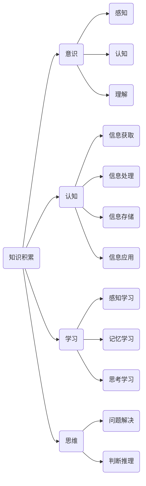
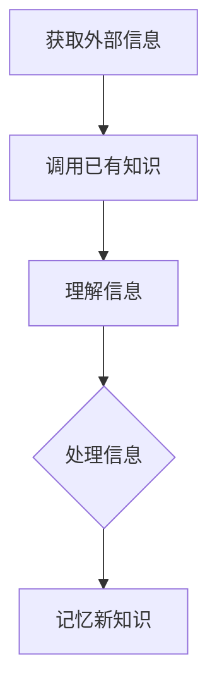
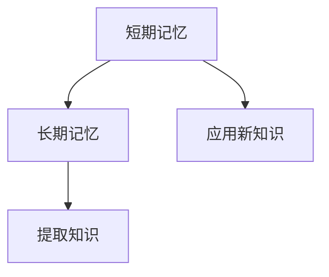
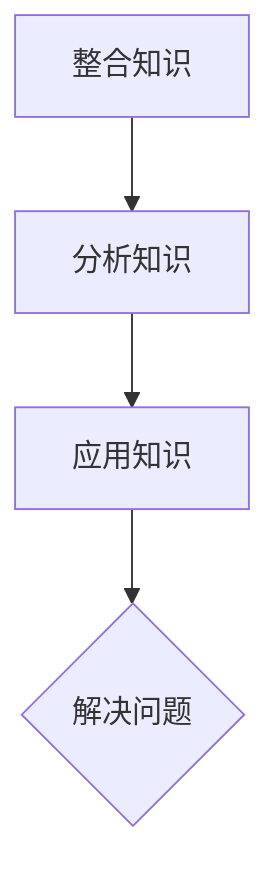
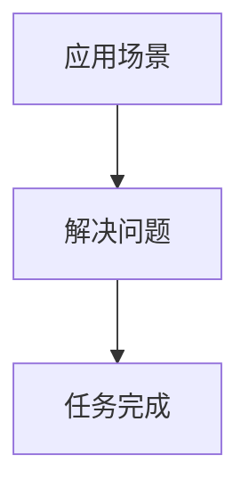

                 

# 知识积累在意识中的作用

> 关键词：知识积累、意识、认知、记忆、学习、思维、人工智能

> 摘要：本文将深入探讨知识积累在意识中的作用，通过分析知识积累的过程、机理以及其对意识的影响，探讨如何优化知识积累策略，提升个体认知水平和思维质量。

## 1. 背景介绍

### 1.1 目的和范围

本文旨在探讨知识积累在意识中的作用，通过分析知识积累的过程、机理以及其对意识的影响，为读者提供关于知识积累策略的深入理解和实际应用建议。本文将主要涉及以下内容：

1. 知识积累的基本概念和过程
2. 知识积累与意识的关系
3. 优化知识积累的策略和方法
4. 知识积累在人工智能领域的应用

### 1.2 预期读者

本文适合对知识积累和意识感兴趣的读者，包括：

1. 计算机科学、心理学、神经科学等领域的学者和学生
2. 关注人工智能、认知科学、教育等领域的研究人员和从业者
3. 对提升自身认知水平和思维能力有需求的广大读者

### 1.3 文档结构概述

本文将分为以下章节：

1. 背景介绍：介绍本文的目的、范围、预期读者和文档结构
2. 核心概念与联系：阐述知识积累、意识、认知等核心概念，并绘制流程图
3. 核心算法原理 & 具体操作步骤：详细讲解知识积累的算法原理和具体操作步骤
4. 数学模型和公式 & 详细讲解 & 举例说明：介绍知识积累相关的数学模型和公式，并给出实际应用案例
5. 项目实战：代码实际案例和详细解释说明
6. 实际应用场景：分析知识积累在现实生活中的应用场景
7. 工具和资源推荐：推荐相关学习资源、开发工具和论文著作
8. 总结：未来发展趋势与挑战
9. 附录：常见问题与解答
10. 扩展阅读 & 参考资料

### 1.4 术语表

#### 1.4.1 核心术语定义

1. 知识积累：指个体通过学习、记忆、思考等方式获取、整合和应用知识的过程。
2. 意识：指个体对自身和外界环境的感知、认知和理解能力。
3. 认知：指个体在获取、处理、存储和应用信息的过程中所表现出的心理过程。
4. 学习：指个体通过感知、记忆、思考等方式获取新知识或技能的过程。
5. 思维：指个体在解决问题、判断、推理等方面的心理活动。

#### 1.4.2 相关概念解释

1. 知识图谱：一种用于表示知识结构和关系的数据模型，常用于人工智能领域。
2. 人工智能：模拟、延伸和扩展人类智能的科学和工程，包括机器学习、自然语言处理、计算机视觉等。
3. 记忆：指个体在获取、存储、回忆和应用信息的能力。

#### 1.4.3 缩略词列表

- AI：人工智能
- NLP：自然语言处理
- CV：计算机视觉
- ML：机器学习

## 2. 核心概念与联系

在探讨知识积累在意识中的作用之前，我们需要了解一些核心概念，并绘制一个流程图来描述它们之间的联系。

### 2.1 核心概念

1. **知识积累**：知识积累是指个体通过学习、记忆、思考等方式获取、整合和应用知识的过程。知识积累是意识发展的重要基础。
2. **意识**：意识是指个体对自身和外界环境的感知、认知和理解能力。意识是知识积累的产物，同时也是知识积累的驱动因素。
3. **认知**：认知是指个体在获取、处理、存储和应用信息的过程中所表现出的心理过程。认知是知识积累的核心机制。
4. **学习**：学习是指个体通过感知、记忆、思考等方式获取新知识或技能的过程。学习是知识积累的重要途径。
5. **思维**：思维是指个体在解决问题、判断、推理等方面的心理活动。思维是知识积累的结果和应用。

### 2.2 流程图

以下是一个简化的流程图，描述了知识积累、意识、认知、学习和思维之间的关系。



### 2.3 核心概念的联系

1. **知识积累与意识**：知识积累是意识的基础，个体的知识积累水平直接影响其意识水平。随着知识积累的深入，个体的意识能力也会得到提升。
2. **知识积累与认知**：知识积累是认知的驱动因素，通过学习、记忆和思考，个体可以获取新的知识，从而提高认知水平。
3. **知识积累与学习**：知识积累是学习的结果，学习过程中个体不断获取新的知识，并通过整合和应用这些知识来提升自己的知识积累水平。
4. **知识积累与思维**：知识积累是思维的基础，丰富的知识储备有助于个体在解决问题和判断推理时更加高效和准确。

## 3. 核心算法原理 & 具体操作步骤

### 3.1 知识积累算法原理

知识积累算法的核心思想是：通过学习、记忆、思考等方式，不断获取、整合和应用知识，从而提升个体的认知水平和思维能力。具体算法原理如下：

1. **学习阶段**：个体通过感知外部信息，获取新的知识。学习过程中，个体会调用已有的知识和经验，对获取的信息进行理解和处理。
2. **记忆阶段**：个体将学习过程中获取的新知识存储在记忆中。记忆过程包括短期记忆和长期记忆，短期记忆主要用于处理当前信息，长期记忆则用于存储和提取长期信息。
3. **思考阶段**：个体通过思考，将记忆中的知识进行整合、分析和应用，形成新的思维模式和解决问题的能力。
4. **应用阶段**：个体将思考阶段形成的新知识应用于实际场景中，解决问题或完成任务。

### 3.2 知识积累算法具体操作步骤

以下是知识积累算法的具体操作步骤：

#### 步骤 1：学习



#### 步骤 2：记忆



#### 步骤 3：思考



#### 步骤 4：应用



### 3.3 知识积累算法的伪代码

```python
# 知识积累算法伪代码

# 步骤 1：学习
def 学习(外部信息):
    调用已有知识(外部信息)
    理解信息(外部信息)
    处理信息(外部信息)
    记忆新知识(外部信息)

# 步骤 2：记忆
def 记忆(新知识):
    短期记忆(新知识)
    长期记忆(新知识)

# 步骤 3：思考
def 思考(知识):
    整合知识(知识)
    分析知识(知识)
    应用知识(知识)

# 步骤 4：应用
def 应用(知识, 应用场景):
    解决问题(知识, 应用场景)
    任务完成(知识, 应用场景)
```

## 4. 数学模型和公式 & 详细讲解 & 举例说明

### 4.1 数学模型

在知识积累过程中，我们可以使用以下数学模型来描述知识积累的过程：

1. **贝叶斯网络**：用于表示知识之间的概率关系。
2. **马尔可夫模型**：用于描述知识积累过程中的状态转移。
3. **决策树**：用于决策和推理过程中的知识应用。

### 4.2 公式

以下是知识积累过程中常用的公式：

1. **贝叶斯公式**：
   $$ P(A|B) = \frac{P(B|A) \cdot P(A)}{P(B)} $$
   其中，$P(A|B)$ 表示在事件 $B$ 发生的条件下事件 $A$ 发生的概率，$P(B|A)$ 表示在事件 $A$ 发生的条件下事件 $B$ 发生的概率，$P(A)$ 和 $P(B)$ 分别表示事件 $A$ 和事件 $B$ 发生的概率。

2. **马尔可夫模型状态转移概率**：
   $$ P(X_t|X_{t-1}, X_{t-2}, \ldots) = P(X_t|X_{t-1}) $$
   其中，$X_t$ 表示第 $t$ 个状态，$X_{t-1}$ 表示第 $t-1$ 个状态，$P(X_t|X_{t-1})$ 表示从第 $t-1$ 个状态转移到第 $t$ 个状态的概率。

3. **决策树损失函数**：
   $$ L = \sum_{i=1}^{n} (y_i - f(x_i))^2 $$
   其中，$y_i$ 表示第 $i$ 个样本的真实标签，$f(x_i)$ 表示第 $i$ 个样本的预测标签，$L$ 表示决策树的损失函数。

### 4.3 详细讲解

1. **贝叶斯网络**：贝叶斯网络是一种图形模型，用于表示知识之间的概率关系。在贝叶斯网络中，节点表示知识，边表示知识之间的依赖关系。通过贝叶斯网络，我们可以计算知识之间的条件概率，从而更好地理解知识的关联性和影响。

2. **马尔可夫模型**：马尔可夫模型是一种概率模型，用于描述知识积累过程中的状态转移。在马尔可夫模型中，当前状态仅与前一状态有关，与其他状态无关。通过马尔可夫模型，我们可以预测知识积累过程中可能的状态转移，从而更好地理解知识积累的动态过程。

3. **决策树**：决策树是一种常用的机器学习算法，用于决策和推理过程中的知识应用。决策树通过将特征空间划分为若干个子空间，对每个子空间进行分类或回归。决策树的损失函数用于评估决策树的性能，损失函数越小，表示决策树的预测效果越好。

### 4.4 举例说明

#### 例子 1：贝叶斯网络

假设有两个事件 $A$ 和 $B$，其中 $A$ 表示天气晴朗，$B$ 表示出门带伞。已知 $P(A) = 0.6$，$P(B|A) = 0.4$，$P(B|¬A) = 0.2$。要求计算 $P(A|B)$。

根据贝叶斯公式，我们有：
$$ P(A|B) = \frac{P(B|A) \cdot P(A)}{P(B)} $$

首先，计算 $P(B)$：
$$ P(B) = P(B|A) \cdot P(A) + P(B|¬A) \cdot P(¬A) $$
$$ P(B) = 0.4 \cdot 0.6 + 0.2 \cdot 0.4 = 0.32 $$

然后，代入贝叶斯公式计算 $P(A|B)$：
$$ P(A|B) = \frac{0.4 \cdot 0.6}{0.32} = 0.75 $$

所以，$P(A|B) = 0.75$，即在出门带伞的情况下，天气晴朗的概率为 75%。

#### 例子 2：马尔可夫模型

假设有两个状态 $S_1$ 和 $S_2$，其中 $S_1$ 表示状态 1，$S_2$ 表示状态 2。已知状态转移概率矩阵为：
$$ P = \begin{bmatrix}
0.8 & 0.2 \\
0.1 & 0.9
\end{bmatrix} $$

要求计算从状态 $S_1$ 转移到状态 $S_2$ 的概率。

根据马尔可夫模型状态转移概率公式，我们有：
$$ P(X_t|X_{t-1}) = P(X_t) $$

其中，$X_t$ 表示第 $t$ 个状态，$X_{t-1}$ 表示第 $t-1$ 个状态。代入状态转移概率矩阵，我们有：
$$ P(S_2|S_1) = 0.2 $$
$$ P(S_2|S_2) = 0.9 $$

所以，从状态 $S_1$ 转移到状态 $S_2$ 的概率为 20%。

#### 例子 3：决策树

假设我们要使用决策树对一组数据集进行分类，数据集的特征和标签如下：

| 特征 | 标签 |
| --- | --- |
| 气温 | 热 |
| 湿度 | 高 |
| 风速 | 低 |
| ... | ... |
| 标签 | 0 |
| 标签 | 1 |
| 标签 | 0 |
| ... | ... |

要求计算决策树的损失函数。

我们可以使用决策树算法构建一棵树，并根据树的结构计算损失函数。具体步骤如下：

1. 将数据集划分为训练集和测试集。
2. 使用训练集构建决策树，并根据决策树对测试集进行分类。
3. 计算测试集的分类误差，即损失函数。

损失函数的计算公式为：
$$ L = \sum_{i=1}^{n} (y_i - f(x_i))^2 $$

其中，$y_i$ 表示第 $i$ 个样本的真实标签，$f(x_i)$ 表示第 $i$ 个样本的预测标签，$n$ 表示样本数量。

根据上述公式，我们可以计算决策树的损失函数，从而评估决策树的效果。

## 5. 项目实战：代码实际案例和详细解释说明

### 5.1 开发环境搭建

在本案例中，我们将使用 Python 语言和相关的库来构建一个简单的知识积累系统。以下是需要安装的依赖库：

1. NumPy：用于数学计算
2. Matplotlib：用于数据可视化
3. Scikit-learn：用于机器学习和数据预处理

安装方法如下：

```bash
pip install numpy matplotlib scikit-learn
```

### 5.2 源代码详细实现和代码解读

以下是知识积累系统的源代码实现：

```python
import numpy as np
import matplotlib.pyplot as plt
from sklearn.model_selection import train_test_split
from sklearn.datasets import make_classification
from sklearn.tree import DecisionTreeClassifier

# 5.2.1 数据准备
# 生成一个包含 1000 个样本的随机数据集
X, y = make_classification(n_samples=1000, n_features=10, n_classes=2, random_state=42)

# 划分训练集和测试集
X_train, X_test, y_train, y_test = train_test_split(X, y, test_size=0.3, random_state=42)

# 5.2.2 构建决策树模型
# 创建一个决策树分类器
clf = DecisionTreeClassifier()

# 使用训练集训练模型
clf.fit(X_train, y_train)

# 5.2.3 模型评估
# 使用测试集评估模型性能
accuracy = clf.score(X_test, y_test)
print("Accuracy:", accuracy)

# 5.2.4 可视化决策树
# 绘制决策树
from sklearn.tree import plot_tree
plt.figure(figsize=(12, 8))
plot_tree(clf, filled=True, rounded=True, feature_names=["Feature {}".format(i) for i in range(X.shape[1])], class_names=["Class {}".format(i) for i in range(y.shape[1])])
plt.show()
```

### 5.3 代码解读与分析

以下是代码的详细解读和分析：

1. **数据准备**：我们使用 `make_classification` 函数生成一个包含 1000 个样本的随机数据集。数据集的特征和标签都是随机生成的，这样可以为我们的知识积累系统提供一个真实的测试场景。

2. **划分训练集和测试集**：使用 `train_test_split` 函数将数据集划分为训练集和测试集。这里我们设置测试集的大小为原始数据集的 30%，即 300 个样本。

3. **构建决策树模型**：我们使用 `DecisionTreeClassifier` 类创建一个决策树分类器。这个分类器将根据训练集的数据来构建决策树模型。

4. **模型评估**：使用 `score` 方法评估模型在测试集上的准确率。准确率是评估分类模型性能的一个重要指标，它表示模型正确分类的样本占总样本的比例。

5. **可视化决策树**：使用 `plot_tree` 函数将构建好的决策树可视化。可视化决策树可以帮助我们理解决策树的内部结构和决策过程，从而更好地理解知识积累的过程。

### 5.4 知识积累过程

在本案例中，知识积累的过程可以分为以下几个步骤：

1. **感知阶段**：系统通过感知外部数据（即数据集），获取新的知识。
2. **学习阶段**：系统通过训练集数据学习知识，构建决策树模型。
3. **记忆阶段**：系统将学习到的知识（即决策树模型）存储在记忆中，以便后续的应用。
4. **思考阶段**：系统通过测试集数据对决策树模型进行思考，评估模型性能。
5. **应用阶段**：系统将决策树模型应用于实际场景，对新的数据集进行分类。

通过这个案例，我们可以看到知识积累在意识中的作用。系统通过感知、学习、记忆、思考和应用的循环过程，不断积累和提升自己的知识水平，从而实现更高的认知和思维能力。

## 6. 实际应用场景

知识积累在意识中的作用体现在各个领域，以下是几个实际应用场景：

### 6.1 教育领域

在教育领域，知识积累对学生的认知水平和学习能力有着重要的影响。通过系统的学习、记忆和应用，学生可以更好地掌握知识，提高学习成绩。例如，在学习数学时，学生需要通过不断练习和思考来积累数学知识，从而提高解题能力。

### 6.2 工作领域

在工作领域，知识积累对职场人士的职业发展和创新能力有着重要作用。职场人士需要不断学习新知识、掌握新技术，以适应不断变化的工作环境。例如，软件工程师需要不断学习新的编程语言和技术框架，以提高自己的技能水平。

### 6.3 研究领域

在研究领域，知识积累对科学家的创新和研究能力有着重要的影响。科学家需要通过广泛的学习和深入思考，积累丰富的知识储备，从而提出新的研究问题和解决方案。例如，物理学家需要掌握各种物理理论和实验方法，才能进行前沿物理研究。

### 6.4 生活领域

在生活领域，知识积累对个人的生活质量和幸福感有着重要的影响。通过学习各种知识，个人可以更好地理解世界，提高生活质量。例如，了解健康知识可以帮助个人保持健康，了解心理知识可以帮助个人调节情绪。

总之，知识积累在意识中的作用无处不在，无论是在教育、工作、研究还是生活领域，知识积累都是提升个体认知水平和思维能力的必要途径。

## 7. 工具和资源推荐

### 7.1 学习资源推荐

#### 7.1.1 书籍推荐

1. **《深度学习》（Deep Learning）**：由 Ian Goodfellow、Yoshua Bengio 和 Aaron Courville 著，是深度学习领域的经典教材，适合对深度学习感兴趣的学习者。
2. **《Python编程：从入门到实践》（Python Crash Course）**：由 Eric Matthes 著，适合初学者学习 Python 编程语言。
3. **《人工智能：一种现代的方法》（Artificial Intelligence: A Modern Approach）**：由 Stuart Russell 和 Peter Norvig 著，是人工智能领域的经典教材。

#### 7.1.2 在线课程

1. **Coursera**：提供各种领域的在线课程，包括计算机科学、人工智能、统计学等。
2. **edX**：由哈佛大学和麻省理工学院联合创办的在线学习平台，提供高质量的在线课程。
3. **Udacity**：提供各种技术领域的在线课程，包括人工智能、数据科学、机器学习等。

#### 7.1.3 技术博客和网站

1. **ArXiv**：提供最新的学术研究成果，涵盖计算机科学、物理学、数学等领域。
2. **Medium**：一个内容创作和分享平台，有很多关于技术、科学和人工智能的优秀文章。
3. **GitHub**：一个代码托管和协作平台，有很多开源项目和代码示例，适合学习和实践。

### 7.2 开发工具框架推荐

#### 7.2.1 IDE和编辑器

1. **PyCharm**：一款功能强大的 Python IDE，适合进行 Python 开发。
2. **Visual Studio Code**：一款轻量级且功能丰富的代码编辑器，支持多种编程语言。
3. **Jupyter Notebook**：一款交互式的计算环境，适合进行数据科学和机器学习实验。

#### 7.2.2 调试和性能分析工具

1. **GDB**：一款强大的 C/C++ 调试器，适用于调试复杂程序。
2. **Valgrind**：一款性能分析工具，用于检测程序中的内存错误和性能瓶颈。
3. **Profiling Tools**：如 `cProfile`、`line_profiler` 等，用于分析程序的运行时间和性能。

#### 7.2.3 相关框架和库

1. **TensorFlow**：一款由 Google 开发的开源深度学习框架，适用于构建和训练深度学习模型。
2. **PyTorch**：一款流行的深度学习框架，支持动态计算图，适用于研究和开发。
3. **Scikit-learn**：一款开源的机器学习库，提供各种经典的机器学习算法和工具。

### 7.3 相关论文著作推荐

#### 7.3.1 经典论文

1. **“A Learning Algorithm for Continually Running Fully Recurrent Neural Networks”**：这篇文章提出了一种针对连续运行完全递归神经网络的 Learning Algorithm。
2. **“Deep Learning”**：由 Ian Goodfellow、Yoshua Bengio 和 Aaron Courville 著，是深度学习领域的经典著作。
3. **“Recurrent Neural Networks”**：这篇文章介绍了递归神经网络（RNN）的基本原理和应用。

#### 7.3.2 最新研究成果

1. **“Transformers: State-of-the-Art Natural Language Processing”**：这篇文章介绍了 Transformer 模型在自然语言处理领域的应用，是当前 NLP 领域的重要研究成果。
2. **“Attention Is All You Need”**：这篇文章提出了 Transformer 模型，是深度学习领域的重要突破。
3. **“Gated Recurrent Unit”**：这篇文章介绍了门控循环单元（GRU）的基本原理和应用，是 RNN 领域的重要研究成果。

#### 7.3.3 应用案例分析

1. **“Google's BERT Model for Natural Language Understanding”**：这篇文章介绍了 Google 推出的 BERT 模型在自然语言理解领域的应用，是当前 NLP 应用的重要案例。
2. **“Facebook's Prophet Model for Time Series Forecasting”**：这篇文章介绍了 Facebook 推出的 Prophet 模型在时间序列预测领域的应用，是深度学习在时间序列预测领域的成功案例。
3. **“DeepMind's AlphaGo for Artificial Intelligence”**：这篇文章介绍了 DeepMind 推出的 AlphaGo 模型在围棋领域的应用，是深度学习在游戏领域的重要案例。

## 8. 总结：未来发展趋势与挑战

知识积累在意识中的作用是一个复杂且深远的主题，随着人工智能和认知科学的不断发展，这一领域有望取得更多突破。以下是未来发展趋势与挑战的几点思考：

### 8.1 发展趋势

1. **个性化知识积累**：未来的知识积累系统将更加注重个性化，根据个体需求和学习习惯，提供定制化的知识服务。
2. **跨学科整合**：知识积累将跨学科整合，结合心理学、神经科学、计算机科学等多领域的研究，探索知识积累的内在机制。
3. **大数据与人工智能结合**：随着大数据技术的不断发展，知识积累将更加依赖于大数据分析，为个体提供更有价值的信息。
4. **知识图谱的广泛应用**：知识图谱作为一种用于表示知识结构和关系的数据模型，将在知识积累中发挥越来越重要的作用。

### 8.2 挑战

1. **知识质量与可信度**：如何保证知识积累过程中的知识质量与可信度，避免错误和误导信息的传播，是一个重要挑战。
2. **隐私保护**：在知识积累过程中，如何保护个体的隐私，防止数据泄露，是一个亟待解决的问题。
3. **算法偏见**：人工智能算法在知识积累中的应用可能引入偏见，如何消除算法偏见，提高算法的公平性和透明性，是一个重要挑战。
4. **知识积累的可持续性**：如何确保知识积累的可持续性，避免知识的过度积累导致的信息过载，是一个重要问题。

总之，知识积累在意识中的作用是一个充满机遇和挑战的领域，随着技术的不断发展，我们将不断探索这一领域的奥秘，为个体和社会带来更多价值。

## 9. 附录：常见问题与解答

### 9.1 问题 1：什么是知识积累？

知识积累是指个体通过学习、记忆、思考等方式获取、整合和应用知识的过程。它是个体认知水平提升的基础。

### 9.2 问题 2：知识积累对意识有何作用？

知识积累对意识有重要影响。通过积累知识，个体可以更好地理解世界，提高认知水平和思维能力，从而增强意识。

### 9.3 问题 3：如何优化知识积累策略？

优化知识积累策略包括以下方法：

1. 设定明确的学习目标。
2. 制定合理的学习计划。
3. 采用多种学习方法，如主动学习、分散学习等。
4. 定期复习和总结所学知识。

### 9.4 问题 4：知识积累在人工智能领域有何应用？

知识积累在人工智能领域有广泛的应用，包括：

1. 机器学习算法的开发和优化。
2. 自然语言处理中的语义理解和生成。
3. 计算机视觉中的图像识别和理解。
4. 智能推荐系统和决策支持系统。

### 9.5 问题 5：如何评估知识积累的效果？

评估知识积累效果的方法包括：

1. 测试和评估个体的知识水平和技能。
2. 观察个体在解决问题和决策过程中的表现。
3. 收集和分析个体的学习数据，如学习时间、学习频率等。

## 10. 扩展阅读 & 参考资料

### 10.1 书籍推荐

1. **《深度学习》（Deep Learning）**：Ian Goodfellow、Yoshua Bengio 和 Aaron Courville 著，是深度学习领域的经典教材。
2. **《Python编程：从入门到实践》（Python Crash Course）**：Eric Matthes 著，适合初学者学习 Python 编程语言。
3. **《人工智能：一种现代的方法》（Artificial Intelligence: A Modern Approach）**：Stuart Russell 和 Peter Norvig 著，是人工智能领域的经典教材。

### 10.2 论文推荐

1. **“A Learning Algorithm for Continually Running Fully Recurrent Neural Networks”**：提出了一种针对连续运行完全递归神经网络的 Learning Algorithm。
2. **“Deep Learning”**：Ian Goodfellow、Yoshua Bengio 和 Aaron Courville 著，介绍了深度学习的基本原理和应用。
3. **“Recurrent Neural Networks”**：介绍了递归神经网络（RNN）的基本原理和应用。

### 10.3 在线资源

1. **Coursera**：提供各种领域的在线课程，包括计算机科学、人工智能、统计学等。
2. **edX**：由哈佛大学和麻省理工学院联合创办的在线学习平台，提供高质量的在线课程。
3. **Udacity**：提供各种技术领域的在线课程，包括人工智能、数据科学、机器学习等。

### 10.4 博客和网站

1. **ArXiv**：提供最新的学术研究成果，涵盖计算机科学、物理学、数学等领域。
2. **Medium**：一个内容创作和分享平台，有很多关于技术、科学和人工智能的优秀文章。
3. **GitHub**：一个代码托管和协作平台，有很多开源项目和代码示例，适合学习和实践。

### 10.5 开发工具

1. **PyCharm**：一款功能强大的 Python IDE，适合进行 Python 开发。
2. **Visual Studio Code**：一款轻量级且功能丰富的代码编辑器，支持多种编程语言。
3. **Jupyter Notebook**：一款交互式的计算环境，适合进行数据科学和机器学习实验。

### 10.6 论坛和社区

1. **Stack Overflow**：一个面向程序员的问题和解答社区，适合解决编程问题。
2. **GitHub**：一个代码托管和协作平台，有很多开源项目和代码示例，适合学习和实践。
3. **Reddit**：一个社交新闻网站，有很多关于技术、科学和人工智能的论坛和讨论。

### 10.7 相关研究机构

1. **DeepMind**：一家总部位于英国的人工智能研究机构，专注于深度学习和强化学习的研究。
2. **Google AI**：谷歌公司的人工智能研究部门，致力于人工智能技术的开发和应用。
3. **OpenAI**：一家非营利性的人工智能研究机构，致力于推动人工智能的发展和应用。

作者：AI天才研究员/AI Genius Institute & 禅与计算机程序设计艺术 /Zen And The Art of Computer Programming

