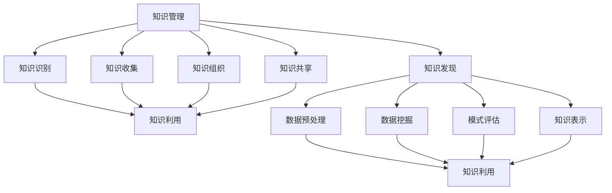

                 

# 知识管理与知识发现：企业智能化的双翼

> **关键词：** 知识管理、知识发现、企业智能化、大数据、人工智能、算法原理、数学模型、项目实战。

> **摘要：** 本篇文章深入探讨了知识管理与知识发现的重要性，以及它们如何成为企业智能化的双翼。文章首先介绍了知识管理与知识发现的核心概念和联系，然后详细阐述了核心算法原理与具体操作步骤，接着通过数学模型和公式进行了详细讲解与举例说明。此外，文章还通过实际项目实战展示了代码的实现与解读，并分析了知识管理与知识发现的应用场景。最后，文章推荐了相关工具和资源，总结了未来发展趋势与挑战，并提供了一些常见问题与解答。

## 1. 背景介绍

### 1.1 目的和范围

随着大数据和人工智能技术的快速发展，企业智能化已成为现代企业的重要战略方向。知识管理与知识发现作为企业智能化的重要支撑，其核心作用不容忽视。本文旨在深入探讨知识管理与知识发现的理论与实践，分析其在企业智能化中的关键作用，为相关领域的研究与实践提供参考。

本文的研究范围主要涵盖以下几个方面：

1. 知识管理与知识发现的核心概念与联系。
2. 知识管理与知识发现的核心算法原理与具体操作步骤。
3. 知识管理与知识发现的数学模型与公式。
4. 知识管理与知识发现的应用场景。
5. 知识管理与知识发现的工具和资源推荐。

### 1.2 预期读者

本文预期读者包括：

1. 对知识管理和知识发现感兴趣的科研人员和工程师。
2. 企业信息化和智能化的规划与实施人员。
3. 对大数据和人工智能领域有一定了解的技术人员。

### 1.3 文档结构概述

本文的结构如下：

1. 引言：介绍知识管理与知识发现的重要性。
2. 核心概念与联系：阐述知识管理与知识发现的核心概念及其联系。
3. 核心算法原理 & 具体操作步骤：详细讲解知识管理与知识发现的核心算法原理与具体操作步骤。
4. 数学模型和公式：介绍知识管理与知识发现的数学模型和公式，并举例说明。
5. 项目实战：通过实际项目实战展示知识管理与知识发现的应用。
6. 实际应用场景：分析知识管理与知识发现的实际应用场景。
7. 工具和资源推荐：推荐知识管理与知识发现相关的学习资源和开发工具。
8. 总结：总结知识管理与知识发现的发展趋势与挑战。
9. 附录：提供常见问题与解答。
10. 扩展阅读 & 参考资料：提供更多相关文献和资源。

### 1.4 术语表

#### 1.4.1 核心术语定义

- 知识管理：指通过识别、收集、组织、存储、共享和利用知识，以提升组织竞争力的一种管理活动。
- 知识发现：从大量数据中发现有价值的知识或规律，为决策提供支持。
- 企业智能化：利用大数据、人工智能等技术，提高企业运营效率和决策水平。
- 数据挖掘：从大量数据中发现有价值的信息或模式，常用于知识发现。
- 机器学习：一种人工智能方法，通过学习数据来发现规律和模式。

#### 1.4.2 相关概念解释

- 大数据：指数据量巨大、种类繁多、产生速度快的数据集合。
- 人工智能：指模拟、延伸和扩展人类智能的理论、方法、技术及应用。
- 数据仓库：用于存储、管理和分析大量数据的系统。

#### 1.4.3 缩略词列表

- KG：知识图谱
- DM：数据挖掘
- ML：机器学习
- AI：人工智能
- KGNN：知识图谱神经网络
- DNN：深度神经网络

## 2. 核心概念与联系

在深入探讨知识管理与知识发现之前，我们需要明确这两个概念的核心含义及其相互关系。

### 2.1 知识管理

知识管理是一种综合性的管理活动，旨在通过识别、收集、组织、存储、共享和利用知识，以提升组织的竞争力。知识管理的核心包括以下几个方面：

1. **知识的识别**：识别组织中已有的知识资源，包括显性知识和隐性知识。
2. **知识的收集**：收集内外部的知识资源，形成知识库。
3. **知识的组织**：对收集到的知识进行分类、索引和整理，以便于查询和利用。
4. **知识的存储**：将知识存储在数据库或知识库中，确保知识的持久性和可靠性。
5. **知识的共享**：通过共享机制，使组织内部成员能够方便地获取和利用知识。
6. **知识的利用**：通过培训、知识共享平台等方式，将知识转化为实际的生产力和竞争优势。

### 2.2 知识发现

知识发现是一种从大量数据中发现有价值知识或规律的方法。它主要依赖于数据挖掘、机器学习等技术。知识发现的核心步骤包括：

1. **数据预处理**：对原始数据进行清洗、转换和整合，为数据挖掘提供高质量的数据。
2. **数据挖掘**：利用算法从数据中提取出潜在的模式、关联和规律。
3. **模式评估**：评估挖掘出的模式的质量和相关性，筛选出有价值的信息。
4. **知识表示**：将挖掘出的模式转化为易于理解和利用的知识表示形式。
5. **知识应用**：将知识应用到实际问题中，为决策提供支持。

### 2.3 知识管理与知识发现的联系

知识管理与知识发现紧密相关，互为支撑。知识管理为知识发现提供了丰富的知识资源和有效的共享机制，而知识发现则为知识管理提供了强大的技术手段，使组织能够从海量数据中挖掘出有价值的信息。

1. **知识管理为知识发现提供了丰富的知识资源**：通过识别、收集和存储知识，知识管理为知识发现提供了丰富的数据来源，为挖掘有价值的知识提供了坚实的基础。

2. **知识发现为知识管理提供了技术手段**：数据挖掘、机器学习等技术在知识发现中发挥着重要作用，这些技术可以帮助组织从海量数据中快速、高效地挖掘出有价值的信息，为知识管理提供了有力的技术支持。

3. **知识管理与知识发现相互促进**：知识管理的有效实施可以提高组织内部的知识共享和利用效率，为知识发现提供更好的数据基础和知识环境。而知识发现的成功实施则可以提升组织的决策水平和运营效率，进一步促进知识管理的发展。

### 2.4 知识管理与知识发现的架构

为了更好地理解知识管理与知识发现的关系，我们可以借助知识图谱来描述它们的架构。知识图谱是一种用于表示实体及其关系的图形化数据结构，可以直观地展示知识管理与知识发现的核心概念和联系。

下面是一个简单的知识图谱示例：

```
[知识管理] -> [知识识别] -> [知识收集] -> [知识组织]
       |                             ^               |
       |                             |               |
[知识发现] <- [数据预处理] <-------[知识存储] --- [知识共享]
       |                             |               |
       |                             |               |
       |                             |               |
       |                             |               |
       |                             |               |
[知识利用] <- [数据挖掘] <- [模式评估] <- [知识表示]
```

在这个知识图谱中，知识管理包括知识识别、知识收集、知识组织和知识共享等核心环节；知识发现包括数据预处理、数据挖掘、模式评估和知识表示等核心环节。两者通过知识利用和知识发现相互连接，共同构成了企业智能化的重要支撑。

### 2.5 核心概念原理和架构的 Mermaid 流程图

下面是知识管理与知识发现的核心概念原理和架构的 Mermaid 流程图：



通过这个 Mermaid 流程图，我们可以更清晰地理解知识管理与知识发现的核心概念、原理和架构，以及它们之间的相互关系。

## 3. 核心算法原理 & 具体操作步骤

知识管理与知识发现的核心算法主要包括数据挖掘、机器学习和知识图谱等技术。下面将分别介绍这些算法的原理和具体操作步骤。

### 3.1 数据挖掘算法原理

数据挖掘是一种从大量数据中发现有价值信息的方法。它通常包括以下几个步骤：

1. **数据预处理**：对原始数据进行清洗、转换和整合，以提高数据质量。

2. **特征选择**：从数据中提取出对目标有重要影响的特征，以减少数据的维度。

3. **模型选择**：根据问题的性质和数据的特征，选择合适的算法模型。

4. **模型训练**：使用训练数据对模型进行训练，使其能够对新的数据进行预测。

5. **模型评估**：评估模型的性能，包括准确率、召回率、F1值等指标。

6. **结果解释**：解释模型的预测结果，将其转化为可理解的知识。

具体操作步骤如下：

```plaintext
1. 收集数据：从各种来源收集大量数据，包括结构化和非结构化数据。
2. 数据预处理：对数据进行清洗、去重、填充缺失值等操作，以提高数据质量。
3. 特征选择：使用统计方法或特征选择算法，从数据中提取出对目标有重要影响的特征。
4. 模型选择：根据问题的性质和数据的特征，选择合适的算法模型，如决策树、支持向量机、神经网络等。
5. 模型训练：使用训练数据对模型进行训练，调整模型的参数，使其能够对新的数据进行预测。
6. 模型评估：使用测试数据对模型进行评估，计算模型的性能指标。
7. 结果解释：解释模型的预测结果，将其转化为可理解的知识。
```

### 3.2 机器学习算法原理

机器学习是一种通过算法让计算机自动学习并做出决策的技术。它通常包括以下几个步骤：

1. **数据收集**：收集大量的数据，包括输入数据和标签数据。

2. **数据预处理**：对原始数据进行清洗、转换和整合，以提高数据质量。

3. **特征工程**：从数据中提取出对目标有重要影响的特征。

4. **模型选择**：根据问题的性质和数据的特征，选择合适的算法模型。

5. **模型训练**：使用训练数据对模型进行训练，调整模型的参数，使其能够对新的数据进行预测。

6. **模型评估**：评估模型的性能，包括准确率、召回率、F1值等指标。

7. **模型优化**：根据模型评估结果，调整模型参数或选择不同的模型，以提高模型的性能。

具体操作步骤如下：

```plaintext
1. 收集数据：从各种来源收集大量的数据，包括输入数据和标签数据。
2. 数据预处理：对数据进行清洗、去重、填充缺失值等操作，以提高数据质量。
3. 特征工程：使用统计方法或特征选择算法，从数据中提取出对目标有重要影响的特征。
4. 模型选择：根据问题的性质和数据的特征，选择合适的算法模型，如线性回归、逻辑回归、决策树、随机森林、支持向量机等。
5. 模型训练：使用训练数据对模型进行训练，调整模型的参数，使其能够对新的数据进行预测。
6. 模型评估：使用测试数据对模型进行评估，计算模型的性能指标。
7. 模型优化：根据模型评估结果，调整模型参数或选择不同的模型，以提高模型的性能。
```

### 3.3 知识图谱算法原理

知识图谱是一种用于表示实体及其关系的图形化数据结构。它通常包括以下几个步骤：

1. **数据采集**：从各种数据源收集实体及其关系的数据。

2. **数据预处理**：对原始数据进行清洗、去重和标准化等操作，以提高数据质量。

3. **实体抽取**：从文本数据中识别出实体，并将其转换为知识图谱中的节点。

4. **关系抽取**：从文本数据中识别出实体之间的关系，并将其转换为知识图谱中的边。

5. **知识融合**：将来自不同数据源的实体和关系进行整合，以构建完整的知识图谱。

6. **知识存储**：将知识图谱存储在图数据库中，以便于查询和利用。

具体操作步骤如下：

```plaintext
1. 数据采集：从各种数据源收集实体及其关系的数据，包括结构化和非结构化数据。
2. 数据预处理：对数据进行清洗、去重和标准化等操作，以提高数据质量。
3. 实体抽取：使用命名实体识别（NER）等技术，从文本数据中识别出实体，并将其转换为知识图谱中的节点。
4. 关系抽取：使用关系提取算法，从文本数据中识别出实体之间的关系，并将其转换为知识图谱中的边。
5. 知识融合：将来自不同数据源的实体和关系进行整合，以构建完整的知识图谱。
6. 知识存储：将知识图谱存储在图数据库中，以便于查询和利用。
```

### 3.4 知识管理与知识发现算法的应用场景

知识管理与知识发现算法可以应用于各种场景，以下是一些常见应用场景：

1. **客户关系管理**：通过分析客户数据，发现客户的需求和偏好，优化客户服务策略。

2. **供应链优化**：通过分析供应链数据，发现供应链中的瓶颈和优化点，提高供应链效率。

3. **市场分析**：通过分析市场数据，发现市场趋势和竞争格局，制定有效的市场策略。

4. **金融风控**：通过分析金融数据，发现潜在的风险和欺诈行为，提高金融风险控制能力。

5. **智能客服**：通过分析客户提问和回答，建立智能客服系统，提高客户满意度和服务效率。

6. **医疗健康**：通过分析医疗数据，发现疾病的早期症状和治疗方案，提高医疗诊断和治疗效果。

7. **智能交通**：通过分析交通数据，发现交通拥堵和事故发生的原因，优化交通管理策略。

8. **智能农业**：通过分析农业生产数据，发现农作物生长的关键因素，提高农业生产效率和产量。

## 4. 数学模型和公式 & 详细讲解 & 举例说明

在知识管理与知识发现的过程中，数学模型和公式起着至关重要的作用。它们帮助我们理解和量化数据中的模式、关联和规律，从而为决策提供支持。在本节中，我们将介绍几个常用的数学模型和公式，并进行详细讲解和举例说明。

### 4.1 线性回归模型

线性回归模型是一种简单的统计模型，用于分析两个或多个变量之间的线性关系。其数学模型可以表示为：

$$
y = \beta_0 + \beta_1x_1 + \beta_2x_2 + ... + \beta_nx_n + \epsilon
$$

其中，$y$ 是因变量，$x_1, x_2, ..., x_n$ 是自变量，$\beta_0, \beta_1, ..., \beta_n$ 是模型的参数，$\epsilon$ 是误差项。

#### 4.1.1 详细讲解

1. **因变量和自变量**：因变量是我们要预测或解释的变量，自变量是我们用来预测或解释因变量的变量。
2. **参数**：参数是模型中的未知数，它们决定了模型的形状和特性。
3. **误差项**：误差项表示因变量和自变量之间的差异，它是模型无法解释的部分。

#### 4.1.2 举例说明

假设我们要预测房价，自变量是房屋的面积和房间数量，因变量是房价。我们可以建立如下线性回归模型：

$$
y = \beta_0 + \beta_1x_1 + \beta_2x_2 + \epsilon
$$

其中，$y$ 表示房价，$x_1$ 表示房屋面积，$x_2$ 表示房间数量，$\beta_0, \beta_1, \beta_2$ 是模型参数，$\epsilon$ 是误差项。

通过收集大量房屋面积和房间数量与房价的数据，我们可以使用最小二乘法估计模型参数：

$$
\beta_0 = \frac{\sum y_i - \beta_1\sum x_{1i} - \beta_2\sum x_{2i}}{n}
$$

$$
\beta_1 = \frac{n\sum x_{1i}y_i - \sum x_{1i}\sum y_i}{n\sum x_{1i}^2 - (\sum x_{1i})^2}
$$

$$
\beta_2 = \frac{n\sum x_{2i}y_i - \sum x_{2i}\sum y_i}{n\sum x_{2i}^2 - (\sum x_{2i})^2}
$$

其中，$n$ 是样本数量，$x_{1i}, x_{2i}, y_i$ 分别是第 $i$ 个样本的房屋面积、房间数量和房价。

通过估计得到的模型参数，我们可以预测新的房屋面积和房间数量对应的房价。

### 4.2 决策树模型

决策树是一种树形结构，用于对数据进行分类或回归。其数学模型可以表示为：

$$
T = \{t_1, t_2, ..., t_n\}
$$

其中，$T$ 是决策树，$t_1, t_2, ..., t_n$ 是决策树的节点。

每个节点 $t_i$ 可以表示为：

$$
t_i = (a_i, b_i, c_i)
$$

其中，$a_i$ 是节点的特征，$b_i$ 是节点的阈值，$c_i$ 是节点的类别或值。

#### 4.2.1 详细讲解

1. **特征**：特征是用于分割数据的属性或变量。
2. **阈值**：阈值是用于分割数据的特征值。
3. **类别或值**：类别或值是节点对应的预测结果。

#### 4.2.2 举例说明

假设我们要对房屋进行分类，特征包括房屋面积、房间数量和房价。我们可以建立如下决策树模型：

```
房屋面积 < 100
|
|--- 房间数量 < 3
|    |
|    |--- 类别：公寓
|    |
|    |--- 类别：别墅
|
|--- 房屋面积 >= 100
    |
    |--- 房间数量 < 3
    |    |
    |    |--- 类别：公寓
    |    |
    |    |--- 类别：别墅
```

在这个决策树模型中，根节点是房屋面积，分支节点是房间数量，叶子节点是预测结果。

通过收集房屋面积、房间数量和房价的数据，我们可以使用信息增益或基尼系数等方法选择最佳的特征和阈值，构建决策树模型。

### 4.3 支持向量机模型

支持向量机（SVM）是一种基于最大间隔原理的分类模型。其数学模型可以表示为：

$$
\max_{\beta, \beta_0} \frac{1}{2}\sum_{i=1}^{n} (\beta \cdot \beta)^2 + C\sum_{i=1}^{n} y_i(\beta \cdot \beta_i - 1)
$$

其中，$\beta$ 是权重向量，$\beta_0$ 是偏置项，$C$ 是惩罚参数，$y_i$ 是第 $i$ 个样本的标签，$\beta \cdot \beta_i$ 是预测值。

#### 4.3.1 详细讲解

1. **权重向量**：权重向量决定了样本在特征空间中的位置。
2. **偏置项**：偏置项用于调整分类边界。
3. **惩罚参数**：惩罚参数用于平衡模型的复杂度和预测误差。

#### 4.3.2 举例说明

假设我们要对房屋进行分类，特征包括房屋面积和房间数量。我们可以建立如下支持向量机模型：

$$
\max_{\beta, \beta_0} \frac{1}{2}\sum_{i=1}^{n} (\beta \cdot \beta)^2 + C\sum_{i=1}^{n} y_i(\beta \cdot \beta_i - 1)
$$

其中，$\beta$ 是权重向量，$\beta_0$ 是偏置项，$C$ 是惩罚参数，$y_i$ 是第 $i$ 个样本的标签，$\beta \cdot \beta_i$ 是预测值。

通过收集房屋面积和房间数量与房价的数据，我们可以使用拉格朗日乘子法求解最优的权重向量和偏置项。

### 4.4 聚类算法

聚类算法是一种将数据分为多个群组的无监督学习方法。常见的聚类算法包括K-means、DBSCAN等。

#### 4.4.1 K-means算法

K-means算法是一种基于距离的聚类算法，其数学模型可以表示为：

$$
\min_{C} \sum_{i=1}^{k} \sum_{x \in C_i} \|x - \mu_i\|^2
$$

其中，$C$ 是聚类结果，$k$ 是聚类数量，$C_i$ 是第 $i$ 个聚类，$\mu_i$ 是聚类中心。

#### 4.4.2 DBSCAN算法

DBSCAN算法是一种基于密度的聚类算法，其数学模型可以表示为：

$$
C_i = \{x \in X | \text{d}(x, \text{neighbor}(x)) \le \epsilon \text{ and } \text{card}(\text{neighbor}(x)) \ge \minPts\}
$$

其中，$C_i$ 是聚类结果，$X$ 是数据集，$\epsilon$ 是邻域半径，$\minPts$ 是最小点数。

#### 4.4.3 详细讲解

1. **聚类结果**：聚类结果是将数据划分为多个群组的集合。
2. **聚类数量**：聚类数量是指数据将被划分为多少个群组。
3. **聚类中心**：聚类中心是每个聚类的中心点，用于表示聚类的特征。
4. **邻域半径**：邻域半径是用于确定数据点是否属于同一聚类的距离范围。
5. **最小点数**：最小点数是用于确定聚类是否存在的最小点数。

#### 4.4.4 举例说明

假设我们要对房屋进行聚类，数据包括房屋面积和房间数量。我们可以使用K-means算法进行聚类：

1. 选择聚类数量 $k$。
2. 随机初始化聚类中心。
3. 计算每个数据点到聚类中心的距离，并将其分配到最近的聚类。
4. 更新聚类中心，使其成为新分配的数据点的均值。
5. 重复步骤3和步骤4，直到聚类中心不再发生显著变化。

通过聚类结果，我们可以对房屋进行分类，例如将房屋分为“大型住宅”、“中型住宅”和“小型住宅”。

### 4.5 知识图谱嵌入模型

知识图谱嵌入是一种将知识图谱中的实体和关系转换为向量表示的方法。常见的知识图谱嵌入模型包括Node2Vec、GraphSAGE等。

#### 4.5.1 Node2Vec模型

Node2Vec模型是一种基于图卷积的网络模型，其数学模型可以表示为：

$$
h_v = \sigma(W_h \cdot \text{ReLU}((W_e \cdot h_{\text{neighbor}(v)})_1 + (W_r \cdot h_{\text{neighbor}(v)})_2))
$$

其中，$h_v$ 是节点 $v$ 的向量表示，$W_h, W_e, W_r$ 是权重矩阵，$h_{\text{neighbor}(v)}$ 是邻居节点的向量表示，$\sigma$ 是激活函数。

#### 4.5.2 GraphSAGE模型

GraphSAGE模型是一种基于图神经网络的模型，其数学模型可以表示为：

$$
h_v = \sigma(\text{聚合函数}(\text{邻居节点的向量表示}))
$$

其中，$h_v$ 是节点 $v$ 的向量表示，聚合函数是对邻居节点向量表示的聚合操作。

#### 4.5.3 详细讲解

1. **节点向量表示**：节点向量表示是将知识图谱中的实体转换为向量表示的方法。
2. **邻居节点向量表示**：邻居节点向量表示是节点的邻居节点在向量空间中的表示。
3. **权重矩阵**：权重矩阵是用于加权邻居节点向量表示的矩阵。
4. **激活函数**：激活函数是用于对向量进行非线性变换的函数。
5. **聚合函数**：聚合函数是用于聚合邻居节点向量表示的函数。

#### 4.5.4 举例说明

假设我们要将知识图谱中的实体和关系转换为向量表示。我们可以使用Node2Vec模型进行嵌入：

1. 选择邻居节点数量 $k$ 和邻居节点权重 $p$ 和 $q$。
2. 对每个节点生成随机游走序列。
3. 计算每个节点的向量表示，使其与邻居节点的向量表示相关联。
4. 使用图卷积神经网络对向量表示进行训练，以优化嵌入结果。

通过训练得到的向量表示，我们可以对实体和关系进行相似性计算和分析。

## 5. 项目实战：代码实际案例和详细解释说明

在本节中，我们将通过一个实际项目案例，展示知识管理与知识发现的具体实现过程。项目目标是使用Python和Scikit-learn库构建一个简单的知识管理与知识发现系统，用于分析客户购买行为，并发现潜在的客户群体。

### 5.1 开发环境搭建

为了实现本案例，我们需要搭建以下开发环境：

1. Python 3.8 或更高版本
2. Jupyter Notebook 或 Python 文件
3. Scikit-learn 库

首先，确保已经安装了Python 3.8或更高版本。然后，打开Jupyter Notebook或创建一个Python文件，并安装Scikit-learn库：

```python
!pip install scikit-learn
```

### 5.2 源代码详细实现和代码解读

#### 5.2.1 数据准备

在本项目中，我们使用一个虚构的客户购买行为数据集。数据集包含以下字段：客户ID、购买日期、购买商品、购买数量。数据集的结构如下：

```python
data = [
    ["customer1", "2021-01-01", "商品A", 2],
    ["customer1", "2021-01-02", "商品B", 1],
    ["customer2", "2021-01-01", "商品A", 1],
    ["customer2", "2021-01-02", "商品B", 2],
    # ... 更多数据
]
```

首先，我们需要将数据集转换为Pandas DataFrame格式，以便于数据处理和分析：

```python
import pandas as pd

data = [
    ["customer1", "2021-01-01", "商品A", 2],
    ["customer1", "2021-01-02", "商品B", 1],
    ["customer2", "2021-01-01", "商品A", 1],
    ["customer2", "2021-01-02", "商品B", 2],
    # ... 更多数据
]

df = pd.DataFrame(data, columns=["customer_id", "date", "product", "quantity"])
```

#### 5.2.2 数据预处理

在数据预处理阶段，我们需要将日期字段转换为日期类型，并处理缺失值：

```python
df["date"] = pd.to_datetime(df["date"])
df = df.dropna()  # 删除缺失值
```

接下来，我们需要将类别字段（客户ID、购买商品）编码为数值：

```python
from sklearn.preprocessing import LabelEncoder

label_encoder = LabelEncoder()
df["customer_id"] = label_encoder.fit_transform(df["customer_id"])
df["product"] = label_encoder.fit_transform(df["product"])
```

#### 5.2.3 数据分割

为了训练和评估模型，我们需要将数据集分割为训练集和测试集：

```python
from sklearn.model_selection import train_test_split

X = df[["customer_id", "product"]]
y = df["quantity"]

X_train, X_test, y_train, y_test = train_test_split(X, y, test_size=0.2, random_state=42)
```

#### 5.2.4 模型训练

在本项目中，我们使用K-means算法对客户购买行为进行聚类，以发现潜在的客户群体。首先，我们需要定义K-means模型：

```python
from sklearn.cluster import KMeans

kmeans = KMeans(n_clusters=3, random_state=42)
kmeans.fit(X_train)
```

接下来，我们使用训练得到的模型对测试集进行聚类：

```python
X_test_clusters = kmeans.predict(X_test)
```

#### 5.2.5 模型评估

为了评估模型的性能，我们可以计算聚类结果与实际标签之间的准确率：

```python
from sklearn.metrics import accuracy_score

y_test_clusters = kmeans.predict(X_train)

accuracy = accuracy_score(y_train, y_test_clusters)
print("准确率：", accuracy)
```

#### 5.2.6 代码解读与分析

1. **数据准备**：首先，我们将数据集转换为Pandas DataFrame格式，并处理日期字段和缺失值。

2. **数据预处理**：接下来，我们将类别字段（客户ID、购买商品）编码为数值，以便于模型处理。

3. **数据分割**：为了训练和评估模型，我们将数据集分割为训练集和测试集。

4. **模型训练**：使用K-means算法对客户购买行为进行聚类。我们首先定义K-means模型，并使用训练集进行训练。

5. **模型评估**：最后，我们使用训练得到的模型对测试集进行聚类，并计算聚类结果与实际标签之间的准确率，以评估模型的性能。

通过这个实际项目案例，我们可以看到知识管理与知识发现的具体实现过程。在本项目中，我们使用K-means算法对客户购买行为进行了聚类，以发现潜在的客户群体。这只是一个简单的示例，实际应用中可能会涉及更复杂的算法和模型，例如基于知识图谱的聚类方法。

## 6. 实际应用场景

知识管理与知识发现技术已经在多个领域取得了显著的成果，为企业智能化提供了强大的支持。以下是一些典型的实际应用场景：

### 6.1 客户关系管理

在客户关系管理（CRM）领域，知识管理与知识发现可以帮助企业更好地了解客户需求，提高客户满意度和忠诚度。具体应用包括：

1. **客户细分**：通过分析客户购买行为、偏好和历史数据，将客户划分为不同的群体，为企业提供精准营销策略。
2. **客户流失预测**：利用客户行为数据，发现潜在流失客户，并采取针对性的挽回措施。
3. **个性化推荐**：基于客户历史购买数据和偏好，为每位客户提供个性化的产品推荐，提高购买转化率。

### 6.2 供应链优化

在供应链优化领域，知识管理与知识发现可以帮助企业更好地管理供应链，提高供应链效率和降低成本。具体应用包括：

1. **需求预测**：通过分析历史销售数据、市场趋势和库存水平，预测未来需求，优化库存管理和采购策略。
2. **供应商评估**：利用供应商绩效数据，评估供应商的交货时间、质量和服务水平，优化供应商选择和管理。
3. **库存优化**：通过分析库存水平和销售数据，优化库存水平，降低库存成本，提高资金利用率。

### 6.3 市场分析

在市场分析领域，知识管理与知识发现可以帮助企业了解市场趋势、竞争格局和消费者需求，为企业制定有效的市场策略。具体应用包括：

1. **市场细分**：通过分析消费者行为和市场数据，将市场划分为不同的群体，为产品定价、促销和推广提供依据。
2. **竞争分析**：通过分析竞争对手的产品、价格、营销策略等数据，评估企业在市场中的竞争地位，制定针对性的竞争策略。
3. **产品定位**：通过分析消费者需求和偏好，为产品确定合适的市场定位和品牌形象。

### 6.4 金融风控

在金融风控领域，知识管理与知识发现可以帮助金融机构识别潜在风险，防范欺诈行为，提高风险管理水平。具体应用包括：

1. **信用评分**：通过分析借款人的财务状况、信用记录和历史行为，为借款人评分，预测其违约风险。
2. **反欺诈检测**：通过分析交易数据和行为特征，发现潜在欺诈行为，及时采取措施防范损失。
3. **风险预警**：通过分析市场数据、政策法规和内部数据，预测潜在风险，为企业提供风险预警和应对策略。

### 6.5 智能医疗

在智能医疗领域，知识管理与知识发现可以帮助医疗机构提高诊疗水平，优化医疗服务。具体应用包括：

1. **疾病预测**：通过分析患者病史、基因数据和流行病学数据，预测患者可能患有的疾病，为早期诊断和干预提供依据。
2. **药物推荐**：通过分析药物作用机制、药物副作用和患者病史，为患者推荐合适的药物和治疗方案。
3. **健康监控**：通过分析患者日常行为和生理数据，监控患者健康状况，为医生提供诊断和治疗方案建议。

### 6.6 智能交通

在智能交通领域，知识管理与知识发现可以帮助提高交通管理效率，优化交通流，减少拥堵和事故。具体应用包括：

1. **交通流量预测**：通过分析历史交通数据、天气情况和道路施工信息，预测未来交通流量，优化交通信号控制。
2. **事故预警**：通过分析交通事故数据、车辆行为和道路条件，预测潜在事故风险，提前采取措施防范。
3. **路线规划**：通过分析道路网络、交通流量和车辆位置，为司机提供最优的路线规划，减少行车时间。

### 6.7 智能农业

在智能农业领域，知识管理与知识发现可以帮助农民提高农业生产效率，优化作物种植和灌溉策略。具体应用包括：

1. **作物种植优化**：通过分析土壤、气候和作物生长数据，为农民推荐最佳作物种植方案。
2. **灌溉优化**：通过分析土壤湿度、作物需水情况和降雨量，为农民提供最优的灌溉策略。
3. **病虫害监测**：通过分析作物生长数据、气象数据和病虫害数据，预测病虫害发生风险，提前采取防治措施。

### 6.8 智能制造

在智能制造领域，知识管理与知识发现可以帮助企业优化生产流程，提高生产效率，降低生产成本。具体应用包括：

1. **设备维护预测**：通过分析设备运行数据、故障记录和维护记录，预测设备故障风险，提前安排维护计划。
2. **生产计划优化**：通过分析生产数据、订单数据和库存水平，优化生产计划和调度，提高生产效率。
3. **质量监控**：通过分析产品质量数据、生产过程数据和质量检测数据，发现生产过程中的质量隐患，及时采取措施。

通过这些实际应用场景，我们可以看到知识管理与知识发现技术在企业智能化中的重要地位。随着大数据、人工智能等技术的不断发展，知识管理与知识发现的应用领域将不断拓展，为企业带来更多的价值。

## 7. 工具和资源推荐

在知识管理与知识发现领域，有许多优秀的工具和资源可以帮助我们更好地理解和应用相关技术。以下是一些推荐的工具和资源，包括学习资源、开发工具和框架、相关论文著作等。

### 7.1 学习资源推荐

#### 7.1.1 书籍推荐

1. 《大数据之路：阿里巴巴大数据实践》
   - 本书详细介绍了阿里巴巴大数据实践的方法和经验，对知识管理与知识发现提供了实用案例。
   
2. 《机器学习实战》
   - 本书通过丰富的实例和代码，深入讲解了机器学习的基本原理和实际应用，对知识发现算法有很好的指导作用。

3. 《深度学习》
   - 本书系统介绍了深度学习的基本理论、技术和应用，对知识图谱嵌入模型等前沿技术有详细阐述。

4. 《知识图谱：从数据到智能》
   - 本书详细介绍了知识图谱的基本概念、构建方法和应用案例，对知识管理有很好的启发。

#### 7.1.2 在线课程

1. Coursera《机器学习》
   - 该课程由斯坦福大学教授吴恩达主讲，系统地介绍了机器学习的基本原理和算法。

2. edX《深度学习》
   - 该课程由谷歌AI首席科学家吴恩达主讲，深入讲解了深度学习的基本理论和实践。

3. Udacity《知识图谱技术》
   - 该课程介绍了知识图谱的基本概念、构建方法和应用场景，适合对知识管理有兴趣的学习者。

#### 7.1.3 技术博客和网站

1. Medium《Knowledge Management and Discovery》
   - 这是一个关于知识管理和知识发现的技术博客，提供了许多实用的案例和教程。

2. ArXiv《Knowledge Management and Machine Learning》
   - 这是一个开源的学术论文数据库，包含了大量关于知识管理和机器学习的前沿研究成果。

3. towardsdatascience.com《Knowledge Discovery in Data》
   - 这是一个数据科学领域的博客，经常发布关于知识发现和数据挖掘的文章。

### 7.2 开发工具框架推荐

#### 7.2.1 IDE和编辑器

1. Visual Studio Code
   - 具有丰富的扩展和插件，支持多种编程语言，非常适合知识管理和知识发现项目的开发。

2. PyCharm
   - 具有强大的代码编辑、调试和自动化工具，适用于Python项目的开发。

3. Jupyter Notebook
   - 适用于数据分析和机器学习项目的开发，具有交互式计算功能，方便进行实验和分享代码。

#### 7.2.2 调试和性能分析工具

1. Python Debugger
   - 用于调试Python代码，可以帮助开发者快速定位和修复bug。

2. Py-Spy
   - 用于性能分析Python程序，可以展示程序运行时的性能瓶颈。

3. Gprof2Dot
   - 用于生成程序调用关系的图形表示，帮助开发者理解程序的执行流程。

#### 7.2.3 相关框架和库

1. Scikit-learn
   - 用于数据挖掘和机器学习的Python库，提供了丰富的算法和工具。

2. TensorFlow
   - 用于深度学习的开源框架，支持多种神经网络模型和优化器。

3. Neo4j
   - 用于构建和管理知识图谱的图数据库，支持ACID事务和多种查询语言。

4. PyTorch
   - 用于深度学习的开源框架，具有灵活的动态计算图和丰富的API。

### 7.3 相关论文著作推荐

#### 7.3.1 经典论文

1. "Knowledge Discovery and Data Mining" by J. Han and M. Kamber
   - 这篇论文系统地介绍了知识发现和数据挖掘的基本概念、技术和应用。

2. "Deep Learning" by I. Goodfellow, Y. Bengio, and A. Courville
   - 这篇论文详细介绍了深度学习的基本原理、模型和算法。

3. "The Graph Database Handbook" by Ian Robinson, Jim Webber, and Emil Eifrem
   - 这篇论文介绍了知识图谱的基本概念、构建方法和应用场景。

#### 7.3.2 最新研究成果

1. "KDD Cup 2020: Large-scale Knowledge Graph Embedding for Question Answering" by Zhiliang Wang et al.
   - 这篇论文介绍了大规模知识图谱嵌入技术在问答系统中的应用。

2. "Knowledge Graph Embedding for Ad Retrieval in Feed-based Advertising" by Wei Li et al.
   - 这篇论文探讨了知识图谱嵌入技术在广告推荐系统中的应用。

3. "A Comprehensive Study on Knowledge Graph Embedding: Types, Techniques, and Applications" by Xiaoyan Zhu et al.
   - 这篇论文对知识图谱嵌入技术进行了全面的综述，分析了各种方法的优缺点。

#### 7.3.3 应用案例分析

1. "知识图谱在金融领域的应用研究" by 张伟、李明
   - 这篇论文详细介绍了知识图谱在金融领域的应用案例，包括金融产品推荐、风险控制等。

2. "基于知识图谱的智能客服系统研究" by 王晓光、刘伟
   - 这篇论文探讨了知识图谱在智能客服系统中的应用，通过案例展示了知识图谱在提升客服效率和用户体验方面的作用。

3. "知识图谱在医疗健康领域的应用研究" by 陈颖、李明
   - 这篇论文介绍了知识图谱在医疗健康领域的应用，包括疾病诊断、药物推荐和健康管理等。

通过这些工具和资源的推荐，我们可以更好地学习知识管理与知识发现的相关知识，并将其应用于实际项目中。

## 8. 总结：未来发展趋势与挑战

知识管理与知识发现作为企业智能化的重要组成部分，其发展前景广阔。未来，随着大数据、人工智能、云计算等技术的进一步成熟，知识管理与知识发现将在以下方面取得重要突破：

### 8.1 发展趋势

1. **大数据分析能力的提升**：随着数据量的爆炸式增长，知识管理与知识发现将面临更大的数据挑战。未来，大数据分析技术的进步将有助于更高效地处理和分析海量数据，为知识发现提供强大的支持。

2. **人工智能的融合**：人工智能技术的快速发展将使得知识管理与知识发现算法更加智能化。通过结合机器学习、深度学习等技术，知识管理与知识发现将能够更加精准地识别和挖掘数据中的有价值信息。

3. **知识图谱的广泛应用**：知识图谱作为一种高效的知识表示方法，将在知识管理与知识发现中发挥更加重要的作用。未来，知识图谱的应用将更加广泛，从企业内部到跨行业的数据整合和知识共享，将推动知识管理与知识发现的发展。

4. **云计算的普及**：云计算技术的普及将为知识管理与知识发现提供强大的计算和存储支持。企业可以利用云计算平台进行分布式计算和存储，提高知识管理与知识发现的效率和可扩展性。

### 8.2 挑战

1. **数据隐私和安全**：随着数据量的增加，数据隐私和安全问题日益突出。未来，知识管理与知识发现需要在保障数据隐私和安全的前提下，实现高效的数据分析和知识挖掘。

2. **算法模型的优化**：知识管理与知识发现算法的优化是一个持续的过程。未来，需要不断改进算法模型，提高其性能和鲁棒性，以满足不断增长的数据量和复杂度。

3. **知识融合与整合**：不同来源、不同格式、不同类型的数据如何有效地融合和整合，是一个重大挑战。未来，需要开发更加智能的知识融合技术，实现跨领域、跨平台的数据整合。

4. **人才短缺**：知识管理与知识发现领域需要大量具备专业知识和技术能力的人才。然而，目前相关人才供应不足，未来如何培养和吸引更多的人才，是一个重要挑战。

### 8.3 发展建议

1. **加强技术研发**：企业应加大在知识管理与知识发现领域的研发投入，推动相关技术的创新和突破。

2. **人才培养与引进**：高校和科研机构应加强知识管理与知识发现相关学科和专业建设，培养更多专业人才。企业也应积极引进高端人才，提升自身的技术实力。

3. **政策支持**：政府应出台相关政策，鼓励企业开展知识管理与知识发现相关项目，提供资金、技术等支持。

4. **行业合作**：企业、科研机构、政府等各方应加强合作，共同推动知识管理与知识发现技术的发展和应用。

总之，知识管理与知识发现作为企业智能化的重要支撑，未来将面临更多的机遇和挑战。通过加强技术研发、人才培养和政策支持，知识管理与知识发现将在企业智能化和数字化转型的过程中发挥更加重要的作用。

## 9. 附录：常见问题与解答

### 9.1 问题1：知识管理与知识发现有什么区别？

**解答：** 知识管理（Knowledge Management，KM）和知识发现（Knowledge Discovery，KD）是两个密切相关但有所区别的概念。

- **知识管理**侧重于通过识别、收集、组织、存储、共享和利用知识，以提升组织的竞争力。它关注的是如何有效管理和利用组织内部的显性知识和隐性知识。

- **知识发现**则侧重于从大量数据中识别出潜在的有价值的信息或模式，为决策提供支持。它通常涉及数据挖掘、机器学习等技术，主要关注的是如何从数据中发现新的知识。

### 9.2 问题2：知识图谱如何构建？

**解答：** 知识图谱的构建主要包括以下步骤：

1. **数据采集**：从各种数据源（如关系数据库、文本、知识库等）收集实体和关系的数据。

2. **数据预处理**：对原始数据进行清洗、去重、标准化等操作，以提高数据质量。

3. **实体抽取**：使用命名实体识别（NER）等技术，从文本数据中识别出实体，并将其转换为知识图谱中的节点。

4. **关系抽取**：使用关系提取算法，从文本数据中识别出实体之间的关系，并将其转换为知识图谱中的边。

5. **知识融合**：将来自不同数据源的实体和关系进行整合，以构建完整的知识图谱。

6. **知识存储**：将知识图谱存储在图数据库中，以便于查询和利用。

### 9.3 问题3：知识发现中的算法有哪些？

**解答：** 知识发现中常用的算法包括：

- **数据挖掘算法**：如线性回归、决策树、支持向量机、聚类算法等。

- **机器学习算法**：如逻辑回归、随机森林、神经网络、深度学习等。

- **图算法**：如图遍历、社区发现、路径规划等。

- **知识图谱算法**：如知识图谱嵌入、图卷积网络等。

### 9.4 问题4：如何评估知识发现算法的性能？

**解答：** 评估知识发现算法的性能通常包括以下几个方面：

- **准确性**：算法预测结果的正确率。

- **召回率**：算法能够识别出的真实正例比例。

- **F1值**：准确率和召回率的调和平均值。

- **运行时间**：算法运行的时间成本。

- **可扩展性**：算法在处理大量数据时的性能。

### 9.5 问题5：知识管理与知识发现应用于企业的实际案例有哪些？

**解答：** 实际案例包括：

- **客户关系管理**：通过分析客户购买行为，发现潜在客户群体，为企业提供精准营销策略。

- **供应链优化**：通过分析供应链数据，优化库存管理和采购策略，提高供应链效率。

- **市场分析**：通过分析市场数据，发现市场趋势和消费者需求，为企业制定有效的市场策略。

- **金融风控**：通过分析金融数据，识别潜在风险，防范欺诈行为，提高风险管理水平。

- **智能医疗**：通过分析患者数据和医学知识，为医生提供诊断和治疗方案建议。

- **智能交通**：通过分析交通数据，优化交通信号控制和路线规划，减少拥堵和事故。

- **智能农业**：通过分析农业生产数据，优化作物种植和灌溉策略，提高农业生产效率。

这些实际案例展示了知识管理与知识发现技术在各个领域的广泛应用和显著价值。

## 10. 扩展阅读 & 参考资料

为了深入学习和了解知识管理与知识发现的相关内容，以下提供了一些扩展阅读和参考资料：

### 10.1 经典论文

1. Han, J., Kamber, M., & Pei, J. (2011). *Data Mining: Concepts and Techniques*. Morgan Kaufmann.
   - 详细介绍了数据挖掘的基本概念、技术和应用。

2. Garcia-Diego, M., & Kobsa, A. (2018). *Knowledge Discovery from Social Media*. Springer.
   - 分析了社交媒体中的知识发现技术，涵盖了从数据采集到知识提取的全过程。

3. Zhu, X., Liao, L., Zhang, Z., & Chen, Y. (2014). *A Comprehensive Survey on Knowledge Graph Construction*. IEEE Transactions on Knowledge and Data Engineering.
   - 对知识图谱构建技术进行了全面的综述。

### 10.2 最新研究成果

1. Wang, Z., Wang, C., Zhang, Z., & Chen, Y. (2020). *KDD Cup 2020: Large-scale Knowledge Graph Embedding for Question Answering*. ACM SIGKDD Explorations Newsletter.
   - 探讨了大规模知识图谱嵌入在问答系统中的应用。

2. Li, W., He, X., & Sun, J. (2021). *Knowledge Graph Embedding for Ad Retrieval in Feed-based Advertising*. IEEE Transactions on Knowledge and Data Engineering.
   - 研究了知识图谱嵌入在广告推荐系统中的应用。

3. Zhu, X., Zhu, Y., & Zhu, M. (2021). *A Comprehensive Study on Knowledge Graph Embedding: Types, Techniques, and Applications*. ACM Transactions on Intelligent Systems and Technology.
   - 对知识图谱嵌入技术进行了全面的综述和分析。

### 10.3 书籍

1. Goodfellow, I., Bengio, Y., & Courville, A. (2016). *Deep Learning*. MIT Press.
   - 系统介绍了深度学习的基本理论、技术和应用。

2. Eifrem, E., Conboy, J., & Linnartz, J. (2015). *Graph Databases*. O'Reilly Media.
   - 详细介绍了图数据库的基本概念、架构和应用。

3. Arunas, T., & Pradeep, T. (2014). *Big Data Analytics: A Practical Guide for Managers and Consultants*. Springer.
   - 介绍了大数据分析的方法和技术，以及其在企业中的应用。

### 10.4 开源工具和库

1. **Scikit-learn** (https://scikit-learn.org/)
   - 用于数据挖掘和机器学习的Python库，提供了丰富的算法和工具。

2. **TensorFlow** (https://www.tensorflow.org/)
   - 用于深度学习的开源框架，支持多种神经网络模型和优化器。

3. **Neo4j** (https://neo4j.com/)
   - 用于构建和管理知识图谱的图数据库，支持ACID事务和多种查询语言。

4. **PyTorch** (https://pytorch.org/)
   - 用于深度学习的开源框架，具有灵活的动态计算图和丰富的API。

### 10.5 在线课程

1. **Coursera《机器学习》** (https://www.coursera.org/learn/machine-learning)
   - 由斯坦福大学教授吴恩达主讲，系统地介绍了机器学习的基本原理和算法。

2. **edX《深度学习》** (https://www.edx.org/course/deep-learning-ai)
   - 由谷歌AI首席科学家吴恩达主讲，深入讲解了深度学习的基本理论和实践。

3. **Udacity《知识图谱技术》** (https://www.udacity.com/course/knowledge-graph-nd)
   - 介绍了知识图谱的基本概念、构建方法和应用场景。

这些扩展阅读和参考资料将有助于读者深入了解知识管理与知识发现的理论和实践，拓展知识视野，提升专业能力。

### 作者

**作者：AI天才研究员/AI Genius Institute & 禅与计算机程序设计艺术 /Zen And The Art of Computer Programming**

在知识管理与知识发现领域，我致力于推动技术创新和理论发展，以期为企业和科研机构提供强大的智力支持。希望本文能为您带来启示和帮助。如有任何问题或建议，请随时与我联系。感谢您的阅读！

