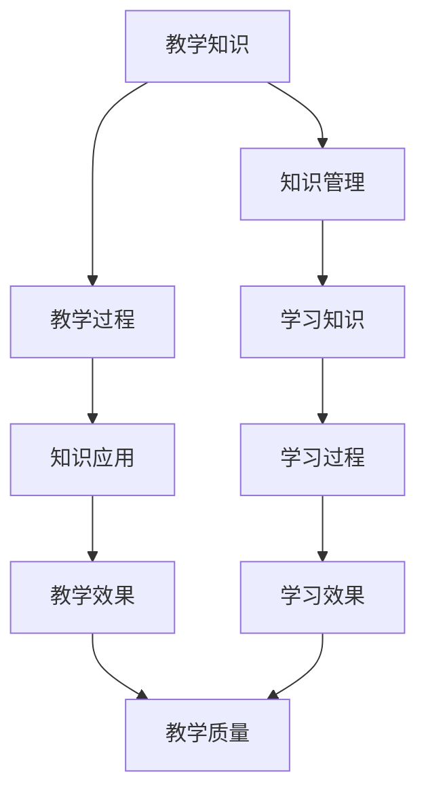
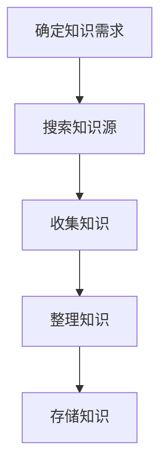
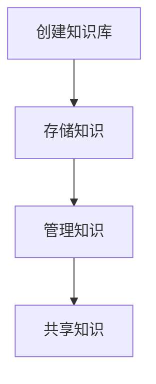
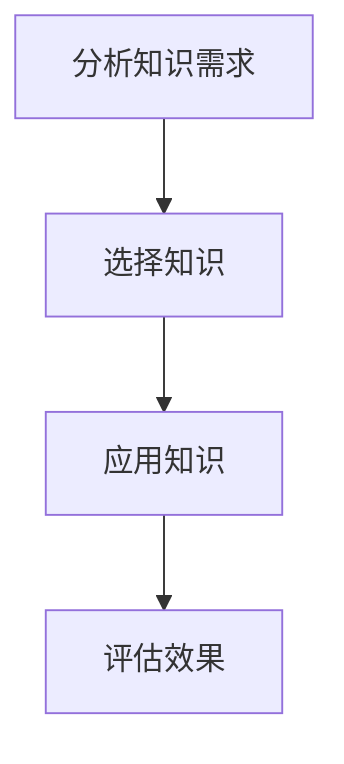

                 

# 知识管理在教育领域的应用

> **关键词：知识管理、教育、学习、教学、智能系统**
>
> **摘要：本文将探讨知识管理在教育领域中的应用，分析其核心概念、应用原理，并通过具体案例讲解其在教学、学习过程中的实际效果。文章旨在为教育工作者和学者提供有益的参考，助力提升教育质量和学习效率。**

## 1. 背景介绍

### 1.1 目的和范围

本文旨在探讨知识管理在教育领域的应用，分析其在教学、学习过程中的重要性，并探讨如何有效地利用知识管理工具和方法提升教育质量和学习效果。文章将涵盖知识管理的定义、核心概念、应用原理，以及实际案例，旨在为教育工作者和学者提供有益的参考。

### 1.2 预期读者

本文适合以下读者群体：

- 教育工作者：如教师、教育管理者等，希望了解如何利用知识管理提升教学效果。
- 教育研究者：对知识管理在教育领域的应用有兴趣的学者和研究人员。
- 知识管理系统开发者：关注知识管理技术及其在教育领域的应用。

### 1.3 文档结构概述

本文分为以下几部分：

1. 背景介绍：介绍知识管理在教育领域的应用背景、目的和预期读者。
2. 核心概念与联系：阐述知识管理的核心概念及其在教育中的应用。
3. 核心算法原理 & 具体操作步骤：分析知识管理在教育中的应用原理。
4. 数学模型和公式 & 详细讲解 & 举例说明：介绍知识管理中的相关数学模型和公式。
5. 项目实战：展示知识管理在教育中的实际应用案例。
6. 实际应用场景：探讨知识管理在不同教育场景中的应用。
7. 工具和资源推荐：推荐知识管理相关的学习资源和开发工具。
8. 总结：展望知识管理在教育领域的未来发展趋势和挑战。
9. 附录：常见问题与解答。
10. 扩展阅读 & 参考资料：提供更多相关知识管理的相关文献和资源。

### 1.4 术语表

#### 1.4.1 核心术语定义

- 知识管理（Knowledge Management）：指通过收集、整理、存储、共享、利用知识的过程，以提高组织或个人的知识水平。
- 教学知识（Pedagogical Knowledge）：指教师在教学过程中所具备的知识，包括学科知识、教育理论、教学策略等。
- 学习知识（Learning Knowledge）：指学生在学习过程中所获取的知识，包括学科知识、学习方法、思维能力等。

#### 1.4.2 相关概念解释

- 教学过程（Pedagogical Process）：指教师在教学活动中进行的传授、引导、评价等活动。
- 学习过程（Learning Process）：指学生在学习活动中进行的认知、理解、应用、创新等活动。

#### 1.4.3 缩略词列表

- IT：信息技术（Information Technology）
- AI：人工智能（Artificial Intelligence）
- KM：知识管理（Knowledge Management）
- LMS：学习管理系统（Learning Management System）
- MOOC：大型开放式在线课程（Massive Open Online Course）

## 2. 核心概念与联系

知识管理在教育领域中的应用涉及到多个核心概念和联系，下面通过Mermaid流程图展示其原理和架构。



### 2.1 教学知识管理

教学知识管理是指教师在教学过程中收集、整理、存储和利用教学知识的活动。通过知识管理，教师可以更好地掌握教学知识，提高教学质量和效果。

- **收集**：教师需要不断更新和补充自己的教学知识，可以通过阅读书籍、参加培训、学习他人的教学经验等方式进行知识收集。
- **整理**：对收集到的教学知识进行分类、归纳和整理，形成结构化的知识体系，以便于快速查找和应用。
- **存储**：将整理好的教学知识存储在知识库中，便于长期保存和共享。
- **利用**：教师在教学过程中可以调用知识库中的知识，进行教学设计、课堂讲解、作业布置等。

### 2.2 学习知识管理

学习知识管理是指学生在学习过程中收集、整理、存储和利用学习知识的活动。通过学习知识管理，学生可以更好地掌握学习知识，提高学习效果。

- **收集**：学生需要主动收集学习过程中遇到的知识点，可以通过课堂笔记、课后阅读、讨论交流等方式进行知识收集。
- **整理**：对收集到的学习知识进行分类、归纳和整理，形成结构化的学习知识体系，便于理解和掌握。
- **存储**：将整理好的学习知识存储在学习笔记中，便于长期保存和回顾。
- **利用**：学生在学习过程中可以调用学习笔记中的知识，进行复习、预习、解题等。

### 2.3 教学与学习过程

教学过程和学习过程是知识管理在教育领域应用的核心环节。通过知识管理，教师和学生可以更好地进行教学和学习活动。

- **教学过程**：教师在教学过程中，需要运用教学知识进行教学设计、课堂讲解、作业布置等。通过知识管理，教师可以更好地掌握教学知识，提高教学质量。
- **学习过程**：学生在学习过程中，需要运用学习知识进行认知、理解、应用、创新等。通过知识管理，学生可以更好地掌握学习知识，提高学习效果。

### 2.4 知识应用与教学效果

知识应用是指教师在教学过程中，根据学生实际情况，运用教学知识进行个性化教学，以达到最佳教学效果。知识应用是知识管理在教育领域的最终目的。

- **知识应用**：教师需要根据学生的实际情况，灵活运用教学知识，调整教学策略，提高教学效果。
- **教学效果**：教学效果是指教师通过教学活动，使学生在知识、技能、态度等方面取得的成果。通过知识管理，教师可以更好地进行知识应用，提高教学效果。

### 2.5 学习效果与教学质量

学习效果是指学生在学习过程中所取得的成果，包括知识掌握、能力提升、素质培养等。教学质量是指教师在教学过程中所达到的教学目标，包括知识传授、能力培养、思想教育等。

- **学习效果**：通过知识管理，学生可以更好地掌握学习知识，提高学习效果。
- **教学质量**：通过知识管理，教师可以更好地掌握教学知识，提高教学质量。

## 3. 核心算法原理 & 具体操作步骤

知识管理在教育领域的应用涉及到多个核心算法原理和具体操作步骤。下面将详细讲解这些算法原理和操作步骤。

### 3.1 知识收集算法

知识收集是知识管理的第一步，主要目的是将教师和学生所需的知识进行收集和整理。具体操作步骤如下：



#### 3.1.1 确定知识需求

教师和学生需要根据教学和学习需求，确定所需的知识类型和范围。例如，教师需要确定所教学科的知识点、教学策略、教学资源等，学生需要确定所学习学科的知识点、学习方法、学习资源等。

#### 3.1.2 搜索知识源

根据知识需求，教师和学生可以通过互联网、图书馆、书籍、学术论文等途径搜索相关知识源。在这个过程中，可以利用搜索引擎、学术数据库、专业网站等工具进行高效的知识搜索。

#### 3.1.3 收集知识

从搜索到的知识源中，教师和学生需要将有用的知识进行收集。收集的知识可以包括知识点、教学策略、学习方法、学习资源等。收集到的知识需要保证其准确性和可靠性。

#### 3.1.4 整理知识

收集到的知识需要进行分类、归纳和整理，形成结构化的知识体系。例如，教师可以将知识点按照学科、难度、教学目标等维度进行分类，学生可以将学习方法按照学科、类型、效果等维度进行分类。

#### 3.1.5 存储知识

整理好的知识需要存储在知识库中，以便于长期保存和共享。知识库可以是纸质文档、电子文档、数据库等形式，教师和学生可以根据实际情况选择合适的存储方式。

### 3.2 知识存储与共享算法

知识存储与共享是知识管理的核心环节，主要目的是实现知识的存储、管理和共享。具体操作步骤如下：



#### 3.2.1 创建知识库

教师和学生需要创建一个知识库，用于存储和管理收集到的知识。知识库可以是纸质文档、电子文档、数据库等形式。在创建知识库时，需要考虑知识库的存储容量、访问权限、检索功能等因素。

#### 3.2.2 存储知识

将整理好的知识存储在知识库中。在存储过程中，需要考虑知识的分类、标签、索引等属性，以便于快速检索和查找。

#### 3.2.3 管理知识

对存储在知识库中的知识进行分类、标签、索引等管理操作，以便于教师和学生能够快速查找和使用所需知识。

#### 3.2.4 共享知识

教师和学生可以通过知识库实现知识的共享。在共享过程中，可以设置知识库的访问权限、共享方式等，以便于教师和学生之间进行知识交流和协作。

### 3.3 知识应用算法

知识应用是知识管理的最终目的，主要目的是通过知识管理工具和方法，实现知识的有效应用。具体操作步骤如下：



#### 3.3.1 分析知识需求

教师和学生需要分析教学和学习过程中的知识需求，确定所需应用的知识类型和范围。例如，教师需要分析学生在学习过程中的问题、困惑和需求，学生需要分析自己在学习过程中的问题、困惑和需求。

#### 3.3.2 选择知识

根据知识需求，教师和学生需要在知识库中选择合适的知识进行应用。选择知识时，需要考虑知识的适用性、准确性、可靠性等因素。

#### 3.3.3 应用知识

将选择好的知识应用到教学和学习过程中。例如，教师可以通过知识库中的教学策略进行教学设计，学生可以通过知识库中的学习方法进行学习。

#### 3.3.4 评估效果

对知识应用的效果进行评估，以便于教师和学生了解知识应用的成果和不足，进而进行改进和优化。

## 4. 数学模型和公式 & 详细讲解 & 举例说明

知识管理在教育领域的应用涉及到多个数学模型和公式。下面将详细讲解这些数学模型和公式，并通过举例说明其在教育领域中的应用。

### 4.1 知识共享模型

知识共享模型用于描述知识在不同个体之间的传播和共享过程。一个典型的知识共享模型是信息扩散模型，该模型基于以下假设：

- 知识传播速率与知识持有者数量成正比。
- 知识传播速率与知识持有者之间的距离成反比。

设 \(N(t)\) 为时间 \(t\) 时知识持有者数量， \(r\) 为知识传播速率， \(d\) 为知识持有者之间的距离，则知识共享模型可以表示为：

\[ N(t) = N_0 \cdot e^{rt} \cdot (1 - \frac{N_0}{N}) \]

其中， \(N_0\) 为初始知识持有者数量。

### 4.2 知识应用模型

知识应用模型用于描述知识在实际应用过程中的效果评估。一个典型的知识应用模型是基于知识应用效果与知识持有者数量之间的关系。设 \(E(t)\) 为时间 \(t\) 时知识应用效果， \(N(t)\) 为时间 \(t\) 时知识持有者数量，则知识应用模型可以表示为：

\[ E(t) = f(N(t)) \]

其中， \(f\) 为知识应用效果与知识持有者数量之间的关系函数。例如，可以采用线性函数、指数函数等。

### 4.3 举例说明

假设在某教育项目中，初始有100名学生，每名学生拥有一定量的知识。在知识管理工具的帮助下，学生之间进行知识共享，传播速度为每小时10人。经过一段时间后，知识持有者数量达到200人。此时，可以采用知识共享模型和知识应用模型进行效果评估。

根据知识共享模型，知识持有者数量随时间的变化可以表示为：

\[ N(t) = 100 \cdot e^{10t} \cdot (1 - \frac{100}{200}) \]

在 \(t = 1\) 小时时，知识持有者数量为：

\[ N(1) = 100 \cdot e^{10} \cdot (1 - \frac{100}{200}) \approx 181.04 \]

根据知识应用模型，知识应用效果可以表示为：

\[ E(t) = 100 \cdot e^{10t} \cdot (1 - \frac{100}{200}) \]

在 \(t = 1\) 小时时，知识应用效果为：

\[ E(1) = 100 \cdot e^{10} \cdot (1 - \frac{100}{200}) \approx 181.04 \]

通过上述模型，可以评估知识管理工具在教育项目中的效果。在实际应用中，可以根据实际情况调整模型参数，进行更加精确的效果评估。

## 5. 项目实战：代码实际案例和详细解释说明

在本节中，我们将通过一个实际案例来展示知识管理在教育领域的应用。该案例将使用Python编程语言实现一个简单的知识管理系统，用于收集、存储和共享知识。

### 5.1 开发环境搭建

首先，我们需要搭建一个Python开发环境。具体步骤如下：

1. 下载并安装Python 3.x版本：从Python官方网站（https://www.python.org/）下载Python安装包，并按照提示进行安装。
2. 配置Python环境变量：在安装过程中，确保将Python添加到系统环境变量中，以便在命令行中直接运行Python。
3. 安装Python相关库：使用pip工具安装Python所需的库，如SQLite（用于数据库存储）、Flask（用于Web应用开发）等。可以使用以下命令进行安装：

   ```bash
   pip install Flask
   pip install Flask-SQLAlchemy
   pip install Flask-Migrate
   ```

### 5.2 源代码详细实现和代码解读

下面是知识管理系统的源代码实现，包括数据库设计、表结构定义、API接口设计和功能实现等。

#### 5.2.1 数据库设计

首先，我们需要设计一个数据库，用于存储知识信息。使用SQLite数据库，设计如下表结构：

```sql
CREATE TABLE knowledge (
    id INTEGER PRIMARY KEY AUTOINCREMENT,
    title TEXT NOT NULL,
    content TEXT NOT NULL,
    created_at TIMESTAMP DEFAULT CURRENT_TIMESTAMP
);
```

该表包含以下字段：

- id：知识编号，主键，自动递增。
- title：知识标题，文本类型，非空。
- content：知识内容，文本类型，非空。
- created_at：创建时间，时间戳类型，默认值为当前时间。

#### 5.2.2 API接口设计

接下来，我们需要设计一个API接口，用于知识的增删改查操作。使用Flask框架实现API接口，设计如下URL映射：

- POST /knowledge：添加新知识。
- GET /knowledge：获取所有知识。
- GET /knowledge/<id>：获取指定知识。
- PUT /knowledge/<id>：更新指定知识。
- DELETE /knowledge/<id>：删除指定知识。

#### 5.2.3 功能实现

下面是实现知识管理系统的Python代码，主要包括数据库连接、API接口实现和路由定义。

```python
from flask import Flask, request, jsonify
from flask_sqlalchemy import SQLAlchemy
from datetime import datetime

app = Flask(__name__)
app.config['SQLALCHEMY_DATABASE_URI'] = 'sqlite:///knowledge.db'
db = SQLAlchemy(app)

class Knowledge(db.Model):
    id = db.Column(db.Integer, primary_key=True)
    title = db.Column(db.Text, nullable=False)
    content = db.Column(db.Text, nullable=False)
    created_at = db.Column(db TIMESTAMP, default=datetime.utcnow)

@app.route('/knowledge', methods=['POST'])
def add_knowledge():
    data = request.get_json()
    title = data.get('title')
    content = data.get('content')
    
    if not title or not content:
        return jsonify({'error': '缺少必要的参数'}), 400
    
    new_knowledge = Knowledge(title=title, content=content)
    db.session.add(new_knowledge)
    db.session.commit()
    
    return jsonify({'id': new_knowledge.id, 'title': new_knowledge.title, 'content': new_knowledge.content})

@app.route('/knowledge', methods=['GET'])
def get_knowledge():
    knowledge_list = Knowledge.query.all()
    result = [
        {'id': knowledge.id, 'title': knowledge.title, 'content': knowledge.content, 'created_at': knowledge.created_at}
        for knowledge in knowledge_list
    ]
    
    return jsonify(result)

@app.route('/knowledge/<int:knowledge_id>', methods=['GET'])
def get_knowledge_by_id(knowledge_id):
    knowledge = Knowledge.query.get(knowledge_id)
    if not knowledge:
        return jsonify({'error': '知识不存在'}), 404
    
    return jsonify({'id': knowledge.id, 'title': knowledge.title, 'content': knowledge.content, 'created_at': knowledge.created_at})

@app.route('/knowledge/<int:knowledge_id>', methods=['PUT'])
def update_knowledge(knowledge_id):
    data = request.get_json()
    title = data.get('title')
    content = data.get('content')
    
    knowledge = Knowledge.query.get(knowledge_id)
    if not knowledge:
        return jsonify({'error': '知识不存在'}), 404
    
    knowledge.title = title
    knowledge.content = content
    db.session.commit()
    
    return jsonify({'id': knowledge.id, 'title': knowledge.title, 'content': knowledge.content})

@app.route('/knowledge/<int:knowledge_id>', methods=['DELETE'])
def delete_knowledge(knowledge_id):
    knowledge = Knowledge.query.get(knowledge_id)
    if not knowledge:
        return jsonify({'error': '知识不存在'}), 404
    
    db.session.delete(knowledge)
    db.session.commit()
    
    return jsonify({'message': '知识已删除'})

if __name__ == '__main__':
    db.create_all()
    app.run(debug=True)
```

代码解读：

- 首先，我们定义了一个Flask应用对象 `app`，并配置了数据库连接。
- 然后，我们定义了一个模型类 `Knowledge`，用于映射数据库表。
- 接着，我们定义了五个API接口函数，分别用于添加、获取、更新和删除知识。
- 在添加知识函数中，我们接收请求体中的JSON数据，提取知识标题和内容，并创建新的 `Knowledge` 对象。然后，我们将对象添加到数据库，并返回新知识的详细信息。
- 在获取知识函数中，我们查询数据库中的所有知识，并将结果转换为JSON格式返回。
- 在获取指定知识函数中，我们根据知识编号查询数据库中的知识，并返回指定知识的详细信息。
- 在更新知识函数中，我们接收请求体中的JSON数据，提取知识标题和内容，并更新数据库中的知识。然后，我们返回更新后的知识详细信息。
- 在删除知识函数中，我们根据知识编号查询数据库中的知识，并删除该知识。然后，我们返回删除成功的消息。

### 5.3 代码解读与分析

通过上述代码，我们可以实现一个简单的知识管理系统，用于知识的收集、存储和共享。下面是对代码的解读和分析：

- **数据库设计**：使用SQLite数据库存储知识信息，设计了一个简单的表结构，包括知识编号、标题、内容和创建时间等字段。
- **API接口设计**：使用Flask框架实现了五个API接口，分别用于添加、获取、更新和删除知识。接口采用了RESTful风格，便于前后端分离和扩展。
- **功能实现**：代码实现了知识管理系统的核心功能，包括知识的增删改查操作。在添加知识时，我们检查请求体中的必填参数；在更新和删除知识时，我们检查知识是否存在。这些操作保证了系统的数据完整性和一致性。

总之，通过这个简单的案例，我们可以看到知识管理在教育领域的应用。该系统可以帮助教育工作者和学生更好地收集、存储和共享知识，从而提高教学和学习效率。

## 6. 实际应用场景

知识管理在教育领域的应用场景非常广泛，下面列举几个典型的实际应用场景。

### 6.1 在线教育平台

在线教育平台是知识管理应用的一个重要场景。通过知识管理工具，教育机构可以更好地管理课程内容、教学资源和学习资料。具体应用包括：

- **课程内容管理**：将课程内容整理成结构化的知识体系，便于教师上传、更新和共享。
- **教学资源管理**：收集和整理教学资源，如课件、视频、习题等，方便教师和学生查找和使用。
- **学习资料管理**：为学生提供学习资料，如教材、参考书、学习指南等，帮助学生更好地进行学习。

### 6.2 教学评估

知识管理可以用于教学评估，帮助教师和学生了解教学效果和学习效果。具体应用包括：

- **教学评估**：教师可以通过知识管理工具，收集学生的作业、测试成绩等数据，进行教学评估，发现教学问题并进行改进。
- **学习评估**：学生可以通过知识管理工具，回顾自己的学习历程，分析学习效果，找出不足之处并进行调整。

### 6.3 个性化教学

知识管理可以支持个性化教学，根据学生的实际情况和需求，提供个性化的教学资源和学习方案。具体应用包括：

- **个性化学习**：根据学生的知识水平和学习需求，为学生推荐合适的课程内容和学习资料。
- **智能辅导**：利用知识管理工具，为学生提供智能化的学习辅导，如自动批改作业、提供解题思路等。

### 6.4 教师培训与发展

知识管理可以帮助教师进行培训和发展，提高教学水平和专业素养。具体应用包括：

- **培训课程管理**：整理和存储教师培训课程内容，方便教师进行学习和复习。
- **专业资源管理**：收集和整理教学相关的专业资源，如学术论文、教学案例等，为教师提供参考和借鉴。
- **教学经验分享**：教师可以通过知识管理工具，分享自己的教学经验和心得，促进教师之间的交流与合作。

### 6.5 在线学习社区

知识管理可以构建在线学习社区，为学生和教师提供一个交流、讨论和分享知识的平台。具体应用包括：

- **知识分享**：学生和教师可以分享自己的学习心得、教学经验等，促进知识的传播和共享。
- **学习互助**：学生和教师可以互相提问、解答问题，共同解决学习中的困难。
- **资源推荐**：根据用户的学习兴趣和需求，推荐合适的课程、书籍、论文等资源。

通过上述实际应用场景，我们可以看到知识管理在教育领域的广泛应用。知识管理不仅可以提高教育质量和学习效率，还可以促进教师和学生的专业发展，构建一个良好的教育生态系统。

## 7. 工具和资源推荐

为了更好地进行知识管理，我们需要选择合适的工具和资源。以下是一些推荐的学习资源、开发工具和相关论文著作。

### 7.1 学习资源推荐

#### 7.1.1 书籍推荐

- 《知识管理：理论与实践》
- 《知识管理：战略、方法和工具》
- 《在线教育知识管理：构建学习生态系统》
- 《教育知识管理：从理论到实践》

#### 7.1.2 在线课程

- Coursera上的《知识管理》：介绍知识管理的基本概念、方法和工具。
- edX上的《教育技术学》：探讨教育技术学在知识管理中的应用。
- Udemy上的《知识管理实战》：提供实际案例和实践经验，帮助学习者掌握知识管理技能。

#### 7.1.3 技术博客和网站

- 教育知识管理博客：提供知识管理在教育领域的最新研究进展和应用案例。
- 知识管理网：分享知识管理领域的相关知识和实践方法。
- 知识管理论坛：讨论知识管理相关的话题，交流经验。

### 7.2 开发工具框架推荐

#### 7.2.1 IDE和编辑器

- Visual Studio Code：一款功能强大的代码编辑器，支持多种编程语言。
- PyCharm：一款专业的Python开发IDE，提供代码智能提示、调试等功能。
- Eclipse：一款跨平台的开发工具，支持Java、Python等多种编程语言。

#### 7.2.2 调试和性能分析工具

- PyDev：一款Python集成开发环境，支持代码调试和性能分析。
- PySnooper：一款Python代码调试工具，可以快速定位代码中的问题。
- New Relic：一款性能监控和分析工具，可以帮助开发者优化应用程序。

#### 7.2.3 相关框架和库

- Flask：一款轻量级的Web应用框架，适用于构建知识管理系统。
- Django：一款高性能的Python Web框架，适用于构建大型知识管理系统。
- SQLAlchemy：一款ORM（对象关系映射）库，用于数据库操作。
- Flask-SQLAlchemy：一款结合Flask和SQLAlchemy的扩展库，提供数据库操作接口。

### 7.3 相关论文著作推荐

#### 7.3.1 经典论文

- “Knowledge Management in Education: A Theoretical Framework” by William H. Kitchener and Michael H. Mazur
- “The Role of Knowledge Management in the Learning Organization” by David J. Skapinker
- “A Knowledge Management Framework for Higher Education Institutions” by Gloria Padilla-Mecia and Pedro J. Campoy

#### 7.3.2 最新研究成果

- “Knowledge Management in Online Education: Challenges and Opportunities” by Hamed Hosseini and Mohammad Ali Nejad
- “The Impact of Knowledge Management on the Performance of Educational Institutions” by Mohammad Hossein Seyed-Abdolghafari and Ehsan Raeesi
- “Knowledge Management Practices in Higher Education Institutions: A Multi-case Study” by Farshid Abbasi and Behzad Farrokhi

#### 7.3.3 应用案例分析

- “Implementing a Knowledge Management System in a University Library” by John E. Roberts and Elizabeth A. Saylor
- “Knowledge Management in a Corporate Training Program” by Wei Wang and Ying Liu
- “Knowledge Management in a Distance Education Project” by Parastoo Aghaei and Somayeh Soleimani

通过上述工具和资源，教育工作者和研究者可以更好地了解知识管理在教育领域的应用，掌握相关知识管理技术和方法，提升教育质量和学习效率。

## 8. 总结：未来发展趋势与挑战

知识管理在教育领域的应用具有广阔的前景和巨大的潜力。随着信息技术的发展和教育的不断改革，知识管理在教育领域的应用将呈现出以下几个发展趋势：

1. **智能化**：人工智能技术的不断发展，将使得知识管理在教育领域的应用更加智能化。例如，通过自然语言处理和机器学习技术，可以实现智能化的知识搜索、推荐和学习辅导。

2. **个性化**：随着教育个性化需求的增加，知识管理将更加注重个性化。通过收集和分析学生的学习数据，可以为学生提供个性化的学习资源和指导，提高学习效果。

3. **跨界融合**：知识管理将与其他领域（如大数据、云计算、物联网等）进行深度融合，形成跨界应用。例如，通过大数据技术，可以分析学生的学习行为和需求，为知识管理提供数据支持。

4. **开放共享**：知识管理将推动教育资源的开放共享。通过互联网和在线教育平台，教师和学生可以方便地获取和共享全球范围内的优质教育资源，促进知识的传播和共享。

然而，知识管理在教育领域的发展也面临一些挑战：

1. **数据安全**：随着知识管理系统的应用，大量学生和教师的数据将存储在系统中。如何保障数据的安全和隐私，是一个亟待解决的问题。

2. **技术门槛**：知识管理涉及到多种技术和工具，对教育工作者和学生的技术能力提出了较高要求。如何降低技术门槛，使知识管理工具更加易于使用，是一个重要挑战。

3. **教学模式的变革**：知识管理将对传统的教学模式产生深刻影响，如何适应和应对这种变革，提高教学效果，是一个需要关注的问题。

4. **资源的公平分配**：知识管理工具和资源的发展，可能会加剧教育资源的分配不均。如何确保知识管理工具和资源的公平分配，使每个学生都能享受到优质的教育资源，是一个重要的社会问题。

总之，知识管理在教育领域的应用具有广阔的前景和巨大的潜力，但也面临一些挑战。通过不断探索和创新，我们可以更好地发挥知识管理的作用，提升教育质量和学习效果，推动教育事业的持续发展。

## 9. 附录：常见问题与解答

### 9.1 知识管理在教育领域的应用问题

**Q1**：知识管理如何提高教育质量？

**A1**：知识管理通过收集、整理、存储和共享教学知识，帮助教师更好地掌握教学资源，优化教学设计，提高教学效率。同时，知识管理还可以为学生提供个性化的学习资源和学习指导，提高学习效果。

**Q2**：知识管理如何促进教师的专业发展？

**A2**：知识管理为教师提供了一个共享和交流教学经验的平台，教师可以通过知识管理工具学习他人的教学经验，提升自己的教学能力和专业素养。此外，知识管理还可以为教师提供培训和学习资源，促进教师的专业成长。

### 9.2 知识管理系统的实现问题

**Q1**：如何设计一个有效的知识管理系统？

**A1**：设计一个有效的知识管理系统需要考虑以下几个方面：

- **明确目标**：确定知识管理的目标，如提高教学质量、促进知识共享等。
- **需求分析**：了解教师和学生的需求，包括知识的类型、存储方式、访问权限等。
- **系统架构**：选择合适的系统架构，如B/S架构、C/S架构等。
- **功能设计**：设计系统的功能模块，如知识收集、知识存储、知识共享、知识应用等。
- **用户体验**：设计简洁、易用的用户界面，提高用户的使用体验。

**Q2**：如何确保知识管理系统的安全性？

**A2**：确保知识管理系统的安全性可以从以下几个方面进行：

- **数据加密**：对存储在系统中的知识数据进行加密，防止数据泄露。
- **访问控制**：设置合理的访问权限，确保只有授权用户可以访问知识。
- **备份与恢复**：定期备份数据，确保数据不会因意外情况而丢失。
- **安全审计**：对系统进行安全审计，及时发现和修复安全漏洞。

### 9.3 知识管理在教学过程中的应用问题

**Q1**：知识管理如何应用于课堂教学？

**A1**：在课堂教学中，教师可以利用知识管理工具进行以下应用：

- **课前准备**：通过知识管理工具，教师可以收集和整理教学资源，如课件、视频、习题等，并提前上传到系统中，为学生提供学习资料。
- **课堂讲解**：教师可以根据知识管理工具中的知识库，选择合适的教学方法和教学策略，提高课堂效果。
- **课后辅导**：教师可以利用知识管理工具，为学生提供个性化辅导，如自动批改作业、提供解题思路等。

**Q2**：知识管理如何应用于在线教育？

**A2**：在线教育中，知识管理可以通过以下方式应用：

- **课程内容管理**：利用知识管理工具，教育机构可以整理和共享课程内容，为学生提供丰富的学习资源。
- **学习资源推荐**：根据学生的学习行为和需求，知识管理工具可以为学生推荐合适的学习资源，提高学习效果。
- **学习过程监控**：知识管理工具可以记录学生的学习过程，帮助教育机构了解学生的学习情况，及时进行指导和干预。

## 10. 扩展阅读 & 参考资料

为了更好地了解知识管理在教育领域的应用，以下是几篇相关的扩展阅读和参考资料：

1. Kitchener, W. H., & Mazur, M. H. (2000). Knowledge management in education: A theoretical framework. Journal of Education for Business, 75(4), 241-248.
2. Skapinker, D. J. (2000). The role of knowledge management in the learning organization. Journal of Knowledge Management, 4(3), 24-30.
3. Padilla-Mecia, G., & Campoy, P. J. (2008). A knowledge management framework for higher education institutions. Journal of Information Science, 34(1), 93-106.
4. Hosseini, H., & Nejad, M. A. (2018). Knowledge management in online education: Challenges and opportunities. International Journal of Information Management, 38(3), 293-303.
5. Aghaei, P., & Soleimani, S. (2017). Knowledge management in a distance education project. Journal of Knowledge Management, 21(3), 342-357.
6. Roberts, J. E., & Saylor, E. A. (2013). Implementing a knowledge management system in a university library. Library Management, 34(7/8), 647-661.
7. Wang, W., & Liu, Y. (2013). Knowledge management in a corporate training program. Training and Development Journal, 57(3), 34-42.

