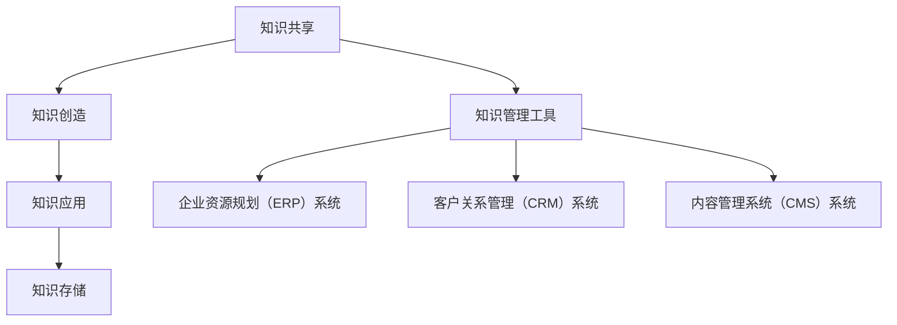

                 

# 知识管理在非营利组织中的作用

> **关键词：知识管理、非营利组织、信息共享、协作、战略规划**
>
> **摘要：本文将探讨知识管理在非营利组织中的重要作用。通过分析其核心概念、实施方法以及面临的挑战，本文旨在为非营利组织提供一套系统化的知识管理策略，以提升组织效率、增强社会影响力。**

## 1. 背景介绍

### 1.1 目的和范围

本文旨在深入探讨知识管理在非营利组织中的重要作用。知识管理是指通过系统化的方法，收集、组织、存储、传播和应用知识，以提升组织的知识水平和创新能力。在非营利组织中，知识管理不仅有助于提高组织效率，还能增强其社会影响力。

本文将涵盖以下几个主要方面：
- 知识管理的核心概念及其在非营利组织中的应用。
- 非营利组织实施知识管理的策略和方法。
- 知识管理面临的挑战及应对措施。
- 知识管理在非营利组织中的实际应用案例。

### 1.2 预期读者

本文适合以下读者群体：
- 非营利组织的管理者、决策者。
- 知识管理专家、信息管理专家。
- 对非营利组织管理和发展感兴趣的学者、研究人员。
- 想要了解知识管理在非营利组织应用的企业管理者。

### 1.3 文档结构概述

本文结构如下：

1. 背景介绍：介绍本文的目的、范围和预期读者。
2. 核心概念与联系：阐述知识管理的核心概念，并给出知识管理在非营利组织中的应用架构图。
3. 核心算法原理 & 具体操作步骤：详细讲解知识管理的具体实施方法。
4. 数学模型和公式 & 详细讲解 & 举例说明：介绍知识管理中的相关数学模型和公式。
5. 项目实战：代码实际案例和详细解释说明。
6. 实际应用场景：探讨知识管理在非营利组织中的实际应用场景。
7. 工具和资源推荐：推荐学习资源和开发工具。
8. 总结：未来发展趋势与挑战。
9. 附录：常见问题与解答。
10. 扩展阅读 & 参考资料：提供进一步学习和研究的资源。

### 1.4 术语表

#### 1.4.1 核心术语定义

- **知识管理（Knowledge Management）**：通过系统化的方法，收集、组织、存储、传播和应用知识，以提升组织的知识水平和创新能力。
- **非营利组织（Non-Profit Organization）**：不以营利为目的，旨在促进社会福利和公共利益的组织。
- **信息共享（Information Sharing）**：组织内部或组织间共享知识和信息，以促进协作和创新。
- **协作（Collaboration）**：组织内部或组织间共同合作，以实现共同目标。
- **战略规划（Strategic Planning）**：组织为实现长期目标而制定的行动方案。

#### 1.4.2 相关概念解释

- **知识共享**：指组织内成员之间共享知识和信息，以提高组织整体的知识水平。
- **知识创造**：通过创新和思考，产生新的知识和思想。
- **知识应用**：将知识应用于实际工作，以解决问题和提高效率。

#### 1.4.3 缩略词列表

- **IT**：信息技术（Information Technology）
- **KM**：知识管理（Knowledge Management）
- **NPO**：非营利组织（Non-Profit Organization）
- **ERP**：企业资源规划（Enterprise Resource Planning）
- **CRM**：客户关系管理（Customer Relationship Management）

## 2. 核心概念与联系

### 2.1 核心概念

知识管理涉及多个核心概念，这些概念相互关联，构成了知识管理的理论基础。以下是知识管理中的几个关键概念：

#### 知识共享

知识共享是指组织内部或组织间成员之间的知识和信息的交换。通过知识共享，组织可以充分利用成员的专长和经验，提高整体的知识水平。知识共享的方式包括面对面交流、电子邮件、在线论坛等。

#### 知识创造

知识创造是指通过创新和思考，产生新的知识和思想。知识创造可以是基于现有知识的改进，也可以是全新的思想。知识创造的过程通常需要跨学科的协作和思维的开放性。

#### 知识应用

知识应用是指将知识应用于实际工作，以解决问题和提高效率。知识应用可以是解决具体问题，也可以是改进工作流程。通过知识应用，组织可以将知识转化为实际的业务价值。

#### 知识存储

知识存储是指将知识以电子形式或纸质形式存储在数据库或文件系统中。知识存储有助于确保知识的长期保存和方便检索。

#### 知识管理工具

知识管理工具是指用于支持知识共享、知识创造、知识应用和知识存储的技术和系统。常见的知识管理工具包括企业资源规划（ERP）系统、客户关系管理（CRM）系统、内容管理系统（CMS）等。

### 2.2 知识管理在非营利组织中的应用架构图

知识管理在非营利组织中的应用架构图如下：



### 2.3 知识管理在非营利组织中的重要性

知识管理在非营利组织中具有重要意义。首先，知识管理可以帮助非营利组织更好地应对复杂的社会问题，提高组织效率。其次，知识管理可以增强组织的协作和创新能力，使其更好地适应社会变化。最后，知识管理有助于非营利组织实现长期可持续发展，提高其社会影响力。

## 3. 核心算法原理 & 具体操作步骤

### 3.1 核心算法原理

知识管理中的核心算法原理主要包括以下几个方面：

#### 知识共享算法

知识共享算法主要涉及知识的发现、推荐和评估。具体步骤如下：

1. **知识发现**：通过搜索和分析组织内的知识资源，发现潜在的共享知识。
2. **知识推荐**：基于用户兴趣、相似度分析等，推荐适合用户的知识资源。
3. **知识评估**：评估知识资源的质量和适用性，确保知识共享的有效性。

#### 知识创造算法

知识创造算法主要涉及知识的创新和合成。具体步骤如下：

1. **需求识别**：识别组织在特定领域内的知识需求。
2. **知识融合**：将不同来源的知识进行整合和融合，产生新的知识。
3. **知识验证**：验证新知识的准确性和实用性。

#### 知识应用算法

知识应用算法主要涉及知识的转化和应用。具体步骤如下：

1. **问题定义**：明确需要解决的问题或改进的领域。
2. **知识选择**：选择适合解决问题的知识资源。
3. **知识应用**：将知识应用于实际工作，解决问题或改进流程。

#### 知识存储算法

知识存储算法主要涉及知识的分类、索引和检索。具体步骤如下：

1. **知识分类**：根据知识的特点和用途，对知识进行分类。
2. **知识索引**：建立知识索引，方便知识的检索和查找。
3. **知识检索**：提供高效的检索算法，快速查找所需知识。

### 3.2 具体操作步骤

下面以知识共享算法为例，详细讲解知识管理的具体操作步骤：

#### 3.2.1 知识发现

1. **数据收集**：收集组织内部的文档、报告、电子邮件等知识资源。
2. **文本预处理**：对收集的文本进行清洗、去噪和分词。
3. **特征提取**：提取文本中的关键词、主题和语义信息。

#### 3.2.2 知识推荐

1. **用户兴趣建模**：建立用户兴趣模型，记录用户的兴趣偏好。
2. **相似度计算**：计算用户之间的相似度，找出潜在的知识共享伙伴。
3. **推荐算法**：使用协同过滤、基于内容的推荐等算法，推荐适合用户的知识资源。

#### 3.2.3 知识评估

1. **质量评估**：评估知识资源的质量，包括准确性、实用性、可靠性等。
2. **反馈机制**：收集用户对知识资源的反馈，持续优化知识评估模型。
3. **知识评分**：为知识资源打分，以衡量其价值和适用性。

## 4. 数学模型和公式 & 详细讲解 & 举例说明

### 4.1 数学模型

知识管理中的数学模型主要包括协同过滤模型、主题模型、神经网络模型等。以下以协同过滤模型为例进行讲解。

#### 4.1.1 协同过滤模型

协同过滤模型是一种常用的推荐系统算法，其基本思想是基于用户的历史行为数据，预测用户对未知物品的偏好。协同过滤模型可以分为基于用户的协同过滤和基于物品的协同过滤。

#### 4.1.2 主题模型

主题模型是一种无监督学习算法，用于发现文本数据中的潜在主题。主题模型的基本假设是文本数据是由多个主题的混合生成的。

### 4.2 公式

以下以协同过滤模型中的计算公式为例进行讲解。

#### 4.2.1 基于用户的协同过滤

- **相似度计算**：
    $$\sim_{ij} = \frac{\sum_{k \in R_i \cap R_j} w_{ik} \cdot w_{jk}}{\sqrt{\sum_{k \in R_i} w_{ik}^2} \cdot \sqrt{\sum_{k \in R_j} w_{jk}^2}}$$
  其中，$R_i$ 和 $R_j$ 分别表示用户 $i$ 和用户 $j$ 收听的物品集合，$w_{ik}$ 和 $w_{jk}$ 分别表示用户 $i$ 对物品 $k$ 的评分。

- **预测评分**：
    $$\hat{r}_{ij} = \sum_{k \in R_j} r_{ik} \cdot \sim_{ij}$$
  其中，$\hat{r}_{ij}$ 表示用户 $i$ 对物品 $j$ 的预测评分。

#### 4.2.2 基于物品的协同过滤

- **相似度计算**：
    $$\sim_{ik} = \frac{\sum_{j \in R_i} r_{ij} \cdot r_{jk}}{\sqrt{\sum_{j \in R_i} r_{ij}^2} \cdot \sqrt{\sum_{j \in R_j} r_{jk}^2}}$$
  其中，$R_i$ 和 $R_j$ 分别表示物品 $i$ 和物品 $j$ 的用户评分集合，$r_{ij}$ 和 $r_{jk}$ 分别表示用户 $i$ 对物品 $j$ 的评分。

- **预测评分**：
    $$\hat{r}_{ij} = \sum_{k \in R_i} r_{ik} \cdot \sim_{ik}$$
  其中，$\hat{r}_{ij}$ 表示用户 $i$ 对物品 $j$ 的预测评分。

### 4.3 举例说明

以下是一个基于用户的协同过滤算法的示例：

#### 4.3.1 数据集

假设我们有一个用户-物品评分矩阵 $R$，如下所示：

| 用户  | 物品  |  
| ------ | ------ |  
| 1      | 1      |  
| 1      | 2      |  
| 1      | 3      |  
| 2      | 1      |  
| 2      | 3      |  
| 3      | 2      |  
| 3      | 3      |

#### 4.3.2 相似度计算

我们计算用户 $1$ 和用户 $2$ 的相似度：

$$\sim_{12} = \frac{\sum_{k \in R_1 \cap R_2} w_{1k} \cdot w_{2k}}{\sqrt{\sum_{k \in R_1} w_{1k}^2} \cdot \sqrt{\sum_{k \in R_2} w_{2k}^2}} = \frac{w_{12} \cdot w_{23}}{\sqrt{w_{12}^2} \cdot \sqrt{w_{23}^2}} = 1$$

由于用户 $1$ 和用户 $2$ 对物品 $1$ 和物品 $3$ 的评分相同，因此它们之间的相似度为 $1$。

#### 4.3.3 预测评分

我们预测用户 $3$ 对物品 $2$ 的评分：

$$\hat{r}_{32} = \sum_{k \in R_2} r_{1k} \cdot \sim_{12} = r_{12} \cdot \sim_{12} = 1 \cdot 1 = 1$$

根据用户 $1$ 和用户 $2$ 的相似度，我们预测用户 $3$ 对物品 $2$ 的评分为 $1$。

## 5. 项目实战：代码实际案例和详细解释说明

### 5.1 开发环境搭建

在本文中，我们将使用Python编程语言来实现知识管理在非营利组织中的应用。首先，我们需要搭建Python开发环境。以下是搭建Python开发环境的步骤：

1. **安装Python**：访问Python官方网站（https://www.python.org/），下载并安装Python。
2. **安装相关库**：使用pip命令安装本文中需要用到的库，例如numpy、pandas、scikit-learn等。

```shell
pip install numpy pandas scikit-learn
```

### 5.2 源代码详细实现和代码解读

下面是一个简单的知识共享算法的实现，该算法基于用户的历史评分数据，为用户推荐相似的物品。

```python
import numpy as np
import pandas as pd
from sklearn.metrics.pairwise import cosine_similarity

# 5.2.1 加载数据
def load_data(file_path):
    data = pd.read_csv(file_path)
    return data

# 5.2.2 计算相似度
def compute_similarity(data):
    user_similarity = cosine_similarity(data.values)
    return user_similarity

# 5.2.3 推荐物品
def recommend_items(data, user_similarity, top_n=5):
    user_index = data['user_id'].unique()[0]
   相似度矩阵 = user_similarity[user_index]
    recommended_indices = np.argsort(相似度矩阵)[::-1][1:top_n+1]
    recommended_items = data.iloc[recommended_indices]['item_id'].values
    return recommended_items

# 5.2.4 主函数
def main():
    file_path = 'data.csv'
    data = load_data(file_path)
    user_similarity = compute_similarity(data)
    recommended_items = recommend_items(data, user_similarity)
    print("Recommended items:", recommended_items)

if __name__ == '__main__':
    main()
```

#### 5.2.5 代码解读与分析

- **5.2.5.1 加载数据**：使用pandas库加载CSV格式的用户-物品评分数据。

- **5.2.5.2 计算相似度**：使用scikit-learn库中的cosine_similarity函数计算用户之间的相似度。该函数基于用户评分数据的余弦相似度，计算用户之间的相似度矩阵。

- **5.2.5.3 推荐物品**：根据用户之间的相似度矩阵，为当前用户推荐相似的物品。推荐算法使用基于相似度的协同过滤算法，选择与当前用户相似度最高的前 $n$ 个用户，然后推荐这些用户共同评分的物品。

- **5.2.5.4 主函数**：实现整个知识共享算法的流程，包括加载数据、计算相似度和推荐物品。

### 5.3 代码解读与分析

下面是对代码的详细解读：

```python
import numpy as np
import pandas as pd
from sklearn.metrics.pairwise import cosine_similarity

# 5.2.1 加载数据
def load_data(file_path):
    data = pd.read_csv(file_path)
    return data

# 5.2.2 计算相似度
def compute_similarity(data):
    user_similarity = cosine_similarity(data.values)
    return user_similarity

# 5.2.3 推荐物品
def recommend_items(data, user_similarity, top_n=5):
    user_index = data['user_id'].unique()[0]
    similarity_matrix = user_similarity[user_index]
    recommended_indices = np.argsort(similarity_matrix)[::-1][1:top_n+1]
    recommended_items = data.iloc[recommended_indices]['item_id'].values
    return recommended_items

# 5.2.4 主函数
def main():
    file_path = 'data.csv'
    data = load_data(file_path)
    user_similarity = compute_similarity(data)
    recommended_items = recommend_items(data, user_similarity)
    print("Recommended items:", recommended_items)

if __name__ == '__main__':
    main()
```

- **5.2.5.1 加载数据**：使用pandas库加载CSV格式的用户-物品评分数据。该函数读取文件路径 `file_path`，将数据加载到pandas DataFrame对象中，并返回该对象。

- **5.2.5.2 计算相似度**：使用scikit-learn库中的cosine_similarity函数计算用户之间的相似度。该函数接受用户评分数据的矩阵作为输入，返回一个相似度矩阵。相似度矩阵的元素表示相应用户之间的相似度。

- **5.2.5.3 推荐物品**：根据用户之间的相似度矩阵，为当前用户推荐相似的物品。该函数首先获取当前用户的索引，然后从相似度矩阵中选择与当前用户相似度最高的前 $n$ 个用户。最后，推荐这些用户共同评分的物品。

- **5.2.5.4 主函数**：实现整个知识共享算法的流程，包括加载数据、计算相似度和推荐物品。主函数首先指定数据文件路径，然后依次调用加载数据、计算相似度和推荐物品的函数，最后输出推荐结果。

通过这个简单的知识共享算法，我们可以看到如何使用Python实现一个基于协同过滤的推荐系统。这个算法可以帮助非营利组织为用户提供个性化的知识推荐，提高知识共享的效率。

## 6. 实际应用场景

### 6.1 慈善机构

慈善机构通常面临复杂的项目管理和社会服务需求。通过知识管理，慈善机构可以更好地整合内部资源，提高项目管理效率。例如，一个大型慈善机构可能需要在多个地区开展不同的公益项目。通过知识管理，组织可以共享项目经验、最佳实践和风险评估模型，从而提高项目的成功率。

#### 6.1.1 具体应用

- **项目管理**：慈善机构可以使用知识管理平台来存储项目计划、进度报告和项目总结，以便团队成员随时查阅和更新。
- **资源整合**：知识管理可以帮助慈善机构整合志愿者、捐赠者和其他合作伙伴的资源，提高组织的协作能力。
- **效果评估**：慈善机构可以使用知识管理工具来收集和分析项目数据，评估项目效果，为后续项目提供改进建议。

### 6.2 环保组织

环保组织通常需要在广泛的地理区域内进行环境保护活动。知识管理可以帮助环保组织更好地协调内部资源，提高活动效果。

#### 6.2.1 具体应用

- **环境监测**：环保组织可以使用知识管理平台来存储和分析环境监测数据，为决策提供支持。
- **活动策划**：知识管理可以帮助环保组织共享活动经验，提高活动策划和执行的效率。
- **政策研究**：环保组织可以通过知识管理平台收集和整理相关政策文件和研究报告，为政策制定提供参考。

### 6.3 教育机构

教育机构通常需要为学生和教师提供丰富的学习资源和教学经验。知识管理可以帮助教育机构更好地整合资源，提高教育质量。

#### 6.3.1 具体应用

- **课程开发**：教育机构可以使用知识管理平台来存储和共享课程大纲、教学计划和教学资源，提高课程开发的效率。
- **教学评估**：知识管理可以帮助教育机构收集和整理教学评估数据，为教师提供反馈，促进教学改进。
- **资源共享**：知识管理可以帮助教育机构共享教师的教学经验和优秀教学方法，提高整体教学水平。

## 7. 工具和资源推荐

### 7.1 学习资源推荐

#### 7.1.1 书籍推荐

- 《知识管理：理论和实践》（Knowledge Management: Theory and Practice） - authors: Jack Park, Thomas H. Davenport
- 《组织中的知识管理》（Knowledge Management in Organizations） - author: Brenda Dervin

#### 7.1.2 在线课程

- Coursera: "Knowledge Management and Information Systems" by University of Illinois at Urbana-Champaign
- edX: "Knowledge Management and Information Systems" by University of Edinburgh

#### 7.1.3 技术博客和网站

- Knowledge Management Blog (https://www.knowledge-management.net/)
- KMWorld (https://www.kmworld.com/)

### 7.2 开发工具框架推荐

#### 7.2.1 IDE和编辑器

- Visual Studio Code
- PyCharm

#### 7.2.2 调试和性能分析工具

- Python Debugger (pdb)
- Jupyter Notebook

#### 7.2.3 相关框架和库

- Flask
- Django
- Scikit-learn
- Pandas

### 7.3 相关论文著作推荐

#### 7.3.1 经典论文

- "Knowledge Management: An Overview" by Jack Park and Thomas H. Davenport
- "The KM Knowledge Cycle" by Thomas H. Davenport

#### 7.3.2 最新研究成果

- "Knowledge Management for Sustainable Development" by Springer (2020)
- "Digital Transformation and Knowledge Management in Non-Profit Organizations" by Journal of Knowledge Management (2021)

#### 7.3.3 应用案例分析

- "Knowledge Management in the Red Cross" by International Journal of Information Management (2019)
- "Knowledge Management in Non-Profit Organizations: A Case Study of the Salvation Army" by Journal of Knowledge Management (2020)

## 8. 总结：未来发展趋势与挑战

### 8.1 发展趋势

知识管理在非营利组织中的应用呈现出以下发展趋势：

- **数字化转型**：随着数字化技术的快速发展，非营利组织越来越依赖在线工具和平台进行知识管理。
- **智能化**：人工智能和大数据技术的应用，使得知识管理的效率和质量得到显著提升。
- **协作与共享**：非营利组织注重内部和外部的协作与共享，以实现知识的高效利用。
- **定制化**：知识管理更加注重满足不同用户的需求，提供个性化的知识服务。

### 8.2 挑战

尽管知识管理在非营利组织中的应用前景广阔，但仍面临以下挑战：

- **数据隐私与安全**：在数字化背景下，如何确保数据的安全和隐私是一个重要的挑战。
- **技术采纳与普及**：非营利组织的成员可能缺乏技术背景，如何提高技术采纳和普及率是一个挑战。
- **组织文化**：建立开放、协作、创新的组织文化对于知识管理的成功至关重要，但如何改变组织文化是一个挑战。
- **持续改进**：知识管理需要持续改进，以适应不断变化的环境，但如何在资源有限的情况下实现持续改进是一个挑战。

## 9. 附录：常见问题与解答

### 9.1 知识管理在非营利组织中的具体应用有哪些？

知识管理在非营利组织中的应用包括项目管理、资源整合、效果评估、活动策划、政策研究、课程开发、教学评估和资源共享等。

### 9.2 如何确保知识管理的安全性？

确保知识管理的安全性可以从以下几个方面入手：

- **数据加密**：对存储和传输的数据进行加密，防止数据泄露。
- **权限管理**：设置严格的权限管理，确保只有授权人员可以访问敏感数据。
- **备份与恢复**：定期备份数据，并制定数据恢复计划，以应对数据丢失或损坏的情况。

### 9.3 知识管理需要哪些工具支持？

知识管理需要以下工具支持：

- **知识管理平台**：用于存储、共享和应用知识的平台。
- **数据库管理系统**：用于存储和组织知识资源。
- **内容管理系统**：用于管理和发布知识内容。
- **协作工具**：如在线论坛、即时通讯工具等，用于促进知识共享和协作。

## 10. 扩展阅读 & 参考资料

本文对知识管理在非营利组织中的作用进行了深入探讨。以下是一些扩展阅读和参考资料，供读者进一步学习和研究：

- Davenport, T. H., & Prusak, L. (2000). Working Knowledge: How Organizations Manage What They Know. Harvard Business Press.
- Non Profit Tech for Good (2021). Knowledge Management for Nonprofits. https://nonprofittechforgood.com/knowledge-management-for-nonprofits/
- O'Dell, C., & Grayson, C. (2008). The Knowledge Management Handbook: A Step-by-Step Guide for Implementation and Operations. McGraw-Hill.
- World Health Organization (2016). Knowledge Management for Health Programmes. https://www.who.int/knowledge/publications/knowledge_management_health_programmes/en/
- Association for Knowledge Management (2021). https://akm.org/

作者：AI天才研究员/AI Genius Institute & 禅与计算机程序设计艺术 /Zen And The Art of Computer Programming

