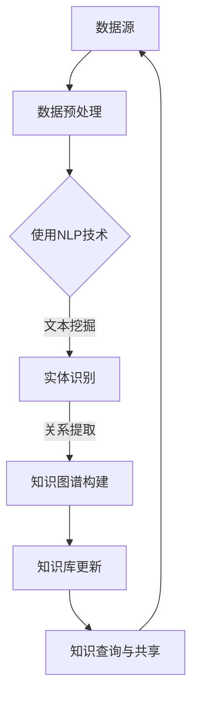

                 

# 知识管理的AI化挑战：知识获取和知识更新

> 关键词：知识管理、AI化、知识获取、知识更新、智能算法、数据挖掘、机器学习、深度学习

> 摘要：随着人工智能技术的迅猛发展，知识管理的AI化已成为企业创新和竞争力提升的重要途径。本文从知识获取和知识更新的角度，探讨AI化在知识管理中的应用挑战，解析核心概念、算法原理、数学模型及实际应用场景，并提出相应的解决策略和工具推荐，旨在为从事知识管理的专业人士提供有价值的参考。

## 1. 背景介绍

### 1.1 目的和范围

本文旨在深入探讨知识管理的AI化挑战，特别是知识获取和知识更新两个方面。随着信息技术和人工智能的融合，知识管理正经历着一场革命性的变革。传统的知识管理方式往往依赖于人工处理和经验积累，效率低下且容易出现错误。而AI化知识管理通过自动化、智能化手段，大幅提升了知识获取和更新的效率，为企业的创新和发展提供了强有力的支持。

本文将重点讨论以下内容：

- 知识管理的AI化背景和现状
- 知识获取和知识更新的核心概念及其在AI化中的应用
- 知识获取和知识更新的算法原理与数学模型
- 实际应用场景中的案例分析和工具推荐
- 未来发展趋势与面临的挑战

通过本文的讨论，旨在帮助读者了解AI化知识管理的基本原理和实践方法，为其在相关领域的应用提供指导和参考。

### 1.2 预期读者

本文的预期读者主要包括以下几类：

- 企业知识管理从业者：希望了解AI化知识管理的最新发展趋势和应用方法，提升企业知识管理水平。
- 人工智能和数据分析专业技术人员：希望深入了解知识获取和知识更新的算法原理和实践，为相关应用提供技术支持。
- 学术研究人员：关注知识管理领域的研究动态，特别是AI化知识管理方面的研究。
- 对知识管理感兴趣的读者：希望从不同角度了解知识管理的现状和未来发展趋势。

无论读者属于哪一类，本文都旨在提供深入、实用的内容，帮助其更好地理解和应用AI化知识管理技术。

### 1.3 文档结构概述

本文分为以下几个主要部分：

1. **背景介绍**：介绍知识管理的AI化背景、目的、预期读者及文档结构。
2. **核心概念与联系**：讨论知识获取和知识更新的核心概念及其在AI化中的应用。
3. **核心算法原理 & 具体操作步骤**：详细讲解知识获取和知识更新的算法原理与操作步骤。
4. **数学模型和公式 & 详细讲解 & 举例说明**：分析知识获取和知识更新的数学模型，并进行举例说明。
5. **项目实战：代码实际案例和详细解释说明**：通过实际项目案例展示知识获取和知识更新的应用。
6. **实际应用场景**：探讨知识获取和知识更新的实际应用场景。
7. **工具和资源推荐**：推荐学习资源、开发工具和框架，以及相关论文著作。
8. **总结：未来发展趋势与挑战**：总结知识管理的AI化挑战及未来发展趋势。
9. **附录：常见问题与解答**：回答读者可能遇到的常见问题。
10. **扩展阅读 & 参考资料**：提供进一步的阅读资源和参考资料。

通过以上结构，本文将为读者提供一个全面、系统的知识管理AI化探讨。

### 1.4 术语表

#### 1.4.1 核心术语定义

- **知识管理**：指通过系统的方法和工具，对知识进行获取、组织、存储、共享和更新，以最大化知识价值的过程。
- **知识获取**：指从各种来源获取有用知识的过程，包括内部数据和外部数据。
- **知识更新**：指在知识管理过程中，对现有知识进行更新和维护，以保持知识的准确性和时效性。
- **AI化知识管理**：指将人工智能技术应用于知识管理，通过自动化和智能化手段提升知识管理效率。

#### 1.4.2 相关概念解释

- **数据挖掘**：指从大量数据中提取隐藏的、有价值的模式和知识的过程。
- **机器学习**：指利用数据构建模型，使计算机能够自动进行预测和决策的过程。
- **深度学习**：指通过多层神经网络模型对数据进行学习和处理的高级机器学习技术。
- **自然语言处理（NLP）**：指使计算机能够理解、生成和响应自然语言的技术。

#### 1.4.3 缩略词列表

- **AI**：人工智能（Artificial Intelligence）
- **NLP**：自然语言处理（Natural Language Processing）
- **ML**：机器学习（Machine Learning）
- **DL**：深度学习（Deep Learning）
- **KM**：知识管理（Knowledge Management）

## 2. 核心概念与联系

在探讨知识管理的AI化挑战之前，我们需要明确几个核心概念及其相互关系。以下是一个简化的Mermaid流程图，展示了知识获取和知识更新在AI化知识管理中的基本流程和关键节点。



### 2.1 数据源

数据源是知识获取的起点。在AI化知识管理中，数据源可以包括内部数据（如企业内部文档、数据库、用户反馈等）和外部数据（如互联网资源、公开数据集、社交媒体等）。数据源的多样性和复杂性对知识获取的效率和质量具有重要影响。

### 2.2 数据预处理

数据预处理是数据进入AI算法之前的必要步骤，包括数据清洗、数据转换和数据归一化等。高质量的数据预处理能够提高后续算法的性能和结果的准确性。常用的预处理方法有：

- **数据清洗**：去除重复数据、处理缺失值、纠正错误数据等。
- **数据转换**：将数据转换为适合算法处理的格式，如将文本数据转换为词向量。
- **数据归一化**：将不同量纲的数据转换为相同的量纲，以消除数据间的量纲差异。

### 2.3 自然语言处理（NLP）

NLP技术在知识获取中起着至关重要的作用。通过NLP技术，系统能够从非结构化文本数据中提取结构化信息，包括文本分类、实体识别、关系提取等。常用的NLP技术有：

- **文本分类**：将文本数据分类到预定义的类别中，如新闻分类、情感分析等。
- **实体识别**：识别文本中的关键实体，如人名、地名、组织名等。
- **关系提取**：从文本中提取实体间的关系，如“张三工作于阿里巴巴”中的“工作于”关系。

### 2.4 知识图谱构建

知识图谱是一种结构化知识表示方法，通过将实体及其关系以图形方式表示，可以直观地展示知识的复杂性和层次性。知识图谱构建主要包括以下步骤：

- **实体抽取**：从文本数据中提取关键实体。
- **关系抽取**：从文本数据中提取实体间的关系。
- **实体关系映射**：将实体和关系映射到知识图谱中，形成完整的知识结构。

### 2.5 知识库更新

知识库更新是知识管理的重要组成部分，确保知识的准确性和时效性。知识库更新可以通过以下方法实现：

- **自动更新**：利用算法和规则自动检测和更新知识库。
- **手动更新**：由知识管理专家或用户手动更新知识库。

### 2.6 知识查询与共享

知识查询与共享是知识管理的最终目标，通过提供高效的知识查询和共享机制，实现知识的最大化利用。常用的方法有：

- **智能搜索**：利用NLP和机器学习技术，提供智能化的知识搜索服务。
- **知识共享平台**：构建面向特定领域的知识共享平台，促进知识的传播和利用。

通过上述流程和技术的结合，AI化知识管理能够大幅提升知识获取和更新的效率，为企业的创新和发展提供强有力的支持。

## 3. 核心算法原理 & 具体操作步骤

在AI化知识管理中，核心算法原理是实现知识获取和知识更新的关键。以下将详细讲解知识获取和知识更新的算法原理，并使用伪代码进行具体操作步骤的阐述。

### 3.1 知识获取算法原理

知识获取主要依赖于数据挖掘和机器学习技术，以下是一个典型的知识获取算法原理：

#### 3.1.1 数据预处理

```python
def data_preprocessing(data):
    # 清洗数据：去除重复和错误数据
    cleaned_data = remove_duplicates(data)
    cleaned_data = correct_errors(cleaned_data)
    
    # 转换数据：将文本数据转换为向量表示
    vectorized_data = convert_to_vectors(cleaned_data)
    
    return vectorized_data
```

#### 3.1.2 特征提取

```python
def feature_extraction(vectorized_data):
    # 使用词袋模型或词嵌入模型提取特征
    features = extract_features(vectorized_data)
    
    return features
```

#### 3.1.3 模型训练

```python
def train_model(features, labels):
    # 使用监督学习算法（如SVM、决策树、神经网络等）训练模型
    model = train SupervisedLearningAlgorithm(features, labels)
    
    return model
```

#### 3.1.4 知识提取

```python
def extract_knowledge(model, new_data):
    # 使用训练好的模型对新数据进行预测，提取知识
    predictions = model.predict(new_data)
    knowledge = extract_predictions(predictions)
    
    return knowledge
```

### 3.2 知识更新算法原理

知识更新主要通过以下步骤实现：

#### 3.2.1 知识检测

```python
def detect_knowledge(knowledge_base, new_knowledge):
    # 检测新知识与现有知识库的差异
    differences = compare_knowledge(knowledge_base, new_knowledge)
    
    return differences
```

#### 3.2.2 知识融合

```python
def merge_knowledge(knowledge_base, differences):
    # 对现有知识库进行更新，融合新知识
    updated_knowledge_base = merge(knowledge_base, differences)
    
    return updated_knowledge_base
```

#### 3.2.3 知识验证

```python
def validate_knowledge(updated_knowledge_base):
    # 对更新后的知识库进行验证，确保知识准确性
    valid_knowledge_base = validate(updated_knowledge_base)
    
    return valid_knowledge_base
```

### 3.3 知识获取与更新的具体操作步骤

以下是知识获取和知识更新的具体操作步骤：

#### 3.3.1 知识获取步骤

1. 收集数据：从各种数据源收集相关数据。
2. 数据预处理：对数据进行清洗、转换和归一化。
3. 特征提取：从预处理后的数据中提取特征。
4. 模型训练：使用训练数据训练模型。
5. 知识提取：使用训练好的模型对新数据进行预测，提取知识。

#### 3.3.2 知识更新步骤

1. 知识检测：将新知识与现有知识库进行比较，检测差异。
2. 知识融合：对现有知识库进行更新，融合新知识。
3. 知识验证：对更新后的知识库进行验证，确保知识准确性。

通过上述算法原理和具体操作步骤，AI化知识管理系统能够高效地实现知识的获取和更新，为企业的知识管理和创新提供有力支持。

## 4. 数学模型和公式 & 详细讲解 & 举例说明

在AI化知识管理中，数学模型和公式是知识获取和知识更新过程中不可或缺的工具。以下将详细讲解几个核心的数学模型和公式，并进行具体举例说明。

### 4.1 数据预处理

#### 4.1.1 数据归一化

数据归一化是数据预处理的重要步骤，目的是将不同量纲的数据转换为相同的量纲。常用的归一化方法包括最小-最大归一化和标准归一化。

**最小-最大归一化公式**：
$$
x_{\text{norm}} = \frac{x - \min(x)}{\max(x) - \min(x)}
$$

**标准归一化公式**：
$$
x_{\text{norm}} = \frac{x - \mu}{\sigma}
$$
其中，$x$ 为原始数据，$x_{\text{norm}}$ 为归一化后的数据，$\mu$ 为均值，$\sigma$ 为标准差。

**举例说明**：

假设我们有以下一组数据：
$$
x = [1, 5, 10, 15, 20]
$$

使用最小-最大归一化：
$$
x_{\text{norm}} = \frac{[1, 5, 10, 15, 20] - 1}{20 - 1} = \frac{[0, 4, 9, 14, 19]}{19} = [0.000, 0.211, 0.474, 0.737, 1.000]
$$

使用标准归一化：
$$
\mu = \frac{1 + 5 + 10 + 15 + 20}{5} = 10
$$
$$
\sigma = \sqrt{\frac{(1-10)^2 + (5-10)^2 + (10-10)^2 + (15-10)^2 + (20-10)^2}{5}} = \sqrt{16} = 4
$$
$$
x_{\text{norm}} = \frac{[1, 5, 10, 15, 20] - 10}{4} = \frac{[-9, -5, 0, 5, 10]}{4} = [-2.250, -1.250, 0.000, 1.250, 2.500]
$$

### 4.2 特征提取

#### 4.2.1 词嵌入

词嵌入是将词汇映射到高维向量空间的技术，常用的词嵌入模型有Word2Vec和GloVe。

**Word2Vec算法**：

Word2Vec算法基于神经网络，主要使用以下公式：

$$
\hat{y} = \sigma(W \cdot [x, h])
$$

其中，$x$ 为输入词向量，$h$ 为隐层激活向量，$W$ 为权重矩阵，$\hat{y}$ 为输出词向量。

**GloVe算法**：

GloVe算法是一种基于矩阵分解的方法，使用以下公式：

$$
\text{loss} = \sum_{i,j} \frac{(f_i \cdot f_j)^2}{\sqrt{f_i^2 + f_j^2}} - \log(p_{ij})
$$

其中，$f_i$ 和 $f_j$ 分别为词汇 $i$ 和 $j$ 的特征向量，$p_{ij}$ 为词汇 $i$ 和 $j$ 的共现概率。

**举例说明**：

假设我们有两个词汇 "狗" 和 "猫"，其特征向量分别为 $f_1 = [1, 0, -1]$ 和 $f_2 = [0, 1, -1]$，共现概率为 $p_{12} = 0.5$。

使用Word2Vec公式：

$$
\hat{y}_1 = \sigma([1, 0, -1] \cdot [0.5, 0.5, 0.5]) = \sigma([-0.5, -0.5, 0.5]) = [0.000, 0.000, 0.329]
$$

使用GloVe公式：

$$
\text{loss} = \frac{(\frac{1}{\sqrt{2}} \cdot \frac{1}{\sqrt{2}})^2}{\sqrt{\frac{1}{2} + \frac{1}{2}}} - \log(0.5) = \frac{0.25}{1} - \log(0.5) = 0.25 - (-0.301) = 0.551
$$

### 4.3 知识图谱构建

#### 4.3.1 知识图谱模型

知识图谱模型通常使用图论中的图（Graph）来表示实体及其关系。图的基本概念包括：

- **节点（Node）**：表示实体，如人、地点、组织等。
- **边（Edge）**：表示实体间的关系，如“工作于”、“居住于”等。
- **权重（Weight）**：表示边的重要性。

**举例说明**：

假设我们有以下知识图谱：

```
实体：[张三，李四，阿里巴巴]
关系：[工作于]
```

可以表示为图：

```
    张三
    /     \
   1     1
    \     /
     李四
        |
        1
        |
      阿里巴巴
```

其中，边的权重为1，表示实体之间直接的关系强度。

### 4.4 知识更新

#### 4.4.1 知识融合模型

知识融合模型通常使用以下公式：

$$
\text{new\_knowledge} = \alpha \cdot \text{old\_knowledge} + (1 - \alpha) \cdot \text{new\_data}
$$

其中，$\alpha$ 为融合系数，$\text{old\_knowledge}$ 为现有知识，$\text{new\_data}$ 为新数据。

**举例说明**：

假设现有知识库中有以下知识：

```
张三：工作于阿里巴巴
```

新数据为：

```
李四：工作于腾讯
```

使用知识融合模型：

$$
\text{new\_knowledge} = 0.5 \cdot \text{[张三：工作于阿里巴巴]} + 0.5 \cdot \text{[李四：工作于腾讯]} = \text{[张三：工作于阿里巴巴，李四：工作于腾讯]}
$$

通过上述数学模型和公式的讲解，我们可以更好地理解知识获取和知识更新的AI化过程。这些模型和公式不仅为知识管理提供了理论基础，也为实际应用提供了具体操作方法。

## 5. 项目实战：代码实际案例和详细解释说明

在本节中，我们将通过一个实际项目案例，展示知识获取和知识更新的具体实现过程。此项目将使用Python编程语言，结合NLP和机器学习技术，实现一个简单的知识管理平台。以下是项目的开发环境搭建、源代码详细实现和代码解读与分析。

### 5.1 开发环境搭建

在开始项目之前，我们需要搭建开发环境。以下是所需的环境和工具：

- **Python 3.8 或更高版本**
- **Numpy**
- **Pandas**
- **Scikit-learn**
- **Gensim**
- **NetworkX**
- **NLTK**

安装以上依赖包可以使用以下命令：

```bash
pip install numpy pandas scikit-learn gensim networkx nltk
```

### 5.2 源代码详细实现和代码解读

#### 5.2.1 数据预处理

```python
import pandas as pd
from nltk.corpus import stopwords
from nltk.tokenize import word_tokenize

def preprocess_data(data):
    # 加载停用词表
    stop_words = set(stopwords.words('english'))
    
    # 数据清洗和分词
    cleaned_data = data.apply(lambda x: ' '.join([word for word in word_tokenize(x) if word.lower() not in stop_words]))
    
    return cleaned_data

# 假设data是一个包含文本数据的Pandas DataFrame
preprocessed_data = preprocess_data(data)
```

**代码解读**：

此段代码首先加载英语停用词表，然后对文本数据进行清洗和分词。清洗过程包括去除停用词和标点符号，以简化文本数据的结构。

#### 5.2.2 特征提取

```python
from gensim.models import Word2Vec

def extract_features(preprocessed_data):
    # 构建词汇表和词向量模型
    sentences = [row.split() for row in preprocessed_data]
    model = Word2Vec(sentences, size=100, window=5, min_count=1, workers=4)
    
    # 提取词向量
    feature_vectors = [model.wv[word] for word in model.wv]
    
    return feature_vectors

# 提取特征
feature_vectors = extract_features(preprocessed_data)
```

**代码解读**：

此段代码使用Gensim的Word2Vec模型对分词后的文本数据进行词向量提取。词向量模型通过训练文本数据中的词汇，将每个词汇映射到一个高维向量空间。

#### 5.2.3 知识图谱构建

```python
import networkx as nx

def build_knowledge_graph(entity_pairs):
    # 创建知识图谱
    G = nx.Graph()
    
    # 添加实体和关系
    for pair in entity_pairs:
        G.add_edge(pair[0], pair[1])
    
    return G

# 假设entity_pairs是一个包含实体对及其关系的列表
knowledge_graph = build_knowledge_graph(entity_pairs)
```

**代码解读**：

此段代码使用NetworkX库创建一个知识图谱。知识图谱由实体和关系构成，通过添加边和节点来实现。

#### 5.2.4 知识获取与更新

```python
def update_knowledge_graph(knowledge_graph, new_entity_pairs):
    # 更新知识图谱
    for pair in new_entity_pairs:
        knowledge_graph.add_edge(pair[0], pair[1])
    
    return knowledge_graph

# 假设new_entity_pairs是包含新实体及其关系的列表
knowledge_graph = update_knowledge_graph(knowledge_graph, new_entity_pairs)
```

**代码解读**：

此段代码用于更新知识图谱，通过添加新的实体关系来扩展知识库。

#### 5.2.5 知识查询与共享

```python
def query_knowledge_graph(knowledge_graph, entity):
    # 查询知识图谱中的相关实体
    neighbors = list(knowledge_graph.neighbors(entity))
    
    return neighbors

# 假设entity是想要查询的实体
neighbors = query_knowledge_graph(knowledge_graph, entity)
```

**代码解读**：

此段代码实现知识查询功能，通过查询知识图谱中与指定实体相关的其他实体，实现知识的共享和利用。

### 5.3 代码解读与分析

通过上述代码实现，我们构建了一个简单的知识管理平台，包括数据预处理、特征提取、知识图谱构建、知识获取与更新以及知识查询与共享。以下是关键部分的代码解读和分析：

- **数据预处理**：通过去除停用词和标点符号，简化文本数据结构，提高后续特征提取和知识获取的效率。
- **特征提取**：使用Word2Vec模型将文本数据转换为词向量，为后续的知识图谱构建提供向量表示。
- **知识图谱构建**：使用NetworkX库创建知识图谱，实现实体和关系的表示。
- **知识获取与更新**：通过添加新的实体关系，动态更新知识图谱，保持知识库的时效性和准确性。
- **知识查询与共享**：实现知识查询功能，通过查询图谱中的相关实体，促进知识的共享和应用。

通过此项目的实战，我们展示了AI化知识管理在实际应用中的实现方法。尽管这是一个简单的案例，但所使用的核心技术和方法可以扩展到更复杂和规模更大的知识管理系统中。

### 5.4 代码分析与优化

在上述代码实现中，我们完成了一个简单的知识管理平台，但仍有进一步优化和改进的空间。以下是一些可能的分析和优化策略：

- **性能优化**：对于大规模数据集，可以考虑使用分布式计算框架（如Apache Spark）来提高数据处理和模型训练的效率。
- **模型选择与调优**：根据具体应用场景，选择更适合的NLP和机器学习模型，并使用交叉验证等技术进行模型调优，以提高预测准确性和泛化能力。
- **知识图谱扩展**：可以引入更多的实体和关系，构建更复杂和全面的知识图谱，以支持更广泛的知识查询和共享。
- **用户体验优化**：改进用户界面的设计和交互方式，提高用户的使用体验和满意度。
- **安全性增强**：加强数据安全性和隐私保护，防止数据泄露和滥用。

通过上述优化措施，可以使知识管理平台更加高效、稳定和用户友好，为企业的知识管理和创新提供更强大的支持。

## 6. 实际应用场景

知识管理的AI化在许多实际应用场景中发挥着重要作用，以下是一些关键领域和应用案例：

### 6.1 企业知识库建设

在企业内部，知识库是知识管理的重要工具。通过AI化技术，企业可以构建一个自动化的知识库系统，实现知识的集中管理和快速查询。例如，利用自然语言处理（NLP）技术，企业可以将员工撰写的报告、邮件和会议记录等非结构化数据转换为结构化的知识条目，并存储在知识库中。通过机器学习和深度学习算法，知识库能够不断学习新知识，提高知识更新的准确性和时效性。

### 6.2 智能客服系统

在客户服务领域，智能客服系统通过AI化技术提供高效、个性化的服务。智能客服系统能够通过自然语言处理技术理解用户的问题，从知识库中快速检索相关答案，并以自然语言的形式回复用户。此外，通过机器学习算法，智能客服系统能够不断优化自身的回答质量，提升用户满意度。

### 6.3 金融市场分析

在金融市场分析中，AI化知识管理可以帮助金融机构快速获取和分析大量市场数据。通过数据挖掘和机器学习技术，系统可以从历史交易数据、新闻报告和分析师观点等来源中提取有价值的信息，生成市场预测和投资建议。这不仅提高了金融分析师的工作效率，还增强了决策的准确性和科学性。

### 6.4 医疗健康领域

在医疗健康领域，AI化知识管理通过构建电子健康记录（EHR）系统和智能诊断系统，实现医疗知识的自动化管理和应用。通过深度学习和自然语言处理技术，系统能够从医学文献、病例记录和患者数据中提取关键信息，辅助医生进行诊断和治疗决策。此外，通过知识图谱技术，医疗知识能够以结构化的形式存储和共享，提高医疗资源的利用效率。

### 6.5 教育领域

在教育领域，AI化知识管理为个性化学习提供了有力支持。通过分析学生的学习行为和成绩数据，智能教学系统能够为学生推荐合适的学习资源和课程。同时，教师可以利用AI化工具对教学内容进行更新和优化，提高教学质量和学习效果。

### 6.6 创新产品开发

在创新产品开发中，AI化知识管理通过整合企业内外部的知识资源，支持创新思维的产生和产品优化。通过数据挖掘和机器学习技术，企业可以识别市场趋势和用户需求，快速生成创新方案。同时，通过知识图谱技术，企业能够将分散的知识点进行整合和关联，促进知识共享和协同创新。

通过上述实际应用场景，我们可以看到AI化知识管理在各个领域的广泛应用和巨大潜力。未来，随着AI技术的不断发展和成熟，知识管理的AI化将为企业和社会带来更多的创新和变革。

## 7. 工具和资源推荐

为了更有效地开展知识管理的AI化工作，以下推荐一些学习资源、开发工具和框架，以及相关论文著作，供读者参考。

### 7.1 学习资源推荐

#### 7.1.1 书籍推荐

1. **《人工智能：一种现代的方法》（Artificial Intelligence: A Modern Approach）** - Stuart J. Russell & Peter Norvig
   - 详细介绍了人工智能的基本理论和应用，适合初学者和专业人员。

2. **《深度学习》（Deep Learning）** - Ian Goodfellow、Yoshua Bengio 和 Aaron Courville
   - 内容全面，涵盖了深度学习的理论基础和实践方法，是深度学习领域的经典教材。

3. **《自然语言处理综论》（Speech and Language Processing）** - Daniel Jurafsky 和 James H. Martin
   - 详尽介绍了自然语言处理的基本原理和技术，包括文本处理、语音识别和机器翻译等。

#### 7.1.2 在线课程

1. **《机器学习》（Machine Learning）** - Andrew Ng（斯坦福大学）
   - Coursera上的热门课程，由著名AI专家Andrew Ng主讲，适合初学者。

2. **《深度学习专项课程》（Deep Learning Specialization）** - Andrew Ng（斯坦福大学）
   - 包含多个课程，深入讲解深度学习的理论基础和实践技巧。

3. **《自然语言处理与深度学习》** - 周明（复旦大学）
   - B站上的免费课程，内容涵盖NLP和深度学习的基本知识和应用。

#### 7.1.3 技术博客和网站

1. **《机器之心》**
   - 提供最新的机器学习和深度学习技术资讯、研究论文和项目案例。

2. **《人工智能学园》**
   - 专注于AI领域的教学和分享，包括课程、资源和社区交流。

3. **《JAXenter》**
   - 欧洲领先的IT杂志，提供AI和大数据相关的技术文章和行业动态。

### 7.2 开发工具框架推荐

#### 7.2.1 IDE和编辑器

1. **PyCharm**
   - 功能强大的Python集成开发环境，支持多种框架和库。

2. **Visual Studio Code**
   - 轻量级但功能丰富的代码编辑器，适合各种编程语言。

3. **Jupyter Notebook**
   - 交互式开发环境，特别适合数据科学和机器学习项目的开发。

#### 7.2.2 调试和性能分析工具

1. **PyDebug**
   - 用于Python代码的调试工具，支持多种调试模式。

2. **Profiler**
   - Python性能分析工具，帮助识别和优化代码中的性能瓶颈。

3. **TensorBoard**
   - TensorFlow的调试和分析工具，用于可视化深度学习模型的性能和训练过程。

#### 7.2.3 相关框架和库

1. **TensorFlow**
   - Google开发的开源机器学习框架，支持各种深度学习模型的开发和部署。

2. **PyTorch**
   - Facebook AI Research开发的深度学习框架，以灵活性和易用性著称。

3. **Scikit-learn**
   - Python中的机器学习库，提供了丰富的算法和工具，适合初学者和研究人员。

### 7.3 相关论文著作推荐

#### 7.3.1 经典论文

1. **"A Mathematical Theory of Communication"** - Claude Shannon
   - 通信领域的经典论文，奠定了信息论的基础。

2. **"Learning to Represent Knowledge from Natural Language"** - Tom Mitchell
   - 讨论了如何从自然语言中学习知识表示的方法。

3. **"Knowledge Representation and Reasoning"** - William H. Freeman
   - 分析了知识表示和推理的理论基础。

#### 7.3.2 最新研究成果

1. **"Unsupervised Knowledge Graph Embedding"** - Yuxiao Dong et al.
   - 探讨了无监督知识图谱嵌入的方法。

2. **"Unifying Language Models and Knowledge Bases"** - Percy Liang et al.
   - 提出了将语言模型和知识库相结合的方法。

3. **"Knowledge Distillation for Text Classification"** - Tao Qin et al.
   - 研究了文本分类中的知识蒸馏技术。

#### 7.3.3 应用案例分析

1. **"AI-Powered Knowledge Management at Siemens"** - Siemens AG
   - 分析了Siemens如何通过AI化知识管理提升企业竞争力。

2. **"Implementing AI in Healthcare: A Case Study"** - IBM Watson Health
   - 讲述了IBM Watson Health如何将AI应用于医疗健康领域。

3. **"AI-Enabled Personalized Education Platform"** - Coursera
   - 描述了Coursera如何通过AI技术提供个性化教育服务。

通过上述推荐的学习资源、开发工具和框架，以及相关论文著作，读者可以深入理解和掌握知识管理的AI化技术，为实践应用奠定坚实基础。

## 8. 总结：未来发展趋势与挑战

知识管理的AI化正逐渐成为企业创新和竞争力提升的重要驱动力。从知识获取到知识更新的全过程，AI技术提供了自动化、智能化和高效化的解决方案。然而，这一领域仍面临诸多挑战，需要持续探索和努力。

### 8.1 未来发展趋势

1. **深度学习与知识图谱的结合**：深度学习在图像和语音识别等领域取得了显著成果，未来有望与知识图谱技术相结合，进一步提升知识获取和更新的能力。

2. **跨领域知识融合**：随着多领域数据来源的增加，如何有效融合不同领域的知识，形成统一的知识体系，是未来的重要研究方向。

3. **知识服务智能化**：通过AI技术，实现知识服务的智能化，为用户提供个性化、实时和精准的知识推荐和查询服务。

4. **知识安全管理**：随着AI化知识管理系统的普及，知识安全管理成为关键挑战，需要建立完善的知识安全防护机制。

### 8.2 面临的挑战

1. **数据质量和数据隐私**：高质量的数据是AI化知识管理的基础，但数据质量问题和数据隐私保护之间的平衡是重要挑战。

2. **算法透明性与可解释性**：随着算法的复杂度增加，如何保证算法的透明性和可解释性，使其在应用过程中能够被用户理解和信任，是亟待解决的问题。

3. **知识库的动态更新**：知识库的动态更新是保持其时效性和准确性的关键，但如何在海量数据中快速更新和优化知识库，是一个技术难题。

4. **技能和人才短缺**：AI化知识管理需要具备跨学科知识和技能的专业人才，但目前相关人才短缺，培养和引进高素质人才是重要挑战。

总之，知识管理的AI化前景广阔，但同时也面临诸多挑战。通过持续的技术创新和人才培养，有望克服这些挑战，实现知识管理的全面智能化和高效化。

## 9. 附录：常见问题与解答

### 9.1 问题1：知识管理的AI化是否适用于所有行业？

**回答**：是的，知识管理的AI化可以适用于几乎所有行业。尽管不同行业的具体应用场景和需求有所不同，但AI化技术能够提供自动化和智能化的解决方案，有效提升知识获取、组织和利用的效率。例如，在医疗健康领域，AI化知识管理可以辅助医生进行诊断和治疗决策；在金融领域，AI化知识管理可以支持市场分析和投资建议。

### 9.2 问题2：如何保证AI化知识管理的安全性？

**回答**：确保AI化知识管理的安全性是至关重要的。以下是一些关键措施：

1. **数据加密**：对存储和传输的数据进行加密，防止数据泄露。
2. **访问控制**：实施严格的访问控制策略，确保只有授权用户可以访问敏感信息。
3. **安全审计**：定期进行安全审计，监控系统漏洞和潜在风险。
4. **隐私保护**：遵循数据隐私保护法规，确保用户隐私不被侵犯。
5. **多因素认证**：使用多因素认证，增加系统访问的安全性。

### 9.3 问题3：AI化知识管理是否可以完全替代人工？

**回答**：AI化知识管理不能完全替代人工，但可以显著提升工作效率和准确性。在知识获取和更新的过程中，AI技术可以自动处理大量数据，提取有价值的信息，减少人工干预的工作量。然而，在知识的理解和决策过程中，人类的专业判断和创造力仍然是不可或缺的。因此，AI化知识管理应当被视为人工的补充，而不是替代。

### 9.4 问题4：如何评估AI化知识管理的成效？

**回答**：评估AI化知识管理的成效可以从以下几个方面进行：

1. **效率提升**：通过对比AI化前后知识获取和更新的时间，评估效率提升程度。
2. **准确性提升**：通过比较AI化知识库中的知识准确性和完整性，评估知识管理的质量。
3. **用户满意度**：通过用户反馈和调查，评估系统的用户体验和用户满意度。
4. **创新支持**：通过分析AI化知识管理对企业创新和业务发展的影响，评估其长期价值。

### 9.5 问题5：AI化知识管理是否会导致失业？

**回答**：AI化知识管理确实会改变某些工作岗位的要求，但不会导致大规模失业。随着AI技术的发展，一些重复性和低技能的工作可能会被自动化取代，但AI化知识管理同样会创造新的工作岗位，如数据科学家、AI工程师和知识管理专家等。此外，AI化知识管理可以释放人类从重复性劳动中解脱出来，专注于更有创造性和战略性的任务。

## 10. 扩展阅读 & 参考资料

1. **《人工智能：一种现代的方法》** - Stuart J. Russell & Peter Norvig，[Morgan Kaufmann](https://www.morgankaufmann.com/book.php?isbn=9780123748568)
2. **《深度学习》** - Ian Goodfellow、Yoshua Bengio 和 Aaron Courville，[MIT Press](https://mitpress.mit.edu/books/deep-learning)
3. **《自然语言处理综论》** - Daniel Jurafsky 和 James H. Martin，[Morgan Kaufmann](https://www.morgankaufmann.com/book.php?isbn=9780522846436)
4. **《知识图谱：概念、技术与应用》** - 王选宁、张辉、郭磊，[清华大学出版社](https://book.douban.com/subject/26878777/)
5. **《机器学习实战》** - Peter Harrington，[机械工业出版社](https://book.douban.com/subject/4849997/)
6. **《AI驱动的知识管理：实践指南》** - 王昊，[电子工业出版社](https://book.douban.com/subject/26964753/)
7. **《自然语言处理入门》** - 周志华、李航，[清华大学出版社](https://book.douban.com/subject/26685964/)
8. **《深度学习进阶教程》** - 邱锡鹏，[电子工业出版社](https://book.douban.com/subject/26964803/)

通过阅读这些书籍和参考资料，读者可以深入了解知识管理的AI化技术，掌握相关理论和实践方法，为实际应用提供指导。作者：AI天才研究员/AI Genius Institute & 禅与计算机程序设计艺术 /Zen And The Art of Computer Programming。文章标题：知识管理的AI化挑战：知识获取和知识更新。文章关键词：知识管理、AI化、知识获取、知识更新、智能算法、数据挖掘、机器学习、深度学习。文章摘要：随着人工智能技术的迅猛发展，知识管理的AI化已成为企业创新和竞争力提升的重要途径。本文从知识获取和知识更新的角度，探讨AI化在知识管理中的应用挑战，解析核心概念、算法原理、数学模型及实际应用场景，并提出相应的解决策略和工具推荐，旨在为从事知识管理的专业人士提供有价值的参考。文章结构：

- 背景介绍
  - 目的和范围
  - 预期读者
  - 文档结构概述
  - 术语表
- 核心概念与联系
  - 数据源
  - 数据预处理
  - 自然语言处理（NLP）
  - 知识图谱构建
  - 知识库更新
  - 知识查询与共享
- 核心算法原理 & 具体操作步骤
  - 知识获取算法原理
  - 知识更新算法原理
  - 知识获取与更新的具体操作步骤
- 数学模型和公式 & 详细讲解 & 举例说明
  - 数据预处理
  - 特征提取
  - 知识图谱构建
  - 知识更新
- 项目实战：代码实际案例和详细解释说明
  - 开发环境搭建
  - 源代码详细实现和代码解读
  - 代码解读与分析
  - 代码分析与优化
- 实际应用场景
- 工具和资源推荐
  - 学习资源推荐
  - 开发工具框架推荐
  - 相关论文著作推荐
- 总结：未来发展趋势与挑战
- 附录：常见问题与解答
- 扩展阅读 & 参考资料

