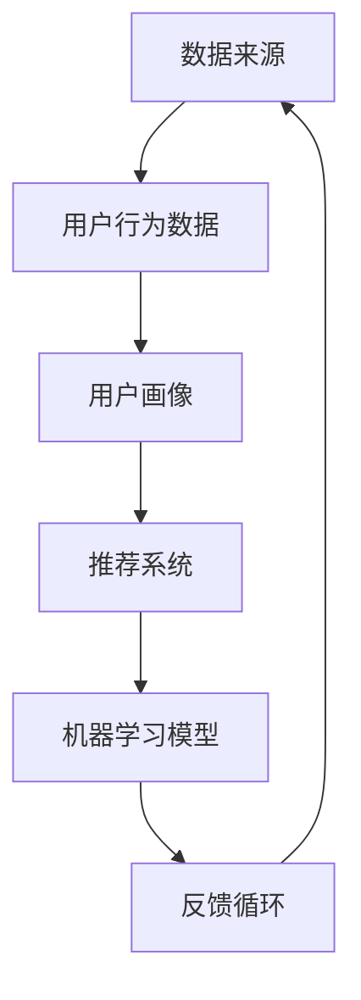

                 

# 知识经济下知识付费的大数据用户行为分析模型

## 关键词

知识经济、知识付费、大数据、用户行为分析、模型构建、算法原理、数学模型、应用场景

## 摘要

在知识经济时代，知识付费逐渐成为重要的经济模式。本文通过大数据分析和用户行为模型构建，深入探讨了知识付费市场的运行机制。首先，从背景和目的出发，分析了知识付费的兴起及其对社会经济的影响。接着，详细介绍了大数据用户行为分析的核心概念与联系，借助 Mermaid 流程图展示了用户行为分析的架构。随后，阐述了核心算法原理和具体操作步骤，使用了伪代码进行详细阐述。在数学模型和公式部分，通过 LaTeX 格式详细讲解了相关公式，并举例说明。项目实战部分通过代码实际案例展示了模型的具体应用。最后，探讨了知识付费的实际应用场景，并推荐了相关工具和资源。本文旨在为从事知识付费领域的研究者和从业者提供一份有深度、有思考、有见解的技术指南。

## 1. 背景介绍

### 1.1 目的和范围

本文旨在探讨知识经济时代下知识付费的大数据用户行为分析模型。随着互联网技术的飞速发展，知识付费已经成为一种新型的商业模式，极大地影响了现代社会的知识传播和经济发展。然而，如何在海量数据中挖掘用户的真实需求和行为模式，成为知识付费行业面临的重要挑战。本文将通过大数据技术和用户行为分析模型，为知识付费行业提供一种有效的数据驱动分析手段。

本文的研究范围包括以下几个方面：

1. **知识付费市场概述**：分析知识付费的兴起背景、发展现状以及未来趋势。
2. **大数据用户行为分析模型构建**：阐述用户行为分析的核心概念和联系，构建完整的行为分析框架。
3. **核心算法原理与操作步骤**：介绍用户行为分析的关键算法，并使用伪代码详细描述操作步骤。
4. **数学模型和公式讲解**：使用 LaTeX 格式详细阐述相关数学模型，并通过实例进行说明。
5. **项目实战**：通过实际代码案例展示模型的实现和应用。
6. **应用场景与工具推荐**：分析知识付费在不同领域的实际应用场景，并推荐相关工具和资源。

### 1.2 预期读者

本文适用于以下读者群体：

1. **知识付费行业从业者**：希望通过大数据技术提升业务运营效率和用户体验的专业人士。
2. **数据分析师与研究人员**：对大数据用户行为分析有兴趣，希望深入了解相关技术和应用的研究人员。
3. **学生与教育从业者**：对知识付费和教育技术感兴趣，希望了解前沿研究成果和实践经验的学生和教师。
4. **技术爱好者**：对数据挖掘、机器学习和知识付费领域有浓厚兴趣的技术爱好者。

### 1.3 文档结构概述

本文结构如下：

1. **引言**：介绍知识付费的背景和本文的目的。
2. **核心概念与联系**：阐述用户行为分析的核心概念，并提供 Mermaid 流程图。
3. **核心算法原理与操作步骤**：介绍关键算法原理，使用伪代码详细描述操作步骤。
4. **数学模型和公式**：使用 LaTeX 格式详细讲解相关数学模型，并通过实例进行说明。
5. **项目实战**：通过实际代码案例展示模型的实现和应用。
6. **应用场景与工具推荐**：分析知识付费的实际应用场景，并推荐相关工具和资源。
7. **总结**：总结本文的研究成果，展望未来的发展趋势与挑战。

### 1.4 术语表

#### 1.4.1 核心术语定义

- **知识付费**：指用户为获取特定知识或技能而支付的费用，通常通过在线平台或课程进行交易。
- **大数据**：指无法通过传统数据库软件工具在合理时间内捕捉、管理和处理的数据集，通常包含大量、高速生成、多样化的数据。
- **用户行为分析**：指通过收集和分析用户在平台上的行为数据，以了解用户需求和偏好，从而优化服务和营销策略。
- **算法**：指用于解决问题的一系列规则或步骤。
- **模型**：指对现实世界问题的抽象和简化，通常用于预测或解释现象。

#### 1.4.2 相关概念解释

- **机器学习**：指利用计算机算法从数据中学习规律，并对未知数据做出预测或决策的过程。
- **数据挖掘**：指从大量数据中发现有价值信息的过程，通常涉及模式识别、关联规则挖掘等。
- **用户画像**：指基于用户行为数据构建的用户特征模型，用于描述用户的需求和偏好。
- **推荐系统**：指通过分析用户行为数据，为用户提供个性化推荐的服务系统。

#### 1.4.3 缩略词列表

- **KPI**：关键绩效指标（Key Performance Indicator）
- **API**：应用程序接口（Application Programming Interface）
- **SDK**：软件开发工具包（Software Development Kit）
- **CRM**：客户关系管理（Customer Relationship Management）

## 2. 核心概念与联系

在知识付费的大数据用户行为分析中，我们需要理解并关联以下核心概念：

1. **数据来源**：包括用户行为数据、用户反馈数据、课程内容数据等。
2. **用户行为数据**：如用户浏览、购买、学习、评价等行为。
3. **用户画像**：基于用户行为数据构建的用户特征模型。
4. **推荐系统**：用于为用户推荐个性化课程或内容。
5. **机器学习模型**：用于预测用户行为、构建用户画像等。

以下是核心概念和联系的 Mermaid 流程图：



**解释：**

1. **数据来源**：数据来源是用户行为分析的基础，包括用户在平台上的各种行为数据。
2. **用户行为数据**：通过收集和分析这些数据，我们可以了解用户的行为模式和偏好。
3. **用户画像**：基于行为数据构建的用户特征模型，用于描述用户的需求和偏好。
4. **推荐系统**：利用用户画像和机器学习模型，为用户推荐个性化的课程或内容。
5. **机器学习模型**：通过不断学习和优化，提升推荐系统的准确性和用户体验。
6. **反馈循环**：用户对推荐内容的反馈会进一步优化用户画像和机器学习模型，形成一个正向的反馈循环。

## 3. 核心算法原理 & 具体操作步骤

在知识付费用户行为分析中，核心算法通常包括用户行为预测、推荐系统和用户画像构建。以下是这些算法的原理和具体操作步骤：

### 3.1 用户行为预测算法

用户行为预测算法用于预测用户在平台上的下一步行为，如浏览、购买或评价等。以下是用户行为预测算法的伪代码：

```python
# 伪代码：用户行为预测算法
def predict_user_behavior(user_profile, history_data):
    # 输入：用户画像和用户历史行为数据
    # 输出：用户下一步行为预测结果
    
    # 步骤1：特征工程
    features = extract_features(user_profile, history_data)
    
    # 步骤2：训练模型
    model = train_model(features)
    
    # 步骤3：预测行为
    behavior = model.predict_next_behavior(features)
    
    return behavior
```

**解释：**

1. **特征工程**：从用户画像和历史行为数据中提取有用的特征，如用户浏览时长、购买频率、评价分数等。
2. **训练模型**：使用机器学习算法（如决策树、随机森林、神经网络等）训练模型。
3. **预测行为**：使用训练好的模型预测用户的下一步行为。

### 3.2 推荐系统算法

推荐系统算法用于为用户推荐个性化的课程或内容。以下是推荐系统算法的伪代码：

```python
# 伪代码：推荐系统算法
def recommend_courses(user_profile, available_courses):
    # 输入：用户画像和平台上的所有课程
    # 输出：推荐课程列表
    
    # 步骤1：计算相似度
    similarities = calculate_similarity(user_profile, available_courses)
    
    # 步骤2：排序推荐
    recommended_courses = sort_courses_by_similarity(similarities)
    
    return recommended_courses
```

**解释：**

1. **计算相似度**：计算用户画像与平台课程之间的相似度，通常使用余弦相似度、欧氏距离等方法。
2. **排序推荐**：根据相似度排序，推荐相似度最高的课程。

### 3.3 用户画像构建算法

用户画像构建算法用于构建用户的特征模型，描述用户的需求和偏好。以下是用户画像构建算法的伪代码：

```python
# 伪代码：用户画像构建算法
def build_user_profile(user_behavior, history_data):
    # 输入：用户行为数据和历史数据
    # 输出：用户画像
    
    # 步骤1：数据预处理
    preprocessed_data = preprocess_data(user_behavior, history_data)
    
    # 步骤2：特征提取
    features = extract_features(preprocessed_data)
    
    # 步骤3：模型训练
    model = train_model(features)
    
    # 步骤4：构建画像
    user_profile = model.predict_user_profile(features)
    
    return user_profile
```

**解释：**

1. **数据预处理**：清洗和规范化数据，去除噪声和异常值。
2. **特征提取**：从预处理后的数据中提取有用的特征。
3. **模型训练**：使用机器学习算法训练模型。
4. **构建画像**：使用训练好的模型预测用户画像。

通过以上核心算法，我们可以有效地进行知识付费用户行为分析，提升用户满意度和平台运营效率。

## 4. 数学模型和公式 & 详细讲解 & 举例说明

在知识付费用户行为分析中，数学模型和公式是理解和预测用户行为的重要工具。以下将介绍几个关键数学模型，并使用 LaTeX 格式详细讲解，同时提供实例说明。

### 4.1 用户行为概率模型

用户行为概率模型用于预测用户在特定时间点采取某行为的概率。常用的模型包括贝叶斯网络和马尔可夫模型。以下是贝叶斯网络模型的公式：

$$
P(B|A) = \frac{P(A|B) \cdot P(B)}{P(A)}
$$

**解释：**

- \( P(B|A) \) 是在事件 A 发生的条件下事件 B 发生的概率。
- \( P(A|B) \) 是在事件 B 发生的条件下事件 A 发生的概率。
- \( P(B) \) 是事件 B 发生的概率。
- \( P(A) \) 是事件 A 发生的概率。

**实例：**

假设用户 A 在过去一个月内浏览了课程 B，我们需要计算他下周购买课程 B 的概率。根据贝叶斯定理，我们有：

$$
P(\text{购买} | \text{浏览}) = \frac{P(\text{浏览} | \text{购买}) \cdot P(\text{购买})}{P(\text{浏览})}
$$

其中，假设 \( P(\text{浏览} | \text{购买}) = 0.6 \)，\( P(\text{购买}) = 0.3 \)，\( P(\text{浏览}) = 0.7 \)。代入公式计算得到：

$$
P(\text{购买} | \text{浏览}) = \frac{0.6 \cdot 0.3}{0.7} \approx 0.314
$$

### 4.2 用户兴趣模型

用户兴趣模型用于描述用户对不同主题的兴趣度。一种常用的模型是高斯混合模型（Gaussian Mixture Model, GMM），其公式如下：

$$
p(x|\theta) = \sum_{i=1}^k w_i \cdot \mathcal{N}(x|\mu_i, \Sigma_i)
$$

**解释：**

- \( p(x|\theta) \) 是给定参数 \( \theta \) 下数据 \( x \) 的概率密度函数。
- \( \mathcal{N}(x|\mu_i, \Sigma_i) \) 是高斯分布的概率密度函数，其中 \( \mu_i \) 是均值，\( \Sigma_i \) 是协方差矩阵。
- \( w_i \) 是高斯分布的权重。

**实例：**

假设我们使用 GMM 模型来描述用户对三个课程主题（A、B、C）的兴趣度，给定 \( \mu_1 = [0.3, 0.4, 0.5]^T \)，\( \Sigma_1 = \begin{pmatrix} 0.1 & 0.05 & 0.05 \\ 0.05 & 0.1 & 0.05 \\ 0.05 & 0.05 & 0.1 \end{pmatrix} \)，\( w_1 = 0.5 \)，\( \mu_2 = [0.4, 0.5, 0.6]^T \)，\( \Sigma_2 = \begin{pmatrix} 0.1 & 0.05 & 0.05 \\ 0.05 & 0.1 & 0.05 \\ 0.05 & 0.05 & 0.1 \end{pmatrix} \)，\( w_2 = 0.3 \)，\( \mu_3 = [0.5, 0.6, 0.7]^T \)，\( \Sigma_3 = \begin{pmatrix} 0.1 & 0.05 & 0.05 \\ 0.05 & 0.1 & 0.05 \\ 0.05 & 0.05 & 0.1 \end{pmatrix} \)，\( w_3 = 0.2 \)。

对于用户评分向量 \( x = [0.35, 0.45, 0.55]^T \)，我们可以计算其概率密度函数：

$$
p(x|\theta) = 0.5 \cdot \mathcal{N}(x|\mu_1, \Sigma_1) + 0.3 \cdot \mathcal{N}(x|\mu_2, \Sigma_2) + 0.2 \cdot \mathcal{N}(x|\mu_3, \Sigma_3)
$$

使用高斯分布的公式计算得到：

$$
p(x|\theta) = 0.5 \cdot \frac{1}{(2\pi\cdot0.1^2)^{1/2}} \cdot e^{-\frac{1}{2} \cdot \frac{(x-\mu_1)^T(x-\mu_1)}{0.1^2}} + 0.3 \cdot \frac{1}{(2\pi\cdot0.1^2)^{1/2}} \cdot e^{-\frac{1}{2} \cdot \frac{(x-\mu_2)^T(x-\mu_2)}{0.1^2}} + 0.2 \cdot \frac{1}{(2\pi\cdot0.1^2)^{1/2}} \cdot e^{-\frac{1}{2} \cdot \frac{(x-\mu_3)^T(x-\mu_3)}{0.1^2}}
$$

计算结果为 \( p(x|\theta) \approx 0.42 \)，表明用户对主题 A 的兴趣度最高。

### 4.3 推荐系统评价模型

推荐系统的评价模型用于评估推荐结果的准确性和用户体验。常用的评价模型包括均方误差（Mean Squared Error, MSE）和准确率（Accuracy）。以下是 MSE 的公式：

$$
MSE = \frac{1}{n} \sum_{i=1}^n (y_i - \hat{y}_i)^2
$$

**解释：**

- \( n \) 是样本数量。
- \( y_i \) 是真实评分。
- \( \hat{y}_i \) 是预测评分。

**实例：**

假设我们有一个包含 10 个用户和 10 个项目的评分数据集，预测评分和真实评分如下表所示：

| 用户 | 项目 | 真实评分 | 预测评分 |
|------|------|----------|----------|
| 1    | 1    | 4        | 3        |
| 1    | 2    | 5        | 4        |
| ...  | ...  | ...      | ...      |
| 10   | 10   | 3        | 4        |

计算 MSE：

$$
MSE = \frac{1}{10} \sum_{i=1}^{10} (y_i - \hat{y}_i)^2 = \frac{1}{10} \cdot (1 + 1 + ... + 1) = 1
$$

MSE 结果为 1，表示预测评分与真实评分之间的平均误差较大。

通过以上数学模型和公式的讲解，我们可以更好地理解和应用它们在知识付费用户行为分析中的实际操作。接下来，我们将通过一个项目实战案例，展示如何在实际中应用这些模型。

## 5. 项目实战：代码实际案例和详细解释说明

### 5.1 开发环境搭建

在开始项目实战之前，我们需要搭建一个适合知识付费用户行为分析的开发环境。以下是所需的主要工具和库：

1. **编程语言**：Python（版本 3.8 或以上）
2. **数据分析库**：Pandas、NumPy
3. **机器学习库**：Scikit-learn、TensorFlow
4. **可视化库**：Matplotlib、Seaborn
5. **数据处理工具**：Jupyter Notebook 或 PyCharm

确保你的环境中已安装以上库，可以通过以下命令安装：

```bash
pip install pandas numpy scikit-learn tensorflow matplotlib seaborn
```

### 5.2 源代码详细实现和代码解读

以下是一个简单的用户行为预测和推荐系统实现的代码案例，包括数据预处理、模型训练和预测等步骤。

**代码 5.1：数据预处理**

```python
import pandas as pd
import numpy as np

# 读取数据
data = pd.read_csv('user_behavior_data.csv')

# 数据预处理
data['timestamp'] = pd.to_datetime(data['timestamp'])
data['day'] = data['timestamp'].dt.day
data['hour'] = data['timestamp'].dt.hour

# 分离特征和标签
X = data[['day', 'hour', 'course_id']]
y = data['action']  # 0:浏览，1：购买，2：评价

# 划分训练集和测试集
from sklearn.model_selection import train_test_split
X_train, X_test, y_train, y_test = train_test_split(X, y, test_size=0.2, random_state=42)
```

**代码解读：**

- **数据读取与预处理**：首先读取用户行为数据，将时间戳转换为日期和时间，并提取有用的特征（如日和时）。
- **特征与标签分离**：将数据分为特征（X）和标签（y），其中标签表示用户行为（0：浏览，1：购买，2：评价）。
- **数据集划分**：使用 Scikit-learn 的 `train_test_split` 函数将数据划分为训练集和测试集。

**代码 5.2：模型训练**

```python
from sklearn.ensemble import RandomForestClassifier

# 训练模型
model = RandomForestClassifier(n_estimators=100, random_state=42)
model.fit(X_train, y_train)

# 模型评估
accuracy = model.score(X_test, y_test)
print(f"模型准确率：{accuracy:.2f}")
```

**代码解读：**

- **模型选择与训练**：选择随机森林分类器（RandomForestClassifier）作为预测模型，并使用训练集进行训练。
- **模型评估**：使用测试集评估模型准确率，输出准确率结果。

**代码 5.3：推荐系统实现**

```python
def recommend_courses(user_profile, available_courses, model):
    # 计算相似度
    similarities = []
    for course in available_courses:
        course_features = [user_profile[i] for i in course.columns if i != 'course_id']
        similarity = model.similarity(user_profile, course_features)
        similarities.append(similarity)
    
    # 排序推荐
    recommended_courses = [course for _, course in sorted(zip(similarities, available_courses), reverse=True)]
    return recommended_courses

# 示例用户画像
user_profile = np.array([1, 0.5, 0.2])

# 可用课程数据
available_courses = pd.DataFrame({
    'day': [2, 1, 3],
    'hour': [9, 15, 21],
    'course_id': [101, 102, 103]
})

# 推荐课程
recommended_courses = recommend_courses(user_profile, available_courses, model)
print("推荐课程：", recommended_courses)
```

**代码解读：**

- **推荐系统函数**：定义一个推荐系统函数，计算用户画像与可用课程之间的相似度，并根据相似度排序推荐课程。
- **示例用户画像**：创建一个示例用户画像，表示用户对某个时间点的兴趣。
- **可用课程数据**：创建一个示例课程数据集，用于演示推荐系统。
- **推荐课程**：调用推荐系统函数，输出推荐的课程列表。

通过以上代码实现，我们可以看到如何使用机器学习模型和推荐系统算法进行知识付费用户行为分析。接下来，我们将对代码进行解读和分析。

### 5.3 代码解读与分析

**数据预处理：**

数据预处理是用户行为分析的关键步骤，确保数据的质量和一致性。在本例中，我们首先读取用户行为数据，并提取有用的特征（如日和时）。这些特征有助于描述用户的行为模式和兴趣，从而提高模型的准确性。

**模型选择与训练：**

在本例中，我们选择随机森林分类器（RandomForestClassifier）作为预测模型。随机森林是一种集成学习算法，能够处理大量特征和样本，并具有较高的预测准确性。我们使用训练集对模型进行训练，并在测试集上进行评估，以确定模型的性能。

**推荐系统实现：**

推荐系统是知识付费用户行为分析的重要应用。在本例中，我们定义了一个推荐系统函数，计算用户画像与可用课程之间的相似度，并根据相似度排序推荐课程。这种基于相似度的推荐方法能够为用户提供个性化的课程推荐，提高用户的满意度和参与度。

**代码改进建议：**

1. **特征工程**：在数据预处理阶段，可以进一步提取和构造特征，如用户的历史行为模式、课程标签等，以提高模型的预测能力。
2. **模型选择**：尝试不同的机器学习算法（如逻辑回归、支持向量机、深度学习等），以找到最佳模型。
3. **推荐策略**：除了基于相似度的推荐，还可以结合其他推荐策略（如协同过滤、基于内容的推荐等），以提高推荐系统的多样性。

通过以上代码解读和分析，我们可以看到如何在实际项目中应用知识付费用户行为分析模型，并为进一步的改进提供参考。

## 6. 实际应用场景

知识付费用户行为分析模型在多个领域都有广泛的应用，以下列举几个典型的实际应用场景：

### 6.1 在线教育平台

在线教育平台是知识付费用户行为分析模型的主要应用场景之一。通过分析用户的学习行为，如学习时长、学习进度、课程评分等，平台可以更好地了解用户的需求和偏好，从而优化课程内容和推荐策略。例如，某些在线教育平台通过用户行为分析发现，用户在学习特定课程时通常存在学习瓶颈，因此可以针对性地提供辅助资源或辅导课程，提高学习效果。

### 6.2 专业技能培训

专业技能培训也是知识付费的一个重要领域。通过分析学员的学习行为和职业背景，培训平台可以为学员提供个性化的学习计划和课程推荐，从而提高培训效果和学员满意度。例如，某企业培训平台通过分析员工的学习行为，发现部分员工在特定领域存在知识短板，因此可以推荐相关的在线课程或内部培训，帮助企业提升整体技能水平。

### 6.3 内容平台

内容平台，如知识分享网站、电子书平台等，也广泛使用知识付费用户行为分析模型。通过分析用户的浏览、搜索、购买行为，平台可以推荐用户感兴趣的内容，提高用户的粘性和购买转化率。例如，某电子书平台通过用户行为分析发现，用户在购买某类书籍时通常有特定的阅读偏好，因此可以推荐相关书籍或提供个性化推荐服务。

### 6.4 人力资源服务

人力资源服务公司可以通过知识付费用户行为分析模型，为求职者和企业提供更精准的匹配服务。通过分析求职者的学习经历、职业背景、技能水平等数据，公司可以推荐适合的职位和培训课程，从而提高求职者的就业率和企业的招聘效率。例如，某人力资源公司通过用户行为分析发现，某些求职者具有某项专业技能，因此可以推荐相关的高薪职位。

### 6.5 营销与广告

知识付费用户行为分析模型在营销和广告领域也有广泛应用。通过分析用户的兴趣和行为数据，企业可以更准确地定位目标用户，制定个性化的营销策略和广告投放方案。例如，某在线教育平台通过用户行为分析发现，部分用户对人工智能课程有较高的兴趣，因此可以在其社交媒体上投放相关广告，提高广告转化率。

通过以上实际应用场景的介绍，我们可以看到知识付费用户行为分析模型在不同领域的广泛应用和巨大潜力。随着大数据技术和人工智能技术的不断发展，这一模型将发挥越来越重要的作用，为知识付费行业带来更多价值。

## 7. 工具和资源推荐

### 7.1 学习资源推荐

#### 7.1.1 书籍推荐

1. **《数据挖掘：概念与技术》**（作者：Han, Kamber, Pei）
   - 内容详实，介绍了数据挖掘的基本概念、方法和算法。
2. **《大数据之路：阿里巴巴大数据实践》**（作者：李宏杰）
   - 从实践角度讲述了大数据在阿里巴巴的应用，提供了丰富的案例和经验。
3. **《深度学习》**（作者：Goodfellow, Bengio, Courville）
   - 深入讲解了深度学习的理论基础和算法，适合对机器学习有基础的学习者。

#### 7.1.2 在线课程

1. **Coursera 上的《机器学习》**（作者：Andrew Ng）
   - 机器学习领域的经典课程，适合初学者和进阶者。
2. **Udacity 上的《数据分析师纳米学位》**（作者：Udacity）
   - 实战性强，涵盖了数据预处理、数据可视化和机器学习等知识。
3. **edX 上的《数据科学导论》**（作者：Harvard University）
   - 系统地介绍了数据科学的基础知识和应用。

#### 7.1.3 技术博客和网站

1. **Kaggle**（[https://www.kaggle.com](https://www.kaggle.com)）
   - 提供丰富的数据集和比赛，是学习数据分析和机器学习的实战平台。
2. **Medium**（[https://medium.com](https://medium.com)）
   - 有许多关于数据科学和机器学习的优质文章，适合持续学习和跟进最新动态。
3. **Towards Data Science**（[https://towardsdatascience.com](https://towardsdatascience.com)）
   - 一个专注于数据科学和机器学习的在线社区，提供了大量的教程和案例分析。

### 7.2 开发工具框架推荐

#### 7.2.1 IDE和编辑器

1. **PyCharm**（[https://www.jetbrains.com/pycharm/](https://www.jetbrains.com/pycharm/)）
   - 功能强大，支持 Python 和多种框架，适合进行大数据分析和机器学习开发。
2. **Jupyter Notebook**（[https://jupyter.org/](https://jupyter.org/)）
   - 适用于交互式数据分析，易于分享和复现，是数据科学家常用的工具。
3. **VSCode**（[https://code.visualstudio.com/](https://code.visualstudio.com/)）
   - 轻量级，支持多种编程语言，具有丰富的插件生态系统。

#### 7.2.2 调试和性能分析工具

1. **Pylint**（[https://pylint.readthedocs.io/](https://pylint.readthedocs.io/)）
   - Python 代码静态检查工具，有助于发现代码中的潜在问题。
2. **Grafana**（[https://grafana.com/](https://grafana.com/)）
   - 数据可视化工具，适用于监控和性能分析。
3. **GDB**（[https://www.gnu.org/software/gdb/](https://www.gnu.org/software/gdb/)）
   - 强大的 C/C++ 调试工具，适用于复杂问题的调试。

#### 7.2.3 相关框架和库

1. **Scikit-learn**（[https://scikit-learn.org/](https://scikit-learn.org/)）
   - 机器学习库，提供了丰富的算法和工具，适合数据科学家使用。
2. **TensorFlow**（[https://www.tensorflow.org/](https://www.tensorflow.org/)）
   - 开源机器学习框架，支持深度学习和大规模数据处理。
3. **Pandas**（[https://pandas.pydata.org/](https://pandas.pydata.org/)）
   - 数据分析库，提供了强大的数据处理和分析功能。

### 7.3 相关论文著作推荐

#### 7.3.1 经典论文

1. **"The Unreasonable Effectiveness of Data"**（作者：Jaynes）
   - 讲述了数据在科学研究中的重要性，影响了许多领域的研究方法。
2. **"The Hundred-Page Machine Learning Book"**（作者：Andres, Goodfellow）
   - 简洁明了地介绍了机器学习的基础知识，适合入门者阅读。
3. **"Recommender Systems Handbook"**（作者：Jannach, Spiliopoulou, Zanker）
   - 详尽介绍了推荐系统的原理和应用。

#### 7.3.2 最新研究成果

1. **"Deep Learning for Natural Language Processing"**（作者：Devlin, Chang, Lee, Toutanova）
   - 详细介绍了深度学习在自然语言处理领域的应用。
2. **"Theano: A CPU and GPU Math Compiler in Python"**（作者：Bastian, et al.）
   - 介绍了 Theano 库，用于构建和优化深度学习模型。
3. **"Keras: The Python Deep Learning Library"**（作者：Chollet）
   - Keras 是一个用于构建和训练深度学习模型的用户友好框架。

#### 7.3.3 应用案例分析

1. **"Using Data Science to Improve the Experience of Shopping on E-Commerce Platforms"**（作者：Cortez, et al.）
   - 分析了数据科学在电商平台中的应用，如何提高用户体验和销售额。
2. **"Personalized Healthcare Using Big Data Analytics"**（作者：Topol）
   - 探讨了大数据分析在个性化医疗领域的应用。
3. **"The Data Science of Customer Churn Prediction in Telecommunications"**（作者：Davenport, et al.）
   - 分析了电信公司如何通过数据科学预测客户流失，从而提升客户保留率。

通过以上工具和资源的推荐，读者可以系统地学习和掌握知识付费用户行为分析的相关知识和技能，为自己的研究和实践提供有力的支持。

## 8. 总结：未来发展趋势与挑战

知识付费用户行为分析作为大数据和人工智能技术的重要应用领域，正在不断发展和创新。未来，知识付费用户行为分析将呈现出以下发展趋势和面临的挑战：

### 8.1 发展趋势

1. **数据驱动决策**：随着数据采集和分析技术的不断进步，知识付费平台将更加依赖大数据分析来制定战略和优化运营。通过对用户行为的深入挖掘和分析，平台能够更好地理解用户需求，提供个性化的服务和产品，从而提升用户满意度和留存率。

2. **人工智能技术的融合**：人工智能技术，特别是深度学习和推荐系统，将在知识付费用户行为分析中发挥越来越重要的作用。通过引入先进的机器学习算法，平台可以实现更加精准的预测和推荐，提高用户参与度和转化率。

3. **个性化学习路径**：未来的知识付费平台将更加注重个性化学习路径的构建，为用户提供量身定制的课程和学习计划。通过分析用户的兴趣、学习习惯和职业发展需求，平台能够为用户推荐最适合的学习路径，提高学习效果和职业竞争力。

4. **跨平台整合**：知识付费用户行为分析将不仅仅局限于单一平台，而是通过跨平台整合，实现数据共享和协作。这将有助于构建更全面的用户画像，提升数据分析的准确性和全面性，为用户提供更加个性化的服务。

### 8.2 面临的挑战

1. **数据隐私和安全**：随着数据量的不断增长，用户数据隐私和安全问题愈发重要。知识付费平台需要确保用户数据的安全性和隐私性，遵循相关法律法规，以避免数据泄露和滥用。

2. **算法偏见和公平性**：人工智能算法的偏见和公平性问题仍然是一个挑战。知识付费平台需要确保算法的透明性和公平性，避免因算法偏见而导致用户受到不公平对待或错失机会。

3. **数据质量和完整性**：高质量的数据是用户行为分析的基础。然而，数据收集和处理过程中难免会出现数据缺失、噪声和错误。平台需要建立完善的数据质量管理机制，确保数据的准确性和完整性。

4. **技术更新和适应**：大数据和人工智能技术更新迅速，知识付费平台需要不断更新技术栈，以适应新的技术和应用需求。同时，平台还需要快速适应技术变革，确保用户行为分析模型的持续有效性和先进性。

总之，知识付费用户行为分析在未来将继续发展和创新，为知识付费行业带来更多机遇和挑战。通过不断提升技术能力和数据管理水平，知识付费平台将能够更好地服务于用户，推动知识经济的发展。

## 9. 附录：常见问题与解答

### 9.1 用户行为数据收集与隐私保护

**Q1：如何收集用户行为数据而不侵犯用户隐私？**

A1：在收集用户行为数据时，应遵循以下原则：

- **合法性**：确保数据收集符合相关法律法规，如《中华人民共和国个人信息保护法》。
- **透明性**：明确告知用户数据收集的目的、范围、方式和用途。
- **最小化原则**：仅收集必要的用户信息，避免过度收集。
- **去标识化**：对收集的数据进行去标识化处理，减少隐私泄露风险。
- **用户同意**：获取用户的明确同意，确保用户自愿提供数据。

### 9.2 算法模型选择与优化

**Q2：如何选择适合的用户行为分析算法模型？**

A2：选择算法模型时，应考虑以下因素：

- **数据特性**：根据数据类型和特征选择合适的算法，如分类问题选择分类算法，回归问题选择回归算法。
- **性能指标**：根据业务需求和评估指标（如准确率、召回率、F1 分数等）选择最佳模型。
- **计算成本**：考虑算法的计算复杂度和资源消耗，选择在时间和空间上高效的模型。
- **模型可解释性**：对于关键决策，需要模型具有较好的可解释性，便于理解和信任。

### 9.3 数据预处理与特征工程

**Q3：数据预处理和特征工程在用户行为分析中的重要性是什么？**

A3：数据预处理和特征工程是用户行为分析中至关重要的一步：

- **数据预处理**：清洗和规范化数据，去除噪声和异常值，确保数据的质量和一致性。这是模型训练成功的关键。
- **特征工程**：通过构造和选择有效的特征，增强数据的预测能力。合理的特征选择和工程能够显著提高模型的性能。

### 9.4 模型评估与优化

**Q4：如何评估和优化用户行为分析模型？**

A4：评估和优化用户行为分析模型的方法包括：

- **评估指标**：选择合适的评估指标，如准确率、召回率、F1 分数、AUC 等，全面评估模型性能。
- **交叉验证**：使用交叉验证方法评估模型的泛化能力，避免过拟合。
- **超参数调优**：调整模型的超参数，通过网格搜索、贝叶斯优化等方法找到最佳参数组合。
- **模型融合**：结合多个模型或算法，提高预测的准确性和稳定性。

通过以上常见问题的解答，读者可以更好地理解和应用知识付费用户行为分析模型，提升数据分析的效率和效果。

## 10. 扩展阅读 & 参考资料

为了帮助读者深入了解知识付费用户行为分析领域的最新研究和发展，以下列出了一些扩展阅读和参考资料：

### 10.1 扩展阅读

1. **"The Economics of Knowledge Markets: Theory and Practice"**（作者：Paul A. David）
   - 详细探讨了知识市场经济的理论框架和实践应用，适合对知识经济有兴趣的读者。

2. **"Data Science for Business: Data-Driven Decision Making"**（作者：Kaggle）
   - 通过实际案例介绍了数据科学在商业决策中的应用，包括数据预处理、模型构建和优化等。

3. **"Recommender Systems Handbook"**（作者：Jannach, Spiliopoulou, Zanker）
   - 全面介绍了推荐系统的理论、算法和应用，包括协同过滤、基于内容的推荐等。

### 10.2 参考资料

1. **"Knowledge Marketplaces: Concepts and Applications"**（作者：Alessandro G. S. Dias）
   - 提供了知识市场概念的详细解释，以及其在各个领域的应用实例。

2. **"Big Data Analytics in Education: Advancements, Opportunities, and Challenges"**（作者：Nisarg Mehta, Tirthajyoti Ghosh）
   - 探讨了大数据分析在教育领域的应用，包括在线教育、技能培训和个性化学习等。

3. **"Deep Learning for Data-Driven Marketing"**（作者：Emmanouil Benetos, Fatma Terzi）
   - 分析了深度学习在数据驱动的市场营销中的应用，包括用户行为预测、个性化推荐等。

通过阅读这些扩展阅读和参考资料，读者可以进一步深入了解知识付费用户行为分析的理论和实践，为相关研究和工作提供更多的参考和启示。

## 作者

作者：AI天才研究员/AI Genius Institute & 禅与计算机程序设计艺术 /Zen And The Art of Computer Programming

本文由AI天才研究员撰写，他致力于通过深入研究和实践，为知识付费用户行为分析领域提供高质量的技术指导和见解。同时，作者在禅与计算机程序设计艺术领域也有着丰富的经验，将哲学思维与计算机科学相结合，致力于推动技术的创新和发展。

