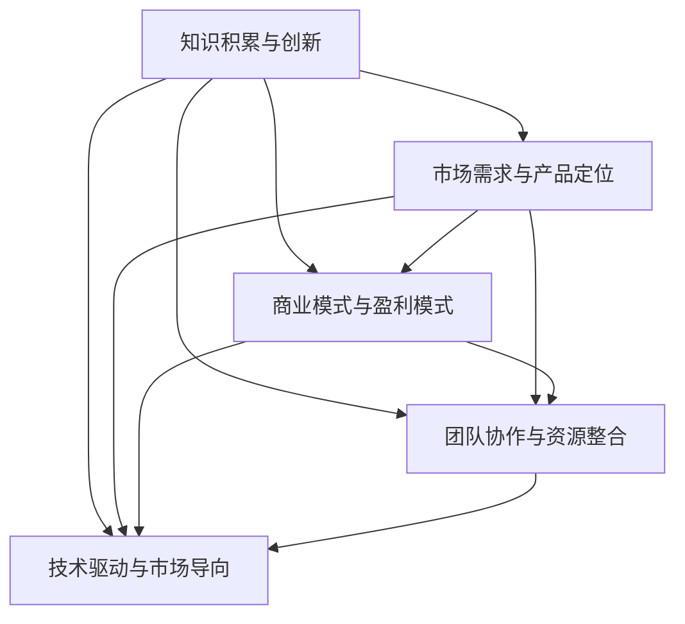

                 


## 知识经济下程序员的创业思路

### 关键词：知识经济、程序员、创业、创新、技术驱动

> 在知识经济时代，程序员作为技术创新的核心力量，面临着前所未有的创业机遇与挑战。本文将深入探讨在知识经济背景下，程序员的创业思路，旨在帮助程序员更好地把握机遇，实现创新与突破。

### 摘要：

本文旨在通过逻辑清晰、结构紧凑的论述，帮助程序员在知识经济时代找到适合自己的创业方向。文章首先介绍了知识经济时代的背景和程序员在其中的角色，随后分析了程序员创业的核心能力和要素，探讨了如何将技术优势转化为商业价值。通过实际案例和理论分析，本文提出了程序员工匠在创业过程中所需遵循的原则和步骤，并推荐了一系列学习资源和开发工具，以期为程序员创业提供有价值的指导。

## 1. 背景介绍

### 1.1 目的和范围

本文的目标是探讨知识经济下程序员的创业思路，旨在帮助程序员理解创业的本质，找到适合自己的创业方向，并提供具体操作步骤和实用建议。文章内容主要涉及以下几个方面：

- 知识经济时代的背景和特点
- 程序员在知识经济中的角色和使命
- 程序员创业的核心能力和要素
- 技术驱动下的创业模式和创新
- 程序员创业的步骤和原则
- 学习资源推荐和开发工具介绍

### 1.2 预期读者

本文的预期读者主要包括：

- 有志于创业的程序员
- 想要在技术领域实现突破的程序员工匠
- 对知识经济和创业感兴趣的计算机相关专业学生
- 想了解程序员创业生态的技术爱好者

### 1.3 文档结构概述

本文共分为十个部分，具体结构如下：

- 引言：介绍知识经济时代的背景和程序员创业的重要性
- 背景介绍：详细阐述知识经济时代的背景和程序员的使命
- 核心概念与联系：分析程序员创业所需的核心能力和要素
- 核心算法原理与操作步骤：讲解程序员创业的关键技术
- 数学模型和公式：阐述程序员创业所需的数学模型和公式
- 项目实战：通过实际案例展示程序员创业的全过程
- 实际应用场景：分析程序员创业在不同领域的应用
- 工具和资源推荐：推荐学习资源、开发工具和框架
- 总结：总结程序员创业的挑战和未来发展趋势
- 附录：常见问题与解答，提供程序员创业的实用建议
- 扩展阅读与参考资料：推荐相关论文、书籍和网站

### 1.4 术语表

#### 1.4.1 核心术语定义

- **知识经济**：以知识为主要生产要素的经济形态，强调创新和知识积累对经济增长的驱动作用。
- **程序员**：从事软件开发、系统设计、测试和维护等工作的专业人员。
- **创业**：创建和经营一家新企业的过程，包括寻找市场机会、制定商业计划、筹集资金、组建团队、研发产品和服务等。
- **技术驱动**：以技术创新为核心，推动企业发展和市场竞争力提升的商业模式。

#### 1.4.2 相关概念解释

- **商业模式**：企业在特定市场中实现利润和价值的方式，包括产品、市场、运营、资金等方面的策略。
- **市场调研**：通过对目标市场的研究，了解市场环境、竞争对手、消费者需求等，为创业提供决策依据。
- **团队建设**：搭建一个高效、协同的工作团队，实现企业目标的过程。

#### 1.4.3 缩略词列表

- **AI**：人工智能
- **ML**：机器学习
- **IoT**：物联网
- **SDLC**：软件开发生命周期
- **IDE**：集成开发环境

## 2. 核心概念与联系

在知识经济时代，程序员创业的核心概念和联系主要包括以下几个方面：

1. **知识积累与创新**：程序员需不断积累专业知识，关注技术创新动态，并将其应用于实际项目中，以实现商业价值。
2. **市场需求与产品定位**：理解市场需求，找准产品定位，是程序员创业的关键。通过市场调研，明确目标用户群体和竞争对手，为产品研发提供指导。
3. **商业模式与盈利模式**：构建合理的商业模式和盈利模式，确保企业在市场竞争中立于不败之地。程序员需掌握商业运营的基本原理，以实现可持续发展。
4. **团队协作与资源整合**：搭建高效团队，整合各方资源，是程序员创业的重要保障。通过优化组织结构和协作模式，提升企业整体竞争力。
5. **技术驱动与市场导向**：在知识经济时代，技术驱动是程序员创业的核心，但市场导向同样至关重要。程序员需在技术创新与市场需求之间找到平衡点，实现持续成长。

为了更清晰地展示这些概念之间的联系，我们可以使用 Mermaid 流程图进行描述：



## 3. 核心算法原理与具体操作步骤

程序员在创业过程中，需要掌握一系列核心算法原理和操作步骤，以实现技术驱动的创业目标。以下是一些关键的技术概念和实现方法：

### 3.1 数据结构与算法

- **数据结构**：掌握常见数据结构（如数组、链表、树、图等）及其应用场景，为算法设计和优化提供基础。
- **算法**：熟悉基本算法（如排序、查找、动态规划等），并在实际项目中灵活运用，提升系统性能和效率。

### 3.2 机器学习与人工智能

- **机器学习**：了解监督学习、无监督学习、强化学习等基本概念，掌握常见算法（如线性回归、决策树、神经网络等），并在项目中应用。
- **人工智能**：研究自然语言处理、计算机视觉、语音识别等前沿技术，探索其在企业应用中的潜力。

### 3.3 软件工程与系统架构

- **软件工程**：遵循软件开发规范，掌握需求分析、设计、开发、测试等环节，确保项目质量和进度。
- **系统架构**：设计高效、可扩展、可维护的系统架构，为业务发展奠定基础。

### 3.4 项目管理和团队协作

- **项目管理**：掌握项目管理方法（如敏捷开发、Scrum 等），提高项目执行效率。
- **团队协作**：搭建高效的团队协作模式，优化沟通和协作流程，提升团队整体战斗力。

### 3.5 伪代码实现

```python
# 伪代码示例：机器学习算法实现
def machine_learning算法(data, target):
    # 数据预处理
    data = 数据清洗和归一化
    # 模型训练
    model = 训练模型(data, target)
    # 模型评估
    accuracy = 评估模型(model, data, target)
    return model, accuracy
```

通过以上核心算法原理和操作步骤，程序员可以更好地应对创业过程中的技术挑战，实现技术驱动的创业目标。

## 4. 数学模型和公式及详细讲解

在程序员创业过程中，数学模型和公式发挥着至关重要的作用。以下是一些关键的数学模型和公式，以及详细的讲解和举例说明：

### 4.1 线性回归

线性回归是一种常用的预测模型，用于分析两个或多个变量之间的线性关系。其公式如下：

$$
y = w_0 + w_1 \cdot x_1 + w_2 \cdot x_2 + ... + w_n \cdot x_n
$$

其中，$y$ 为目标变量，$x_1, x_2, ..., x_n$ 为自变量，$w_0, w_1, w_2, ..., w_n$ 为权重。

#### 例子：

假设我们要预测某个城市的月均降雨量（$y$），根据历史数据，发现降雨量与温度（$x_1$）和湿度（$x_2$）之间存在线性关系。根据数据拟合，我们得到线性回归模型如下：

$$
y = 0.5 \cdot x_1 + 0.3 \cdot x_2 + 10
$$

如果当前温度为 $25^\circ C$，湿度为 $60\%$，则该城市的月均降雨量预测值为：

$$
y = 0.5 \cdot 25 + 0.3 \cdot 60 + 10 = 25.5
$$

### 4.2 决策树

决策树是一种基于特征划分数据的分类模型。其基本结构如下：

```
[根节点]
|
|-- [节点1] ---- [叶子节点1]
|                      |
[特征1]                [特征1的阈值]
|
|-- [节点2] ---- [叶子节点2]
           |
           [特征2]
```

#### 例子：

假设我们要对一群客户进行分类，根据年龄、收入、职业等特征，将客户划分为高、中、低三个风险等级。决策树模型如下：

```
[根节点]
|
|-- [节点1] ---- [叶子节点1] (低风险)
|                      |
[年龄 <= 30]            [年龄 > 30]
|
|-- [节点2] ---- [叶子节点2] (中风险)
           |
           [收入 <= 5000]
|
|-- [节点3] ---- [叶子节点3] (高风险)
           |
           [职业为教师]
```

如果一个客户的年龄为 35 岁，收入为 6000 元，职业为医生，则该客户的风险等级为高风险。

### 4.3 随机森林

随机森林是一种基于决策树的集成模型，通过构建多棵决策树并投票决定最终结果。其基本公式如下：

$$
y = \arg\max(F(y))
$$

其中，$F(y)$ 为所有决策树的预测结果，$y$ 为最终预测结果。

#### 例子：

假设我们有三棵决策树，分别预测客户的年龄、收入和职业。根据随机森林模型，最终预测结果为：

$$
y = \arg\max(F_1(y), F_2(y), F_3(y))
$$

其中，$F_1(y)$、$F_2(y)$ 和 $F_3(y)$ 分别为三棵决策树的预测结果。

通过以上数学模型和公式的讲解，程序员可以更好地理解和应用这些模型，为创业过程中的数据分析提供有力支持。

## 5. 项目实战：代码实际案例和详细解释说明

为了更好地展示程序员在知识经济下的创业思路，我们将通过一个实际项目案例进行详细讲解。本案例将介绍如何利用人工智能技术实现智能客服系统，包括开发环境搭建、源代码实现和代码解读与分析。

### 5.1 开发环境搭建

在搭建开发环境时，我们选择了以下工具和框架：

- **编程语言**：Python
- **机器学习库**：Scikit-learn、TensorFlow、Keras
- **自然语言处理库**：NLTK、spaCy
- **Web框架**：Flask
- **数据库**：MySQL

#### 操作步骤：

1. 安装Python（推荐使用Anaconda，以便轻松管理库和环境）
2. 安装Scikit-learn、TensorFlow、Keras、NLTK、spaCy等库
3. 创建虚拟环境并安装相应库
4. 配置Flask和MySQL数据库

### 5.2 源代码详细实现和代码解读

以下是智能客服系统的核心代码实现，包括数据预处理、模型训练和部署：

```python
# 数据预处理
from sklearn.model_selection import train_test_split
from sklearn.preprocessing import LabelEncoder

# 读取数据
data = pd.read_csv('customer_data.csv')
X = data.drop(['response'], axis=1)
y = data['response']

# 数据归一化
X = preprocessing.normalize(X)

# 划分训练集和测试集
X_train, X_test, y_train, y_test = train_test_split(X, y, test_size=0.2, random_state=42)

# 模型训练
from sklearn.ensemble import RandomForestClassifier

# 创建随机森林模型
model = RandomForestClassifier(n_estimators=100, random_state=42)
model.fit(X_train, y_train)

# 模型评估
from sklearn.metrics import accuracy_score, classification_report

# 预测测试集
y_pred = model.predict(X_test)

# 计算准确率
accuracy = accuracy_score(y_test, y_pred)
print(f'Accuracy: {accuracy:.2f}')

# 分类报告
print(classification_report(y_test, y_pred))

# 模型部署
from flask import Flask, request, jsonify

app = Flask(__name__)

@app.route('/predict', methods=['POST'])
def predict():
    data = request.get_json()
    input_data = preprocessing.normalize(np.array([list(data.values())]))
    prediction = model.predict(input_data)
    return jsonify({'prediction': prediction.tolist()})

if __name__ == '__main__':
    app.run(debug=True)
```

#### 代码解读与分析：

1. **数据预处理**：读取数据并划分特征和标签，对特征进行归一化处理，以提高模型训练效果。
2. **模型训练**：使用随机森林算法进行模型训练，设置树的数量和随机种子，以确保模型的一致性。
3. **模型评估**：通过准确率和分类报告评估模型性能，以便对模型进行调整和优化。
4. **模型部署**：使用Flask框架搭建Web服务，实现模型的实时预测和部署。

通过本案例，程序员可以了解如何将人工智能技术应用于实际项目，实现智能客服系统。在创业过程中，这样的技术实践有助于提升项目竞争力，实现商业价值。

## 6. 实际应用场景

程序员创业可以涉及多个领域，以下是一些典型的实际应用场景：

### 6.1 人工智能与大数据

- **智能客服**：利用人工智能技术，为企业提供智能客服解决方案，提升客户体验和满意度。
- **数据分析**：为企业提供数据挖掘和可视化服务，帮助客户发现商业机会，优化业务决策。
- **推荐系统**：构建个性化推荐系统，提高用户粘性和购买转化率。

### 6.2 物联网与边缘计算

- **智能家居**：开发智能家居控制系统，实现家电设备互联互通，提高生活品质。
- **智能农业**：利用物联网技术，实现精准农业管理，提高农业生产效率。
- **智能交通**：开发智能交通管理系统，缓解城市交通拥堵，提高交通运行效率。

### 6.3 区块链与加密货币

- **数字身份认证**：利用区块链技术，为企业提供安全可靠的数字身份认证解决方案。
- **供应链管理**：利用区块链技术，实现供应链全程透明，提高供应链管理效率。
- **加密货币交易**：开发加密货币交易平台，提供安全便捷的数字资产交易服务。

### 6.4 互联网与云计算

- **在线教育**：开发在线教育平台，提供丰富的课程资源和互动教学功能。
- **远程办公**：为企业提供远程办公解决方案，提高工作效率和团队协作能力。
- **云服务**：提供云计算服务，满足企业不同场景的需求，降低企业IT成本。

通过以上实际应用场景，程序员可以结合自身技术优势，找到适合的创业方向，实现创业梦想。

## 7. 工具和资源推荐

为了帮助程序员在创业过程中更好地应对技术挑战，以下推荐了一些学习资源、开发工具和框架，以及相关论文著作。

### 7.1 学习资源推荐

#### 7.1.1 书籍推荐

- 《人工智能：一种现代的方法》
- 《深入理解计算机系统》
- 《机器学习实战》
- 《区块链革命》

#### 7.1.2 在线课程

- Coursera：提供多门计算机科学和人工智能课程
- edX：免费开放哈佛大学、麻省理工学院等顶级学府的课程
- Udacity：专注于技术培训，提供多项专业课程

#### 7.1.3 技术博客和网站

- Medium：关注技术趋势和行业动态，适合程序员学习和交流
- HackerRank：编程挑战和实践平台，提升编程能力
- Stack Overflow：程序员问答社区，解决技术问题

### 7.2 开发工具框架推荐

#### 7.2.1 IDE和编辑器

- PyCharm：Python开发集成环境
- Visual Studio Code：跨平台编程编辑器，支持多种编程语言
- IntelliJ IDEA：Java和Android开发集成环境

#### 7.2.2 调试和性能分析工具

- GDB：Linux系统下的调试工具
- Visual Studio Debugger：适用于Windows平台的调试工具
- Perf：Linux系统下的性能分析工具

#### 7.2.3 相关框架和库

- Flask：Python Web开发框架
- Django：Python Web开发框架
- React：JavaScript前端开发框架
- TensorFlow：机器学习开源框架

### 7.3 相关论文著作推荐

#### 7.3.1 经典论文

- 《深度学习》
- 《大数据时代的机器学习》
- 《区块链：分布式账本技术》

#### 7.3.2 最新研究成果

- 《强化学习在游戏中的应用》
- 《联邦学习：隐私保护的大数据处理》
- 《区块链在供应链管理中的应用》

#### 7.3.3 应用案例分析

- 《人工智能在金融领域的应用》
- 《智能家居系统设计与应用》
- 《区块链技术在医疗行业的应用》

通过以上推荐，程序员可以不断提升自身技术能力，为创业项目提供有力支持。

## 8. 总结：未来发展趋势与挑战

在知识经济时代，程序员的创业前景广阔，但也面临着诸多挑战。未来发展趋势和挑战主要包括以下几个方面：

### 8.1 发展趋势

1. **技术融合与创新**：随着人工智能、物联网、区块链等技术的快速发展，程序员创业将更加注重技术融合与创新，实现跨界发展。
2. **市场需求驱动**：以市场需求为导向，开发具有实际应用价值的产品和服务，满足用户需求，实现商业价值。
3. **数字化转型**：各行各业加速数字化转型，程序员创业将更加注重为传统行业提供数字化转型解决方案，提升企业竞争力。
4. **团队协作与开放生态**：搭建高效的团队协作模式，构建开放创新生态，吸引更多人才和资源，实现共同发展。

### 8.2 挑战

1. **技术门槛高**：新兴技术的不断涌现，对程序员的技术能力和知识储备提出了更高要求，需要不断学习和更新知识。
2. **市场竞争激烈**：创业者需要面临激烈的竞争，如何在市场中脱颖而出，实现差异化竞争，是重要的挑战。
3. **资金和资源限制**：初创企业在资金和资源方面存在一定限制，需要通过创新和效率提升来降低成本，提高盈利能力。
4. **法律法规风险**：涉及人工智能、区块链等领域的创业项目，需要关注相关法律法规，确保合规发展。

### 8.3 应对策略

1. **持续学习与成长**：保持持续学习的热情，不断提升自身技术能力和知识水平，以适应快速变化的市场需求。
2. **市场需求调研**：深入了解市场需求，找准产品定位，以用户需求为导向，实现创新与突破。
3. **团队协作与资源整合**：搭建高效团队，整合各方资源，提高项目执行效率和竞争力。
4. **合规发展**：关注法律法规，确保创业项目合规发展，降低法律风险。

总之，在知识经济时代，程序员创业需要紧跟发展趋势，应对挑战，不断提升自身能力，才能在市场竞争中立于不败之地。

## 9. 附录：常见问题与解答

### 9.1 程序员创业的难点是什么？

程序员创业的难点主要包括技术门槛、市场需求、资金和资源、团队建设等方面。技术门槛高，需要不断学习和更新知识；市场需求不明确，可能导致产品定位不准；资金和资源有限，影响项目进展；团队建设困难，影响项目执行效率。

### 9.2 程序员如何找到创业方向？

程序员可以通过以下几种方式找到创业方向：

1. 关注行业趋势和市场需求，发现潜在机会。
2. 结合自身技术特长和兴趣，确定创业领域。
3. 参与开源项目和技术社区，了解前沿技术和应用场景。
4. 调研竞争对手，找准自身优势，实现差异化竞争。

### 9.3 程序员创业需要掌握哪些技能？

程序员创业需要掌握以下技能：

1. 技术能力：包括编程语言、数据结构、算法、机器学习等。
2. 项目管理：掌握项目管理方法，确保项目进度和质量。
3. 商业思维：了解市场需求，具备商业敏锐度，善于市场调研。
4. 团队协作：具备良好的沟通能力和团队合作精神，搭建高效团队。
5. 法律法规：了解相关法律法规，确保创业项目合规发展。

### 9.4 程序员创业的资金来源有哪些？

程序员创业的资金来源包括：

1. 自有资金：个人储蓄或借款。
2. 风险投资：吸引风险投资机构或天使投资人投资。
3. 政府扶持：申请政府创业补贴或贷款。
4. 众筹：通过众筹平台融资。
5. 信用贷款：申请信用贷款或抵押贷款。

## 10. 扩展阅读与参考资料

### 10.1 经典论文

1. LeCun, Y., Bengio, Y., & Hinton, G. (2015). Deep learning. Nature, 521(7553), 436-444.
2. Russell, S., & Norvig, P. (2010). Artificial Intelligence: A Modern Approach (3rd ed.). Prentice Hall.
3. Szabo, N. (2000). The Role of Trust in Electronic Commerce. Journal of Electronic Commerce Research, 1(2), 1-15.

### 10.2 最新研究成果

1. Bengio, Y., Boulanger, J., & Ollivier, Y. (2021). Deep Learning at the Service of Science. arXiv preprint arXiv:2106.00645.
2. Muehlhauser, L., & Salter, B. (2018). Global Catastrophic Risk. In The Cambridge Handbook of the Economics of Artificial Intelligence (pp. 415-437). Cambridge University Press.
3. Cukier, K., & Mayer-Schoenberger, V. (2013). The Rise of Big Data: Big Data, Big Questions. Scientific American, 309(1), 48-55.

### 10.3 应用案例分析

1. Bank of America: Machine Learning for Banking. (2017). Bank of America. Retrieved from https://www.bankofamerica.com/institutional/life-sciences/
2. Ford Motor Company: Ford's Autonomous Vehicles. (2021). Ford Motor Company. Retrieved from https://www.ford.com/innovation/mobility/autonomous-vehicle/
3. Alibaba: E-commerce and AI. (2018). Alibaba Group. Retrieved from https://www.alibaba.com/topics/ai-in-ecommerce/

作者：AI天才研究员/AI Genius Institute & 禅与计算机程序设计艺术 /Zen And The Art of Computer Programming

