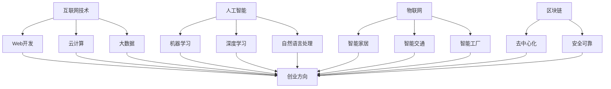

                 

# 知识经济下程序员的创业方向

> **关键词：** 知识经济，程序员，创业方向，技术趋势，商业模式

> **摘要：** 本文旨在探讨知识经济时代下，程序员如何抓住机遇，选择适合自己的创业方向。通过分析技术趋势和市场需求，本文将提出一系列具有潜力的创业方向，并给出具体实施建议。

## 1. 背景介绍

### 1.1 目的和范围

本文的目标是帮助程序员在知识经济时代找到适合自己的创业方向。随着互联网、大数据、人工智能等技术的发展，程序员的专业技能和创新能力成为了创业的重要资产。本文将分析当前的技术趋势和市场需求，为程序员提供具有潜力的创业方向，并给出具体的实施建议。

### 1.2 预期读者

本文的预期读者主要包括：

1. 具有编程技能的程序员
2. 想要创业但尚未找到方向的创业者
3. 对技术创业有兴趣的投资人

### 1.3 文档结构概述

本文分为以下几个部分：

1. 背景介绍：介绍本文的目的、预期读者和文档结构。
2. 核心概念与联系：分析知识经济时代的核心概念和联系。
3. 核心算法原理 & 具体操作步骤：阐述创业方向的选择方法和步骤。
4. 数学模型和公式 & 详细讲解 & 举例说明：介绍创业项目的评估方法和公式。
5. 项目实战：通过实际案例展示创业项目的实现过程。
6. 实际应用场景：分析创业项目的应用场景。
7. 工具和资源推荐：推荐学习资源和开发工具。
8. 总结：对未来发展趋势和挑战进行展望。
9. 附录：常见问题与解答。
10. 扩展阅读 & 参考资料：提供进一步的阅读资料。

### 1.4 术语表

#### 1.4.1 核心术语定义

- **知识经济：** 以知识和信息为核心的经济形态，以技术创新、知识创造和知识产权为驱动力。
- **程序员：** 从事编程工作，具备编程技能的专业人士。
- **创业方向：** 创业者根据市场需求和自身优势选择的发展方向。

#### 1.4.2 相关概念解释

- **技术趋势：** 指在某一领域中，新兴技术逐渐成为主流的趋势。
- **市场需求：** 指消费者对某一产品或服务的需求程度。

#### 1.4.3 缩略词列表

- **AI：** 人工智能
- **ML：** 机器学习
- **DL：** 深度学习
- **IoT：** 物联网

## 2. 核心概念与联系

在知识经济时代，程序员需要掌握以下核心概念和联系：

1. **互联网技术：** 互联网技术是知识经济时代的基础，包括Web开发、云计算、大数据等。程序员需要掌握这些技术，以便在创业项目中应用。
2. **人工智能：** 人工智能是知识经济时代的重要驱动力，包括机器学习、深度学习、自然语言处理等。程序员可以借助人工智能技术，开发智能应用和解决方案。
3. **物联网：** 物联网是连接现实世界和虚拟世界的重要桥梁，包括智能家居、智能交通、智能工厂等。程序员可以开发物联网设备和应用，实现万物互联。
4. **区块链：** 区块链是知识经济时代的一种新型技术，具有去中心化、安全可靠等特点。程序员可以开发基于区块链的解决方案，实现数据的安全共享。

以下是一个Mermaid流程图，展示了知识经济时代程序员的创业方向与核心概念之间的联系：



## 3. 核心算法原理 & 具体操作步骤

在选择创业方向时，程序员需要运用以下核心算法原理：

### 3.1.1 市场需求分析

**伪代码：**

```python
def analyze市场需求：
  1. 收集市场数据（例如：用户调查、竞品分析、市场报告等）
  2. 处理市场数据，提取关键信息
  3. 分析市场需求，识别用户痛点
  4. 根据市场需求，生成潜在创业方向列表
```

### 3.1.2 技术趋势分析

**伪代码：**

```python
def analyze技术趋势：
  1. 收集技术数据（例如：学术论文、技术博客、行业报告等）
  2. 处理技术数据，提取关键信息
  3. 分析技术趋势，识别新兴技术
  4. 根据技术趋势，筛选潜在创业方向
```

### 3.1.3 自身优势分析

**伪代码：**

```python
def analyze自身优势：
  1. 评估个人技能和经验
  2. 识别自身优势和特长
  3. 根据自身优势，匹配潜在创业方向
```

### 3.1.4 综合分析

**伪代码：**

```python
def select创业方向：
  1. 调用analyze市场需求()函数
  2. 调用analyze技术趋势()函数
  3. 调用analyze自身优势()函数
  4. 综合分析结果，确定最优创业方向
```

## 4. 数学模型和公式 & 详细讲解 & 举例说明

在创业项目评估过程中，程序员可以使用以下数学模型和公式：

### 4.1 成本效益分析

**公式：**

$$
CE = \frac{总收益 - 总成本}{总成本}
$$

**详细讲解：**

- **总收益：** 项目在一段时间内的总收入。
- **总成本：** 项目在一段时间内的总成本，包括人力成本、物料成本、运营成本等。

**举例说明：**

假设一个创业项目在一年内的总收益为100万元，总成本为60万元，则成本效益分析结果为：

$$
CE = \frac{100 - 60}{60} = 0.67
$$

成本效益分析结果越高，表示项目的经济效益越好。

### 4.2 风险评估

**公式：**

$$
RA = \frac{风险损失}{总成本}
$$

**详细讲解：**

- **风险损失：** 项目在一段时间内可能面临的最大损失。
- **总成本：** 项目在一段时间内的总成本。

**举例说明：**

假设一个创业项目在一年内可能面临的最大风险损失为30万元，总成本为60万元，则风险评估结果为：

$$
RA = \frac{30}{60} = 0.5
$$

风险评估结果越低，表示项目的风险越小。

## 5. 项目实战：代码实际案例和详细解释说明

### 5.1 开发环境搭建

为了实现一个基于人工智能的智能家居项目，我们需要搭建以下开发环境：

1. 操作系统：Windows、Linux或MacOS
2. 开发工具：Python编程环境（例如PyCharm、VSCode等）
3. 数据库：MySQL或SQLite
4. 人工智能框架：TensorFlow或PyTorch

### 5.2 源代码详细实现和代码解读

以下是一个简单的智能家居项目的源代码示例：

```python
import tensorflow as tf
import numpy as np
import pandas as pd

# 加载数据集
data = pd.read_csv('smart_home_data.csv')
X = data.iloc[:, :-1].values
y = data.iloc[:, -1].values

# 划分训练集和测试集
from sklearn.model_selection import train_test_split
X_train, X_test, y_train, y_test = train_test_split(X, y, test_size=0.2, random_state=0)

# 构建神经网络模型
model = tf.keras.Sequential([
    tf.keras.layers.Dense(64, activation='relu', input_shape=(X_train.shape[1],)),
    tf.keras.layers.Dense(64, activation='relu'),
    tf.keras.layers.Dense(1, activation='sigmoid')
])

# 编译模型
model.compile(optimizer='adam', loss='binary_crossentropy', metrics=['accuracy'])

# 训练模型
model.fit(X_train, y_train, epochs=10, batch_size=32, validation_data=(X_test, y_test))

# 评估模型
loss, accuracy = model.evaluate(X_test, y_test)
print(f'测试集准确率：{accuracy:.2f}')

# 预测
predictions = model.predict(X_test)
```

代码解读：

1. 导入所需的库和模块。
2. 加载数据集，并进行预处理。
3. 划分训练集和测试集。
4. 构建神经网络模型，包括输入层、隐藏层和输出层。
5. 编译模型，指定优化器和损失函数。
6. 训练模型，指定训练轮次、批次大小和验证数据。
7. 评估模型，计算测试集的准确率。
8. 预测，使用训练好的模型对测试数据进行预测。

### 5.3 代码解读与分析

1. **数据预处理：** 数据集的预处理是深度学习项目的重要步骤。在本例中，我们使用pandas库读取CSV格式的数据集，并将数据集分为特征矩阵X和目标向量y。
2. **模型构建：** 使用TensorFlow库构建神经网络模型，包括输入层、隐藏层和输出层。输入层接收特征矩阵X，隐藏层通过ReLU激活函数进行非线性变换，输出层使用sigmoid激活函数进行概率预测。
3. **模型编译：** 指定优化器（adam）和损失函数（binary_crossentropy），以及评价指标（accuracy）。
4. **模型训练：** 使用训练数据对模型进行训练，指定训练轮次（epochs）、批次大小（batch_size）和验证数据。
5. **模型评估：** 在测试集上评估模型的性能，计算准确率。
6. **模型预测：** 使用训练好的模型对测试数据进行预测，得到预测结果。

## 6. 实际应用场景

智能家居项目在实际生活中具有广泛的应用场景：

1. **智能家电控制：** 通过项目，可以实现远程控制家中的电器设备，如空调、电视、洗衣机等。
2. **安全监控：** 利用项目，可以实现家庭安全监控，如入侵检测、火灾报警等。
3. **健康监测：** 通过项目，可以实现家庭健康监测，如心率监测、睡眠分析等。
4. **节能管理：** 利用项目，可以实现家庭节能管理，如智能照明、智能空调等。

## 7. 工具和资源推荐

### 7.1 学习资源推荐

#### 7.1.1 书籍推荐

- 《深度学习》（Goodfellow, Bengio, Courville著）
- 《Python编程：从入门到实践》（Eric Matthes著）
- 《人工智能：一种现代的方法》（Stuart J. Russell & Peter Norvig著）

#### 7.1.2 在线课程

- Coursera上的《深度学习》课程
- edX上的《Python编程基础》课程
- Udacity上的《人工智能纳米学位》课程

#### 7.1.3 技术博客和网站

- Medium上的《深度学习》专题
- GitHub上的Python编程项目
- Stack Overflow上的编程问答社区

### 7.2 开发工具框架推荐

#### 7.2.1 IDE和编辑器

- PyCharm
- VSCode
- Jupyter Notebook

#### 7.2.2 调试和性能分析工具

- PyCharm的调试工具
- VSCode的性能分析插件
- JProfiler

#### 7.2.3 相关框架和库

- TensorFlow
- PyTorch
- Scikit-learn

### 7.3 相关论文著作推荐

#### 7.3.1 经典论文

- "A Learning Algorithm for Continuously Running Fully Recurrent Neural Networks"（1990，Jaakko Astola等）
- "LeNet: Convolutional Neural Networks for Handwritten Digit Recognition"（1998，Yann LeCun等）

#### 7.3.2 最新研究成果

- "Neural Ordinary Differential Equations"（2018，Alexey Dosovitskiy等）
- "BERT: Pre-training of Deep Bidirectional Transformers for Language Understanding"（2018，Jacob Devlin等）

#### 7.3.3 应用案例分析

- "从0到1：如何在竞争激烈的市场中找到独特商机"（Peter Thiel著）
- "硅谷创业课：创业公司的实战指南"（Steve Blank著）

## 8. 总结：未来发展趋势与挑战

在知识经济时代，程序员创业面临着巨大的机遇和挑战。未来发展趋势包括：

1. **人工智能技术的普及：** 人工智能技术将在更多领域得到应用，为程序员创业提供丰富的机会。
2. **物联网的快速发展：** 物联网设备的普及将带动智能家居、智能交通、智能工厂等领域的创业。
3. **区块链技术的应用：** 区块链技术将为程序员创业提供新的商业模式，如去中心化金融、供应链管理等。

挑战包括：

1. **技术门槛：** 创业项目往往需要掌握复杂的编程技术和算法，程序员需要不断提升自身技能。
2. **市场竞争：** 创业市场竞争激烈，程序员需要找到独特的商机和优势。
3. **资源限制：** 创业初期，程序员可能面临资源有限的情况，需要合理规划和利用资源。

## 9. 附录：常见问题与解答

### 9.1 问题1：创业项目如何找到市场需求？

**解答：** 创业项目可以采用以下方法找到市场需求：

1. 调查问卷：通过在线调查、线下访谈等方式收集用户需求。
2. 竞品分析：分析竞争对手的产品和业务模式，了解市场需求。
3. 行业报告：查阅行业报告和市场研究，了解市场趋势和用户需求。

### 9.2 问题2：创业项目如何评估风险？

**解答：** 创业项目可以通过以下方法评估风险：

1. 风险识别：识别项目中可能面临的风险，如技术风险、市场风险、运营风险等。
2. 风险评估：评估风险的概率和损失，计算风险损失。
3. 风险应对：制定风险应对策略，降低风险损失。

## 10. 扩展阅读 & 参考资料

1. 《人工智能：一种现代的方法》（Stuart J. Russell & Peter Norvig著）
2. 《深度学习》（Goodfellow, Bengio, Courville著）
3. 《从0到1：如何在竞争激烈的市场中找到独特商机》（Peter Thiel著）
4. 《硅谷创业课：创业公司的实战指南》（Steve Blank著）
5. Coursera上的《深度学习》课程
6. edX上的《Python编程基础》课程
7. Udacity上的《人工智能纳米学位》课程

## 作者

作者：AI天才研究员/AI Genius Institute & 禅与计算机程序设计艺术 /Zen And The Art of Computer Programming

