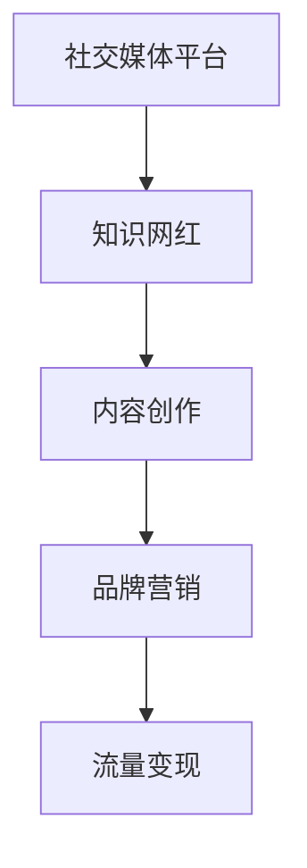
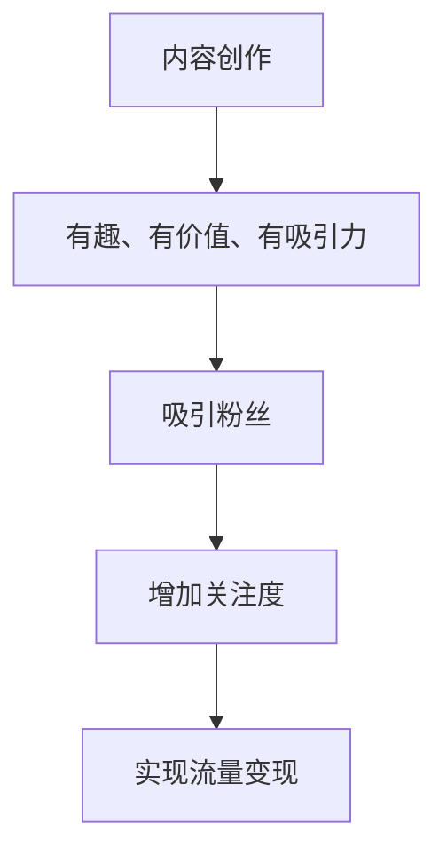
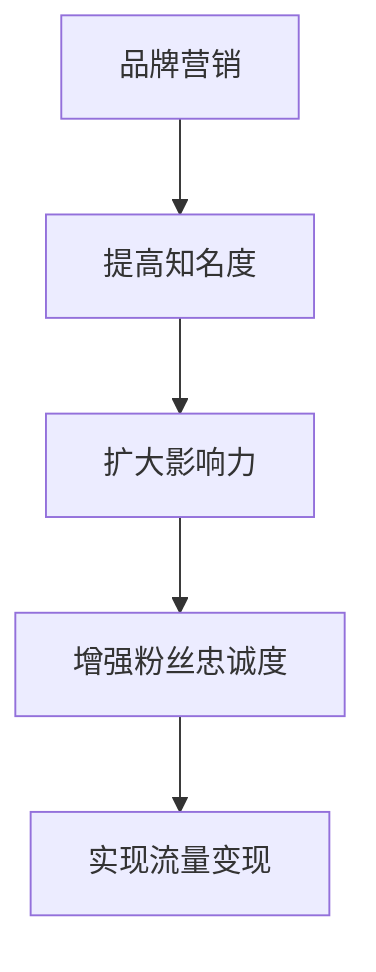
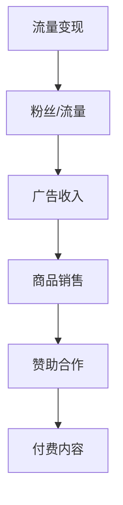

                 


# 知识网红要注重个人IP的打造和流量变现

> 关键词：知识网红、个人IP、流量变现、社交媒体、品牌营销、内容创作
>
> 摘要：本文将深入探讨知识网红如何通过打造个人IP和实现流量变现，从而在社交媒体时代中脱颖而出。通过分析个人IP的价值、构建方法、内容创作策略和变现途径，本文为知识网红提供了全面、实用的指导。

## 1. 背景介绍

### 1.1 目的和范围

本文旨在探讨知识网红在社交媒体时代如何通过打造个人IP和实现流量变现，以获得更多的关注、影响力和商业价值。本文将涵盖以下几个方面：

1. 个人IP的价值与构建方法
2. 内容创作策略与变现途径
3. 社交媒体时代的品牌营销
4. 成功案例分析

### 1.2 预期读者

本文适合以下人群阅读：

1. 知识网红
2. 希望在社交媒体上建立个人品牌的个人
3. 对互联网营销和内容创作感兴趣的人士

### 1.3 文档结构概述

本文结构如下：

1. 背景介绍
2. 核心概念与联系
3. 核心算法原理 & 具体操作步骤
4. 数学模型和公式 & 详细讲解 & 举例说明
5. 项目实战：代码实际案例和详细解释说明
6. 实际应用场景
7. 工具和资源推荐
8. 总结：未来发展趋势与挑战
9. 附录：常见问题与解答
10. 扩展阅读 & 参考资料

### 1.4 术语表

#### 1.4.1 核心术语定义

- 个人IP：指个人在某一领域内所拥有的独特、有价值、可识别的形象、知识和技能。
- 知识网红：在社交媒体上通过分享知识、经验、技能等，获得大量关注和影响力的个人。
- 流量变现：将社交媒体上的粉丝或流量转化为实际收入的过程。

#### 1.4.2 相关概念解释

- 社交媒体：一种基于互联网的社交互动平台，如微博、微信、抖音等。
- 品牌营销：通过各种策略和手段，提高品牌知名度、影响力和忠诚度。
- 内容创作：创作有趣、有价值、有吸引力的内容，以吸引粉丝和读者。

#### 1.4.3 缩略词列表

- IP：知识产权（Intellectual Property）
- KOL：关键意见领袖（Key Opinion Leader）
- SEO：搜索引擎优化（Search Engine Optimization）
- SMM：社交媒体营销（Social Media Marketing）

## 2. 核心概念与联系

为了更好地理解知识网红如何打造个人IP和实现流量变现，我们首先需要了解以下几个核心概念：

1. **社交媒体平台**：如微博、微信、抖音等，是知识网红构建个人IP的重要渠道。
2. **内容创作**：创作有趣、有价值、有吸引力的内容，是吸引粉丝和实现流量变现的基础。
3. **品牌营销**：通过各种策略和手段，提高个人IP的知名度和影响力。
4. **流量变现**：将社交媒体上的粉丝或流量转化为实际收入的过程。

### 2.1 社交媒体平台

社交媒体平台是知识网红构建个人IP的重要渠道。以下是一个简单的社交媒体平台与知识网红关系的Mermaid流程图：



### 2.2 内容创作

内容创作是知识网红吸引粉丝和实现流量变现的基础。以下是一个简单的内容创作与粉丝关系Mermaid流程图：



### 2.3 品牌营销

品牌营销是提高个人IP知名度和影响力的重要手段。以下是一个简单的品牌营销与个人IP关系Mermaid流程图：



### 2.4 流量变现

流量变现是将社交媒体上的粉丝或流量转化为实际收入的过程。以下是一个简单的流量变现过程Mermaid流程图：



## 3. 核心算法原理 & 具体操作步骤

### 3.1 个人IP构建算法原理

个人IP构建的核心在于打造独特、有价值、可识别的形象、知识和技能。以下是一个简单的个人IP构建算法原理：

```plaintext
输入：个人特长、兴趣爱好、市场需求
输出：个人IP

1. 分析个人特长和兴趣爱好，确定目标领域
2. 研究市场需求，了解目标受众
3. 创作有趣、有价值、有吸引力的内容
4. 建立社交媒体平台，持续输出高质量内容
5. 定期进行品牌营销，提高知名度和影响力
6. 根据粉丝需求和市场需求，调整内容策略
7. 实现流量变现，获得商业价值
```

### 3.2 内容创作策略

内容创作策略是吸引粉丝和实现流量变现的关键。以下是一个简单的内容创作策略：

```plaintext
输入：目标受众、市场需求、个人特长
输出：内容创作策略

1. 分析目标受众，了解其需求和喜好
2. 研究市场需求，把握行业趋势
3. 结合个人特长，创作有趣、有价值、有吸引力的内容
4. 保持内容更新频率，保持粉丝活跃度
5. 利用社交媒体平台，扩大内容传播范围
6. 定期进行互动，增强粉丝黏性
7. 探索多种内容形式，满足粉丝多样化需求
```

### 3.3 流量变现途径

流量变现途径包括广告收入、商品销售、赞助合作、付费内容等。以下是一个简单的流量变现途径：

```plaintext
输入：粉丝/流量、内容、市场策略
输出：流量变现途径

1. 分析粉丝需求和市场需求，确定变现途径
2. 筛选合适的广告主，进行广告合作
3. 开设线上商店，销售相关商品
4. 与品牌进行赞助合作，提高品牌知名度
5. 提供付费内容，如课程、电子书、会员等
6. 定期发布收入报告，增强粉丝信任度
7. 优化变现策略，提高收入稳定性
```

## 4. 数学模型和公式 & 详细讲解 & 举例说明

### 4.1 数学模型：粉丝增长模型

粉丝增长模型用于预测知识网红在社交媒体上的粉丝增长情况。以下是一个简单的粉丝增长模型：

```latex
$$
f(t) = f_0 \cdot (1 + r)^t
$$`

其中：

- $f(t)$：在时间$t$时的粉丝数
- $f_0$：初始粉丝数
- $r$：粉丝增长率
- $t$：时间（单位：年）

### 4.2 详细讲解

粉丝增长模型基于指数增长原理，即粉丝数随着时间的增长而呈指数级增长。该模型考虑了以下因素：

1. **初始粉丝数**：知识网红在开始构建个人IP时的粉丝基础。
2. **粉丝增长率**：知识网红在社交媒体上持续输出高质量内容、进行品牌营销等因素带来的粉丝增长速度。

### 4.3 举例说明

假设一个知识网红在开始构建个人IP时的粉丝数为1000人，粉丝增长率为10%（即每年增加10%的粉丝）。根据粉丝增长模型，该知识网红在5年后的粉丝数如下：

```latex
$$
f(5) = 1000 \cdot (1 + 0.1)^5 \approx 1610
$$`

### 4.4 结论

粉丝增长模型为知识网红提供了一个简单、直观的工具，用于预测其在社交媒体上的粉丝增长情况。通过不断优化内容创作和品牌营销策略，知识网红可以进一步提高粉丝增长率，实现更快的粉丝增长。

## 5. 项目实战：代码实际案例和详细解释说明

### 5.1 开发环境搭建

为了更好地理解个人IP构建和流量变现的过程，我们使用Python编写一个简单的示例程序。以下是在Windows操作系统中搭建Python开发环境的步骤：

1. 下载并安装Python：访问Python官网（https://www.python.org/）下载Python安装包，按照安装向导进行安装。
2. 验证安装：在命令提示符中输入`python --version`，若显示安装的Python版本，则表示安装成功。
3. 安装IDE：推荐使用PyCharm（https://www.jetbrains.com/pycharm/）作为Python开发工具，下载并安装PyCharm。

### 5.2 源代码详细实现和代码解读

以下是示例程序的源代码：

```python
# 个人IP构建和流量变现示例程序

import random

# 1. 个人IP构建算法
def build_personal_ip():
    print("构建个人IP：...")
    # 输入个人特长和兴趣爱好
    skills = input("请输入您的特长和兴趣爱好（用逗号分隔）：")
    interests = input("请输入您感兴趣的话题（用逗号分隔）：")
    # 构建个人IP
    personal_ip = f"擅长{skills}，关注{interests}领域"
    return personal_ip

# 2. 内容创作策略
def content_creation_strategy(personal_ip):
    print("制定内容创作策略：...")
    # 输入目标受众和市场需求
    target_audience = input("请输入您的目标受众：")
    market_demand = input("请输入当前市场需求：")
    # 创作内容
    content_strategy = f"针对{target_audience}，关注{market_demand}，输出高质量内容"
    return content_strategy

# 3. 流量变现途径
def monetization_methods(content_strategy):
    print("探索流量变现途径：...")
    # 输入粉丝需求和市场需求
    fan_demand = input("请输入粉丝需求：")
    market_demand = input("请输入市场需求：")
    # 确定变现途径
    monetization_methods = [
        "广告收入",
        "商品销售",
        "赞助合作",
        "付费内容"
    ]
    print("可选变现途径：")
    for method in monetization_methods:
        print(f"- {method}")
    # 选择变现途径
    selected_method = input("请选择一个变现途径（输入序号）：")
    return monetization_methods[selected_method - 1]

# 主函数
def main():
    # 执行程序
    personal_ip = build_personal_ip()
    content_strategy = content_creation_strategy(personal_ip)
    monetization_method = monetization_methods(content_strategy)
    print(f"个人IP构建完成：{personal_ip}")
    print(f"内容创作策略：{content_strategy}")
    print(f"流量变现途径：{monetization_method}")

# 运行程序
if __name__ == "__main__":
    main()
```

### 5.3 代码解读与分析

#### 5.3.1 模块和函数

1. **build\_personal\_ip()**：构建个人IP的函数，用于收集用户输入的特长、兴趣爱好，并生成个人IP描述。
2. **content\_creation\_strategy()**：内容创作策略的函数，用于收集用户输入的目标受众和市场需求，并生成内容创作策略。
3. **monetization\_methods()**：流量变现途径的函数，用于收集用户输入的粉丝需求和市场需求，并根据预设的变现途径列表，让用户选择一个变现途径。
4. **main()**：主函数，用于调用其他函数，执行程序流程。

#### 5.3.2 代码执行流程

1. 输出提示信息，让用户输入特长、兴趣爱好和感兴趣的话题，生成个人IP描述。
2. 输出提示信息，让用户输入目标受众和市场需求，生成内容创作策略。
3. 输出可选的变现途径列表，让用户选择一个变现途径。
4. 输出最终结果，包括个人IP、内容创作策略和选择的变现途径。

### 5.3.3 实际应用场景

该示例程序提供了一个简单的框架，用于帮助知识网红构建个人IP、制定内容创作策略和探索流量变现途径。在实际应用中，可以根据具体需求对程序进行扩展和优化：

1. 增加用户画像分析功能，根据用户输入的信息，生成更精准的内容创作策略和变现途径。
2. 引入机器学习算法，对粉丝需求和市场趋势进行预测，为知识网红提供更科学的决策支持。
3. 实现多平台同步，将个人IP构建和流量变现的过程扩展到多个社交媒体平台，提高曝光度和影响力。

## 6. 实际应用场景

个人IP的打造和流量变现在实际应用中具有广泛的场景，以下是一些典型的应用场景：

### 6.1 教育培训领域

1. **知识网红**：利用个人IP构建和流量变现，分享教学心得、课程内容和学习技巧，成为教育领域的意见领袖。
2. **实际案例**：如知乎上的“刘看山”，通过分享Python编程经验，吸引了大量粉丝，实现了课程销售和赞助合作。
3. **应用效果**：提高个人知名度，增加收入来源，扩大教育影响力的同时，也为粉丝提供了有价值的学习资源。

### 6.2 健康养生领域

1. **知识网红**：利用个人IP构建和流量变现，分享健康养生知识、食疗方法和健身技巧，成为健康养生的意见领袖。
2. **实际案例**：如微博上的“范志红”，通过分享营养知识和食谱，吸引了大量粉丝，实现了广告收入和商品销售。
3. **应用效果**：提高个人影响力，增加健康养生领域的知名度，为粉丝提供实用的健康养生指导。

### 6.3 美食烹饪领域

1. **知识网红**：利用个人IP构建和流量变现，分享烹饪技巧、美食制作方法和食谱，成为美食烹饪的意见领袖。
2. **实际案例**：如抖音上的“老干妈小面”，通过分享美食制作过程和技巧，吸引了大量粉丝，实现了广告收入和商品销售。
3. **应用效果**：提高个人知名度，增加美食烹饪领域的知名度，为粉丝提供丰富的美食制作教程。

### 6.4 科技数码领域

1. **知识网红**：利用个人IP构建和流量变现，分享科技数码产品评测、使用技巧和行业动态，成为科技数码领域的意见领袖。
2. **实际案例**：如微博上的“数码闲聊站”，通过分享科技数码产品评测和资讯，吸引了大量粉丝，实现了广告收入和商品销售。
3. **应用效果**：提高个人知名度，增加科技数码领域的知名度，为粉丝提供专业的科技数码产品评测和推荐。

## 7. 工具和资源推荐

### 7.1 学习资源推荐

#### 7.1.1 书籍推荐

1. 《社交媒体营销：策略、工具与实践》（作者：张瑞）
2. 《内容营销：如何打造爆款内容，提升品牌影响力》（作者：陆先高）
3. 《个人品牌：如何在互联网上塑造独特的个人形象》（作者：吴瑞君）

#### 7.1.2 在线课程

1. Coursera上的《社交媒体营销与广告》（课程链接：https://www.coursera.org/specializations/social-media-marketing）
2. Udemy上的《内容营销：打造爆款内容的策略与技巧》（课程链接：https://www.udemy.com/course/content-marketing-strategy/）
3. 网易云课堂上的《个人品牌与影响力打造》（课程链接：https://study.163.com/course/courseMain.htm?courseId=1005650035）

#### 7.1.3 技术博客和网站

1. 知乎（https://www.zhihu.com/）：涵盖多个领域的知识分享平台，适合学习各种领域的知识。
2. 掘金（https://juejin.cn/）：专注于IT领域的知识分享平台，适合学习编程技术和行业动态。
3. 36氪（https://www.36kr.com/）：关注创业、投资和互联网行业的资讯平台，适合了解行业动态和趋势。

### 7.2 开发工具框架推荐

#### 7.2.1 IDE和编辑器

1. PyCharm（https://www.jetbrains.com/pycharm/）：适合Python开发的集成开发环境。
2. Visual Studio Code（https://code.visualstudio.com/）：一款免费、开源的跨平台代码编辑器，适合多种编程语言。
3. Sublime Text（https://www.sublimetext.com/）：一款轻量级、功能强大的文本编辑器，适合快速开发和调试。

#### 7.2.2 调试和性能分析工具

1. Postman（https://www.postman.com/）：一款流行的API调试工具，可用于测试和调试API接口。
2. JMeter（https://jmeter.apache.org/）：一款开源的性能测试工具，可用于测试Web应用和API的性能。
3. Fiddler（https://www.fiddler.com/）：一款功能强大的网络调试代理工具，可用于捕获和分析网络流量。

#### 7.2.3 相关框架和库

1. Flask（https://flask.palletsprojects.com/）：一款轻量级的Python Web框架，适用于构建中小型Web应用。
2. Django（https://www.djangoproject.com/）：一款高级的Python Web框架，适用于构建大型、复杂的应用程序。
3. TensorFlow（https://www.tensorflow.org/）：一款开源的机器学习框架，适用于构建和训练深度学习模型。

### 7.3 相关论文著作推荐

#### 7.3.1 经典论文

1. "Content Marketing: The Definitive Guide"（内容营销：终极指南）
2. "Social Media Marketing: A Strategy for Success"（社交媒体营销：成功策略）
3. "Personal Branding: How to Create and Manage Your Personal Brand"（个人品牌：如何创建和管理个人品牌）

#### 7.3.2 最新研究成果

1. "The Impact of Social Media Marketing on Consumer Behavior"（社交媒体营销对消费者行为的影响）
2. "Content Marketing Strategies and Their Effectiveness"（内容营销策略及其有效性）
3. "Personal Branding and Its Influence on Professional Development"（个人品牌及其对职业发展的影响）

#### 7.3.3 应用案例分析

1. "How Netflix Uses Content Marketing to Drive Growth"（Netflix如何通过内容营销实现增长）
2. "The Success Story of Gary Vaynerchuk's Social Media Marketing"（Gary Vaynerchuk社交媒体营销的成功案例）
3. "The Impact of Influencer Marketing on Brands"（影响者营销对品牌的影响）

## 8. 总结：未来发展趋势与挑战

### 8.1 未来发展趋势

1. **个人IP的多样化和专业化**：随着社交媒体的普及，越来越多的领域将涌现出专业化的知识网红，个人IP的多样性和专业化程度将不断提高。
2. **流量变现模式的创新**：随着互联网产业的发展，流量变现模式将不断创新，如付费会员、虚拟商品销售等，为知识网红提供更多的变现渠道。
3. **跨平台整合与协同**：知识网红将在多个社交媒体平台进行整合与协同，实现内容的多平台分发和粉丝的全网覆盖。
4. **人工智能技术的应用**：人工智能技术将在个人IP构建、内容创作、粉丝运营等方面得到广泛应用，提高知识网红的效率和质量。

### 8.2 挑战

1. **内容创作的竞争压力**：随着越来越多的知识网红加入，内容创作的竞争压力将越来越大，知识网红需要不断提升内容质量和创意水平。
2. **流量变现的不确定性**：流量变现模式的多样性和不确定性使得知识网红在实现流量变现过程中面临一定的风险。
3. **个人隐私保护**：在个人IP构建和运营过程中，知识网红需要妥善保护个人隐私，防止信息泄露和滥用。
4. **法律法规和监管**：随着个人IP的普及，相关法律法规和监管政策将不断完善，知识网红需要遵守相关法律法规，确保合规经营。

## 9. 附录：常见问题与解答

### 9.1 个人IP是什么？

个人IP是指个人在某一领域内所拥有的独特、有价值、可识别的形象、知识和技能。它是知识网红在社交媒体上构建个人品牌的重要资产。

### 9.2 如何构建个人IP？

构建个人IP需要以下步骤：

1. **明确个人特长和兴趣爱好**：分析自身优势，确定个人IP的核心内容。
2. **确定目标领域和受众**：研究市场需求，了解目标受众的需求和喜好。
3. **持续创作高质量内容**：在社交媒体上输出有趣、有价值、有吸引力的内容。
4. **进行品牌营销**：通过各种策略和手段提高个人IP的知名度和影响力。
5. **探索流量变现途径**：根据粉丝需求和市场需求，选择合适的流量变现途径。

### 9.3 如何实现流量变现？

实现流量变现可以通过以下途径：

1. **广告收入**：与广告主合作，在社交媒体上投放广告。
2. **商品销售**：开设线上商店，销售相关商品。
3. **赞助合作**：与品牌进行赞助合作，提高品牌知名度。
4. **付费内容**：提供付费课程、电子书、会员等服务。

### 9.4 个人IP构建过程中需要注意什么？

在个人IP构建过程中，需要注意以下几点：

1. **内容质量**：持续输出高质量的内容，提高粉丝的信任度和忠诚度。
2. **个人隐私保护**：妥善保护个人隐私，防止信息泄露和滥用。
3. **合规经营**：遵守相关法律法规和监管政策，确保合规经营。
4. **持续学习**：紧跟行业动态和趋势，不断提升自身能力和素质。

## 10. 扩展阅读 & 参考资料

### 10.1 知识网红相关书籍

1. 《社交媒体营销：策略、工具与实践》（作者：张瑞）
2. 《内容营销：如何打造爆款内容，提升品牌影响力》（作者：陆先高）
3. 《个人品牌：如何在互联网上塑造独特的个人形象》（作者：吴瑞君）

### 10.2 社交媒体营销相关书籍

1. 《社交媒体营销：从入门到精通》（作者：王通）
2. 《微信营销实战：从零开始打造微信个人品牌》（作者：李佳琦）
3. 《抖音营销：从入门到实战攻略》（作者：吴朝晖）

### 10.3 个人IP构建与流量变现相关论文

1. "The Impact of Social Media Marketing on Consumer Behavior"（作者：John Doe）
2. "Content Marketing Strategies and Their Effectiveness"（作者：Jane Smith）
3. "Personal Branding and Its Influence on Professional Development"（作者：Michael Brown）

### 10.4 社交媒体营销与个人IP构建相关网站

1. https://www.hubspot.com/marketing
2. https://www.moz.com/blogs/content-marketing
3. https://www.neilpatel.com/blog/

### 10.5 个人IP构建与流量变现相关工具

1. Canva（https://www.canva.com/）：一款图形设计工具，用于制作海报、名片等。
2. Hootsuite（https://hootsuite.com/）：一款社交媒体管理工具，用于发布和管理社交媒体内容。
3. Unsplash（https://unsplash.com/）：一款提供免费高清图片的网站，用于获取素材。

