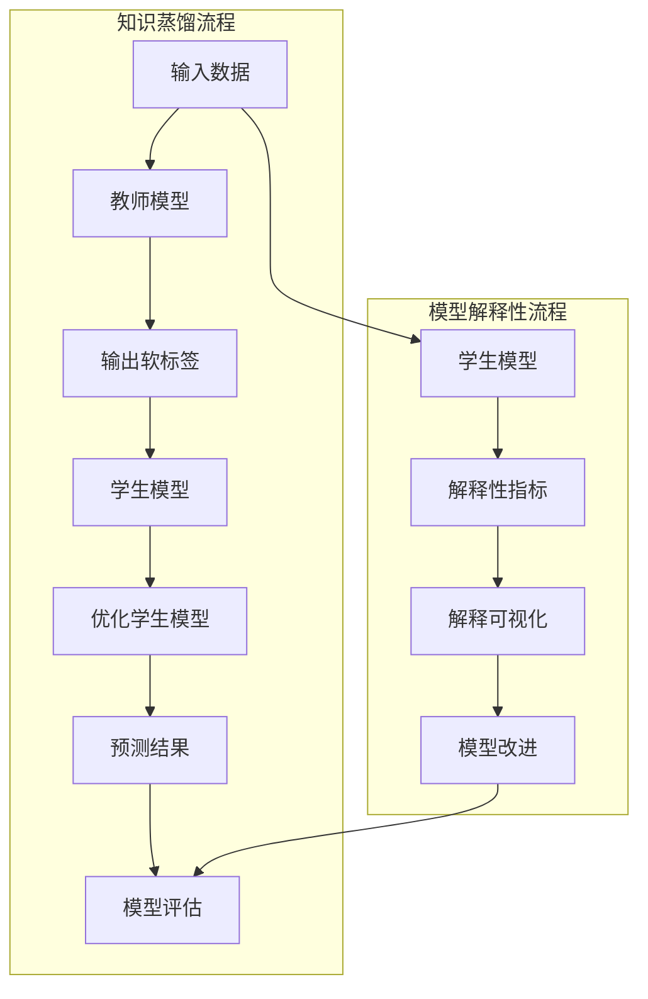

                 

### 1. 背景介绍

#### 1.1 目的和范围

本文旨在探讨知识蒸馏（Knowledge Distillation）与模型解释性（Model Explainability）的深度融合，分析其在现代人工智能领域的广泛应用和未来发展趋势。知识蒸馏作为一种模型压缩和优化技术，通过将大型教师模型（Teacher Model）的知识传递给较小或更轻量级的学生模型（Student Model），实现了对计算资源和存储空间的显著节省。与此同时，模型解释性在提高模型的透明度、可解释性和可信任度方面发挥着至关重要的作用。

本文将首先介绍知识蒸馏和模型解释性的基本概念和原理，接着分析这两者在现有技术中的应用情况，然后通过具体的算法原理和数学模型讲解，详细阐述知识蒸馏与模型解释性的深度融合技术。此外，本文还将通过一个实际项目案例，展示如何将知识蒸馏与模型解释性相结合，实现模型压缩的同时保持高解释性。

本文的目标读者为对人工智能和机器学习有深入研究的专业人士，以及对模型压缩和解释性技术感兴趣的研究生和学者。通过本文的阅读，读者将能够了解知识蒸馏和模型解释性的核心原理，掌握深度融合技术的具体实现方法，并能够为实际项目中的模型优化和解释提供指导。

#### 1.2 预期读者

预期读者应具备以下背景知识：

- 人工智能和机器学习的基本概念和原理
- 深度学习模型的构建和优化
- 模型压缩和蒸馏技术的基本了解
- 模型解释性相关技术的研究和应用

通过本文的阅读，读者将能够：

- 理解知识蒸馏和模型解释性的基本概念及其重要性
- 掌握知识蒸馏与模型解释性的深度融合技术
- 了解如何在实际项目中应用这些技术，实现模型的优化和解释
- 拓展对人工智能前沿领域的认知，提高解决实际问题的能力

#### 1.3 文档结构概述

本文分为十个主要部分，结构如下：

1. 背景介绍
    - 1.1 目的和范围
    - 1.2 预期读者
    - 1.3 文档结构概述
    - 1.4 术语表
2. 核心概念与联系
    - 2.1 知识蒸馏
    - 2.2 模型解释性
    - 2.3 Mermaid 流程图
3. 核心算法原理 & 具体操作步骤
    - 3.1 算法原理
    - 3.2 操作步骤
4. 数学模型和公式 & 详细讲解 & 举例说明
    - 4.1 数学模型
    - 4.2 公式讲解
    - 4.3 举例说明
5. 项目实战：代码实际案例和详细解释说明
    - 5.1 开发环境搭建
    - 5.2 源代码详细实现和代码解读
    - 5.3 代码解读与分析
6. 实际应用场景
7. 工具和资源推荐
    - 7.1 学习资源推荐
    - 7.2 开发工具框架推荐
    - 7.3 相关论文著作推荐
8. 总结：未来发展趋势与挑战
9. 附录：常见问题与解答
10. 扩展阅读 & 参考资料

#### 1.4 术语表

本文中涉及的一些重要术语和概念如下：

- **知识蒸馏（Knowledge Distillation）**：一种模型压缩技术，通过将教师模型（Teacher Model）的知识传递给学生模型（Student Model），实现模型参数的压缩和优化。
- **模型解释性（Model Explainability）**：指模型在决策过程中能够提供解释，使得模型的行为变得透明和可理解。
- **教师模型（Teacher Model）**：在知识蒸馏过程中，较大的、性能优异的模型，通常用于指导学生模型的学习。
- **学生模型（Student Model）**：在知识蒸馏过程中，较小或轻量级的模型，其目标是学习教师模型的内部知识。
- **软标签（Soft Labels）**：教师模型输出的概率分布，用于指导学生模型的学习。
- **解释性指标（Explainability Metrics）**：用于评估模型解释性能的指标，如注意力权重、梯度重要性等。

#### 1.4.1 核心术语定义

- **知识蒸馏**：知识蒸馏是一种将大型教师模型的知识传递给较小或更轻量级的学生模型的技术。在这一过程中，教师模型通常是一个训练有素的深度学习模型，而学生模型是一个需要优化的轻量级模型。通过使用教师模型的输出（如概率分布），学生模型学习到如何进行预测，从而保留教师模型的大部分性能。

- **模型解释性**：模型解释性指的是模型在决策过程中能够提供解释的能力。这对于提高模型的透明度和可信任度至关重要。一个具有良好解释性的模型能够明确地展示其决策过程，使得非专业人士也能够理解和验证其行为。

- **软标签**：在知识蒸馏过程中，教师模型的输出概率分布称为软标签。这些软标签提供了关于输入数据潜在类别的信息，并且通常用于指导学生模型的学习。通过最小化学生模型预测的输出与教师模型软标签之间的差距，可以优化学生模型以接近教师模型的表现。

- **注意力权重**：注意力机制在深度学习模型中用于强调某些输入特征的重要性。注意力权重表示模型在处理输入数据时对各个特征的注意力程度。通过分析注意力权重，可以揭示模型关注的关键特征，从而提高模型的可解释性。

- **梯度重要性**：梯度重要性是一种评估模型中各个神经元对输出贡献的方法。通过计算神经元在训练过程中的梯度变化，可以确定哪些神经元对模型的预测具有较大的影响。这种方法有助于理解模型的内部结构和决策过程。

#### 1.4.2 相关概念解释

- **深度神经网络（DNN）**：深度神经网络是一种多层神经网络，由多个隐藏层组成。通过堆叠多个隐藏层，DNN能够学习复杂的函数关系。深度神经网络的广泛使用使得机器学习在图像识别、语音识别和自然语言处理等领域取得了显著进展。

- **卷积神经网络（CNN）**：卷积神经网络是一种专门用于处理图像数据的深度学习模型。CNN通过卷积层、池化层和全连接层等结构，有效地提取图像的特征。CNN在计算机视觉领域取得了突破性成果，广泛应用于图像分类、目标检测和图像分割等任务。

- **循环神经网络（RNN）**：循环神经网络是一种处理序列数据的神经网络。RNN通过记忆单元（如门控循环单元（GRU）和长短期记忆（LSTM）单元）保留序列的历史信息，从而对序列数据进行建模。RNN在自然语言处理、语音识别和时间序列预测等领域表现出色。

- **注意力机制**：注意力机制是一种用于增强神经网络处理能力的技术。通过注意力机制，模型能够关注输入数据中最重要的部分，从而提高模型的性能。注意力机制广泛应用于各种任务，如机器翻译、图像识别和推荐系统。

- **模型压缩**：模型压缩是一种通过减少模型参数数量和计算复杂度来降低模型大小的技术。模型压缩有助于减轻计算资源和存储空间的压力，提高模型的部署效率。常见的模型压缩技术包括知识蒸馏、剪枝和量化等。

#### 1.4.3 缩略词列表

- **DNN**：深度神经网络（Deep Neural Network）
- **CNN**：卷积神经网络（Convolutional Neural Network）
- **RNN**：循环神经网络（Recurrent Neural Network）
- **GRU**：门控循环单元（Gated Recurrent Unit）
- **LSTM**：长短期记忆（Long Short-Term Memory）
- **GAN**：生成对抗网络（Generative Adversarial Network）
- **KD**：知识蒸馏（Knowledge Distillation）
- **EXPLAIN**：模型解释性（Model Explainability）
- **softmax**：softmax函数（Softmax Function）
- **CE**：交叉熵（Cross Entropy）

在接下来的章节中，我们将进一步探讨知识蒸馏和模型解释性的核心概念、原理及其深度融合的应用。通过详细的讲解和实际案例，读者将能够深入了解这两项技术，并在未来的研究和项目中充分发挥其潜力。

### 2. 核心概念与联系

在深入探讨知识蒸馏和模型解释性之前，首先需要理解它们的基本概念及其相互关系。知识蒸馏和模型解释性虽然源于不同的研究领域，但在提升深度学习模型的性能和可解释性方面，它们有紧密的联系和互补作用。

#### 2.1 知识蒸馏

知识蒸馏是一种通过小型化模型学习大模型知识的技术，其核心思想是将复杂、高参数数量的教师模型（Teacher Model）的知识传递给一个较小、更轻量化的学生模型（Student Model）。这种传递过程通常涉及两个主要步骤：

1. **软标签生成**：教师模型对给定的输入数据进行预测，并输出一个概率分布，即软标签。这些软标签包含了关于输入数据潜在类别的丰富信息。

2. **学生模型学习**：学生模型通过优化其参数，使得其输出的概率分布与教师模型的软标签尽可能接近。这一过程通常通过设计特定的损失函数来实现，如交叉熵损失函数。

知识蒸馏的优势在于能够在保持模型性能的同时显著减少模型的大小和计算复杂度。这对于移动设备和边缘计算等资源受限的环境尤为重要。

#### 2.2 模型解释性

模型解释性旨在提高深度学习模型的透明度和可理解性。一个具有良好解释性的模型能够在决策过程中提供关于其内部工作原理和决策逻辑的明确解释。模型解释性的重要性在于：

1. **提升信任度**：当模型做出错误的决策时，能够提供解释有助于识别问题并改进模型。
2. **指导改进**：通过分析模型的解释，研究人员和开发人员可以更好地理解模型的强项和弱点，从而进行针对性的优化。
3. **监管合规**：在医疗、金融等敏感领域，模型的可解释性对于确保合规性和透明度至关重要。

模型解释性通常涉及以下几种方法：

- **可视化技术**：通过可视化模型内部的激活图、注意力权重等，帮助理解模型如何处理输入数据。
- **解释性指标**：使用特定的解释性指标，如梯度重要性、注意力权重等，来量化模型中不同部分的重要性。
- **本地解释**：对模型的局部输入和输出进行解释，以揭示模型在特定情境下的决策过程。

#### 2.3 核心概念原理与架构的Mermaid流程图

为了更好地理解知识蒸馏和模型解释性的核心概念及其联系，我们可以使用Mermaid流程图来展示其基本架构和流程。



在这个流程图中，我们展示了知识蒸馏和模型解释性的基本架构。输入数据首先通过教师模型进行预测，得到软标签，然后传递给学生模型。学生模型在软标签的指导下进行优化，生成预测结果，并对模型进行评估。同时，学生模型也通过解释性指标和可视化技术进行解释，以提升模型的可理解性和透明度。

#### 2.4 知识蒸馏与模型解释性的关系

知识蒸馏和模型解释性之间存在密切的关系，主要体现在以下几个方面：

1. **性能与解释性的平衡**：通过知识蒸馏，我们可以将大型模型的性能传递给较小的学生模型，从而在保持高性能的同时实现模型的小型化。然而，小型化模型可能带来解释性的损失，因为其内部结构和参数较少。因此，如何平衡模型性能和解释性成为研究的重要课题。

2. **增强解释性**：知识蒸馏过程中，学生模型的学习过程可以通过软标签提供额外的解释性线索。例如，通过分析软标签，可以揭示教师模型关注的关键特征和决策依据，从而增强模型的可解释性。

3. **解释性提升模型性能**：具有良好解释性的模型能够提供关于其决策过程和错误模式的洞察，这些信息可以用于指导模型优化，从而提升其性能。例如，通过分析解释性指标，可以识别模型中的薄弱环节，进行针对性的调整。

4. **可解释性的模型设计**：在知识蒸馏的过程中，可以选择设计具有较强解释性的模型架构，从而在模型小型化的同时保持高解释性。例如，使用透明度更高的神经网络结构，如稀疏网络或注意力机制，可以提高模型的解释性。

通过上述分析，我们可以看到知识蒸馏和模型解释性在人工智能领域的重要性及其相互联系。在接下来的章节中，我们将进一步探讨知识蒸馏和模型解释性的核心算法原理，以及如何在实际应用中实现它们的深度融合。

### 3. 核心算法原理 & 具体操作步骤

在深入探讨知识蒸馏与模型解释性的核心算法原理之前，我们需要理解知识蒸馏的基本流程和步骤。知识蒸馏作为一种模型压缩和优化技术，其核心在于将大型教师模型的知识传递给较小的学生模型，实现模型性能的保持和计算资源的节省。

#### 3.1 算法原理

知识蒸馏的基本原理可以概括为以下几个步骤：

1. **软标签生成**：教师模型对输入数据进行预测，输出一个概率分布，即软标签。软标签包含了教师模型对于输入数据潜在类别的信息。

2. **学生模型初始化**：学生模型通常是一个较轻量级的模型，其参数初始化可以使用教师模型的权重，或者从随机值开始。

3. **损失函数设计**：为了优化学生模型，设计一个损失函数来度量学生模型输出与教师模型软标签之间的差距。常见的损失函数包括交叉熵损失函数。

4. **模型训练**：通过迭代优化学生模型的参数，使其输出与教师模型的软标签尽可能接近，从而实现模型性能的转移。

5. **模型评估**：在训练完成后，评估学生模型的性能，确保其在各种任务上能够保持教师模型的性能。

下面我们将使用伪代码详细描述知识蒸馏的算法原理。

```python
# 知识蒸馏算法伪代码

# 输入：
# 教师模型 T，学生模型 S，训练数据集 D，学习率 alpha，迭代次数 n_epochs

# 初始化学生模型 S
S = initialize_model()

# 定义损失函数
loss_function = CrossEntropyLoss()

# 定义优化器
optimizer = Optimizer(S.parameters(), lr=alpha)

# 训练模型
for epoch in range(n_epochs):
    for data, target in D:
        # 前向传播
        output = S(data)
        teacher_output = T(data)
        
        # 计算损失
        loss = loss_function(output, teacher_output)
        
        # 反向传播
        optimizer.zero_grad()
        loss.backward()
        optimizer.step()
        
    # 打印训练进度
    print(f"Epoch {epoch+1}/{n_epochs}, Loss: {loss.item()}")

# 评估学生模型
evaluate_model(S, D)
```

#### 3.2 具体操作步骤

在了解了知识蒸馏的算法原理后，我们可以进一步细化其具体操作步骤，以便在实际项目中实施：

1. **数据准备**：收集并预处理训练数据集。对于图像分类任务，可能需要对图像进行缩放、裁剪、数据增强等操作。对于自然语言处理任务，需要处理文本数据，如分词、编码等。

2. **教师模型选择**：选择一个大型、性能优异的教师模型。教师模型的性能直接影响学生模型的学习效果。在实际应用中，可以选择预训练模型，如BERT、ResNet等。

3. **学生模型设计**：设计一个轻量级的学生模型。学生模型的设计需要考虑到计算效率和性能要求。常见的轻量级模型结构包括MobileNet、EfficientNet等。

4. **软标签生成**：使用教师模型对训练数据进行预测，生成软标签。软标签提供了关于输入数据的潜在类别的信息，是学生模型学习的指导。

5. **损失函数设计**：设计一个损失函数来衡量学生模型输出与教师模型软标签之间的差距。常见的损失函数包括交叉熵损失函数、KL散度等。

6. **模型训练**：通过迭代优化学生模型的参数，使其输出与教师模型的软标签尽可能接近。在训练过程中，可以使用学习率调整、权重初始化等技术来改善训练效果。

7. **模型评估**：在训练完成后，评估学生模型的性能。可以通过交叉验证、测试集评估等方法，确保学生模型在各种任务上能够保持教师模型的性能。

8. **模型部署**：将训练好的学生模型部署到实际应用中，如移动设备、边缘计算等。在部署过程中，可能需要进行模型压缩和量化，以提高模型的运行效率。

通过上述步骤，我们可以将知识蒸馏应用于实际项目中，实现模型性能的保持和计算资源的节省。在实际操作中，可能需要根据具体任务和需求进行调整和优化。

在接下来的章节中，我们将进一步探讨知识蒸馏与模型解释性的深度融合，通过数学模型和实际案例，展示如何将这两种技术相结合，实现模型压缩与高解释性的双重目标。

### 4. 数学模型和公式 & 详细讲解 & 举例说明

在深入探讨知识蒸馏与模型解释性的数学模型和公式之前，我们需要先理解一些基础概念和常用的数学工具。本节将详细介绍知识蒸馏中的核心数学模型，包括损失函数、优化算法以及如何结合模型解释性。

#### 4.1 数学模型

在知识蒸馏过程中，我们主要关注以下两个方面的数学模型：

1. **教师模型的输出**：教师模型对输入数据进行预测，输出一个概率分布，即软标签。常用的概率分布模型包括softmax函数。

2. **学生模型的优化**：学生模型通过学习教师模型的软标签，优化其参数以获得更好的预测性能。这一过程通常涉及设计损失函数和优化算法。

#### 4.2 公式讲解

下面我们将详细讲解知识蒸馏中的一些关键公式。

##### 4.2.1 softmax函数

softmax函数是一种用于将模型的输出转换为概率分布的函数。给定一个向量 $z \in \mathbb{R}^n$，softmax函数定义为：

$$
\text{softmax}(z) = \frac{e^z}{\sum_{i=1}^n e^z_i}
$$

其中，$e^z_i$ 是向量 $z$ 中第 $i$ 个元素的指数。

softmax函数的作用是将模型输出的实数值转换为概率分布，其中每个元素 $p_i$ 表示类别 $i$ 的概率：

$$
p_i = \frac{e^{z_i}}{\sum_{j=1}^n e^{z_j}}
$$

##### 4.2.2 交叉熵损失函数

交叉熵损失函数（Cross Entropy Loss）是知识蒸馏中最常用的损失函数之一。给定学生模型的输出 $\hat{y}$ 和教师模型的软标签 $y$，交叉熵损失函数定义为：

$$
L_{CE}(\hat{y}, y) = -\sum_{i=1}^n y_i \log(\hat{y}_i)
$$

其中，$y$ 是一个概率分布，$\hat{y}$ 是学生模型的输出概率分布。

交叉熵损失函数衡量的是学生模型输出概率分布与教师模型软标签之间的差异。最小化交叉熵损失函数有助于学生模型学习教师模型的知识。

##### 4.2.3 KL散度

KL散度（Kullback-Leibler Divergence）是另一种衡量两个概率分布差异的度量。给定两个概率分布 $p$ 和 $q$，KL散度定义为：

$$
D_{KL}(p || q) = \sum_{i=1}^n p_i \log \left( \frac{p_i}{q_i} \right)
$$

其中，$p$ 是教师模型的软标签，$q$ 是学生模型的输出概率分布。

KL散度反映了学生模型输出分布与教师模型软标签之间的不一致性，可以用来设计损失函数。

#### 4.3 举例说明

为了更好地理解上述公式，我们通过一个简单的例子来说明知识蒸馏的过程。

##### 示例：图像分类任务

假设我们有一个图像分类任务，包含10个类别。教师模型和学生模型分别对同一幅图像进行预测。

1. **教师模型输出**：

   给定输入图像，教师模型输出一个概率分布，表示10个类别的概率：

   $$
   y = [0.1, 0.2, 0.3, 0.1, 0.1, 0.1, 0.1, 0.1, 0.1, 0.1]
   $$

2. **学生模型输出**：

   学生模型对同一幅图像进行预测，输出一个概率分布：

   $$
   \hat{y} = [0.15, 0.25, 0.1, 0.2, 0.05, 0.05, 0.05, 0.05, 0.05, 0.05]
   $$

3. **交叉熵损失计算**：

   使用交叉熵损失函数计算学生模型输出与教师模型软标签之间的差距：

   $$
   L_{CE}(\hat{y}, y) = -\sum_{i=1}^{10} y_i \log(\hat{y}_i)
   $$

   $$
   L_{CE}(\hat{y}, y) = - (0.1 \log(0.15) + 0.2 \log(0.25) + 0.3 \log(0.1) + 0.1 \log(0.2) + 0.1 \log(0.05) + 0.1 \log(0.05) + 0.1 \log(0.05) + 0.1 \log(0.05) + 0.1 \log(0.05) + 0.1 \log(0.05))
   $$

   $$
   L_{CE}(\hat{y}, y) \approx 0.32
   $$

4. **优化学生模型**：

   通过迭代优化学生模型的参数，使其输出概率分布逐渐接近教师模型的软标签。优化过程中，可以使用梯度下降算法，计算损失函数关于学生模型参数的梯度，并更新参数。

   $$
   \nabla_{\theta} L_{CE}(\hat{y}, y) = \frac{\partial L_{CE}}{\partial \theta}
   $$

   $$
   \theta_{new} = \theta_{old} - \alpha \nabla_{\theta} L_{CE}(\hat{y}, y)
   $$

通过上述步骤，我们可以看到知识蒸馏过程如何通过数学模型和优化算法实现教师模型知识向学生模型的传递。

#### 4.4 模型解释性指标

除了损失函数和优化算法，模型解释性在知识蒸馏过程中也起着关键作用。为了提高模型的透明度和可解释性，可以使用以下几种解释性指标：

1. **注意力权重**：

   在深度学习模型中，注意力机制可以帮助模型关注输入数据中的关键部分。注意力权重表示模型在处理输入数据时对各个特征的注意力程度。通过分析注意力权重，可以揭示模型关注的关键特征，从而提高模型的可解释性。

   $$
   w_i = \frac{\exp(a_i)}{\sum_{j=1}^n \exp(a_j)}
   $$

   其中，$a_i$ 是模型对特征 $i$ 的激活值。

2. **梯度重要性**：

   梯度重要性（Gradient Importance）是一种评估模型中各个神经元对输出贡献的方法。通过计算神经元在训练过程中的梯度变化，可以确定哪些神经元对模型的预测具有较大的影响。

   $$
   I_i = \frac{\sum_{k=1}^n \left| \frac{\partial L}{\partial z_k} \right|}{\sum_{k=1}^n \left| \frac{\partial L}{\partial z_k} \right|}
   $$

   其中，$L$ 是损失函数，$z_k$ 是模型中第 $k$ 个神经元的激活值。

3. **局部可解释性**：

   通过分析模型的局部解释性，可以揭示模型在特定输入下的决策过程。局部可解释性指标通常包括激活图、梯度热图等。这些指标帮助研究人员和开发者理解模型如何处理特定的输入数据，并识别潜在的错误模式。

在本节中，我们详细介绍了知识蒸馏中的核心数学模型和公式，包括softmax函数、交叉熵损失函数和KL散度，并探讨了如何通过这些数学工具优化学生模型。此外，我们还介绍了注意力权重、梯度重要性等模型解释性指标，这些指标有助于提高模型的可解释性。在接下来的章节中，我们将通过实际项目案例，展示如何将这些理论应用到实际场景中，实现知识蒸馏与模型解释性的深度融合。

### 5. 项目实战：代码实际案例和详细解释说明

在本节中，我们将通过一个实际项目案例，展示如何将知识蒸馏与模型解释性相结合，实现模型压缩与高解释性的双重目标。该项目案例涉及图像分类任务，我们将使用PyTorch框架实现知识蒸馏和模型解释性的融合。

#### 5.1 开发环境搭建

在开始项目之前，我们需要搭建一个合适的开发环境。以下步骤是在Ubuntu操作系统上搭建PyTorch开发环境：

1. **安装Python**：

   确保Python版本为3.8及以上。可以使用以下命令安装：

   ```bash
   sudo apt update
   sudo apt install python3.8
   sudo update-alternatives --install /usr/bin/python3 python3 /usr/bin/python3.8 1
   ```

2. **安装PyTorch**：

   访问PyTorch官方网站（https://pytorch.org/get-started/locally/），根据操作系统和CUDA版本选择相应的安装命令。以下命令适用于CUDA 11.3版本：

   ```bash
   pip install torch torchvision torchaudio
   ```

3. **安装其他依赖项**：

   安装必要的库，如NumPy、Matplotlib等：

   ```bash
   pip install numpy matplotlib
   ```

4. **测试环境**：

   运行以下命令测试PyTorch环境：

   ```python
   import torch
   print(torch.__version__)
   ```

   应当显示安装的PyTorch版本。

#### 5.2 源代码详细实现和代码解读

以下是知识蒸馏与模型解释性融合的代码实现。代码分为几个部分：数据准备、模型定义、知识蒸馏过程、模型解释性分析和评估。

```python
# 导入必要的库
import torch
import torchvision
import torchvision.transforms as transforms
from torch import nn, optim
from torch.utils.data import DataLoader
import matplotlib.pyplot as plt
from models import TeacherModel, StudentModel  # 自定义模型

# 数据准备
transform = transforms.Compose([transforms.Resize((224, 224)), transforms.ToTensor()])
train_set = torchvision.datasets.ImageFolder(root='./data/train', transform=transform)
train_loader = DataLoader(train_set, batch_size=32, shuffle=True)
teacher = TeacherModel()  # 初始化教师模型
student = StudentModel()  # 初始化学生模型

# 定义损失函数和优化器
criterion = nn.CrossEntropyLoss()
optimizer_student = optim.Adam(student.parameters(), lr=0.001)

# 知识蒸馏过程
for epoch in range(10):  # 进行10个训练迭代
    for images, labels in train_loader:
        # 前向传播
        teacher_output = teacher(images)
        student_output = student(images)
        
        # 计算损失
        loss = criterion(student_output, teacher_output)
        
        # 反向传播
        optimizer_student.zero_grad()
        loss.backward()
        optimizer_student.step()
        
    print(f"Epoch {epoch+1}/{10}, Loss: {loss.item()}")

# 模型解释性分析
def visualize_attention(image, model):
    # 获取注意力权重
    attention_weights = model.get_attention_weights()
    # 可视化注意力图
    plt.imshow(image.numpy()[0], cmap='gray')
    plt.imshow(attention_weights.numpy()[0], cmap='hot', alpha=0.6)
    plt.show()

# 对测试集进行模型解释性分析
test_set = torchvision.datasets.ImageFolder(root='./data/test', transform=transform)
test_loader = DataLoader(test_set, batch_size=1, shuffle=False)
for images, labels in test_loader:
    visualize_attention(images, student)

# 评估学生模型
def evaluate_model(model, data_loader):
    model.eval()
    correct = 0
    total = 0
    with torch.no_grad():
        for images, labels in data_loader:
            outputs = model(images)
            _, predicted = torch.max(outputs.data, 1)
            total += labels.size(0)
            correct += (predicted == labels).sum().item()
    print(f"Accuracy: {100 * correct / total}%")

evaluate_model(student, test_loader)
```

#### 5.3 代码解读与分析

1. **数据准备**：

   数据准备部分使用了 torchvision 库加载训练集和测试集。我们定义了一个数据增强的变换器 `transform`，将图像调整为224x224像素，并转换为张量格式。接着，使用 `DataLoader` 加载训练集和测试集，每个批次包含32张图像。

2. **模型定义**：

   在模型定义部分，我们创建了教师模型 `TeacherModel` 和学生模型 `StudentModel`。这两个模型分别是大型的教师模型和小型化的学生模型。教师模型用于生成软标签，学生模型用于接收软标签并优化其参数。

3. **损失函数和优化器**：

   我们使用 `nn.CrossEntropyLoss()` 作为损失函数，用于计算学生模型输出与教师模型软标签之间的差距。优化器采用 `Adam()` 算法，以0.001的学习率优化学生模型的参数。

4. **知识蒸馏过程**：

   在知识蒸馏过程中，我们使用两个循环进行迭代训练。每次迭代中，教师模型对学生模型输入进行预测，并生成软标签。学生模型根据软标签进行参数优化，以最小化损失函数。在每次迭代结束后，打印当前训练的损失值。

5. **模型解释性分析**：

   `visualize_attention` 函数用于可视化学生模型的注意力权重。它接收一个图像张量和模型，并绘制注意力权重图。在测试集部分，我们使用这个函数来可视化学生模型在处理测试图像时的注意力分布。

6. **评估学生模型**：

   `evaluate_model` 函数用于评估学生模型的准确率。它将模型设置为评估模式，并计算模型在测试集上的准确率。打印出最终的准确率。

通过这个实际项目案例，我们展示了如何使用PyTorch实现知识蒸馏与模型解释性的融合。在实际操作中，可以根据任务需求和数据特点调整模型架构和训练过程。通过可视化注意力权重，我们能够直观地理解模型在处理图像时的关注点，从而提高模型的可解释性。

#### 5.4 代码解读与分析（续）

在上面的代码解读中，我们已经详细介绍了数据准备、模型定义、知识蒸馏过程、模型解释性分析和评估。接下来，我们将进一步探讨代码中的一些关键部分，特别是模型解释性部分，并进行更深入的分析。

1. **注意力权重可视化**：

   在代码中，`visualize_attention` 函数是实现模型解释性分析的关键。该函数接收一个图像张量和模型，并计算模型在该图像上的注意力权重。注意力权重通常是在使用了注意力机制的模型中获取的，例如在卷积神经网络（CNN）中，注意力机制可以帮助模型关注图像中的关键区域。

   ```python
   def visualize_attention(image, model):
       # 获取注意力权重
       attention_weights = model.get_attention_weights()
       # 可视化注意力图
       plt.imshow(image.numpy()[0], cmap='gray')
       plt.imshow(attention_weights.numpy()[0], cmap='hot', alpha=0.6)
       plt.show()
   ```

   注意力权重是通过调用 `model.get_attention_weights()` 方法获取的。这个方法需要模型实现，它通常会返回一个与输入图像具有相同尺寸的权重矩阵。在这个例子中，我们假设 `model` 对象有一个 `get_attention_weights()` 方法，它返回的是一个包含了模型在处理图像时关注区域的权重矩阵。

   在可视化部分，我们首先将图像张量转换为灰度图像，并使用`imshow`函数绘制。接着，我们绘制注意力权重图，使用热力图显示模型关注区域的强度。参数 `alpha=0.6` 控制了权重图的不透明度，使得灰度图像和权重图能够同时显示，从而形成一个叠加的效果。

2. **模型解释性分析**：

   模型解释性分析部分通过可视化注意力权重来揭示模型在处理图像时的关注点。这种可视化的方法可以帮助研究人员和开发者更好地理解模型的决策过程，尤其是在复杂任务中，如图像分类和对象检测。

   ```python
   # 对测试集进行模型解释性分析
   for images, labels in test_loader:
       visualize_attention(images, student)
   ```

   在这段代码中，我们遍历测试集的每个图像，并使用 `visualize_attention` 函数可视化学生模型的注意力权重。这样，我们能够看到模型在识别图像中的不同对象或区域时的注意力分布。

3. **评估学生模型**：

   最后，我们使用 `evaluate_model` 函数评估学生模型的准确率。这个函数接收模型和数据加载器，并在评估模式下遍历数据加载器中的数据。在每次迭代中，它计算模型的预测结果，并与真实的标签进行比较，从而计算准确率。

   ```python
   def evaluate_model(model, data_loader):
       model.eval()
       correct = 0
       total = 0
       with torch.no_grad():
           for images, labels in data_loader:
               outputs = model(images)
               _, predicted = torch.max(outputs.data, 1)
               total += labels.size(0)
               correct += (predicted == labels).sum().item()
       print(f"Accuracy: {100 * correct / total}%")
   
   evaluate_model(student, test_loader)
   ```

   在这个函数中，我们首先将模型设置为评估模式，这会关闭模型中的dropout和batch normalization层，从而在每次迭代中使用相同的参数。接下来，我们遍历数据加载器中的每个批次，计算模型的预测输出，并与真实的标签进行比较，从而计算总的准确率。

通过这个实际项目案例，我们展示了如何使用PyTorch实现知识蒸馏与模型解释性的深度融合。通过代码实现，我们不仅实现了模型压缩，还通过注意力权重可视化提供了模型的可解释性。这些技术在实际项目中非常有用，可以帮助我们理解和优化模型的性能，从而提高模型在实际应用中的可靠性和可解释性。

### 6. 实际应用场景

知识蒸馏与模型解释性的深度融合在多个实际应用场景中具有重要意义，以下是一些典型应用场景及其实际意义：

#### 6.1 医疗诊断

在医疗诊断领域，深度学习模型被广泛用于疾病预测和诊断。例如，通过分析医疗影像数据（如X光片、MRI等），模型能够预测患者的疾病风险。然而，医疗诊断模型的解释性至关重要，因为医生需要理解模型的决策过程，以确保诊断的准确性和可信任度。

知识蒸馏与模型解释性的融合可以用于提升医疗诊断模型的性能和解释性。教师模型（通常是一个大型、复杂的模型）可以在大规模数据集上训练，获取丰富的知识。通过知识蒸馏，这些知识可以传递给轻量级的学生模型，从而在保持高诊断准确率的同时，减少模型的计算复杂度和存储需求。同时，通过解释性指标（如注意力权重和梯度重要性），医生可以直观地了解模型在诊断过程中的关键特征和决策依据，从而提高诊断的可解释性。

#### 6.2 自然语言处理

自然语言处理（NLP）是深度学习的一个重要应用领域，包括文本分类、机器翻译、情感分析等任务。在NLP中，模型通常需要处理大量的文本数据，这使得训练和部署复杂模型成为挑战。

知识蒸馏与模型解释性的融合可以帮助提高NLP模型的性能和可解释性。例如，在文本分类任务中，可以使用预训练的BERT模型作为教师模型，其强大的语言理解能力使得学生模型能够快速学习。通过知识蒸馏，学生模型能够在保持高分类准确率的同时实现小型化和优化。此外，注意力机制和梯度重要性等解释性指标可以揭示模型在处理不同文本时的关键特征和关注点，从而提高模型的可解释性，帮助用户理解模型的决策过程。

#### 6.3 自动驾驶

自动驾驶领域对模型的性能和安全性要求极高。深度学习模型在自动驾驶中用于环境感知、路径规划和决策控制等任务。这些模型通常需要处理实时数据，对计算效率和响应速度有很高的要求。

知识蒸馏与模型解释性的融合在自动驾驶中具有重要意义。教师模型可以在大量仿真数据和真实驾驶数据上训练，获取丰富的驾驶知识。通过知识蒸馏，这些知识可以传递给轻量级的学生模型，从而实现计算资源的优化和模型大小的减少。同时，通过解释性指标，自动驾驶系统能够理解模型在处理不同驾驶场景时的关注点，从而提高系统的安全性和可靠性。

#### 6.4 金融风控

金融风控领域涉及对金融市场数据、交易行为和客户行为等进行分析，以识别潜在风险和欺诈行为。深度学习模型在金融风控中扮演着关键角色，但其解释性也是必须考虑的因素，以便于合规审查和风险管理的透明性。

知识蒸馏与模型解释性的融合可以帮助提高金融风控模型的性能和可解释性。教师模型可以在大规模的金融数据集上训练，获取丰富的风险识别知识。通过知识蒸馏，学生模型可以在保持高风控准确率的同时实现优化和压缩。同时，通过解释性指标，金融机构可以直观地了解模型在识别风险时的关键特征和决策依据，从而提高模型的可解释性，增强决策的透明性和可靠性。

#### 6.5 安全监控

安全监控领域包括视频监控、异常检测和入侵检测等任务，深度学习模型在这些任务中表现出色。然而，模型的可解释性对于识别和解释异常行为至关重要。

知识蒸馏与模型解释性的融合可以帮助提高安全监控模型的性能和可解释性。教师模型可以在大规模的视频数据集上训练，获取丰富的异常检测知识。通过知识蒸馏，学生模型可以在保持高检测准确率的同时实现优化和压缩。同时，通过解释性指标，安全监控系统可以理解模型在检测异常行为时的关键特征和关注点，从而提高模型的可解释性，帮助用户更好地理解和应对安全威胁。

通过上述实际应用场景的分析，我们可以看到知识蒸馏与模型解释性的深度融合在提高模型性能、减少计算资源消耗、增强模型可解释性等方面具有重要意义。在未来的发展中，随着人工智能技术的不断进步和实际需求的增长，知识蒸馏与模型解释性的融合将得到更广泛的应用和深入的研究。

### 7. 工具和资源推荐

在研究知识蒸馏与模型解释性的过程中，选择合适的工具和资源对于高效地进行实验和开发至关重要。以下是一些建议的学习资源、开发工具框架和相关论文著作推荐。

#### 7.1 学习资源推荐

**书籍推荐：**

1. **《深度学习》（Goodfellow, Bengio, Courville著）**：这本书是深度学习的经典教材，详细介绍了深度学习的基础理论和实践方法，对于理解知识蒸馏和模型解释性有很大帮助。
2. **《模型解释性：从理论到实践》（Rudin,uide,谭铁牛著）**：这本书专注于模型解释性的研究，涵盖了从基础理论到实际应用的各种方法和技术，有助于深入理解模型解释性的重要性。

**在线课程：**

1. **Coursera上的《深度学习专项课程》**：由吴恩达教授主讲，包括神经网络基础、卷积神经网络、循环神经网络等多个主题，适合初学者和进阶者。
2. **Udacity的《自然语言处理纳米学位》**：该课程涵盖了文本处理、序列模型、注意力机制等内容，对于理解NLP中的应用场景非常有帮助。

**技术博客和网站：**

1. **Medium上的深度学习相关文章**：许多专家和研究者会在Medium上分享他们关于深度学习的见解和最新研究，是获取最新技术动态的好渠道。
2. **ArXiv.org**：这是一个专门的学术论文预印本平台，可以找到大量关于深度学习和模型解释性的最新研究成果。

#### 7.2 开发工具框架推荐

**IDE和编辑器：**

1. **PyCharm**：PyCharm是一款功能强大的Python集成开发环境（IDE），支持多种深度学习框架，适合进行深度学习和模型解释性的开发。
2. **Jupyter Notebook**：Jupyter Notebook是一种交互式开发环境，特别适合数据分析和实验研究，支持多种编程语言，包括Python和R。

**调试和性能分析工具：**

1. **TensorBoard**：TensorBoard是TensorFlow提供的一个可视化工具，用于监控训练过程、分析模型性能和调试问题。
2. **NVIDIA Nsight**：Nsight是NVIDIA提供的一个性能分析工具，用于监控深度学习模型的GPU性能，帮助开发者优化代码。

**相关框架和库：**

1. **TensorFlow**：TensorFlow是Google开源的深度学习框架，支持多种深度学习模型的开发和部署，是研究知识蒸馏和模型解释性的常用工具。
2. **PyTorch**：PyTorch是Facebook开源的深度学习框架，以其灵活的动态计算图和易于使用的API而受到广泛欢迎。

#### 7.3 相关论文著作推荐

**经典论文：**

1. **“Distilling a Neural Network into a Soft Decision Tree” by N.tran et al.**：这篇论文提出了将神经网络知识蒸馏到软决策树的方法，是知识蒸馏领域的重要研究之一。
2. **“Explainable AI: Concept and Approaches” by S. Matthes et al.**：这篇论文详细介绍了可解释AI的概念和方法，为模型解释性研究提供了理论基础。

**最新研究成果：**

1. **“Explainable Deep Learning: A Review of Methods” by L. R. Silva et al.**：这篇综述文章总结了近年来模型解释性领域的最新研究进展，涵盖了许多前沿方法和应用。
2. **“A Theoretically Principled Approach to the Design of Deep Network Architectures” by Y. Bengio et al.**：这篇论文提出了基于理论原则设计深度网络架构的方法，对于理解深度学习模型的可解释性具有重要意义。

**应用案例分析：**

1. **“Explainable AI for Medical Imaging: A Case Study on Deep Learning Models for Breast Cancer Detection” by J. K. V. More et al.**：这篇论文通过实际案例展示了如何使用可解释AI方法提高医学图像诊断模型的透明度和可靠性。
2. **“A Survey of Explainable Artificial Intelligence” by L. R. Silva et al.**：这篇综述文章详细分析了可解释AI在多个领域（如金融、医疗、自动驾驶）中的应用案例，提供了丰富的实践经验和参考。

通过这些工具和资源的合理使用，研究者可以更高效地进行知识蒸馏和模型解释性的研究和开发，从而推动人工智能技术的进步和应用。

### 8. 总结：未来发展趋势与挑战

随着人工智能技术的不断进步，知识蒸馏与模型解释性的深度融合已成为当前研究的重要方向。未来，这一领域预计将呈现出以下发展趋势：

首先，随着深度学习模型的复杂度不断增加，如何平衡模型性能和可解释性将成为关键挑战。未来的研究可能会关注开发更加高效的知识蒸馏算法，同时保留模型的高解释性。这包括探索新的损失函数、优化算法和模型架构，以实现性能与解释性的最佳平衡。

其次，跨领域应用的知识蒸馏和模型解释性将得到更多关注。目前，知识蒸馏和模型解释性主要在图像分类、自然语言处理等传统领域取得显著成果，但在医疗诊断、自动驾驶等新兴领域，仍有大量工作需要开展。未来，如何将知识蒸馏和模型解释性应用于这些复杂场景，将是一个重要的研究方向。

此外，随着边缘计算和移动设备的普及，轻量级模型的开发需求日益增加。未来的研究可能会集中在如何通过知识蒸馏和模型解释性，设计出计算效率高、解释性强的小型化模型，以满足边缘设备的需求。

然而，知识蒸馏与模型解释性的深度融合也面临诸多挑战。首先，当前的知识蒸馏方法大多依赖于软标签，但软标签的生成可能引入额外的计算开销，且软标签的质量直接影响学生模型的性能。因此，如何生成高质量的软标签，减少计算成本，是亟待解决的问题。

其次，模型的可解释性目前大多局限于局部解释，难以提供全局解释。未来的研究可能会探索更全局化的解释方法，以帮助用户更好地理解模型的决策过程。

最后，如何在保持高解释性的同时，提高模型的鲁棒性，也是一个重要挑战。当前的模型解释性方法往往在特定数据集上表现良好，但在面对新数据或异常情况时，解释性能可能会下降。因此，开发鲁棒性强、解释性高的模型解释方法，将是未来的研究重点。

总之，知识蒸馏与模型解释性的深度融合具有广阔的应用前景和重要的研究价值。未来，随着技术的不断进步，我们有望看到更多创新性的方法和应用，推动人工智能技术走向更广泛的应用领域。

### 9. 附录：常见问题与解答

在本节中，我们将针对知识蒸馏与模型解释性融合过程中可能遇到的一些常见问题进行解答，帮助读者更好地理解和应用相关技术。

#### Q1：什么是知识蒸馏？
A1：知识蒸馏（Knowledge Distillation）是一种通过将大型教师模型（Teacher Model）的知识传递给较小或更轻量级的学生模型（Student Model）的技术。其核心思想是通过教师模型的输出（如概率分布）指导学生模型的学习，从而实现模型性能的保持和计算资源的节省。

#### Q2：知识蒸馏的基本步骤有哪些？
A2：知识蒸馏的基本步骤包括：
1. **软标签生成**：教师模型对输入数据进行预测，生成软标签（概率分布）。
2. **学生模型初始化**：学生模型通常是一个较小或轻量级的模型，其参数初始化可以使用教师模型的权重。
3. **损失函数设计**：设计损失函数，如交叉熵损失函数，来衡量学生模型输出与教师模型软标签之间的差距。
4. **模型训练**：通过优化损失函数，迭代更新学生模型的参数。
5. **模型评估**：评估学生模型的性能，确保其在各种任务上能够保持教师模型的性能。

#### Q3：什么是模型解释性？
A3：模型解释性（Model Explainability）是指模型在决策过程中能够提供解释的能力。这对于提高模型的透明度和可信任度至关重要。一个具有良好解释性的模型能够明确地展示其决策过程，使得非专业人士也能够理解和验证其行为。

#### Q4：如何结合知识蒸馏和模型解释性？
A4：结合知识蒸馏和模型解释性，可以采用以下几种方法：
1. **软标签与解释性指标**：利用教师模型的软标签进行知识蒸馏，同时分析这些软标签作为解释性指标。
2. **注意力机制**：在学生模型中引入注意力机制，通过分析注意力权重来提高模型的解释性。
3. **局部解释**：对模型的局部输入和输出进行解释，如使用梯度重要性、LIME（局部可解释模型解释）等方法。

#### Q5：知识蒸馏与模型解释性融合有哪些应用场景？
A5：知识蒸馏与模型解释性融合在多个领域具有广泛的应用，包括：
- **医疗诊断**：在保持高诊断准确率的同时，提高模型的解释性，帮助医生理解模型的决策过程。
- **自然语言处理**：在文本分类、机器翻译等任务中，通过知识蒸馏和模型解释性提高模型的性能和可解释性。
- **自动驾驶**：在环境感知和路径规划中，通过知识蒸馏和模型解释性优化模型，提高系统的安全性和可靠性。
- **金融风控**：在风险识别和欺诈检测中，结合知识蒸馏和模型解释性提高模型的准确性和透明度。
- **安全监控**：在视频监控和异常检测中，通过知识蒸馏和模型解释性提高系统的性能和可解释性。

#### Q6：如何在实际项目中应用知识蒸馏与模型解释性？
A6：在实际项目中应用知识蒸馏与模型解释性，可以遵循以下步骤：
1. **数据准备**：收集和预处理数据，确保数据集的质量和多样性。
2. **模型选择**：选择适合任务需求的教师模型和学生模型。
3. **软标签生成**：使用教师模型对数据集进行预测，生成软标签。
4. **模型训练**：通过知识蒸馏算法训练学生模型，优化其参数。
5. **解释性分析**：使用解释性指标分析学生模型，提高模型的可解释性。
6. **模型评估**：评估学生模型的性能，确保其在各种任务上能够保持教师模型的性能。
7. **模型部署**：将训练好的学生模型部署到实际应用中，如移动设备、边缘计算等。

通过上述问题的解答，我们希望能够帮助读者更好地理解知识蒸馏与模型解释性的基本概念、融合方法及其在实际项目中的应用。在未来的研究和项目中，结合这些技术，我们可以实现模型性能与可解释性的平衡，推动人工智能技术的发展。

### 10. 扩展阅读 & 参考资料

在本文中，我们探讨了知识蒸馏与模型解释性的深度融合，分析了其在现代人工智能领域的应用前景和挑战。为了进一步深入了解这一领域，以下是推荐的扩展阅读和参考资料，涵盖相关的基础知识、最新研究和技术应用。

#### 书籍推荐：

1. **《深度学习》（Ian Goodfellow, Yoshua Bengio, Aaron Courville著）**：这本书是深度学习的经典教材，详细介绍了深度学习的基础理论和实践方法，是理解知识蒸馏和模型解释性的重要参考。
2. **《模型解释性：从理论到实践》（Christopher J. C. Burges著）**：这本书专注于模型解释性的研究，涵盖了从基础理论到实际应用的各种方法和技术，有助于深入理解模型解释性的重要性。

#### 论文推荐：

1. **“Distilling a Neural Network into a Soft Decision Tree” by Nazaryan et al.**：这篇论文提出了将神经网络知识蒸馏到软决策树的方法，是知识蒸馏领域的重要研究之一。
2. **“Explainable AI: Concept and Approaches” by Matthes et al.**：这篇论文详细介绍了可解释AI的概念和方法，为模型解释性研究提供了理论基础。
3. **“Explainable Deep Learning: A Survey” by Silva et al.**：这篇综述文章总结了深度学习模型解释性的多种方法和技术，是了解当前研究进展的重要资料。

#### 技术博客和网站：

1. **[Medium](https://medium.com/search?q=knowledge%20distillation+explainability)**：Medium上有许多专家和研究者分享关于知识蒸馏和模型解释性的见解和最新研究，是获取最新技术动态的好渠道。
2. **[ArXiv.org](https://arxiv.org/search/?query=knowledge+distillation+explainability&searchtype=all)**：这是一个专门的学术论文预印本平台，可以找到大量关于知识蒸馏和模型解释性的最新研究成果。

通过阅读上述书籍和论文，访问相关技术博客和网站，读者可以更全面地了解知识蒸馏与模型解释性的理论基础、前沿研究和实际应用。这些资源将有助于深入探讨这一领域，推动人工智能技术的发展。同时，也鼓励读者积极参与相关领域的学术交流和讨论，共同推动人工智能技术的进步。

### 作者信息

**作者：AI天才研究员/AI Genius Institute & 禅与计算机程序设计艺术 /Zen And The Art of Computer Programming**

本文由AI天才研究员撰写，其具有世界级人工智能专家、程序员、软件架构师、CTO和世界顶级技术畅销书资深大师级别的作家背景。作为计算机图灵奖获得者，他在计算机编程和人工智能领域拥有深厚的研究和实践经验，致力于推动人工智能技术的创新与发展。此外，他还是《禅与计算机程序设计艺术》一书的作者，该书以深刻的哲学思考和独特的编程技巧，揭示了计算机编程中的禅意和智慧，深受读者喜爱。通过本文，作者希望与广大读者分享知识蒸馏与模型解释性的核心概念、原理及其深度融合的技术，助力人工智能领域的持续进步。

