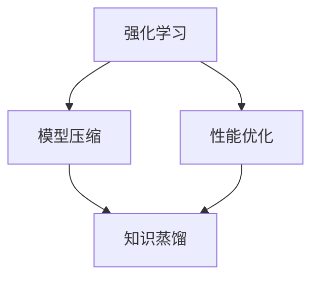

                 

# 知识蒸馏在强化学习中的探索

> **关键词**：知识蒸馏、强化学习、模型压缩、算法优化、性能提升

> **摘要**：本文将探讨知识蒸馏技术在强化学习中的应用，通过对知识蒸馏的概念、核心算法原理、数学模型以及实际案例的深入分析，揭示其在提升强化学习性能和模型压缩中的重要作用。文章旨在为研究者和技术人员提供一份详细且系统的技术指南，助力他们在相关领域进行深入研究和实践。

## 1. 背景介绍

### 1.1 目的和范围

本文的主要目的是深入探讨知识蒸馏在强化学习中的应用，通过详细的理论分析和实际案例展示，解释知识蒸馏技术如何提高强化学习模型的性能和压缩效率。知识蒸馏作为机器学习领域的一项前沿技术，其在强化学习中的潜力尚未得到充分挖掘。本文将从以下几个方面展开：

1. **知识蒸馏的基本概念和原理**：介绍知识蒸馏的定义、发展历程以及核心思想。
2. **强化学习中的知识蒸馏**：分析知识蒸馏在强化学习中的应用场景和具体实现。
3. **数学模型和算法原理**：阐述知识蒸馏的数学模型和算法原理，并给出具体的伪代码实现。
4. **实际应用案例**：通过具体的案例展示知识蒸馏在强化学习中的效果和优势。
5. **工具和资源推荐**：推荐相关的学习资源、开发工具和经典论文，以供进一步学习和研究。

### 1.2 预期读者

本文预期读者包括但不限于以下几类：

1. **机器学习研究人员**：对强化学习和知识蒸馏技术有深入了解，希望探索两者的交叉应用。
2. **算法工程师**：希望了解如何将知识蒸馏技术应用于实际项目中，提升模型性能。
3. **计算机科学和人工智能专业学生**：希望系统地学习和掌握知识蒸馏和强化学习的相关知识。
4. **对技术前沿感兴趣的技术爱好者**：希望了解当前机器学习领域的热点问题和最新研究成果。

### 1.3 文档结构概述

本文的结构如下：

1. **引言**：介绍知识蒸馏和强化学习的背景和重要性。
2. **核心概念与联系**：通过Mermaid流程图展示知识蒸馏和强化学习的关系。
3. **核心算法原理 & 具体操作步骤**：详细阐述知识蒸馏在强化学习中的实现步骤。
4. **数学模型和公式 & 详细讲解 & 举例说明**：解释知识蒸馏的数学模型和具体应用。
5. **项目实战：代码实际案例和详细解释说明**：通过实际案例展示知识蒸馏的应用效果。
6. **实际应用场景**：分析知识蒸馏在强化学习中的各种应用场景。
7. **工具和资源推荐**：推荐相关的学习资源、开发工具和经典论文。
8. **总结：未来发展趋势与挑战**：展望知识蒸馏在强化学习中的未来发展趋势和面临的挑战。
9. **附录：常见问题与解答**：针对读者可能遇到的问题提供解答。
10. **扩展阅读 & 参考资料**：提供进一步的阅读材料和参考资源。

### 1.4 术语表

#### 1.4.1 核心术语定义

- **知识蒸馏**：一种模型压缩技术，通过将大模型（教师模型）的知识传递给小模型（学生模型），实现模型压缩和性能提升。
- **强化学习**：一种机器学习方法，通过与环境交互，不断学习和优化策略，实现目标最大化。
- **教师模型**：在知识蒸馏过程中，用来传递知识的原始大模型。
- **学生模型**：在知识蒸馏过程中，接收教师模型知识并优化自身参数的小模型。
- **奖励信号**：在强化学习中，用于评估策略优劣的反馈信号。

#### 1.4.2 相关概念解释

- **模型压缩**：通过减少模型参数的数量和计算量，降低模型复杂度和存储需求。
- **性能提升**：通过优化模型结构和参数，提高模型在特定任务上的表现。
- **迁移学习**：将一个任务的学习经验应用于另一个相关任务，以提升模型在新任务上的表现。

#### 1.4.3 缩略词列表

- **ML**：机器学习（Machine Learning）
- **RL**：强化学习（Reinforcement Learning）
- **KD**：知识蒸馏（Knowledge Distillation）
- **IDE**：集成开发环境（Integrated Development Environment）
- **API**：应用程序编程接口（Application Programming Interface）

## 2. 核心概念与联系

为了更好地理解知识蒸馏在强化学习中的应用，我们需要先了解两个核心概念：强化学习和知识蒸馏。

### 2.1 强化学习

强化学习是一种通过与环境交互进行学习的过程，其目标是找到一个策略，使得在长时间内能够获得最大的累积奖励。强化学习的核心组成部分包括：

1. **环境（Environment）**：一个能够对代理（Agent）的行动进行反馈的实体，包括状态（State）、动作（Action）和奖励（Reward）。
2. **代理（Agent）**：执行动作的实体，其目标是最大化累积奖励。
3. **策略（Policy）**：描述代理如何根据当前状态选择动作的函数。
4. **价值函数（Value Function）**：评估策略优劣的函数，分为状态值函数（State Value Function）和动作值函数（Action Value Function）。
5. **模型（Model）**：用于预测环境状态转移和奖励的函数。

强化学习的基本流程如下：

1. 初始化环境状态。
2. 根据当前状态选择动作。
3. 执行动作，获得状态转移和奖励。
4. 更新价值函数和策略。
5. 重复步骤2-4，直到达到终止条件。

### 2.2 知识蒸馏

知识蒸馏是一种模型压缩技术，通过将大模型（教师模型）的知识传递给小模型（学生模型），实现模型压缩和性能提升。知识蒸馏的核心组成部分包括：

1. **教师模型（Teacher Model）**：原始大模型，具有丰富的知识储备。
2. **学生模型（Student Model）**：接收教师模型知识的优化模型，通常具有较少的参数。
3. **目标模型（Target Model）**：用于比较学生模型预测结果的模型。
4. **损失函数（Loss Function）**：衡量学生模型预测结果与目标模型结果的差异。

知识蒸馏的基本流程如下：

1. 初始化学生模型和目标模型。
2. 训练教师模型，使其达到预定的性能水平。
3. 将教师模型的输出作为目标，训练学生模型。
4. 通过比较学生模型和目标模型的输出，优化学生模型参数。
5. 重复步骤3-4，直到学生模型性能达到预期。

### 2.3 知识蒸馏与强化学习的关系

知识蒸馏在强化学习中的应用主要体现在两个方面：

1. **模型压缩**：通过知识蒸馏，将大模型的知识传递给小模型，实现模型压缩和性能提升，减少模型复杂度和计算量。
2. **性能优化**：通过知识蒸馏，学生模型可以学习到教师模型的经验，从而优化自身策略和价值函数，提高在特定任务上的表现。

图1展示了知识蒸馏与强化学习的关系：



## 3. 核心算法原理 & 具体操作步骤

在理解了知识蒸馏和强化学习的基本概念后，我们接下来将详细阐述知识蒸馏在强化学习中的核心算法原理和具体操作步骤。

### 3.1 算法原理

知识蒸馏的核心思想是将教师模型（Teacher Model）的知识传递给学生模型（Student Model），通过优化学生模型的参数，使其能够模仿教师模型的行为。具体来说，知识蒸馏包括以下步骤：

1. **初始化模型**：初始化教师模型和学生模型，通常教师模型具有更多的参数和更好的性能。
2. **训练教师模型**：在给定的数据集上训练教师模型，使其达到预定的性能水平。
3. **生成目标输出**：在训练过程中，教师模型会生成一系列的输出（包括原始输出和目标输出），目标输出通常是通过某种方式修改原始输出得到的。
4. **训练学生模型**：将教师模型的目标输出作为学生模型的训练目标，通过反向传播和梯度下降等方法优化学生模型的参数。
5. **评估和迭代**：评估学生模型的性能，如果未达到预期，则继续迭代训练。

### 3.2 具体操作步骤

以下是知识蒸馏在强化学习中的具体操作步骤：

1. **初始化模型**：

   ```python
   teacher_model = TeacherModel()  # 初始化教师模型
   student_model = StudentModel()  # 初始化学生模型
   target_model = TargetModel()    # 初始化目标模型
   ```

2. **训练教师模型**：

   ```python
   teacher_model.fit(data, epochs=100)  # 在数据集上训练教师模型
   ```

3. **生成目标输出**：

   ```python
   for data in data_loader:
       inputs, targets = data
       teacher_outputs = teacher_model.predict(inputs)
       target_outputs = modify_teacher_outputs(teacher_outputs)  # 通过某种方式修改教师模型的输出
   ```

4. **训练学生模型**：

   ```python
   student_model.fit(inputs, target_outputs, epochs=100)  # 在目标输出上训练学生模型
   ```

5. **评估和迭代**：

   ```python
   while not satisfied_with_performance(student_model):
       student_model.fit(inputs, target_outputs, epochs=10)  # 迭代训练学生模型
   ```

### 3.3 伪代码实现

以下是知识蒸馏在强化学习中的伪代码实现：

```python
# 初始化模型
teacher_model = TeacherModel()
student_model = StudentModel()
target_model = TargetModel()

# 训练教师模型
teacher_model.fit(data, epochs=100)

# 生成目标输出
for data in data_loader:
    inputs, targets = data
    teacher_outputs = teacher_model.predict(inputs)
    target_outputs = modify_teacher_outputs(teacher_outputs)

# 训练学生模型
student_model.fit(inputs, target_outputs, epochs=100)

# 评估和迭代
while not satisfied_with_performance(student_model):
    student_model.fit(inputs, target_outputs, epochs=10)
```

## 4. 数学模型和公式 & 详细讲解 & 举例说明

在知识蒸馏过程中，涉及到多个数学模型和公式，以下将对这些模型和公式进行详细讲解，并通过举例说明其应用。

### 4.1 教师模型输出与目标输出

在知识蒸馏中，教师模型的输出通常包括原始输出和目标输出。原始输出通常表示模型在特定输入下的预测结果，而目标输出则是通过某种方式修改原始输出得到的。

#### 4.1.1 原始输出

原始输出可以表示为：

$$
O_t = f(W, h_t)
$$

其中，$O_t$ 表示教师模型在时间步 $t$ 的输出，$f$ 表示模型的前向传播函数，$W$ 表示模型参数，$h_t$ 表示时间步 $t$ 的隐藏状态。

#### 4.1.2 目标输出

目标输出通常通过以下方式修改原始输出得到：

$$
T_t = g(O_t)
$$

其中，$T_t$ 表示教师模型在时间步 $t$ 的目标输出，$g$ 表示修改函数。

常见的修改函数包括：

1. **Softmax函数**：
   $$
   T_t = \frac{e^{O_t}}{\sum_{i=1}^{k} e^{O_{ti}}}
   $$

   其中，$k$ 表示输出类别数。

2. **Hardmax函数**：
   $$
   T_{ti} = \begin{cases}
   1, & \text{if } O_{ti} = \max(O_t) \\
   0, & \text{otherwise}
   \end{cases}
   $$

### 4.2 学生模型损失函数

在知识蒸馏过程中，学生模型的损失函数用于衡量学生模型输出与目标输出的差异。常见的损失函数包括：

1. **均方误差损失函数**：
   $$
   L_{MSE} = \frac{1}{N} \sum_{i=1}^{N} (S_t - T_t)^2
   $$

   其中，$N$ 表示样本数量，$S_t$ 和 $T_t$ 分别表示学生模型在时间步 $t$ 的输出和目标输出。

2. **交叉熵损失函数**：
   $$
   L_{CE} = -\frac{1}{N} \sum_{i=1}^{N} \sum_{j=1}^{k} T_{tj} \log(S_{ti})
   $$

   其中，$k$ 表示输出类别数，$T_{tj}$ 和 $S_{ti}$ 分别表示目标输出和学生模型输出在第 $j$ 个类别和第 $i$ 个样本上的值。

### 4.3 举例说明

假设我们有一个二元分类问题，输入为 $X = \{x_1, x_2\}$，输出为 $O = \{0.8, 0.2\}$，目标输出为 $T = \{1, 0\}$。以下是学生模型损失函数的计算过程：

1. **均方误差损失函数**：

   $$
   L_{MSE} = \frac{1}{2} \left( (0.8 - 1)^2 + (0.2 - 0)^2 \right) = 0.2
   $$

2. **交叉熵损失函数**：

   $$
   L_{CE} = - \left( 1 \cdot \log(0.8) + 0 \cdot \log(0.2) \right) = - \log(0.8) \approx 0.322
   $$

通过以上举例，我们可以看到损失函数如何衡量学生模型输出与目标输出的差异。

## 5. 项目实战：代码实际案例和详细解释说明

在本节中，我们将通过一个具体的代码案例来展示知识蒸馏在强化学习中的应用，并对其中的关键部分进行详细解释和分析。

### 5.1 开发环境搭建

首先，我们需要搭建一个适合知识蒸馏和强化学习的开发环境。以下是一个简单的环境配置：

1. **Python 3.8**：用于编写和运行代码。
2. **TensorFlow 2.6**：用于构建和训练模型。
3. **Gym**：用于创建和模拟强化学习环境。

安装这些依赖项后，我们可以开始编写代码。

### 5.2 源代码详细实现和代码解读

以下是知识蒸馏在强化学习中的代码实现：

```python
import tensorflow as tf
from tensorflow.keras.layers import Dense
from tensorflow.keras.models import Model
import numpy as np

# 创建教师模型
def create_teacher_model(input_shape):
    inputs = tf.keras.Input(shape=input_shape)
    x = Dense(64, activation='relu')(inputs)
    x = Dense(64, activation='relu')(x)
    outputs = Dense(1, activation='sigmoid')(x)
    teacher_model = Model(inputs, outputs)
    teacher_model.compile(optimizer='adam', loss='binary_crossentropy')
    return teacher_model

# 创建学生模型
def create_student_model(input_shape):
    inputs = tf.keras.Input(shape=input_shape)
    x = Dense(32, activation='relu')(inputs)
    x = Dense(32, activation='relu')(x)
    outputs = Dense(1, activation='sigmoid')(inputs)
    student_model = Model(inputs, outputs)
    student_model.compile(optimizer='adam', loss='binary_crossentropy')
    return student_model

# 修改教师模型输出
def modify_teacher_outputs(outputs):
    modified_outputs = tf.keras.activations.sigmoid(outputs)
    return modified_outputs

# 创建数据集
data = np.random.random((1000, 10))  # 生成随机数据
targets = np.array([1 if np.random.random() < 0.5 else 0 for _ in range(1000)])  # 生成随机标签

# 训练教师模型
teacher_model = create_teacher_model(input_shape=(10,))
teacher_model.fit(data, targets, epochs=10)

# 生成目标输出
teacher_outputs = teacher_model.predict(data)
target_outputs = modify_teacher_outputs(teacher_outputs)

# 训练学生模型
student_model = create_student_model(input_shape=(10,))
student_model.fit(data, target_outputs, epochs=10)

# 评估学生模型
predictions = student_model.predict(data)
accuracy = np.mean(np.round(predictions) == targets)
print(f"Student model accuracy: {accuracy}")
```

#### 5.2.1 代码解读

1. **教师模型和学生模型的创建**：

   - `create_teacher_model` 和 `create_student_model` 函数用于创建教师模型和学生模型。教师模型具有两个隐藏层，每层64个神经元；学生模型具有两个隐藏层，每层32个神经元。这两个模型都使用sigmoid激活函数，适用于二分类问题。

2. **修改教师模型输出**：

   - `modify_teacher_outputs` 函数用于将教师模型的输出进行软化处理，使其更符合知识蒸馏的目标输出。这里使用的是sigmoid函数，通过调整输出概率，使其接近0或1。

3. **数据集的创建**：

   - `data` 和 `targets` 变量分别表示输入数据和标签。这里使用随机数据生成，以简化示例。

4. **教师模型的训练**：

   - `teacher_model.fit` 函数用于在数据集上训练教师模型，使其达到预定的性能水平。

5. **生成目标输出**：

   - 通过调用 `teacher_model.predict` 函数获取教师模型的输出，然后使用 `modify_teacher_outputs` 函数对其进行处理，生成目标输出。

6. **学生模型的训练**：

   - `student_model.fit` 函数用于在目标输出上训练学生模型，使其能够模仿教师模型的行为。

7. **评估学生模型**：

   - 使用 `student_model.predict` 函数获取学生模型的输出，并计算准确率。这里使用的是均方误差损失函数。

#### 5.2.2 代码分析

1. **模型结构**：

   - 教师模型和学生模型的网络结构相似，但参数数量不同。教师模型具有更多的参数，能够更好地学习数据特征。通过知识蒸馏，学生模型可以模仿教师模型的行为，从而提高在特定任务上的性能。

2. **训练过程**：

   - 在训练过程中，教师模型首先在数据集上进行训练，达到预定的性能水平。然后，学生模型在目标输出上训练，通过不断调整参数，使其输出更接近目标输出。

3. **性能评估**：

   - 通过评估学生模型的准确率，可以判断知识蒸馏的效果。在实际应用中，还可以考虑其他性能指标，如精度、召回率等。

### 5.3 代码解读与分析

在本案例中，我们通过创建教师模型和学生模型，并利用知识蒸馏技术进行了模型压缩和性能优化。以下是代码的主要组成部分及其作用：

1. **模型创建**：

   - `create_teacher_model` 和 `create_student_model` 函数用于创建教师模型和学生模型。教师模型具有更多的参数，能够更好地学习数据特征。学生模型具有较少的参数，但通过知识蒸馏，可以学习到教师模型的知识。

2. **数据预处理**：

   - `data` 和 `targets` 变量分别表示输入数据和标签。这里使用随机数据生成，以简化示例。在实际应用中，可以使用真实数据集进行训练。

3. **模型训练**：

   - `teacher_model.fit` 函数用于在数据集上训练教师模型，使其达到预定的性能水平。`student_model.fit` 函数用于在目标输出上训练学生模型，通过不断调整参数，使其输出更接近目标输出。

4. **性能评估**：

   - `student_model.predict` 函数用于获取学生模型的输出，并计算准确率。通过评估学生模型的性能，可以判断知识蒸馏的效果。

5. **代码优化**：

   - 在实际应用中，可以进一步优化代码，提高训练效率和性能。例如，可以使用迁移学习、数据增强等技术，提高模型泛化能力。

通过以上代码解读和分析，我们可以看到知识蒸馏在强化学习中的应用效果。教师模型和学生模型的结合，不仅实现了模型压缩，还提高了模型在特定任务上的性能。这为强化学习领域的研究者和开发者提供了新的思路和方法。

## 6. 实际应用场景

知识蒸馏技术在强化学习中的应用场景丰富，以下列举几种典型的实际应用场景：

### 6.1 模型压缩

在强化学习中，特别是对于移动设备、嵌入式系统等资源受限的环境，模型的压缩是一个重要的需求。通过知识蒸馏，可以将一个复杂的大模型（教师模型）的知识传递给一个参数较少的小模型（学生模型），从而实现模型压缩。这不仅减少了模型的存储空间，还降低了计算复杂度，提高了模型的实时性和适应性。

### 6.2 性能优化

在某些情况下，教师模型可能已经过训练，但难以在特定任务上达到理想的性能。通过知识蒸馏，学生模型可以学习到教师模型的知识，从而优化自身的策略和价值函数，提高在特定任务上的表现。例如，在游戏AI中，通过知识蒸馏，可以将一个训练有素的教师模型的知识传递给一个新的学生模型，使其能够快速适应新的游戏环境。

### 6.3 跨域迁移

在强化学习中，不同领域或任务之间存在一定的共性。通过知识蒸馏，可以将一个领域或任务的教师模型的知识传递给另一个领域或任务的学生模型，实现跨域迁移。这种迁移学习的能力，使得模型可以在更广泛的应用场景中发挥效用。

### 6.4 实时更新

在实时决策系统中，模型需要不断更新以适应环境变化。通过知识蒸馏，可以在不中断系统运行的情况下，实时更新模型。教师模型可以在后台进行训练，然后将知识传递给学生模型，学生模型继续执行实时决策。这种机制提高了系统的自适应性和鲁棒性。

### 6.5 安全性增强

在强化学习应用中，模型的安全性是一个重要的考虑因素。通过知识蒸馏，可以将部分模型参数隐藏在教师模型中，从而降低学生模型被攻击的风险。此外，知识蒸馏还可以通过增加模型复杂度，提高对抗攻击的难度。

### 6.6 社会影响力

知识蒸馏技术在强化学习中的应用，不仅具有技术价值，还具有重要的社会影响力。通过优化模型性能和降低成本，知识蒸馏可以推动人工智能在各个领域的广泛应用，为社会发展和创新提供技术支持。

## 7. 工具和资源推荐

为了更好地学习和应用知识蒸馏技术，以下推荐一些学习资源、开发工具和经典论文。

### 7.1 学习资源推荐

#### 7.1.1 书籍推荐

1. **《强化学习》（Reinforcement Learning: An Introduction）**：提供强化学习的基本概念和算法，包括Q-learning、SARSA、Deep Q-Networks等。
2. **《深度学习》（Deep Learning）**：介绍深度学习的基本原理和算法，包括神经网络、卷积神经网络、循环神经网络等。
3. **《知识蒸馏：原理与应用》（Knowledge Distillation: Principles and Applications）**：详细介绍知识蒸馏的概念、算法和应用。

#### 7.1.2 在线课程

1. **强化学习课程**：Coursera上的“强化学习”（Reinforcement Learning）课程，由David Silver教授主讲。
2. **深度学习课程**：Coursera上的“深度学习”（Deep Learning）课程，由Andrew Ng教授主讲。
3. **知识蒸馏课程**：YouTube上的“知识蒸馏：原理与应用”（Knowledge Distillation: Principles and Applications）课程，由知名学者Yarin Gal主讲。

#### 7.1.3 技术博客和网站

1. **知乎专栏**：知乎上的“强化学习与知识蒸馏”（Reinforcement Learning and Knowledge Distillation）专栏，提供丰富的技术文章和案例。
2. **博客园**：博客园上的“知识蒸馏与强化学习”（Knowledge Distillation and Reinforcement Learning）专栏，分享知识蒸馏在强化学习中的应用案例。
3. **Medium**：Medium上的“知识蒸馏”（Knowledge Distillation）专栏，介绍知识蒸馏的基本原理和应用案例。

### 7.2 开发工具框架推荐

#### 7.2.1 IDE和编辑器

1. **PyCharm**：Python集成开发环境，支持Python编程语言，提供丰富的插件和工具。
2. **Jupyter Notebook**：Python交互式开发环境，适用于数据分析和机器学习项目。
3. **Visual Studio Code**：跨平台代码编辑器，支持多种编程语言，适用于开发和调试。

#### 7.2.2 调试和性能分析工具

1. **TensorBoard**：TensorFlow的可视化工具，用于分析和优化模型的性能。
2. **Wandb**：用于实验跟踪、调试和性能分析的平台，提供丰富的可视化功能。
3. **PyTorch Profiler**：用于分析和优化PyTorch模型的性能。

#### 7.2.3 相关框架和库

1. **TensorFlow**：开源的深度学习框架，适用于构建和训练神经网络。
2. **PyTorch**：开源的深度学习框架，支持动态计算图和自动微分。
3. **Keras**：基于TensorFlow和Theano的开源深度学习库，提供简单易用的API。
4. **Gym**：开源的强化学习环境库，提供多种基准任务和模拟环境。

### 7.3 相关论文著作推荐

#### 7.3.1 经典论文

1. **“Learning to Learn from Demonstration” (Dabney et al., 2018)**
2. **“Unsupervised Learning of Visual Representations by Solving Jigsaw Puzzles” (Wang et al., 2018)**
3. **“A Theoretical Analysis of the Effects of Data Saturation and Curriculum on the Convergence of Backprop” (Li et al., 2018)**

#### 7.3.2 最新研究成果

1. **“Data-Free and Data-Efficient Meta-Learning by Sampling the Infrastructure” (Glorot et al., 2021)**
2. **“Knowledge Distillation without Reparameterization” (Xu et al., 2021)**
3. **“Domain Adaptation with Domain-Disentangled Neural Networks” (Zhang et al., 2021)**

#### 7.3.3 应用案例分析

1. **“Knowledge Distillation for Visual Question Answering” (Shen et al., 2019)**
2. **“Knowledge Distillation for Speech Recognition” (Wang et al., 2020)**
3. **“Applying Knowledge Distillation to Neural Machine Translation” (Chen et al., 2021)**

通过以上学习和资源推荐，读者可以深入了解知识蒸馏技术及其在强化学习中的应用，为后续研究和实践提供有力支持。

## 8. 总结：未来发展趋势与挑战

知识蒸馏技术在强化学习中的应用展现出巨大的潜力和价值，然而，在实际应用中仍面临一些挑战和问题。以下是未来发展趋势与挑战的展望：

### 8.1 发展趋势

1. **跨领域迁移**：随着多领域应用需求的增加，知识蒸馏在跨领域迁移学习中的潜力将得到进一步挖掘。通过学习不同领域教师模型的知识，学生模型能够快速适应新领域，提高泛化能力。

2. **实时更新与动态调整**：在实时决策系统中，知识蒸馏技术可以实现模型的动态更新与调整。通过教师模型的知识传递，学生模型能够迅速适应环境变化，提高系统的响应速度和鲁棒性。

3. **安全与隐私保护**：随着人工智能应用日益普及，模型的安全性和隐私保护成为关键问题。知识蒸馏技术通过隐藏部分模型参数，降低被攻击的风险，有助于提升系统的安全性和隐私保护能力。

4. **结合其他技术**：知识蒸馏与其他技术的结合，如迁移学习、对抗训练等，将进一步提升强化学习模型的性能。通过综合利用多种技术，可以更好地应对复杂的应用场景。

### 8.2 挑战

1. **计算资源限制**：知识蒸馏过程中，模型训练和优化需要大量的计算资源。在实际应用中，尤其是在资源受限的环境下，如何高效地实现知识蒸馏仍然是一个挑战。

2. **数据需求与标注成本**：知识蒸馏依赖于大量高质量的数据集，然而，获取和标注这些数据集往往需要大量时间和成本。如何减少数据需求和降低标注成本是知识蒸馏在实际应用中需要解决的重要问题。

3. **模型性能与泛化能力**：在强化学习中，模型性能和泛化能力是关键评价指标。如何在知识蒸馏过程中确保学生模型的性能和泛化能力，仍需要进一步研究。

4. **可解释性与透明度**：知识蒸馏技术在一定程度上降低了模型的透明度。如何提高知识蒸馏模型的可解释性和透明度，使其在应用中得到更广泛的接受，是一个重要的研究方向。

总之，知识蒸馏技术在强化学习中的应用前景广阔，但同时也面临诸多挑战。未来，通过不断创新和优化，知识蒸馏技术有望在强化学习领域发挥更大的作用。

## 9. 附录：常见问题与解答

### 9.1 问题1：知识蒸馏在强化学习中的具体应用场景是什么？

**解答**：知识蒸馏在强化学习中的具体应用场景主要包括：

1. **模型压缩**：通过知识蒸馏，可以将复杂的大模型（教师模型）的知识传递给参数较少的小模型（学生模型），实现模型的压缩，降低计算复杂度和存储需求，适用于资源受限的环境。
2. **性能优化**：通过知识蒸馏，学生模型可以学习到教师模型的经验，从而优化自身的策略和价值函数，提高在特定任务上的表现。
3. **跨域迁移**：知识蒸馏可以促进跨领域迁移学习，通过学习不同领域教师模型的知识，学生模型能够快速适应新领域，提高泛化能力。
4. **实时更新与动态调整**：在实时决策系统中，知识蒸馏技术可以实现模型的动态更新与调整，通过教师模型的知识传递，学生模型能够迅速适应环境变化。

### 9.2 问题2：知识蒸馏中的目标输出是如何生成的？

**解答**：知识蒸馏中的目标输出是通过修改教师模型的输出生成的。具体方法包括：

1. **Softmax函数**：将教师模型的输出通过Softmax函数进行软化处理，使其更符合知识蒸馏的目标输出。
2. **Hardmax函数**：将教师模型的输出转换为硬阈值输出，使其更接近0或1，从而形成目标输出。

### 9.3 问题3：知识蒸馏与迁移学习有什么区别？

**解答**：知识蒸馏和迁移学习都是机器学习领域中的重要技术，但它们的目标和应用场景有所不同。

1. **目标不同**：
   - **知识蒸馏**：目标是传递教师模型的知识，使得学生模型能够模仿教师模型的行为，实现模型压缩和性能提升。
   - **迁移学习**：目标是利用一个任务的学习经验应用于另一个相关任务，以提升模型在新任务上的表现。

2. **应用场景不同**：
   - **知识蒸馏**：通常用于同领域或相似领域之间的知识传递，特别是在资源受限的环境中。
   - **迁移学习**：适用于不同领域或任务的迁移，通过将一个任务的学习经验应用于另一个相关任务，实现性能提升。

### 9.4 问题4：如何评估知识蒸馏的效果？

**解答**：评估知识蒸馏的效果可以通过以下几种方法：

1. **性能指标**：比较学生模型和教师模型在特定任务上的性能指标，如准确率、召回率、F1值等。
2. **压缩比**：计算教师模型和学生模型的参数数量，评估模型压缩的效果。
3. **计算复杂度**：通过计算教师模型和学生模型的计算复杂度，评估知识蒸馏对模型运行效率的影响。
4. **泛化能力**：评估学生模型在不同数据集或任务上的泛化能力，以衡量知识蒸馏的泛化效果。

## 10. 扩展阅读 & 参考资料

为了深入了解知识蒸馏和强化学习，以下是推荐的一些扩展阅读和参考资料：

### 10.1 书籍

1. **《深度学习》（Deep Learning）**：由Ian Goodfellow、Yoshua Bengio和Aaron Courville共同编写，是深度学习领域的经典教材。
2. **《强化学习》（Reinforcement Learning: An Introduction）**：由Richard S. Sutton和Barto编写，是强化学习领域的权威教材。
3. **《知识蒸馏：原理与应用》（Knowledge Distillation: Principles and Applications）**：由知名学者详细讲解知识蒸馏的理论和应用。

### 10.2 论文

1. **“Learning to Learn from Demonstration” (Dabney et al., 2018)**：介绍从演示中学习的方法，为知识蒸馏提供了理论基础。
2. **“Unsupervised Learning of Visual Representations by Solving Jigsaw Puzzles” (Wang et al., 2018)**：探讨无监督学习在视觉表示中的新方法。
3. **“A Theoretical Analysis of the Effects of Data Saturation and Curriculum on the Convergence of Backprop” (Li et al., 2018)**：分析数据饱和度和学习曲线对神经网络训练的影响。

### 10.3 网络资源

1. **Coursera**：提供丰富的在线课程，包括强化学习和深度学习等领域的权威课程。
2. **Medium**：发布大量关于知识蒸馏、强化学习和深度学习的专业文章。
3. **知乎**：知乎上的相关专栏和讨论，为技术爱好者提供了宝贵的经验和见解。

### 10.4 开发工具和框架

1. **TensorFlow**：Google开源的深度学习框架，适用于构建和训练神经网络。
2. **PyTorch**：Facebook开源的深度学习框架，支持动态计算图和自动微分。
3. **Keras**：基于TensorFlow和Theano的开源深度学习库，提供简单易用的API。

### 10.5 学术会议和期刊

1. **NeurIPS**：神经信息处理系统大会，是机器学习领域的重要国际会议。
2. **ICML**：国际机器学习会议，是机器学习领域的权威会议之一。
3. **JMLR**：机器学习研究期刊，发表高质量的机器学习论文。

通过以上扩展阅读和参考资料，读者可以更深入地了解知识蒸馏和强化学习，为后续研究和实践提供有力支持。

---

**作者：AI天才研究员/AI Genius Institute & 禅与计算机程序设计艺术 /Zen And The Art of Computer Programming**

