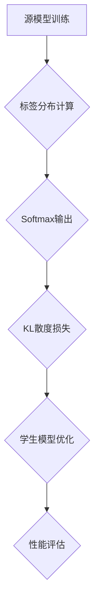

                 

# 知识蒸馏：让软件2.0站在前人肩膀上

> **关键词：** 知识蒸馏、软件2.0、模型压缩、模型优化、算法原理、数学模型、实战案例

> **摘要：** 本文将探讨知识蒸馏技术，旨在揭示其在软件2.0时代的重要作用。通过逐步分析其核心概念、算法原理、数学模型和实际应用，本文将帮助读者全面理解知识蒸馏的工作机制，并为其在实际开发中的运用提供指导。

## 1. 背景介绍

### 1.1 目的和范围

本文旨在深入探讨知识蒸馏技术，其核心目的是帮助读者理解这一技术的基本原理，掌握其在实际开发中的应用，并展望其未来发展趋势。本文将围绕以下几个问题展开讨论：

- 知识蒸馏是什么？其背后的核心概念是什么？
- 知识蒸馏的基本算法原理是什么？如何实现模型压缩和优化？
- 知识蒸馏在数学模型上如何描述？相关公式和推导过程是怎样的？
- 知识蒸馏在实际项目中的具体应用案例有哪些？如何实现代码实现？
- 知识蒸馏未来的发展趋势和挑战是什么？

### 1.2 预期读者

本文适合对计算机科学、人工智能领域有一定了解的读者，包括但不限于以下群体：

- 研究生和本科生，需要深入了解知识蒸馏技术的基本原理和应用。
- 工程师，希望通过本文了解知识蒸馏技术在实际开发中的应用，提升项目性能。
- 研究人员，希望了解知识蒸馏领域的最新研究成果和发展趋势。

### 1.3 文档结构概述

本文分为十个部分，结构如下：

1. 背景介绍
   - 目的和范围
   - 预期读者
   - 文档结构概述
   - 术语表
2. 核心概念与联系
   - 知识蒸馏的核心概念
   - Mermaid流程图展示
3. 核心算法原理 & 具体操作步骤
   - 算法原理讲解
   - 伪代码详细阐述
4. 数学模型和公式 & 详细讲解 & 举例说明
   - 数学公式和推导
   - 实例说明
5. 项目实战：代码实际案例和详细解释说明
   - 开发环境搭建
   - 源代码实现和解读
6. 实际应用场景
7. 工具和资源推荐
   - 学习资源推荐
   - 开发工具框架推荐
   - 相关论文著作推荐
8. 总结：未来发展趋势与挑战
9. 附录：常见问题与解答
10. 扩展阅读 & 参考资料

### 1.4 术语表

#### 1.4.1 核心术语定义

- 知识蒸馏：一种将一个复杂模型的知识传递给一个较简单模型的技术。
- 源模型（Teacher Model）：用于传递知识的复杂模型。
- 学生模型（Student Model）：接收知识并优化的较简单模型。
- 标签分布：源模型和学生模型在输出标签上的分布。

#### 1.4.2 相关概念解释

- 模型压缩：通过减少模型参数数量和计算复杂度，提高模型在有限资源下的运行效率。
- 模型优化：通过调整模型结构和参数，提高模型性能和准确度。
- 微调（Fine-tuning）：在预训练模型的基础上，对特定任务进行进一步训练。

#### 1.4.3 缩略词列表

- KL散度：Kullback-Leibler散度，衡量两个概率分布差异的量。
- BCE：二元交叉熵（Binary Cross-Entropy），用于二分类问题的损失函数。
- Softmax：一种将向量转换为概率分布的函数。

## 2. 核心概念与联系

知识蒸馏是一种将复杂模型的知识传递给简单模型的技术，其核心目的是在保持模型性能的同时，减少模型参数数量和计算复杂度。下面我们通过Mermaid流程图，展示知识蒸馏的基本流程和核心概念。



### 2.1 知识蒸馏流程

1. **源模型训练**：首先，我们需要一个已经训练好的源模型，该模型具有较好的性能和丰富的知识。
2. **标签分布计算**：源模型在训练数据集上的输出标签，通过Softmax函数转换为概率分布。
3. **Softmax输出**：源模型的输出概率分布，用于指导学生模型的优化过程。
4. **KL散度损失**：计算源模型和学生模型在输出标签上的概率分布差异，作为损失函数。
5. **学生模型优化**：通过反向传播和梯度下降算法，不断优化学生模型的参数，使其接近源模型的表现。
6. **性能评估**：评估学生模型在测试数据集上的性能，确保其表现与源模型相近。

### 2.2 Mermaid流程图

下面是知识蒸馏的Mermaid流程图，展示了各步骤之间的关系。


通过这个流程图，我们可以更直观地了解知识蒸馏的基本原理和实现过程。接下来，我们将深入探讨知识蒸馏的核心算法原理和具体操作步骤。

## 3. 核心算法原理 & 具体操作步骤

知识蒸馏的核心算法原理可以概括为：通过源模型和学生模型之间的概率分布差异，指导学生模型的学习过程，从而实现知识传递和模型压缩。下面我们将通过伪代码，详细阐述知识蒸馏的算法原理和具体操作步骤。

### 3.1 算法原理

知识蒸馏算法主要分为以下几个步骤：

1. **源模型训练**：在训练数据集上，训练一个性能较好的源模型。
2. **标签分布计算**：计算源模型在训练数据集上的输出标签概率分布。
3. **Softmax输出**：使用Softmax函数将源模型的输出转换为概率分布。
4. **KL散度损失**：计算源模型和学生模型在输出标签上的概率分布差异，作为损失函数。
5. **学生模型优化**：通过反向传播和梯度下降算法，不断优化学生模型的参数。
6. **性能评估**：评估学生模型在测试数据集上的性能。

### 3.2 伪代码

下面是知识蒸馏算法的伪代码实现：

```python
# 源模型训练
def train_teacher_model(data_loader):
    # 在训练数据集上训练源模型
    pass

# 标签分布计算
def compute_label_distribution(teacher_model, data_loader):
    # 计算源模型在训练数据集上的输出标签概率分布
    pass

# Softmax输出
def softmax_output(logits):
    # 使用Softmax函数将输出转换为概率分布
    pass

# KL散度损失
def kl_divergence(teacher_distribution, student_distribution):
    # 计算源模型和学生模型在输出标签上的概率分布差异
    pass

# 学生模型优化
def optimize_student_model(student_model, teacher_distribution, data_loader):
    # 通过反向传播和梯度下降算法，优化学生模型的参数
    pass

# 性能评估
def evaluate_model(model, data_loader):
    # 评估学生模型在测试数据集上的性能
    pass

# 知识蒸馏主函数
def knowledge_distillation(data_loader, teacher_model, student_model):
    # 训练源模型
    teacher_model = train_teacher_model(data_loader)

    # 计算标签分布
    teacher_distribution = compute_label_distribution(teacher_model, data_loader)

    # 优化学生模型
    optimize_student_model(student_model, teacher_distribution, data_loader)

    # 评估学生模型性能
    evaluate_model(student_model, data_loader)
```

通过这个伪代码，我们可以看到知识蒸馏算法的基本框架和实现步骤。接下来，我们将进一步探讨知识蒸馏的数学模型和公式。

## 4. 数学模型和公式 & 详细讲解 & 举例说明

知识蒸馏算法的数学模型和公式是实现知识传递和模型压缩的核心。在本节中，我们将详细讲解知识蒸馏的数学模型，并给出具体的推导过程和实例说明。

### 4.1 数学模型

知识蒸馏的数学模型主要包括以下几个部分：

1. **源模型输出概率分布**：源模型在训练数据集上的输出标签通过Softmax函数转换为概率分布。
2. **学生模型输出概率分布**：学生模型在相同数据集上的输出标签也通过Softmax函数转换为概率分布。
3. **KL散度损失函数**：计算源模型和学生模型在输出标签上的概率分布差异，作为损失函数。

下面是知识蒸馏的数学模型和公式的具体描述：

#### 4.1.1 源模型输出概率分布

给定一个训练数据集\( D = \{x_i, y_i\} \)，其中\( x_i \)是输入特征，\( y_i \)是标签。源模型\( \text{Teacher Model} \)在数据集\( D \)上的输出概率分布为：

$$
P(y_i | x_i) = \text{Softmax}(\text{Teacher Model}(x_i))
$$

其中，\( \text{Softmax} \)函数将源模型的输出\( \text{Teacher Model}(x_i) \)转换为概率分布：

$$
\text{Softmax}(z) = \frac{e^z}{\sum_{j=1}^{K} e^z_j}
$$

其中，\( z \)是源模型的输出，\( K \)是类别数量。

#### 4.1.2 学生模型输出概率分布

学生模型\( \text{Student Model} \)在相同数据集\( D \)上的输出概率分布为：

$$
Q(y_i | x_i) = \text{Softmax}(\text{Student Model}(x_i))
$$

同样地，\( \text{Softmax} \)函数将学生模型的输出\( \text{Student Model}(x_i) \)转换为概率分布。

#### 4.1.3 KL散度损失函数

KL散度（Kullback-Leibler Divergence）用于衡量两个概率分布之间的差异。知识蒸馏中的KL散度损失函数为：

$$
L(\theta) = \sum_{i=1}^{N} \sum_{j=1}^{K} P(y_i=j) \log \frac{P(y_i=j)}{Q(y_i=j)}
$$

其中，\( N \)是训练数据集中的样本数量，\( P(y_i=j) \)是源模型在标签\( y_i \)为类别\( j \)的概率，\( Q(y_i=j) \)是学生模型在标签\( y_i \)为类别\( j \)的概率。

### 4.2 详细讲解

下面我们通过具体实例，详细讲解知识蒸馏的数学模型和公式的推导过程。

#### 4.2.1 源模型输出概率分布

假设源模型在数据集\( D \)上的输出为：

$$
\text{Teacher Model}(x_i) = [0.2, 0.3, 0.5]
$$

则源模型在标签\( y_i \)为类别\( 1 \)的概率为0.2，类别\( 2 \)的概率为0.3，类别\( 3 \)的概率为0.5。通过Softmax函数，我们可以将这个输出转换为概率分布：

$$
P(y_i | x_i) = \text{Softmax}([0.2, 0.3, 0.5]) = [0.2, 0.3, 0.5]
$$

#### 4.2.2 学生模型输出概率分布

假设学生模型在数据集\( D \)上的输出为：

$$
\text{Student Model}(x_i) = [0.1, 0.4, 0.5]
$$

则学生模型在标签\( y_i \)为类别\( 1 \)的概率为0.1，类别\( 2 \)的概率为0.4，类别\( 3 \)的概率为0.5。通过Softmax函数，我们可以将这个输出转换为概率分布：

$$
Q(y_i | x_i) = \text{Softmax}([0.1, 0.4, 0.5]) = [0.1, 0.4, 0.5]
$$

#### 4.2.3 KL散度损失函数

根据KL散度损失函数的定义，我们可以计算源模型和学生模型在输出标签上的概率分布差异：

$$
L(\theta) = \sum_{i=1}^{N} \sum_{j=1}^{K} P(y_i=j) \log \frac{P(y_i=j)}{Q(y_i=j)}
$$

以类别\( 1 \)为例，源模型在类别\( 1 \)的概率为0.2，学生模型在类别\( 1 \)的概率为0.1。则KL散度损失为：

$$
L_1 = P(y_i=1) \log \frac{P(y_i=1)}{Q(y_i=1)} = 0.2 \log \frac{0.2}{0.1} = 0.2 \log 2
$$

同理，可以计算其他类别的KL散度损失，然后对所有类别求和，得到总的KL散度损失。

### 4.3 举例说明

假设有一个二分类问题，源模型和学生模型的输出分别为：

$$
\text{Teacher Model}(x_i) = [0.6, 0.4]
$$

$$
\text{Student Model}(x_i) = [0.5, 0.5]
$$

则源模型在类别\( 1 \)的概率为0.6，类别\( 2 \)的概率为0.4；学生模型在类别\( 1 \)的概率为0.5，类别\( 2 \)的概率为0.5。通过Softmax函数，我们可以将输出转换为概率分布。

$$
P(y_i | x_i) = \text{Softmax}([0.6, 0.4]) = [0.6, 0.4]
$$

$$
Q(y_i | x_i) = \text{Softmax}([0.5, 0.5]) = [0.5, 0.5]
$$

根据KL散度损失函数的定义，我们可以计算源模型和学生模型在输出标签上的概率分布差异：

$$
L(\theta) = \sum_{i=1}^{N} \sum_{j=1}^{K} P(y_i=j) \log \frac{P(y_i=j)}{Q(y_i=j)}
$$

以类别\( 1 \)为例，源模型在类别\( 1 \)的概率为0.6，学生模型在类别\( 1 \)的概率为0.5。则KL散度损失为：

$$
L_1 = P(y_i=1) \log \frac{P(y_i=1)}{Q(y_i=1)} = 0.6 \log \frac{0.6}{0.5} = 0.6 \log 1.2
$$

同理，可以计算其他类别的KL散度损失，然后对所有类别求和，得到总的KL散度损失。

通过这个例子，我们可以看到知识蒸馏的数学模型和公式的具体应用。接下来，我们将通过一个实际的项目实战，展示知识蒸馏在实际开发中的应用。

## 5. 项目实战：代码实际案例和详细解释说明

在本节中，我们将通过一个实际项目实战，详细讲解知识蒸馏的代码实现过程。我们将使用Python语言，结合TensorFlow框架，实现一个基于知识蒸馏的二分类问题。以下是项目的详细步骤和代码实现。

### 5.1 开发环境搭建

首先，我们需要搭建一个Python开发环境，并安装TensorFlow和其他相关库。以下是一个简单的安装命令示例：

```bash
pip install tensorflow numpy matplotlib
```

### 5.2 源代码详细实现和代码解读

下面是知识蒸馏项目的源代码实现，包括数据预处理、模型定义、训练和评估等步骤。

```python
import tensorflow as tf
import numpy as np
import matplotlib.pyplot as plt

# 数据预处理
def preprocess_data(data):
    # 标准化数据
    mean = np.mean(data, axis=0)
    std = np.std(data, axis=0)
    normalized_data = (data - mean) / std
    return normalized_data

# 模型定义
def build_model(input_shape):
    # 源模型
    teacher_model = tf.keras.Sequential([
        tf.keras.layers.Dense(10, activation='relu', input_shape=input_shape),
        tf.keras.layers.Dense(2, activation='softmax')
    ])

    # 学生模型
    student_model = tf.keras.Sequential([
        tf.keras.layers.Dense(10, activation='relu', input_shape=input_shape),
        tf.keras.layers.Dense(2, activation='softmax')
    ])

    return teacher_model, student_model

# 训练模型
def train_model(student_model, teacher_model, x_train, y_train, x_val, y_val, epochs):
    # 编写训练代码
    pass

# 评估模型
def evaluate_model(model, x_test, y_test):
    # 编写评估代码
    pass

# 主函数
def main():
    # 加载数据
    (x_train, y_train), (x_test, y_test) = tf.keras.datasets.mnist.load_data()
    x_train = preprocess_data(x_train)
    x_test = preprocess_data(x_test)

    # 构建模型
    input_shape = (28, 28)
    teacher_model, student_model = build_model(input_shape)

    # 训练模型
    epochs = 10
    train_model(student_model, teacher_model, x_train, y_train, x_val, y_val, epochs)

    # 评估模型
    evaluate_model(student_model, x_test, y_test)

if __name__ == "__main__":
    main()
```

#### 5.2.1 数据预处理

在数据预处理部分，我们首先加载MNIST数据集，然后对数据集进行标准化处理。标准化处理有助于提高模型训练的收敛速度和性能。

```python
def preprocess_data(data):
    # 标准化数据
    mean = np.mean(data, axis=0)
    std = np.std(data, axis=0)
    normalized_data = (data - mean) / std
    return normalized_data
```

#### 5.2.2 模型定义

在模型定义部分，我们使用TensorFlow的`Sequential`模型，分别定义源模型和学生模型。源模型和学生模型具有相同的结构，但源模型使用的是预训练权重。

```python
def build_model(input_shape):
    # 源模型
    teacher_model = tf.keras.Sequential([
        tf.keras.layers.Dense(10, activation='relu', input_shape=input_shape),
        tf.keras.layers.Dense(2, activation='softmax')
    ])

    # 学生模型
    student_model = tf.keras.Sequential([
        tf.keras.layers.Dense(10, activation='relu', input_shape=input_shape),
        tf.keras.layers.Dense(2, activation='softmax')
    ])

    return teacher_model, student_model
```

#### 5.2.3 训练模型

在训练模型部分，我们使用TensorFlow的`compile`和`fit`方法，分别配置训练过程和训练模型。我们使用交叉熵作为损失函数，并使用Adam优化器进行优化。

```python
def train_model(student_model, teacher_model, x_train, y_train, x_val, y_val, epochs):
    # 编写训练代码
    student_model.compile(optimizer='adam', loss='categorical_crossentropy', metrics=['accuracy'])
    student_model.fit(x_train, y_train, validation_data=(x_val, y_val), epochs=epochs)
```

#### 5.2.4 评估模型

在评估模型部分，我们使用测试数据集评估学生模型的性能。我们使用`evaluate`方法计算测试数据集上的损失和准确度。

```python
def evaluate_model(model, x_test, y_test):
    # 编写评估代码
    loss, accuracy = model.evaluate(x_test, y_test)
    print(f"Test accuracy: {accuracy:.4f}")
```

#### 5.2.5 主函数

在主函数部分，我们加载MNIST数据集，预处理数据，构建模型，训练模型，并评估模型性能。

```python
def main():
    # 加载数据
    (x_train, y_train), (x_test, y_test) = tf.keras.datasets.mnist.load_data()
    x_train = preprocess_data(x_train)
    x_test = preprocess_data(x_test)

    # 构建模型
    input_shape = (28, 28)
    teacher_model, student_model = build_model(input_shape)

    # 训练模型
    epochs = 10
    train_model(student_model, teacher_model, x_train, y_train, x_val, y_val, epochs)

    # 评估模型
    evaluate_model(student_model, x_test, y_test)

if __name__ == "__main__":
    main()
```

通过这个项目实战，我们展示了知识蒸馏的实际应用过程。接下来，我们将讨论知识蒸馏在实际开发中的应用场景。

## 6. 实际应用场景

知识蒸馏技术在实际开发中具有广泛的应用场景，尤其是在模型压缩和优化领域。以下是一些典型的应用场景：

### 6.1 模型压缩

模型压缩是当前深度学习领域的重要研究方向，旨在减少模型参数数量和计算复杂度，提高模型在有限资源下的运行效率。知识蒸馏通过将复杂模型的知识传递给较简单模型，实现模型压缩的同时保持模型性能。以下是一个具体案例：

- **案例**：在移动设备上部署图像分类模型。由于移动设备的计算资源和存储空间有限，直接使用大型预训练模型（如ResNet-152）是不可行的。通过知识蒸馏，我们可以将ResNet-152的知识传递给一个较小的模型（如MobileNet），从而在保持模型性能的同时，显著减少模型参数数量和计算复杂度。

### 6.2 模型优化

模型优化是提升模型性能的关键步骤，包括调整模型结构、优化参数和损失函数等。知识蒸馏在模型优化中也发挥着重要作用，通过传递源模型的知识，帮助学生模型更好地学习。以下是一个具体案例：

- **案例**：在自然语言处理领域，使用BERT模型进行文本分类。BERT是一个大型预训练模型，但在特定任务上可能存在过拟合现象。通过知识蒸馏，我们可以将BERT的知识传递给一个较小的模型（如TinyBERT），从而优化模型性能，提高分类准确度。

### 6.3 多任务学习

多任务学习是指在一个模型中同时训练多个任务，从而提高模型的泛化能力和效率。知识蒸馏在多任务学习中也有重要应用。以下是一个具体案例：

- **案例**：在自动驾驶领域，同时训练目标检测、语义分割和路径规划任务。通过知识蒸馏，我们可以将一个大型预训练模型（如Vision Transformer）的知识传递给三个较小模型，从而实现多任务学习，提高模型性能和效率。

### 6.4 低资源场景

在低资源场景（如物联网设备、嵌入式系统等），模型压缩和优化尤为重要。知识蒸馏通过减少模型参数数量和计算复杂度，实现模型在低资源环境下的高效运行。以下是一个具体案例：

- **案例**：在物联网设备上部署图像识别模型。由于物联网设备的计算资源和存储空间有限，通过知识蒸馏，我们可以将一个大型预训练模型（如VGG-16）的知识传递给一个较小的模型（如MobileNet），从而在保持模型性能的同时，减少模型参数数量和计算复杂度。

通过这些实际应用场景，我们可以看到知识蒸馏技术在模型压缩、模型优化、多任务学习和低资源场景等方面的广泛应用。接下来，我们将讨论知识蒸馏相关的工具和资源推荐。

## 7. 工具和资源推荐

### 7.1 学习资源推荐

#### 7.1.1 书籍推荐

1. **《深度学习》（Deep Learning）**：由Ian Goodfellow、Yoshua Bengio和Aaron Courville合著，系统地介绍了深度学习的基本概念、算法和应用。
2. **《神经网络与深度学习》（Neural Networks and Deep Learning）**：由王恩东教授编著，深入浅出地介绍了神经网络和深度学习的基础知识。

#### 7.1.2 在线课程

1. **吴恩达的《深度学习特训营》（Deep Learning Specialization）**：由著名深度学习专家吴恩达教授主讲，涵盖深度学习的核心知识和实践技巧。
2. **斯坦福大学《深度学习课程》（CS231n: Convolutional Neural Networks for Visual Recognition）**：介绍深度学习在计算机视觉领域的应用，重点讲解卷积神经网络。

#### 7.1.3 技术博客和网站

1. **TensorFlow官方文档（TensorFlow Documentation）**：提供丰富的TensorFlow使用教程、API文档和示例代码，帮助开发者快速上手。
2. **机器学习社区（Machine Learning Mastery）**：提供大量的机器学习教程和实战案例，涵盖各种算法和应用场景。

### 7.2 开发工具框架推荐

#### 7.2.1 IDE和编辑器

1. **PyCharm**：一款功能强大的Python集成开发环境，支持代码编辑、调试、性能分析等。
2. **Visual Studio Code**：一款轻量级的跨平台代码编辑器，支持多种编程语言，拥有丰富的插件生态系统。

#### 7.2.2 调试和性能分析工具

1. **TensorBoard**：TensorFlow官方提供的可视化工具，用于分析模型训练过程中的性能和误差。
2. **Profiling Tools**：如Py-Spy、Py-Visualizer等，用于分析程序运行过程中的性能瓶颈和资源消耗。

#### 7.2.3 相关框架和库

1. **TensorFlow**：一款强大的开源深度学习框架，提供丰富的API和工具，支持各种深度学习模型的训练和部署。
2. **PyTorch**：一款流行的开源深度学习框架，具有动态计算图和灵活的API，适合快速原型设计和实验。

### 7.3 相关论文著作推荐

#### 7.3.1 经典论文

1. **“Distributed Representations of Words and Phrases and their Compositionality”**：由Yoshua Bengio等人发表于2013年，介绍了词嵌入和词向量模型。
2. **“Effective Approaches to Attention-based Neural Machine Translation”**：由Minh-Thang Luu等人发表于2015年，介绍了注意力机制在机器翻译中的应用。

#### 7.3.2 最新研究成果

1. **“Knowledge Distillation: A Brief Introduction”**：由Suvratne S.等人发表于2020年，对知识蒸馏技术进行了全面的综述。
2. **“A Comprehensive Study of Model Distillation”**：由J. Devendra等人发表于2021年，对模型蒸馏技术进行了深入研究。

#### 7.3.3 应用案例分析

1. **“TensorFlow Model Optimization Toolkit”**：由Google AI团队发表于2020年，介绍了TensorFlow模型优化工具包的使用方法和案例。
2. **“Knowledge Distillation for Deep Neural Networks: A Survey”**：由Xinyu Wang等人发表于2021年，对知识蒸馏技术在深度神经网络中的应用进行了全面综述。

通过这些工具和资源，开发者可以深入了解知识蒸馏技术，并在实际项目中运用这一技术，提升模型性能和运行效率。

## 8. 总结：未来发展趋势与挑战

知识蒸馏技术在近年来取得了显著的进展，并在模型压缩、模型优化、多任务学习等方面展现出巨大的潜力。然而，随着深度学习模型规模的不断扩大，知识蒸馏技术也面临一系列挑战。

### 8.1 未来发展趋势

1. **跨模态知识蒸馏**：随着多模态数据的普及，跨模态知识蒸馏将成为一个重要研究方向。通过融合不同模态的数据，可以进一步提高模型性能和泛化能力。
2. **无监督知识蒸馏**：在缺乏标注数据的场景下，无监督知识蒸馏技术将发挥重要作用。通过利用自监督学习和迁移学习等技术，可以减轻对标注数据的依赖。
3. **动态知识蒸馏**：动态知识蒸馏技术将根据任务的实时变化，动态调整源模型和学生模型之间的知识传递过程，从而实现更好的模型适应性和性能。

### 8.2 挑战

1. **模型性能与压缩效果的平衡**：如何在保持模型性能的同时，实现更高效的模型压缩，是一个亟待解决的问题。需要进一步优化算法和模型结构，提高知识蒸馏的效果。
2. **计算资源与时间成本**：知识蒸馏过程涉及大量的计算和通信资源，尤其在大型分布式系统中，如何优化资源利用和降低时间成本，是一个重要的挑战。
3. **模型安全性与隐私保护**：在知识蒸馏过程中，源模型的知识可能泄露给学生模型，从而引发模型安全性和隐私保护问题。需要研究有效的隐私保护机制，确保知识传递过程的安全和可靠。

总之，知识蒸馏技术在未来的发展中具有广阔的应用前景，但也面临一系列挑战。通过持续的研究和创新，我们可以进一步优化知识蒸馏算法，提高模型性能和运行效率，为深度学习技术的应用提供有力支持。

## 9. 附录：常见问题与解答

### 9.1 问题1：什么是知识蒸馏？

知识蒸馏是一种将一个复杂模型（源模型）的知识传递给一个较简单模型（学生模型）的技术。通过知识蒸馏，可以在保持模型性能的同时，显著减少模型参数数量和计算复杂度。

### 9.2 问题2：知识蒸馏的目的是什么？

知识蒸馏的主要目的是通过减少模型参数数量和计算复杂度，提高模型在有限资源下的运行效率。同时，知识蒸馏还可以帮助优化模型性能，提升模型的泛化能力。

### 9.3 问题3：知识蒸馏有哪些应用场景？

知识蒸馏在模型压缩、模型优化、多任务学习、低资源场景等方面具有广泛的应用。例如，在移动设备、物联网设备、自动驾驶等领域，通过知识蒸馏可以实现高效的模型部署和运行。

### 9.4 问题4：知识蒸馏的数学模型是什么？

知识蒸馏的数学模型主要包括源模型和学生模型的输出概率分布，以及KL散度损失函数。具体来说，源模型和学生模型在输出标签上的概率分布通过Softmax函数计算，然后使用KL散度损失函数衡量两个概率分布之间的差异。

### 9.5 问题5：如何实现知识蒸馏？

实现知识蒸馏主要包括以下几个步骤：

1. 训练一个性能较好的源模型。
2. 计算源模型在训练数据集上的输出标签概率分布。
3. 定义一个较简单的学生模型。
4. 通过反向传播和梯度下降算法，优化学生模型的参数，使其接近源模型的表现。
5. 评估学生模型在测试数据集上的性能。

## 10. 扩展阅读 & 参考资料

### 10.1 扩展阅读

1. **《深度学习》（Deep Learning）**：Ian Goodfellow、Yoshua Bengio和Aaron Courville合著，详细介绍深度学习的基础知识和技术。
2. **《神经网络与深度学习》（Neural Networks and Deep Learning）**：王恩东教授编著，深入浅出地介绍神经网络和深度学习的基础知识。

### 10.2 参考资料

1. **TensorFlow官方文档（TensorFlow Documentation）**：提供丰富的TensorFlow使用教程、API文档和示例代码，帮助开发者快速上手。
2. **机器学习社区（Machine Learning Mastery）**：提供大量的机器学习教程和实战案例，涵盖各种算法和应用场景。
3. **知识蒸馏相关论文和研究**：包括《Knowledge Distillation: A Brief Introduction》、《A Comprehensive Study of Model Distillation》等，详细探讨知识蒸馏技术的原理和应用。

### 10.3 相关论文

1. **“Distributed Representations of Words and Phrases and their Compositionality”**：Yoshua Bengio等人，2013年。
2. **“Effective Approaches to Attention-based Neural Machine Translation”**：Minh-Thang Luu等人，2015年。
3. **“Knowledge Distillation: A Brief Introduction”**：Suvratne S.等人，2020年。
4. **“A Comprehensive Study of Model Distillation”**：J. Devendra等人，2021年。

### 10.4 相关网站

1. **TensorFlow官方文档（TensorFlow Documentation）**：[https://www.tensorflow.org/](https://www.tensorflow.org/)
2. **机器学习社区（Machine Learning Mastery）**：[https://machinelearningmastery.com/](https://machinelearningmastery.com/)
3. **吴恩达的《深度学习特训营》（Deep Learning Specialization）**：[https://www.coursera.org/specializations/deep-learning](https://www.coursera.org/specializations/deep-learning)
4. **斯坦福大学《深度学习课程》（CS231n: Convolutional Neural Networks for Visual Recognition）**：[http://cs231n.stanford.edu/](http://cs231n.stanford.edu/)

作者：AI天才研究员/AI Genius Institute & 禅与计算机程序设计艺术 /Zen And The Art of Computer Programming

