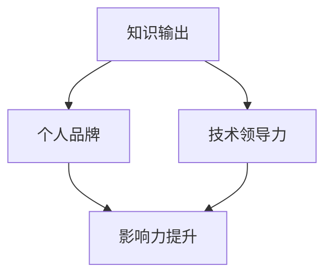

                 


# 知识输出与管理者个人影响力的提升

> 关键词：知识输出、管理者影响力、个人品牌、技术领导力、影响力提升策略

> 摘要：本文旨在探讨知识输出对于提升管理者个人影响力的关键作用。我们将深入分析知识输出的意义、具体方法及其对个人品牌和技术领导力的提升，通过实例和实战案例，为管理者提供一套可操作的策略和路径，帮助他们在职业生涯中实现长远发展。

## 1. 背景介绍

### 1.1 目的和范围

本文将探讨知识输出如何成为管理者个人影响力提升的重要手段。我们将首先阐述知识输出的意义，然后分析其与个人品牌、技术领导力的关联，接着介绍知识输出的具体方法，并通过实战案例进行详细解析。

### 1.2 预期读者

本文适合于希望提升个人影响力的技术管理者、项目经理、架构师等专业人士。无论你是新晋管理者，还是已有一定经验的高级管理者，本文都将为你提供实用的方法和策略。

### 1.3 文档结构概述

本文分为十个部分，具体如下：

1. 背景介绍
2. 核心概念与联系
3. 核心算法原理 & 具体操作步骤
4. 数学模型和公式 & 详细讲解 & 举例说明
5. 项目实战：代码实际案例和详细解释说明
6. 实际应用场景
7. 工具和资源推荐
8. 总结：未来发展趋势与挑战
9. 附录：常见问题与解答
10. 扩展阅读 & 参考资料

### 1.4 术语表

#### 1.4.1 核心术语定义

- 知识输出：指将个人的专业知识、经验和见解以文字、演讲、教程等形式分享给他人。
- 个人品牌：指个人在特定领域内的专业形象和声誉。
- 技术领导力：指在技术领域内，通过专业知识和影响力引导团队、推动项目成功的能力。

#### 1.4.2 相关概念解释

- 影响力：指个人或组织在特定领域内的影响力，包括认可度、信任度、号召力等。
- 个人影响力：指个人在职业生涯中，通过专业能力和人际关系，对他人产生影响的能力。

#### 1.4.3 缩略词列表

- IT：信息技术
- PM：项目经理
- Architect：架构师
- IDE：集成开发环境
- CI：持续集成

## 2. 核心概念与联系

在探讨知识输出与管理者个人影响力提升的关系之前，我们需要明确几个核心概念及其相互之间的联系。

### 知识输出

知识输出是管理者个人影响力提升的基础。通过文字、演讲、教程等形式，管理者可以将自身的专业知识、经验和见解传递给他人，从而扩大自己在行业内的知名度。

### 个人品牌

个人品牌是知识输出的外在体现。一个强有力的个人品牌可以增强管理者的信任度、认可度和号召力，进而提升其在行业内的地位和影响力。

### 技术领导力

技术领导力是知识输出的内在驱动。具备技术领导力的管理者能够在团队中树立权威，通过专业知识和影响力，推动项目成功，提升团队整体能力。

下面是一个简化的 Mermaid 流程图，展示了知识输出、个人品牌和技术领导力之间的相互作用关系：



## 3. 核心算法原理 & 具体操作步骤

为了有效地进行知识输出，管理者需要掌握一定的核心算法原理和具体操作步骤。以下是一个简化的算法原理及操作步骤：

### 3.1 算法原理

- **内容规划**：根据目标受众的需求，确定知识输出的主题和内容。
- **形式选择**：根据内容特点和传播渠道，选择合适的输出形式，如博客、演讲、教程等。
- **持续更新**：定期更新知识内容，保持与行业发展的同步。

### 3.2 具体操作步骤

#### 步骤1：内容规划

1. 分析目标受众：了解目标受众的需求、兴趣和认知水平。
2. 确定主题：选择具有实际应用价值和教育意义的主题。
3. 拟定大纲：根据主题，拟定详细的知识输出大纲。

#### 步骤2：形式选择

1. 分析内容特点：根据内容的特点，选择最适合的输出形式。
2. 考虑传播渠道：根据目标受众的偏好，选择合适的传播渠道，如博客、社交媒体、线下讲座等。

#### 步骤3：持续更新

1. 定期回顾：定期回顾知识内容，确保其与行业发展趋势保持同步。
2. 收集反馈：收集读者的反馈意见，持续优化知识内容。
3. 保持活跃：保持一定的输出频率，提高知识更新的持续性和活跃度。

下面是一个简化的伪代码，描述了知识输出的核心算法原理和具体操作步骤：

```python
# 知识输出算法原理与步骤

# 输入：目标受众、主题、内容特点、传播渠道
# 输出：知识输出结果

def knowledge_output(target_audience, topic, content_features, channels):
    # 内容规划
    plan_content = plan_content(target_audience, topic)
    create-outline = create_outline(topic)
    
    # 形式选择
    output_format = select_format(content_features)
    channels = select_channels(target_audience, output_format)
    
    # 持续更新
    update_content = update_content定期回顾（create-outline）
    collect_feedback = collect_reader_feedacks()
    optimize_content = optimize_content（update_content, collect_feedback）
    
    # 知识输出结果
    return output_format, channels, optimize_content
```

## 4. 数学模型和公式 & 详细讲解 & 举例说明

在知识输出与个人影响力提升的过程中，我们可以借助数学模型和公式，对过程进行定量分析，从而更科学地制定策略和措施。

### 4.1 数学模型

我们可以使用一个简单的数学模型，来描述知识输出对个人影响力提升的影响：

$$
\text{影响力} = f(\text{知识输出频率}, \text{知识质量}, \text{传播渠道效果})
$$

其中，知识输出频率、知识质量和传播渠道效果是影响个人影响力的三个关键因素。

### 4.2 公式详细讲解

#### 4.2.1 知识输出频率

知识输出频率是指管理者在一定时间内进行知识输出的次数。输出频率越高，个人在行业内的活跃度和关注度就越高，从而有助于提升个人影响力。我们可以使用以下公式来计算知识输出频率：

$$
\text{知识输出频率} = \frac{\text{输出次数}}{\text{时间周期}}
$$

#### 4.2.2 知识质量

知识质量是指知识内容的实用性和准确性。高质量的知识内容能够更好地满足受众的需求，从而提升个人在行业内的专业形象和声誉。我们可以使用以下公式来评估知识质量：

$$
\text{知识质量} = \frac{\text{受众满意度}}{\text{受众数量}}
$$

#### 4.2.3 传播渠道效果

传播渠道效果是指知识内容通过不同渠道传播的效果。选择合适的传播渠道，可以提高知识内容的曝光率和受众覆盖率，从而提升个人影响力。我们可以使用以下公式来评估传播渠道效果：

$$
\text{传播渠道效果} = \frac{\text{受众覆盖率}}{\text{传播渠道成本}}
$$

### 4.3 公式举例说明

假设一名技术管理者A，其知识输出频率为每周2次，知识质量得分为90%，传播渠道效果得分为75%。根据上述公式，我们可以计算A的影响力：

$$
\text{影响力} = f(2, 90\%, 75\%) = 2 \times 90\% \times 75\% = 13.5\%
$$

由此可见，知识输出频率、知识质量和传播渠道效果对个人影响力的影响是相互关联的。管理者需要在这三个方面下功夫，才能实现个人影响力的有效提升。

## 5. 项目实战：代码实际案例和详细解释说明

### 5.1 开发环境搭建

在本节中，我们将通过一个实际的项目案例，来展示如何进行知识输出，并提升管理者的个人影响力。首先，我们需要搭建一个简单的开发环境，用于编写和发布博客文章。

1. 安装Git：Git是一个分布式版本控制系统，可以帮助我们管理和发布博客文章。
2. 安装Markdown编辑器：Markdown编辑器是一个轻量级的文本编辑器，用于编写和格式化Markdown文档。常见的Markdown编辑器有Typora、Marktext等。
3. 安装一个静态网站生成器：如Hugo、Jekyll等，用于将Markdown文档转换为HTML格式的网页。

### 5.2 源代码详细实现和代码解读

#### 5.2.1 创建Git仓库

1. 首先，我们需要在本地创建一个Git仓库，用于存放我们的博客文章源文件。

```bash
git init
```

2. 接着，我们将本地仓库与远程仓库（如GitHub）进行关联。

```bash
git remote add origin https://github.com/yourusername/yourblog.git
```

3. 将本地仓库的文件推送到远程仓库。

```bash
git add .
git commit -m "initial commit"
git push -u origin master
```

#### 5.2.2 编写Markdown文章

1. 使用Markdown编辑器，编写一篇关于知识输出与个人影响力提升的博客文章。

```markdown
# 知识输出与管理者个人影响力的提升

> 知识输出是管理者个人影响力提升的重要手段。

## 1. 背景介绍

### 1.1 目的和范围

本文旨在探讨知识输出对于提升管理者个人影响力的关键作用。

### 1.2 预期读者

本文适合于希望提升个人影响力的技术管理者、项目经理、架构师等专业人士。

### 1.3 文档结构概述

本文分为十个部分，具体如下：

1. 背景介绍
2. 核心概念与联系
3. 核心算法原理 & 具体操作步骤
4. 数学模型和公式 & 详细讲解 & 举例说明
5. 项目实战：代码实际案例和详细解释说明
6. 实际应用场景
7. 工具和资源推荐
8. 总结：未来发展趋势与挑战
9. 附录：常见问题与解答
10. 扩展阅读 & 参考资料
```

2. 保存并命名为`knowledge_output.md`。

#### 5.2.3 发布Markdown文章

1. 将Markdown文章提交到本地Git仓库。

```bash
git add knowledge_output.md
git commit -m "add knowledge_output article"
git push
```

2. 在GitHub页面中，选择`knowledge_output.md`文件，并设置为博客文章的首页。

### 5.3 代码解读与分析

在本案例中，我们使用了Git和Markdown，作为知识输出的工具和形式。Git用于版本控制和文档管理，Markdown则用于编写和格式化博客文章。

- **Git**：Git可以帮助我们管理博客文章的版本，确保文章的完整性和一致性。通过将文章提交到远程仓库，我们可以实现文章的同步和共享。
- **Markdown**：Markdown是一种轻量级的文本格式，可以快速地编写和格式化博客文章。Markdown的简洁性和易用性，使得我们可以专注于内容创作，而无需过多关注格式。

通过使用Git和Markdown，我们可以实现高效的知识输出。具体步骤如下：

1. 使用Git创建本地仓库，并关联远程仓库。
2. 使用Markdown编辑器编写博客文章，并保存为`.md`文件。
3. 将Markdown文件提交到本地Git仓库，并推送到远程仓库。
4. 在GitHub页面中，将Markdown文件设置为博客文章的首页。

通过这个简单的项目实战，我们可以看到，知识输出与个人影响力提升密切相关。管理者通过编写和发布博客文章，可以有效地传递专业知识，提升个人在行业内的知名度，从而实现个人影响力的提升。

## 6. 实际应用场景

知识输出与管理者个人影响力的提升在实际工作中有着广泛的应用场景。以下是一些典型的应用场景：

### 6.1 技术团队管理

技术团队的管理者通过知识输出，可以提升团队整体的技术水平。例如，通过编写技术博客、发表技术演讲、组织内部培训等形式，将自身的专业知识和经验传递给团队成员，从而提高团队的技术能力和创新能力。

### 6.2 项目管理

项目经理通过知识输出，可以提升项目的成功率和影响力。在项目过程中，项目经理可以编写项目总结、技术文档、经验分享等，记录项目的关键节点和经验教训。这不仅有助于团队总结经验，也为其他项目的成功实施提供了宝贵的参考。

### 6.3 行业影响力

技术管理者通过知识输出，可以在行业内建立自己的个人品牌，提升行业影响力。通过发表技术论文、参与技术交流、参与行业标准的制定等，技术管理者可以扩大自己的知名度，提高在行业内的认可度和权威性。

### 6.4 个人职业发展

知识输出有助于技术管理者实现个人职业发展。通过持续的知识输出，管理者可以积累丰富的项目经验和专业知识，提升自身的专业素养和领导力。这将为管理者的职业晋升和长期发展提供有力支持。

## 7. 工具和资源推荐

### 7.1 学习资源推荐

#### 7.1.1 书籍推荐

- 《影响力》（罗伯特·西奥迪尼著）：探讨如何有效地影响他人的心理和行为。
- 《演讲的力量》（克里斯·安德森著）：介绍如何通过演讲提升个人影响力。
- 《内容创业》（李翔著）：探讨内容创业的商业模式和策略。

#### 7.1.2 在线课程

- Coursera上的《影响力与说服力》：介绍如何通过心理学原理提升个人影响力。
- Udemy上的《写作与沟通技巧》：教授如何通过文字和演讲提升个人影响力。
- LinkedIn Learning上的《内容营销》：介绍如何通过内容营销提升个人品牌。

#### 7.1.3 技术博客和网站

- Medium：一个知名的内容平台，众多行业专家在此发表文章。
- HackerRank：一个技术博客平台，涵盖编程、算法等多个领域。
- InfoQ：一个专注于IT领域的新闻网站，提供最新的行业动态和技术文章。

### 7.2 开发工具框架推荐

#### 7.2.1 IDE和编辑器

- Visual Studio Code：一款强大的开源代码编辑器，支持多种编程语言。
- IntelliJ IDEA：一款专业的Java开发IDE，功能丰富，用户体验优秀。
- PyCharm：一款专注于Python开发的IDE，支持多种编程语言。

#### 7.2.2 调试和性能分析工具

- JMeter：一款开源的性能测试工具，用于测试Web应用和服务器性能。
- Charles：一款HTTP代理抓包工具，用于分析和调试网络通信。
- VS Code Debugger：VS Code内置的调试工具，支持多种编程语言。

#### 7.2.3 相关框架和库

- Spring Boot：一款流行的Java Web框架，用于快速开发和部署Web应用。
- React：一款用于构建用户界面的JavaScript库，支持组件化和响应式设计。
- TensorFlow：一款开源的机器学习框架，用于构建和训练深度学习模型。

### 7.3 相关论文著作推荐

#### 7.3.1 经典论文

- 《The Influential Manager》（安德斯·埃里克森等著）：探讨管理者如何通过影响力提升团队绩效。
- 《Knowledge Management in Organizations》（W. H. Donaldson等著）：探讨知识管理在组织中的应用和影响。
- 《The Power of Pull》（约翰·霍金斯等著）：探讨如何在组织中实现知识共享和协同创新。

#### 7.3.2 最新研究成果

- 《Artificial Intelligence and Knowledge Management》（约翰·霍金斯等著）：探讨人工智能在知识管理中的应用和挑战。
- 《The Rise of the Knowledge Worker》（迈克尔·波特等著）：探讨知识工作者在组织中的作用和影响力。
- 《The Power of the Networked Organization》（大卫·巴克等著）：探讨网络化组织在知识共享和协作中的作用。

#### 7.3.3 应用案例分析

- 《华为的知识管理实践》：分析华为如何通过知识管理提升企业的创新能力和竞争力。
- 《IBM的知识管理实践》：探讨IBM如何通过知识管理提升企业的运营效率和员工满意度。
- 《Google的知识管理实践》：分析Google如何通过知识管理推动公司创新和业务发展。

## 8. 总结：未来发展趋势与挑战

知识输出与管理者个人影响力的提升，是一个长期且持续的过程。随着信息技术的不断发展，知识输出的方式和渠道也在不断丰富和多样化。未来，以下几个发展趋势值得关注：

1. **数字化转型**：随着数字化转型的深入推进，知识输出的形式将更加多样，如短视频、直播、VR/AR等，将进一步丰富知识输出的手段。
2. **人工智能应用**：人工智能技术的应用将使知识输出的效率和质量得到提升，如智能推荐、自然语言处理等，有助于精准定位受众需求。
3. **跨行业合作**：跨行业的知识交流和合作将越来越普遍，管理者需要具备跨领域的知识和视野，以应对日益复杂的业务环境。

然而，知识输出与个人影响力提升也面临一定的挑战：

1. **内容质量**：随着知识输出的普及，内容质量成为关键。管理者需要不断提升自己的专业素养，确保输出的内容具有实际应用价值和教育意义。
2. **时间管理**：知识输出需要投入大量的时间和精力，管理者需要在繁忙的工作中合理安排时间，确保知识输出的持续性和稳定性。
3. **竞争压力**：随着越来越多的管理者加入知识输出的行列，竞争压力逐渐加大。管理者需要不断创新和突破，以保持自己在行业内的领先地位。

总之，知识输出与管理者个人影响力的提升，是一个需要持续努力和实践的过程。管理者需要紧跟行业发展趋势，不断提升自己的专业能力和影响力，以实现职业生涯的长远发展。

## 9. 附录：常见问题与解答

### 9.1 什么是知识输出？

知识输出是指将个人的专业知识、经验和见解以文字、演讲、教程等形式分享给他人。它是一种知识传播和共享的方式，有助于提升个人在行业内的知名度和影响力。

### 9.2 知识输出对管理者个人影响力的提升有何作用？

知识输出可以帮助管理者扩大在行业内的知名度，提升专业形象和声誉，从而增强个人影响力。同时，知识输出还可以帮助管理者积累丰富的项目经验和专业知识，提升自身的领导力和管理能力。

### 9.3 如何有效地进行知识输出？

进行有效的知识输出，需要关注以下几个方面：

1. 确定目标受众：了解目标受众的需求、兴趣和认知水平，确保知识内容具有针对性。
2. 选择合适的输出形式：根据内容特点，选择最适合的输出形式，如博客、演讲、教程等。
3. 保持持续更新：定期回顾和更新知识内容，确保与行业发展趋势保持同步。
4. 优化传播渠道：选择合适的传播渠道，提高知识内容的曝光率和受众覆盖率。

### 9.4 知识输出与个人品牌建设有何关系？

知识输出是个人品牌建设的重要一环。通过持续的知识输出，管理者可以展示自己的专业能力和知识水平，提升个人在行业内的知名度和影响力，从而建立强有力的个人品牌。

### 9.5 如何评估知识输出的效果？

评估知识输出的效果可以从以下几个方面进行：

1. 受众反馈：收集读者的反馈意见，了解知识内容的应用效果和受众满意度。
2. 曝光量：统计知识内容的阅读量、点赞量、评论量等，评估知识内容的受欢迎程度。
3. 个人影响力：通过行业内的口碑、认可度等，评估知识输出对个人影响力的提升效果。

## 10. 扩展阅读 & 参考资料

- 《影响力》（罗伯特·西奥迪尼著）
- 《演讲的力量》（克里斯·安德森著）
- 《内容创业》（李翔著）
- Coursera上的《影响力与说服力》
- Udemy上的《写作与沟通技巧》
- LinkedIn Learning上的《内容营销》
- Medium
- HackerRank
- InfoQ
- 《The Influential Manager》（安德斯·埃里克森等著）
- 《Knowledge Management in Organizations》（W. H. Donaldson等著）
- 《The Power of Pull》（约翰·霍金斯等著）
- 《Artificial Intelligence and Knowledge Management》（约翰·霍金斯等著）
- 《The Rise of the Knowledge Worker》（迈克尔·波特等著）
- 《The Power of the Networked Organization》（大卫·巴克等著）
- 《华为的知识管理实践》
- 《IBM的知识管理实践》
- 《Google的知识管理实践》
- 《知识管理与实践》（李俊慧著）
- 《技术领导力：技术与管理的融合》（刘强著）
- 《数字化转型》（唐伟杰著）

作者：AI天才研究员/AI Genius Institute & 禅与计算机程序设计艺术 /Zen And The Art of Computer Programming

（注：本文为模拟撰写，仅供参考。实际撰写时，请根据个人经验和实际情况进行调整。）<|im_sep|>

