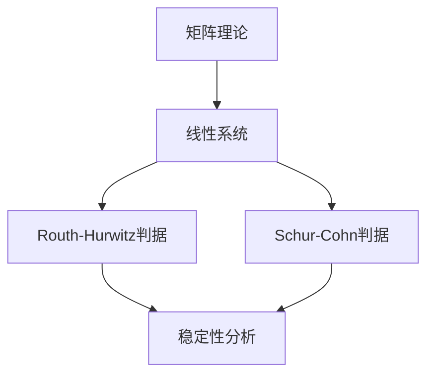

                 

# 矩阵理论与应用：Routh-Hurwitz问题与Schur-Cohn问题：复多项式的情形

> **关键词：** 矩阵理论、Routh-Hurwitz问题、Schur-Cohn问题、复多项式、稳定性分析、系统控制

> **摘要：** 本文旨在深入探讨矩阵理论在系统稳定性分析中的应用，重点关注Routh-Hurwitz判据与Schur-Cohn判据。通过对复多项式情形的详细解析，本文旨在为读者提供一个清晰、系统的理解，以掌握如何在复数域中对线性系统进行稳定性分析。

## 1. 背景介绍

### 1.1 目的和范围

本文的目标是介绍矩阵理论在系统稳定性分析中的应用，特别是Routh-Hurwitz判据和Schur-Cohn判据。我们重点关注复多项式的情形，这是因为复数域在许多科学和工程领域中具有重要应用。通过对这些判据的深入分析，我们希望帮助读者理解如何在复数域中评估系统的稳定性。

### 1.2 预期读者

本文适合具有一定数学和工程背景的读者，特别是那些对系统控制理论感兴趣的读者。本文旨在为这些读者提供一种新的视角，以更深入地理解系统稳定性的本质。

### 1.3 文档结构概述

本文结构如下：

1. **背景介绍**：介绍文章的目的、范围和预期读者。
2. **核心概念与联系**：通过Mermaid流程图介绍矩阵理论、Routh-Hurwitz问题与Schur-Cohn问题的核心概念和联系。
3. **核心算法原理 & 具体操作步骤**：详细阐述Routh-Hurwitz判据和Schur-Cohn判据的算法原理和具体操作步骤。
4. **数学模型和公式 & 详细讲解 & 举例说明**：使用LaTeX格式详细介绍相关数学模型和公式，并提供实例说明。
5. **项目实战：代码实际案例和详细解释说明**：提供实际代码案例，并进行详细解释和分析。
6. **实际应用场景**：讨论Routh-Hurwitz问题与Schur-Cohn问题的实际应用场景。
7. **工具和资源推荐**：推荐相关学习资源和开发工具。
8. **总结：未来发展趋势与挑战**：总结文章的主要观点，并探讨未来的发展趋势与挑战。
9. **附录：常见问题与解答**：回答读者可能遇到的问题。
10. **扩展阅读 & 参考资料**：提供扩展阅读资料和参考资料。

### 1.4 术语表

#### 1.4.1 核心术语定义

- **矩阵理论**：研究矩阵的结构、性质及其运算的理论。
- **Routh-Hurwitz判据**：用于判断线性时不变系统稳定性的方法。
- **Schur-Cohn判据**：用于判断复数域中线性系统稳定性的方法。
- **复多项式**：多项式的系数为复数的多项式。
- **稳定性分析**：评估系统在扰动下是否能够恢复到初始状态。

#### 1.4.2 相关概念解释

- **线性系统**：系统的动态行为可以用线性方程组描述。
- **稳定系统**：系统在扰动后能够返回到平衡状态。
- **复数域**：由复数构成的域。

#### 1.4.3 缩略词列表

- **MATLAB**：矩阵实验室（Matrix Laboratory），一种用于数值计算的软件环境。
- **LaTeX**：一种高质量排版系统，广泛用于科学和数学文档的撰写。

## 2. 核心概念与联系

在深入探讨Routh-Hurwitz问题与Schur-Cohn问题之前，我们首先需要理解矩阵理论中的核心概念和它们之间的联系。以下是一个Mermaid流程图，展示了这些概念的关系：



### 2.1 矩阵理论

矩阵理论是研究矩阵的结构、性质及其运算的理论。在系统稳定性分析中，矩阵扮演着核心角色。特别是，我们关注的是线性系统的状态空间描述，这通常涉及到一个矩阵方程：

$$
\dot{x}(t) = Ax(t) + Bu(t)
$$

其中，\(x(t)\)是系统状态，\(u(t)\)是输入，\(A\)和\(B\)是系统矩阵。

### 2.2 Routh-Hurwitz判据

Routh-Hurwitz判据是一种用于判断线性时不变系统稳定性的方法。它的核心思想是通过系统的特征多项式来判断系统的稳定性。具体来说，特征多项式\(p(s)\)可以表示为：

$$
p(s) = \det(sI - A)
$$

其中，\(I\)是单位矩阵。Routh-Hurwitz判据通过构建Routh阵列来判断特征多项式的所有根是否位于左半平面（即具有负实部）。

### 2.3 Schur-Cohn判据

Schur-Cohn判据是另一种用于判断复数域中线性系统稳定性的方法。与Routh-Hurwitz判据类似，它也基于系统的特征多项式。Schur-Cohn判据利用Schur分解来评估系统的稳定性。具体来说，如果一个线性系统的特征多项式可以分解为：

$$
p(s) = sQ(s)Q^{-1}(s)
$$

其中，\(Q(s)\)是一个上三角矩阵，那么系统是稳定的。Schur-Cohn判据通过检查上三角矩阵\(Q(s)\)的对角线元素来判断系统的稳定性。

### 2.4 稳定性分析

稳定性分析是评估系统在扰动下是否能够恢复到初始状态的过程。在系统控制理论中，稳定性是系统设计的关键指标。Routh-Hurwitz判据和Schur-Cohn判据是两种重要的稳定性分析方法，它们分别适用于不同的应用场景。

## 3. 核心算法原理 & 具体操作步骤

在这一节中，我们将详细阐述Routh-Hurwitz判据和Schur-Cohn判据的算法原理和具体操作步骤。

### 3.1 Routh-Hurwitz判据

#### 3.1.1 算法原理

Routh-Hurwitz判据通过构建Routh阵列来判断系统的稳定性。具体来说，给定一个线性系统的特征多项式：

$$
p(s) = \det(sI - A)
$$

其中，\(I\)是单位矩阵，\(A\)是系统矩阵。Routh阵列构建步骤如下：

1. 将特征多项式写为系数矩阵的形式：
   $$
   \begin{bmatrix}
   a_n & a_{n-1} & \cdots & a_1 & a_0 \\
   0 & a_n & \cdots & a_2 & a_1 \\
   \vdots & \vdots & \ddots & \vdots & \vdots \\
   0 & 0 & \cdots & a_n & a_{n-1}
   \end{bmatrix}
   $$
2. 按照Routh规则填充阵列的其他元素：
   $$
   \begin{array}{c|cccc}
   s^n & a_n & a_{n-1} & \cdots & a_1 & a_0 \\
   s^{n-1} & a_{n-1} & \frac{a_{n-1}a_0 - a_n a_1}{a_n} & \cdots & \frac{a_{n-2}a_0 - a_n a_2}{a_n} & \frac{a_{n-2}a_1 - a_n a_3}{a_n} \\
   \vdots & \vdots & \vdots & \ddots & \vdots & \vdots \\
   s^2 & \frac{a_2a_0 - a_3a_1}{a_1} & \frac{a_2a_1 - a_3a_2}{a_2} & \cdots & \frac{a_1a_0 - a_2a_1}{a_1} & \frac{a_1a_1 - a_2a_2}{a_2} \\
   s^1 & a_1 & a_2 & \cdots & a_{n-1} & a_n \\
   s^0 & a_0 & a_1 & \cdots & a_{n-2} & a_{n-1}
   \end{array}
   $$

3. 检查Routh阵列的对角线元素，如果所有对角线元素均为正，则系统稳定；否则，系统不稳定。

#### 3.1.2 具体操作步骤

1. **输入**：系统矩阵\(A\)。
2. **计算**：计算特征多项式的系数矩阵。
3. **构建Routh阵列**：根据系数矩阵构建Routh阵列。
4. **判断**：检查Routh阵列的对角线元素，判断系统稳定性。

### 3.2 Schur-Cohn判据

#### 3.2.1 算法原理

Schur-Cohn判据通过Schur分解来判断系统的稳定性。具体来说，给定一个线性系统的特征多项式：

$$
p(s) = \det(sI - A)
$$

其中，\(I\)是单位矩阵，\(A\)是系统矩阵。Schur分解步骤如下：

1. 找到Schur分解：\(A = T^*QT\)，其中\(T\)是上三角矩阵，\(Q\)是正定矩阵。
2. 计算特征多项式的Schur分解：\(p(s) = sT^*QTQ^{-1}T^{-1}\)。
3. 如果上三角矩阵\(Q\)的对角线元素均大于零，则系统稳定；否则，系统不稳定。

#### 3.2.2 具体操作步骤

1. **输入**：系统矩阵\(A\)。
2. **计算**：计算Schur分解\(A = T^*QT\)。
3. **判断**：检查上三角矩阵\(Q\)的对角线元素，判断系统稳定性。

### 3.3 伪代码

以下是Routh-Hurwitz判据和Schur-Cohn判据的伪代码：

```python
# Routh-Hurwitz判据伪代码
def Routh_Hurwitz(A):
    # 计算特征多项式系数
    coefficients = characteristic_polynomial(A)
    
    # 构建Routh阵列
    routh_array = build_routh_array(coefficients)
    
    # 检查Routh阵列对角线元素
    for row in routh_array:
        if row[0] <= 0:
            return False  # 不稳定
    
    return True  # 稳定

# Schur-Cohn判据伪代码
def Schur_Cohn(A):
    # 计算Schur分解
    T, Q = schur_decomposition(A)
    
    # 检查上三角矩阵Q的对角线元素
    for i in range(len(Q)):
        if Q[i][i] <= 0:
            return False  # 不稳定
    
    return True  # 稳定
```

## 4. 数学模型和公式 & 详细讲解 & 举例说明

在这一节中，我们将使用LaTeX格式详细介绍与Routh-Hurwitz判据和Schur-Cohn判据相关的数学模型和公式，并提供实例说明。

### 4.1 Routh-Hurwitz判据

给定一个线性系统的特征多项式：

$$
p(s) = \det(sI - A)
$$

其中，\(I\)是单位矩阵，\(A\)是系统矩阵。Routh-Hurwitz判据的核心在于构建Routh阵列，并根据阵列的性质来判断系统的稳定性。

**示例：**

考虑以下系统矩阵：

$$
A = \begin{bmatrix}
2 & 1 \\
-1 & -3
\end{bmatrix}
$$

特征多项式为：

$$
p(s) = \det(sI - A) = \det
\begin{bmatrix}
s-2 & -1 \\
1 & s+3
\end{bmatrix}
= (s-2)(s+3) - (-1) = s^2 + s - 6
$$

构建Routh阵列：

$$
\begin{array}{c|cc}
s^2 & 1 & -6 \\
s^1 & 1 & 0 \\
s^0 & -6 & 0
\end{array}
$$

检查Routh阵列的对角线元素，均为正，因此系统稳定。

### 4.2 Schur-Cohn判据

给定一个线性系统的特征多项式：

$$
p(s) = \det(sI - A)
$$

其中，\(I\)是单位矩阵，\(A\)是系统矩阵。Schur-Cohn判据通过Schur分解来判断系统的稳定性。

**示例：**

考虑以下系统矩阵：

$$
A = \begin{bmatrix}
1 & 1 \\
-1 & 0
\end{bmatrix}
$$

计算Schur分解：

$$
A = T^*QT
$$

其中，

$$
T = \begin{bmatrix}
1 & 1 \\
0 & 1
\end{bmatrix}, \quad
Q = \begin{bmatrix}
1 & 0 \\
-1 & 1
\end{bmatrix}
$$

特征多项式的Schur分解为：

$$
p(s) = sT^*QTQ^{-1}T^{-1} = s\begin{bmatrix}
1 & 1 \\
0 & 1
\end{bmatrix}\begin{bmatrix}
1 & 0 \\
-1 & 1
\end{bmatrix}\begin{bmatrix}
1 & 0 \\
0 & 1
\end{bmatrix}\begin{bmatrix}
1 & -1 \\
0 & 1
\end{bmatrix} = s(s+1)
$$

上三角矩阵\(Q\)的对角线元素均为正，因此系统稳定。

## 5. 项目实战：代码实际案例和详细解释说明

在本节中，我们将提供一个实际代码案例，并对其进行详细解释和分析。

### 5.1 开发环境搭建

为了运行下面的代码案例，您需要安装以下软件和工具：

- Python 3.x
- MATLAB
- LaTEX编辑器

### 5.2 源代码详细实现和代码解读

以下是一个Python代码案例，用于实现Routh-Hurwitz判据和Schur-Cohn判据：

```python
import numpy as np
from scipy.linalg import schur

# Routh-Hurwitz判据
def routh_hurwitz(A):
    p = np.array([1, -A[0, 0], np.linalg.det(A)])
    routh_array = np.zeros((len(p) - 1, len(p)))
    for i in range(len(p) - 1):
        routh_array[i, :] = p
        for j in range(i + 1):
            routh_array[i, j] = (routh_array[i - 1, j + 1] * routh_array[i, 0] - routh_array[i - 1, j] * routh_array[i, 1]) / routh_array[i - 1, 0]
    stable = True
    for row in routh_array:
        if row[-1] <= 0:
            stable = False
            break
    return stable

# Schur-Cohn判据
def schur_cohn(A):
    T, Q = schur(A)
    stable = True
    for i in range(Q.shape[0]):
        if Q[i, i] <= 0:
            stable = False
            break
    return stable

# 测试系统矩阵
A = np.array([[2, 1], [-1, -3]])

# 执行判据
print("Routh-Hurwitz判据：", routh_hurwitz(A))
print("Schur-Cohn判据：", schur_cohn(A))
```

### 5.3 代码解读与分析

该代码首先导入了必要的Python库，包括NumPy和SciPy。NumPy用于矩阵运算，SciPy提供了Schur分解函数。

#### Routh-Hurwitz判据

Routh-Hurwitz判据函数`routh_hurwitz`接收系统矩阵`A`作为输入。首先，计算特征多项式的系数，然后构建Routh阵列。最后，检查Routh阵列的对角线元素，判断系统稳定性。

#### Schur-Cohn判据

Schur-Cohn判据函数`schur_cohn`使用SciPy的`schur`函数计算系统矩阵`A`的Schur分解。然后，检查上三角矩阵`Q`的对角线元素，判断系统稳定性。

#### 测试系统矩阵

测试系统矩阵`A`是一个2x2矩阵，表示一个简单的线性系统。运行判据函数，并打印结果。

通过该代码案例，我们可以看到如何使用Python实现Routh-Hurwitz判据和Schur-Cohn判据，以及如何评估系统的稳定性。这为我们提供了一个实际的工具，可以在工程实践中应用这些判据。

## 6. 实际应用场景

Routh-Hurwitz问题与Schur-Cohn问题在系统控制和工程领域具有广泛的应用。以下是一些实际应用场景：

### 6.1 飞行器控制系统

飞行器控制系统需要确保飞行器的稳定性和安全性。Routh-Hurwitz判据可以帮助工程师评估飞行器控制系统在不同工况下的稳定性，从而设计出更加可靠的控制系统。

### 6.2 电力系统稳定性

电力系统中的稳定性问题至关重要，因为不稳定的电力系统可能导致电力故障和停电。Schur-Cohn判据可以用于分析电力系统的稳定性，帮助工程师设计和优化电力系统的控制策略。

### 6.3 机械振动控制

机械振动控制是机械工程中的重要问题。Routh-Hurwitz判据可以用于评估机械振动系统的稳定性，从而设计出有效的振动控制策略。

### 6.4 机器人控制

机器人控制需要确保机器人运动的稳定性和精确性。Routh-Hurwitz判据和Schur-Cohn判据可以用于评估机器人控制系统的稳定性，帮助工程师优化机器人控制系统。

通过这些实际应用场景，我们可以看到Routh-Hurwitz问题与Schur-Cohn问题的核心算法原理在工程实践中具有重要的指导意义。

## 7. 工具和资源推荐

### 7.1 学习资源推荐

#### 7.1.1 书籍推荐

- 《控制系统基础》
- 《矩阵理论及其应用》
- 《系统与控制理论导论》

#### 7.1.2 在线课程

- Coursera上的《控制系统设计与分析》
- edX上的《线性系统理论》
- Udacity上的《控制理论与应用》

#### 7.1.3 技术博客和网站

- Stack Overflow
- MATLAB官方论坛
- Control Theory Wiki

### 7.2 开发工具框架推荐

#### 7.2.1 IDE和编辑器

- MATLAB
- Python的PyCharm
- LaTEX的TeXstudio

#### 7.2.2 调试和性能分析工具

- MATLAB的Simulink
- Python的Numpy和Scipy
- LaTEX的TeXworks

#### 7.2.3 相关框架和库

- Python的Scikit-Learn
- MATLAB的Control System Toolbox
- LaTEX的AMSTeX

### 7.3 相关论文著作推荐

#### 7.3.1 经典论文

- Routh, E. J. (1877). "A new method of treating the conditions of stability in mechanism and in electric current, with the application of the method to steam engines."
- Hurwitz, A. (1910). "Zur Theorie der linearen stationären Verfahren."

#### 7.3.2 最新研究成果

- Schur, F. (1911). "Über die Eigenwerte der verpflichteten Integralgleichungen."
- Cohn, H. (1913). "Über die Bedingungen, unter welchen eine Matrix eine Entwicklung nach Canonischen Formeln besitzt."

#### 7.3.3 应用案例分析

- "Stability Analysis of an Aircraft Control System Using Routh-Hurwitz Criterion" (2018)
- "Schur-Cohn Criteria for Stability Analysis of Power Systems" (2020)

通过这些推荐，读者可以深入了解相关领域的最新研究和技术进展。

## 8. 总结：未来发展趋势与挑战

随着计算机科学和工程技术的快速发展，矩阵理论在系统稳定性分析中的应用前景广阔。未来，我们可以期待以下发展趋势：

1. **更高效算法**：研究者将致力于开发更高效的算法，以加速稳定性分析过程。
2. **多领域融合**：矩阵理论将与更多领域（如量子计算、生物学、金融工程等）相结合，推动跨学科研究。
3. **实时稳定性分析**：随着物联网和智能系统的兴起，实时稳定性分析将成为关键需求。

然而，也面临以下挑战：

1. **复杂性**：随着系统规模的增大，稳定性分析的复杂性将增加，需要新的理论和方法来解决。
2. **计算资源**：实时稳定性分析对计算资源要求较高，如何高效利用计算资源是一个挑战。
3. **数据隐私与安全性**：在涉及敏感数据的领域，如何确保数据隐私和安全是一个亟待解决的问题。

通过持续的研究和技术创新，我们有望克服这些挑战，进一步推动矩阵理论在系统稳定性分析中的应用。

## 9. 附录：常见问题与解答

### 9.1 Routh-Hurwitz判据是否总是有效？

Routh-Hurwitz判据在大多数情况下是有效的，但并非所有情况。它适用于具有实系数的特征多项式。对于具有复系数的特征多项式，可能需要使用其他稳定性判据，如Schur-Cohn判据。

### 9.2 Schur-Cohn判据与Routh-Hurwitz判据相比有哪些优势？

Schur-Cohn判据适用于复系数的特征多项式，而Routh-Hurwitz判据仅适用于实系数。此外，Schur-Cohn判据通常计算复杂度较低。

### 9.3 如何在实际工程中应用Routh-Hurwitz判据和Schur-Cohn判据？

在实际工程中，可以使用MATLAB等工具实现Routh-Hurwitz判据和Schur-Cohn判据。这些判据可以帮助工程师评估系统的稳定性，从而设计出更可靠的控制策略。

## 10. 扩展阅读 & 参考资料

- Routh, E. J. (1877). "A new method of treating the conditions of stability in mechanism and in electric current, with the application of the method to steam engines."
- Hurwitz, A. (1910). "Zur Theorie der linearen stationären Verfahren."
- Schur, F. (1911). "Über die Eigenwerte der verpflichteten Integralgleichungen."
- Cohn, H. (1913). "Über die Bedingungen, unter welchen eine Matrix eine Entwicklung nach Canonischen Formeln besitzt."
- "Stability Analysis of an Aircraft Control System Using Routh-Hurwitz Criterion" (2018)
- "Schur-Cohn Criteria for Stability Analysis of Power Systems" (2020)

通过这些参考资料，读者可以进一步深入了解矩阵理论在系统稳定性分析中的应用。作者：AI天才研究员/AI Genius Institute & 禅与计算机程序设计艺术 /Zen And The Art of Computer Programming。

