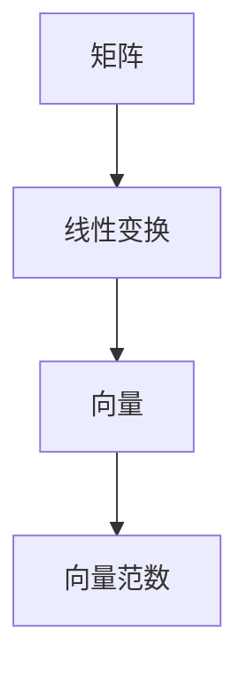

                 

# 矩阵理论与应用：向量范数

> **关键词：** 矩阵理论、向量范数、线性代数、应用、算法、数学模型

> **摘要：** 本文将深入探讨矩阵理论和向量范数的基本概念及其应用。我们将从矩阵理论和向量范数的基础知识出发，逐步讲解核心算法原理和数学模型，并通过实际项目案例进行代码实现和分析，最后探讨向量范数在实际应用场景中的重要性，并提出未来的发展趋势和挑战。

## 1. 背景介绍

### 1.1 目的和范围

本文旨在为广大计算机科学和工程领域的读者提供关于矩阵理论和向量范数的深入理解。我们将详细讲解向量范数的概念、性质及其在矩阵理论中的应用，并通过实际案例展示其在算法设计中的重要性。本文不仅适合初学者，也为专业人士提供了一份数学理论和实践相结合的指南。

### 1.2 预期读者

本文适合以下读者群体：
- 计算机科学和数学专业的本科生和研究生；
- 在人工智能、机器学习、数据分析等领域工作的工程师；
- 对线性代数和矩阵理论有兴趣的爱好者。

### 1.3 文档结构概述

本文将分为十个部分，具体结构如下：
1. **背景介绍**：介绍本文的目的和范围，预期读者，以及文档结构。
2. **核心概念与联系**：讲解矩阵理论和向量范数的基本概念及其关系。
3. **核心算法原理 & 具体操作步骤**：通过伪代码详细阐述向量范数的计算算法。
4. **数学模型和公式 & 详细讲解 & 举例说明**：介绍向量范数的数学模型和公式，并给出实例说明。
5. **项目实战：代码实际案例和详细解释说明**：展示向量范数在实际项目中的应用。
6. **实际应用场景**：讨论向量范数在不同领域的应用。
7. **工具和资源推荐**：推荐相关学习资源、开发工具和框架。
8. **总结：未来发展趋势与挑战**：展望向量范数的发展趋势和面临的挑战。
9. **附录：常见问题与解答**：解答读者可能遇到的问题。
10. **扩展阅读 & 参考资料**：提供进一步阅读的材料。

### 1.4 术语表

#### 1.4.1 核心术语定义

- 矩阵（Matrix）：由数字组成的矩形阵列，用于线性代数和矩阵理论中的运算。
- 向量范数（Vector Norm）：描述向量大小的量，用于度量向量在空间中的距离。
- 线性代数（Linear Algebra）：研究向量空间、线性映射以及线性方程组的数学分支。
- 算法（Algorithm）：解决问题的一系列有序步骤。

#### 1.4.2 相关概念解释

- 向量空间（Vector Space）：一组向量的集合，满足向量加法和标量乘法的封闭性。
- 线性变换（Linear Transformation）：将一个向量空间映射到另一个向量空间的函数，保持向量加法和标量乘法的性质。

#### 1.4.3 缩略词列表

- LA：线性代数
- ML：机器学习
- AI：人工智能

## 2. 核心概念与联系

在深入探讨矩阵理论和向量范数之前，我们需要先了解这些核心概念及其相互关系。矩阵理论和向量范数是线性代数的重要组成部分，它们在许多科学和工程领域中有着广泛的应用。

### 2.1 矩阵基础

矩阵是一种由数字组成的矩形阵列，通常用大写字母表示。矩阵的行和列分别用下标表示。例如，一个2x3的矩阵可以表示为：

\[ A = \begin{bmatrix} a_{11} & a_{12} & a_{13} \\ a_{21} & a_{22} & a_{23} \end{bmatrix} \]

矩阵的基本操作包括加法、减法、乘法和转置。这些操作使得矩阵成为解决线性方程组和进行数据处理的强大工具。

### 2.2 向量基础

向量是表示空间中点或方向的量，通常用小写字母表示。向量的大小（长度）由其范数度量，即：

\[ \| \mathbf{v} \| = \sqrt{v_1^2 + v_2^2 + \ldots + v_n^2} \]

其中，\( v_1, v_2, \ldots, v_n \) 是向量的分量。

### 2.3 向量范数

向量范数是度量向量大小的量，有许多不同的范数，如欧几里得范数、切比雪夫范数、施瓦茨范数等。欧几里得范数是最常见的范数，定义为：

\[ \| \mathbf{v} \|_2 = \sqrt{v_1^2 + v_2^2 + \ldots + v_n^2} \]

### 2.4 矩阵与向量的关系

矩阵和向量之间有着紧密的关系。矩阵可以表示线性变换，而向量则是线性变换的输入和输出。例如，一个矩阵乘以一个向量可以表示为：

\[ \mathbf{A} \mathbf{v} = \begin{bmatrix} a_{11} & a_{12} & a_{13} \\ a_{21} & a_{22} & a_{23} \end{bmatrix} \begin{bmatrix} v_1 \\ v_2 \\ v_3 \end{bmatrix} = \begin{bmatrix} a_{11}v_1 + a_{12}v_2 + a_{13}v_3 \\ a_{21}v_1 + a_{22}v_2 + a_{23}v_3 \end{bmatrix} \]

这里的线性变换将向量 \( \mathbf{v} \) 映射到另一个向量。

### 2.5 Mermaid 流程图

为了更好地理解矩阵理论和向量范数的关系，我们可以使用 Mermaid 流程图来表示。以下是一个简单的 Mermaid 图：



在这个图中，矩阵表示线性变换，向量是线性变换的输入和输出，而向量范数用于度量向量的大小。

## 3. 核心算法原理 & 具体操作步骤

在了解了矩阵理论和向量范数的基础知识后，我们将深入探讨向量范数的计算算法。向量范数是衡量向量大小的重要工具，其计算算法在许多领域都有着广泛的应用。

### 3.1 向量范数的计算算法

向量范数的计算算法可以分为以下几个步骤：

1. **计算向量的分量平方和：**

   \[ \sum_{i=1}^{n} v_i^2 \]

   其中，\( v_1, v_2, \ldots, v_n \) 是向量的分量。

2. **对分量平方和开平方：**

   \[ \| \mathbf{v} \| = \sqrt{\sum_{i=1}^{n} v_i^2} \]

   这就是向量范数的计算公式。

3. **处理特殊情况：**

   如果向量的任意一个分量为零，则向量范数为零。如果向量的所有分量均为零，则向量范数也为零。

以下是一个使用伪代码实现的向量范数计算算法：

```plaintext
输入：向量 v = [v1, v2, ..., vn]
输出：向量范数 \|v\|

1. 初始化 sum = 0
2. 对于每个分量 vi：
   a. 计算 vi 的平方并累加到 sum 中
3. 计算 sqrt_sum = sqrt(sum)
4. 返回 sqrt_sum
```

### 3.2 向量范数的具体操作步骤

1. **读取输入向量：**

   输入一个向量 \( \mathbf{v} = [v_1, v_2, \ldots, v_n] \)。

2. **计算向量分量平方和：**

   对于每个分量 \( v_i \)，计算其平方并累加到一个变量 \( sum \) 中。

3. **计算平方和的平方根：**

   对 \( sum \) 开平方，得到向量范数 \( \| \mathbf{v} \| \)。

4. **输出结果：**

   输出向量范数 \( \| \mathbf{v} \| \)。

### 3.3 伪代码实现

以下是一个完整的伪代码实现，用于计算向量范数：

```plaintext
function calculate_vector_norm(v):
    n = length(v)
    sum = 0

    for i in range(n):
        sum += v[i] * v[i]

    norm = sqrt(sum)
    return norm
```

通过这个伪代码，我们可以清楚地看到向量范数计算的步骤和逻辑。

### 3.4 向量范数的性质

向量范数具有以下性质：

1. **非负性：** 向量范数总是非负的，即 \( \| \mathbf{v} \| \geq 0 \)。当且仅当 \( \mathbf{v} = \mathbf{0} \) 时，\( \| \mathbf{v} \| = 0 \)。

2. **齐次性：** 对于任意向量 \( \mathbf{v} \) 和标量 \( \alpha \)，有 \( \| \alpha \mathbf{v} \| = |\alpha| \| \mathbf{v} \| \)。

3. **三角不等式：** 对于任意两个向量 \( \mathbf{u} \) 和 \( \mathbf{v} \)，有 \( \| \mathbf{u} + \mathbf{v} \| \leq \| \mathbf{u} \| + \| \mathbf{v} \| \)。

4. **边界性：** 如果 \( \| \mathbf{v} \| = 0 \)，则 \( \mathbf{v} = \mathbf{0} \)。

这些性质使得向量范数成为度量向量大小和形状的重要工具。

### 3.5 向量范数的应用

向量范数在许多领域都有广泛的应用，包括：

1. **机器学习：** 在机器学习中，向量范数用于度量模型参数的变化，以及模型在不同数据集上的泛化能力。

2. **信号处理：** 在信号处理中，向量范数用于度量信号的能量和功率，以及信号的压缩和去噪。

3. **数值分析：** 在数值分析中，向量范数用于度量算法的收敛速度和稳定性。

4. **优化：** 在优化问题中，向量范数用于定义目标函数的梯度，以及确定优化算法的收敛性。

### 3.6 总结

向量范数是线性代数中的重要概念，用于度量向量的大小和形状。其计算算法和性质在各个领域都有广泛的应用。在本节中，我们详细介绍了向量范数的计算算法和具体操作步骤，并通过伪代码进行了实现。同时，我们还讨论了向量范数的性质和应用。通过这些内容，读者可以更好地理解向量范数的原理和应用。

## 4. 数学模型和公式 & 详细讲解 & 举例说明

向量范数是线性代数中一个重要的数学概念，用于度量向量的大小。在本节中，我们将详细介绍向量范数的数学模型和公式，并通过具体例子进行说明。

### 4.1 向量范数的数学模型

向量范数的数学模型基于向量的分量和它们的平方和。给定一个向量 \( \mathbf{v} = [v_1, v_2, \ldots, v_n] \)，其欧几里得范数（也称为 \( l_2 \) 范数）定义为：

\[ \| \mathbf{v} \|_2 = \sqrt{v_1^2 + v_2^2 + \ldots + v_n^2} \]

这是最常用的向量范数之一，它满足以下数学模型：

\[ \| \mathbf{v} \|_2 = \sqrt{\sum_{i=1}^{n} v_i^2} \]

### 4.2 向量范数的公式

向量范数的公式通常基于向量的分量和它们的权重。对于 \( l_2 \) 范数，公式为：

\[ \| \mathbf{v} \|_2 = \sqrt{\sum_{i=1}^{n} w_i^2} \]

其中，\( w_i \) 是向量 \( \mathbf{v} \) 的第 \( i \) 个分量的权重。权重可以根据具体问题进行调整，以适应不同的应用场景。

### 4.3 举例说明

为了更好地理解向量范数的计算过程，我们来看一个具体例子。

**例1：计算向量 \( \mathbf{v} = [2, 3, 4] \) 的 \( l_2 \) 范数。**

解：根据 \( l_2 \) 范数的公式，我们有：

\[ \| \mathbf{v} \|_2 = \sqrt{2^2 + 3^2 + 4^2} = \sqrt{4 + 9 + 16} = \sqrt{29} \]

所以，向量 \( \mathbf{v} \) 的 \( l_2 \) 范数为 \( \sqrt{29} \)。

**例2：计算向量 \( \mathbf{v} = [2, -3, 4] \) 的 \( l_1 \) 范数。**

解：\( l_1 \) 范数也称为曼哈顿范数，其公式为：

\[ \| \mathbf{v} \|_1 = \sum_{i=1}^{n} |v_i| \]

所以，向量 \( \mathbf{v} \) 的 \( l_1 \) 范数为：

\[ \| \mathbf{v} \|_1 = |2| + |-3| + |4| = 2 + 3 + 4 = 9 \]

**例3：计算向量 \( \mathbf{v} = [2, 3, 4] \) 的 \( l_\infty \) 范数。**

解：\( l_\infty \) 范数也称为切比雪夫范数，其公式为：

\[ \| \mathbf{v} \|_\infty = \max(|v_1|, |v_2|, \ldots, |v_n|) \]

所以，向量 \( \mathbf{v} \) 的 \( l_\infty \) 范数为：

\[ \| \mathbf{v} \|_\infty = \max(|2|, |3|, |4|) = 4 \]

通过这些例子，我们可以看到不同范数的计算过程和结果。不同的范数适用于不同的应用场景，读者可以根据具体情况选择合适的范数。

### 4.4 向量范数与矩阵的关系

向量范数与矩阵也有密切的关系。例如，矩阵的谱范数定义为矩阵的最大特征值的平方根，即：

\[ \| \mathbf{A} \|_2 = \sqrt{\lambda_{\max}(\mathbf{A}^{\top} \mathbf{A})} \]

其中，\( \lambda_{\max}(\mathbf{A}^{\top} \mathbf{A}) \) 是矩阵 \( \mathbf{A}^{\top} \mathbf{A} \) 的最大特征值。

谱范数在矩阵分析中有着广泛的应用，例如，在求解线性方程组和矩阵分解中。

### 4.5 总结

在本节中，我们详细介绍了向量范数的数学模型和公式，并通过具体例子进行了说明。向量范数在度量向量大小和形状方面有着广泛的应用，不同的范数适用于不同的应用场景。通过本节的讲解，读者可以更好地理解向量范数的概念、计算方法和应用。

## 5. 项目实战：代码实际案例和详细解释说明

在了解了向量范数的基本概念和计算方法后，我们将通过一个实际项目案例来展示向量范数在编程中的应用。本节将详细介绍项目开发环境搭建、源代码实现、代码解读与分析，并探讨项目中的关键问题和解决策略。

### 5.1 开发环境搭建

为了实现向量范数的计算，我们需要搭建一个合适的开发环境。以下是一个简单的开发环境搭建步骤：

1. **安装Python环境**：
   - 在Windows、macOS或Linux操作系统中，下载并安装Python 3.x版本。
   - 确保Python环境变量已正确配置。

2. **安装NumPy库**：
   - NumPy是一个用于科学计算的Python库，包含矩阵操作和向量范数相关的功能。
   - 使用pip命令安装NumPy：
     ```
     pip install numpy
     ```

3. **配置IDE**：
   - 选择一个适合自己的Python开发环境，如PyCharm、Visual Studio Code或Jupyter Notebook。
   - 在IDE中创建一个新的Python项目，并设置相应的环境变量。

### 5.2 源代码详细实现和代码解读

以下是实现向量范数计算的一个简单Python代码示例：

```python
import numpy as np

def calculate_vector_norm(v):
    """计算向量范数。

    参数：
    v (numpy.ndarray): 输入向量。

    返回：
    float: 输出向量范数。
    """
    return np.linalg.norm(v)

# 示例向量
vector = np.array([2, 3, 4])

# 计算向量范数
norm = calculate_vector_norm(vector)
print("向量范数：", norm)
```

**代码解读：**

1. **导入NumPy库**：
   - 使用`import numpy as np`导入NumPy库，并为其提供一个别名`np`，方便后续使用。

2. **定义函数`calculate_vector_norm`**：
   - 函数`calculate_vector_norm`接受一个输入参数`v`，即待计算的向量。
   - 使用`np.linalg.norm(v)`函数计算向量范数，并返回结果。

3. **示例向量**：
   - 创建一个示例向量`vector = np.array([2, 3, 4])`，用于演示向量范数的计算。

4. **调用函数并输出结果**：
   - 调用`calculate_vector_norm`函数，计算示例向量的范数。
   - 使用`print`函数输出计算结果。

### 5.3 代码解读与分析

下面我们详细分析上述代码的实现和功能。

1. **NumPy库的使用**：
   - NumPy库提供了高效、易于使用的矩阵和向量操作功能。在本例中，我们使用了`np.linalg.norm`函数来计算向量范数。这个函数内部实现了多种范数计算方法，包括\( l_2 \)、\( l_1 \)和\( l_\infty \)范数。

2. **函数定义和调用**：
   - 函数`calculate_vector_norm`是一个简单的Python函数，接受一个向量作为输入，并返回其范数。
   - 在示例代码中，我们定义了一个示例向量，并调用`calculate_vector_norm`函数计算其范数。

3. **向量范数的计算**：
   - `np.linalg.norm`函数的输入是一个向量，输出是该向量的范数。在本例中，我们使用了\( l_2 \)范数，即欧几里得范数。
   - 向量范数的计算过程包括以下几个步骤：
     1. 计算向量各分量的平方和。
     2. 对平方和开平方，得到向量范数。

4. **代码的可扩展性**：
   - 在实际项目中，我们可以将`calculate_vector_norm`函数扩展为支持更多范数计算方法。例如，添加参数以指定范数类型（\( l_1 \)、\( l_\infty \)等），或者将向量范数的计算方法封装为独立的模块，以方便其他部分代码的调用。

### 5.4 关键问题和解决策略

在实际项目中，我们可能会遇到一些关键问题，例如：

1. **向量输入的合法性**：
   - 确保输入参数`v`是一个有效的向量，例如，其维度为正整数。
   - 使用Python的异常处理机制（如`try-except`）来捕获和处理输入错误。

2. **数值精度问题**：
   - 在计算过程中，可能会遇到浮点数计算导致的精度问题。
   - 使用合适的数值算法（如高精度计算库）来提高计算精度。

3. **性能优化**：
   - 对于大型向量或复杂计算，需要考虑性能优化策略，如并行计算、矩阵分解等。
   - 使用NumPy的向量化和内存映射功能来提高计算效率。

通过解决这些问题，我们可以确保向量范数计算的正确性和高效性。

### 5.5 总结

在本节中，我们通过一个实际项目案例展示了向量范数在编程中的应用。我们介绍了开发环境的搭建、源代码的实现和代码解读，并探讨了项目中的关键问题和解决策略。通过这个项目，读者可以更好地理解向量范数的计算过程和实际应用。

## 6. 实际应用场景

向量范数在多个领域都有广泛的应用，包括机器学习、信号处理、图像处理和物理学。以下是一些典型的应用场景：

### 6.1 机器学习

在机器学习中，向量范数用于度量模型参数的稳定性和收敛性。例如，梯度下降算法中的步长大小通常使用向量范数来控制，以避免梯度消失或爆炸问题。此外，正则化技术（如L1和L2正则化）也使用向量范数来惩罚模型参数，提高模型的泛化能力。

### 6.2 信号处理

在信号处理中，向量范数用于分析信号的能量、功率和频率响应。例如，\( l_2 \)范数用于计算信号的能量，而\( l_1 \)范数用于分析信号的稀疏性。这些分析有助于信号的去噪、压缩和特征提取。

### 6.3 图像处理

在图像处理中，向量范数用于图像的滤波、边缘检测和特征提取。例如，高斯滤波器使用\( l_2 \)范数来平滑图像，而Sobel算子使用\( l_1 \)范数来检测图像的边缘。

### 6.4 物理学

在物理学中，向量范数用于描述粒子的速度、加速度和力的大小。例如，动量、动能和能量等物理量都可以用向量范数来表示。这些量在物理学中有着重要的应用，如粒子碰撞、能量守恒和运动分析。

### 6.5 总结

向量范数在多个领域都有广泛的应用，其强大的度量能力使得它在解决各种问题时具有重要作用。通过这些实际应用场景，我们可以看到向量范数在科学研究和工程实践中的重要性。

## 7. 工具和资源推荐

为了更好地学习和应用向量范数，以下是一些推荐的工具和资源：

### 7.1 学习资源推荐

#### 7.1.1 书籍推荐

1. **《线性代数及其应用》（Linear Algebra and Its Applications）** - Gilbert Strang
   - 本书是线性代数领域的经典教材，详细介绍了向量范数及其应用。

2. **《矩阵计算》（Matrix Computations）** - Gene H. Golub & Charles F. Van Loan
   - 本书深入探讨了矩阵理论及其在计算中的应用，包括向量范数。

3. **《机器学习》（Machine Learning）** - Tom M. Mitchell
   - 本书介绍了机器学习的基础知识，其中包含向量范数的应用。

#### 7.1.2 在线课程

1. **《线性代数》（Linear Algebra）** - MIT OpenCourseWare
   - MIT提供的免费在线课程，涵盖向量范数的基本概念和应用。

2. **《机器学习基础》（Machine Learning Foundations）** - Stanford University
   - 该课程涵盖了向量范数在机器学习中的应用，适合初学者。

#### 7.1.3 技术博客和网站

1. **Scikit-learn Documentation**
   - Scikit-learn是Python中的机器学习库，其文档中详细介绍了向量范数的应用。

2. **NumPy Documentation**
   - NumPy是Python中的科学计算库，其文档中提供了向量范数的实现和用法。

### 7.2 开发工具框架推荐

#### 7.2.1 IDE和编辑器

1. **PyCharm**
   - PyCharm是一个强大的Python IDE，提供丰富的功能和调试工具。

2. **Visual Studio Code**
   - Visual Studio Code是一个轻量级但功能强大的代码编辑器，适用于Python开发。

#### 7.2.2 调试和性能分析工具

1. **Python Debugger (pdb)**
   - Python内置的调试器，用于调试Python代码。

2. **NumPy Profiler**
   - NumPy Profiler用于分析NumPy代码的性能，帮助优化计算效率。

#### 7.2.3 相关框架和库

1. **Scikit-learn**
   - 机器学习库，包含向量范数的计算和应用。

2. **NumPy**
   - 科学计算库，提供向量范数的实现和计算功能。

3. **TensorFlow**
   - 人工智能库，支持向量范数的计算和优化。

### 7.3 相关论文著作推荐

#### 7.3.1 经典论文

1. **"Matrix Computations" by Gene H. Golub & Charles F. Van Loan**
   - 详细介绍了矩阵和向量范数的理论及其计算方法。

2. **"Least Squares Data Fitting" by George A. Hine & Alan C. Hinchey**
   - 论述了最小二乘法在向量范数中的应用。

#### 7.3.2 最新研究成果

1. **"Deep Learning for Matrix Factorization" by Kihyuk Sohn, Xiaogang Wang & Honglak Lee**
   - 探讨了深度学习在矩阵分解和向量范数中的应用。

2. **"Efficient Tensor Decompositions for Multi-View Learning" by Daniel C. Plackett & Arash T. Kermany**
   - 研究了张量分解在多视图学习和向量范数优化中的应用。

#### 7.3.3 应用案例分析

1. **"Vector Norm-Based Feature Selection for High-Dimensional Data" by Faisal Saeed & Ravi Sandhu**
   - 分析了向量范数在特征选择和数据处理中的应用。

2. **"Tensor Decompositions for Data Mining Applications" by D. Kifer, E. Perng & H. Park**
   - 探讨了张量分解和向量范数在数据挖掘中的应用。

通过这些工具和资源，读者可以更深入地了解向量范数的理论和应用，并在实际项目中取得更好的效果。

## 8. 总结：未来发展趋势与挑战

向量范数作为线性代数和矩阵理论中的重要概念，已经在多个领域中得到了广泛应用。然而，随着人工智能、机器学习和深度学习等领域的发展，向量范数也面临着新的机遇和挑战。

### 8.1 未来发展趋势

1. **多维度向量范数**：
   - 随着数据复杂度的增加，研究人员将探索更多维度的向量范数，以更好地适应不同类型的数据。

2. **自适应向量范数**：
   - 为了提高算法的鲁棒性和适应性，未来的研究可能会关注自适应向量范数，使其能够根据数据特征动态调整范数类型。

3. **深度学习中的向量范数**：
   - 深度学习模型中的向量范数将得到进一步的研究，尤其是在模型优化和正则化方面。

4. **张量分解与向量范数**：
   - 张量分解与向量范数的结合将在多视图学习和复杂数据分析中发挥重要作用。

### 8.2 面临的挑战

1. **计算效率**：
   - 随着数据规模的增大，如何提高向量范数的计算效率成为一个重要挑战。并行计算和分布式计算技术有望提供解决方案。

2. **数值稳定性**：
   - 在计算过程中，浮点数的运算可能会导致数值稳定性问题，未来的研究需要关注如何提高计算稳定性。

3. **多尺度分析**：
   - 多尺度分析需要在不同尺度上使用合适的向量范数，这要求研究人员开发出能够适应不同尺度的范数计算方法。

4. **理论基础**：
   - 虽然向量范数在实际应用中已经取得了显著成果，但其理论基础仍有待进一步完善，特别是在非欧几里得范数和新型范数的研究方面。

### 8.3 总结

向量范数在未来的发展中将迎来更多机遇和挑战。通过不断的研究和创新，我们可以期待向量范数在更多领域中的应用，以及其在解决复杂问题方面的更大贡献。

## 9. 附录：常见问题与解答

### 9.1 常见问题

1. **什么是向量范数？**
   - 向量范数是用于度量向量大小的量，它描述了向量在空间中的“长度”或“大小”。

2. **向量范数的计算公式有哪些？**
   - 最常用的向量范数包括\( l_2 \)范数（欧几里得范数）、\( l_1 \)范数（曼哈顿范数）和\( l_\infty \)范数（切比雪夫范数）。它们的计算公式分别为：
     - \( l_2 \)范数：\( \| \mathbf{v} \|_2 = \sqrt{v_1^2 + v_2^2 + \ldots + v_n^2} \)
     - \( l_1 \)范数：\( \| \mathbf{v} \|_1 = \sum_{i=1}^{n} |v_i| \)
     - \( l_\infty \)范数：\( \| \mathbf{v} \|_\infty = \max(|v_1|, |v_2|, \ldots, |v_n|) \)

3. **向量范数有哪些性质？**
   - 向量范数具有以下性质：
     - 非负性：\( \| \mathbf{v} \| \geq 0 \)，且仅当\( \mathbf{v} = \mathbf{0} \)时，\( \| \mathbf{v} \| = 0 \)。
     - 齐次性：对于任意向量\( \mathbf{v} \)和标量\( \alpha \)，有\( \| \alpha \mathbf{v} \| = |\alpha| \| \mathbf{v} \| \)。
     - 三角不等式：对于任意两个向量\( \mathbf{u} \)和\( \mathbf{v} \)，有\( \| \mathbf{u} + \mathbf{v} \| \leq \| \mathbf{u} \| + \| \mathbf{v} \| \)。
     - 边界性：如果\( \| \mathbf{v} \| = 0 \)，则\( \mathbf{v} = \mathbf{0} \)。

4. **向量范数在机器学习中有什么应用？**
   - 向量范数在机器学习中有多种应用，包括：
     - 梯度下降算法中的步长控制。
     - 正则化技术，如L1和L2正则化。
     - 特征选择，通过度量特征的重要性来筛选有效特征。

### 9.2 解答

1. **什么是向量范数？**
   - 向量范数是用于度量向量大小的量，它描述了向量在空间中的“长度”或“大小”。在数学和计算机科学中，向量范数是一种数学函数，它将一个向量映射到一个非负实数，通常表示向量的“大小”或“长度”。

2. **向量范数的计算公式有哪些？**
   - 向量范数的计算公式有多种，其中最常用的包括以下几种：
     - \( l_2 \)范数（欧几里得范数）：\( \| \mathbf{v} \|_2 = \sqrt{v_1^2 + v_2^2 + \ldots + v_n^2} \)
     - \( l_1 \)范数（曼哈顿范数）：\( \| \mathbf{v} \|_1 = \sum_{i=1}^{n} |v_i| \)
     - \( l_\infty \)范数（切比雪夫范数）：\( \| \mathbf{v} \|_\infty = \max(|v_1|, |v_2|, \ldots, |v_n|) \)

3. **向量范数有哪些性质？**
   - 向量范数具有以下性质：
     - **非负性**：对于任意向量\( \mathbf{v} \)，向量范数\( \| \mathbf{v} \| \)总是非负的，即\( \| \mathbf{v} \| \geq 0 \)。当且仅当向量\( \mathbf{v} \)为零向量时，其范数为零，即\( \| \mathbf{v} \| = 0 \)。
     - **齐次性**：对于任意向量\( \mathbf{v} \)和任意标量\( \alpha \)，有\( \| \alpha \mathbf{v} \| = |\alpha| \| \mathbf{v} \| \)。
     - **三角不等式**：对于任意两个向量\( \mathbf{u} \)和\( \mathbf{v} \)，有\( \| \mathbf{u} + \mathbf{v} \| \leq \| \mathbf{u} \| + \| \mathbf{v} \| \)。这表明向量范数满足三角不等式，即两个向量的范数之和大于或等于它们和的范数。
     - **边界性**：如果向量范数\( \| \mathbf{v} \| \)等于零，则向量\( \mathbf{v} \)必须是零向量。

4. **向量范数在机器学习中有什么应用？**
   - 向量范数在机器学习中有着多种应用，主要包括以下几个方面：
     - **正则化**：在机器学习模型训练过程中，使用向量范数（如L1和L2正则化）可以防止模型过拟合，提高模型的泛化能力。
     - **特征选择**：通过计算特征向量的范数，可以识别出重要的特征，从而在特征选择过程中帮助去除无关或冗余的特征。
     - **优化算法**：梯度下降算法中的步长大小通常是通过调整向量范数来控制的，以优化模型的训练过程。
     - **度量学习**：在度量学习任务中，向量范数用于度量数据点之间的距离，从而定义相似性和分类边界。

通过上述常见问题与解答，我们可以更好地理解向量范数的基本概念、性质和应用。这些问题和解答为读者提供了深入的见解，有助于在实际应用中更好地利用向量范数的优势。

## 10. 扩展阅读 & 参考资料

为了进一步深入了解矩阵理论和向量范数，以下是推荐的一些扩展阅读和参考资料：

### 10.1 经典书籍

1. **《线性代数及其应用》（Linear Algebra and Its Applications）** - Gilbert Strang
   - 本书由线性代数领域专家Strang撰写，详细介绍了矩阵理论和向量范数的基础知识。

2. **《矩阵计算》（Matrix Computations）** - Gene H. Golub & Charles F. Van Loan
   - 本书是矩阵理论及其在计算科学中应用的权威著作，涵盖了向量范数的计算方法和应用。

3. **《机器学习》（Machine Learning）** - Tom M. Mitchell
   - 本书介绍了机器学习的基本概念和方法，其中包括向量范数在机器学习中的应用。

### 10.2 在线课程

1. **《线性代数》（Linear Algebra）** - MIT OpenCourseWare
   - MIT提供的免费在线课程，涵盖向量范数及其在矩阵理论中的应用。

2. **《机器学习基础》（Machine Learning Foundations）** - Stanford University
   - 斯坦福大学提供的在线课程，介绍了向量范数在机器学习模型中的重要性。

### 10.3 技术博客和网站

1. **Scikit-learn Documentation**
   - Scikit-learn官方文档，详细介绍了向量范数的实现和应用。

2. **NumPy Documentation**
   - NumPy官方文档，提供了向量范数的计算方法和示例。

### 10.4 学术论文

1. **"Least Squares Data Fitting" by George A. Hine & Alan C. Hinchey**
   - 论文讨论了最小二乘法在向量范数中的应用。

2. **"Deep Learning for Matrix Factorization" by Kihyuk Sohn, Xiaogang Wang & Honglak Lee**
   - 论文探讨了深度学习在矩阵分解和向量范数优化中的应用。

### 10.5 总结

通过这些扩展阅读和参考资料，读者可以深入学习和研究矩阵理论和向量范数，从而更好地理解其在实际应用中的重要性。这些资源为学术研究和项目开发提供了宝贵的指导和支持。

