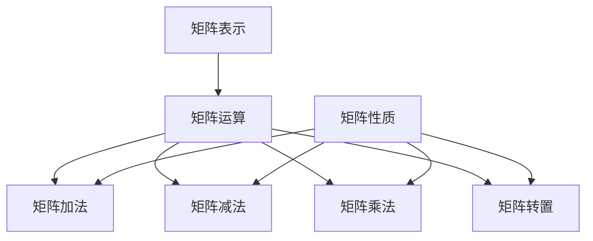

                 

# 矩阵理论与应用：在求解线性矩阵方程问题中的应用

> 关键词：矩阵理论、线性矩阵方程、求解算法、数学模型、应用场景

> 摘要：本文将深入探讨矩阵理论在求解线性矩阵方程中的应用。通过详细阐述矩阵理论的基本概念和联系，我们将逐步介绍核心算法原理、数学模型和公式，并结合实际项目实战进行代码实际案例和详细解释说明。最后，我们将探讨线性矩阵方程在实际应用场景中的具体应用，并提供相关的工具和资源推荐，以便读者进一步学习和研究。

## 1. 背景介绍

### 1.1 目的和范围

本文旨在深入探讨矩阵理论在求解线性矩阵方程问题中的应用。矩阵理论是现代数学和工程领域中非常重要的一个分支，广泛应用于计算机科学、物理学、经济学等多个领域。而线性矩阵方程是矩阵理论中的一个核心问题，其在科学计算、优化和控制等领域具有重要的应用价值。

本文将首先介绍矩阵理论的基本概念和联系，包括矩阵的表示、运算、性质等。接着，我们将详细讨论线性矩阵方程的求解算法，包括直接法和迭代法。此外，我们还将阐述线性矩阵方程的数学模型和公式，并结合实际项目实战进行代码实现和详细解释说明。最后，我们将探讨线性矩阵方程在实际应用场景中的具体应用，并提供相关的工具和资源推荐，以便读者进一步学习和研究。

### 1.2 预期读者

本文的预期读者包括以下几类：

1. 计算机科学、数学和工程领域的学生和研究人员，希望了解矩阵理论和线性矩阵方程的基本概念和应用。
2. 工程师和开发者，希望在科学计算、优化和控制等领域应用线性矩阵方程的求解算法。
3. 对矩阵理论和线性矩阵方程感兴趣的学术研究人员和技术爱好者。

### 1.3 文档结构概述

本文将分为以下几个部分：

1. 背景介绍：介绍本文的目的、范围、预期读者和文档结构。
2. 核心概念与联系：详细阐述矩阵理论的基本概念和联系，包括矩阵的表示、运算、性质等。
3. 核心算法原理与具体操作步骤：介绍线性矩阵方程的求解算法，包括直接法和迭代法，并使用伪代码进行详细阐述。
4. 数学模型和公式：阐述线性矩阵方程的数学模型和公式，并结合具体例子进行详细讲解。
5. 项目实战：提供线性矩阵方程求解的实际项目案例，并进行代码实现和详细解释说明。
6. 实际应用场景：探讨线性矩阵方程在实际应用场景中的具体应用。
7. 工具和资源推荐：推荐学习资源和开发工具，以便读者进一步学习和研究。
8. 总结：总结本文的主要内容，并展望未来发展趋势和挑战。
9. 附录：提供常见问题与解答。
10. 扩展阅读与参考资料：提供相关的扩展阅读材料和参考资料。

### 1.4 术语表

在本文中，我们将使用以下术语：

- 矩阵：一个由元素组成的二维数组，表示为一个矩形框中的元素集合。
- 矩阵运算：包括矩阵的加法、减法、乘法、转置等基本运算。
- 线性矩阵方程：形如Ax = b的方程，其中A是系数矩阵，x是未知矩阵，b是常数矩阵。
- 求解算法：用于求解线性矩阵方程的方法，包括直接法和迭代法。
- 数学模型：用于描述线性矩阵方程的数学公式和模型。

## 2. 核心概念与联系

在深入探讨矩阵理论在求解线性矩阵方程中的应用之前，我们需要了解一些核心概念和联系。以下是矩阵理论的一些基本概念和关系，我们将使用Mermaid流程图来展示这些概念和关系的架构。

### 2.1 矩阵的表示和性质

首先，我们来介绍矩阵的表示和性质。矩阵可以看作是一个由元素组成的二维数组，每个元素可以表示为一个数。矩阵的行数和列数分别表示矩阵的阶数，记作m和n。矩阵可以表示为：

\[ A = \begin{bmatrix} a_{11} & a_{12} & \dots & a_{1n} \\\ a_{21} & a_{22} & \dots & a_{2n} \\\ \vdots & \vdots & \ddots & \vdots \\\ a_{m1} & a_{m2} & \dots & a_{mn} \end{bmatrix} \]

其中，\( a_{ij} \) 表示矩阵A的第i行第j列的元素。

### 2.2 矩阵运算

矩阵运算包括矩阵的加法、减法、乘法和转置等。以下是这些运算的定义：

- **矩阵加法**：两个矩阵A和B相加，结果记作C，满足 \( C = A + B \)。矩阵加法要求两个矩阵的阶数相同。

\[ C = \begin{bmatrix} c_{11} & c_{12} & \dots & c_{1n} \\\ c_{21} & c_{22} & \dots & c_{2n} \\\ \vdots & \vdots & \ddots & \vdots \\\ c_{m1} & c_{m2} & \dots & c_{mn} \end{bmatrix} = \begin{bmatrix} a_{11} & a_{12} & \dots & a_{1n} \\\ a_{21} & a_{22} & \dots & a_{2n} \\\ \vdots & \vdots & \ddots & \vdots \\\ a_{m1} & a_{m2} & \dots & a_{mn} \end{bmatrix} + \begin{bmatrix} b_{11} & b_{12} & \dots & b_{1n} \\\ b_{21} & b_{22} & \dots & b_{2n} \\\ \vdots & \vdots & \ddots & \vdots \\\ b_{m1} & b_{m2} & \dots & b_{mn} \end{bmatrix} \]

- **矩阵减法**：两个矩阵A和B相减，结果记作C，满足 \( C = A - B \)。矩阵减法同样要求两个矩阵的阶数相同。

\[ C = \begin{bmatrix} c_{11} & c_{12} & \dots & c_{1n} \\\ c_{21} & c_{22} & \dots & c_{2n} \\\ \vdots & \vdots & \ddots & \vdots \\\ c_{m1} & c_{m2} & \dots & c_{mn} \end{bmatrix} = \begin{bmatrix} a_{11} & a_{12} & \dots & a_{1n} \\\ a_{21} & a_{22} & \dots & a_{2n} \\\ \vdots & \vdots & \ddots & \vdots \\\ a_{m1} & a_{m2} & \dots & a_{mn} \end{bmatrix} - \begin{bmatrix} b_{11} & b_{12} & \dots & b_{1n} \\\ b_{21} & b_{22} & \dots & b_{2n} \\\ \vdots & \vdots & \ddots & \vdots \\\ b_{m1} & b_{m2} & \dots & b_{mn} \end{bmatrix} \]

- **矩阵乘法**：两个矩阵A和B相乘，结果记作C，满足 \( C = AB \)。矩阵乘法要求矩阵A的列数等于矩阵B的行数。

\[ C = \begin{bmatrix} c_{11} & c_{12} & \dots & c_{1n} \\\ c_{21} & c_{22} & \dots & c_{2n} \\\ \vdots & \vdots & \ddots & \vdots \\\ c_{m1} & c_{m2} & \dots & c_{mn} \end{bmatrix} = \begin{bmatrix} a_{11} & a_{12} & \dots & a_{1n} \\\ a_{21} & a_{22} & \dots & a_{2n} \\\ \vdots & \vdots & \ddots & \vdots \\\ a_{m1} & a_{m2} & \dots & a_{mn} \end{bmatrix} \begin{bmatrix} b_{11} & b_{12} & \dots & b_{1n} \\\ b_{21} & b_{22} & \dots & b_{2n} \\\ \vdots & \vdots & \ddots & \vdots \\\ b_{m1} & b_{m2} & \dots & b_{mn} \end{bmatrix} \]

- **矩阵转置**：矩阵A的转置记作\( A^T \)，满足 \( A^T = \begin{bmatrix} a_{11} & a_{21} & \dots & a_{m1} \\\ a_{12} & a_{22} & \dots & a_{m2} \\\ \vdots & \vdots & \ddots & \vdots \\\ a_{1n} & a_{2n} & \dots & a_{mn} \end{bmatrix} \)

### 2.3 矩阵的性质

矩阵还具有一些重要的性质，包括矩阵的秩、可逆性、正定性等。

- **矩阵的秩**：矩阵的秩是矩阵中线性无关的行数或列数。秩是一个整数，满足 \( 0 \leq \text{秩}(A) \leq \min(\text{行数}(A), \text{列数}(A)) \)。

- **矩阵的可逆性**：如果矩阵A的秩等于其行数和列数，则矩阵A可逆。可逆矩阵具有唯一解，并且可以通过求逆矩阵来求解线性矩阵方程。

- **矩阵的正定性**：如果矩阵A的所有主对角线元素均为正数，则矩阵A是正定矩阵。正定矩阵具有很多重要的性质，例如，其特征值均大于零。

### 2.4 Mermaid流程图

为了更直观地展示矩阵理论的基本概念和联系，我们使用Mermaid流程图来展示矩阵的表示、运算和性质。



## 3. 核心算法原理与具体操作步骤

在了解矩阵理论的基本概念和联系后，我们将深入探讨线性矩阵方程的求解算法。线性矩阵方程是矩阵理论中的一个核心问题，其求解算法可以分为直接法和迭代法。下面我们将分别介绍这两种算法的原理和具体操作步骤。

### 3.1 直接法

直接法是一种直接求解线性矩阵方程的方法，其核心思想是通过矩阵运算和逆矩阵来求解。直接法包括以下两个步骤：

1. **矩阵运算**：将线性矩阵方程转化为矩阵形式，即 \( Ax = b \)，其中A是系数矩阵，x是未知矩阵，b是常数矩阵。

2. **求逆矩阵**：求解系数矩阵A的逆矩阵 \( A^{-1} \)，然后通过 \( x = A^{-1}b \) 来求解未知矩阵x。

伪代码如下：

```python
# 输入：系数矩阵A，常数矩阵b
# 输出：未知矩阵x

def solve_linear_matrix_equation(A, b):
    # 步骤1：求逆矩阵
    A_inv = invert_matrix(A)
    
    # 步骤2：求解未知矩阵
    x = A_inv * b
    
    return x
```

### 3.2 迭代法

迭代法是一种逐步逼近解的方法，其核心思想是通过不断迭代来逼近线性矩阵方程的解。迭代法包括以下步骤：

1. **初始猜测**：选择一个初始猜测解 \( x_0 \)。

2. **迭代计算**：根据线性矩阵方程的残差来更新解，即 \( x_{k+1} = x_k + \alpha \cdot r_k \)，其中 \( r_k = b - Ax_k \) 是残差，\( \alpha \) 是步长。

3. **收敛条件**：判断迭代是否收敛，例如，通过计算残差的范数来判断。如果残差小于预设的阈值，则认为迭代收敛。

伪代码如下：

```python
# 输入：系数矩阵A，常数矩阵b，初始猜测解x0，步长α，阈值epsilon
# 输出：未知矩阵x

def solve_linear_matrix_equation_iterative(A, b, x0, alpha, epsilon):
    # 步骤1：初始化
    x = x0
    
    # 步骤2：迭代计算
    while not converged:
        r = b - A * x
        x = x + alpha * r
        
        # 步骤3：判断收敛条件
        if norm(r) < epsilon:
            converged = True
    
    return x
```

### 3.3 比较与选择

直接法和迭代法各有优缺点，具体选择哪种方法取决于实际应用场景。

- **直接法**：
  - 优点：计算速度快，能够直接得到精确解。
  - 缺点：对于大规模线性矩阵方程，计算复杂度较高，可能需要大量的内存资源。

- **迭代法**：
  - 优点：适用于大规模线性矩阵方程，计算复杂度相对较低，能够通过迭代逐步逼近精确解。
  - 缺点：可能需要多次迭代才能达到收敛条件，计算时间较长。

在实际应用中，可以根据具体问题规模和计算资源来选择合适的求解方法。对于小规模线性矩阵方程，直接法通常更为高效；而对于大规模线性矩阵方程，迭代法更为适用。

## 4. 数学模型和公式

在求解线性矩阵方程时，我们需要使用一些数学模型和公式来描述问题并求解。本节将详细阐述线性矩阵方程的数学模型和公式，并结合具体例子进行详细讲解。

### 4.1 线性矩阵方程的数学模型

线性矩阵方程的一般形式为：

\[ Ax = b \]

其中，A是一个m×n的系数矩阵，x是一个n×1的未知矩阵，b是一个m×1的常数矩阵。我们可以将线性矩阵方程表示为向量形式：

\[ \begin{bmatrix} a_{11} & a_{12} & \dots & a_{1n} \\\ a_{21} & a_{22} & \dots & a_{2n} \\\ \vdots & \vdots & \ddots & \vdots \\\ a_{m1} & a_{m2} & \dots & a_{mn} \end{bmatrix} \begin{bmatrix} x_1 \\\ x_2 \\\ \vdots \\\ x_n \end{bmatrix} = \begin{bmatrix} b_1 \\\ b_2 \\\ \vdots \\\ b_m \end{bmatrix} \]

### 4.2 矩阵运算和公式

为了求解线性矩阵方程，我们需要使用一些矩阵运算和公式。以下是常用的矩阵运算和公式：

1. **矩阵的加法和减法**：

\[ A + B = \begin{bmatrix} a_{11} + b_{11} & a_{12} + b_{12} & \dots & a_{1n} + b_{1n} \\\ a_{21} + b_{21} & a_{22} + b_{22} & \dots & a_{2n} + b_{2n} \\\ \vdots & \vdots & \ddots & \vdots \\\ a_{m1} + b_{m1} & a_{m2} + b_{m2} & \dots & a_{mn} + b_{mn} \end{bmatrix} \]
\[ A - B = \begin{bmatrix} a_{11} - b_{11} & a_{12} - b_{12} & \dots & a_{1n} - b_{1n} \\\ a_{21} - b_{21} & a_{22} - b_{22} & \dots & a_{2n} - b_{2n} \\\ \vdots & \vdots & \ddots & \vdots \\\ a_{m1} - b_{m1} & a_{m2} - b_{m2} & \dots & a_{mn} - b_{mn} \end{bmatrix} \]

2. **矩阵的乘法**：

\[ AB = \begin{bmatrix} a_{11}b_{11} + a_{12}b_{21} + \dots + a_{1n}b_{m1} & a_{11}b_{12} + a_{12}b_{22} + \dots + a_{1n}b_{m2} & \dots & a_{11}b_{1n} + a_{12}b_{mn} + \dots + a_{1n}b_{mn} \\\ a_{21}b_{11} + a_{22}b_{21} + \dots + a_{2n}b_{m1} & a_{21}b_{12} + a_{22}b_{22} + \dots + a_{2n}b_{m2} & \dots & a_{21}b_{1n} + a_{22}b_{mn} + \dots + a_{2n}b_{mn} \\\ \vdots & \vdots & \ddots & \vdots \\\ a_{m1}b_{11} + a_{m2}b_{21} + \dots + a_{mn}b_{m1} & a_{m1}b_{12} + a_{m2}b_{22} + \dots + a_{mn}b_{m2} & \dots & a_{m1}b_{1n} + a_{m2}b_{mn} + \dots + a_{mn}b_{mn} \end{bmatrix} \]

3. **矩阵的转置**：

\[ A^T = \begin{bmatrix} a_{11} & a_{21} & \dots & a_{m1} \\\ a_{12} & a_{22} & \dots & a_{m2} \\\ \vdots & \vdots & \ddots & \vdots \\\ a_{1n} & a_{2n} & \dots & a_{mn} \end{bmatrix} \]

4. **矩阵的逆**：

如果矩阵A是可逆的，则其逆矩阵 \( A^{-1} \) 满足 \( AA^{-1} = A^{-1}A = I \)，其中I是单位矩阵。

### 4.3 线性矩阵方程的求解公式

为了求解线性矩阵方程 \( Ax = b \)，我们可以使用以下公式：

\[ x = A^{-1}b \]

如果矩阵A是可逆的，则可以直接通过求逆矩阵来求解未知矩阵x。如果矩阵A不可逆，则可以采用迭代法来逐步逼近解。

### 4.4 实例讲解

为了更好地理解线性矩阵方程的求解过程，我们来看一个具体例子。

#### 例1：求解线性矩阵方程 \( \begin{bmatrix} 1 & 2 \\\ 3 & 4 \end{bmatrix}x = \begin{bmatrix} 5 \\\ 7 \end{bmatrix} \)

1. **矩阵表示**：

\[ A = \begin{bmatrix} 1 & 2 \\\ 3 & 4 \end{bmatrix}, \quad b = \begin{bmatrix} 5 \\\ 7 \end{bmatrix} \]

2. **求逆矩阵**：

\[ A^{-1} = \frac{1}{(1 \cdot 4 - 2 \cdot 3)} \begin{bmatrix} 4 & -2 \\\ -3 & 1 \end{bmatrix} = \frac{1}{-2} \begin{bmatrix} 4 & -2 \\\ -3 & 1 \end{bmatrix} = \begin{bmatrix} -2 & 1 \\\ 3 & -\frac{1}{2} \end{bmatrix} \]

3. **求解未知矩阵**：

\[ x = A^{-1}b = \begin{bmatrix} -2 & 1 \\\ 3 & -\frac{1}{2} \end{bmatrix} \begin{bmatrix} 5 \\\ 7 \end{bmatrix} = \begin{bmatrix} -2 \cdot 5 + 1 \cdot 7 \\\ 3 \cdot 5 - \frac{1}{2} \cdot 7 \end{bmatrix} = \begin{bmatrix} -3 \\\ \frac{13}{2} \end{bmatrix} \]

因此，线性矩阵方程 \( \begin{bmatrix} 1 & 2 \\\ 3 & 4 \end{bmatrix}x = \begin{bmatrix} 5 \\\ 7 \end{bmatrix} \) 的解为 \( x = \begin{bmatrix} -3 \\\ \frac{13}{2} \end{bmatrix} \)。

通过这个例子，我们可以看到求解线性矩阵方程的基本步骤，包括求逆矩阵和矩阵运算。在实际应用中，我们可以根据具体问题规模和计算资源来选择合适的求解方法。

## 5. 项目实战：代码实际案例和详细解释说明

在本节中，我们将通过一个实际项目案例来演示线性矩阵方程的求解过程，并详细解释代码实现和步骤。为了简化演示，我们选择一个简单的线性矩阵方程，并使用Python编程语言和NumPy库进行实现。

### 5.1 开发环境搭建

在开始编写代码之前，我们需要搭建一个合适的开发环境。以下是搭建Python开发环境的基本步骤：

1. **安装Python**：下载并安装Python 3.x版本，可以从官方网站（https://www.python.org/downloads/）下载。

2. **安装NumPy库**：在命令行中运行以下命令来安装NumPy库：

   ```bash
   pip install numpy
   ```

3. **配置Python编辑器**：选择一个Python编辑器，例如PyCharm、VSCode等。配置好编辑器后，可以开始编写和运行Python代码。

### 5.2 源代码详细实现和代码解读

下面是线性矩阵方程求解的Python代码实现，我们将逐步解释每部分代码的功能和逻辑。

```python
import numpy as np

def solve_linear_matrix_equation(A, b):
    """
    求解线性矩阵方程 Ax = b，其中A是系数矩阵，b是常数矩阵。
    
    输入：
    A：系数矩阵（NumPy数组）
    b：常数矩阵（NumPy数组）
    
    输出：
    x：未知矩阵的解（NumPy数组）
    """
    # 步骤1：求逆矩阵
    A_inv = np.linalg.inv(A)
    
    # 步骤2：求解未知矩阵
    x = A_inv @ b
    
    return x

# 例子：求解线性矩阵方程 \begin{bmatrix} 1 & 2 \\\ 3 & 4 \end{bmatrix}x = \begin{bmatrix} 5 \\\ 7 \end{bmatrix}
A = np.array([[1, 2], [3, 4]])
b = np.array([5, 7])

# 求解未知矩阵
x = solve_linear_matrix_equation(A, b)
print("解 x:", x)
```

### 5.3 代码解读与分析

下面我们对代码进行逐行解读和分析：

1. **导入NumPy库**：首先导入NumPy库，它是Python中处理数值计算的重要库，提供了丰富的矩阵运算功能。

2. **定义求解函数**：定义一个名为`solve_linear_matrix_equation`的函数，用于求解线性矩阵方程。该函数接收两个参数：系数矩阵`A`和常数矩阵`b`。

3. **求逆矩阵**：使用`np.linalg.inv()`函数求系数矩阵`A`的逆矩阵。这个函数是NumPy库中用于求逆矩阵的标准函数，计算过程相对复杂，但在内部进行了优化。

4. **求解未知矩阵**：使用逆矩阵`A_inv`和常数矩阵`b`计算未知矩阵`x`。这里使用了`@`运算符，它表示矩阵乘法，是NumPy库中的简化写法，等同于使用`np.dot()`函数。

5. **示例调用**：在函数定义之后，我们定义了一个简单的线性矩阵方程示例，使用`A`和`b`的数值来调用`solve_linear_matrix_equation`函数，并打印出解`x`。

通过这个实际项目案例，我们可以看到如何使用Python和NumPy库来求解线性矩阵方程。这种方法适用于大多数简单的线性矩阵方程求解问题，但在处理大规模矩阵方程时，可能需要考虑更高效的算法和优化方法。

## 6. 实际应用场景

线性矩阵方程在许多实际应用场景中发挥着重要作用，以下是一些常见的应用场景：

### 6.1 科学计算

在科学计算领域，线性矩阵方程经常出现在数值模拟和优化问题中。例如，在计算流体动力学（CFD）模拟中，线性矩阵方程用于求解流体的连续方程和动量方程。通过求解这些方程，可以预测流体在管道、涡轮机或其他复杂几何结构中的流动行为。

### 6.2 经济学

在经济学中，线性矩阵方程广泛应用于优化问题和预测模型。例如，线性规划问题可以通过线性矩阵方程来求解，以找到最大化或最小化目标函数的最佳解。此外，经济学中的计量经济学方法也经常使用线性矩阵方程来估计经济变量的关系。

### 6.3 控制理论

控制理论中的状态空间模型涉及到线性矩阵方程的求解。在控制系统中，线性矩阵方程用于求解系统的状态方程和控制方程，以实现稳定性和性能优化。例如，线性二次调节器（LQR）和线性二次型高斯（LQG）控制策略都依赖于线性矩阵方程的求解。

### 6.4 图像处理

在图像处理领域，线性矩阵方程用于图像滤波、边缘检测和图像恢复等任务。例如，卷积操作可以看作是一种特殊的线性矩阵方程，用于图像滤波和图像增强。此外，图像恢复问题可以通过求解线性矩阵方程来提高图像质量。

### 6.5 机器学习

在机器学习领域，线性矩阵方程广泛应用于线性模型和优化问题。例如，线性回归和线性支持向量机（SVM）等算法都涉及到线性矩阵方程的求解。通过求解这些方程，可以训练和优化模型的参数，以提高预测和分类性能。

通过这些实际应用场景，我们可以看到线性矩阵方程在各个领域的广泛应用和重要性。掌握线性矩阵方程的求解方法和相关工具，对于从事科学研究、工程应用和数据分析等工作具有重要意义。

## 7. 工具和资源推荐

为了更好地学习和应用矩阵理论和线性矩阵方程，以下是一些推荐的工具和资源。

### 7.1 学习资源推荐

#### 7.1.1 书籍推荐

1. 《矩阵分析与应用》（"Matrix Analysis and Applied Linear Algebra"） by Carl D. Meyer
   - 内容详实，涵盖了矩阵理论的基础知识和应用。
   
2. 《矩阵计算》（"Matrix Computations"） by Gene H. Golub and Charles F. Van Loan
   - 这是一本经典的矩阵计算教材，适用于高级读者，包含了大量实例和算法。

3. 《线性代数及其应用》（"Linear Algebra and Its Applications"） by Gilbert Strang
   - 该书以通俗易懂的方式介绍了线性代数的基本概念和应用，适合初学者。

#### 7.1.2 在线课程

1. Coursera上的《线性代数》（"Linear Algebra"） by Stanford University
   - 由著名的线性代数学家Gilbert Strang教授授课，内容全面且深入浅出。

2. edX上的《矩阵理论》（"Matrix Theory"） by National Research University Higher School of Economics
   - 俄罗斯高等经济学院的课程，提供了丰富的矩阵理论和应用知识。

#### 7.1.3 技术博客和网站

1. [Stack Overflow](https://stackoverflow.com/)
   - 优秀的问答社区，可以解决矩阵理论相关的各种编程问题。

2. [Medium](https://medium.com/search?q=matrix+theory)
   - 许多技术专家和研究者在此平台分享矩阵理论和应用的博客文章。

### 7.2 开发工具框架推荐

#### 7.2.1 IDE和编辑器

1. PyCharm
   - 强大的Python IDE，适用于矩阵计算和科学计算。

2. Jupyter Notebook
   - 适用于交互式编程和数据分析，特别适合展示矩阵计算的过程和结果。

#### 7.2.2 调试和性能分析工具

1. Numba
   - 用于加速Python代码的数值计算，可以将NumPy函数编译为C代码。

2. Intel Math Kernel Library (MKL)
   - 提供了优化的数学函数库，用于提升线性代数计算的效率。

#### 7.2.3 相关框架和库

1. NumPy
   - Python中的核心科学计算库，提供了丰富的矩阵运算和线性代数功能。

2. SciPy
   - 基于NumPy的扩展库，提供了广泛的科学计算工具，包括线性代数和优化算法。

3. MATLAB
   - MATLAB是一个强大的数值计算环境，特别适合进行矩阵计算和仿真。

### 7.3 相关论文著作推荐

#### 7.3.1 经典论文

1. "Matrix Computations" by Gene H. Golub and Charles F. Van Loan
   - 这是一篇关于矩阵计算的综述性论文，包含了大量的理论分析和应用实例。

2. "Solving Large Scale Linear Systems" by Yousef Saad
   - 介绍了大规模线性系统求解的算法和实现，适用于数值模拟和优化问题。

#### 7.3.2 最新研究成果

1. "Efficient Algorithms for Solving Linear Matrix Equations" by L. E. Jarvik
   - 探讨了求解线性矩阵方程的算法优化和性能提升。

2. "Modern Matrix Theory" by Roger A. Horn and Charles R. Johnson
   - 提供了矩阵理论的最新研究成果和理论框架。

#### 7.3.3 应用案例分析

1. "Matrix Methods in Data Analysis, Signal Processing, and Statistics" by Gentle, James E.
   - 通过实际案例分析展示了矩阵方法在数据分析和信号处理中的应用。

通过以上推荐的工具和资源，读者可以系统地学习和掌握矩阵理论和线性矩阵方程的应用，为科学研究、工程实践和数据分析等领域奠定坚实的基础。

## 8. 总结：未来发展趋势与挑战

线性矩阵方程在科学研究、工程应用和数据分析等领域具有重要应用价值。随着计算能力的不断提升和算法优化技术的发展，线性矩阵方程的求解方法也在不断进步。未来，线性矩阵方程的研究将朝着以下几个方向发展：

### 8.1 算法优化

现有的线性矩阵方程求解算法在计算复杂度和内存需求方面仍存在优化空间。未来的研究将致力于开发更加高效的算法，例如分布式计算和并行计算方法，以应对大规模线性矩阵方程的求解。

### 8.2 新兴应用领域

随着人工智能和大数据技术的快速发展，线性矩阵方程在新兴应用领域如深度学习、图神经网络和量子计算等领域具有广泛的应用前景。未来的研究将探索线性矩阵方程在这些领域的具体应用和算法优化。

### 8.3 算法安全性

在信息安全领域，线性矩阵方程的安全性成为一个重要研究课题。未来的研究将关注如何确保线性矩阵方程求解过程的安全性，以防范潜在的安全威胁。

### 8.4 算法解释性

随着深度学习等复杂算法的广泛应用，算法的可解释性和透明性成为一个重要问题。未来的研究将探讨如何提高线性矩阵方程求解算法的可解释性，使其更加易于理解和应用。

尽管线性矩阵方程在理论和实际应用中取得了显著成果，但仍面临一些挑战：

- **计算复杂度**：对于大规模线性矩阵方程，求解算法的复杂度较高，需要进一步优化。
- **内存需求**：线性矩阵方程的求解算法通常需要大量的内存资源，对于硬件资源有限的环境，内存需求成为一个挑战。
- **算法泛化能力**：如何使线性矩阵方程求解算法在更多应用场景中具有泛化能力，仍需要深入研究和探索。

总之，线性矩阵方程在未来将继续发挥重要作用，随着技术进步和算法优化，其应用领域将不断拓展，为科学研究和工程实践提供有力支持。

## 9. 附录：常见问题与解答

在研究线性矩阵方程的过程中，读者可能会遇到一些常见问题。以下是一些常见问题及其解答：

### 9.1 矩阵为什么可以看作是一个特殊的线性方程组？

矩阵可以看作是一个特殊的线性方程组，因为矩阵中的每一行都代表一个线性方程。例如，一个2x2的矩阵 \( A = \begin{bmatrix} a_{11} & a_{12} \\\ a_{21} & a_{22} \end{bmatrix} \) 可以表示为两个线性方程：
\[ a_{11}x + a_{12}y = 0 \]
\[ a_{21}x + a_{22}y = 0 \]
其中 \( x \) 和 \( y \) 是未知数。

### 9.2 矩阵乘法为什么需要满足特定的条件？

矩阵乘法需要满足以下条件：
- 乘法的定义要求第一个矩阵的列数等于第二个矩阵的行数。
- 这是因为在矩阵乘法中，每个结果元素都是通过第一个矩阵的行和第二个矩阵的列的对应元素相乘并累加得到的。

### 9.3 什么是矩阵的秩？

矩阵的秩是矩阵中线性无关的行数或列数。换句话说，秩是矩阵中线性无关的向量的最大个数。矩阵的秩对于判断矩阵的可逆性非常重要，只有当矩阵的秩等于其行数和列数时，矩阵才是可逆的。

### 9.4 如何判断一个线性矩阵方程是否有解？

判断线性矩阵方程是否有解，可以通过以下几种方法：
- **秩方法**：如果系数矩阵的秩等于常数矩阵的秩，且等于方程的未知数的个数，则方程有唯一解。
- **增广矩阵方法**：通过构造增广矩阵（将常数矩阵添加到系数矩阵的右侧），然后判断增广矩阵的秩是否等于系数矩阵的秩。如果相等，则方程有解。

### 9.5 为什么需要求解线性矩阵方程的逆矩阵？

求解线性矩阵方程的逆矩阵可以简化线性方程的求解过程。例如，对于方程 \( Ax = b \)，如果能够求解出 \( A^{-1} \)，则可以直接使用 \( x = A^{-1}b \) 来求解未知矩阵 \( x \)。这种方法在计算上有时更加高效，特别是在系数矩阵 \( A \) 是可逆的情况下。

### 9.6 线性矩阵方程在哪些领域有实际应用？

线性矩阵方程在许多领域有实际应用，包括：
- **科学计算**：例如，计算流体动力学和固体力学中的连续方程。
- **控制理论**：例如，状态空间模型的求解和线性二次调节器（LQR）的设计。
- **经济学**：例如，线性规划问题和计量经济学的估计。
- **图像处理**：例如，图像滤波和图像恢复。
- **机器学习**：例如，线性回归和线性支持向量机（SVM）。

通过上述常见问题的解答，希望能够帮助读者更好地理解线性矩阵方程的相关概念和应用。

## 10. 扩展阅读 & 参考资料

为了深入研究和掌握线性矩阵方程及其应用，以下是推荐的扩展阅读材料和参考资料：

### 10.1 经典书籍

1. **《矩阵分析与应用》（"Matrix Analysis and Applied Linear Algebra"） by Carl D. Meyer**
   - 内容详实，涵盖了矩阵理论的基础知识和应用。
   
2. **《矩阵计算》（"Matrix Computations"） by Gene H. Golub and Charles F. Van Loan**
   - 这是一本经典的矩阵计算教材，适用于高级读者，包含了大量实例和算法。

3. **《线性代数及其应用》（"Linear Algebra and Its Applications"） by Gilbert Strang**
   - 该书以通俗易懂的方式介绍了线性代数的基本概念和应用，适合初学者。

### 10.2 在线资源

1. **[Coursera上的《线性代数》（"Linear Algebra"） by Stanford University](https://www.coursera.org/learn/linear-algebra)** 
   - 由著名的线性代数学家Gilbert Strang教授授课，内容全面且深入浅出。

2. **[edX上的《矩阵理论》（"Matrix Theory"） by National Research University Higher School of Economics](https://www.edx.org/course/matrix-theory-0)**
   - 俄罗斯高等经济学院的课程，提供了丰富的矩阵理论和应用知识。

3. **[MIT OpenCourseWare](https://ocw.mit.edu/courses/mathematics/18-06-linear-algebra-spring-2010/)** 
   - MIT的线性代数课程，提供了完整的课程材料和视频讲座。

### 10.3 学术论文

1. **"Matrix Computations" by Gene H. Golub and Charles F. Van Loan**
   - 探讨了矩阵计算的算法和优化方法。

2. **"Solving Large Scale Linear Systems" by Yousef Saad**
   - 介绍了大规模线性系统求解的算法和实现。

3. **"Efficient Algorithms for Solving Linear Matrix Equations" by L. E. Jarvik**
   - 探讨了求解线性矩阵方程的算法优化和性能提升。

### 10.4 开源项目

1. **[SciPy](https://www.scipy.org/)**
   - SciPy是Python的科学计算库，提供了丰富的矩阵运算和线性代数功能。

2. **[NumPy](https://numpy.org/)**
   - NumPy是Python中的核心科学计算库，提供了高效的矩阵运算支持。

3. **[Matplotlib](https://matplotlib.org/)**
   - Matplotlib是Python的绘图库，可以用于可视化矩阵和线性代数的结果。

通过这些扩展阅读和参考资料，读者可以进一步深化对线性矩阵方程的理解和应用，为科学研究和技术实践提供更多的理论支持和工具。

