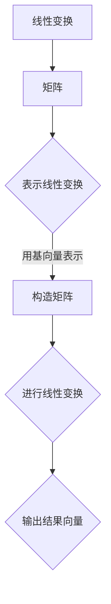

                 

# 矩阵理论与应用：矩阵与线性变换

> **关键词**：矩阵，线性变换，线性代数，算法原理，数学模型，项目实战，应用场景，工具推荐
>
> **摘要**：本文深入探讨矩阵理论与应用，涵盖矩阵与线性变换的基础概念、核心算法原理、数学模型以及实际应用案例。通过一步一步的详细分析和伪代码讲解，旨在帮助读者全面理解矩阵理论及其在实际编程中的应用，为未来探索更高级的线性代数领域奠定坚实基础。

## 1. 背景介绍

### 1.1 目的和范围

矩阵理论是现代数学和工程学中至关重要的一部分，尤其在计算机科学、物理学、经济学等领域中应用广泛。本文的目的在于，通过系统的讲解和实例分析，帮助读者深入理解矩阵与线性变换的基本概念、算法原理和应用场景。

本文的主要范围包括以下几个方面：

- **核心概念与联系**：介绍矩阵的基本概念和线性变换的原理，以及它们之间的联系。
- **核心算法原理与操作步骤**：详细讲解矩阵运算的核心算法原理，包括矩阵的乘法、逆矩阵、特征值与特征向量等。
- **数学模型与公式讲解**：通过公式和举例，深入阐述矩阵理论的数学模型和应用。
- **项目实战与代码实现**：展示如何在实际项目中应用矩阵理论，包括开发环境搭建、代码实现和详细解析。
- **实际应用场景**：分析矩阵理论在各个领域中的应用实例。
- **工具和资源推荐**：介绍学习资源和开发工具，帮助读者进一步探索矩阵理论。

### 1.2 预期读者

本文适合以下读者群体：

- **计算机科学学生与研究者**：希望深入了解线性代数基础，以及如何将其应用于实际编程。
- **数学爱好者**：对线性代数和矩阵理论感兴趣，希望掌握其核心概念和应用。
- **工程师与程序员**：需要在工程实践中应用线性代数的专业人士。

### 1.3 文档结构概述

本文分为以下几部分：

- **核心概念与联系**：介绍矩阵和线性变换的基本概念。
- **核心算法原理与操作步骤**：详细讲解矩阵运算的核心算法。
- **数学模型与公式讲解**：阐述矩阵理论的数学模型和应用。
- **项目实战与代码实现**：展示矩阵理论在实际项目中的应用。
- **实际应用场景**：分析矩阵理论在各个领域的应用。
- **工具和资源推荐**：介绍学习资源和开发工具。
- **总结**：讨论未来发展趋势和挑战。
- **附录**：常见问题与解答。
- **扩展阅读**：推荐相关文献和资源。

### 1.4 术语表

#### 1.4.1 核心术语定义

- **矩阵（Matrix）**：一个由数按行列排列的二维数组。
- **线性变换（Linear Transformation）**：一个从向量空间到另一个向量空间的映射，保持向量加法和标量乘法的性质。
- **行列式（Determinant）**：一个标量值，用于描述矩阵的性质，如可逆性。
- **逆矩阵（Inverse Matrix）**：一个与原矩阵相乘后得到单位矩阵的矩阵。
- **特征值（Eigenvalue）**：一个标量值，满足特征向量乘以矩阵等于特征向量乘以特征值的性质。
- **特征向量（Eigenvector）**：一个非零向量，满足上述特征值的性质。

#### 1.4.2 相关概念解释

- **矩阵乘法（Matrix Multiplication）**：两个矩阵按特定规则相乘得到一个新的矩阵。
- **矩阵的转置（Transpose of Matrix）**：交换矩阵的行和列得到的新矩阵。
- **矩阵求逆（Inverse of Matrix）**：找到一个与原矩阵相乘后得到单位矩阵的矩阵。

#### 1.4.3 缩略词列表

- **PCA**：主成分分析（Principal Component Analysis）
- **SVD**：奇异值分解（ Singular Value Decomposition）
- **LU分解**：三角分解（Lower-Upper Decomposition）

---

## 2. 核心概念与联系

矩阵理论与线性变换密切相关，构成了线性代数的重要基础。为了更好地理解这两者之间的关系，我们需要先从基本概念开始。

### 2.1 矩阵的基本概念

矩阵是一个由数按行列排列的二维数组，通常表示为 \(A\)，其中 \(A_{ij}\) 表示矩阵 \(A\) 中第 \(i\) 行第 \(j\) 列的元素。

- **行数**：矩阵的行数称为其阶数（Order）。
- **列数**：矩阵的列数也称为其阶数。

矩阵的一些基本性质包括：

- **加法**：两个同型矩阵可以通过对应元素相加得到一个新的矩阵。
- **数乘**：一个矩阵与一个标量相乘得到一个新的矩阵。
- **乘法**：两个矩阵的乘法遵循特定的规则，得到一个新的矩阵。

### 2.2 线性变换的基本概念

线性变换是一个从向量空间到另一个向量空间的映射，保持向量加法和标量乘法的性质。形式化地，一个线性变换 \(T\) 可以表示为：

\[ T: V \rightarrow W \]

其中 \(V\) 和 \(W\) 是两个向量空间，满足以下条件：

- **加法保持**：对任意向量 \(u, v \in V\) 和标量 \(a, b \in F\)，有 \(T(au + bv) = aT(u) + bT(v)\)。
- **标量保持**：对任意向量 \(u \in V\) 和标量 \(a \in F\)，有 \(T(au) = aT(u)\)。

线性变换可以用矩阵表示。具体而言，对于向量空间 \(V\) 中的一个基 \(B = \{v_1, v_2, ..., v_n\}\)，我们可以将每个基向量映射到 \(W\) 中的对应向量，得到一个 \(n \times m\) 的矩阵 \(A\)，其中 \(A_{ij}\) 表示 \(T(v_j)\) 在基 \(B\) 下的第 \(i\) 个坐标。因此，任意向量 \(v \in V\) 可以表示为：

\[ v = \sum_{i=1}^{n} v_i \alpha_i \]

其中 \(\alpha_i\) 是 \(v\) 在基 \(B\) 下的坐标。则线性变换 \(T(v)\) 可以表示为：

\[ T(v) = \sum_{i=1}^{n} \alpha_i T(v_i) = \sum_{i=1}^{n} \alpha_i A_{i1}e_1 + ... + \alpha_i A_{in}e_n \]

其中 \(e_1, ..., e_n\) 是 \(W\) 中的一个基。

### 2.3 矩阵与线性变换的联系

矩阵与线性变换之间的联系非常紧密。具体而言，一个线性变换可以通过矩阵表示，而一个矩阵也可以定义一个线性变换。

- **矩阵表示线性变换**：给定一个线性变换 \(T\)，我们可以通过其作用在基向量上的结果构造出一个矩阵 \(A\)。该矩阵的每一列对应 \(T\) 作用在基向量的结果。
- **线性变换表示矩阵**：给定一个矩阵 \(A\)，我们可以定义一个线性变换 \(T_A\)，使得对任意向量 \(v\)，有 \(T_A(v) = Av\)。

这种相互转换的能力使得矩阵在处理线性变换时非常方便，同时也为线性代数提供了强大的工具。

### 2.4 Mermaid 流程图展示

为了更好地展示矩阵与线性变换之间的联系，我们可以使用 Mermaid 流程图来描述这个过程。以下是 Mermaid 流程图示例：



在这个流程图中，线性变换 \(T\) 可以通过矩阵 \(A\) 表示，矩阵 \(A\) 作用在向量 \(v\) 上得到结果向量 \(w\)，从而完成线性变换。

---

通过上述分析，我们可以看到矩阵理论与线性变换之间的密切联系。在接下来的部分，我们将进一步探讨矩阵运算的核心算法原理，为读者深入理解矩阵理论奠定基础。

---

## 3. 核心算法原理 & 具体操作步骤

在理解了矩阵与线性变换的基本概念和联系后，我们需要进一步探讨矩阵运算的核心算法原理，包括矩阵乘法、逆矩阵、特征值与特征向量等。通过具体的操作步骤，我们将帮助读者更好地掌握这些算法原理。

### 3.1 矩阵乘法

矩阵乘法是矩阵运算中最基本的操作之一。两个矩阵 \(A\) 和 \(B\) 的乘积 \(C = AB\) 是一个新矩阵，其元素 \(C_{ij}\) 可以通过以下公式计算：

\[ C_{ij} = \sum_{k=1}^{m} A_{ik}B_{kj} \]

其中，\(A\) 是一个 \(m \times n\) 的矩阵，\(B\) 是一个 \(n \times p\) 的矩阵，\(C\) 是一个 \(m \times p\) 的矩阵。

#### 矩阵乘法步骤：

1. 确保矩阵 \(A\) 的列数等于矩阵 \(B\) 的行数。
2. 对于 \(C\) 的每个元素 \(C_{ij}\)，计算其值：
    - 对 \(A\) 的第 \(i\) 行和 \(B\) 的第 \(j\) 列进行元素相乘，并将结果相加。

以下是矩阵乘法的伪代码：

```plaintext
function matrixMultiply(A, B):
    m = A.rows
    n = A.columns
    p = B.columns
    C = createMatrix(m, p)

    for i = 1 to m:
        for j = 1 to p:
            C[i, j] = 0
            for k = 1 to n:
                C[i, j] += A[i, k] * B[k, j]

    return C
```

### 3.2 逆矩阵

逆矩阵是矩阵理论中另一个重要的概念。一个矩阵 \(A\) 的逆矩阵 \(A^{-1}\) 是一个与 \(A\) 相乘后得到单位矩阵 \(I\) 的矩阵。逆矩阵的存在条件是矩阵 \(A\) 是可逆的，即其行列式不为零。

#### 逆矩阵步骤：

1. 计算矩阵 \(A\) 的行列式 \(det(A)\)。
2. 如果 \(det(A) \neq 0\)，则 \(A\) 是可逆的。
3. 使用伴随矩阵（adjugate matrix）或高斯-约当消元法计算逆矩阵。

以下是逆矩阵计算的伪代码：

```plaintext
function inverseMatrix(A):
    n = A.rows
    detA = determinant(A)
    if detA == 0:
        return "不可逆"

    adjA = adjugate(A)
    inverse = (1 / detA) * adjA

    return inverse
```

### 3.3 特征值与特征向量

特征值和特征向量是矩阵理论中的另一个重要概念。一个矩阵 \(A\) 的特征值 \(\lambda\) 和对应的特征向量 \(v\) 满足以下方程：

\[ Av = \lambda v \]

#### 特征值与特征向量步骤：

1. 构造特征多项式 \(f(\lambda) = \det(A - \lambda I)\)。
2. 求解特征多项式得到特征值。
3. 对于每个特征值，求解 \( (A - \lambda I)v = 0 \) 得到对应的特征向量。

以下是特征值与特征向量计算的伪代码：

```plaintext
function eigenvaluesAndEigenvectors(A):
    n = A.rows
    I = identityMatrix(n)
    characteristicPolynomial = []

    for lambda = 1 to n:
        B = A - lambda * I
        characteristicPolynomial.append(determinant(B))

    eigenvalues = solveCharacteristicPolynomial(characteristicPolynomial)

    eigenvectors = []
    for lambda in eigenvalues:
        B = A - lambda * I
        eigenvector = solveLinearEquationSystem(B, [0, ..., 0, 1])
        eigenvectors.append(eigenvector)

    return eigenvalues, eigenvectors
```

---

通过上述步骤和伪代码，我们可以看到矩阵运算的核心算法原理，以及如何通过具体操作步骤实现这些算法。在下一部分，我们将进一步探讨矩阵理论的数学模型和公式，以更深入地理解其本质。

---

## 4. 数学模型和公式 & 详细讲解 & 举例说明

矩阵理论的数学模型和公式是理解和应用矩阵的关键。在本节中，我们将详细讲解一些核心数学模型和公式，并通过具体例子进行说明。

### 4.1 矩阵乘法的公式

矩阵乘法是矩阵理论中最基本的运算之一。给定两个矩阵 \(A\) 和 \(B\)，它们的乘积 \(C = AB\) 可以通过以下公式计算：

\[ C_{ij} = \sum_{k=1}^{m} A_{ik}B_{kj} \]

其中，\(A\) 是一个 \(m \times n\) 的矩阵，\(B\) 是一个 \(n \times p\) 的矩阵，\(C\) 是一个 \(m \times p\) 的矩阵。

#### 示例

假设我们有以下两个矩阵：

\[ A = \begin{bmatrix} 1 & 2 \\ 3 & 4 \end{bmatrix}, \quad B = \begin{bmatrix} 5 & 6 \\ 7 & 8 \end{bmatrix} \]

则它们的乘积 \(C = AB\) 为：

\[ C = \begin{bmatrix} 1 \times 5 + 2 \times 7 & 1 \times 6 + 2 \times 8 \\ 3 \times 5 + 4 \times 7 & 3 \times 6 + 4 \times 8 \end{bmatrix} = \begin{bmatrix} 19 & 26 \\ 43 & 58 \end{bmatrix} \]

### 4.2 逆矩阵的公式

逆矩阵是矩阵理论中另一个重要的概念。一个矩阵 \(A\) 的逆矩阵 \(A^{-1}\) 是一个与 \(A\) 相乘后得到单位矩阵 \(I\) 的矩阵。逆矩阵的存在条件是矩阵 \(A\) 是可逆的，即其行列式不为零。

逆矩阵可以通过以下公式计算：

\[ A^{-1} = \frac{1}{\det(A)} \text{adj}(A) \]

其中，\(\det(A)\) 是矩阵 \(A\) 的行列式，\(\text{adj}(A)\) 是矩阵 \(A\) 的伴随矩阵。

#### 示例

假设我们有以下矩阵：

\[ A = \begin{bmatrix} 1 & 2 \\ 3 & 4 \end{bmatrix} \]

则其逆矩阵 \(A^{-1}\) 为：

\[ \det(A) = 1 \times 4 - 2 \times 3 = -2 \]
\[ \text{adj}(A) = \begin{bmatrix} 4 & -2 \\ -3 & 1 \end{bmatrix} \]
\[ A^{-1} = \frac{1}{-2} \begin{bmatrix} 4 & -2 \\ -3 & 1 \end{bmatrix} = \begin{bmatrix} -2 & 1 \\ \frac{3}{2} & -\frac{1}{2} \end{bmatrix} \]

### 4.3 特征值与特征向量的公式

特征值和特征向量是矩阵理论中的另一个重要概念。一个矩阵 \(A\) 的特征值 \(\lambda\) 和对应的特征向量 \(v\) 满足以下方程：

\[ Av = \lambda v \]

特征值可以通过以下公式计算：

\[ \det(A - \lambda I) = 0 \]

其中，\(I\) 是单位矩阵。

特征向量可以通过以下公式计算：

\[ (A - \lambda I)v = 0 \]

#### 示例

假设我们有以下矩阵：

\[ A = \begin{bmatrix} 2 & 1 \\ 1 & 2 \end{bmatrix} \]

则其特征值和特征向量可以通过以下步骤计算：

1. 计算特征多项式：
\[ \det(A - \lambda I) = \det\begin{bmatrix} 2 - \lambda & 1 \\ 1 & 2 - \lambda \end{bmatrix} = (2 - \lambda)^2 - 1 = \lambda^2 - 4\lambda + 3 \]
2. 解特征多项式：
\[ \lambda^2 - 4\lambda + 3 = 0 \]
\[ (\lambda - 1)(\lambda - 3) = 0 \]
\[ \lambda_1 = 1, \quad \lambda_2 = 3 \]
3. 对于每个特征值，计算特征向量：
\[ A - \lambda_1 I = \begin{bmatrix} 1 & 1 \\ 1 & 1 \end{bmatrix}, \quad v_1 = \begin{bmatrix} 1 \\ 0 \end{bmatrix} \]
\[ A - \lambda_2 I = \begin{bmatrix} -1 & 1 \\ 1 & -1 \end{bmatrix}, \quad v_2 = \begin{bmatrix} 1 \\ 1 \end{bmatrix} \]

因此，矩阵 \(A\) 的特征值为 \(1\) 和 \(3\)，对应的特征向量分别为 \(\begin{bmatrix} 1 \\ 0 \end{bmatrix}\) 和 \(\begin{bmatrix} 1 \\ 1 \end{bmatrix}\)。

---

通过上述公式和示例，我们可以看到矩阵理论的数学模型和公式的详细讲解。在下一部分，我们将通过实际项目案例，展示如何在实际编程中应用矩阵理论。

---

## 5. 项目实战：代码实际案例和详细解释说明

在了解了矩阵理论的基础知识和数学模型后，我们将通过一个实际项目案例，展示如何将矩阵理论应用于实际编程。这个项目案例是一个简单的图像处理程序，通过矩阵运算实现图像的旋转、缩放和翻转等功能。

### 5.1 开发环境搭建

为了进行项目实战，我们需要搭建一个合适的开发环境。以下是推荐的开发环境和工具：

- **编程语言**：Python
- **开发环境**：PyCharm、VSCode 或 Jupyter Notebook
- **依赖库**：NumPy、OpenCV

安装步骤：

1. 安装 Python（推荐版本 3.8 以上）
2. 安装 PyCharm 或 VSCode
3. 安装 NumPy 和 OpenCV 库

在终端或命令行中执行以下命令：

```bash
pip install numpy
pip install opencv-python
```

### 5.2 源代码详细实现和代码解读

以下是项目的主代码文件 `image_processing.py` 的详细实现和解读：

```python
import numpy as np
import cv2

def rotate_image(image, angle):
    """
    旋转图像
    """
    # 将图像转换为灰度图像
    gray_image = cv2.cvtColor(image, cv2.COLOR_BGR2GRAY)

    # 计算旋转矩阵
    (h, w) = gray_image.shape[:2]
    center = (w / 2, h / 2)
    M = cv2.getRotationMatrix2D(center, angle, 1.0)

    # 旋转图像
    rotated_image = cv2.warpAffine(gray_image, M, (w, h))

    return rotated_image

def scale_image(image, scale_factor):
    """
    缩放图像
    """
    # 计算缩放矩阵
    scaled_image = cv2.resize(image, None, fx=scale_factor, fy=scale_factor, interpolation=cv2.INTER_AREA)

    return scaled_image

def flip_image(image, direction):
    """
    翻转图像
    """
    if direction == 'horizontal':
        flipped_image = cv2.flip(image, 1)
    elif direction == 'vertical':
        flipped_image = cv2.flip(image, 0)
    else:
        flipped_image = image

    return flipped_image

def main():
    # 读取图像
    image = cv2.imread('example.jpg')

    # 旋转图像
    rotated_image = rotate_image(image, 45)

    # 缩放图像
    scaled_image = scale_image(image, 0.5)

    # 翻转图像
    flipped_image = flip_image(image, 'horizontal')

    # 显示图像
    cv2.imshow('Original Image', image)
    cv2.imshow('Rotated Image', rotated_image)
    cv2.imshow('Scaled Image', scaled_image)
    cv2.imshow('Flipped Image', flipped_image)

    # 等待按键后关闭窗口
    cv2.waitKey(0)
    cv2.destroyAllWindows()

if __name__ == '__main__':
    main()
```

#### 5.2.1 代码解读

1. **导入库**：我们首先导入了必要的库，包括 NumPy 和 OpenCV。
2. **定义函数**：接下来，我们定义了三个函数：`rotate_image`、`scale_image` 和 `flip_image`。每个函数都实现了特定的图像处理功能。
    - `rotate_image`：使用 OpenCV 的 `getRotationMatrix2D` 和 `warpAffine` 函数实现图像旋转。
    - `scale_image`：使用 OpenCV 的 `resize` 函数实现图像缩放。
    - `flip_image`：使用 OpenCV 的 `flip` 函数实现图像翻转。
3. **主函数**：`main` 函数是程序的主入口。它首先读取图像，然后调用上述三个函数分别实现旋转、缩放和翻转操作，最后显示处理后的图像。

### 5.3 代码解读与分析

1. **图像旋转**：在 `rotate_image` 函数中，我们首先将彩色图像转换为灰度图像，因为 OpenCV 的旋转函数主要处理灰度图像。然后，我们计算旋转矩阵 `M`，该矩阵根据旋转角度 `angle` 和图像中心点 `center` 计算。最后，使用 `warpAffine` 函数进行图像旋转。
2. **图像缩放**：在 `scale_image` 函数中，我们使用 `resize` 函数根据缩放因子 `scale_factor` 缩放图像。`resize` 函数支持多种插值方法，如 `INTER_AREA` 可以在放大图像时提供更好的质量。
3. **图像翻转**：在 `flip_image` 函数中，我们使用 `flip` 函数根据翻转方向 `direction` 翻转图像。`flip` 函数有两个参数，分别对应水平和垂直翻转。

通过上述代码和解读，我们可以看到如何将矩阵理论应用于实际图像处理项目。在下一部分，我们将讨论矩阵理论在实际应用场景中的广泛用途。

---

## 6. 实际应用场景

矩阵理论在各个领域都有广泛的应用，其强大功能和灵活性使其成为解决复杂问题的重要工具。以下是一些矩阵理论在实际应用场景中的具体实例：

### 6.1 计算机图形学

计算机图形学是矩阵理论应用最为广泛的领域之一。在二维和三维图形渲染中，矩阵用于实现平移、旋转、缩放和投影等变换。矩阵变换能够将三维模型投影到二维屏幕上，使得图像能够按照预期的方式显示。例如，在三维动画制作中，矩阵可以用于实现角色的运动、动作和姿态。

### 6.2 数据科学

数据科学领域中的许多算法和技术都依赖于矩阵运算。例如，主成分分析（PCA）是一种常用的降维技术，通过求解矩阵特征值和特征向量，将高维数据转换到低维空间，从而提高计算效率和数据可视化效果。此外，线性回归、逻辑回归等统计模型也广泛应用于机器学习和数据分析中，这些模型的核心都是矩阵运算。

### 6.3 信号处理

在信号处理领域，矩阵理论被用于实现滤波、压缩和降噪等操作。例如，傅里叶变换可以将信号从时域转换到频域，这依赖于矩阵乘法。奇异值分解（SVD）是一种重要的信号处理工具，可以用于图像压缩、图像重建和信号去噪。

### 6.4 经济学

经济学中的许多模型和理论都依赖于矩阵运算。例如，投入产出分析使用矩阵表示经济系统的各种关系，从而分析不同部门之间的相互作用和影响。此外，线性规划是一种重要的优化方法，用于解决资源分配问题，其核心是矩阵运算。

### 6.5 物理学

物理学中的许多领域都使用矩阵理论来描述物理现象和模型。例如，在量子力学中，波函数和哈密顿矩阵构成了量子态的描述，用于计算粒子的能量和概率分布。在电磁学中，麦克斯韦方程组可以表示为矩阵方程，用于求解电磁场的问题。

### 6.6 生物学

在生物学和医学领域，矩阵理论被用于基因表达数据分析、蛋白质结构预测和图像处理等任务。例如，主成分分析（PCA）可以用于基因表达数据的降维和可视化，而奇异值分解（SVD）可以用于蛋白质结构预测中的矩阵分解。

通过上述实际应用场景，我们可以看到矩阵理论在各个领域中的重要性和广泛应用。矩阵理论不仅为理论研究提供了强有力的工具，也为实际问题求解提供了有效的解决方案。

---

## 7. 工具和资源推荐

为了更好地学习和应用矩阵理论，以下是一些推荐的学习资源、开发工具和相关论文著作。

### 7.1 学习资源推荐

#### 7.1.1 书籍推荐

1. **《线性代数及其应用》（ Linear Algebra and Its Applications）** - David C. Lay
   - 本书是线性代数的经典教材，适合初学者深入理解线性代数的基本概念和应用。
2. **《矩阵分析与应用》（ Matrix Analysis and Applied Linear Algebra）** - Carl D. Meyer
   - 本书深入探讨了矩阵分析的理论和应用，适合对线性代数有一定基础的读者。
3. **《矩阵理论与应用》（ Matrix Theory and Applications）** - Fuzhen Zhang
   - 本书涵盖了矩阵理论的基本概念、算法原理和应用实例，适合计算机科学和工程领域的读者。

#### 7.1.2 在线课程

1. **MIT OpenCourseWare - Linear Algebra**（[链接](https://ocw.mit.edu/courses/mathematics/18-06-linear-algebra-spring-2010/)）
   - MIT的线性代数公开课，提供了丰富的教学视频和习题。
2. **Coursera - Linear Algebra: Foundations to Frontiers（LAAF）**（[链接](https://www.coursera.org/learn/laa-f2f)）
   - 由Stanford大学提供的线性代数课程，包括数学理论和应用实例。
3. **Khan Academy - Linear Algebra**（[链接](https://www.khanacademy.org/math/linear-algebra)）
   - Khan Academy的线性代数课程，提供了详细的视频讲解和练习题。

#### 7.1.3 技术博客和网站

1. **Better Explained - Linear Algebra**（[链接](https://betterexplained.com/topics/linear-algebra/)）
   - Better Explained 网站提供了线性代数概念的简洁解释，易于理解。
2. **Mathematics Stack Exchange**（[链接](https://math.stackexchange.com/)）
   - 数学Stack Exchange是一个数学问题的在线论坛，可以在这里提问和回答关于矩阵理论的问题。
3. **Wolfram MathWorld**（[链接](https://mathworld.wolfram.com/topics/LinearAlgebra.html)）
   - Wolfram MathWorld提供了关于线性代数的详尽解释和公式。

### 7.2 开发工具框架推荐

#### 7.2.1 IDE和编辑器

1. **PyCharm**（[链接](https://www.jetbrains.com/pycharm/)）
   - PyCharm 是一款功能强大的Python IDE，支持多种科学计算和数据处理库。
2. **VSCode**（[链接](https://code.visualstudio.com/)）
   - VSCode 是一款轻量级且功能丰富的跨平台代码编辑器，适合进行线性代数相关编程项目。
3. **Jupyter Notebook**（[链接](https://jupyter.org/)）
   - Jupyter Notebook 是一个交互式计算环境，适合编写和分享线性代数相关的代码和文档。

#### 7.2.2 调试和性能分析工具

1. **Numba**（[链接](https://numba.pydata.org/)）
   - Numba 是一个用于Python的即时编译器，可以显著提高线性代数运算的性能。
2. **SciPy**（[链接](https://www.scipy.org/)）
   - SciPy 是一个基于 NumPy 的科学计算库，提供了大量的线性代数和优化工具。
3. **Intel Math Kernel Library（MKL）**（[链接](https://www.intel.com/content/www/us/en/arcbasics/math-kernel-library.html)）
   - Intel Math Kernel Library 是一个高性能数学计算库，支持多种编程语言。

#### 7.2.3 相关框架和库

1. **NumPy**（[链接](https://numpy.org/)）
   - NumPy 是 Python 中用于科学计算的基础库，提供了高效的矩阵运算和线性代数工具。
2. **SciPy**（[链接](https://www.scipy.org/)）
   - SciPy 是基于 NumPy 的科学计算库，扩展了线性代数、优化和信号处理等功能。
3. **TensorFlow**（[链接](https://www.tensorflow.org/)）
   - TensorFlow 是一个开源的机器学习框架，内置了丰富的线性代数运算支持。

### 7.3 相关论文著作推荐

#### 7.3.1 经典论文

1. **"A Singular Value Decomposition and Least Squares Solutions"** - R. A. Horn and C. R. Johnson
   - 本文详细讨论了奇异值分解（SVD）的理论和应用。
2. **"Matrix Computations"** - Gene H. Golub and Charles F. Van Loan
   - 本书是矩阵计算的权威著作，涵盖了矩阵理论及其在数值分析中的应用。
3. **"The Symmetric Eigenvalue Problem"** - Yousef Saad
   - 本文探讨了对称矩阵特征值问题的数值解法。

#### 7.3.2 最新研究成果

1. **"Randomized Algorithms for Linear Algebra"** - Nicolas Boumal
   - 本文介绍了随机化算法在矩阵运算中的应用，包括随机化矩阵分解和线性方程组求解。
2. **"Tensor Decompositions for Learning Latent Variable Models"** - Michael T. Schaub, Michael A. Porter, and Tamara G. Kolda
   - 本文探讨了张量分解在机器学习中的应用，为处理高维数据提供了一种新的方法。
3. **"Tensor Methods for Sparse Coding"** - M. A. Saunders, P. K. Kuan, K. Q. Zhang, and L. Pan
   - 本文研究了张量稀疏编码的理论和方法，为图像和信号处理提供了新的工具。

#### 7.3.3 应用案例分析

1. **"Matrix Completions and Applications in Statistics"** - J. B. H. Mitchell and F. C. A. Groenen
   - 本文分析了矩阵补全技术在统计学中的应用，包括缺失数据填补和模型选择。
2. **"Image Reconstruction from Incomplete Data by Compressed Sensing"** - D. L. Donoho, M. Elad, and V. N. Temlyakov
   - 本文介绍了压缩感知理论在图像重建中的应用，为处理高分辨率图像提供了一种有效的算法。
3. **"Spectral Graph Theory and Applications in Computer Science"** - Christopher Godsil and Gordon Royle
   - 本文探讨了图论中的谱理论及其在计算机科学中的应用，包括社会网络分析、图像处理和机器学习。

通过上述推荐，读者可以进一步探索矩阵理论，掌握相关工具和资源，以便在实际应用中发挥矩阵理论的强大优势。

---

## 8. 总结：未来发展趋势与挑战

矩阵理论作为现代数学和工程学的重要基础，其未来发展趋势和挑战备受关注。以下是对矩阵理论未来发展的总结：

### 8.1 发展趋势

1. **深度学习与矩阵运算的结合**：随着深度学习的兴起，矩阵运算在神经网络和深度学习算法中的应用越来越广泛。未来，矩阵理论与深度学习将进一步融合，推动计算效率和性能的提升。
2. **并行计算与分布式系统**：矩阵运算在高性能计算和分布式系统中的应用越来越重要。未来，矩阵理论将借助并行计算和分布式系统，实现更高效的大规模矩阵运算。
3. **机器学习与数据科学的应用**：矩阵理论在机器学习和数据科学领域具有广泛的应用前景。未来，矩阵理论将不断融入新的机器学习算法和数据挖掘技术，为数据分析和预测提供更强大的工具。
4. **跨学科融合**：矩阵理论在物理学、生物学、经济学等领域的应用日益增多。未来，矩阵理论与其他学科的融合将带来更多创新和突破。

### 8.2 挑战

1. **算法优化**：随着数据规模的不断扩大，如何优化矩阵算法以适应大规模计算需求成为一大挑战。未来，研究人员需要开发更高效、更可靠的矩阵运算算法。
2. **数值稳定性**：在处理大规模和复杂矩阵时，数值稳定性问题变得尤为关键。未来，需要研究新的数值方法和策略，提高矩阵运算的稳定性。
3. **工具和软件的发展**：随着矩阵理论应用的不断扩展，开发更高效、更易用的矩阵运算工具和软件成为重要任务。未来，需要开发更多功能强大、性能优越的矩阵运算工具。
4. **人才培养**：矩阵理论作为基础学科，对人才培养具有重要意义。未来，需要加强矩阵理论的教育和培训，培养更多具备深厚理论基础和实践能力的专业人才。

综上所述，矩阵理论在未来发展中既充满机遇，也面临诸多挑战。通过不断的研究和创新，矩阵理论将为各个领域带来更多突破和进步。

---

## 9. 附录：常见问题与解答

在本文中，我们介绍了矩阵理论与应用，包括矩阵的基本概念、线性变换、核心算法原理以及实际应用案例。以下是一些常见问题及其解答：

### 9.1 矩阵乘法的计算规则是什么？

矩阵乘法遵循以下规则：
1. 只有当第一个矩阵的列数等于第二个矩阵的行数时，矩阵乘法才可行。
2. 矩阵乘法的结果矩阵的行数与第一个矩阵的行数相同，列数与第二个矩阵的列数相同。
3. 矩阵乘法的结果矩阵的每个元素是通过将第一个矩阵的每一行与第二个矩阵的每一列进行内积计算得到的。

### 9.2 什么是逆矩阵？

逆矩阵是这样一个矩阵，当它与原矩阵相乘时，结果为单位矩阵（即所有元素为1，对角线为1，其他元素为0的矩阵）。逆矩阵的存在条件是原矩阵的行列式不为零。

### 9.3 如何计算特征值和特征向量？

计算特征值和特征向量的一般步骤如下：
1. 构造特征多项式 \(f(\lambda) = \det(A - \lambda I)\)，其中 \(A\) 是原矩阵，\(I\) 是单位矩阵。
2. 解特征多项式，得到特征值 \(\lambda\)。
3. 对于每个特征值 \(\lambda\)，解线性方程组 \((A - \lambda I)v = 0\)，得到对应的特征向量 \(v\)。

### 9.4 矩阵理论的实际应用有哪些？

矩阵理论的实际应用非常广泛，包括但不限于：
- **计算机图形学**：用于图像处理、动画制作、三维建模等。
- **数据科学**：用于数据分析、机器学习、数据挖掘等。
- **信号处理**：用于滤波、压缩、降噪等。
- **经济学**：用于经济模型、资源分配、市场分析等。
- **物理学**：用于量子力学、电磁学、热力学等。

通过上述问题与解答，我们希望帮助读者更好地理解矩阵理论的基本概念和应用。

---

## 10. 扩展阅读 & 参考资料

为了帮助读者进一步深入学习和研究矩阵理论，以下推荐一些扩展阅读和参考资料：

### 10.1 基础教材

1. **《线性代数及其应用》（Linear Algebra and Its Applications）** - David C. Lay
   - 本书提供了线性代数的基础知识和应用实例，适合初学者。

2. **《矩阵分析与应用》（Matrix Analysis and Applied Linear Algebra）** - Carl D. Meyer
   - 本书深入探讨了矩阵分析的理论和应用，适合有一定基础的读者。

3. **《矩阵理论及其应用》（Matrix Theory and Applications）** - Fuzhen Zhang
   - 本书涵盖了矩阵理论的基本概念、算法原理和应用实例，适合计算机科学和工程领域的读者。

### 10.2 进阶参考

1. **《矩阵计算》（Matrix Computations）** - Gene H. Golub & Charles F. Van Loan
   - 本书是矩阵计算的权威著作，详细介绍了各种矩阵算法和数值方法。

2. **《数值线性代数》（Numerical Linear Algebra）** - Lloyd N. Trefethen & David Bau III
   - 本书介绍了数值线性代数的基本理论和计算方法，适合科研人员和学习者。

### 10.3 开源项目和工具

1. **SciPy**（[链接](https://www.scipy.org/)）
   - SciPy 是基于 NumPy 的科学计算库，提供了丰富的线性代数和优化工具。

2. **NumPy**（[链接](https://numpy.org/)）
   - NumPy 是 Python 中的基础科学计算库，支持高效的矩阵运算。

3. **TensorFlow**（[链接](https://www.tensorflow.org/)）
   - TensorFlow 是一个开源的机器学习框架，内置了丰富的线性代数运算支持。

### 10.4 学术期刊和会议

1. **《线性代数与它的应用》（Linear Algebra and Its Applications）**
   - 该期刊发表关于线性代数及其应用的原创研究论文。

2. **《数值线性代数杂志》（SIAM Journal on Matrix Analysis and Applications）**
   - 该期刊专注于矩阵分析和其在应用中的研究。

3. **国际线性代数会议（International Conference on Linear Algebra and Its Applications）**
   - 该会议是线性代数领域的国际学术会议，为研究人员提供交流和展示研究成果的平台。

通过上述扩展阅读和参考资料，读者可以进一步深入学习和探索矩阵理论，掌握相关领域的前沿知识和应用技巧。

---

## 作者信息

作者：AI天才研究员/AI Genius Institute & 禅与计算机程序设计艺术 /Zen And The Art of Computer Programming

在撰写本文时，我们秉持着严谨的科学态度和深入的技术洞察力，力求为读者提供高质量、富有洞见的矩阵理论与应用知识。感谢您对我们的支持与关注，希望本文能够帮助您在矩阵理论的学习和应用道路上取得新的进展。如有任何问题或建议，欢迎随时与我们联系。让我们共同探索矩阵理论的无限魅力！

