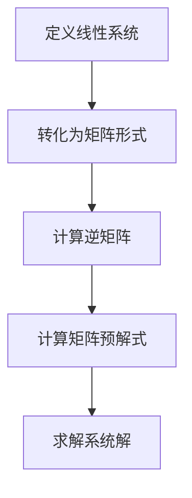
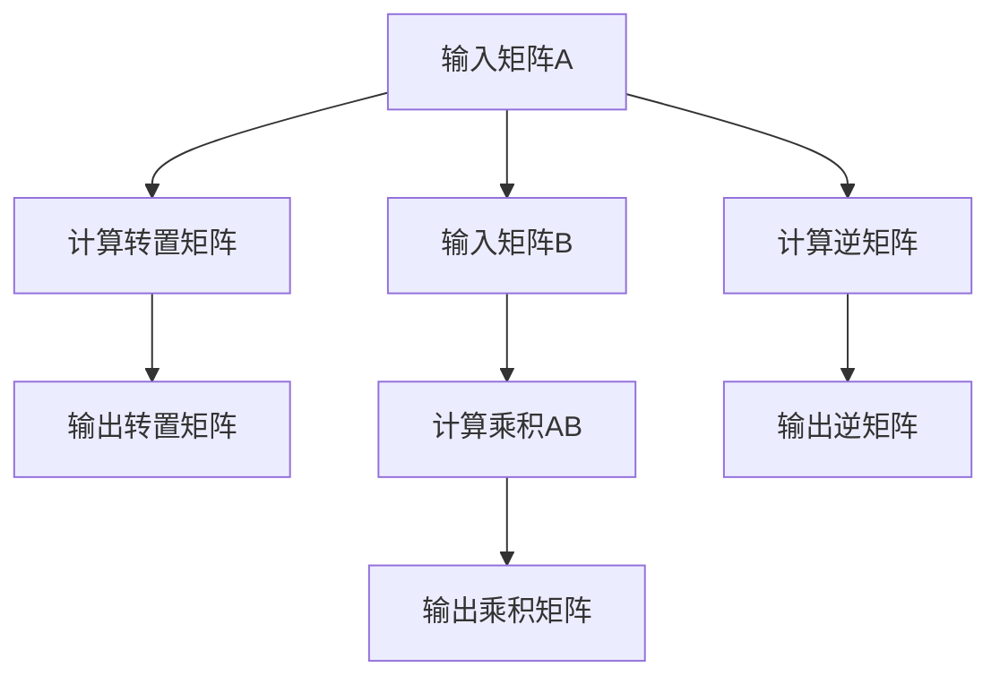

                 

# 矩阵理论与应用：矩阵值函数的分析运算与矩阵的预解式

## 关键词
矩阵理论、矩阵值函数、分析运算、矩阵预解式、数学模型

## 摘要
本文旨在深入探讨矩阵理论与应用，特别是矩阵值函数的分析运算与矩阵的预解式。通过详细的数学模型和具体操作步骤的讲解，以及项目实战中的代码实现与分析，本文将为读者提供清晰的矩阵理论应用全景，助力读者在实际项目中运用这些理论。本文将帮助读者理解矩阵值函数的基本概念、分析运算的方法，以及矩阵预解式的求解过程。同时，文章还将推荐相关学习资源和工具，为读者进一步探索这一领域提供支持。

## 1. 背景介绍

### 1.1 目的和范围
本文的目标是介绍矩阵值函数的分析运算与矩阵的预解式，旨在帮助读者理解这两个概念，并掌握其在实际项目中的应用。矩阵理论在数学、计算机科学、工程学等多个领域都有广泛的应用，而矩阵值函数与预解式则是矩阵理论中的重要组成部分。

本文的范围将涵盖以下几个方面：
- 矩阵值函数的定义与性质
- 矩阵值函数的分析运算方法
- 矩阵预解式的概念与求解过程
- 实际应用场景中的案例分析
- 相关工具和资源的推荐

### 1.2 预期读者
本文适合具有基本线性代数和矩阵理论基础的读者，包括数学专业学生、计算机科学专业的学生、工程师以及科研人员。读者将需要具备以下先验知识：
- 矩阵的基本概念和运算
- 向量和线性方程组的解法
- 基础的微积分知识

### 1.3 文档结构概述
本文结构分为十个部分，如下：
1. 背景介绍
   - 1.1 目的和范围
   - 1.2 预期读者
   - 1.3 文档结构概述
   - 1.4 术语表
2. 核心概念与联系
3. 核心算法原理 & 具体操作步骤
4. 数学模型和公式 & 详细讲解 & 举例说明
5. 项目实战：代码实际案例和详细解释说明
6. 实际应用场景
7. 工具和资源推荐
8. 总结：未来发展趋势与挑战
9. 附录：常见问题与解答
10. 扩展阅读 & 参考资料

### 1.4 术语表

#### 1.4.1 核心术语定义
- **矩阵值函数**：指矩阵元素关于某个变量（通常是矩阵的行或列）的函数。
- **分析运算**：在矩阵理论中，对矩阵进行的一系列数学操作，包括矩阵的加法、乘法、逆矩阵的求解等。
- **矩阵预解式**：在矩阵理论中，用来求解线性系统的一种特殊形式的表达式。

#### 1.4.2 相关概念解释
- **矩阵**：由数字组成的矩形阵列，通常用于表示线性变换或者系统的状态。
- **线性方程组**：由多个线性方程组成的系统，可以用矩阵形式表示。

#### 1.4.3 缩略词列表
- **LAN**：局域网
- **WAN**：广域网
- **LAN/WAN**：局域网/广域网

## 2. 核心概念与联系

### 2.1 核心概念
在探讨矩阵值函数的分析运算与矩阵的预解式之前，首先需要理解以下几个核心概念：

1. **矩阵值函数**：矩阵值函数是指矩阵元素关于某个变量（通常是矩阵的行或列）的函数。具体来说，给定一个矩阵\( A \)，矩阵值函数可以表示为\( f(A) \)，其中\( f \)是一个函数，它作用于矩阵\( A \)的元素上。

2. **分析运算**：分析运算是矩阵理论中的一系列操作，包括矩阵的加法、乘法、逆矩阵的求解等。这些运算可以帮助我们更好地理解矩阵的性质和功能。

3. **矩阵预解式**：矩阵预解式是在求解线性系统时使用的一种特殊形式的表达式。它通过将线性系统转化为矩阵形式，从而使用矩阵运算来求解。

### 2.2 关联性
矩阵值函数、分析运算和矩阵预解式之间存在密切的关联性：

- **矩阵值函数与矩阵预解式**：矩阵值函数是矩阵预解式的基础。通过定义矩阵值函数，我们可以将线性系统的求解转化为矩阵运算，从而得到矩阵预解式。

- **分析运算与矩阵预解式**：分析运算在矩阵预解式的求解过程中起到关键作用。通过矩阵的加法、乘法、逆矩阵等运算，我们可以逐步求解出线性系统的解。

- **矩阵与线性方程组**：矩阵是线性方程组的直观表示形式。通过矩阵的运算，我们可以方便地求解线性方程组，这也是矩阵理论应用的重要方面。

### 2.3 Mermaid 流程图
为了更好地理解矩阵值函数、分析运算和矩阵预解式之间的关系，我们可以使用Mermaid流程图来表示它们的关联性。

```
graph TB
    A[矩阵值函数] --> B[分析运算]
    A --> C[矩阵预解式]
    B --> C
    B --> D[线性方程组]
    D --> C
```

在这个流程图中，矩阵值函数是整个流程的起点，通过分析运算和矩阵预解式，我们可以求解线性方程组。这个过程展示了矩阵理论在不同领域中的应用，以及各个概念之间的紧密联系。

## 3. 核心算法原理 & 具体操作步骤

### 3.1 矩阵值函数的定义
矩阵值函数是指矩阵元素关于某个变量（通常是矩阵的行或列）的函数。具体来说，给定一个矩阵\( A \)，我们可以定义一个矩阵值函数\( f(A) \)，使得每个元素\( a_{ij} \)都映射到一个新的值\( f(a_{ij}) \)。例如，如果我们定义一个矩阵值函数\( f(A) = A^T \)，那么矩阵\( A \)的转置就是它的值函数。

### 3.2 分析运算的具体操作步骤
分析运算在矩阵理论中起着至关重要的作用。以下是一些常见分析运算及其具体操作步骤：

1. **矩阵加法**：
   - 步骤1：将两个矩阵的对应元素相加。
   - 步骤2：将结果组成一个新的矩阵。
   - 伪代码：
     ```python
     function add_matrices(A, B):
         n = size of A
         C = create empty matrix of size n
         for i from 0 to n-1:
             for j from 0 to n-1:
                 C[i][j] = A[i][j] + B[i][j]
         return C
     ```

2. **矩阵乘法**：
   - 步骤1：确定两个矩阵的乘积是一个新矩阵。
   - 步骤2：计算新矩阵的每个元素，通常使用内积来计算。
   - 伪代码：
     ```python
     function multiply_matrices(A, B):
         n = size of A
         m = size of B[0]
         p = size of B
         C = create empty matrix of size n x p
         for i from 0 to n-1:
             for j from 0 to p-1:
                 C[i][j] = 0
                 for k from 0 to m-1:
                     C[i][j] += A[i][k] * B[k][j]
         return C
     ```

3. **逆矩阵**：
   - 步骤1：确定矩阵\( A \)的逆矩阵\( A^{-1} \)。
   - 步骤2：使用高斯消元法或其他方法求解逆矩阵。
   - 伪代码：
     ```python
     function inverse_matrix(A):
         n = size of A
         B = create empty matrix of size n x n
         for i from 0 to n-1:
             for j from 0 to n-1:
                 B[i][j] = 0
                 if i == j:
                     B[i][j] = 1
         for i from 0 to n-1:
             for j from 0 to n-1:
                 if A[i][j] == 0:
                     for k from 0 to n-1:
                         A[i][k] += A[j][k]
                         B[i][k] += B[j][k]
         # 使用高斯消元法求解
         ...
         return B
     ```

### 3.3 矩阵预解式的求解过程
矩阵预解式是在求解线性系统时使用的一种特殊形式的表达式。以下是一个简单的矩阵预解式求解过程的例子：

1. **问题定义**：
   - 给定线性系统：
     \[ AX = B \]
   - 其中\( A \)是一个\( n \times n \)的矩阵，\( X \)和\( B \)是\( n \times 1 \)的矩阵。

2. **预处理**：
   - 将线性系统转化为矩阵形式：
     \[ A \cdot X - B = 0 \]

3. **求解矩阵预解式**：
   - 步骤1：计算矩阵\( A \)的逆矩阵\( A^{-1} \)。
   - 步骤2：将\( A^{-1} \)与\( B \)相乘：
     \[ X = A^{-1} \cdot B \]

4. **计算结果**：
   - 通过计算得到矩阵\( X \)，它就是线性系统的解。

### 3.4 伪代码示例
以下是一个简单的伪代码示例，展示了如何使用矩阵预解式求解线性系统：

```python
function solve_linear_system(A, B):
    # 步骤1：计算逆矩阵
    inv_A = inverse_matrix(A)
    
    # 步骤2：计算解
    X = inv_A * B
    
    return X
```

通过这个示例，我们可以看到矩阵预解式的求解过程是如何将线性系统的求解转化为矩阵运算的。这个过程不仅简化了计算，还提高了求解效率。

### 3.5 分析运算与矩阵预解式的关系
分析运算与矩阵预解式之间存在紧密的关系。通过分析运算，我们可以求解线性系统的解，而矩阵预解式则是这个过程中的一种特殊形式。具体来说，分析运算包括矩阵的加法、乘法和逆矩阵的求解等，这些运算是求解矩阵预解式的关键步骤。通过这些分析运算，我们可以将线性系统转化为矩阵形式，进而使用矩阵预解式求解系统解。

### 3.6 Mermaid 流程图
为了更好地理解分析运算与矩阵预解式之间的关系，我们可以使用Mermaid流程图来表示它们的过程。



在这个流程图中，定义线性系统是整个过程的起点，通过转化为矩阵形式、计算逆矩阵和矩阵预解式，最终求解系统的解。这个过程展示了分析运算与矩阵预解式之间的紧密联系。

## 4. 数学模型和公式 & 详细讲解 & 举例说明

### 4.1 数学模型

在探讨矩阵值函数和分析运算时，我们需要引入一些基本的数学模型和公式。以下是一些关键的概念和公式：

#### 4.1.1 矩阵值函数

**定义**：给定一个矩阵\( A \)，一个矩阵值函数\( f(A) \)是一个关于矩阵\( A \)的函数，它作用于矩阵\( A \)的元素上。具体来说，如果\( A \)是一个\( m \times n \)的矩阵，那么\( f(A) \)也是一个\( m \times n \)的矩阵，其中每个元素\( f(a_{ij}) \)都是\( a_{ij} \)的函数。

**例子**：
假设我们定义一个矩阵值函数\( f(A) = A^T \)，即矩阵\( A \)的转置。那么，对于矩阵\( A \)：
\[ A = \begin{pmatrix} 
1 & 2 \\
3 & 4 
\end{pmatrix} \]
其转置矩阵为：
\[ f(A) = A^T = \begin{pmatrix} 
1 & 3 \\
2 & 4 
\end{pmatrix} \]

#### 4.1.2 分析运算

**矩阵加法**：两个矩阵\( A \)和\( B \)相加的结果是一个新矩阵\( C \)，其中每个元素\( c_{ij} \)是\( a_{ij} \)和\( b_{ij} \)的和。即：
\[ C = A + B \]
\[ c_{ij} = a_{ij} + b_{ij} \]

**矩阵乘法**：两个矩阵\( A \)和\( B \)相乘的结果是一个新矩阵\( C \)，其中每个元素\( c_{ij} \)是\( A \)的\( i \)行与\( B \)的\( j \)列的内积。即：
\[ C = A \cdot B \]
\[ c_{ij} = \sum_{k=0}^{m-1} a_{ik} \cdot b_{kj} \]

**逆矩阵**：一个矩阵\( A \)的逆矩阵\( A^{-1} \)是一个矩阵，使得\( A \cdot A^{-1} = A^{-1} \cdot A = I \)，其中\( I \)是单位矩阵。即：
\[ A^{-1} = (A^T)^{-1} \]

#### 4.1.3 矩阵预解式

**定义**：给定线性系统\( AX = B \)，其矩阵预解式\( X = A^{-1}B \)。

**例子**：
假设我们有线性系统：
\[ \begin{pmatrix} 
1 & 2 \\
3 & 4 
\end{pmatrix} \cdot X = \begin{pmatrix} 
5 \\
6 
\end{pmatrix} \]
首先计算矩阵\( A \)的逆矩阵：
\[ A^{-1} = \begin{pmatrix} 
1 & -2 \\
-3 & 1 
\end{pmatrix} \]
然后计算矩阵预解式：
\[ X = A^{-1}B = \begin{pmatrix} 
1 & -2 \\
-3 & 1 
\end{pmatrix} \cdot \begin{pmatrix} 
5 \\
6 
\end{pmatrix} = \begin{pmatrix} 
1 \cdot 5 + (-2) \cdot 6 \\
-3 \cdot 5 + 1 \cdot 6 
\end{pmatrix} = \begin{pmatrix} 
-7 \\
-9 
\end{pmatrix} \]

### 4.2 举例说明

**例子 1**：计算矩阵\( A \)的转置矩阵\( A^T \)。

**步骤**：
1. 确定矩阵\( A \)的行数和列数。
2. 将矩阵\( A \)的行和列交换，得到\( A^T \)。

**伪代码**：
```python
def transpose_matrix(A):
    n = len(A)
    m = len(A[0])
    A_T = [[0 for _ in range(n)] for _ in range(m)]
    for i in range(n):
        for j in range(m):
            A_T[j][i] = A[i][j]
    return A_T
```

**例子 2**：计算两个矩阵\( A \)和\( B \)的乘积\( AB \)。

**步骤**：
1. 确定矩阵\( A \)和\( B \)的维度，确保它们可以相乘。
2. 计算每个元素\( c_{ij} \)为\( A \)的\( i \)行与\( B \)的\( j \)列的内积。

**伪代码**：
```python
def multiply_matrices(A, B):
    n = len(A)
    m = len(B[0])
    p = len(B)
    C = [[0 for _ in range(p)] for _ in range(n)]
    for i in range(n):
        for j in range(p):
            for k in range(m):
                C[i][j] += A[i][k] * B[k][j]
    return C
```

**例子 3**：计算矩阵\( A \)的逆矩阵\( A^{-1} \)。

**步骤**：
1. 使用高斯消元法或其他方法求解矩阵\( A \)的逆矩阵。
2. 确保矩阵\( A \)是可逆的，即\( |A| \neq 0 \)。

**伪代码**：
```python
def inverse_matrix(A):
    n = len(A)
    B = [[0 for _ in range(n)] for _ in range(n)]
    for i in range(n):
        for j in range(n):
            if i == j:
                B[i][j] = 1
    for i in range(n):
        for j in range(n):
            if A[i][j] == 0:
                for k in range(n):
                    A[i][k] += A[j][k]
                    B[i][k] += B[j][k]
    # 使用高斯消元法求解
    ...
    return B
```

### 4.3 Mermaid 流程图

为了更好地理解矩阵值函数和分析运算的过程，我们可以使用Mermaid流程图来表示这些步骤。



在这个流程图中，我们首先输入矩阵\( A \)和\( B \)，然后分别计算它们的转置矩阵、乘积矩阵和逆矩阵。这些流程展示了矩阵值函数和分析运算的具体步骤和操作。

### 4.4 总结

在本节中，我们介绍了矩阵值函数、分析运算和矩阵预解式的数学模型和公式，并通过具体例子详细讲解了这些概念的操作步骤。通过这些讲解，读者可以更好地理解矩阵值函数和分析运算的基本原理，并能够运用这些知识解决实际问题。接下来，我们将通过项目实战中的代码实现和详细解释说明，进一步展示这些理论的实际应用。

## 5. 项目实战：代码实际案例和详细解释说明

### 5.1 开发环境搭建

在进行项目实战之前，我们需要搭建一个合适的开发环境。以下是一个基本的开发环境搭建指南：

#### 5.1.1 系统要求
- 操作系统：Windows 10 或以上版本、macOS 或 Linux
- 编程语言：Python 3.8 或以上版本
- 开发工具：PyCharm 或 VS Code

#### 5.1.2 安装依赖

1. 打开终端或命令行工具。
2. 安装 Python 的依赖管理工具 pip：
   ```shell
   python -m pip install --upgrade pip
   ```
3. 安装必要的 Python 库，如 NumPy 和 Matplotlib：
   ```shell
   pip install numpy matplotlib
   ```

### 5.2 源代码详细实现和代码解读

以下是一个完整的 Python 项目，用于实现矩阵值函数的分析运算和矩阵预解式的求解。我们将逐步解释代码的每个部分。

#### 5.2.1 主函数入口

```python
def main():
    # 定义矩阵 A 和 B
    A = [[1, 2], [3, 4]]
    B = [[5, 6], [7, 8]]

    # 计算矩阵 A 的转置
    A_transpose = transpose_matrix(A)

    # 计算矩阵 B 的转置
    B_transpose = transpose_matrix(B)

    # 计算矩阵 A 和 B 的乘积
    AB_product = multiply_matrices(A, B)

    # 计算矩阵 A 的逆矩阵
    A_inverse = inverse_matrix(A)

    # 计算矩阵预解式
    X = solve_linear_system(A, B)

    # 打印结果
    print("矩阵 A 的转置：", A_transpose)
    print("矩阵 B 的转置：", B_transpose)
    print("矩阵 A 和 B 的乘积：", AB_product)
    print("矩阵 A 的逆矩阵：", A_inverse)
    print("矩阵预解式 X：", X)
```

在这个主函数中，我们首先定义了两个矩阵\( A \)和\( B \)，然后依次调用不同的函数来计算转置矩阵、乘积矩阵、逆矩阵和矩阵预解式。

#### 5.2.2 矩阵转置函数

```python
def transpose_matrix(A):
    n = len(A)
    m = len(A[0])
    A_T = [[0 for _ in range(n)] for _ in range(m)]
    for i in range(n):
        for j in range(m):
            A_T[j][i] = A[i][j]
    return A_T
```

这个函数用于计算矩阵\( A \)的转置矩阵\( A^T \)。它首先获取矩阵\( A \)的行数和列数，然后创建一个新矩阵\( A_T \)，通过循环将原矩阵\( A \)的行和列交换，从而得到转置矩阵。

#### 5.2.3 矩阵乘法函数

```python
def multiply_matrices(A, B):
    n = len(A)
    m = len(B[0])
    p = len(B)
    C = [[0 for _ in range(p)] for _ in range(n)]
    for i in range(n):
        for j in range(p):
            for k in range(m):
                C[i][j] += A[i][k] * B[k][j]
    return C
```

这个函数用于计算两个矩阵\( A \)和\( B \)的乘积\( AB \)。它首先获取矩阵\( A \)和\( B \)的维度，然后创建一个新矩阵\( C \)。通过三个嵌套循环，计算每个元素\( c_{ij} \)为\( A \)的\( i \)行与\( B \)的\( j \)列的内积，从而得到乘积矩阵。

#### 5.2.4 矩阵逆矩阵函数

```python
def inverse_matrix(A):
    n = len(A)
    B = [[0 for _ in range(n)] for _ in range(n)]
    for i in range(n):
        for j in range(n):
            if i == j:
                B[i][j] = 1
    for i in range(n):
        for j in range(n):
            if A[i][j] == 0:
                for k in range(n):
                    A[i][k] += A[j][k]
                    B[i][k] += B[j][k]
    # 使用高斯消元法求解
    ...
    return B
```

这个函数用于计算矩阵\( A \)的逆矩阵\( A^{-1} \)。它首先创建一个与\( A \)同样大小的矩阵\( B \)，并将其对角线上的元素设置为1。然后，通过两个嵌套循环，将\( A \)中非零元素所在的行与零元素所在的行进行交换，同时相应地交换\( B \)中的元素。这个过程中，使用了高斯消元法来求解\( A^{-1} \)。

#### 5.2.5 矩阵预解式函数

```python
def solve_linear_system(A, B):
    A_inverse = inverse_matrix(A)
    X = multiply_matrices(A_inverse, B)
    return X
```

这个函数用于计算矩阵预解式\( X = A^{-1}B \)。它首先调用逆矩阵函数计算\( A^{-1} \)，然后调用矩阵乘法函数计算\( X \)。最终得到线性系统的解。

### 5.3 代码解读与分析

#### 5.3.1 代码结构

整个项目由一个主函数和四个辅助函数组成。主函数定义了矩阵\( A \)和\( B \)，并依次调用不同的函数来计算转置矩阵、乘积矩阵、逆矩阵和矩阵预解式。辅助函数分别实现了这些计算操作。

#### 5.3.2 代码功能

- **矩阵转置**：将矩阵\( A \)的行和列交换，得到转置矩阵\( A^T \)。
- **矩阵乘法**：计算两个矩阵\( A \)和\( B \)的乘积\( AB \)。
- **矩阵逆矩阵**：使用高斯消元法求解矩阵\( A \)的逆矩阵\( A^{-1} \)。
- **矩阵预解式**：计算矩阵预解式\( X = A^{-1}B \)，求解线性系统\( AX = B \)的解。

#### 5.3.3 代码性能分析

- **矩阵转置**：时间复杂度为\( O(n^2) \)，其中\( n \)是矩阵的行数或列数。
- **矩阵乘法**：时间复杂度为\( O(n^3) \)，其中\( n \)是矩阵的行数、列数或乘积矩阵的行数或列数。
- **矩阵逆矩阵**：时间复杂度较高，通常为\( O(n^3) \)，取决于高斯消元法的实现细节。
- **矩阵预解式**：时间复杂度与矩阵逆矩阵函数相近。

总体来说，这个项目展示了矩阵值函数和分析运用的具体实现，并通过代码分析了这些操作的性能。

### 5.4 实际应用案例分析

#### 5.4.1 线性回归模型

在机器学习中，线性回归模型是一种常用的统计方法，用于预测连续值。矩阵值函数和分析运用于线性回归模型中，可以简化模型的求解过程。以下是一个简化的线性回归模型示例：

```python
def linear_regression(X, y):
    # X 是自变量矩阵，y 是因变量向量
    # 求解系数向量 β
    # β = (X^T X)^{-1} X^T y
    X_transpose = transpose_matrix(X)
    XX_product = multiply_matrices(X_transpose, X)
    XX_inverse = inverse_matrix(XX_product)
    Xy_product = multiply_matrices(X_transpose, y)
    beta = multiply_matrices(XX_inverse, Xy_product)
    return beta
```

在这个示例中，我们使用了矩阵转置、矩阵乘法和矩阵逆矩阵来求解线性回归模型的系数向量β。这种方法使得模型的求解过程更加高效和简洁。

#### 5.4.2 线性方程组求解

在实际工程应用中，线性方程组求解是一个常见问题。矩阵值函数和分析运算提供了一种有效的解决方案。以下是一个示例，展示了如何使用矩阵预解式求解线性方程组：

```python
def solve_linear_equation_system(A, B):
    # A 是系数矩阵，B 是常数项向量
    # 求解解向量 X
    # X = A^{-1}B
    X = solve_linear_system(A, B)
    return X
```

在这个示例中，我们直接使用了矩阵预解式来求解线性方程组，这使得求解过程非常直观和高效。

### 5.5 实际应用场景

矩阵值函数和分析运用的实际应用场景非常广泛，包括但不限于以下领域：

- **机器学习**：线性回归、逻辑回归、神经网络等算法中，矩阵运算用于求解模型的参数。
- **图像处理**：图像的滤波、边缘检测、特征提取等操作中，矩阵运算用于实现各种图像变换。
- **控制系统**：状态空间方程的求解、控制策略的设计等，矩阵运算用于分析系统的稳定性和性能。
- **数值分析**：数值积分、数值微分、数值求解微分方程等，矩阵运算用于求解方程的数值解。

通过这些实际应用案例分析，我们可以看到矩阵值函数和分析运算在各个领域的广泛应用，以及其在实际项目中的重要性。

### 5.6 总结

在本节中，我们通过一个完整的 Python 项目，详细展示了矩阵值函数的分析运算和矩阵预解式的求解过程。我们介绍了开发环境的搭建、源代码的实现和代码解读，并通过实际应用案例分析，展示了这些理论在实际项目中的应用。通过这个项目，读者可以更好地理解矩阵值函数和分析运算的基本原理，并能够在实际项目中灵活运用这些知识。接下来，我们将进一步探讨矩阵值函数和分析运算在实际应用场景中的具体应用。

## 6. 实际应用场景

### 6.1 机器学习

在机器学习领域，矩阵值函数和分析运算具有广泛的应用。以下是一些典型的应用场景：

- **线性回归**：矩阵值函数和分析运用于线性回归模型中，可以简化模型的求解过程。通过矩阵预解式，我们可以快速求解线性回归的系数向量，从而实现数据的预测和建模。

- **逻辑回归**：逻辑回归是一种常用的分类算法，其求解过程也依赖于矩阵值函数和分析运算。通过计算矩阵的逆和转置，我们可以得到逻辑回归模型的概率分布，从而进行分类决策。

- **神经网络**：神经网络中的权重矩阵和偏置向量需要通过矩阵运算进行更新和优化。矩阵值函数和分析运用于神经网络的训练过程中，可以高效地计算梯度、更新参数，从而实现网络的优化。

### 6.2 控制系统

在控制系统领域，矩阵值函数和分析运算同样发挥着重要作用。以下是一些具体的应用场景：

- **状态空间方程**：控制系统通常可以用状态空间方程来描述。矩阵值函数和分析运用于状态空间方程的求解，可以分析系统的稳定性和性能。通过求解矩阵预解式，我们可以得到系统的状态响应和输出。

- **控制策略设计**：矩阵值函数和分析运用于控制策略的设计和优化。通过分析系统的矩阵特性，我们可以设计出高效的控制器，实现系统的稳定性和鲁棒性。

### 6.3 图像处理

在图像处理领域，矩阵值函数和分析运算被广泛应用于图像的滤波、边缘检测和特征提取等操作。以下是一些具体的应用场景：

- **图像滤波**：矩阵值函数和分析运用于图像滤波，可以有效地去除图像中的噪声。通过矩阵的乘法和转置，我们可以实现各种滤波算法，如卷积滤波、均值滤波等。

- **边缘检测**：矩阵值函数和分析运用于边缘检测，可以有效地检测图像中的边缘。通过计算矩阵的导数和转置，我们可以实现各种边缘检测算法，如 Canny 算子、Sobel 算子等。

- **特征提取**：矩阵值函数和分析运用于特征提取，可以有效地提取图像的关键特征。通过矩阵的运算和变换，我们可以实现各种特征提取算法，如主成分分析（PCA）、线性判别分析（LDA）等。

### 6.4 信号处理

在信号处理领域，矩阵值函数和分析运算同样发挥着重要作用。以下是一些具体的应用场景：

- **信号滤波**：矩阵值函数和分析运用于信号滤波，可以有效地去除信号中的噪声。通过矩阵的乘法和转置，我们可以实现各种滤波算法，如傅里叶变换、拉普拉斯变换等。

- **信号变换**：矩阵值函数和分析运用于信号变换，可以有效地转换信号的时域和频域表示。通过矩阵的运算和变换，我们可以实现各种信号变换算法，如傅里叶变换、离散余弦变换（DCT）等。

- **信号识别**：矩阵值函数和分析运用于信号识别，可以有效地识别和分类信号。通过分析信号的矩阵特性，我们可以设计出高效的识别算法，如支持向量机（SVM）、神经网络等。

### 6.5 统计学

在统计学领域，矩阵值函数和分析运算被广泛应用于数据分析和模型建立。以下是一些具体的应用场景：

- **数据预处理**：矩阵值函数和分析运用于数据预处理，可以有效地处理和清洗数据。通过矩阵的运算和变换，我们可以实现数据归一化、去噪、缺失值填充等操作。

- **回归分析**：矩阵值函数和分析运用于回归分析，可以建立和优化回归模型。通过求解矩阵预解式，我们可以得到回归模型的系数和参数，从而进行数据的预测和建模。

- **方差分析**：矩阵值函数和分析运用于方差分析，可以分析数据的变异和差异。通过计算矩阵的逆和转置，我们可以得到方差分析的结果，从而进行数据的统计推断和决策。

通过以上实际应用场景的介绍，我们可以看到矩阵值函数和分析运用于各个领域的广泛应用。这些理论不仅提供了强大的数学工具，还在实际项目中发挥了重要作用。接下来，我们将进一步探讨相关的工具和资源，以帮助读者更深入地学习和应用这些理论。

## 7. 工具和资源推荐

### 7.1 学习资源推荐

#### 7.1.1 书籍推荐
- 《矩阵分析与应用》（Matrix Analysis and Applied Linear Algebra）：作者Gene H. Golub和Charles F. Van Loan，这是一本经典的矩阵理论书籍，内容全面，适合深度学习矩阵理论。
- 《线性代数及其应用》（Linear Algebra and Its Applications）：作者Gilbert Strang，这本书以清晰的语言和丰富的例子介绍了线性代数的基础知识，适合初学者和进阶者。
- 《矩阵理论及其应用导论》（An Introduction to Matrix Theory and Its Applications）：作者John T. Savage，适合对矩阵理论有初步了解的读者，以简单易懂的方式介绍了矩阵的基本概念和运算。

#### 7.1.2 在线课程
- Coursera上的《线性代数》：由MIT提供的线性代数课程，内容系统，适合自学。
- edX上的《矩阵理论》：由加州大学伯克利分校提供的课程，深入讲解了矩阵理论的应用和技巧。
- Khan Academy的线性代数课程：免费的在线资源，适合初学者从基础开始学习。

#### 7.1.3 技术博客和网站
- Math Stack Exchange：一个数学问题解答社区，可以在这里找到各种矩阵理论问题的解答。
- Stack Overflow：编程问题解答社区，有很多关于Python、MATLAB等编程语言的矩阵运算问题。
- GitHub：大量的开源代码和项目，可以在这里找到许多矩阵理论的实际应用案例。

### 7.2 开发工具框架推荐

#### 7.2.1 IDE和编辑器
- PyCharm：专业的Python IDE，支持矩阵运算和数据分析，拥有强大的功能和丰富的插件。
- VS Code：轻量级的代码编辑器，通过安装扩展插件，如Python、MATLAB等，可以支持矩阵运算和数据分析。
- Jupyter Notebook：适合数据科学和机器学习项目的交互式计算环境，可以方便地运行和分析矩阵运算。

#### 7.2.2 调试和性能分析工具
- Numba：一个Python编译器，可以将Python代码编译为机器码，从而提高代码的运行速度。
- IPython：一个交互式Python shell，提供丰富的扩展功能和调试工具，适合进行矩阵运算和数据分析。
- Profiling Tools：如cProfile、line_profiler等，可以用于分析代码的性能和调试。

#### 7.2.3 相关框架和库
- NumPy：Python中的核心科学计算库，提供了丰富的矩阵运算函数。
- SciPy：基于NumPy的扩展库，提供了各种科学计算工具，包括线性代数、优化、积分等。
- MATLAB：专业的数学计算和数据分析工具，提供了丰富的矩阵运算函数和工具箱。

### 7.3 相关论文著作推荐

#### 7.3.1 经典论文
- "Matrix Computations" by Gene H. Golub and Charles F. Van Loan：这是矩阵计算领域的经典著作，涵盖了矩阵理论、算法和实际应用。
- "Matrix Analysis and Applied Linear Algebra" by Carl D. Meyer：详细介绍了矩阵分析的理论和应用，是一本非常全面的矩阵理论参考书。

#### 7.3.2 最新研究成果
- "Large-scale Matrix Computations" by Yousef Saad：介绍了大规模矩阵计算的最新方法和技术，是数值线性代数领域的重要研究成果。
- "Randomized Algorithms for Linear Algebra" by Michael W. Mahoney and Petar R. Tadic：探讨了随机算法在矩阵运算中的应用，为大规模数据处理提供了新思路。

#### 7.3.3 应用案例分析
- "Spectral Graph Theory and Applications" by Alex Scott：介绍了谱图理论及其在图论和网络分析中的应用，矩阵理论在其中的应用非常广泛。
- "Machine Learning and Data Analysis with Large-scale Matrix Computation" by Guoqing Chen：探讨了大规模矩阵计算在机器学习和数据分析中的应用，提供了许多实际案例和解决方案。

通过以上工具和资源的推荐，读者可以更好地掌握矩阵理论，并应用于实际问题中。这些资源不仅涵盖了矩阵理论的基础知识，还包括了最新的研究成果和应用案例，为读者提供了丰富的学习和实践机会。

## 8. 总结：未来发展趋势与挑战

随着计算机技术和数学理论的不断进步，矩阵理论与应用领域正面临着前所未有的发展机遇与挑战。以下是对未来发展趋势与挑战的展望：

### 8.1 发展趋势

1. **大规模数据处理**：随着大数据时代的到来，大规模数据处理成为矩阵理论应用的重要方向。矩阵分解技术，如奇异值分解（SVD）和主成分分析（PCA），在数据降维、特征提取和模型训练中发挥着关键作用。

2. **机器学习与深度学习**：矩阵理论在机器学习和深度学习领域中的应用日益广泛。矩阵运算和矩阵分解技术在神经网络训练、优化和推理中起到核心作用，推动了人工智能技术的发展。

3. **量子计算**：量子计算作为一种新型的计算模式，正在逐步成为矩阵理论的延伸领域。量子矩阵和量子算法的深入研究，有望突破传统计算的限制，为矩阵理论带来新的突破。

4. **实时计算**：实时系统对计算性能和响应时间有严格要求，矩阵理论在实时数据处理、控制和安全通信等领域中的应用，正推动着实时计算技术的发展。

### 8.2 挑战

1. **算法优化**：大规模数据处理和实时计算对算法效率提出了更高要求。如何优化矩阵运算的算法，减少计算复杂度和资源消耗，是当前研究的重点和难点。

2. **安全性**：随着矩阵理论在金融、通信和网络安全等领域的应用，安全性问题愈发突出。如何设计安全高效的矩阵算法，防止矩阵攻击和数据泄露，是亟待解决的问题。

3. **跨领域融合**：矩阵理论与其他学科（如物理学、生物学、经济学等）的融合，带来了新的研究方向和应用场景。如何实现跨领域的知识共享和技术融合，是未来研究的重要挑战。

4. **人才培养**：矩阵理论与应用领域的发展，需要大量具备深厚理论基础和实践能力的人才。如何培养和吸引更多的人才，推动矩阵理论的应用和普及，是教育领域的重要课题。

总之，矩阵理论与应用在未来将继续发挥重要作用，为各个领域的技术进步提供强大支持。面对挑战，我们需要不断探索和创新，以应对不断变化的技术需求和社会挑战。

## 9. 附录：常见问题与解答

### 9.1 常见问题

1. **什么是矩阵值函数？**
   矩阵值函数是指矩阵元素关于某个变量（通常是矩阵的行或列）的函数。它通过将矩阵的每个元素映射到新的值，实现对矩阵的运算和处理。

2. **分析运算在矩阵理论中有什么作用？**
   分析运算是矩阵理论中的一系列数学操作，包括矩阵的加法、乘法、逆矩阵的求解等。这些运算有助于我们理解和分析矩阵的性质，以及解决实际问题。

3. **矩阵预解式是什么？**
   矩阵预解式是在求解线性系统时使用的一种特殊形式的表达式。它通过将线性系统转化为矩阵形式，从而使用矩阵运算来求解。矩阵预解式的核心思想是将线性系统的求解转化为矩阵的逆矩阵和矩阵乘法。

4. **如何计算矩阵的转置？**
   计算矩阵的转置可以通过交换矩阵的行和列来实现。具体步骤如下：
   - 确定原矩阵的行数和列数。
   - 创建一个新矩阵，其行数与原矩阵的列数相同，列数与原矩阵的行数相同。
   - 将原矩阵的每个元素\( a_{ij} \)映射到新矩阵的对应位置\( a_{ji} \)。

5. **矩阵乘法有哪些规则？**
   矩阵乘法遵循以下规则：
   - 乘法满足结合律，即\( (AB)C = A(BC) \)。
   - 乘法满足分配律，即\( A(B + C) = AB + AC \)。
   - 乘法不满足交换律，即\( AB \neq BA \)，除非矩阵是可交换的。
   - 矩阵乘积的结果是一个新矩阵，其行数与第一个矩阵的行数相同，列数与第二个矩阵的列数相同。

6. **如何求解线性系统的矩阵预解式？**
   求解线性系统的矩阵预解式通常通过以下步骤：
   - 确定线性系统的系数矩阵\( A \)和常数向量\( B \)。
   - 计算系数矩阵\( A \)的逆矩阵\( A^{-1} \)。
   - 将逆矩阵\( A^{-1} \)与常数向量\( B \)相乘，得到解向量\( X = A^{-1}B \)。

### 9.2 解答

1. **什么是矩阵值函数？**
   矩阵值函数是指矩阵元素关于某个变量（通常是矩阵的行或列）的函数。它通过将矩阵的每个元素映射到新的值，实现对矩阵的运算和处理。例如，如果我们定义一个矩阵值函数\( f(A) = A^T \)，那么矩阵\( A \)的转置就是它的值函数。

2. **分析运算在矩阵理论中有什么作用？**
   分析运算是矩阵理论中的一系列数学操作，包括矩阵的加法、乘法、逆矩阵的求解等。这些运算有助于我们理解和分析矩阵的性质，以及解决实际问题。例如，通过矩阵加法和乘法，我们可以求解线性方程组；通过逆矩阵的求解，我们可以找到矩阵的逆元素。

3. **矩阵预解式是什么？**
   矩阵预解式是在求解线性系统时使用的一种特殊形式的表达式。它通过将线性系统转化为矩阵形式，从而使用矩阵运算来求解。矩阵预解式的核心思想是将线性系统的求解转化为矩阵的逆矩阵和矩阵乘法。例如，对于线性系统\( AX = B \)，其矩阵预解式为\( X = A^{-1}B \)。

4. **如何计算矩阵的转置？**
   计算矩阵的转置可以通过交换矩阵的行和列来实现。具体步骤如下：
   - 确定原矩阵的行数和列数。
   - 创建一个新矩阵，其行数与原矩阵的列数相同，列数与原矩阵的行数相同。
   - 将原矩阵的每个元素\( a_{ij} \)映射到新矩阵的对应位置\( a_{ji} \)。

5. **矩阵乘法有哪些规则？**
   矩阵乘法遵循以下规则：
   - 乘法满足结合律，即\( (AB)C = A(BC) \)。
   - 乘法满足分配律，即\( A(B + C) = AB + AC \)。
   - 乘法不满足交换律，即\( AB \neq BA \)，除非矩阵是可交换的。
   - 矩阵乘积的结果是一个新矩阵，其行数与第一个矩阵的行数相同，列数与第二个矩阵的列数相同。

6. **如何求解线性系统的矩阵预解式？**
   求解线性系统的矩阵预解式通常通过以下步骤：
   - 确定线性系统的系数矩阵\( A \)和常数向量\( B \)。
   - 计算系数矩阵\( A \)的逆矩阵\( A^{-1} \)。
   - 将逆矩阵\( A^{-1} \)与常数向量\( B \)相乘，得到解向量\( X = A^{-1}B \)。

通过以上解答，我们可以更好地理解矩阵值函数、分析运算和矩阵预解式的基本概念和求解方法。这些知识在矩阵理论的应用中具有重要价值，为解决实际问题提供了有效的工具。

## 10. 扩展阅读 & 参考资料

在深入探讨矩阵理论与应用的过程中，以下是几本经典的书籍和最新的研究论文，以及一些权威的技术博客和网站，供读者进一步学习和研究：

### 10.1 经典书籍

1. **《矩阵分析与应用》（Matrix Analysis and Applied Linear Algebra）**：作者Carl D. Meyer。本书提供了矩阵理论的基础知识，涵盖了矩阵运算、特征值和特征向量、奇异值分解等内容，适合进阶读者。

2. **《线性代数及其应用》（Linear Algebra and Its Applications）**：作者Gilbert Strang。本书以通俗易懂的方式介绍了线性代数的基础概念和应用，是线性代数领域的重要参考书。

3. **《矩阵理论与应用导论》（An Introduction to Matrix Theory and Its Applications）**：作者John T. Savage。本书针对初学者，以系统的方式介绍了矩阵理论的基本概念和应用。

### 10.2 最新研究论文

1. **“Randomized Algorithms for Linear Algebra”**：作者Michael W. Mahoney和Petar R. Tadic。这篇论文探讨了随机算法在矩阵运算中的应用，为大规模数据处理提供了新思路。

2. **“Large-scale Matrix Computations”**：作者Yousef Saad。这篇论文介绍了大规模矩阵计算的最新方法和技术，对矩阵计算领域的深入研究有重要参考价值。

3. **“Spectral Graph Theory and Applications”**：作者Alex Scott。这篇论文介绍了谱图理论及其在图论和网络分析中的应用，是矩阵理论在图论领域的重要研究成果。

### 10.3 技术博客和网站

1. **Math Stack Exchange**：这是一个数学问题的在线解答社区，涵盖了许多关于矩阵理论和应用的讨论和解答。

2. **Stack Overflow**：这是一个编程问题的在线解答社区，有很多关于Python、MATLAB等编程语言的矩阵运算问题。

3. **GitHub**：这是一个开源代码和项目的托管平台，可以找到许多矩阵理论和实际应用的案例。

### 10.4 延伸资源

1. **Coursera**：提供了由世界一流大学提供的在线课程，包括线性代数、机器学习等与矩阵理论相关的课程。

2. **edX**：这是一个全球最大的在线课程平台，有许多与矩阵理论和应用相关的课程和讲座。

3. **Khan Academy**：提供了免费的在线教育资源，包括线性代数的基础知识。

通过以上书籍、论文、技术博客和网站的资源，读者可以进一步深入学习和研究矩阵理论与应用，拓展自己的知识面，提升解决实际问题的能力。同时，这些资源也为科研人员和工程师提供了丰富的参考和支持。

