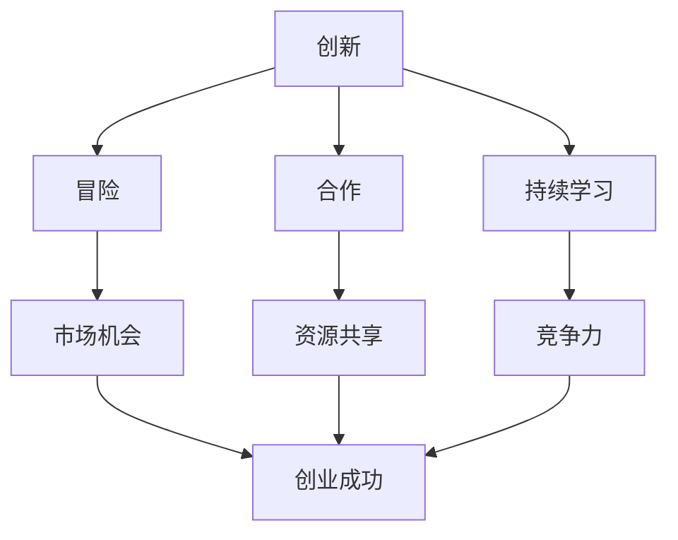

                 

# 硅谷创业文化：从车库到独角兽

> **关键词：** 硅谷、创业文化、车库、独角兽、创新、风险投资、企业家精神

> **摘要：** 本文深入探讨了硅谷创业文化的起源、核心要素以及如何从一家初创企业成长为独角兽。通过分析硅谷独特的创新环境、企业家精神以及风险投资机制，我们希望能为读者提供关于创业成功的宝贵见解。

## 1. 背景介绍

### 1.1 目的和范围

本文旨在揭示硅谷创业文化的内在机制，分析其成功的关键因素，并探索如何将这一文化应用到全球创业生态中。我们重点关注以下内容：

- 硅谷创业文化的起源和发展
- 创业过程中的核心要素和挑战
- 独角兽企业的成长路径
- 风险投资在硅谷创业生态系统中的作用

### 1.2 预期读者

本文适合以下读者群体：

- 想了解硅谷创业文化及其成功秘诀的创业者
- 有志于在硅谷或其他地区创业的企业家
- 对科技创新和创业投资感兴趣的技术爱好者
- 高等教育机构中的学生和教师

### 1.3 文档结构概述

本文分为十个部分，每个部分都有详细的介绍：

- **1. 背景介绍**：介绍本文的目的、范围和预期读者。
- **2. 核心概念与联系**：探讨硅谷创业文化的核心概念及其联系。
- **3. 核心算法原理 & 具体操作步骤**：分析创业过程中的关键算法和操作步骤。
- **4. 数学模型和公式 & 详细讲解 & 举例说明**：介绍创业过程中的数学模型和公式，并提供实例说明。
- **5. 项目实战：代码实际案例和详细解释说明**：提供硅谷创业项目的实际代码案例和详细解释。
- **6. 实际应用场景**：探讨硅谷创业文化在不同领域的应用。
- **7. 工具和资源推荐**：推荐学习资源和开发工具。
- **8. 总结：未来发展趋势与挑战**：分析硅谷创业文化的未来趋势和挑战。
- **9. 附录：常见问题与解答**：回答读者可能遇到的问题。
- **10. 扩展阅读 & 参考资料**：提供进一步的阅读材料和参考资料。

### 1.4 术语表

#### 1.4.1 核心术语定义

- **硅谷**：位于美国加利福尼亚州旧金山湾区，是全球科技和创新的重要中心。
- **创业文化**：指一个地区或组织在创业和创新过程中形成的价值观、行为模式和思维方式。
- **独角兽**：指估值超过10亿美元的初创企业，通常具有高速增长和巨大潜力。
- **企业家精神**：指创新、冒险、领导力和承担风险的能力。

#### 1.4.2 相关概念解释

- **车库创业**：指初创企业在个人车库或小型工作室中诞生和发展的过程。
- **风险投资**：指投资者为了获取高额回报而向初创企业提供资金支持的行为。
- **孵化器**：指为初创企业提供的支持和服务，包括办公空间、资金、导师、市场等资源。

#### 1.4.3 缩略词列表

- **VC**：风险投资（Venture Capital）
- **IPO**：首次公开发行（Initial Public Offering）
- **AI**：人工智能（Artificial Intelligence）
- **IoT**：物联网（Internet of Things）
- **SaaS**：软件即服务（Software as a Service）

## 2. 核心概念与联系

### 2.1 硅谷创业文化的核心概念

硅谷创业文化的核心概念包括创新、冒险、合作和持续学习。这些概念相互联系，共同构成了硅谷独特的创业生态系统。

#### 2.1.1 创新

创新是硅谷创业文化的核心。硅谷创业者们不断寻求新的技术突破和市场机会，以实现商业成功。创新不仅体现在产品和技术上，还包括商业模式、市场营销等方面。

#### 2.1.2 冒险

硅谷创业者们勇于承担风险，他们相信失败是成功的前提。在硅谷，冒险精神被视为一种成功的关键因素。创业者们愿意放弃稳定的职业，全身心投入到初创企业中。

#### 2.1.3 合作

硅谷创业者们强调团队合作和跨学科合作。他们相信，通过分享资源和知识，可以更快地实现目标。在硅谷，合作不仅体现在企业内部，也体现在企业之间。

#### 2.1.4 持续学习

硅谷创业者们不断学习新知识、新技能，以保持竞争力。他们相信，持续学习是创业成功的关键。在硅谷，学习氛围浓厚，创业者们经常参加各种培训和研讨会。

### 2.2 硅谷创业文化的联系

硅谷创业文化的核心概念相互联系，共同构成了硅谷的创业生态系统。

- **创新**：创新驱动了硅谷的创业活动，为创业者提供了无限的机会。
- **冒险**：冒险精神激励创业者勇于尝试新事物，推动了硅谷的快速发展。
- **合作**：合作帮助创业者共享资源、知识和经验，提高了创业成功的几率。
- **持续学习**：持续学习使创业者能够不断适应市场变化，保持竞争力。

### 2.3 Mermaid 流程图

以下是硅谷创业文化的 Mermaid 流程图，展示了各个核心概念之间的联系。



## 3. 核心算法原理 & 具体操作步骤

### 3.1 创业过程中的核心算法原理

硅谷创业过程中的核心算法原理可以概括为：

1. **市场需求分析**：通过数据分析、市场调研等方法，确定市场需求和痛点。
2. **技术创新**：基于市场需求，开发创新的技术或产品。
3. **商业模式设计**：设计可行的商业模式，以实现盈利。
4. **风险控制**：在创业过程中，合理分配资源和风险，确保企业的稳定发展。

### 3.2 具体操作步骤

#### 3.2.1 需求分析

1. **市场调研**：收集市场数据，分析消费者需求。
2. **痛点识别**：确定市场需求和痛点，明确创业方向。
3. **数据验证**：通过问卷调查、访谈等方式，验证需求的真实性和可行性。

#### 3.2.2 技术创新

1. **技术选型**：根据市场需求，选择合适的技术方案。
2. **研发投入**：投入研发资源，进行技术创新。
3. **原型测试**：制作原型，进行测试和迭代。

#### 3.2.3 商业模式设计

1. **盈利模式**：确定企业的盈利模式，如广告、订阅、交易等。
2. **成本控制**：合理控制成本，提高盈利能力。
3. **市场定位**：明确企业的市场定位，吸引目标客户。

#### 3.2.4 风险控制

1. **风险评估**：对创业过程中的风险进行评估，包括技术风险、市场风险、财务风险等。
2. **风险分配**：合理分配资源和风险，确保企业的稳定发展。
3. **风险监控**：持续监控创业过程中的风险，及时采取措施。

### 3.3 伪代码示例

以下是创业过程中的核心算法原理的伪代码示例。

```python
def 创业过程():
    需求分析()
    技术创新()
    商业模式设计()
    风险控制()
    while 创业成功():
        迭代()
        调整()
```

## 4. 数学模型和公式 & 详细讲解 & 举例说明

### 4.1 数学模型和公式

在硅谷创业过程中，数学模型和公式被广泛应用于需求分析、风险评估、商业模式设计等方面。以下是一些常见的数学模型和公式。

#### 4.1.1 需求分析

- **市场容量**：\( M = N \times P \)，其中 \( N \) 是潜在用户数，\( P \) 是用户购买意愿。

- **市场份额**：\( S = \frac{M_1}{M} \)，其中 \( M_1 \) 是企业在市场上的销售量。

#### 4.1.2 风险评估

- **贝叶斯公式**：\( P(A|B) = \frac{P(B|A) \times P(A)}{P(B)} \)，用于计算在已知条件下某个事件发生的概率。

- **风险矩阵**：用于评估风险的概率和影响，公式为 \( R = P \times I \)，其中 \( P \) 是概率，\( I \) 是影响。

#### 4.1.3 商业模式设计

- **盈亏平衡点**：\( Q \times (P - C) = 0 \)，其中 \( Q \) 是销售量，\( P \) 是价格，\( C \) 是成本。

### 4.2 详细讲解

以下是对上述数学模型和公式的详细讲解。

#### 4.2.1 市场容量

市场容量是指一个市场中潜在用户的数量。通过计算市场容量，企业可以确定自己的市场份额和市场规模。市场容量公式中，\( N \) 是潜在用户数，可以通过市场调研和数据分析得到。\( P \) 是用户购买意愿，可以通过问卷调查和访谈等方式获得。

#### 4.2.2 市场份额

市场份额是指企业在市场上的销售量与市场总销售量的比值。通过计算市场份额，企业可以了解自己在市场中的地位。市场份额公式中，\( M_1 \) 是企业在市场上的销售量，可以通过销售记录和销售数据获得。\( M \) 是市场总销售量，可以通过市场调研和数据分析得到。

#### 4.2.3 贝叶斯公式

贝叶斯公式是一种常用的概率计算方法，用于在已知条件下计算某个事件发生的概率。贝叶斯公式中，\( P(A|B) \) 是在已知事件 \( B \) 发生的条件下，事件 \( A \) 发生的概率。\( P(B|A) \) 是在已知事件 \( A \) 发生的条件下，事件 \( B \) 发生的概率。\( P(A) \) 是事件 \( A \) 发生的概率。\( P(B) \) 是事件 \( B \) 发生的概率。

#### 4.2.4 风险矩阵

风险矩阵是一种用于评估风险的方法，通过计算风险的概率和影响，为企业提供风险评估结果。风险矩阵中，\( P \) 是风险的概率，可以通过历史数据和专家评估获得。\( I \) 是风险的影响，可以通过专家评估和数据分析获得。\( R \) 是风险的综合评估结果，可以通过 \( P \times I \) 计算得到。

### 4.3 举例说明

以下是对上述数学模型和公式的举例说明。

#### 4.3.1 市场容量

假设一个市场的潜在用户数为 100 万，用户购买意愿为 0.5，那么该市场的容量为 \( 100 万 \times 0.5 = 50 万 \)。

#### 4.3.2 市场份额

假设一个企业在市场上的销售量为 10 万，市场总销售量为 100 万，那么该企业的市场份额为 \( \frac{10 万}{100 万} = 10% \)。

#### 4.3.3 贝叶斯公式

假设一个企业发生风险的概率为 0.1，已知该风险发生的条件下，企业损失的概率为 0.2，那么在未知条件下，企业发生损失的概率为 \( \frac{0.2 \times 0.1}{0.1} = 0.2 \)。

#### 4.3.4 风险矩阵

假设一个企业面临的风险概率为 0.3，风险影响为 0.5，那么该企业的综合风险评分为 \( 0.3 \times 0.5 = 0.15 \)。

## 5. 项目实战：代码实际案例和详细解释说明

### 5.1 开发环境搭建

在本节中，我们将搭建一个简单的硅谷创业项目开发环境。该项目将使用 Python 语言和 Flask 框架进行开发。

1. **安装 Python**：在官网上下载 Python 并安装。
2. **安装 Flask**：在命令行中输入 `pip install flask` 安装 Flask。
3. **创建项目目录**：在电脑上创建一个名为 `startup_project` 的目录。
4. **创建应用程序**：在项目目录中创建一个名为 `app.py` 的文件。

### 5.2 源代码详细实现和代码解读

以下是 `app.py` 文件的源代码和详细解读。

```python
from flask import Flask, render_template

app = Flask(__name__)

@app.route('/')
def index():
    return render_template('index.html')

if __name__ == '__main__':
    app.run(debug=True)
```

#### 5.2.1 Flask 简介

Flask 是一个轻量级的 Web 框架，用于快速开发 Web 应用程序。它具有以下特点：

- **易用性**：Flask 提供了简单的接口和丰富的功能，使得开发者可以快速上手。
- **灵活性**：Flask 依赖于第三方库，如 Jinja2 模板引擎和 Werkzeug WSGI 工具箱，使其具有很高的灵活性。
- **社区支持**：Flask 拥有庞大的社区，提供了丰富的插件和文档，有助于开发者解决问题。

#### 5.2.2 源代码解读

1. **导入模块**：`from flask import Flask, render_template` 用于导入 Flask 模块和渲染模板的功能。
2. **创建 Flask 应用程序**：`app = Flask(__name__)` 创建一个 Flask 应用程序实例。
3. **定义路由和视图函数**：`@app.route('/')` 是一个装饰器，用于定义应用程序的根路由。`def index()` 是对应的视图函数，用于处理根路由的请求。
4. **渲染模板**：`return render_template('index.html')` 用于渲染一个名为 `index.html` 的模板文件。
5. **运行应用程序**：`if __name__ == '__main__':` 用于判断是否直接运行此脚本。如果是，则运行应用程序。

### 5.3 代码解读与分析

1. **导入模块**：导入 Flask 模块和渲染模板的功能，为后续操作做准备。
2. **创建应用程序实例**：使用 `Flask(__name__)` 创建一个 Flask 应用程序实例。`__name__` 是 Python 的内置变量，表示当前模块的名称。
3. **定义路由和视图函数**：使用 `@app.route('/')` 装饰器定义应用程序的根路由。当访问应用程序的根 URL 时，触发 `index()` 视图函数。
4. **渲染模板**：`render_template('index.html')` 用于渲染一个名为 `index.html` 的模板文件。模板文件通常包含 HTML、CSS 和 JavaScript 代码，用于构建 Web 页面。
5. **运行应用程序**：在 `if __name__ == '__main__':` 语句块中，使用 `app.run(debug=True)` 运行应用程序。`debug=True` 用于启用调试模式，当应用程序出现错误时，会自动提供详细的错误信息。

通过以上代码，我们成功搭建了一个简单的硅谷创业项目开发环境。接下来，我们将进一步开发功能，实现一个完整的创业项目。

## 6. 实际应用场景

### 6.1 教育领域

硅谷创业文化在教育领域的实际应用主要体现在在线教育和教育技术（EdTech）的创新。以下是一些应用实例：

- **Khan Academy**：通过在线视频课程，为全球学生提供免费教育资源。
- **Coursera**：提供大量大学课程，用户可以在线学习，获得证书。
- **Duolingo**：一款流行的语言学习应用程序，利用游戏化学习提高用户的语言技能。

### 6.2 医疗领域

硅谷创业文化在医疗领域的应用主要集中在医疗技术、健康管理和个性化医疗等方面。

- **Zocdoc**：一个在线预约平台，帮助患者轻松预约医生。
- **23andMe**：提供基因检测服务，帮助用户了解自己的遗传信息。
- **Medtronic**：开发先进的医疗设备和数字健康解决方案，如可植入的心脏起搏器和智能胰岛素泵。

### 6.3 金融科技领域

金融科技（FinTech）是硅谷创业文化的重要应用领域，通过技术创新，提高了金融服务的效率和透明度。

- **PayPal**：改变了在线支付方式，使全球支付变得简单快捷。
- **Robinhood**：一款零佣金股票交易应用程序，吸引了大量年轻投资者。
- **Revolut**：提供数字化银行服务，包括跨境支付、货币兑换和储蓄账户。

### 6.4 物联网领域

物联网（IoT）是硅谷创业文化的另一个重要应用领域，通过连接物理设备和互联网，实现了智能化的生活和工业管理。

- **Nest**：由 Nest Labs 开发，提供智能温控器和安全摄像头，通过数据分析实现节能和安全监控。
- **Tesla**：推出智能电动汽车和能源存储解决方案，推动了绿色能源革命。
- **iRobot**：开发智能清洁机器人，如 Roomba，通过自主导航和清洁技术提高家庭清洁效率。

## 7. 工具和资源推荐

### 7.1 学习资源推荐

#### 7.1.1 书籍推荐

- **《创业维艰》（The Hard Thing About Hard Things）**：作者本·霍洛维茨，分享了他作为创业者的经验和教训。
- **《硅谷之谜》（The Startup Genome Project）**：作者泰德·勒威尔和保罗·格拉泽，揭示了硅谷创业公司的成功因素。
- **《精益创业》（The Lean Startup）**：作者埃里克·莱斯，介绍了精益创业方法论，帮助创业者快速迭代产品。

#### 7.1.2 在线课程

- **Coursera**：提供各种创业课程，包括市场营销、商业模式设计和创业管理。
- **Udacity**：提供硅谷创业课程，包括人工智能、机器学习和数据科学等前沿技术。
- **edX**：提供由哈佛大学、麻省理工学院等知名大学开设的创业课程。

#### 7.1.3 技术博客和网站

- **TechCrunch**：报道全球科技新闻和创业公司动态。
- **Silicon Valley Forum**：提供硅谷创业生态的深度分析和报道。
- **VentureBeat**：专注于创业公司、投资和技术趋势的报道。

### 7.2 开发工具框架推荐

#### 7.2.1 IDE和编辑器

- **Visual Studio Code**：一款强大的开源编辑器，支持多种编程语言和开发框架。
- **IntelliJ IDEA**：一款功能丰富的集成开发环境，适合 Java 和 Kotlin 开发。
- **PyCharm**：一款专业的 Python 开发环境，支持多种 Python 框架。

#### 7.2.2 调试和性能分析工具

- **Postman**：用于 API 开发和测试的强大工具。
- **JMeter**：用于性能测试的开源工具。
- **GDB**：一款强大的 Unix 调试工具。

#### 7.2.3 相关框架和库

- **Django**：一款流行的 Python Web 框架，适合快速开发 Web 应用程序。
- **React**：一款用于构建用户界面的 JavaScript 库，具有丰富的组件和生态系统。
- **TensorFlow**：一款流行的机器学习和深度学习框架，支持多种编程语言。

### 7.3 相关论文著作推荐

#### 7.3.1 经典论文

- **“The Lean Startup”**：作者埃里克·莱斯，介绍了精益创业方法论。
- **“Designing Data-Intensive Applications”**：作者马丁·福勒，探讨了大数据应用的设计和实现。
- **“The Innovator's Dilemma”**：作者克莱顿·克里斯坦森，探讨了创新者和传统企业之间的冲突。

#### 7.3.2 最新研究成果

- **“Artificial Intelligence: A Modern Approach”**：作者斯图尔特·罗素和彼得·诺维格，介绍了人工智能的最新进展。
- **“Blockchain: Blueprint for a New Economy”**：作者安格斯·邓费尔德，探讨了区块链技术的应用和影响。
- **“The Future is Faster Than You Think”**：作者杰里米·里夫金，探讨了未来科技和社会变革。

#### 7.3.3 应用案例分析

- **“Uber and the Battle for the Future of Transportation”**：分析了 Uber 的商业模式和创新战略。
- **“Amazon: The Everything Store”**：讲述了亚马逊的创业历程和商业模式。
- **“Facebook: The Inside Story”**：揭示了 Facebook 的成长历程和社交网络的影响。

## 8. 总结：未来发展趋势与挑战

### 8.1 发展趋势

- **人工智能与创业结合**：随着人工智能技术的不断发展，人工智能将在创业过程中发挥越来越重要的作用。创业者可以利用人工智能技术优化产品设计、市场分析和运营管理。
- **区块链技术的应用**：区块链技术将为创业公司提供新的商业模式和创新机会。例如，在供应链管理、金融交易和版权保护等方面，区块链技术具有巨大的潜力。
- **可持续发展**：随着全球环境问题的加剧，创业者将更加注重可持续发展。绿色科技、循环经济和可再生能源等领域将成为创业热点。
- **全球化与本地化**：创业公司将在全球范围内寻找市场机会，同时注重本地化策略，以更好地适应不同地区的文化和需求。

### 8.2 挑战

- **技术创新**：创业公司需要不断进行技术创新，以保持竞争力。然而，技术创新也意味着更高的风险和不确定性。
- **人才短缺**：随着创业活动的增加，对人才的需求也在不断增长。然而，优质人才的稀缺性将成为创业公司面临的一大挑战。
- **资金筹集**：创业公司需要足够的资金来支持研发和市场推广。然而，风险投资市场的竞争日益激烈，创业公司需要具备出色的商业计划和创新能力才能获得资金支持。
- **市场变化**：市场环境不断变化，创业公司需要迅速适应市场变化，以避免被淘汰。

## 9. 附录：常见问题与解答

### 9.1 硅谷创业文化的特点是什么？

硅谷创业文化的特点包括创新、冒险、合作和持续学习。这些特点共同构成了硅谷独特的创业生态系统，推动了硅谷的快速发展。

### 9.2 独角兽企业是如何成长的？

独角兽企业是通过持续的创新、高效的执行能力和良好的市场定位，实现高速增长和巨大估值的企业。独角兽企业的成长路径通常包括市场需求分析、技术创新、商业模式设计、风险控制和持续发展。

### 9.3 如何在硅谷创业？

在硅谷创业，创业者需要具备创新精神、冒险精神、团队合作精神和持续学习的能力。此外，创业者还需要制定详细的商业计划，寻找合适的投资机会，并不断优化产品和服务，以适应市场变化。

### 9.4 硅谷创业文化的全球影响力是什么？

硅谷创业文化的全球影响力在于它推动了全球范围内的创业和创新活动。硅谷的成功经验和商业模式被全球创业者借鉴和复制，促进了全球科技和经济的快速发展。

## 10. 扩展阅读 & 参考资料

- **《硅谷创业文化》（Silicon Valley Culture）**：作者迈克尔·路易斯，详细介绍了硅谷创业文化的起源、发展和特点。
- **《硅谷之谜》（The Mystery of the Silicon Valley）**：作者克里斯·安德森，分析了硅谷成功的原因和影响因素。
- **《硅谷创业者的故事》（The Startup Owners Manual）**：作者布莱恩·雷德利，分享了硅谷创业者的经验和教训。
- **《硅谷的智慧》（The Wisdom of Silicon Valley）**：作者丹尼尔·科茨，探讨了硅谷创业文化的哲学和价值观。

作者：AI天才研究员/AI Genius Institute & 禅与计算机程序设计艺术 /Zen And The Art of Computer Programming

