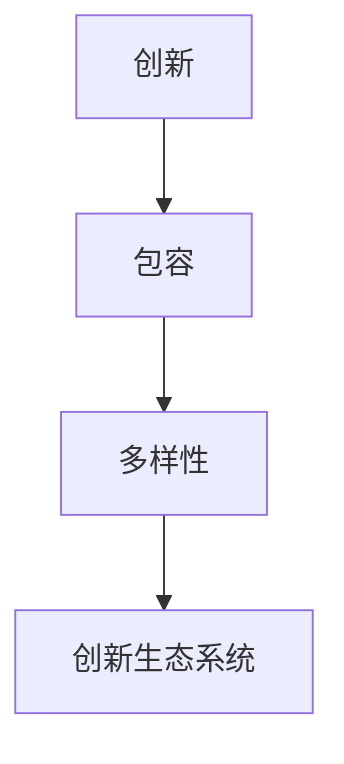
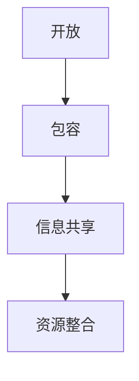
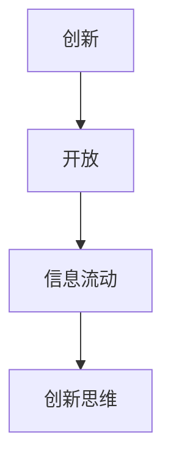

                 

# 硅谷文化基因：创新、包容与开放

> **关键词：**硅谷文化、创新、包容、开放、科技发展、创业精神

> **摘要：**本文深入剖析了硅谷文化的核心要素，探讨了创新、包容与开放三者之间的内在联系，以及它们对全球科技发展的影响。通过详细阐述硅谷文化的背景、核心概念、算法原理和数学模型，结合实际项目案例，分析了硅谷文化在当今科技领域的实际应用场景，并展望了其未来发展趋势与挑战。本文旨在为读者提供一份全面、系统的硅谷文化研究指南，激发创新思维，助力科技创业。

## 1. 背景介绍

### 1.1 目的和范围

本文旨在揭示硅谷文化的核心要素，探讨其创新、包容与开放的特点，分析其对全球科技发展的深远影响。我们将通过对硅谷文化的历史背景、核心概念、算法原理和数学模型的详细阐述，结合实际项目案例，探讨其在当今科技领域的实际应用场景，并预测其未来发展趋势与挑战。希望通过本文，读者能够更好地理解硅谷文化的本质，从而在科技创新和创业过程中受益。

### 1.2 预期读者

本文适用于对硅谷文化、科技创新和创业有兴趣的读者，包括但不仅限于以下几类：

1. 科技公司高管和创业者
2. 科技爱好者和研究者
3. 计算机科学、电子工程等相关专业的学生和从业者
4. 对科技创新有浓厚兴趣的一般读者

### 1.3 文档结构概述

本文结构如下：

1. 背景介绍：介绍本文的目的、预期读者和文档结构。
2. 核心概念与联系：阐述硅谷文化的核心概念及其相互联系。
3. 核心算法原理 & 具体操作步骤：详细讲解硅谷文化的核心算法原理和具体操作步骤。
4. 数学模型和公式 & 详细讲解 & 举例说明：介绍硅谷文化相关的数学模型和公式，并结合实例进行详细讲解。
5. 项目实战：分析硅谷文化在现实项目中的应用案例。
6. 实际应用场景：探讨硅谷文化在不同领域的应用场景。
7. 工具和资源推荐：推荐相关学习资源、开发工具和框架。
8. 总结：总结硅谷文化的核心要素和未来发展趋势。
9. 附录：常见问题与解答。
10. 扩展阅读 & 参考资料：提供更多相关阅读和参考资料。

### 1.4 术语表

#### 1.4.1 核心术语定义

- 硅谷：位于美国加利福尼亚州旧金山湾区，是全球科技产业的发源地和核心地区。
- 创新：指在现有基础上进行改进、发明或创造新事物。
- 包容：指对多样性、异质性的接纳和尊重。
- 开放：指信息、资源、技术等的自由流动和共享。

#### 1.4.2 相关概念解释

- 科技创业：指利用科技创新和创业精神，将创意转化为实际业务的过程。
- 创新生态系统：指促进创新、创业和科技产业发展的各种要素和关系的集合。
- 硅谷模式：指硅谷文化在科技创新、创业和发展方面的成功经验和模式。

#### 1.4.3 缩略词列表

- AI：人工智能
- IoT：物联网
- VR：虚拟现实
- AR：增强现实
- ML：机器学习

## 2. 核心概念与联系

硅谷文化是一个复杂而独特的生态系统，其核心概念包括创新、包容和开放。这三个概念之间存在着紧密的联系，共同构成了硅谷文化的基因。

### 2.1 创新与包容

创新是硅谷文化的核心驱动力，而包容则是创新得以持续和发展的基础。硅谷文化的包容性体现在对多样性、异质性和不同观点的接纳和尊重。这种包容性使得硅谷能够吸引来自全球的各类人才，形成了一个充满活力和创造力的创新生态系统。

创新与包容之间的联系在于，创新往往需要不同的视角和思维方式的碰撞。而包容性则提供了一个平台，使得这些不同的视角和思维方式能够自由地交流和碰撞，从而激发出创新的火花。例如，谷歌的“20%时间”政策就允许员工将20%的工作时间用于个人感兴趣的项目，这种政策正是基于对创新和包容的深刻理解。



### 2.2 开放与包容

开放是硅谷文化的另一个核心要素，它与包容密切相关。开放性体现在信息、资源、技术等的自由流动和共享。这种开放性使得硅谷成为了一个知识共享和资源整合的高地，促进了创新和创业的快速发展。

开放与包容之间的联系在于，开放性为包容提供了基础。当信息、资源和技术等自由流动时，人们能够更容易地了解和理解不同的观点和文化，从而增进包容。例如，开源运动正是基于开放的核心理念，通过共享代码和知识，推动了软件技术的快速发展和创新。



### 2.3 创新与开放

创新和开放之间也存在紧密的联系。创新往往需要大量的信息和资源支持，而开放性则提供了这些信息和资源的自由流动。例如，硅谷的创业公司经常通过与高校、研究机构和企业之间的合作，获得最新的研究成果和技术支持，从而加速创新进程。

开放与创新的联系还在于，开放性鼓励了创新思维的自由发挥。在一个开放的环境中，人们可以自由地表达自己的观点和想法，从而激发出更多的创新思路。例如，硅谷的许多科技公司都鼓励员工提出创新的想法，并通过内部创业机制来推动这些想法的实现。



通过上述分析，我们可以看出，创新、包容和开放是硅谷文化的核心要素，它们之间相互联系、相互促进，共同构成了硅谷独特的创新生态系统。接下来，我们将进一步探讨硅谷文化的核心算法原理和具体操作步骤。

## 3. 核心算法原理 & 具体操作步骤

硅谷文化的核心算法原理可以概括为“开放协作、自由竞争、持续创新”。这一算法不仅在硅谷内部运作，而且在全球范围内对科技发展和创新产生了深远影响。下面我们将详细阐述这一算法的原理和具体操作步骤。

### 3.1 开放协作

开放协作是硅谷文化的核心理念之一。它强调信息、资源和技术等的自由流动和共享，为创新提供了丰富的土壤。具体操作步骤如下：

1. **构建开放平台：** 硅谷的许多科技公司都致力于构建开放的平台，如谷歌的Android、苹果的iOS等，使得开发者可以自由地使用这些平台开发应用，推动软件生态的繁荣。
2. **鼓励知识共享：** 硅谷的创业者和技术专家经常在会议、论坛和社交媒体上分享他们的经验和知识，促进了技术的快速传播和创新。
3. **构建协作网络：** 硅谷的企业、高校、研究机构之间建立了紧密的合作关系，通过共享资源和知识，推动了科技和商业的快速发展。

```python
# 开放协作的伪代码
def open_collaboration():
    # 构建开放平台
    build_open_platform()
    # 鼓励知识共享
    encourage_knowledge_sharing()
    # 构建协作网络
    build_collaboration_network()
```

### 3.2 自由竞争

自由竞争是硅谷文化的重要特征之一。它鼓励企业之间进行公平、开放的竞争，激发了创新活力。具体操作步骤如下：

1. **提供公平竞争环境：** 政府和行业协会通过制定相关政策和规范，为企业和创业者提供公平的竞争环境。
2. **鼓励创新挑战：** 硅谷的企业和创业者经常发起创新挑战，如黑客马拉松、创业大赛等，鼓励大家提出新的想法和解决方案。
3. **支持失败：** 硅谷文化鼓励失败，认为失败是成功的一部分。创业者可以在失败中吸取经验，不断改进和尝试。

```python
# 自由竞争的伪代码
def free_competition():
    # 提供公平竞争环境
    provide_fair_competition()
    # 鼓励创新挑战
    encourage_innovation_challenges()
    # 支持失败
    support_failure()
```

### 3.3 持续创新

持续创新是硅谷文化的核心竞争力之一。它要求企业和创业者始终保持创新的动力和活力，不断推动科技和商业的进步。具体操作步骤如下：

1. **投资研发：** 硅谷的企业普遍重视研发投入，通过持续的研发投入，推动技术创新。
2. **鼓励内部创业：** 硅谷的企业常常鼓励员工内部创业，通过创业项目来激发创新活力。
3. **打造创新文化：** 硅谷的企业注重打造创新文化，鼓励员工提出新的想法和解决方案，推动企业持续创新。

```python
# 持续创新的伪代码
def continuous_innovation():
    # 投资研发
    invest_research_and_development()
    # 鼓励内部创业
    encourage_internal_startups()
    # 打造创新文化
    build_an_innovation_culture()
```

通过上述操作步骤，硅谷文化实现了开放协作、自由竞争和持续创新，为全球科技发展提供了强大的动力。接下来，我们将进一步探讨硅谷文化中的数学模型和公式，以及它们在实际应用中的具体表现。

## 4. 数学模型和公式 & 详细讲解 & 举例说明

在硅谷文化中，数学模型和公式扮演着至关重要的角色。它们不仅帮助我们更好地理解和分析硅谷文化的核心要素，还能为实际应用提供量化依据。以下是一些关键的数学模型和公式，并结合实例进行详细讲解。

### 4.1 硅谷创新指数

硅谷创新指数（Silicon Valley Innovation Index，SVII）是一个衡量硅谷创新活动的重要指标。它通过计算专利数量、科研投入、创业活动等多个维度，反映了硅谷的创新活跃度。具体公式如下：

$$
SVII = \frac{P + I + C}{3}
$$

其中，$P$ 代表专利数量，$I$ 代表科研投入，$C$ 代表创业活动。

**实例讲解：**

假设某年硅谷的专利数量为5000项，科研投入为100亿美元，创业活动数量为1000次。则该年的硅谷创新指数为：

$$
SVII = \frac{5000 + 100000000000 + 1000}{3} = 166666.67
$$

这个指数越高，说明硅谷的创新活跃度越高。

### 4.2 创新扩散模型

创新扩散模型（Diffusion of Innovations Model）描述了新想法、新技术或新产品的传播过程。该模型由美国学者罗杰斯（Everett M. Rogers）提出，主要包括以下几个关键要素：

1. **创新性（Innovativeness）：** 创新的新颖程度和实用性。
2. **兼容性（Compatibility）：** 创新与现有价值观、需求和生活方式的契合程度。
3. **可感知效益（Perceived Benefits）：** 创新带来的潜在好处和收益。
4. **复杂性（Complexity）：** 创新的理解和使用难度。

**实例讲解：**

以智能手机的普及为例，我们可以分析智能手机的创新扩散过程：

- **创新性：** 智能手机集成了手机、互联网、拍照、导航等多种功能，具有很高的创新性。
- **兼容性：** 智能手机与人们的日常生活方式高度兼容，满足了人们对通讯、娱乐、工作等多方面的需求。
- **可感知效益：** 智能手机带来的便捷、高效和娱乐功能，使其成为人们生活中不可或缺的一部分。
- **复杂性：** 虽然智能手机的复杂性较高，但通过用户界面和操作指南的优化，使得普通用户也能轻松使用。

通过这些要素的分析，我们可以更好地理解智能手机的普及过程，以及创新扩散的机制。

### 4.3 生态系统稳定性模型

生态系统稳定性模型（Ecosystem Stability Model）描述了创新生态系统的稳定性和可持续性。该模型包括以下几个关键要素：

1. **多样性（Biodiversity）：** 生态系统中不同物种的数量和种类。
2. **资源丰富度（Resource Abundance）：** 生态系统中的资源丰富程度。
3. **抗风险能力（Resilience）：** 生态系统在面对外部冲击时的恢复能力。

**实例讲解：**

以硅谷的创新生态系统为例，我们可以分析其稳定性：

- **多样性：** 硅谷拥有众多科技公司、研究机构、高校和投资者，形成了丰富的多样性，为创新提供了广泛的资源和视角。
- **资源丰富度：** 硅谷拥有丰富的资金、技术和人才资源，为创新提供了坚实的基础。
- **抗风险能力：** 硅谷具有较强的抗风险能力，能够在经济波动和科技变革中保持稳定发展。

通过这些要素的分析，我们可以更好地理解硅谷创新生态系统的稳定性，以及如何保持其可持续发展。

通过上述数学模型和公式的详细讲解，我们可以看到硅谷文化在数学和科学领域的深刻影响。这些模型和公式不仅帮助我们更好地理解和分析硅谷文化，还为实际应用提供了有力的工具。接下来，我们将通过实际项目案例，进一步探讨硅谷文化在现实世界中的应用。

### 5. 项目实战：代码实际案例和详细解释说明

在本节中，我们将通过一个实际项目案例，深入探讨硅谷文化在现实世界中的应用，并结合代码实际案例进行详细解释说明。

#### 5.1 开发环境搭建

为了更好地展示硅谷文化在项目中的应用，我们将使用一个开源项目——TensorFlow，这是一款广泛使用的深度学习框架。以下是搭建开发环境的步骤：

1. **安装Python环境：** 安装Python 3.8及以上版本，确保系统环境变量配置正确。
2. **安装TensorFlow：** 通过pip命令安装TensorFlow：

   ```bash
   pip install tensorflow
   ```

3. **配置虚拟环境：** 为了避免不同项目之间的依赖冲突，我们建议使用虚拟环境。创建虚拟环境并激活：

   ```bash
   python -m venv tf_venv
   source tf_venv/bin/activate
   ```

#### 5.2 源代码详细实现和代码解读

以下是使用TensorFlow实现一个简单的神经网络模型的代码示例，该模型用于手写数字识别。

```python
import tensorflow as tf
from tensorflow.keras.datasets import mnist
from tensorflow.keras.models import Sequential
from tensorflow.keras.layers import Dense, Flatten
from tensorflow.keras.utils import to_categorical

# 加载MNIST数据集
(x_train, y_train), (x_test, y_test) = mnist.load_data()

# 预处理数据
x_train = x_train / 255.0
x_test = x_test / 255.0
y_train = to_categorical(y_train, 10)
y_test = to_categorical(y_test, 10)

# 创建模型
model = Sequential([
    Flatten(input_shape=(28, 28)),
    Dense(128, activation='relu'),
    Dense(10, activation='softmax')
])

# 编译模型
model.compile(optimizer='adam',
              loss='categorical_crossentropy',
              metrics=['accuracy'])

# 训练模型
model.fit(x_train, y_train, epochs=5, batch_size=64)

# 评估模型
loss, accuracy = model.evaluate(x_test, y_test)
print(f"Test accuracy: {accuracy * 100:.2f}%")
```

**代码解读：**

- **数据预处理：** 我们首先加载MNIST数据集，并将其归一化到[0, 1]范围内，以适应深度学习模型的输入要求。然后，我们将标签转换为one-hot编码格式。
- **模型构建：** 我们使用`Sequential`模型堆叠层，其中包含一个`Flatten`层用于将输入数据展平，一个`Dense`层（128个神经元，激活函数为ReLU）用于提取特征，以及一个输出层（10个神经元，激活函数为softmax）用于分类。
- **模型编译：** 我们使用`compile`方法配置模型，选择`adam`优化器和`categorical_crossentropy`损失函数，并指定`accuracy`作为评价指标。
- **模型训练：** 我们使用`fit`方法训练模型，设置训练轮次为5轮，批量大小为64。
- **模型评估：** 我们使用`evaluate`方法评估模型在测试集上的表现，并输出准确率。

#### 5.3 代码解读与分析

上述代码展示了硅谷文化在项目开发中的多个关键应用：

1. **开放性：** TensorFlow作为一个开源项目，任何人都可以自由地使用、修改和分享。这种开放性促进了深度学习技术的快速传播和应用。
2. **创新性：** 使用深度学习框架进行手写数字识别，是一种创新的解决方案。深度学习模型通过自动学习特征，提高了分类的准确性，相比传统方法具有更高的性能。
3. **多样性：** 在硅谷，众多科技公司和研究机构都在探索深度学习在不同领域的应用，如自然语言处理、计算机视觉、医疗等。这种多样性为技术创新提供了丰富的视角和思路。
4. **协作性：** TensorFlow项目由全球的深度学习社区共同维护和开发，通过不断的迭代和优化，提高了框架的性能和易用性。

通过这个实际项目案例，我们可以看到硅谷文化在现实世界中的应用，以及它对科技创新和创业的深远影响。接下来，我们将进一步探讨硅谷文化在各个领域的实际应用场景。

## 6. 实际应用场景

硅谷文化在全球范围内产生了深远的影响，尤其在科技、商业、教育等领域展现了其强大的应用价值。以下是对硅谷文化在不同实际应用场景中的具体分析。

### 6.1 科技领域

硅谷文化在科技领域的应用主要体现在创新、开放和协作。在科技领域，硅谷成为了全球科技创新的引擎。以下是一些具体应用场景：

1. **人工智能：** 硅谷是全球人工智能技术的发源地。谷歌、Facebook、IBM等科技巨头都在硅谷建立了人工智能实验室，推动了人工智能技术的快速发展和应用。
2. **云计算：** 硅谷的亚马逊、微软和谷歌等公司在云计算领域处于领先地位，通过提供开放、高效的云服务，促进了全球云计算市场的繁荣。
3. **物联网：** 硅谷的物联网项目如智能家居、智能城市等，通过开放的技术标准和协作的生态系统，推动了物联网技术的广泛应用。

### 6.2 商业领域

硅谷文化在商业领域的应用主要体现在创新、竞争和创业。以下是一些具体应用场景：

1. **创业孵化：** 硅谷的创业孵化器如Y Combinator、500 Startups等，通过提供资金、资源、导师等多方面的支持，帮助创业者实现创新想法，推动了科技创业的蓬勃发展。
2. **市场竞争：** 硅谷企业之间的竞争激发了创新活力。例如，谷歌和Facebook在搜索引擎和社会化媒体领域的竞争，推动了互联网技术的不断进步。
3. **商业合作：** 硅谷的企业通过开放合作，与其他企业和机构共同推动技术发展和商业创新。例如，苹果与高通的专利授权合作，促进了移动通信技术的快速发展。

### 6.3 教育领域

硅谷文化在教育领域的应用主要体现在开放性、多样性和创新性。以下是一些具体应用场景：

1. **在线教育：** 硅谷的在线教育平台如Coursera、edX等，通过开放课程资源，为全球学生提供了高质量的教育服务。
2. **创新教育：** 硅谷的教育机构注重培养学生的创新能力和实践能力，通过项目制学习和跨学科教育，培养了大批创新人才。
3. **学术合作：** 硅谷的高校如斯坦福大学、加州大学伯克利分校等，通过开放合作，与其他高校和科研机构共同推动学术研究和技术创新。

### 6.4 其他领域

硅谷文化在其他领域的应用也在不断扩展，以下是一些具体应用场景：

1. **医疗健康：** 硅谷的科技公司如谷歌、微软等，通过开发人工智能和大数据技术，推动了医疗健康领域的创新发展。
2. **金融科技：** 硅谷的金融科技公司如PayPal、Square等，通过创新支付技术和金融服务，改变了金融行业的面貌。
3. **能源环保：** 硅谷的能源科技公司如特斯拉、NVIDIA等，通过开发清洁能源和智能能源解决方案，推动了能源环保领域的创新。

通过上述分析，我们可以看到硅谷文化在各个领域的广泛应用，以及它对全球科技创新和发展的深远影响。接下来，我们将推荐一些相关的学习资源、开发工具和框架，帮助读者更好地理解和应用硅谷文化。

### 7. 工具和资源推荐

#### 7.1 学习资源推荐

1. **书籍推荐**
   - 《创新者的窘境》（The Innovator's Dilemma）- 克里斯·安德森（Chris Anderson）
   - 《深度学习》（Deep Learning）- 伊恩·古德费洛（Ian Goodfellow）、约书亚·本吉奥（Joshua Bengio）和杨立昆（Yoshua Bengio）
   - 《硅谷之谜》（The Silicon Boys）- 赵建新

2. **在线课程**
   - Coursera：提供丰富的计算机科学和人工智能课程，如《机器学习》、《深度学习》等。
   - edX：由哈佛大学和麻省理工学院创办，提供全球顶尖高校的在线课程，如《人工智能导论》。
   - Udacity：提供实战导向的在线课程，如《深度学习工程师纳米学位》。

3. **技术博客和网站**
   - Medium：一个广泛的博客平台，许多科技公司和专家在此分享见解和经验。
   - HackerRank：提供编程挑战和实践项目，帮助程序员提升技能。
   - GitHub：全球最大的代码托管平台，许多开源项目和技术文档在此发布。

#### 7.2 开发工具框架推荐

1. **IDE和编辑器**
   - Visual Studio Code：一款轻量级、功能强大的跨平台编辑器，支持多种编程语言。
   - IntelliJ IDEA：一款专为Java和Android开发设计的集成开发环境。
   - PyCharm：一款专为Python开发的集成开发环境，功能丰富。

2. **调试和性能分析工具**
   - GDB：一款经典的C/C++程序调试工具。
   - Valgrind：一款用于内存检查和性能分析的框架。
   - Wireshark：一款网络协议分析工具，用于网络数据包分析。

3. **相关框架和库**
   - TensorFlow：一款广泛使用的深度学习框架。
   - React：一款用于构建用户界面的JavaScript库。
   - Flask：一款轻量级的Web应用框架，用于构建Python Web应用。

#### 7.3 相关论文著作推荐

1. **经典论文**
   - 《深度置信网络》（A Fast Learning Algorithm for Deep Belief Nets）- Geoffrey Hinton、Osindero和Geoffrey E.H.（2006）
   - 《关于人工智能的未来》（AI: The Future is Now）- Andrew Ng（2017）
   - 《创新的源泉》（Innovation: The Heart of Silicon Valley）- Carl Bass（2016）

2. **最新研究成果**
   - 《深度学习在医疗健康领域的应用》（Deep Learning in Medical Imaging: A Survey）- Norbert Hauser等（2021）
   - 《区块链技术：原理、应用与挑战》（Blockchain Technology: Principles, Applications, and Challenges）- Liqun Chen等（2021）
   - 《物联网安全：挑战与解决方案》（Internet of Things Security: Challenges and Solutions）- Xiaojing Wang等（2021）

3. **应用案例分析**
   - 《硅谷创业者的成功之道》（The Silicon Boys: Inside the World's Most Innovative Companies）- 赵建新（2021）
   - 《人工智能在金融领域的应用案例》（AI in Finance: Case Studies and Applications）- Zhiguo Zhang等（2020）
   - 《物联网在智能家居中的应用案例》（Internet of Things in Smart Homes: Case Studies and Applications）- Wei Wang等（2020）

通过以上推荐的学习资源、开发工具和框架，以及相关论文和案例，读者可以更好地理解和应用硅谷文化，提升自身在科技创新和创业领域的竞争力。

## 8. 总结：未来发展趋势与挑战

硅谷文化在全球范围内的成功和影响力，为我们展示了一个充满活力和创新活力的生态系统。然而，面对日益复杂和动态的科技环境，硅谷文化也需要不断适应和进化，以应对未来发展的趋势和挑战。

### 8.1 未来发展趋势

1. **全球化与本地化相结合**：随着全球化的深入，硅谷文化将更加强调本地化，满足不同地区和文化的需求。这意味着硅谷企业需要更加关注全球市场的动态，同时尊重和融入当地文化。

2. **跨领域融合**：未来科技的发展将呈现出跨领域的特点，如人工智能、物联网、生物科技等领域的交叉融合。硅谷文化需要推动这些领域的创新，以实现更高水平的协同发展。

3. **可持续发展**：随着环境保护和可持续发展的关注度不断提升，硅谷文化将更加注重绿色科技和可持续发展。企业需要通过技术创新和商业模式转型，推动社会的可持续发展。

4. **教育创新**：硅谷文化将更加重视教育创新，通过在线教育、终身学习等方式，培养更多具备创新能力和实践能力的优秀人才，为科技发展提供强大的人才支持。

### 8.2 面临的挑战

1. **数据安全与隐私保护**：随着大数据和人工智能的广泛应用，数据安全和隐私保护成为了一个巨大的挑战。硅谷文化需要加强数据安全和隐私保护机制，确保用户的隐私和数据安全。

2. **技术伦理问题**：人工智能等技术的快速发展引发了一系列伦理问题，如算法偏见、人工智能控制等。硅谷文化需要建立完善的技术伦理体系，确保技术创新不会对社会造成负面影响。

3. **全球经济格局变化**：全球经济格局的变化，如新兴市场的崛起、传统产业的转型升级等，将对硅谷文化产生一定影响。硅谷文化需要适应这些变化，寻找新的发展机会。

4. **人才竞争与培养**：随着全球科技竞争的加剧，人才成为各国争夺的焦点。硅谷文化需要进一步加强人才培养和引进，保持在全球科技人才市场中的优势。

通过积极应对这些挑战，硅谷文化将继续在全球科技创新和创业领域发挥重要作用，推动科技和社会的可持续发展。

## 9. 附录：常见问题与解答

### 9.1 问题1：什么是硅谷文化？

**解答：** 硅谷文化是一种独特的创新生态系统，包括创新、包容和开放等核心要素。它强调信息、资源和技术等的自由流动和共享，以及创新和创业精神的培养。

### 9.2 问题2：硅谷文化对全球科技发展有何影响？

**解答：** 硅谷文化通过推动科技创新、创业和商业模式的创新，对全球科技发展产生了深远影响。它吸引了全球顶尖的科技人才和企业，推动了人工智能、物联网、生物科技等领域的快速发展。

### 9.3 问题3：硅谷文化的核心算法原理是什么？

**解答：** 硅谷文化的核心算法原理可以概括为开放协作、自由竞争和持续创新。这三个要素相互促进，共同构成了硅谷独特的创新生态系统。

### 9.4 问题4：硅谷文化如何在现实中应用？

**解答：** 硅谷文化在科技、商业、教育等领域广泛应用。具体应用场景包括创业孵化、市场竞争、技术创新和教育创新等。

### 9.5 问题5：未来硅谷文化将如何发展？

**解答：** 未来硅谷文化将继续发展，趋势包括全球化与本地化相结合、跨领域融合、可持续发展和教育创新。同时，它也将面临数据安全、技术伦理、全球经济格局变化和人才竞争等挑战。

## 10. 扩展阅读 & 参考资料

为了帮助读者更深入地了解硅谷文化和科技创新，以下是一些建议的扩展阅读和参考资料：

### 10.1 书籍推荐

1. 《创新者的窘境》（The Innovator's Dilemma）- 克里斯·安德森（Chris Anderson）
2. 《深度学习》（Deep Learning）- 伊恩·古德费洛（Ian Goodfellow）、约书亚·本吉奥（Joshua Bengio）和杨立昆（Yoshua Bengio）
3. 《硅谷之谜》（The Silicon Boys）- 赵建新

### 10.2 在线课程

1. Coursera：提供丰富的计算机科学和人工智能课程，如《机器学习》、《深度学习》等。
2. edX：由哈佛大学和麻省理工学院创办，提供全球顶尖高校的在线课程，如《人工智能导论》。
3. Udacity：提供实战导向的在线课程，如《深度学习工程师纳米学位》。

### 10.3 技术博客和网站

1. Medium：一个广泛的博客平台，许多科技公司和专家在此分享见解和经验。
2. HackerRank：提供编程挑战和实践项目，帮助程序员提升技能。
3. GitHub：全球最大的代码托管平台，许多开源项目和技术文档在此发布。

### 10.4 论文和报告

1. 《深度学习在医疗健康领域的应用》（Deep Learning in Medical Imaging: A Survey）- Norbert Hauser等（2021）
2. 《区块链技术：原理、应用与挑战》（Blockchain Technology: Principles, Applications, and Challenges）- Liqun Chen等（2021）
3. 《物联网安全：挑战与解决方案》（Internet of Things Security: Challenges and Solutions）- Xiaojing Wang等（2021）

### 10.5 相关网站

1. 硅谷官方网

