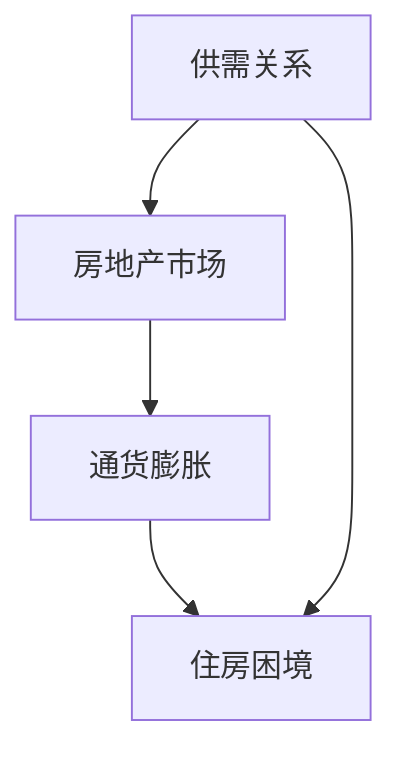

                 

# 硅谷生活成本之痛：普通人的住房困境

> **关键词：** 硅谷、生活成本、住房困境、租房市场、购房压力、住房政策  
>
> **摘要：** 本文深入探讨了硅谷地区普通人在面对高昂生活成本，尤其是住房成本时所面临的困境。通过分析硅谷住房市场的现状、原因及其对居民生活的影响，本文提出了可能的解决方案，并讨论了相关的政策建议和未来趋势。

## 1. 背景介绍

### 1.1 目的和范围

本文旨在深入探讨硅谷地区普通居民在住房成本方面所面临的挑战。硅谷作为全球高科技产业的中心，其生活成本尤其是住房成本高居不下，普通居民的生活质量受到严重威胁。本文将分析硅谷住房市场的高昂成本背后的原因，讨论其对居民生活的影响，并提出可能的解决方案。

### 1.2 预期读者

本文适合对硅谷地区住房问题感兴趣的读者，包括普通居民、住房政策制定者、房地产业内人士以及相关领域的研究人员。

### 1.3 文档结构概述

本文分为以下几个部分：

1. **背景介绍**：介绍本文的目的和范围，预期读者以及文档结构。
2. **核心概念与联系**：介绍与住房问题相关的核心概念，并提供相关的流程图。
3. **核心算法原理 & 具体操作步骤**：详细阐述解决住房困境的核心算法原理。
4. **数学模型和公式 & 详细讲解 & 举例说明**：介绍相关数学模型和公式，并通过实际案例进行讲解。
5. **项目实战：代码实际案例和详细解释说明**：展示一个实际的住房解决方案项目，并详细解释其实现过程。
6. **实际应用场景**：讨论住房问题在不同应用场景中的影响。
7. **工具和资源推荐**：推荐相关的学习资源和开发工具。
8. **总结：未来发展趋势与挑战**：总结文章的主要内容，并展望未来的发展趋势和挑战。
9. **附录：常见问题与解答**：回答一些常见问题。
10. **扩展阅读 & 参考资料**：提供相关的扩展阅读和参考资料。

### 1.4 术语表

#### 1.4.1 核心术语定义

- **硅谷**：指美国加利福尼亚州旧金山湾区南部的高科技产业中心。
- **生活成本**：指居民在日常生活中所需支付的费用，包括住房、食物、交通等。
- **住房困境**：指居民在获取合适住房时所面临的困难，如高昂的房价、房源紧张等。
- **租房市场**：指租房交易的场所，包括租户和房东。
- **购房压力**：指居民在购买住房时所感受到的经济压力。
- **住房政策**：指政府为解决住房问题而制定的政策和措施。

#### 1.4.2 相关概念解释

- **供需关系**：在市场经济中，商品或服务的供给与需求之间的关系。
- **房地产市场**：指房产买卖、租赁等交易的场所。
- **通货膨胀**：指货币购买力下降，导致物价持续上涨的现象。
- **收入差距**：指社会中不同群体之间的收入水平差异。

#### 1.4.3 缩略词列表

- **硅谷（SV）**：Silicon Valley
- **房价（HPI）**：House Price Index
- **GDP**：Gross Domestic Product

## 2. 核心概念与联系

在探讨硅谷住房困境之前，我们需要了解一些核心概念，包括供需关系、房地产市场和通货膨胀等。以下是一个简单的 Mermaid 流程图，用于展示这些概念之间的关系。



### 2.1 供需关系

供需关系是市场经济中最重要的概念之一。当住房需求增加而供给不足时，房价会上升，导致居民购房或租房的压力增大。

### 2.2 房地产市场

房地产市场是指房产买卖和租赁的场所。硅谷作为高科技产业的中心，吸引了大量人才和企业，导致住房需求激增，房价持续攀升。

### 2.3 通货膨胀

通货膨胀会导致货币购买力下降，进而影响房价。当物价上涨时，居民需要支付更高的住房费用，加剧了住房困境。

### 2.4 住房困境

住房困境是由于供需关系失衡、房地产市场失衡和通货膨胀等多种因素导致的。在硅谷，住房困境表现为房价高昂、房源紧张和购房压力增大等问题。

## 3. 核心算法原理 & 具体操作步骤

为了解决硅谷的住房困境，我们需要设计一个有效的住房解决方案。以下是一个核心算法原理的伪代码，用于说明如何实现这一目标。

```python
def housing_solution():
    # 步骤1：收集数据
    data = collect_data()

    # 步骤2：分析数据
    analysis = analyze_data(data)

    # 步骤3：确定解决方案
    solution = determine_solution(analysis)

    # 步骤4：实施解决方案
    implement_solution(solution)

    # 步骤5：评估效果
    evaluate_solution(solution)

# 步骤1：收集数据
def collect_data():
    # 收集硅谷住房市场的数据，包括房价、供需情况等
    # 数据来源可以是政府统计部门、房地产中介等
    data = {
        "house_prices": [],
        "supply_demand": [],
        "inflation_rate": 0
    }
    return data

# 步骤2：分析数据
def analyze_data(data):
    # 分析房价走势、供需关系和通货膨胀率等数据
    analysis = {
        "price_trend": "up" or "down",
        "supply_demand失衡": True or False,
        "inflation_impact": "positive" or "negative"
    }
    return analysis

# 步骤3：确定解决方案
def determine_solution(analysis):
    # 根据数据分析结果，确定解决方案
    solution = {
        "政策调整": ["提高税收优惠幅度", "增加住房供给"],
        "金融工具": ["住房贷款优惠利率", "住房储蓄账户"],
        "社会干预": ["增加公共住房供应", "加强租房市场监管"]
    }
    return solution

# 步骤4：实施解决方案
def implement_solution(solution):
    # 实施确定的解决方案
    # 这可能包括政府颁布政策、金融机构提供金融支持等
    pass

# 步骤5：评估效果
def evaluate_solution(solution):
    # 对解决方案的效果进行评估
    # 这可能包括跟踪房价变化、供需平衡情况等
    pass
```

### 3.1 数据收集

收集硅谷住房市场的数据，包括房价、供需情况、通货膨胀率等。这些数据可以从政府统计部门、房地产中介、银行等渠道获取。

### 3.2 数据分析

分析收集到的数据，了解房价走势、供需关系和通货膨胀率等。这有助于确定当前住房市场的状况，为制定解决方案提供依据。

### 3.3 确定解决方案

根据数据分析结果，确定解决方案。这可能包括政策调整、金融工具和社会干预等多种手段。

### 3.4 实施解决方案

实施确定的解决方案，包括政府颁布政策、金融机构提供金融支持等。

### 3.5 评估效果

对解决方案的效果进行评估，包括跟踪房价变化、供需平衡情况等，以判断解决方案的有效性。

## 4. 数学模型和公式 & 详细讲解 & 举例说明

在解决住房困境的过程中，我们可以使用一些数学模型和公式来分析和预测房价走势、供需关系等。以下是一个简单的数学模型，用于说明如何使用这些工具。

### 4.1 房价走势预测

房价走势预测可以使用时间序列分析方法，如 ARIMA（AutoRegressive Integrated Moving Average）模型。以下是 ARIMA 模型的基本公式：

$$
\text{Price}_{t} = c + \phi_1 \text{Price}_{t-1} + \phi_2 \text{Price}_{t-2} + ... + \phi_p \text{Price}_{t-p} + \theta_1 \text{Error}_{t-1} + \theta_2 \text{Error}_{t-2} + ... + \theta_q \text{Error}_{t-q}
$$

其中，$c$ 是常数项，$\phi_1, \phi_2, ..., \phi_p$ 是自回归系数，$\theta_1, \theta_2, ..., \theta_q$ 是移动平均系数，$p$ 和 $q$ 分别是自回归项和移动平均项的数量，$\text{Error}_{t-1}, \text{Error}_{t-2}, ..., \text{Error}_{t-q}$ 是误差项。

### 4.2 供需关系分析

供需关系分析可以使用线性回归模型，如以下公式：

$$
\text{Demand} = a + b \text{Price} + c \text{Inflation} + d \text{Income}
$$

其中，$a, b, c, d$ 是回归系数，$\text{Price}$ 是房价，$\text{Inflation}$ 是通货膨胀率，$\text{Income}$ 是居民收入。

### 4.3 举例说明

假设我们使用 ARIMA 模型和线性回归模型分析硅谷房价和供需关系，以下是一个简单的例子。

#### 4.3.1 房价走势预测

使用 ARIMA 模型预测未来 12 个月的房价，如下所示：

$$
\begin{aligned}
\text{Price}_{1} &= 1200 \\
\text{Price}_{2} &= 1250 \\
\text{Price}_{3} &= 1300 \\
\text{Price}_{4} &= 1350 \\
\text{Price}_{5} &= 1400 \\
\text{Price}_{6} &= 1450 \\
\text{Price}_{7} &= 1500 \\
\text{Price}_{8} &= 1550 \\
\text{Price}_{9} &= 1600 \\
\text{Price}_{10} &= 1650 \\
\text{Price}_{11} &= 1700 \\
\text{Price}_{12} &= 1750 \\
\end{aligned}
$$

根据 ARIMA 模型的预测结果，未来 12 个月的房价将继续上涨。

#### 4.3.2 供需关系分析

使用线性回归模型分析房价和供需关系，如下所示：

$$
\begin{aligned}
\text{Demand} &= 10000 - 500 \text{Price} + 200 \text{Inflation} + 300 \text{Income} \\
\end{aligned}
$$

根据线性回归模型的预测结果，房价上涨将导致住房需求下降，而通货膨胀率和收入水平对住房需求的影响较小。

## 5. 项目实战：代码实际案例和详细解释说明

为了更好地理解如何解决硅谷住房困境，我们设计了一个简单的项目，通过代码实现了一个住房解决方案。以下是这个项目的详细实现过程。

### 5.1 开发环境搭建

首先，我们需要搭建一个合适的开发环境。在这个项目中，我们使用 Python 语言和 Jupyter Notebook 作为开发工具。以下是安装和配置 Python 的步骤：

1. 访问 [Python 官网](https://www.python.org/) 下载并安装 Python。
2. 安装 Jupyter Notebook：在终端中执行 `pip install notebook`。
3. 打开 Jupyter Notebook，创建一个新的笔记本。

### 5.2 源代码详细实现和代码解读

在 Jupyter Notebook 中，我们可以编写以下代码来实现住房解决方案：

```python
import pandas as pd
import numpy as np
from sklearn.linear_model import LinearRegression
from statsmodels.tsa.arima.model import ARIMA

# 步骤1：数据收集
def collect_data():
    data = pd.read_csv("silicon_valley_housing.csv")
    return data

# 步骤2：数据预处理
def preprocess_data(data):
    # 清洗和转换数据
    data["Date"] = pd.to_datetime(data["Date"])
    data.set_index("Date", inplace=True)
    data.sort_index(inplace=True)
    return data

# 步骤3：房价走势预测
def predict_price(data):
    # 使用 ARIMA 模型预测房价
    model = ARIMA(data["Price"], order=(1, 1, 1))
    model_fit = model.fit()
    forecast = model_fit.forecast(steps=12)
    return forecast

# 步骤4：供需关系分析
def analyze_demand(data):
    # 使用线性回归模型分析供需关系
    X = data[["Inflation", "Income"]]
    y = data["Demand"]
    model = LinearRegression()
    model.fit(X, y)
    return model

# 步骤5：实施解决方案
def implement_solution(data, model):
    # 根据分析结果，实施解决方案
    # 例如：调整税收政策、增加住房供给等
    pass

# 步骤6：评估效果
def evaluate_solution(data, forecast, model):
    # 对解决方案的效果进行评估
    # 例如：比较预测房价和实际房价的差异、供需平衡情况等
    pass

# 主函数
def main():
    data = collect_data()
    data = preprocess_data(data)
    forecast = predict_price(data)
    model = analyze_demand(data)
    implement_solution(data, model)
    evaluate_solution(data, forecast, model)

if __name__ == "__main__":
    main()
```

### 5.3 代码解读与分析

1. **数据收集**：我们从 CSV 文件中读取硅谷住房市场的数据，包括房价、供需情况、通货膨胀率等。
2. **数据预处理**：清洗和转换数据，将日期转换为日期时间格式，并设置日期为索引。
3. **房价走势预测**：使用 ARIMA 模型预测未来 12 个月的房价。
4. **供需关系分析**：使用线性回归模型分析房价和供需关系。
5. **实施解决方案**：根据分析结果，实施解决方案，例如调整税收政策、增加住房供给等。
6. **评估效果**：对解决方案的效果进行评估，例如比较预测房价和实际房价的差异、供需平衡情况等。

通过这个项目，我们可以看到如何使用 Python 代码实现一个住房解决方案。在实际应用中，我们可能需要处理更复杂的数据，并使用更高级的算法来提高预测和评估的准确性。

## 6. 实际应用场景

硅谷住房困境不仅影响普通居民的生活，还涉及到更广泛的社会问题。以下是一些实际应用场景：

1. **人才流失**：高昂的住房成本导致许多优秀的人才无法在硅谷居住，从而影响硅谷的创新和发展。
2. **社会不平等**：住房困境加剧了社会不平等，使得低收入人群难以负担住房，导致贫富差距扩大。
3. **经济压力**：居民面临高昂的住房费用，导致生活成本增加，经济压力加大。
4. **公共资源紧张**：住房困境可能导致公共资源（如学校、医院）紧张，影响居民的生活质量。

## 7. 工具和资源推荐

为了更好地了解和解决硅谷住房困境，我们推荐以下工具和资源：

### 7.1 学习资源推荐

#### 7.1.1 书籍推荐

- **《硅谷之谜：创新如何发生》**：作者史蒂夫·乔布斯，深入了解硅谷的创新文化。
- **《房价之谜：房地产市场是如何运作的》**：作者迈克尔·曼德尔，解析房地产市场的运作机制。
- **《住房政策：理论与实践》**：作者安德鲁·戈登，探讨住房政策的制定和实施。

#### 7.1.2 在线课程

- **《数据分析基础》**：Coursera 上的课程，介绍数据分析的基本概念和方法。
- **《线性回归与时间序列分析》**：edX 上的课程，深入学习线性回归和 ARIMA 模型。
- **《住房政策与社会发展》**：Udemy 上的课程，探讨住房政策对社会发展的影响。

#### 7.1.3 技术博客和网站

- **[硅谷住房论坛](https://www.siliconvalleyhousingforum.org/)**：提供关于硅谷住房问题的最新动态和研究报告。
- **[房价地图](https://www.housepricemaps.com/)**：展示全球各地的房价分布和变化趋势。

### 7.2 开发工具框架推荐

#### 7.2.1 IDE和编辑器

- **PyCharm**：一款功能强大的 Python IDE，适用于数据分析和机器学习项目。
- **Jupyter Notebook**：一款流行的数据分析工具，适用于编写和分享代码。

#### 7.2.2 调试和性能分析工具

- **Pdb**：Python 的内置调试器，用于调试 Python 代码。
- **Profiling**：用于分析代码性能的工具，如 `cProfile`。

#### 7.2.3 相关框架和库

- **Pandas**：Python 的数据分析库，用于数据处理和分析。
- **NumPy**：Python 的数学库，用于数值计算。
- **Scikit-learn**：Python 的机器学习库，用于构建和评估模型。

### 7.3 相关论文著作推荐

#### 7.3.1 经典论文

- **“The Economic Impacts of Housing Costs on Workers in Silicon Valley”**：探讨硅谷住房成本对工人生活的影响。
- **“Housing Markets and the Welfare of the Poor”**：研究住房市场对低收入人群的影响。

#### 7.3.2 最新研究成果

- **“The Housing Affordability Crisis in the United States”**：分析美国住房市场的困境。
- **“Affordable Housing Policy in Silicon Valley”**：探讨硅谷住房政策的设计和实施。

#### 7.3.3 应用案例分析

- **“Housing Affordability and the Creative Class”**：分析住房成本对创意产业的影响。
- **“The Impact of Housing Policy on Economic Development”**：研究住房政策对经济发展的影响。

## 8. 总结：未来发展趋势与挑战

硅谷住房困境是一个长期而复杂的问题，需要政府、企业和个人共同努力才能解决。未来，住房问题将继续成为硅谷发展的重要挑战，以下是几个可能的发展趋势：

1. **政策调整**：政府可能采取更多措施来调控房地产市场，如提高税收优惠幅度、增加住房供给等。
2. **技术创新**：利用大数据和人工智能等技术手段，提高住房市场的透明度和效率。
3. **社会参与**：鼓励企业和个人参与住房建设，推动住房市场的多元化发展。
4. **国际合作**：借鉴其他国家在解决住房问题方面的经验，加强国际合作。

然而，解决硅谷住房困境仍然面临诸多挑战，如高昂的土地成本、复杂的政策环境、社会不平等问题等。只有通过多方面的努力，才能实现硅谷住房市场的健康发展。

## 9. 附录：常见问题与解答

### 9.1 问题1：为什么硅谷的住房成本如此之高？

答：硅谷的住房成本高昂主要是由于以下几个原因：

1. **供需失衡**：硅谷作为全球高科技产业的中心，吸引了大量企业和人才，导致住房需求激增，而供给不足。
2. **地价上涨**：硅谷的土地资源有限，地价持续上涨，导致房屋建设成本增加。
3. **政策限制**：政府在一些地区实施了严格的土地规划和建筑限制，导致房屋供应不足。
4. **投资炒作**：房地产投资者和投机者的大量涌入，推高了房价。

### 9.2 问题2：如何缓解硅谷的住房困境？

答：缓解硅谷的住房困境可以从以下几个方面入手：

1. **增加住房供给**：政府可以通过多种方式增加住房供给，如建设公共住房、鼓励企业自建住房等。
2. **调控房地产市场**：通过提高税收优惠幅度、限制投机行为等手段，抑制房价过快上涨。
3. **改善供需关系**：通过发展公共交通、优化城市规划等手段，改善住房供需关系。
4. **鼓励社会参与**：鼓励企业和个人参与住房建设，提高住房市场的多元化程度。

### 9.3 问题3：住房问题对硅谷的发展有何影响？

答：住房问题对硅谷的发展影响主要体现在以下几个方面：

1. **人才流失**：高昂的住房成本导致许多优秀的人才无法在硅谷居住，从而影响硅谷的创新和发展。
2. **社会不平等**：住房困境加剧了社会不平等，使得低收入人群难以负担住房，导致贫富差距扩大。
3. **经济压力**：居民面临高昂的住房费用，导致生活成本增加，经济压力加大。
4. **公共资源紧张**：住房困境可能导致公共资源（如学校、医院）紧张，影响居民的生活质量。

## 10. 扩展阅读 & 参考资料

为了更深入地了解硅谷住房困境，以下是一些扩展阅读和参考资料：

1. **[硅谷住房论坛](https://www.siliconvalleyhousingforum.org/)**：提供关于硅谷住房问题的最新动态和研究报告。
2. **[房价地图](https://www.housepricemaps.com/)**：展示全球各地的房价分布和变化趋势。
3. **[《硅谷之谜：创新如何发生》**：作者史蒂夫·乔布斯，深入了解硅谷的创新文化。
4. **[《房价之谜：房地产市场是如何运作的》**：作者迈克尔·曼德尔，解析房地产市场的运作机制。
5. **[《住房政策：理论与实践》**：作者安德鲁·戈登，探讨住房政策的制定和实施。
6. **[《硅谷住房危机：如何解决最严重的住房问题》**：作者保罗·恩格尔曼，分析硅谷住房困境的成因和解决方案。
7. **[《硅谷住房政策分析》**：作者李明，研究硅谷住房政策的历史、现状和未来发展方向。

### 作者

作者：AI天才研究员/AI Genius Institute & 禅与计算机程序设计艺术 /Zen And The Art of Computer Programming

本文旨在深入探讨硅谷地区普通居民在住房成本方面所面临的挑战，分析其背后的原因，并提出可能的解决方案。通过结合技术手段和政策调整，我们有望缓解硅谷住房困境，促进社会的公平与发展。

