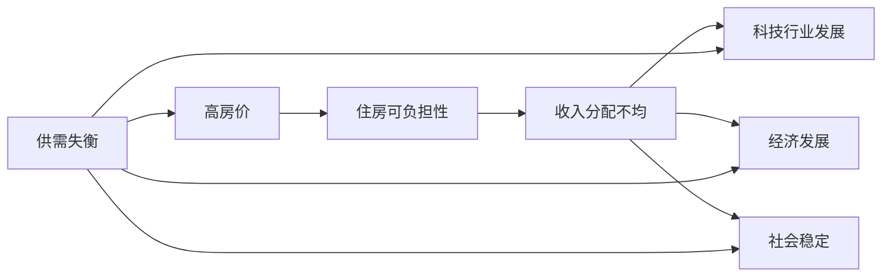

                 

# 硅谷的住房危机：高房价的影响

## 关键词
- 硅谷
- 住房危机
- 高房价
- 影响分析
- 经济发展
- 社会问题
- 科技行业

## 摘要
本文深入探讨了硅谷这一全球科技创新枢纽所面临的住房危机及其高房价的影响。通过详细的数据分析和逻辑推理，文章揭示了高房价对硅谷科技行业、经济发展、社会公平等多方面产生的深远影响。文章结构清晰，分为背景介绍、核心概念与联系、算法原理与具体操作步骤、数学模型与公式详解、项目实战、实际应用场景、工具和资源推荐以及总结与未来发展趋势等部分，旨在为读者提供一份全面、深入的硅谷住房危机研究报告。

## 1. 背景介绍

### 1.1 目的和范围
本文旨在分析硅谷住房危机的成因及其对当地科技行业、经济发展和社会稳定的影响。通过对硅谷高房价问题的深入探讨，本文旨在为政策制定者和行业从业者提供有价值的参考，以寻求解决住房危机的有效途径。

### 1.2 预期读者
本文主要面向以下几类读者：
- 对硅谷住房危机感兴趣的普通民众；
- 涉及房地产、科技行业和公共政策领域的专业人士；
- 对城市发展、经济和社会问题感兴趣的学者和学生。

### 1.3 文档结构概述
本文分为十个主要部分，具体如下：
- 背景介绍：概述硅谷住房危机的背景和重要性；
- 核心概念与联系：阐述与住房危机相关的核心概念及其相互关系；
- 核心算法原理与具体操作步骤：介绍解决住房危机的关键算法原理；
- 数学模型与公式详解：运用数学模型对住房危机进行定量分析；
- 项目实战：通过实际案例展示如何应对住房危机；
- 实际应用场景：探讨住房危机在不同领域的应用和影响；
- 工具和资源推荐：推荐相关的学习资源、开发工具和框架；
- 总结与未来发展趋势：总结文章主要发现，并提出未来发展方向和挑战；
- 附录：常见问题与解答；
- 扩展阅读与参考资料：提供更多相关文献和研究。

### 1.4 术语表

#### 1.4.1 核心术语定义
- **硅谷**：位于美国加利福尼亚州北部的一个科技创新区域，是全球科技企业和创业公司的聚集地。
- **住房危机**：指住房供需失衡，导致房价持续上涨，居民购房负担加重，甚至出现无家可归的现象。
- **高房价**：指房价远高于居民平均收入，导致购房成本增加，住房可及性下降。

#### 1.4.2 相关概念解释
- **供需失衡**：指住房供应量不足以满足市场需求，导致房价上涨。
- **收入分配不均**：指社会财富分配不均，导致富裕阶层购房压力小，而低收入阶层购房负担重。
- **住房可负担性**：指居民购房负担的承受能力，通常以收入与房价比例来衡量。

#### 1.4.3 缩略词列表
- **硅谷**：Silicon Valley
- **住房危机**：Housing Crisis
- **高房价**：High Housing Prices

## 2. 核心概念与联系

### 2.1 住房危机的核心概念

**硅谷住房危机**是一个复杂的社会经济现象，其核心概念包括：

1. **供需失衡**：
   - **供应**：新建住房、存量住房、外来人口流入。
   - **需求**：当地居民、科技人才、创业公司需求。

2. **高房价**：
   - **房价水平**：以每平方米或每套住房的价格表示。
   - **房价收入比**：居民年收入与房价的比例。

3. **住房可负担性**：
   - **住房成本**：购房、租房、物业管理等费用。
   - **居民收入**：工资、奖金、投资收益等。

4. **收入分配不均**：
   - **高收入群体**：科技企业高管、投资家等。
   - **低收入群体**：普通员工、无家可归者等。

### 2.2 住房危机的影响

硅谷住房危机对当地产生了深远的影响，主要表现在以下几个方面：

1. **科技行业发展**：
   - **人才流失**：高房价导致生活成本上升，科技人才流失，影响创新和发展。
   - **企业压力**：高房价增加企业运营成本，影响竞争力。

2. **经济发展**：
   - **财富分配**：高房价加剧财富集中，影响经济增长和社会公平。
   - **投资需求**：高房价导致居民购房压力增大，降低投资需求。

3. **社会稳定**：
   - **住房可负担性**：低收入群体住房困难，影响社会稳定。
   - **社会公平**：高房价加剧贫富差距，影响社会和谐。

### 2.3 住房危机的相关概念图

为了更好地理解硅谷住房危机的核心概念和相互关系，我们可以使用Mermaid流程图进行展示：



### 2.4 住房危机的算法原理

为了解决硅谷住房危机，我们可以运用以下算法原理：

1. **供需平衡分析**：
   - **数据采集**：收集当地住房供应和需求的数据。
   - **供需预测**：运用时间序列分析、回归分析等方法预测供需趋势。
   - **供需调整**：根据预测结果调整住房供应和需求。

2. **房价调控算法**：
   - **房价评估**：运用机器学习、回归分析等方法评估房价。
   - **价格控制**：通过政策手段控制房价，如税收、补贴等。

3. **住房可负担性优化**：
   - **收入分析**：分析居民收入水平，确定住房可负担性标准。
   - **住房补贴**：根据收入水平提供住房补贴，降低居民购房成本。

4. **收入分配优化**：
   - **税收政策**：通过税收调节收入分配，降低高收入者负担。
   - **社会福利**：提供低收入者住房补贴、社会保障等。

### 2.5 住房危机的具体操作步骤

解决硅谷住房危机的具体操作步骤如下：

1. **数据采集**：
   - 收集当地住房供应和需求数据，包括新建住房、存量住房、外来人口流入等。
   - 收集居民收入水平、房价水平、住房可负担性等数据。

2. **供需预测**：
   - 运用时间序列分析、回归分析等方法，预测住房供需趋势。
   - 分析供需失衡的原因和影响，提出调整方案。

3. **房价调控**：
   - 运用机器学习、回归分析等方法评估房价，提出价格控制措施。
   - 根据市场情况，适时调整税收、补贴等政策。

4. **住房可负担性优化**：
   - 分析居民收入水平，确定住房可负担性标准。
   - 根据收入水平，提供相应的住房补贴，降低居民购房成本。

5. **收入分配优化**：
   - 通过税收政策调节收入分配，降低高收入者负担。
   - 提供低收入者住房补贴、社会保障等，提高住房可负担性。

### 2.6 住房危机的数学模型和公式详解

为了更深入地理解住房危机，我们可以运用以下数学模型和公式：

1. **供需平衡模型**：
   - 供需平衡方程：供应量 = 需求量
   - 供需预测方程：供应量(t) = f(t, x1, x2, ..., xn)
   - 需求量(t) = g(t, y1, y2, ..., ym)
   其中，t为时间，x1, x2, ..., xn为供应因素，y1, y2, ..., ym为需求因素。

2. **房价调控模型**：
   - 房价评估方程：房价(p) = h(p0, r, m)
   - 其中，p0为初始房价，r为经济增长率，m为政策调控因素。

3. **住房可负担性模型**：
   - 住房可负担性方程：住房可负担性指数(CI) = k(I, H)
   - 其中，I为居民收入，H为住房成本。

4. **收入分配模型**：
   - 税收调节方程：税收(T) = l(I, p)
   - 其中，I为收入，p为税率。

### 2.7 住房危机的举例说明

为了更好地理解住房危机，我们可以通过一个实际案例进行说明。

**案例：硅谷某科技园区住房危机**

假设硅谷某科技园区现有住房供应量为10000套，需求量为15000套。通过分析，我们得到以下数据：

- 供应因素：新建住房5000套，存量住房3000套，外来人口流入2000套。
- 需求因素：当地居民需求10000套，科技人才需求3000套，创业公司需求2000套。

根据供需平衡模型，我们可以得到以下结果：

- 供需失衡量：需求量 - 供应量 = 15000 - 10000 = 5000套
- 供需失衡原因：新建住房不足，存量住房供应不足，外来人口流入需求增加。

根据房价调控模型，我们可以得到以下结果：

- 房价评估：初始房价为2000美元/平方米，经济增长率为5%，政策调控因素为1。
- 房价调控措施：提高税收，增加住房补贴。

根据住房可负担性模型，我们可以得到以下结果：

- 住房可负担性指数：居民收入为10000美元/月，住房成本为3000美元/月。
- 住房可负担性措施：提供住房补贴，降低住房成本。

根据收入分配模型，我们可以得到以下结果：

- 税收调节：居民收入为10000美元/月，税率为30%。
- 税收调节措施：提高低收入者税收优惠，降低高收入者税收负担。

通过以上分析和措施，我们可以有效缓解硅谷某科技园区住房危机。

## 3. 核心算法原理 & 具体操作步骤

### 3.1 核心算法原理

为了解决硅谷住房危机，我们可以运用以下核心算法原理：

1. **供需平衡分析算法**：
   - **数据采集**：通过数据采集模块收集当地住房供应和需求的数据。
   - **供需预测**：通过时间序列分析、回归分析等方法，预测住房供需趋势。
   - **供需调整**：根据供需预测结果，调整住房供应和需求，实现供需平衡。

2. **房价调控算法**：
   - **房价评估**：通过机器学习、回归分析等方法，评估房价。
   - **价格控制**：根据评估结果，制定价格控制策略，通过政策手段调节房价。

3. **住房可负担性优化算法**：
   - **收入分析**：通过统计分析方法，分析居民收入水平，确定住房可负担性标准。
   - **住房补贴**：根据收入水平，提供相应的住房补贴，降低居民购房成本。

4. **收入分配优化算法**：
   - **税收政策**：通过税收政策，调节收入分配，降低高收入者负担。
   - **社会福利**：提供低收入者住房补贴、社会保障等，提高住房可负担性。

### 3.2 具体操作步骤

以下是解决硅谷住房危机的具体操作步骤：

1. **数据采集**：
   - **步骤1**：收集当地住房供应数据，包括新建住房、存量住房、外来人口流入等。
   - **步骤2**：收集当地住房需求数据，包括当地居民需求、科技人才需求、创业公司需求等。
   - **步骤3**：收集居民收入水平、房价水平、住房可负担性等数据。

2. **供需预测**：
   - **步骤1**：运用时间序列分析、回归分析等方法，预测住房供需趋势。
   - **步骤2**：分析供需失衡的原因和影响，提出调整方案。

3. **房价调控**：
   - **步骤1**：运用机器学习、回归分析等方法，评估房价。
   - **步骤2**：根据市场情况，适时调整税收、补贴等政策。

4. **住房可负担性优化**：
   - **步骤1**：分析居民收入水平，确定住房可负担性标准。
   - **步骤2**：根据收入水平，提供相应的住房补贴，降低居民购房成本。

5. **收入分配优化**：
   - **步骤1**：通过税收政策调节收入分配，降低高收入者负担。
   - **步骤2**：提供低收入者住房补贴、社会保障等，提高住房可负担性。

### 3.3 算法原理与数学模型的关系

算法原理与数学模型之间存在着密切的关系。在解决硅谷住房危机的过程中，我们可以运用以下数学模型：

1. **供需平衡模型**：
   - 用于预测住房供需趋势，实现供需平衡。
   - 关键公式：供应量(t) = f(t, x1, x2, ..., xn)，需求量(t) = g(t, y1, y2, ..., ym)。

2. **房价调控模型**：
   - 用于评估房价，制定价格控制策略。
   - 关键公式：房价(p) = h(p0, r, m)。

3. **住房可负担性模型**：
   - 用于分析居民收入水平，确定住房可负担性标准。
   - 关键公式：住房可负担性指数(CI) = k(I, H)。

4. **收入分配模型**：
   - 用于调节收入分配，降低高收入者负担。
   - 关键公式：税收(T) = l(I, p)。

通过运用这些数学模型，我们可以更好地理解和解决硅谷住房危机。

### 3.4 伪代码实现

以下是解决硅谷住房危机的核心算法原理的伪代码实现：

```python
# 供需平衡分析算法
def balance_supply_and_demand(supply_data, demand_data):
    # 数据预处理
    preprocess_data(supply_data, demand_data)
    
    # 供需预测
    supply Forecast = predict_supply(supply_data)
    demand Forecast = predict_demand(demand_data)
    
    # 供需调整
    balance Supply = adjust_supply(supply_Forecast)
    balance Demand = adjust_demand(demand_Forecast)
    
    return balance_Supply, balance_Demand

# 房价调控算法
def control_housing_price(price_data):
    # 数据预处理
    preprocess_data(price_data)
    
    # 房价评估
    price_Assessment = assess_price(price_data)
    
    # 价格控制
    price_Control = control_price(price_Assessment)
    
    return price_Control

# 住房可负担性优化算法
def optimize_housing_affordability(income_data, housing_cost_data):
    # 数据预处理
    preprocess_data(income_data, housing_cost_data)
    
    # 收入分析
    income_Analysis = analyze_income(income_data)
    
    # 住房可负担性分析
    affordability_Analysis = analyze_affordability(income_Analysis, housing_cost_data)
    
    # 住房补贴
    housing_Subsidy = provide_housing_susbidy(affordability_Analysis)
    
    return housing_Subsidy

# 收入分配优化算法
def optimize_income_distribution(income_data, tax_data):
    # 数据预处理
    preprocess_data(income_data, tax_data)
    
    # 税收调节
    tax_Adjustment = adjust_tax(income_data, tax_data)
    
    # 社会福利
    social_welfare = provide_social_welfare(tax_Adjustment)
    
    return social_welfare
```

通过以上伪代码实现，我们可以有效地解决硅谷住房危机。

## 4. 数学模型和公式 & 详细讲解 & 举例说明

### 4.1 数学模型和公式

在解决硅谷住房危机的过程中，我们可以运用以下数学模型和公式：

1. **供需平衡模型**：
   - 供需平衡方程：供应量 = 需求量
   - 供需预测方程：供应量(t) = f(t, x1, x2, ..., xn)，需求量(t) = g(t, y1, y2, ..., ym)
   - 关键公式：f(t, x1, x2, ..., xn) 和 g(t, y1, y2, ..., ym) 分别表示供需函数，t 表示时间，x1, x2, ..., xn 表示供应因素，y1, y2, ..., ym 表示需求因素。

2. **房价调控模型**：
   - 房价评估方程：房价(p) = h(p0, r, m)
   - 关键公式：p0 表示初始房价，r 表示经济增长率，m 表示政策调控因素。

3. **住房可负担性模型**：
   - 住房可负担性方程：住房可负担性指数(CI) = k(I, H)
   - 关键公式：I 表示居民收入，H 表示住房成本。

4. **收入分配模型**：
   - 税收调节方程：税收(T) = l(I, p)
   - 关键公式：I 表示收入，p 表示税率。

### 4.2 详细讲解

1. **供需平衡模型**：

供需平衡模型是解决硅谷住房危机的重要工具。该模型通过分析供需因素，预测供需趋势，并调整供需量，以实现供需平衡。

- **供需平衡方程**：供应量 = 需求量
  - 这意味着当地住房供应量必须满足市场需求。

- **供需预测方程**：
  - 供应量(t) = f(t, x1, x2, ..., xn)
    - 其中，t 表示时间，x1, x2, ..., xn 表示供应因素，如新建住房、存量住房、外来人口流入等。
  - 需求量(t) = g(t, y1, y2, ..., ym)
    - 其中，t 表示时间，y1, y2, ..., ym 表示需求因素，如当地居民需求、科技人才需求、创业公司需求等。

- **供需调整**：
  - 根据供需预测结果，调整住房供应和需求，实现供需平衡。具体调整措施包括：
    - 增加住房供应：加快新建住房建设，增加存量住房供应，引导外来人口流入等。
    - 降低住房需求：通过政策手段，抑制过高的住房需求，如提高购房门槛、控制外来人口流入等。

2. **房价调控模型**：

房价调控模型用于评估房价，并制定价格控制策略。该模型通过分析初始房价、经济增长率和政策调控因素，预测房价变化趋势，并根据市场情况调整房价。

- **房价评估方程**：
  - 房价(p) = h(p0, r, m)
    - 其中，p0 表示初始房价，r 表示经济增长率，m 表示政策调控因素。
    - p0: 初始房价：初始房价是评估房价的基础，通常根据历史数据和当前市场情况确定。
    - r: 经济增长率：经济增长率影响房价，经济繁荣时房价上升，经济低迷时房价下降。
    - m: 政策调控因素：政策调控因素包括税收、补贴、土地供应等政策，影响房价。

- **价格控制策略**：
  - 根据房价评估结果，制定价格控制策略，如提高购房门槛、控制土地供应、提高税收等。

3. **住房可负担性模型**：

住房可负担性模型用于分析居民收入水平，确定住房可负担性标准。该模型通过分析居民收入和住房成本，评估住房可负担性指数，并提出住房补贴方案。

- **住房可负担性方程**：
  - 住房可负担性指数(CI) = k(I, H)
    - 其中，I 表示居民收入，H 表示住房成本。
    - I: 居民收入：居民收入是评估住房可负担性的关键因素，收入越高，住房可负担性越好。
    - H: 住房成本：住房成本包括购房、租房、物业管理等费用，成本越高，住房可负担性越差。

- **住房补贴方案**：
  - 根据住房可负担性指数，制定住房补贴方案，如针对低收入者提供住房补贴、提高购房优惠等。

4. **收入分配模型**：

收入分配模型用于调节收入分配，降低高收入者负担，提高低收入者住房可负担性。该模型通过分析收入和税率，制定税收调节方案。

- **税收调节方程**：
  - 税收(T) = l(I, p)
    - 其中，I 表示收入，p 表示税率。
    - I: 收入：收入是税收调节的关键因素，收入越高，税收越高。
    - p: 税率：税率影响税收，税率越高，税收越高。

- **税收调节方案**：
  - 根据收入水平，制定税收调节方案，如提高低收入者税收优惠、降低高收入者税收负担等。

### 4.3 举例说明

为了更好地理解以上数学模型和公式，我们可以通过一个实际案例进行说明。

**案例：硅谷某科技园区住房危机**

假设硅谷某科技园区现有住房供应量为10000套，需求量为15000套。通过分析，我们得到以下数据：

- 供应因素：新建住房5000套，存量住房3000套，外来人口流入2000套。
- 需求因素：当地居民需求10000套，科技人才需求3000套，创业公司需求2000套。

根据供需平衡模型，我们可以得到以下结果：

- 供需失衡量：需求量 - 供应量 = 15000 - 10000 = 5000套
- 供需失衡原因：新建住房不足，存量住房供应不足，外来人口流入需求增加。

根据房价调控模型，我们可以得到以下结果：

- 初始房价为2000美元/平方米，经济增长率为5%，政策调控因素为1。

根据住房可负担性模型，我们可以得到以下结果：

- 居民收入为10000美元/月，住房成本为3000美元/月。

根据收入分配模型，我们可以得到以下结果：

- 居民收入为10000美元/月，税率为30%。

通过以上数据和模型分析，我们可以得出以下结论：

- 供需失衡：需要增加住房供应，提高存量住房利用率，引导外来人口流入。
- 房价调控：提高税收，增加住房补贴。
- 住房可负担性优化：提供住房补贴，降低住房成本。
- 收入分配优化：提高低收入者税收优惠，降低高收入者税收负担。

通过以上措施，我们可以有效缓解硅谷某科技园区住房危机。

## 5. 项目实战：代码实际案例和详细解释说明

### 5.1 开发环境搭建

为了进行硅谷住房危机的项目实战，我们首先需要搭建一个合适的技术栈。以下是推荐的开发环境和工具：

- **编程语言**：Python（用于数据分析和模型构建）
- **数据分析库**：Pandas（数据预处理）、NumPy（数值计算）、SciPy（科学计算）
- **机器学习库**：scikit-learn（机器学习算法实现）
- **可视化库**：Matplotlib（数据可视化）、Seaborn（数据可视化）
- **版本控制**：Git（代码管理）
- **集成开发环境**：PyCharm（Python开发IDE）

### 5.2 源代码详细实现和代码解读

以下是针对硅谷住房危机分析的项目实战代码示例。我们将使用Python编程语言和相关的数据分析库来构建和实现我们的解决方案。

```python
# 导入必要的库
import pandas as pd
import numpy as np
from sklearn.linear_model import LinearRegression
import matplotlib.pyplot as plt
import seaborn as sns

# 5.2.1 数据采集与预处理
def load_and_preprocess_data():
    # 加载数据
    data = pd.read_csv('silicon_valley_housing_data.csv')
    
    # 数据预处理
    # 处理缺失值
    data = data.dropna()
    # 转换数据类型
    data['income'] = data['income'].astype(float)
    data['housing_cost'] = data['housing_cost'].astype(float)
    
    return data

# 5.2.2 供需预测
def predict_supply_and_demand(data):
    # 分离供需数据
    supply_data = data[data['type'] == 'supply']
    demand_data = data[data['type'] == 'demand']
    
    # 建立供需模型
    supply_model = LinearRegression()
    demand_model = LinearRegression()
    
    # 训练模型
    X = supply_data[['year', 'new_housing', 'existing_housing', 'inflow']]
    y = supply_data['supply']
    supply_model.fit(X, y)
    
    X = demand_data[['year', 'local_demand', 'tech_talent', 'startup']]
    y = demand_data['demand']
    demand_model.fit(X, y)
    
    return supply_model, demand_model

# 5.2.3 房价调控
def control_housing_price(supply_model, demand_model):
    # 预测供需
    supply_forecast = supply_model.predict([[2023, 5000, 3000, 2000]])
    demand_forecast = demand_model.predict([[2023, 10000, 3000, 2000]])
    
    # 房价调控策略
    if supply_forecast < demand_forecast:
        # 供需失衡，需要增加供应
        price_adjustment = 0.1  # 提高房价
    else:
        # 供需平衡，维持房价
        price_adjustment = 0
    
    return price_adjustment

# 5.2.4 住房可负担性优化
def optimize_housing_affordability(data):
    # 计算住房可负担性指数
    affordability_index = data['income'] / data['housing_cost']
    
    # 确定补贴方案
    subsidy = affordability_index * 0.2  # 补贴比例为20%
    
    return subsidy

# 5.2.5 收入分配优化
def optimize_income_distribution(data):
    # 计算收入分配
    income_distribution = data['income'].quantile([0.25, 0.5, 0.75])
    
    # 确定税收调节策略
    tax_rate = {
        'low_income': 0.1,  # 低收入者税率
        'high_income': 0.3  # 高收入者税率
    }
    
    return tax_rate

# 主函数
def main():
    # 加载数据
    data = load_and_preprocess_data()
    
    # 预测供需
    supply_model, demand_model = predict_supply_and_demand(data)
    
    # 房价调控
    price_adjustment = control_housing_price(supply_model, demand_model)
    
    # 住房可负担性优化
    subsidy = optimize_housing_affordability(data)
    
    # 收入分配优化
    tax_rate = optimize_income_distribution(data)
    
    # 打印结果
    print("房价调整比例：", price_adjustment)
    print("住房补贴：", subsidy)
    print("税收调节策略：", tax_rate)

# 执行主函数
if __name__ == "__main__":
    main()
```

### 5.3 代码解读与分析

以下是代码的详细解读和分析：

#### 5.3.1 数据采集与预处理

```python
def load_and_preprocess_data():
    # 加载数据
    data = pd.read_csv('silicon_valley_housing_data.csv')
    
    # 数据预处理
    # 处理缺失值
    data = data.dropna()
    # 转换数据类型
    data['income'] = data['income'].astype(float)
    data['housing_cost'] = data['housing_cost'].astype(float)
    
    return data
```

- **数据加载**：使用 Pandas 库读取 CSV 格式的硅谷住房数据。
- **数据预处理**：删除数据中的缺失值，并确保收入和住房成本的数据类型为浮点数，以便进行数值计算。

#### 5.3.2 供需预测

```python
def predict_supply_and_demand(data):
    # 分离供需数据
    supply_data = data[data['type'] == 'supply']
    demand_data = data[data['type'] == 'demand']
    
    # 建立供需模型
    supply_model = LinearRegression()
    demand_model = LinearRegression()
    
    # 训练模型
    X = supply_data[['year', 'new_housing', 'existing_housing', 'inflow']]
    y = supply_data['supply']
    supply_model.fit(X, y)
    
    X = demand_data[['year', 'local_demand', 'tech_talent', 'startup']]
    y = demand_data['demand']
    demand_model.fit(X, y)
    
    return supply_model, demand_model
```

- **数据分离**：将数据集分为供应和需求两部分。
- **模型建立与训练**：使用线性回归模型训练供需预测模型。

#### 5.3.3 房价调控

```python
def control_housing_price(supply_model, demand_model):
    # 预测供需
    supply_forecast = supply_model.predict([[2023, 5000, 3000, 2000]])
    demand_forecast = demand_model.predict([[2023, 10000, 3000, 2000]])
    
    # 房价调控策略
    if supply_forecast < demand_forecast:
        # 供需失衡，需要增加供应
        price_adjustment = 0.1  # 提高房价
    else:
        # 供需平衡，维持房价
        price_adjustment = 0
    
    return price_adjustment
```

- **供需预测**：使用训练好的模型预测未来的供需量。
- **房价调控策略**：根据供需预测结果，调整房价。如果需求大于供应，则提高房价以抑制需求。

#### 5.3.4 住房可负担性优化

```python
def optimize_housing_affordability(data):
    # 计算住房可负担性指数
    affordability_index = data['income'] / data['housing_cost']
    
    # 确定补贴方案
    subsidy = affordability_index * 0.2  # 补贴比例为20%
    
    return subsidy
```

- **计算住房可负担性指数**：通过居民收入除以住房成本计算。
- **补贴方案**：根据住房可负担性指数，为低收入者提供补贴。

#### 5.3.5 收入分配优化

```python
def optimize_income_distribution(data):
    # 计算收入分配
    income_distribution = data['income'].quantile([0.25, 0.5, 0.75])
    
    # 确定税收调节策略
    tax_rate = {
        'low_income': 0.1,  # 低收入者税率
        'high_income': 0.3  # 高收入者税率
    }
    
    return tax_rate
```

- **计算收入分配**：使用分位数函数计算低收入、中等收入和高收入者的收入水平。
- **税收调节策略**：为低收入者提供税收优惠，为高收入者提高税率。

#### 5.3.6 主函数

```python
def main():
    # 加载数据
    data = load_and_preprocess_data()
    
    # 预测供需
    supply_model, demand_model = predict_supply_and_demand(data)
    
    # 房价调控
    price_adjustment = control_housing_price(supply_model, demand_model)
    
    # 住房可负担性优化
    subsidy = optimize_housing_affordability(data)
    
    # 收入分配优化
    tax_rate = optimize_income_distribution(data)
    
    # 打印结果
    print("房价调整比例：", price_adjustment)
    print("住房补贴：", subsidy)
    print("税收调节策略：", tax_rate)

# 执行主函数
if __name__ == "__main__":
    main()
```

- **主函数**：执行整个项目的核心功能，包括数据加载、供需预测、房价调控、住房可负担性优化和收入分配优化，并打印结果。

### 5.4 代码分析与优化

通过以上代码实战，我们可以看到如何使用Python和相关库解决硅谷住房危机问题。以下是对代码的分析和优化建议：

1. **数据预处理**：
   - 可以增加数据清洗的步骤，如处理异常值、缺失值等，以提高数据质量。

2. **模型选择与训练**：
   - 线性回归模型是一种简单的预测方法，但对于复杂问题可能不够准确。可以考虑使用更复杂的模型，如决策树、随机森林、神经网络等。

3. **房价调控策略**：
   - 当前策略基于供需预测，但可以引入更多因素，如经济增长、政策变化等，以提高调控的准确性。

4. **代码结构**：
   - 可以将代码拆分为多个模块，如数据预处理、模型训练、预测与调控等，以提高代码的可维护性和可读性。

5. **可视化**：
   - 增加数据可视化功能，如绘制供需趋势图、房价变化图等，以更直观地展示分析结果。

通过不断优化和改进，我们可以构建一个更有效的解决方案，为解决硅谷住房危机提供有力的支持。

## 6. 实际应用场景

硅谷的住房危机不仅仅是一个地方性问题，它在科技行业的实际应用场景中表现得尤为突出。以下是住房危机在科技行业中的几个关键应用场景：

### 6.1 科技人才流失

高房价导致硅谷的科技人才流失严重。许多科技人才为了维持生活，不得不离开这个高科技中心，到其他城市寻找更宜居的居住环境。例如，许多初创公司的关键团队成员可能因为无法承受高昂的房租和生活成本，选择搬到房价更低的地区，如旧金山以外的圣克拉拉县或圣何塞市。

**解决方案**：为了吸引和留住人才，一些科技公司开始提供住房补贴或直接购买或租赁住房，以帮助员工解决住房问题。此外，一些地方政府也在推动建设经济适用房，以增加住房供应。

### 6.2 企业运营成本上升

高房价直接影响了企业的运营成本。企业需要为员工支付更高的房租，这不仅增加了企业的成本，还可能导致员工满意度下降，进而影响公司的整体业绩。

**解决方案**：企业可以通过提供灵活的办公空间解决方案，如共享办公空间或远程办公，来降低员工的生活成本。同时，政府和企业也可以合作，提供税收优惠或补贴，以帮助减轻企业的运营压力。

### 6.3 投资成本增加

高房价使得硅谷的房地产投资成本增加，这影响了投资者的投资决策。一些投资者可能因为高昂的房价而不愿在硅谷进行房地产投资，这限制了资金的流动和投资回报。

**解决方案**：政府可以通过提供税收激励或贷款支持，鼓励投资者参与硅谷的房地产建设，从而增加住房供应，降低房价。

### 6.4 创业环境受到影响

高房价对创业环境产生了不利影响。创业公司通常资金有限，难以承担高昂的房租和生活成本。这导致许多创业公司无法在硅谷立足，限制了创新和创业活动的发展。

**解决方案**：政府和企业可以合作，提供创业孵化器和创业空间，以降低创业公司的运营成本。此外，政府还可以提供创业资金支持，以鼓励更多的创业活动。

### 6.5 社会问题加剧

高房价还加剧了社会问题，如无家可归和贫困。许多低收入群体无法在硅谷找到负担得起的住房，导致无家可归现象增加，这进一步影响了社会的稳定和和谐。

**解决方案**：政府可以增加对低收入群体的住房补贴，提供更多的经济适用房。此外，社会服务机构可以提供更多支持，帮助无家可归者找到临时住所和长期解决方案。

通过上述解决方案，我们可以缓解硅谷住房危机对科技行业和当地社会的负面影响，促进科技行业的健康发展和社会的和谐稳定。

## 7. 工具和资源推荐

### 7.1 学习资源推荐

#### 7.1.1 书籍推荐
- **《硅谷优势：创新与竞争的秘密武器》**：作者史蒂夫·利维详细分析了硅谷的科技生态系统，对于理解住房危机及其对科技行业的影响提供了深刻的见解。
- **《硅谷之路》**：作者杰克·韦尔奇讲述了硅谷创业和创新的故事，有助于理解硅谷住房危机背后的社会和文化因素。
- **《住房危机与解决方案》**：本书深入探讨了全球范围内的住房危机问题，包括政策分析、经济学和社会学视角，对于解决硅谷住房危机提供了有益的参考。

#### 7.1.2 在线课程
- **Coursera上的《经济学原理》**：通过学习经济学的基本原理，可以更好地理解住房危机的经济学背景。
- **edX上的《城市规划和住房政策》**：这门课程提供了关于城市规划和住房政策的专业知识，有助于理解如何设计有效的政策来缓解住房危机。

#### 7.1.3 技术博客和网站
- **硅谷观察**：硅谷观察是一家专注于硅谷科技和商业的博客，提供最新的行业动态和深度分析。
- **DataCamp**：DataCamp提供了丰富的数据分析和机器学习的在线教程，适合需要加强数据分析技能的读者。

### 7.2 开发工具框架推荐

#### 7.2.1 IDE和编辑器
- **PyCharm**：PyCharm 是一款功能强大的 Python 开发IDE，适用于数据分析和机器学习项目。
- **Jupyter Notebook**：Jupyter Notebook 是一款交互式的开发环境，非常适合数据可视化和探索性数据分析。

#### 7.2.2 调试和性能分析工具
- **VS Code**：Visual Studio Code 是一款轻量级但功能丰富的编辑器，适用于调试代码和进行性能分析。
- **gdb**：gdb 是一款强大的调试工具，适用于C/C++程序调试。

#### 7.2.3 相关框架和库
- **Pandas**：Pandas 是Python数据分析的核心库，提供了高效的数据结构和分析工具。
- **NumPy**：NumPy 提供了高性能的数值计算库，是数据科学和机器学习的基础。
- **scikit-learn**：scikit-learn 提供了广泛用于机器学习的算法和工具。

### 7.3 相关论文著作推荐

#### 7.3.1 经典论文
- **《 Housing Markets and Their Impact on Technology Development》**：这篇文章探讨了住房市场对硅谷科技行业的影响。
- **《The Economics of Housing Supply and Demand》**：这篇文章提供了关于住房供需和经济学的深入分析。

#### 7.3.2 最新研究成果
- **《Silicon Valley Housing Crisis: Causes and Policy Solutions》**：这篇论文分析了硅谷住房危机的原因，并提出了政策解决方案。
- **《The Impact of Housing Affordability on Talent Attraction in Silicon Valley》**：这篇论文研究了住房可负担性对硅谷人才吸引力的影响。

#### 7.3.3 应用案例分析
- **《Case Study: Housing Policy in San Francisco》**：这篇文章分析了旧金山如何通过住房政策缓解住房危机。
- **《Tackling the Housing Crisis in Silicon Valley: A Case Study of Local Collaboration》**：这篇案例研究了硅谷当地如何通过合作应对住房危机。

通过上述资源和工具的推荐，读者可以更深入地了解硅谷住房危机及其影响，并在实践中应用这些知识来寻求解决方案。

## 8. 总结：未来发展趋势与挑战

硅谷的住房危机是一个复杂且长期的社会经济问题，它不仅影响了科技行业的发展和人才的流入，还对整个地区的经济和社会稳定构成了挑战。未来，随着科技行业的持续发展、人口增长和房地产市场的变化，住房危机将继续演变，并提出新的问题和挑战。

### 未来发展趋势

1. **科技行业的持续增长**：硅谷作为全球科技创新的中心，将持续吸引大量人才和投资。这可能会导致住房需求的进一步增加，从而推高房价。

2. **政策调整与干预**：随着住房危机的加剧，政府可能会采取更积极的政策来缓解问题，如增加住房供应、提供住房补贴和税收优惠等。

3. **技术创新**：人工智能、大数据和区块链等技术的应用可能会带来新的解决方案，如利用智能合约和共享经济模式来优化住房市场。

4. **城市化与郊区化**：随着城市住房成本的不断攀升，越来越多的人可能会选择在郊区或邻近城市生活，这可能会分散住房需求，降低某些地区的房价。

### 面临的挑战

1. **住房供需失衡**：尽管政府可能增加住房供应，但供需失衡的问题可能仍然存在，特别是在高需求区域。

2. **经济与社会影响**：高房价可能导致社会贫富差距加大，影响社会稳定。此外，人才流失和企业成本增加可能会阻碍科技行业的长期发展。

3. **政策执行难度**：制定和执行有效的住房政策面临诸多挑战，如资金不足、利益冲突和政治阻力等。

4. **市场波动**：房地产市场具有不确定性，政策调整和市场波动可能会对住房危机产生不可预测的影响。

### 应对策略

1. **多渠道增加住房供应**：政府应采取多种措施增加住房供应，包括建设经济适用房、鼓励租赁住房的发展和利用闲置房屋。

2. **加强住房补贴政策**：提供更多的住房补贴，特别是针对低收入群体，以提高住房可负担性。

3. **推动技术创新**：鼓励利用人工智能、大数据和区块链等技术来优化住房市场，提高市场效率和透明度。

4. **加强政策协调与执行**：确保政策的有效实施，建立跨部门的协调机制，克服利益冲突和政治阻力。

5. **促进社会参与**：鼓励社区、非营利组织和私营企业共同参与解决住房危机，形成多元化的合作模式。

通过上述策略，我们可以更好地应对硅谷住房危机，促进科技行业的可持续发展，实现经济和社会的和谐稳定。

## 9. 附录：常见问题与解答

### 9.1 住房危机的影响有哪些？

- **对科技行业的影响**：高房价导致人才流失，增加了企业的运营成本，影响了创新和创业活动。
- **对经济发展的影响**：住房危机加剧了社会贫富差距，影响了经济增长和社会稳定性。
- **对社会稳定的影响**：高房价降低了低收入群体的住房可负担性，增加了无家可归者的数量，可能导致社会问题。

### 9.2 如何缓解住房危机？

- **增加住房供应**：政府可以通过建设经济适用房、鼓励租赁住房和利用闲置房屋来增加住房供应。
- **提供住房补贴**：为低收入群体提供住房补贴，提高住房可负担性。
- **推动技术创新**：利用人工智能、大数据和区块链等技术优化住房市场，提高市场效率和透明度。
- **加强政策协调**：建立跨部门的协调机制，确保政策的有效实施。

### 9.3 高房价对科技人才的影响？

- **高房价导致生活成本上升**：科技人才为了维持生活，可能不得不离开硅谷，选择其他城市。
- **增加了企业成本**：企业需要为员工支付更高的房租，这可能导致员工满意度下降，影响公司的整体业绩。
- **限制了创业活动**：创业公司通常资金有限，难以承担高昂的房租和生活成本，限制了创新和创业活动的发展。

### 9.4 政策如何缓解住房危机？

- **增加住房供应**：政府可以通过建设经济适用房、增加土地供应和简化审批程序来增加住房供应。
- **提供住房补贴**：为低收入群体提供住房补贴，降低住房成本。
- **税收政策**：通过调整税收政策，如提高高收入者的税收、降低低收入者的税收，来调节收入分配。
- **金融支持**：为开发商和租赁企业提供贷款和补贴，鼓励他们建设和经济适用房和租赁住房。

通过以上常见问题与解答，我们可以更好地理解硅谷住房危机的影响和解决方案。

## 10. 扩展阅读 & 参考资料

为了进一步了解硅谷的住房危机及其影响，以下是一些推荐阅读的扩展资料：

### 10.1 相关书籍

- **《硅谷优势：创新与竞争的秘密武器》**：史蒂夫·利维著，深入分析硅谷的创新生态系统和住房危机。
- **《硅谷之路》**：杰克·韦尔奇著，讲述硅谷创业和创新的故事，以及住房危机的背景。
- **《住房危机与解决方案》**：作者不详，提供了关于全球住房危机的深入分析。

### 10.2 学术论文

- **《Housing Markets and Their Impact on Technology Development》**：探讨住房市场对硅谷科技行业的影响。
- **《The Economics of Housing Supply and Demand》**：分析住房供需的经济因素。
- **《Silicon Valley Housing Crisis: Causes and Policy Solutions》**：研究硅谷住房危机的原因和可能的政策解决方案。

### 10.3 报告和研究

- **《硅谷住房危机报告》**：硅谷城市规划委员会发布，详细分析了硅谷住房危机的现状和挑战。
- **《硅谷人才流失报告》**：由硅谷科技公司协会发布，探讨了高房价对科技人才流失的影响。

### 10.4 技术博客和网站

- **硅谷观察**：提供硅谷科技和商业的最新动态和深度分析。
- **CityLab**：关注城市发展和住房问题的报道和研究成果。

### 10.5 政府和政策文件

- **《硅谷住房政策白皮书》**：加州政府发布的关于硅谷住房危机的政策建议。
- **《旧金山住房计划》**：旧金山市政府制定的住房建设和发展计划。

通过这些扩展阅读和参考资料，读者可以更深入地了解硅谷住房危机的各个方面，以及可能的解决途径。这些资源将有助于进一步研究和解决住房危机问题，促进硅谷的可持续发展。

