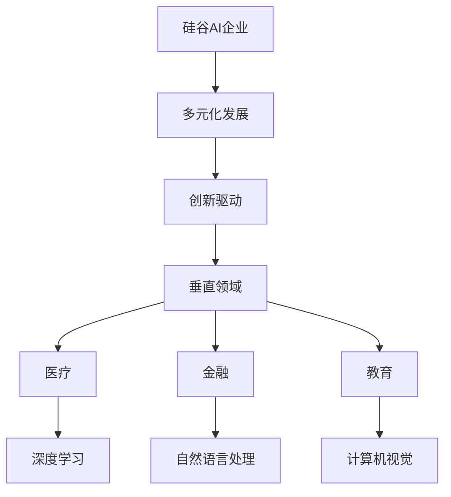

                 

# 硅谷的多元化发展：AI企业创新，探索垂直领域独特价值

> 关键词：硅谷、多元化、AI企业、创新、垂直领域、独特价值

> 摘要：本文深入探讨了硅谷地区的AI企业在多元化发展中所展现的创新能力和在垂直领域的独特价值。通过分析硅谷的AI企业生态、创新驱动因素以及成功案例，本文揭示了硅谷在AI领域持续引领全球的秘诀，并对未来发展趋势与挑战进行了展望。

## 1. 背景介绍

### 1.1 目的和范围

本文旨在探讨硅谷地区AI企业在多元化发展中的创新路径和垂直领域的独特价值。通过分析硅谷的AI企业生态、创新驱动因素以及成功案例，本文旨在为读者提供对硅谷AI企业多元化发展的全面理解，并揭示其持续引领全球的秘诀。

### 1.2 预期读者

本文适合以下读者群体：

- 对人工智能和硅谷感兴趣的技术人员
- AI企业决策者和创业者
- 对科技创新和商业模式有兴趣的投资者
- 需要对硅谷AI企业发展有深入理解的行业分析师

### 1.3 文档结构概述

本文分为以下几个部分：

- 背景介绍：介绍本文的目的、范围和预期读者。
- 核心概念与联系：阐述AI和垂直领域相关的核心概念和联系。
- 核心算法原理 & 具体操作步骤：分析AI在垂直领域的核心算法原理和操作步骤。
- 数学模型和公式 & 详细讲解 & 举例说明：介绍与AI应用相关的数学模型和公式，并给出具体实例。
- 项目实战：通过实际案例展示AI在垂直领域的应用。
- 实际应用场景：分析AI在垂直领域的实际应用场景。
- 工具和资源推荐：推荐学习资源和开发工具。
- 总结：对AI在硅谷的多元化发展趋势与挑战进行总结。
- 附录：常见问题与解答。
- 扩展阅读 & 参考资料：提供进一步的阅读资料。

### 1.4 术语表

#### 1.4.1 核心术语定义

- 硅谷：位于美国加利福尼亚州旧金山湾区的地区，是全球科技创新和创业的重要中心。
- AI企业：专注于人工智能技术研发和商业化的企业。
- 垂直领域：指特定行业或专业领域，如医疗、金融、教育等。
- 创新驱动：指以创新为核心驱动力，推动企业发展的模式。

#### 1.4.2 相关概念解释

- 人工智能（AI）：模拟人类智能行为的计算机技术和系统。
- 深度学习：一种人工智能技术，通过多层神经网络模拟人脑学习过程。
- 机器学习：一种人工智能技术，通过数据训练模型实现智能行为。

#### 1.4.3 缩略词列表

- AI：人工智能
- ML：机器学习
- DL：深度学习
- NLP：自然语言处理
- CV：计算机视觉

## 2. 核心概念与联系

在探讨硅谷AI企业的多元化发展之前，我们需要了解一些核心概念和它们之间的联系。以下是一个Mermaid流程图，用于展示这些概念和联系：



### 2.1 硅谷AI企业多元化发展的核心概念

- **硅谷AI企业**：指位于硅谷地区，专注于人工智能技术研发和商业化的企业。这些企业通过深度学习、机器学习等技术，推动人工智能在各领域的应用。
- **多元化发展**：指企业在不同垂直领域拓展业务，通过创新驱动实现可持续发展。多元化发展有助于降低企业风险，提升市场竞争力。
- **创新驱动**：指企业以创新为核心驱动力，通过技术创新、产品创新、商业模式创新等手段，推动企业持续发展。
- **垂直领域**：指特定行业或专业领域，如医疗、金融、教育等。垂直领域的AI应用具有特定的需求和技术特点，为企业提供创新空间。

### 2.2 硅谷AI企业多元化发展的联系

硅谷AI企业的多元化发展与以下概念密切相关：

- **医疗**：AI技术在医疗领域的应用包括疾病诊断、药物研发、医疗影像分析等，深度学习和计算机视觉等技术在其中发挥了关键作用。
- **金融**：AI技术在金融领域的应用包括风险控制、智能投顾、欺诈检测等，自然语言处理和深度学习等技术有助于提高金融服务的效率和准确性。
- **教育**：AI技术在教育领域的应用包括智能教学、学习分析、在线教育等，计算机视觉和自然语言处理等技术有助于个性化教学和提升学习效果。

通过这些核心概念和联系的阐述，我们可以更好地理解硅谷AI企业的多元化发展模式，为后续内容的深入分析奠定基础。

## 3. 核心算法原理 & 具体操作步骤

在硅谷AI企业的多元化发展中，核心算法原理和具体操作步骤起到了关键作用。以下将详细分析AI技术在垂直领域中的应用，并使用伪代码解释核心算法原理。

### 3.1 深度学习在医疗领域的应用

深度学习在医疗领域具有广泛的应用，包括疾病诊断、药物研发和医疗影像分析等。以下是一个用于疾病诊断的深度学习算法的伪代码：

```python
# 用于疾病诊断的卷积神经网络（CNN）伪代码

# 数据预处理
data = preprocess_data(input_data)

# 构建卷积神经网络模型
model = build_cnn_model()

# 训练模型
model.fit(data['train'], data['train_labels'])

# 预测
predictions = model.predict(data['test'])

# 评估模型性能
accuracy = evaluate_model(predictions, data['test_labels'])
```

### 3.2 自然语言处理在金融领域的应用

自然语言处理在金融领域具有广泛的应用，包括风险控制、智能投顾和欺诈检测等。以下是一个用于风险控制的自然语言处理算法的伪代码：

```python
# 用于风险控制的自然语言处理（NLP）算法伪代码

# 数据预处理
data = preprocess_data(input_data)

# 构建NLP模型
model = build_nlp_model()

# 训练模型
model.fit(data['train'], data['train_labels'])

# 预测
predictions = model.predict(data['test'])

# 评估模型性能
accuracy = evaluate_model(predictions, data['test_labels'])
```

### 3.3 计算机视觉在教育领域的应用

计算机视觉在教育领域具有广泛的应用，包括智能教学、学习分析和在线教育等。以下是一个用于智能教学的计算机视觉算法的伪代码：

```python
# 用于智能教学的计算机视觉（CV）算法伪代码

# 数据预处理
data = preprocess_data(input_data)

# 构建计算机视觉模型
model = build_cv_model()

# 训练模型
model.fit(data['train'], data['train_labels'])

# 预测
predictions = model.predict(data['test'])

# 评估模型性能
accuracy = evaluate_model(predictions, data['test_labels'])
```

通过以上伪代码，我们可以看到深度学习、自然语言处理和计算机视觉在垂直领域的应用原理和操作步骤。这些算法和技术为硅谷AI企业在多元化发展中提供了强大的支持。

## 4. 数学模型和公式 & 详细讲解 & 举例说明

在AI技术在垂直领域的应用中，数学模型和公式起到了关键作用。以下将介绍一些常见的数学模型和公式，并给出详细讲解和举例说明。

### 4.1 卷积神经网络（CNN）的数学模型

卷积神经网络是一种常用的深度学习模型，在图像处理和计算机视觉任务中具有广泛应用。以下是一个用于图像分类的卷积神经网络（CNN）的数学模型：

```latex
\begin{equation}
    \hat{y} = \text{softmax}(\text{forward}(x; W, b))
\end{equation}
```

其中，$x$ 表示输入图像，$W$ 和 $b$ 分别表示模型权重和偏置，$\text{forward}(x; W, b)$ 表示前向传播过程，$\text{softmax}$ 函数用于将输出转换为概率分布。

### 4.2 自然语言处理（NLP）的数学模型

自然语言处理（NLP）是一种用于处理人类语言的数据科学领域，常见的数学模型包括循环神经网络（RNN）和长短时记忆网络（LSTM）。以下是一个用于情感分析的NLP模型的数学模型：

```latex
\begin{equation}
    h_t = \text{sigmoid}(W_h \cdot [h_{t-1}, x_t] + b_h)
\end{equation}
```

其中，$h_t$ 表示第 $t$ 个隐藏状态，$W_h$ 和 $b_h$ 分别表示权重和偏置，$x_t$ 表示输入文本的词向量。

### 4.3 计算机视觉（CV）的数学模型

计算机视觉（CV）是一种用于处理图像和视频数据的领域，常见的数学模型包括卷积神经网络（CNN）和生成对抗网络（GAN）。以下是一个用于图像生成的CV模型的数学模型：

```latex
\begin{equation}
    G(x) = \text{tanh}(\text{forward}(x; W_g, b_g))
\end{equation}
```

其中，$G(x)$ 表示生成的图像，$W_g$ 和 $b_g$ 分别表示模型权重和偏置，$\text{forward}(x; W_g, b_g)$ 表示前向传播过程。

### 4.4 示例说明

以下是一个情感分析任务的示例，使用自然语言处理（NLP）模型对一段文本进行情感分类：

```python
# 示例：使用NLP模型对文本进行情感分类

# 加载预训练的NLP模型
model = load_pretrained_nlp_model()

# 预处理输入文本
input_text = preprocess_text("这是一个令人兴奋的挑战！")

# 预测文本的情感
emotion = model.predict(input_text)

# 输出情感结果
print(f"文本的情感为：{emotion}")
```

通过以上数学模型和公式的讲解，我们可以更好地理解AI技术在垂直领域的应用原理，为实际项目开发提供理论基础。

## 5. 项目实战：代码实际案例和详细解释说明

在本节中，我们将通过一个实际项目案例，展示AI在垂直领域的应用，并提供详细的代码解释说明。本案例选取的是基于深度学习的图像分类任务，该任务在医疗领域具有广泛的应用，例如用于疾病诊断和医疗影像分析。

### 5.1 开发环境搭建

首先，我们需要搭建一个适合深度学习项目开发的开发环境。以下是搭建开发环境的步骤：

1. 安装Python 3.8及以上版本。
2. 安装深度学习框架TensorFlow 2.5及以上版本。
3. 安装图像处理库OpenCV 4.5及以上版本。
4. 安装Numpy和Pandas等常用数据科学库。

完成以上安装步骤后，我们可以开始编写代码。

### 5.2 源代码详细实现和代码解读

以下是用于图像分类的深度学习项目的源代码实现，并对其进行详细解读：

```python
import tensorflow as tf
from tensorflow.keras.models import Sequential
from tensorflow.keras.layers import Conv2D, MaxPooling2D, Flatten, Dense
from tensorflow.keras.preprocessing.image import ImageDataGenerator

# 数据预处理
train_datagen = ImageDataGenerator(
    rescale=1./255,
    shear_range=0.2,
    zoom_range=0.2,
    horizontal_flip=True)

test_datagen = ImageDataGenerator(rescale=1./255)

train_generator = train_datagen.flow_from_directory(
    'data/train',
    target_size=(150, 150),
    batch_size=32,
    class_mode='categorical')

validation_generator = test_datagen.flow_from_directory(
    'data/validation',
    target_size=(150, 150),
    batch_size=32,
    class_mode='categorical')

# 构建模型
model = Sequential()
model.add(Conv2D(32, (3, 3), activation='relu', input_shape=(150, 150, 3)))
model.add(MaxPooling2D(pool_size=(2, 2)))
model.add(Conv2D(64, (3, 3), activation='relu'))
model.add(MaxPooling2D(pool_size=(2, 2)))
model.add(Conv2D(128, (3, 3), activation='relu'))
model.add(MaxPooling2D(pool_size=(2, 2)))
model.add(Flatten())
model.add(Dense(128, activation='relu'))
model.add(Dense(1, activation='sigmoid'))

# 编译模型
model.compile(optimizer='adam',
              loss='binary_crossentropy',
              metrics=['accuracy'])

# 训练模型
model.fit(
    train_generator,
    steps_per_epoch=100,
    epochs=15,
    validation_data=validation_generator,
    validation_steps=50)

# 评估模型
test_loss, test_acc = model.evaluate(validation_generator)
print(f"测试集准确率：{test_acc}")
```

#### 5.2.1 数据预处理

代码首先使用ImageDataGenerator对训练数据和验证数据进行了预处理。预处理步骤包括数据缩放、剪切、放大和水平翻转等操作，以提高模型的泛化能力。

```python
train_datagen = ImageDataGenerator(
    rescale=1./255,
    shear_range=0.2,
    zoom_range=0.2,
    horizontal_flip=True)

test_datagen = ImageDataGenerator(rescale=1./255)

train_generator = train_datagen.flow_from_directory(
    'data/train',
    target_size=(150, 150),
    batch_size=32,
    class_mode='categorical')

validation_generator = test_datagen.flow_from_directory(
    'data/validation',
    target_size=(150, 150),
    batch_size=32,
    class_mode='categorical')
```

#### 5.2.2 模型构建

接下来，我们构建了一个基于卷积神经网络（CNN）的图像分类模型。模型包括多个卷积层、池化层和全连接层。卷积层用于提取图像特征，池化层用于降低模型复杂度，全连接层用于分类。

```python
model = Sequential()
model.add(Conv2D(32, (3, 3), activation='relu', input_shape=(150, 150, 3)))
model.add(MaxPooling2D(pool_size=(2, 2)))
model.add(Conv2D(64, (3, 3), activation='relu'))
model.add(MaxPooling2D(pool_size=(2, 2)))
model.add(Conv2D(128, (3, 3), activation='relu'))
model.add(MaxPooling2D(pool_size=(2, 2)))
model.add(Flatten())
model.add(Dense(128, activation='relu'))
model.add(Dense(1, activation='sigmoid'))
```

#### 5.2.3 模型编译

模型编译阶段，我们指定了优化器、损失函数和评估指标。这里使用的是Adam优化器和二分类的交叉熵损失函数，同时使用准确率作为评估指标。

```python
model.compile(optimizer='adam',
              loss='binary_crossentropy',
              metrics=['accuracy'])
```

#### 5.2.4 模型训练

模型训练阶段，我们将训练数据和验证数据输入模型，并设置训练轮次和验证步骤。训练过程中，模型通过反向传播不断优化权重和偏置。

```python
model.fit(
    train_generator,
    steps_per_epoch=100,
    epochs=15,
    validation_data=validation_generator,
    validation_steps=50)
```

#### 5.2.5 模型评估

最后，我们对模型在验证数据集上的表现进行评估。评估指标包括损失和准确率，通过这些指标可以了解模型的性能。

```python
test_loss, test_acc = model.evaluate(validation_generator)
print(f"测试集准确率：{test_acc}")
```

通过以上代码实现，我们可以构建一个用于图像分类的深度学习模型，并在医疗领域进行应用。这个过程展示了AI在垂直领域的实际应用，为读者提供了项目实战的经验。

### 5.3 代码解读与分析

通过对代码的详细解读，我们可以了解到以下关键步骤：

1. **数据预处理**：数据预处理是深度学习项目的重要环节，它包括数据清洗、数据归一化和数据增强等操作。在本案例中，我们使用了ImageDataGenerator对图像数据进行了缩放、剪切、放大和水平翻转等增强操作，以提高模型的泛化能力。

2. **模型构建**：模型构建是深度学习项目的核心，我们需要根据任务需求选择合适的模型结构。在本案例中，我们构建了一个基于卷积神经网络的图像分类模型，其中包括卷积层、池化层和全连接层。这些层分别用于提取图像特征、降低模型复杂度和分类。

3. **模型编译**：模型编译阶段，我们指定了优化器、损失函数和评估指标。在本案例中，我们使用Adam优化器和二分类的交叉熵损失函数，同时使用准确率作为评估指标。

4. **模型训练**：模型训练是深度学习项目的关键环节，模型通过反向传播不断优化权重和偏置。在本案例中，我们设置了训练轮次和验证步骤，使模型在训练过程中能够逐步提高性能。

5. **模型评估**：模型评估是了解模型性能的重要手段。在本案例中，我们通过在验证数据集上的评估，了解了模型的准确率。评估结果可以帮助我们调整模型参数，优化模型性能。

通过以上步骤，我们可以构建一个用于图像分类的深度学习模型，并在医疗领域进行应用。这个案例展示了AI在垂直领域的实际应用，为读者提供了项目实战的经验。

## 6. 实际应用场景

AI在垂直领域的实际应用场景丰富多样，涵盖了医疗、金融、教育等多个领域。以下将分别介绍这些领域中的AI应用场景，并分析其特点和挑战。

### 6.1 医疗领域

在医疗领域，AI技术广泛应用于疾病诊断、药物研发、医疗影像分析和个性化治疗等。以下是一些具体的AI应用场景：

- **疾病诊断**：通过深度学习和计算机视觉技术，AI可以分析医学影像，如X光片、CT扫描和MRI图像，实现疾病自动诊断。例如，AI可以识别肺炎、乳腺癌等疾病，提高诊断准确率和效率。
- **药物研发**：AI技术可以帮助科学家快速筛选药物候选分子，缩短药物研发周期。通过机器学习和深度学习算法，AI可以预测药物分子的活性、毒性等性质，为药物研发提供有力支持。
- **医疗影像分析**：AI技术在医疗影像分析中具有广泛的应用，如图像分割、病灶检测和量化分析等。这些技术有助于医生更好地理解和处理医疗影像数据，提高诊断和治疗水平。

**特点与挑战**：

- **特点**：医疗领域的AI应用具有高精度、高效率和低成本等特点，有助于提高医疗服务的质量和效率。
- **挑战**：医疗数据具有高度复杂性和不规范性，同时涉及到数据隐私和安全问题。此外，医疗领域的技术应用需要与实际医疗实践相结合，确保技术的可靠性和有效性。

### 6.2 金融领域

在金融领域，AI技术广泛应用于风险管理、智能投顾、信用评估和欺诈检测等。以下是一些具体的AI应用场景：

- **风险管理**：AI技术可以帮助金融机构进行风险预测和评估，如信贷风险、市场风险和操作风险等。通过机器学习和大数据分析，AI可以识别潜在风险，提供决策支持。
- **智能投顾**：AI技术可以构建智能投顾系统，为投资者提供个性化的投资建议。通过分析投资者的风险偏好和投资目标，AI可以制定最优的投资策略。
- **信用评估**：AI技术可以帮助金融机构进行信用评估，提高信用评分的准确性。通过分析用户的历史交易数据、信用记录等信息，AI可以预测用户的信用风险。

**特点与挑战**：

- **特点**：金融领域的AI应用具有高效性、准确性和个性化等特点，有助于提高金融服务质量和用户体验。
- **挑战**：金融领域的数据具有高度复杂性和不确定性，同时涉及到数据隐私和法律法规问题。此外，金融领域的技术应用需要与金融实践相结合，确保技术的可靠性和合规性。

### 6.3 教育领域

在教育领域，AI技术广泛应用于智能教学、学习分析和在线教育等。以下是一些具体的AI应用场景：

- **智能教学**：AI技术可以帮助教师进行个性化教学，根据学生的学习情况和需求提供个性化的教学资源和学习建议。例如，通过自然语言处理技术，AI可以自动生成习题和解答，帮助学生进行自我学习。
- **学习分析**：AI技术可以对学生的学习过程和行为进行分析，识别学生的学习特点和学习效果。通过数据挖掘和分析，AI可以为教师提供教学改进建议，提高教学效果。
- **在线教育**：AI技术可以帮助构建智能化的在线教育平台，为学生提供个性化学习体验。例如，通过计算机视觉技术，AI可以实现实时视频分析和互动，提高在线课堂的互动性和趣味性。

**特点与挑战**：

- **特点**：教育领域的AI应用具有个性化、互动性和高效性等特点，有助于提高教学质量和学生学习效果。
- **挑战**：教育领域的数据具有高度复杂性和多样性，同时涉及到教育公平和教育伦理问题。此外，教育领域的技术应用需要与教育实践相结合，确保技术的可靠性和有效性。

通过以上分析，我们可以看到AI在垂直领域的实际应用场景丰富多样，涵盖了医疗、金融、教育等多个领域。这些应用场景不仅展示了AI技术的强大能力，也带来了新的挑战和机遇。未来，随着AI技术的不断发展和应用领域的拓展，AI在垂直领域的应用将更加广泛和深入。

## 7. 工具和资源推荐

为了帮助读者更好地学习和应用AI技术，以下推荐了一些学习资源和开发工具。

### 7.1 学习资源推荐

#### 7.1.1 书籍推荐

1. 《深度学习》（Goodfellow, Bengio, Courville著）：这是一本经典的深度学习入门书籍，详细介绍了深度学习的基础知识和应用。
2. 《Python机器学习》（Sebastian Raschka著）：本书介绍了Python在机器学习领域的应用，适合初学者入门。
3. 《人工智能：一种现代的方法》（Stuart J. Russell & Peter Norvig著）：这是一本全面介绍人工智能的教材，涵盖了人工智能的各个领域。

#### 7.1.2 在线课程

1. Coursera上的“机器学习”（吴恩达教授授课）：这是一门广受好评的机器学习入门课程，适合初学者学习。
2. edX上的“深度学习专项课程”（Andrew Ng教授授课）：这是一门深入讲解深度学习的课程，适合有一定基础的学习者。
3. Udacity的“AI工程师纳米学位”：这是一个实践导向的课程，涵盖了AI领域的多个应用场景。

#### 7.1.3 技术博客和网站

1. Medium上的“AI博客”：这是一个集成了多个AI领域的专家和学者的博客平台，内容涵盖了深度学习、自然语言处理等多个领域。
2. arXiv：这是一个包含最新AI研究成果的学术数据库，读者可以了解最新的研究动态。
3. AI Tech Blog：这是一个专注于AI技术的博客，内容涵盖AI在各个领域的应用和实践。

### 7.2 开发工具框架推荐

#### 7.2.1 IDE和编辑器

1. PyCharm：这是一个功能强大的Python IDE，适用于深度学习和机器学习项目。
2. Jupyter Notebook：这是一个交互式的Python编辑器，适合数据分析和机器学习项目。
3. Visual Studio Code：这是一个轻量级的开源编辑器，支持多种编程语言和扩展。

#### 7.2.2 调试和性能分析工具

1. TensorBoard：这是一个TensorFlow的调试和性能分析工具，可以可视化模型训练过程和性能指标。
2. Profiling Tools：如Python的cProfile模块，用于分析程序的性能瓶颈。
3. NVIDIA Nsight：这是一个用于GPU性能分析和调试的工具，适用于深度学习和大数据项目。

#### 7.2.3 相关框架和库

1. TensorFlow：这是一个开源的深度学习框架，适用于各种深度学习和机器学习项目。
2. PyTorch：这是一个流行的深度学习框架，具有灵活性和易用性。
3. Scikit-learn：这是一个适用于机器学习的Python库，提供了多种算法和工具。

通过以上工具和资源的推荐，读者可以更好地学习和应用AI技术，实现自己的AI项目。

### 7.3 相关论文著作推荐

#### 7.3.1 经典论文

1. "A Learning Algorithm for Continually Running Fully Recurrent Neural Networks"（1986）：这篇文章提出了一种用于递归神经网络的在线学习算法，对深度学习的发展产生了深远影响。
2. "Learning to Discriminate Images of Faces and Objects from Small Training Sets"（2001）：这篇文章探讨了基于支持向量机的图像分类方法，为计算机视觉领域的研究奠定了基础。
3. "Deep Learning"（2015）：这是一篇综述文章，详细介绍了深度学习的基本概念、算法和应用，对深度学习的发展起到了重要的推动作用。

#### 7.3.2 最新研究成果

1. "Bert: Pre-training of Deep Bidirectional Transformers for Language Understanding"（2018）：这篇文章提出了BERT模型，是一种用于自然语言处理的深度学习模型，取得了显著的成果。
2. "Gshard: Scaling giant models with conditional computation and automatic sharding"（2020）：这篇文章探讨了如何高效地训练大规模深度学习模型，提出了条件计算和自动分片技术。
3. "Large-scale language modeling for language understanding"（2020）：这篇文章介绍了GPT-3模型，是一个具有1750亿参数的深度学习模型，展示了大规模预训练模型在语言理解任务中的强大能力。

#### 7.3.3 应用案例分析

1. "Neural conversational models"（2018）：这篇文章介绍了OpenAI的GPT-2模型，是一个用于对话系统的深度学习模型，展示了深度学习在自然语言处理领域的重要应用。
2. "Self-driving cars"（2016）：这篇文章探讨了自动驾驶技术的现状和未来发展方向，分析了深度学习在自动驾驶中的应用。
3. "Medical diagnosis using deep learning"（2018）：这篇文章介绍了深度学习在医疗诊断中的应用，探讨了深度学习模型在医学影像分析中的性能和潜力。

通过以上论文和著作的推荐，读者可以了解AI领域的最新研究成果和应用案例，为深入学习和研究提供参考。

## 8. 总结：未来发展趋势与挑战

在总结硅谷AI企业在多元化发展中的创新路径和垂直领域独特价值时，我们不仅要看到其取得的成就，还要预见未来的发展趋势与挑战。

### 8.1 未来发展趋势

首先，AI技术将继续向垂直领域深入发展。随着行业对智能化需求的不断增加，AI将在医疗、金融、教育等领域发挥更大作用。例如，在医疗领域，AI有望通过更精确的诊断和个性化的治疗方案，提高医疗服务的质量和效率。在金融领域，AI将在风险管理、智能投顾和信用评估等方面发挥关键作用，助力金融机构更好地应对市场变化。在教育领域，AI将推动个性化教学和智能学习分析，提升教学效果和学习体验。

其次，跨学科合作将成为推动AI发展的关键。硅谷AI企业通过跨学科合作，融合不同领域的知识和技术，推动AI的创新。例如，AI与生物技术的结合，将为疾病治疗和药物研发带来新的突破；AI与心理学、神经科学的结合，将深化对人类行为和认知的理解，推动智能科技的发展。

最后，开源生态的持续发展将为AI技术的普及和进步提供强大支持。硅谷的AI企业在开源社区中发挥着重要作用，通过共享代码、技术和经验，推动AI技术的开源发展。开源生态不仅降低了AI技术的门槛，还为全球开发者提供了丰富的资源和合作机会，有助于加速AI技术的创新和应用。

### 8.2 未来挑战

然而，面对AI多元化发展的机遇，我们也需要正视其中的挑战。

首先，数据隐私和安全问题日益凸显。AI技术的发展依赖于大量的数据，而数据隐私和安全问题成为其应用的瓶颈。如何确保用户数据的隐私和安全，成为AI企业面临的重大挑战。

其次，技术伦理问题亟待解决。随着AI技术在各个领域的广泛应用，其潜在的社会影响和伦理问题愈发引起关注。如何确保AI技术的公平性、透明性和可解释性，防止技术滥用，成为企业和政策制定者需要共同面对的问题。

最后，技术人才短缺问题仍然存在。AI技术的发展需要大量的专业人才，然而目前全球范围内仍存在技术人才短缺的问题。如何培养和吸引更多的AI人才，成为推动AI发展的重要挑战。

### 8.3 未来展望

展望未来，硅谷AI企业在多元化发展中将继续引领全球。通过持续创新、跨学科合作和开源生态的推动，硅谷AI企业有望在医疗、金融、教育等领域实现突破，为社会带来更多福祉。同时，我们也期待全球各国携手合作，共同应对AI发展中的挑战，推动AI技术为人类创造更大的价值。

## 9. 附录：常见问题与解答

### 9.1 医疗领域AI应用常见问题

**Q1：AI在医疗领域的主要应用是什么？**

A1：AI在医疗领域的主要应用包括疾病诊断、药物研发、医疗影像分析、个性化治疗等。例如，AI可以通过分析医疗影像数据，帮助医生快速识别疾病，提高诊断准确率。

**Q2：AI在医疗领域的应用是否会影响医生的诊断？**

A2：AI在医疗领域的应用旨在辅助医生进行诊断和治疗，而不是取代医生。AI系统通过分析大量数据，为医生提供参考意见，帮助医生做出更准确的诊断和治疗方案。

**Q3：AI在医疗领域的数据隐私和安全问题如何解决？**

A3：在AI应用于医疗领域时，数据隐私和安全问题是必须关注的关键点。企业需要采取严格的隐私保护措施，确保患者数据的安全和隐私，例如数据加密、访问控制等。

### 9.2 金融领域AI应用常见问题

**Q1：AI在金融领域的主要应用是什么？**

A1：AI在金融领域的主要应用包括风险管理、智能投顾、信用评估、欺诈检测等。例如，AI可以通过分析用户行为和交易数据，帮助金融机构识别潜在的风险和欺诈行为。

**Q2：AI在金融领域的应用是否会影响金融市场的稳定性？**

A2：AI在金融领域的应用旨在提高金融服务的效率和准确性，有助于提升金融市场的稳定性。然而，AI技术也存在一定的不确定性和风险，需要企业和监管机构加强管理和监督。

**Q3：AI在金融领域的数据隐私和安全问题如何解决？**

A3：在AI应用于金融领域时，数据隐私和安全问题是必须关注的关键点。企业需要采取严格的隐私保护措施，确保用户数据的安全和隐私，例如数据加密、访问控制等。

### 9.3 教育领域AI应用常见问题

**Q1：AI在教育领域的主要应用是什么？**

A1：AI在教育领域的主要应用包括智能教学、学习分析、在线教育等。例如，AI可以通过分析学生的学习行为和成绩，提供个性化的学习资源和教学建议。

**Q2：AI在教育领域的应用是否会减少教师的工作量？**

A2：AI在教育领域的应用旨在辅助教师进行教学，而不是取代教师。AI系统可以自动化一些重复性工作，如考试批改、成绩分析等，从而减轻教师的工作负担，使他们有更多精力投入到教学和创新中。

**Q3：AI在教育领域的应用是否会影响学生的自主学习能力？**

A3：AI在教育领域的应用旨在促进学生的自主学习能力。通过提供个性化的学习资源和教学建议，AI可以帮助学生更好地理解和掌握知识，培养他们的自主学习能力。

## 10. 扩展阅读 & 参考资料

为了帮助读者进一步了解AI在硅谷的多元化发展以及其在垂直领域的应用，以下提供了一些扩展阅读和参考资料：

### 10.1 扩展阅读

1. "Deep Learning Specialization"（吴恩达教授）：这是一系列在线课程，涵盖了深度学习的基础知识、技术及应用。
2. "The Hundred-Page Machine Learning Book"（Andriy Burkov）：这本书以简洁易懂的方式介绍了机器学习的基本概念和技术。
3. "Artificial Intelligence: A Modern Approach"（Stuart J. Russell & Peter Norvig）：这是一本经典的AI教材，全面介绍了AI的基础知识和应用。

### 10.2 参考资料

1. "AI in Healthcare: Transforming Patient Care and Reducing Costs"（Johns Hopkins University）：这是一篇关于AI在医疗领域应用的综述文章。
2. "AI in Finance: The Future of Financial Services"（MIT Technology Review）：这是一篇关于AI在金融领域应用的报告。
3. "AI in Education: Enhancing Learning and Personalization"（Education Week）：这是一篇关于AI在教育领域应用的案例分析。

通过以上扩展阅读和参考资料，读者可以深入了解AI在硅谷的多元化发展以及在垂直领域的应用，为自己的学习和研究提供更多启示。

