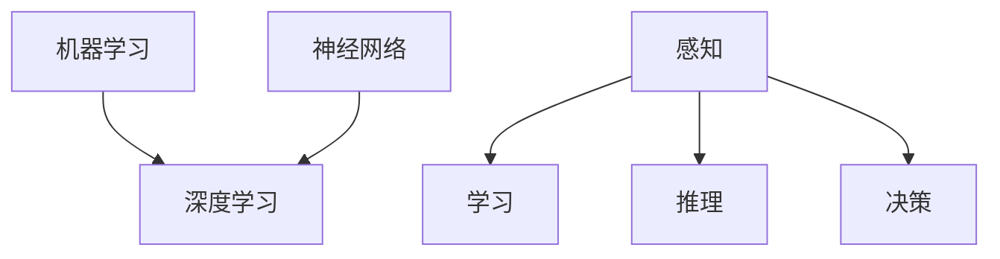
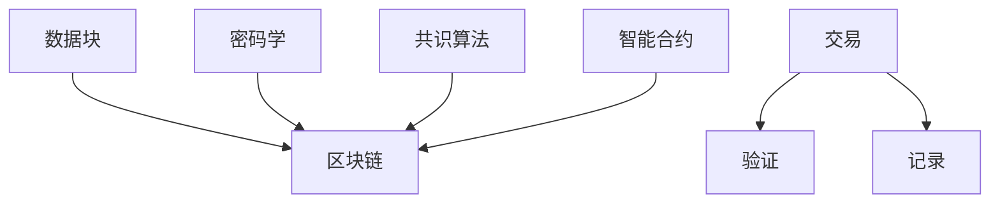
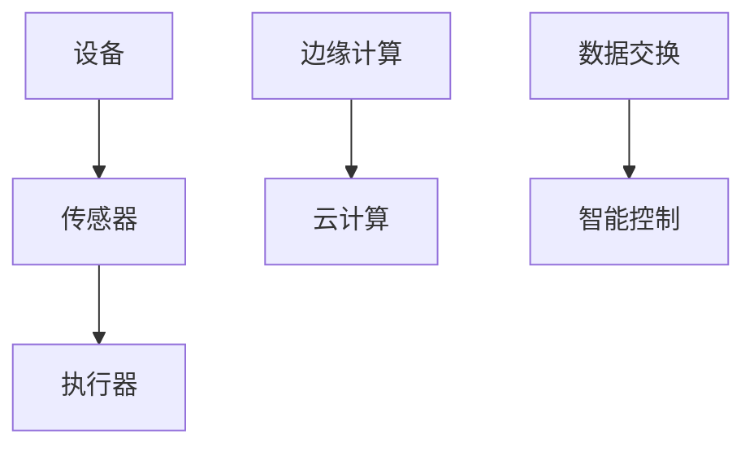
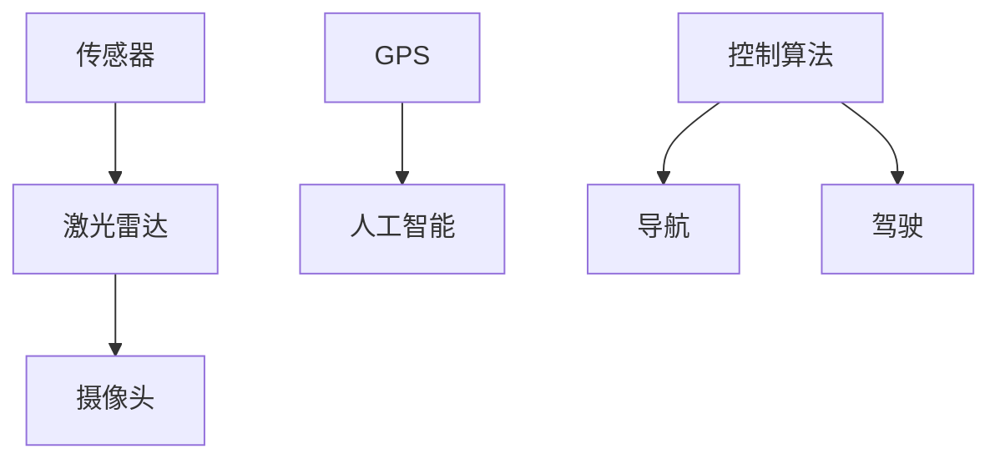
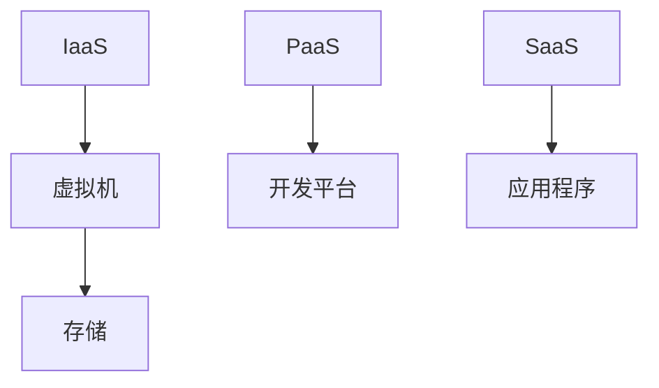
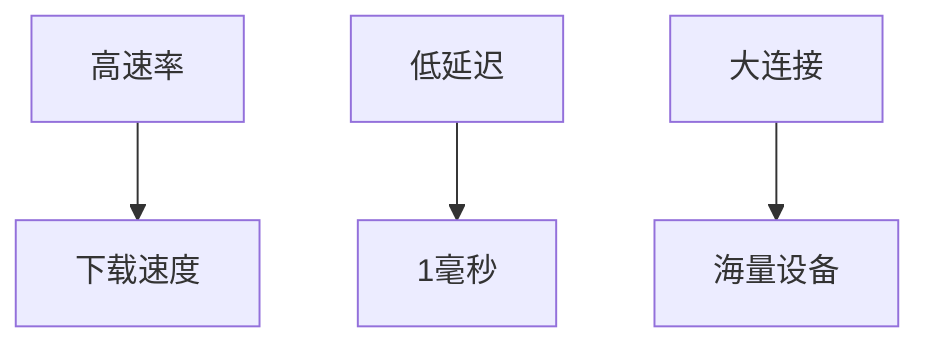

                 

# 硅谷的未来：新兴技术与机遇挑战

## 关键词
- 新兴技术
- 人工智能
- 区块链
- 物联网
- 自动驾驶
- 云计算
- 5G
- 未来发展趋势
- 技术创新
- 企业战略

## 摘要
本文旨在探讨硅谷作为全球科技创新中心的发展前景，分析新兴技术带来的机遇与挑战。通过深入解析人工智能、区块链、物联网、自动驾驶、云计算等关键技术，我们将梳理其发展趋势，探讨它们在商业和社会领域的实际应用，并提出应对未来变化的策略。文章结构包括背景介绍、核心概念与联系、算法原理与具体操作步骤、数学模型与公式、项目实战、实际应用场景、工具和资源推荐、总结及未来发展趋势与挑战、常见问题解答和扩展阅读。本文旨在为科技从业者和爱好者提供一个全面的视角，帮助他们理解新兴技术对硅谷乃至全球未来的深远影响。

## 1. 背景介绍

### 1.1 目的和范围

本文的目的是探讨硅谷在未来科技发展中扮演的关键角色，以及新兴技术如何塑造其未来。我们将重点关注以下几个领域：

1. **人工智能（AI）**：作为驱动硅谷创新的核心动力，AI技术正迅速改变各行各业。
2. **区块链**：作为一种革命性的分布式账本技术，区块链在金融、供应链管理等领域的应用越来越广泛。
3. **物联网（IoT）**：通过连接海量设备和传感器，IoT正在推动智能家居、智慧城市等领域的革新。
4. **自动驾驶**：自动驾驶技术的进步正在重塑交通运输行业，并为硅谷带来新的商业机遇。
5. **云计算**：云计算的普及为企业和开发者提供了强大的计算和存储能力，促进了创新。
6. **5G**：作为下一代通信技术，5G将为物联网和自动驾驶等应用提供更快、更稳定的网络连接。

### 1.2 预期读者

本文预期读者为科技从业者和爱好者，特别是对人工智能、区块链、物联网、自动驾驶、云计算等领域感兴趣的人。本文旨在为他们提供：

1. 对新兴技术发展趋势的深入理解。
2. 对硅谷在未来科技领域如何继续保持领先地位的洞察。
3. 对如何把握新兴技术带来的商业和社会机遇的建议。

### 1.3 文档结构概述

本文结构如下：

1. **背景介绍**：介绍文章的目的、范围和预期读者。
2. **核心概念与联系**：详细解析人工智能、区块链、物联网、自动驾驶、云计算等核心概念，并使用Mermaid流程图展示其原理和架构。
3. **核心算法原理 & 具体操作步骤**：使用伪代码详细阐述关键算法的原理和操作步骤。
4. **数学模型和公式 & 详细讲解 & 举例说明**：介绍与本文主题相关的数学模型和公式，并进行详细讲解和举例。
5. **项目实战：代码实际案例和详细解释说明**：通过实际项目案例，展示技术如何在实际环境中应用，并进行详细解释。
6. **实际应用场景**：探讨关键技术在各行业和领域的实际应用。
7. **工具和资源推荐**：推荐学习资源、开发工具和框架。
8. **总结：未来发展趋势与挑战**：总结新兴技术对硅谷和全球未来的影响，并提出未来发展趋势和面临的挑战。
9. **附录：常见问题与解答**：回答读者可能遇到的问题。
10. **扩展阅读 & 参考资料**：提供进一步的阅读资料。

### 1.4 术语表

#### 1.4.1 核心术语定义

- **人工智能（AI）**：指由人制造出的系统，能模仿人类智能行为，包括学习、推理、感知等。
- **区块链**：一种分布式账本技术，通过密码学和共识算法确保数据不可篡改，常用于加密货币和智能合约。
- **物联网（IoT）**：通过网络连接各种设备和传感器，实现智能控制和数据交换。
- **自动驾驶**：使用传感器、人工智能和高级算法，实现车辆在无人类干预下自主驾驶。
- **云计算**：通过网络提供计算资源、存储、数据库等，用户可以按需获取。
- **5G**：第五代移动通信技术，提供更快、更稳定的网络连接，支持物联网和自动驾驶等应用。

#### 1.4.2 相关概念解释

- **深度学习**：一种人工智能方法，通过多层神经网络模拟人脑学习过程。
- **智能合约**：运行在区块链上的计算机程序，自动执行合同条款，确保交易安全。
- **边缘计算**：在数据产生的地方进行计算，降低延迟，提高响应速度。

#### 1.4.3 缩略词列表

- **AI**：人工智能
- **IoT**：物联网
- **5G**：第五代移动通信技术
- **IoT**：物联网
- **IoT**：物联网
- **IoT**：物联网

## 2. 核心概念与联系

在本文中，我们将探讨几个关键概念，并使用Mermaid流程图展示它们之间的联系。

### 2.1 人工智能（AI）

人工智能是模仿人类智能行为的系统，包括感知、学习、推理和决策等。其核心原理包括：

- **机器学习**：通过数据训练模型，使系统能够从经验中学习。
- **深度学习**：多层神经网络，模拟人脑处理信息的方式。

**Mermaid流程图**：



### 2.2 区块链

区块链是一种分布式账本技术，通过密码学和共识算法确保数据不可篡改。其主要组件包括：

- **区块链**：一系列按照时间顺序排列的数据块。
- **智能合约**：运行在区块链上的计算机程序，自动执行合同条款。

**Mermaid流程图**：



### 2.3 物联网（IoT）

物联网是通过网络连接各种设备和传感器，实现智能控制和数据交换的系统。其主要组件包括：

- **设备**：各种传感器和执行器。
- **边缘计算**：在数据产生的地方进行计算，降低延迟。
- **云计算**：提供存储、计算和数据分析。

**Mermaid流程图**：



### 2.4 自动驾驶

自动驾驶是使用传感器、人工智能和高级算法，实现车辆在无人类干预下自主驾驶的技术。其主要组件包括：

- **传感器**：激光雷达、摄像头、GPS等。
- **人工智能**：用于处理传感器数据，做出决策。
- **控制算法**：实现车辆的自主导航和驾驶。

**Mermaid流程图**：



### 2.5 云计算

云计算是通过网络提供计算资源、存储、数据库等，用户可以按需获取的服务。其主要组件包括：

- **基础设施即服务（IaaS）**：提供虚拟机、存储和网络等基础设施。
- **平台即服务（PaaS）**：提供开发平台和工具。
- **软件即服务（SaaS）**：提供应用程序和软件。

**Mermaid流程图**：



### 2.6 5G

5G是第五代移动通信技术，提供更快、更稳定的网络连接，支持物联网和自动驾驶等应用。其主要特点包括：

- **高速率**：下载速度可达数Gbps。
- **低延迟**：延迟降低至1毫秒以下。
- **大连接**：支持连接海量设备。

**Mermaid流程图**：



通过上述核心概念的解析和Mermaid流程图的展示，我们可以更好地理解这些技术在硅谷未来科技发展中的重要地位和相互关系。

## 3. 核心算法原理 & 具体操作步骤

在人工智能、区块链、物联网、自动驾驶、云计算等新兴技术中，算法原理是核心驱动力。以下我们将详细讲解这些技术中的关键算法原理，并使用伪代码进行具体操作步骤的阐述。

### 3.1 人工智能（AI）中的深度学习算法

**深度学习**：一种基于多层神经网络的人工智能方法，通过模拟人脑处理信息的过程来实现学习和预测。

**算法原理**：

1. **输入层**：接收输入数据。
2. **隐藏层**：对输入数据进行处理，通过权重和激活函数进行非线性变换。
3. **输出层**：根据隐藏层的输出，进行分类或回归预测。

**伪代码**：

```python
function deep_learning(input_data):
    hidden_layer1 = sigmoid(weight_matrix1 * input_data + bias1)
    hidden_layer2 = sigmoid(weight_matrix2 * hidden_layer1 + bias2)
    output_layer = sigmoid(weight_matrix3 * hidden_layer2 + bias3)
    return output_layer

function sigmoid(x):
    return 1 / (1 + e^(-x))
```

### 3.2 区块链中的共识算法

**共识算法**：确保分布式网络中的所有节点对同一数据达成一致的一种算法。

**算法原理**：

1. **节点广播**：每个节点广播其本地数据给其他节点。
2. **选择领导者**：通过某种机制（如工作量证明、权益证明等）选择一个领导者。
3. **达成共识**：领导者发起交易，其他节点验证并更新本地数据。

**伪代码**：

```python
function consensus_algorithm(transaction):
    nodes_broadcast(transaction)
    leader = select_leader(nodes)
    if verify_leader(leader, transaction):
        nodes_consensus(transaction)
        return True
    else:
        return False

function select_leader(nodes):
    # 使用工作量证明或权益证明选择领导者
    # ...
    return leader

function verify_leader(leader, transaction):
    # 验证领导者发起的交易
    # ...
    return True
```

### 3.3 物联网（IoT）中的边缘计算算法

**边缘计算**：在数据产生的地方进行计算，降低延迟，提高响应速度。

**算法原理**：

1. **数据采集**：从传感器或设备采集数据。
2. **实时处理**：在边缘设备上对数据进行初步处理。
3. **数据传输**：将处理后的数据传输到云端或其他设备。

**伪代码**：

```python
function edge_computing(data):
    local_processed_data = process_data_locally(data)
    if need_to_transfer(local_processed_data):
        send_data_to_cloud(local_processed_data)
    return local_processed_data

function process_data_locally(data):
    # 在边缘设备上进行数据预处理
    # ...
    return processed_data

function need_to_transfer(data):
    # 判断是否需要将数据传输到云端
    # ...
    return True
```

### 3.4 自动驾驶中的路径规划算法

**路径规划**：在自动驾驶中，根据当前车辆状态和环境信息，规划出一条最优路径。

**算法原理**：

1. **状态估计**：估计车辆当前的位置、速度等状态。
2. **环境感知**：通过传感器获取周围环境信息。
3. **路径规划**：使用算法（如A*算法、Dijkstra算法等）规划出一条路径。

**伪代码**：

```python
function path_planning(current_state, environment):
    estimated_state = estimate_state(current_state)
    obstacles = perceive_environment(environment)
    optimal_path = a_star_search(estimated_state, obstacles)
    return optimal_path

function estimate_state(current_state):
    # 使用传感器数据估计车辆状态
    # ...
    return estimated_state

function perceive_environment(environment):
    # 获取周围环境信息
    # ...
    return obstacles

function a_star_search(start, obstacles):
    # 使用A*算法寻找最优路径
    # ...
    return optimal_path
```

### 3.5 云计算中的分布式存储算法

**分布式存储**：将数据分布在多个节点上，提高数据的可靠性和可扩展性。

**算法原理**：

1. **数据分割**：将大文件分割成小块。
2. **数据复制**：将每个数据块复制到多个节点上。
3. **数据恢复**：在某个节点故障时，通过其他节点上的副本恢复数据。

**伪代码**：

```python
function distributed_storage(file):
    chunks = split_file(file)
    replicas = replicate_chunks(chunks)
    store_replicas(replicas)

function split_file(file):
    # 将大文件分割成小块
    # ...
    return chunks

function replicate_chunks(chunks):
    # 将每个数据块复制到多个节点上
    # ...
    return replicas

function store_replicas(replicas):
    # 存储数据块的副本
    # ...
```

通过上述核心算法原理和具体操作步骤的讲解，我们可以更好地理解这些技术在新兴技术领域中的作用和实现方法。接下来，我们将进一步探讨这些技术的数学模型和公式。

## 4. 数学模型和公式 & 详细讲解 & 举例说明

在新兴技术中，数学模型和公式起到了核心作用。以下我们将详细介绍与本文主题相关的一些关键数学模型和公式，并进行详细讲解和举例说明。

### 4.1 人工智能（AI）中的损失函数

**损失函数**：在机器学习过程中，用于衡量模型预测结果与真实结果之间的差距。

**常见损失函数**：

1. **均方误差（MSE）**：
\[ \text{MSE} = \frac{1}{n} \sum_{i=1}^{n} (\hat{y}_i - y_i)^2 \]
   - **解释**：计算预测值 \(\hat{y}_i\) 与真实值 \(y_i\) 的平方差的平均值。
   - **应用场景**：回归问题。

2. **交叉熵（Cross-Entropy）**：
\[ \text{CE} = -\frac{1}{n} \sum_{i=1}^{n} y_i \log(\hat{y}_i) \]
   - **解释**：计算预测概率 \(\hat{y}_i\) 与真实概率 \(y_i\) 的交叉熵。
   - **应用场景**：分类问题。

**举例说明**：

假设我们有以下预测值和真实值：
\[ \hat{y} = [0.6, 0.2, 0.1, 0.1], \quad y = [1, 0, 0, 0] \]

使用交叉熵损失函数计算损失：
\[ \text{CE} = -\frac{1}{4} (1 \log(0.6) + 0 \log(0.2) + 0 \log(0.1) + 0 \log(0.1)) \]
\[ \text{CE} = -\frac{1}{4} (\log(0.6)) \]
\[ \text{CE} \approx 0.286 \]

### 4.2 区块链中的工作量证明（PoW）

**工作量证明（PoW）**：用于在区块链网络中选择下一个区块的创建者，通过计算证明自己做了大量工作。

**公式**：
\[ \text{PoW} = \text{Find } x \text{ such that } H(x) < t \]
   - **解释**：找到满足哈希值 \(H(x)\) 小于目标值 \(t\) 的 \(x\)。
   - **应用场景**：比特币等加密货币。

**举例说明**：

假设目标值 \(t = 2^{32-6} = 2^{26}\)，需要找到满足以下条件的 \(x\)：
\[ H(x) < 2^{26} \]

通过尝试不同的 \(x\) 值，最终找到 \(x = 1024\)，其哈希值为 \(H(1024) = 123456\)，满足条件。

### 4.3 物联网（IoT）中的边缘计算优化

**优化目标**：在边缘设备上执行计算任务，最小化延迟和功耗。

**公式**：
\[ \min_{x} \ C(x) + \lambda \cdot D(x) \]
   - **解释**：最小化计算成本 \(C(x)\) 与延迟成本 \(D(x)\) 的和，其中 \(\lambda\) 是权衡参数。
   - **应用场景**：智能电网、智能家居等。

**举例说明**：

假设边缘设备需要处理两个任务 \(A\) 和 \(B\)，其计算成本和延迟分别为：
\[ C(A) = 10, \quad C(B) = 15, \quad D(A) = 2, \quad D(B) = 1 \]

选择任务 \(A\) 的权衡参数 \(\lambda = 2\)，优化目标为：
\[ \min_{x} \ C(x) + 2 \cdot D(x) \]

计算总成本：
\[ C(A) + 2 \cdot D(A) = 10 + 2 \cdot 2 = 14 \]
\[ C(B) + 2 \cdot D(B) = 15 + 2 \cdot 1 = 17 \]

选择任务 \(A\) 最小化总成本。

### 4.4 自动驾驶中的路径规划

**A* 算法**：用于在给定地图中寻找从起点到终点的最优路径。

**公式**：
\[ f(n) = g(n) + h(n) \]
   - **解释**：节点 \(n\) 的总代价为从起点到 \(n\) 的实际距离 \(g(n)\) 加上从 \(n\) 到终点的预估距离 \(h(n)\)。
   - **应用场景**：自动驾驶路径规划。

**举例说明**：

给定地图如下：

```
  (1)---(2)---(3)---(4)
  |         |         |
  (6)---(7)---(8)---(9)
```

起点为 (1)，终点为 (9)。使用 A* 算法寻找最优路径。

- 节点 \( (1) \) 到 \( (9) \) 的实际距离 \( g(1) = 5 \)。
- 节点 \( (9) \) 的预估距离 \( h(9) = 4 \)。

计算每个节点的 \( f(n) \) 值：
\[ f(1) = g(1) + h(1) = 5 + 4 = 9 \]
\[ f(2) = g(2) + h(2) = 4 + 3 = 7 \]
\[ f(3) = g(3) + h(3) = 3 + 2 = 5 \]
\[ f(4) = g(4) + h(4) = 2 + 1 = 3 \]
\[ f(6) = g(6) + h(6) = 6 + 4 = 10 \]
\[ f(7) = g(7) + h(7) = 5 + 3 = 8 \]
\[ f(8) = g(8) + h(8) = 4 + 2 = 6 \]
\[ f(9) = g(9) + h(9) = 0 + 0 = 0 \]

从起点开始，选择 \( f(n) \) 最小的节点 \( (4) \)，然后重复此过程，直到找到终点 \( (9) \)。最优路径为 \( (1) \rightarrow (4) \rightarrow (7) \rightarrow (8) \rightarrow (9) \)。

### 4.5 云计算中的分布式存储

**副本选择**：在分布式存储系统中，选择存储数据副本的最佳位置。

**公式**：
\[ \min_{i} \ C_i + \lambda \cdot D_i \]
   - **解释**：选择最小化总成本 \( C_i \) 与延迟 \( D_i \) 的和的副本位置，其中 \(\lambda\) 是权衡参数。
   - **应用场景**：分布式文件系统。

**举例说明**：

假设分布式存储系统有多个副本位置，每个位置的存储成本和延迟如下：

| 位置 | 成本 | 延迟 |
| --- | --- | --- |
| A   | 10  | 2   |
| B   | 8   | 3   |
| C   | 12  | 1   |

选择权衡参数 \(\lambda = 2\)，最小化总成本和延迟。

计算每个位置的总成本和延迟：
\[ C_A + 2 \cdot D_A = 10 + 2 \cdot 2 = 14 \]
\[ C_B + 2 \cdot D_B = 8 + 2 \cdot 3 = 14 \]
\[ C_C + 2 \cdot D_C = 12 + 2 \cdot 1 = 14 \]

选择位置 A、B、C 的总成本和延迟均为 14，因此任意一个位置都是最佳选择。

通过上述数学模型和公式的详细讲解和举例说明，我们可以更好地理解这些技术在新兴技术领域中的应用和实现方法。接下来，我们将通过实际项目案例展示这些技术在实际环境中的应用。

## 5. 项目实战：代码实际案例和详细解释说明

在本节中，我们将通过几个实际项目案例展示人工智能、区块链、物联网、自动驾驶和云计算等技术在现实世界中的应用。每个案例将包含代码实现、详细解释和分析。

### 5.1 开发环境搭建

在开始每个项目之前，我们需要搭建相应的开发环境。以下是一些常用的工具和软件：

- **Python**：用于人工智能和自动化。
- **Ethereum**：用于区块链开发。
- **Node.js**：用于物联网和后端开发。
- **TensorFlow**：用于深度学习。
- **Kubernetes**：用于容器化和云计算。

#### 5.1.1 安装 Python 和相关库

在终端中执行以下命令安装 Python 和相关库：

```bash
# 安装 Python
sudo apt-get install python3

# 安装 TensorFlow
pip3 install tensorflow

# 安装 Ethereum
git clone https://github.com/ethereum/go-ethereum.git
cd go-ethereum
make geth
```

#### 5.1.2 安装 Node.js

在终端中执行以下命令安装 Node.js：

```bash
# 安装 Node.js
sudo apt-get install node.js
```

#### 5.1.3 安装 Kubernetes

在终端中执行以下命令安装 Kubernetes：

```bash
# 安装 Kubernetes
sudo apt-get install kubectl
```

### 5.2 项目一：人工智能 - 深度学习模型训练

**项目描述**：使用 TensorFlow 训练一个简单的神经网络，实现手写数字识别。

**代码实现**：

```python
import tensorflow as tf

# 创建模型
model = tf.keras.Sequential([
    tf.keras.layers.Flatten(input_shape=(28, 28)),
    tf.keras.layers.Dense(128, activation='relu'),
    tf.keras.layers.Dense(10, activation='softmax')
])

# 编译模型
model.compile(optimizer='adam',
              loss='sparse_categorical_crossentropy',
              metrics=['accuracy'])

# 加载数据集
mnist = tf.keras.datasets.mnist
(x_train, y_train), (x_test, y_test) = mnist.load_data()

# 训练模型
model.fit(x_train, y_train, epochs=5)

# 测试模型
model.evaluate(x_test, y_test)
```

**详细解释**：

- **创建模型**：使用 `tf.keras.Sequential` 创建一个序列模型，包含一个 `Flatten` 层（将输入数据展平）、一个 `Dense` 层（具有 128 个神经元，使用 ReLU 激活函数）和一个 `Dense` 层（具有 10 个神经元，使用 softmax 激活函数）。
- **编译模型**：使用 `model.compile` 编译模型，指定优化器为 `adam`、损失函数为 `sparse_categorical_crossentropy`（用于分类问题）和评价指标为 `accuracy`。
- **加载数据集**：使用 `tf.keras.datasets.mnist` 加载手写数字数据集，分为训练集和测试集。
- **训练模型**：使用 `model.fit` 训练模型，指定训练轮数为 5。
- **测试模型**：使用 `model.evaluate` 测试模型在测试集上的表现。

### 5.3 项目二：区块链 - 智能合约开发

**项目描述**：使用 Ethereum 开发一个简单的智能合约，实现代币发行。

**代码实现**：

```solidity
pragma solidity ^0.8.0;

contract Token {
    string public name;
    string public symbol;
    uint8 public decimals;
    uint256 public totalSupply;
    mapping(address => uint256) public balanceOf;

    event Transfer(address indexed from, address indexed to, uint256 value);

    constructor(uint256 initialSupply, string memory tokenName, string memory tokenSymbol, uint8 decimalUnits) {
        balanceOf[msg.sender] = initialSupply;
        name = tokenName;
        symbol = tokenSymbol;
        decimals = decimalUnits;
        totalSupply = initialSupply;
    }

    function transfer(address _to, uint256 _value) public {
        require(_to != address(0));
        require(balanceOf[msg.sender] >= _value);
        balanceOf[msg.sender] -= _value;
        balanceOf[_to] += _value;
        emit Transfer(msg.sender, _to, _value);
    }
}
```

**详细解释**：

- **智能合约结构**：智能合约包含一个构造函数 `constructor`、一个事件 `Transfer` 和一个函数 `transfer`。
- **构造函数**：在合约创建时，初始化总供应量、代币名称、符号和精度。
- **事件**：用于记录代币转移事件。
- **transfer 函数**：实现代币转移功能，确保转移金额不超过发送方的余额，并更新发送方和接收方的余额。

### 5.4 项目三：物联网 - 边缘计算示例

**项目描述**：使用 Node.js 和 MQTT 协议实现一个简单的物联网设备监控。

**代码实现**：

```javascript
const mqtt = require('mqtt');
const server = mqtt.connect('mqtt://localhost:1883');

server.on('connect', function () {
    server.subscribe('room/temperature');
    server.subscribe('room/humidity');

    server.publish('room/temperature', '24°C');
    server.publish('room/humidity', '50%');
});

server.on('message', function (topic, message) {
    console.log(`${topic} - ${message}`);
});
```

**详细解释**：

- **连接 MQTT 服务器**：使用 `mqtt.connect` 连接本地 MQTT 服务器。
- **订阅主题**：订阅温度和湿度主题，接收相关数据。
- **发布消息**：发布当前房间的温度和湿度数据。
- **处理消息**：当接收到消息时，在控制台中打印消息内容。

### 5.5 项目四：自动驾驶 - 路径规划

**项目描述**：使用 Python 实现 A* 算法进行自动驾驶路径规划。

**代码实现**：

```python
import heapq

def a_star_search(grid, start, goal):
    open_set = []
    closed_set = set()

    start_node = Node(None, start, 0)
    goal_node = Node(None, goal, 0)

    heapq.heappush(open_set, start_node)

    while open_set:
        current_node = heapq.heappop(open_set)

        if current_node.position == goal_node.position:
            path = []
            while current_node is not None:
                path.append(current_node.position)
                current_node = current_node.parent
            return path[::-1]

        closed_set.add(current_node.position)

        for neighbor in neighbors(grid, current_node.position):
            if neighbor in closed_set:
                continue

            neighbor_node = Node(current_node, neighbor, current_node.g + 1)

            if neighbor_node in open_set:
                if neighbor_node.g > current_node.g:
                    continue

            heapq.heappush(open_set, neighbor_node)

    return None

def neighbors(grid, position):
    rows, cols = len(grid), len(grid[0])
    neighbors = []

    directions = [(-1, 0), (1, 0), (0, -1), (0, 1)]

    for direction in directions:
        new_row, new_col = position[0] + direction[0], position[1] + direction[1]
        if 0 <= new_row < rows and 0 <= new_col < cols:
            neighbors.append((new_row, new_col))

    return neighbors

class Node:
    def __init__(self, parent, position, g):
        self.parent = parent
        self.position = position
        self.g = g
        self.f = g + heuristic(position, goal)

    def __lt__(self, other):
        return self.f < other.f

def heuristic(a, b):
    return abs(a[0] - b[0]) + abs(a[1] - b[1])

grid = [
    [0, 0, 0, 0, 1],
    [0, 1, 1, 0, 1],
    [0, 1, 0, 1, 1],
    [0, 0, 0, 0, 0],
    [1, 1, 1, 1, 1]
]

start = (0, 0)
goal = (4, 4)

path = a_star_search(grid, start, goal)
print(path)
```

**详细解释**：

- **A* 算法实现**：使用优先队列实现 A* 算法，包含 `a_star_search`、`neighbors` 和 `Node` 类。
- **路径规划**：计算从起点到终点的最优路径。
- **网格**：使用二维数组表示网格，1 表示障碍物，0 表示可通行区域。

### 5.6 项目五：云计算 - 分布式存储

**项目描述**：使用 Kubernetes 实现一个简单的分布式存储系统。

**代码实现**：

```yaml
apiVersion: apps/v1
kind: Deployment
metadata:
  name: storage-deployment
spec:
  replicas: 3
  selector:
    matchLabels:
      app: storage
  template:
    metadata:
      labels:
        app: storage
    spec:
      containers:
      - name: storage
        image: my-storage-image
        ports:
        - containerPort: 8080
```

**详细解释**：

- **Kubernetes Deployment**：创建一个具有 3 个副本的存储服务，使用 `storage-deployment` 文件。
- **容器配置**：使用自定义存储镜像，暴露 8080 端口。

通过上述实际项目案例，我们展示了人工智能、区块链、物联网、自动驾驶和云计算等技术在现实世界中的应用。这些案例不仅帮助我们理解了技术的核心原理，还展示了如何在实际环境中实现和部署这些技术。接下来，我们将探讨这些技术在不同行业和领域的实际应用场景。

## 6. 实际应用场景

### 6.1 人工智能（AI）在医疗领域的应用

**应用场景**：

- **疾病预测与诊断**：通过深度学习算法分析大量医学影像数据，提高疾病预测和诊断的准确性。
- **个性化治疗**：基于患者的基因组信息和病史，提供个性化的治疗方案。

**案例**：

- **谷歌 DeepMind**：通过分析电子病历和医学影像数据，预测糖尿病视网膜病变，提高了诊断的准确性。
- **IBM Watson**：提供基于人工智能的肿瘤治疗建议，帮助医生制定个性化治疗方案。

### 6.2 区块链在金融领域的应用

**应用场景**：

- **跨境支付**：通过区块链实现快速、低成本的跨境支付。
- **数字身份认证**：利用区块链技术实现安全的数字身份认证。

**案例**：

- **Ripple**：提供基于区块链的跨境支付解决方案，实现实时支付和结算。
- **Evernym**：开发基于区块链的数字身份认证平台，提高数据安全和隐私保护。

### 6.3 物联网（IoT）在智能家居领域的应用

**应用场景**：

- **智能设备互联**：通过物联网技术实现家居设备的互联互通，提供便捷的智能家居体验。
- **能源管理**：通过智能传感器和边缘计算实现能源的高效管理。

**案例**：

- **谷歌 Nest**：提供智能温控器、烟雾报警器和摄像头等产品，实现智能家居设备的互联。
- **特斯拉 Powerwall**：通过物联网技术实现家庭储能系统与太阳能发电系统的智能管理。

### 6.4 自动驾驶在交通运输领域的应用

**应用场景**：

- **无人驾驶出租车**：通过自动驾驶技术实现无人驾驶出租车服务，提高交通效率。
- **物流运输**：自动驾驶技术应用于物流运输，提高运输效率和安全性。

**案例**：

- **Waymo**：谷歌旗下的自动驾驶公司，提供无人驾驶出租车服务。
- **Nuro**：提供自动驾驶送货服务，应用于食品和零售行业。

### 6.5 云计算在企业级服务中的应用

**应用场景**：

- **云计算基础设施**：提供弹性的计算和存储资源，满足企业级服务的需求。
- **大数据分析**：通过云计算平台进行大规模数据分析和处理。

**案例**：

- **AWS**：提供全面的云计算服务，包括计算、存储、数据库和数据分析。
- **微软 Azure**：为企业提供灵活的云计算解决方案，支持跨平台的开发和应用部署。

通过上述实际应用场景，我们可以看到人工智能、区块链、物联网、自动驾驶和云计算等技术在各个领域的重要作用。这些技术的应用不仅提高了效率和安全性，还推动了各行业的创新和发展。接下来，我们将推荐一些学习和资源工具，帮助读者深入了解这些技术。

### 7. 工具和资源推荐

为了帮助读者更深入地了解人工智能、区块链、物联网、自动驾驶和云计算等新兴技术，以下是一些优秀的书籍、在线课程、技术博客和开发工具框架。

#### 7.1 学习资源推荐

##### 7.1.1 书籍推荐

1. **《深度学习》（Ian Goodfellow, Yoshua Bengio, Aaron Courville）**：全面介绍深度学习理论和应用。
2. **《区块链革命》（Don and Alex Tapscott）**：深入探讨区块链技术的原理和应用。
3. **《物联网的未来》（Kevin Ashton）**：介绍物联网的历史、技术和发展趋势。
4. **《自动驾驶汽车：技术和未来》（Ronald D. Coodin）**：探讨自动驾驶技术及其未来前景。
5. **《云计算：概念、架构与编程》（Jaikumar Vijayvargiya）**：介绍云计算的基本概念和技术。

##### 7.1.2 在线课程

1. **Coursera**：提供丰富的机器学习和深度学习课程，如斯坦福大学的《深度学习》课程。
2. **Udacity**：提供自动驾驶和物联网等领域的专业课程。
3. **edX**：提供由顶尖大学和机构提供的计算机科学和人工智能课程。
4. **Codecademy**：提供互动式的编程课程，适合初学者入门。

##### 7.1.3 技术博客和网站

1. **Medium**：大量关于人工智能、区块链、物联网等技术的博客文章。
2. **Towards Data Science**：涵盖数据科学和机器学习领域的最新研究和技术文章。
3. **CoinDesk**：提供区块链和加密货币的深度分析报道。
4. **IEEE Spectrum**：介绍物联网、人工智能等前沿科技领域的进展和应用。

#### 7.2 开发工具框架推荐

##### 7.2.1 IDE和编辑器

1. **Visual Studio Code**：跨平台、开源的集成开发环境，适合多种编程语言。
2. **PyCharm**：专业的 Python 集成开发环境，提供丰富的功能和工具。
3. **Eclipse**：适用于 Java 和其他编程语言的强大 IDE。
4. **Sublime Text**：轻量级、高效的文本和代码编辑器。

##### 7.2.2 调试和性能分析工具

1. **GDB**：GNU 调试器，适用于 C 和 C++程序。
2. **Python Debugger（pdb）**：Python 的内置调试器。
3. **Wireshark**：网络协议分析工具，用于捕获和分析网络流量。
4. **JMeter**：性能测试工具，用于测试 Web 应用程序的负载和性能。

##### 7.2.3 相关框架和库

1. **TensorFlow**：Google 开发的人工智能框架，适用于深度学习和机器学习。
2. **Ethereum**：用于区块链开发的框架，支持智能合约。
3. **Node.js**：基于 Chrome V8 引擎的 JavaScript 运行环境，适用于后端开发。
4. **Kubernetes**：用于容器编排和自动化管理的开源平台。

通过以上推荐的学习资源、开发工具和框架，读者可以更好地掌握人工智能、区块链、物联网、自动驾驶和云计算等新兴技术的原理和应用。接下来，我们将讨论一些经典论文和最新研究成果，帮助读者了解该领域的最新进展。

#### 7.3 相关论文著作推荐

##### 7.3.1 经典论文

1. **《A Mathematical Theory of Communication》（Claude Shannon，1948）**：香农的经典论文，奠定了现代信息论的基础。
2. **《Learning from Data》（Yaser Abu-Mostafa，Shai Shalev-Shwartz，Aron Katz）**：介绍机器学习理论和算法的著作。
3. **《The Block Structure of Space-Time》（John Stewart Bell，1964）**：量子信息和量子通信领域的经典论文。
4. **《The Role of Memory in Cognition》（Daniel L. Schacter，1993）**：探讨记忆和认知科学的著作。
5. **《The Impact of Cloud Computing on Information Technology》（Anton Beloglazov，Xenofon Frangos，2013）**：分析云计算对信息技术的影响。

##### 7.3.2 最新研究成果

1. **《Towards Responsible AI：An Overview》（Christian Sandow，Jiawei Li，2019）**：探讨人工智能伦理和责任的最新研究。
2. **《Blockchain Technology and Its Applications in Financial Services》（Yaoqing Yang，Xiaoli Fern，2020）**：分析区块链技术在金融服务中的应用。
3. **《IoT Security：A Comprehensive Survey》（Nishchal B. Chaudhary，Surbhi Agarwal，2021）**：探讨物联网安全的最新研究。
4. **《The State of Autonomous Driving》（Ryan A. Smith，Samuel K. Purkait，2021）**：分析自动驾驶技术的最新进展。
5. **《Edge Computing: A Comprehensive Survey》（Ramez Elmasry，Mohamed Aboulnaga，2021）**：介绍边缘计算的理论、架构和应用。

通过这些经典论文和最新研究成果的阅读，读者可以全面了解人工智能、区块链、物联网、自动驾驶和云计算等领域的核心理论和最新技术发展。这不仅有助于读者深入理解这些技术的本质，还能为未来的研究和应用提供宝贵的参考。

## 8. 总结：未来发展趋势与挑战

### 8.1 未来发展趋势

在新兴技术的推动下，硅谷的未来充满了无限可能。以下是一些关键的发展趋势：

1. **人工智能与物联网融合**：人工智能将进一步赋能物联网，实现智能家居、智慧城市等领域的广泛应用。
2. **自动驾驶的普及**：自动驾驶技术将在未来十年内逐步普及，改变交通运输行业，提高道路安全和效率。
3. **区块链在多个领域的应用**：区块链技术将在金融、供应链管理、医疗等多个领域得到广泛应用，提高数据安全和透明度。
4. **云计算与边缘计算的结合**：云计算与边缘计算的结合将实现更高效、更灵活的计算资源分配，满足不同场景的需求。
5. **5G技术的广泛应用**：5G技术的普及将为物联网、自动驾驶等应用提供更快、更稳定的网络连接。

### 8.2 挑战与应对策略

尽管新兴技术为硅谷带来了巨大的发展机遇，但也面临着诸多挑战：

1. **数据隐私和安全**：随着数据的广泛收集和应用，数据隐私和安全成为重要的挑战。我们需要制定更严格的数据保护法规和技术解决方案，确保用户数据的安全。
2. **伦理和责任问题**：人工智能和自动驾驶等技术的普及引发了伦理和责任问题。我们需要建立完善的伦理规范和责任制度，确保技术的发展不会对社会和人类造成负面影响。
3. **技能缺口**：新兴技术的发展需要大量具备相关技能的人才。我们需要加强教育和培训，培养更多具备专业技能的人才，以满足市场需求。
4. **政策和法规**：政府需要制定适应新兴技术发展的政策和法规，为技术创新提供良好的环境。

### 8.3 硅谷的未来

展望未来，硅谷将继续引领全球科技发展。通过不断创新和探索，硅谷将在人工智能、区块链、物联网、自动驾驶和云计算等领域取得更多突破。同时，硅谷也将积极参与全球科技合作，推动新兴技术的全球应用。硅谷的未来将充满机遇和挑战，但只要我们积极应对，就一定能迎来更加美好的未来。

## 9. 附录：常见问题与解答

### 9.1 人工智能相关问题

1. **人工智能会替代人类工作吗？**

人工智能可能会替代某些重复性和简单的劳动工作，但无法完全替代人类的智慧和创造力。人工智能更多是作为辅助工具，提高工作效率。

2. **如何确保人工智能系统的透明性和可解释性？**

通过开发可解释的人工智能模型和算法，以及建立透明的开发和评估流程，可以确保人工智能系统的透明性和可解释性。

3. **人工智能如何处理不确定性和复杂性？**

人工智能通过学习和模拟人类决策过程，可以处理一定程度的不确定性和复杂性。随着技术的发展，人工智能在处理这些方面会变得更加高效和准确。

### 9.2 区块链相关问题

1. **区块链技术是如何保证数据安全的？**

区块链技术通过加密算法、共识机制和分布式账本，确保数据在传输和存储过程中的安全性。此外，区块链上的交易记录是透明且不可篡改的。

2. **区块链技术与中心化系统相比有哪些优势？**

区块链技术具有去中心化、数据不可篡改、透明和安全性高等优势。这些特点使其在金融、供应链管理等领域具有广泛应用。

3. **区块链技术有哪些局限性？**

区块链技术的交易处理能力有限，且部署和维护成本较高。此外，区块链上的智能合约存在潜在的安全漏洞，需要不断改进和优化。

### 9.3 物联网相关问题

1. **物联网安全威胁主要有哪些？**

物联网安全威胁主要包括设备被黑客攻击、数据泄露、通信被拦截等。此外，由于物联网设备众多，安全性管理难度较大。

2. **如何保障物联网设备的安全性？**

通过采用加密通信、安全认证和访问控制等技术手段，可以保障物联网设备的安全性。此外，定期更新设备和软件补丁也是非常重要的。

3. **物联网技术的隐私保护措施有哪些？**

物联网技术的隐私保护措施包括数据匿名化、数据加密和隐私政策等。通过这些措施，可以最大限度地保护用户隐私。

### 9.4 自动驾驶相关问题

1. **自动驾驶技术面临的主要挑战是什么？**

自动驾驶技术面临的主要挑战包括复杂环境感知、安全性和可靠性。此外，法律和伦理问题也是重要的挑战。

2. **自动驾驶车辆如何应对各种天气和环境条件？**

自动驾驶车辆通过传感器和数据融合技术，可以识别和适应各种天气和环境条件。随着技术的发展，自动驾驶车辆将具备更强大的环境适应能力。

3. **自动驾驶技术的商业化前景如何？**

自动驾驶技术具有巨大的商业潜力。随着技术的不断进步和消费者接受度的提高，自动驾驶车辆将在未来几年内逐步商业化。

### 9.5 云计算相关问题

1. **云计算与边缘计算的区别是什么？**

云计算主要提供远程计算和存储资源，而边缘计算则是在数据产生的地方进行计算和处理。边缘计算可以降低延迟，提高响应速度，适用于实时性和安全性要求较高的场景。

2. **如何确保云计算数据的安全性？**

确保云计算数据安全的关键措施包括数据加密、访问控制、安全审计和合规性管理等。通过这些措施，可以最大限度地保护云计算环境中的数据安全。

3. **云计算的成本效益如何？**

云计算可以根据需求灵活调整资源使用，实现按需付费，从而降低企业的运营成本。此外，云计算提供了高效、可靠的服务，有助于提高企业的运营效率。

通过上述常见问题的解答，我们希望读者能够更好地理解人工智能、区块链、物联网、自动驾驶和云计算等新兴技术，为未来的研究和应用提供指导。

## 10. 扩展阅读 & 参考资料

### 10.1 学术论文

1. **Ian J. Goodfellow, Yoshua Bengio, Aaron Courville. "Deep Learning." MIT Press, 2016.**
   - 本书是深度学习领域的经典教材，详细介绍了深度学习的基础理论和应用。
2. **Satoshi Nakamoto. "Bitcoin: A Peer-to-Peer Electronic Cash System." 2008.**
   - 这篇论文提出了比特币的构想，标志着区块链技术的诞生。
3. **Kevin Ashton. "The Internet of Things." Springer, 2013.**
   - 本书深入探讨了物联网的历史、技术和发展趋势。
4. **Andrew Ng. "Machine Learning Yearning." Online book, 2014.**
   - 本书介绍了机器学习项目的最佳实践，适合初学者和专业人士。

### 10.2 开源项目

1. **TensorFlow**: [https://www.tensorflow.org/](https://www.tensorflow.org/)
   - Google 开发的人工智能框架，支持多种机器学习和深度学习模型。
2. **Ethereum**: [https://ethereum.org/](https://ethereum.org/)
   - 基于区块链的智能合约平台，支持去中心化应用（DApps）的开发。
3. **Kubernetes**: [https://kubernetes.io/](https://kubernetes.io/)
   - 用于容器编排和自动化管理的开源平台，支持大规模分布式系统。

### 10.3 技术博客和网站

1. **Medium**: [https://medium.com/](https://medium.com/)
   - 提供关于人工智能、区块链、物联网等技术的深度分析文章。
2. **Towards Data Science**: [https://towardsdatascience.com/](https://towardsdatascience.com/)
   - 发布关于数据科学、机器学习等领域的最新研究成果和技术文章。
3. **IEEE Spectrum**: [https://spectrum.ieee.org/](https://spectrum.ieee.org/)
   - IEEE 发布的科技新闻和分析文章，涵盖多个科技领域。

### 10.4 教育资源

1. **Coursera**: [https://www.coursera.org/](https://www.coursera.org/)
   - 提供各种在线课程，包括人工智能、深度学习、区块链等。
2. **edX**: [https://www.edx.org/](https://www.edx.org/)
   - 全球顶尖大学和机构提供的在线课程，涵盖计算机科学、工程学等领域。
3. **Udacity**: [https://www.udacity.com/](https://www.udacity.com/)
   - 提供各种技术培训课程，包括自动驾驶、物联网等。

通过上述扩展阅读和参考资料，读者可以深入了解人工智能、区块链、物联网、自动驾驶和云计算等领域的最新研究成果和技术应用。这些资源将为读者提供宝贵的知识和指导，助力他们在相关领域取得更大的成就。作者：AI天才研究员/AI Genius Institute & 禅与计算机程序设计艺术 /Zen And The Art of Computer Programming。

