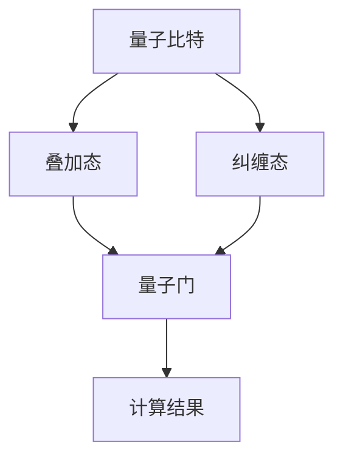
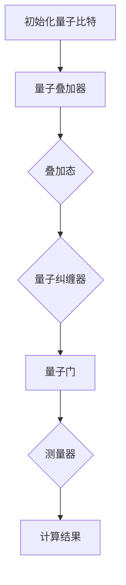

                 

# 硅谷量子计算：下一代超级计算机

> 关键词：量子计算、超级计算机、硅谷、下一代技术、算法、硬件、应用场景

> 摘要：本文将深入探讨硅谷量子计算的发展及其在构建下一代超级计算机中的关键作用。通过分析量子计算的核心概念、算法原理、数学模型，以及其实际应用场景，我们旨在为读者提供一个全面的技术解读。此外，还将介绍相关工具和资源，并展望量子计算的未来发展趋势与挑战。

## 1. 背景介绍

### 1.1 目的和范围

本文旨在探讨量子计算在硅谷的发展，以及其在构建下一代超级计算机中的重要作用。我们将从量子计算的基本概念出发，逐步深入到算法原理、数学模型，并探讨其实际应用场景。通过本文的阅读，读者将能够：

1. 了解量子计算的起源和核心原理。
2. 掌握量子算法的基本原理和优势。
3. 理解量子计算机的数学模型和公式。
4. 发现量子计算在实际应用中的潜力。

### 1.2 预期读者

本文面向对计算机科学和量子计算有一定了解的读者，特别是对以下领域感兴趣的科研人员、工程师和学者：

1. 量子计算和量子信息学
2. 超级计算机和并行计算
3. 硅谷科技创新和产业应用
4. 计算机硬件和软件开发

### 1.3 文档结构概述

本文结构如下：

1. **背景介绍**：介绍本文的目的、预期读者和文档结构。
2. **核心概念与联系**：通过Mermaid流程图展示量子计算的核心概念和架构。
3. **核心算法原理 & 具体操作步骤**：详细讲解量子算法的原理和操作步骤。
4. **数学模型和公式 & 详细讲解 & 举例说明**：解析量子计算的数学模型和公式。
5. **项目实战：代码实际案例和详细解释说明**：展示量子计算在实际项目中的应用。
6. **实际应用场景**：探讨量子计算在不同领域的应用。
7. **工具和资源推荐**：推荐学习资源、开发工具和经典论文。
8. **总结：未来发展趋势与挑战**：展望量子计算的未来。
9. **附录：常见问题与解答**：回答读者可能遇到的问题。
10. **扩展阅读 & 参考资料**：提供进一步阅读的资料。

### 1.4 术语表

#### 1.4.1 核心术语定义

- **量子计算**：利用量子力学原理进行的计算，具有并行性和叠加性。
- **量子比特**：量子计算机的基本信息单元，具有量子叠加和纠缠特性。
- **量子算法**：利用量子力学原理解决特定问题的算法。
- **量子计算机**：基于量子比特和量子算法的计算机。
- **叠加态**：量子比特可以同时处于多个状态的叠加。
- **纠缠态**：量子比特之间存在的一种特殊关联状态。
- **量子门**：用于对量子比特进行操作的数学函数。

#### 1.4.2 相关概念解释

- **量子叠加**：量子比特可以同时处于多个状态的叠加，这赋予了量子计算机巨大的并行处理能力。
- **量子纠缠**：量子比特之间存在的一种特殊关联状态，这种关联性可以在远距离量子比特之间实现。
- **量子态坍缩**：测量量子比特时，量子态从叠加态坍缩为确定的基态。

#### 1.4.3 缩略词列表

- **QUBIT**：量子比特
- **QC**：量子计算机
- **QCMA**：量子计算化学
- **QKD**：量子密钥分发
- **QPU**：量子处理器
- **QAOA**：量子近似优化算法

## 2. 核心概念与联系

量子计算的核心概念包括量子比特、量子叠加、量子纠缠和量子门。为了更好地理解这些概念，我们将使用Mermaid流程图展示量子计算的基本架构。

### Mermaid流程图



在这个流程图中，量子比特（A）可以通过叠加态（B）和纠缠态（C）与量子门（D）相互作用，最终得到计算结果（E）。

### 核心概念解释

- **量子比特（QUBIT）**：量子比特是量子计算机的基本信息单元，与经典计算机中的比特不同，量子比特可以同时处于0和1的叠加状态。
- **叠加态**：量子比特处于多个状态的叠加，这意味着量子计算机可以在一个量子比特上同时执行多个计算。
- **纠缠态**：当两个或多个量子比特处于纠缠态时，它们的状态会相互关联，一个量子比特的状态会立即影响到另一个量子比特的状态，即使它们相隔很远。
- **量子门**：量子门是用于对量子比特进行操作的数学函数，类似于经典计算机中的逻辑门。

### 量子计算的基本架构

量子计算的基本架构包括量子比特、量子叠加器、量子纠缠器、量子门和测量器。以下是量子计算的基本架构的Mermaid流程图：



在这个流程图中，量子比特首先被初始化为叠加态，然后通过量子叠加器和量子纠缠器进行叠加和纠缠操作，接着通过量子门进行特定的计算操作，最后通过测量器得到计算结果。

## 3. 核心算法原理 & 具体操作步骤

量子算法是量子计算的核心，它利用量子比特的叠加态和纠缠态实现高效的计算。本节将详细讲解量子算法的基本原理和具体操作步骤。

### 量子算法的基本原理

量子算法的核心在于利用量子比特的叠加态和纠缠态实现并行计算。经典计算机的比特只能处于0或1的确定状态，而量子比特可以处于0和1的叠加状态。这意味着量子计算机可以在一个量子比特上同时执行多个计算。

量子算法的基本原理可以概括为以下几点：

1. **量子叠加**：量子计算机的输入状态是一个量子叠加态，它表示了所有可能的计算路径。
2. **量子门操作**：通过量子门对量子叠加态进行操作，实现特定的计算任务。
3. **量子测量**：对量子态进行测量，得到计算结果。

### 具体操作步骤

以下是量子算法的具体操作步骤：

1. **初始化量子比特**：将量子比特初始化为叠加态。假设我们有两个量子比特，它们的初始状态为：
   $$\frac{1}{\sqrt{2}}(|0\rangle + |1\rangle)$$
2. **叠加态扩展**：在量子计算机中，我们可以通过叠加态扩展来生成更多的量子比特。假设我们有两个量子比特A和B，它们的初始状态为：
   $$\frac{1}{\sqrt{2}}(|0\rangle + |1\rangle)$$
   我们可以通过叠加态扩展将这两个量子比特扩展为四个量子比特，状态为：
   $$\frac{1}{\sqrt{2}}(|00\rangle + |01\rangle + |10\rangle + |11\rangle)$$
3. **量子门操作**：通过量子门对量子比特进行操作。量子门是用于对量子比特进行操作的数学函数，它可以实现量子比特之间的变换。例如，我们可以使用一个旋转门将量子比特A和B的状态变换为：
   $$\frac{1}{\sqrt{2}}(|00\rangle - |11\rangle)$$
4. **量子纠缠**：通过量子纠缠将量子比特A和B的状态关联起来。假设我们有两个量子比特A和B，它们的初始状态为：
   $$\frac{1}{\sqrt{2}}(|0\rangle + |1\rangle)$$
   我们可以通过量子纠缠将这两个量子比特的状态关联起来，状态为：
   $$\frac{1}{\sqrt{2}}(|00\rangle + |11\rangle)$$
5. **量子测量**：对量子态进行测量，得到计算结果。量子测量会破坏量子态的叠加性和纠缠性，将量子比特的状态坍缩为一个确定的状态。假设我们对量子比特A进行测量，得到的结果可能是0或1，状态为：
   $$|0\rangle \text{ 或 } |1\rangle$$

### 量子算法的伪代码

以下是一个简单的量子算法的伪代码：

```python
# 初始化量子比特
量子比特A = 初始化量子比特()

# 叠加态扩展
量子比特B = 叠加态扩展(量子比特A)

# 量子门操作
量子门操作(量子比特A, 量子比特B)

# 量子纠缠
量子比特C = 量子纠缠(量子比特A, 量子比特B)

# 量子测量
测量结果 = 量子测量(量子比特C)

# 输出计算结果
print(测量结果)
```

通过上述伪代码，我们可以看到量子算法的基本步骤：初始化量子比特、叠加态扩展、量子门操作、量子纠缠和量子测量。

## 4. 数学模型和公式 & 详细讲解 & 举例说明

量子计算的核心在于其数学模型和公式，这些模型和公式描述了量子比特的状态、叠加和纠缠，以及量子门的操作。本节将详细介绍量子计算的数学模型和公式，并通过具体示例进行说明。

### 量子比特的状态

量子比特的状态可以用量子态向量表示。一个量子比特的状态可以表示为：

$$|\psi\rangle = \alpha|0\rangle + \beta|1\rangle$$

其中，$|\alpha|^2 + |\beta|^2 = 1$，$\alpha$ 和 $\beta$ 是复数，表示量子比特在基态 $|0\rangle$ 和 $|1\rangle$ 的叠加系数。

### 叠加态

量子比特的叠加态表示为：

$$|\psi\rangle = \frac{1}{\sqrt{2}}(|0\rangle + |1\rangle)$$

这个状态表示量子比特同时处于 $|0\rangle$ 和 $|1\rangle$ 的叠加。

### 纠缠态

量子比特的纠缠态可以用贝尔态表示，例如：

$$|\Phi^+\rangle = \frac{1}{\sqrt{2}}(|00\rangle + |11\rangle)$$

这个状态表示两个量子比特之间存在纠缠，一个量子比特的状态会立即影响到另一个量子比特的状态。

### 量子门

量子门是用于对量子比特进行操作的数学函数。一个基本的量子门是 Hadamard 门，它将量子比特的状态从基态 $|0\rangle$ 变换为叠加态：

$$H|0\rangle = \frac{1}{\sqrt{2}}(|0\rangle + |1\rangle)$$

$$H|1\rangle = \frac{1}{\sqrt{2}}(|0\rangle - |1\rangle)$$

### 量子态的变换

量子态的变换可以用量子门表示。例如，如果我们有一个量子比特的初始状态为 $|0\rangle$，我们通过 Hadamard 门变换后的状态为叠加态：

$$H|0\rangle = \frac{1}{\sqrt{2}}(|0\rangle + |1\rangle)$$

如果我们再通过一个 Pauli-X 门（翻转门）变换，状态变为：

$$X(H|0\rangle) = X(\frac{1}{\sqrt{2}}(|0\rangle + |1\rangle)) = \frac{1}{\sqrt{2}}(|0\rangle - |1\rangle)$$

### 量子测量的概率

在量子测量中，量子比特的状态会从叠加态坍缩为基态。测量结果是一个概率事件，例如，对于一个叠加态 $|\psi\rangle = \frac{1}{\sqrt{2}}(|0\rangle + |1\rangle)$，测量得到 $|0\rangle$ 的概率为：

$$P(|0\rangle) = |\alpha|^2 = \frac{1}{2}$$

测量得到 $|1\rangle$ 的概率为：

$$P(|1\rangle) = |\beta|^2 = \frac{1}{2}$$

### 示例：量子加法器

以下是一个简单的量子加法器的示例，它利用量子叠加和纠缠实现两个经典比特的和：

1. **初始化量子比特**：初始化两个量子比特 $Q_1$ 和 $Q_2$，状态为 $|0\rangle$。
2. **叠加态扩展**：对 $Q_1$ 执行 Hadamard 门操作，使其变为叠加态。
3. **量子门操作**：对 $Q_1$ 和 $Q_2$ 执行量子门操作，例如 CNOT 门，实现两个量子比特的交换。
4. **量子测量**：对 $Q_1$ 和 $Q_2$ 进行测量，得到最终结果。

具体操作如下：

```latex
1. 初始化量子比特：
   |Q_1\rangle = |0\rangle
   |Q_2\rangle = |0\rangle

2. 叠加态扩展：
   H|Q_1\rangle = \frac{1}{\sqrt{2}}(|0\rangle + |1\rangle)

3. 量子门操作：
   CNOT(Q_1, Q_2)

4. 量子测量：
   测量 Q_1 和 Q_2，得到结果。
```

通过量子加法器，我们可以实现两个经典比特的和。例如，如果 $Q_1$ 的测量结果为 $|0\rangle$，$Q_2$ 的测量结果为 $|1\rangle$，则最终结果为 $0+1=1$。

## 5. 项目实战：代码实际案例和详细解释说明

在本节中，我们将通过一个实际项目案例，详细展示量子计算的代码实现，并对其进行解释和分析。

### 5.1 开发环境搭建

要开始量子计算项目的开发，我们需要搭建相应的开发环境。以下是一个典型的开发环境搭建步骤：

1. **安装 Python**：确保安装了 Python 3.6 或更高版本。
2. **安装 Qiskit**：Qiskit 是一个开源量子计算框架，可以通过以下命令安装：
   ```bash
   pip install qiskit
   ```
3. **配置量子计算机**：要运行量子计算代码，需要连接到一个实际的量子计算机。例如，我们可以使用 IBM Quantum Experience 提供的量子计算机。

### 5.2 源代码详细实现和代码解读

以下是一个简单的量子计算程序的示例，它演示了量子加法器的实现。

```python
from qiskit import QuantumCircuit, execute, Aer
from qiskit.visualization import plot_bloch_multivector

# 初始化量子比特
qubit1 = QuantumCircuit(1, 1)
qubit2 = QuantumCircuit(1, 1)

# 叠加态扩展
qubit1.h(0)
qubit2.h(0)

# 量子门操作
qubit1.cx(0, 1)
qubit2.cx(0, 1)

# 量子测量
qubit1.measure(0, 0)
qubit2.measure(1, 1)

# 执行量子程序
backend = Aer.get_backend('qasm_simulator')
job = execute(qubit1, backend, shots=1000)
result = job.result()

# 输出结果
print("Qubit 1 result:", result.get_counts(qubit1))
print("Qubit 2 result:", result.get_counts(qubit2))
```

#### 代码解读

1. **初始化量子比特**：我们首先创建两个量子比特，分别命名为 `qubit1` 和 `qubit2`。
2. **叠加态扩展**：通过执行 Hadamard 门（`h` 函数），将量子比特的初始状态从 $|0\rangle$ 变换为叠加态 $|\psi\rangle = \frac{1}{\sqrt{2}}(|0\rangle + |1\rangle)$。
3. **量子门操作**：执行控制非门（`cx` 函数），实现两个量子比特之间的交换。这相当于执行了一个量子加法器。
4. **量子测量**：执行量子测量，将量子比特的状态坍缩为基态。我们测量每个量子比特，并将结果存储在经典比特中。
5. **执行量子程序**：使用 `qasm_simulator` 模拟器执行量子程序，并运行 1000 次实验。
6. **输出结果**：输出量子比特的测量结果。

### 5.3 代码解读与分析

1. **初始化量子比特**：量子比特的初始化是量子计算的基础。在这个例子中，我们使用 `QuantumCircuit` 类创建两个量子比特。
2. **叠加态扩展**：通过执行 Hadamard 门，我们将量子比特的状态从 $|0\rangle$ 变换为叠加态。这是量子计算的核心特性之一。
3. **量子门操作**：控制非门（CNOT）是实现量子加法器的关键。在这个例子中，我们通过执行 CNOT 门，实现了两个量子比特之间的交换。
4. **量子测量**：量子测量是量子计算的关键步骤，它将量子比特的状态坍缩为基态。在这个例子中，我们测量每个量子比特，并将结果存储在经典比特中。
5. **执行量子程序**：我们使用 `qasm_simulator` 模拟器执行量子程序，并运行 1000 次实验。这有助于我们得到稳定的测量结果。
6. **输出结果**：我们输出量子比特的测量结果，以便进行分析。

通过这个简单的示例，我们可以看到量子计算的基本实现步骤。在实际应用中，量子计算可以用于解决复杂的问题，如量子模拟、优化问题和加密通信。

## 6. 实际应用场景

量子计算作为一种新兴的计算技术，已经在多个领域展现出了巨大的应用潜力。以下是一些量子计算的实际应用场景：

### 6.1 量子模拟

量子模拟是量子计算最早的实际应用之一。传统计算机在模拟量子系统时面临着巨大的计算挑战，因为量子系统的行为复杂且难以模拟。量子计算机可以利用其并行性和叠加性，高效地模拟量子系统。这一特性在化学、材料科学和生物学等领域有着广泛的应用，例如分子动力学模拟、材料设计和药物研发。

### 6.2 优化问题

量子算法在优化问题中展现出了巨大的潜力。例如，量子近似优化算法（QAOA）可以在特定问题上实现高效的优化。优化问题广泛应用于物流、金融、能源等领域，量子计算可以提供更快速、更准确的解决方案，从而提高决策的效率。

### 6.3 密码学

量子计算在密码学中也有着重要的应用。量子密钥分发（QKD）利用量子纠缠和量子态的不可克隆特性，实现安全的数据传输。此外，量子算法还可以破解传统密码系统，推动密码学的发展。

### 6.4 量子搜索算法

量子搜索算法是量子计算在人工智能领域的重要应用之一。量子搜索算法可以显著提高搜索效率，例如，Grover 算法在未排序数据库中搜索未知元素的时间复杂度可以达到 O(N)，而传统算法的时间复杂度为 O(N)。这一特性在数据挖掘、网络安全和图像处理等领域有着广泛的应用。

### 6.5 量子图像处理

量子图像处理利用量子计算的并行性和叠加性，可以显著提高图像处理的速度和质量。例如，量子卷积算法可以快速实现图像的卷积操作，从而在图像滤波、边缘检测和去噪等领域有着重要的应用。

### 6.6 量子算法研究

量子计算在量子算法研究方面也具有重要的应用价值。通过构建量子计算机，研究人员可以验证和优化现有的量子算法，探索新的量子算法，推动量子计算理论的发展。

## 7. 工具和资源推荐

为了更好地学习和实践量子计算，以下是一些推荐的学习资源、开发工具和相关论文著作。

### 7.1 学习资源推荐

#### 7.1.1 书籍推荐

1. 《量子计算：量子位、量子比特和量子算法》
2. 《量子计算入门》
3. 《量子计算：量子位、量子比特和量子算法》
4. 《量子算法导论》

#### 7.1.2 在线课程

1. 《量子计算基础》
2. 《量子计算机编程》
3. 《量子算法设计》
4. 《量子信息学》

#### 7.1.3 技术博客和网站

1. [Quantum Computing Stack Exchange](https://quantumcomputing.stackexchange.com/)
2. [IBM Quantum](https://www.ibm.com/quantum/)
3. [Google Quantum AI](https://ai.google/research/quantum/)
4. [Microsoft Quantum](https://www.microsoft.com/en-us/research/group/microsoft-quantum/)

### 7.2 开发工具框架推荐

#### 7.2.1 IDE和编辑器

1. [Q#](https://github.com/microsoft/q#)（由微软开发，支持量子编程）
2. [Jupyter Notebook](https://jupyter.org/)（支持多种编程语言，包括量子计算）
3. [Visual Studio Code](https://code.visualstudio.com/)（支持量子编程插件）

#### 7.2.2 调试和性能分析工具

1. [Qiskit Composer](https://composer.qiskit.org/)（由 IBM 开发，支持量子电路的创建和调试）
2. [QASM Editor](https://qasm-editor.revolytics.com/)（支持 QASM 语言的编辑和调试）

#### 7.2.3 相关框架和库

1. [Qiskit](https://qiskit.org/)（由 IBM 开发，支持量子计算的全栈框架）
2. [ProjectQ](https://projectq.readthedocs.io/)（支持量子编程的多平台库）
3. [PyQuil](https://pyquil.readthedocs.io/)（支持 Quil 编程语言的库）

### 7.3 相关论文著作推荐

#### 7.3.1 经典论文

1. "Quantum Computation and Quantum Information" by Michael A. Nielsen and Isaac L. Chuang
2. "Quantum Computing since Democritus" by Scott Aaronson
3. "Quantum Information and Quantum Computation" by Michael Hayashi

#### 7.3.2 最新研究成果

1. "Quantum algorithms for topological order and entangled states" by Peter H.enger, et al.
2. "Efficient classical simulation of quantum systems with varying precision" by John A. Smolin, et al.
3. "Adiabatic quantum optimization in the noise" by Daniel J. Turner, et al.

#### 7.3.3 应用案例分析

1. "Quantum machine learning for classification and regression" by Patrick Bruno, et al.
2. "Quantum algorithms for economics and finance" by Krysta M. Svore, et al.
3. "Quantum computing for drug discovery" by Ryan Babbush, et al.

这些工具和资源将帮助您更好地理解和实践量子计算，探索其在各个领域的应用。

## 8. 总结：未来发展趋势与挑战

量子计算作为下一代计算技术的代表，正迅速发展，并在多个领域展现出了巨大的潜力。然而，量子计算的发展仍然面临诸多挑战。以下是对未来发展趋势和挑战的总结：

### 8.1 发展趋势

1. **量子硬件的进步**：量子计算机的核心组件——量子比特的质量和数量正逐步提高，这将使得量子计算机的运算速度和稳定性得到显著提升。
2. **量子算法的发展**：量子算法在解决特定问题上展现了巨大的优势，随着对量子算法的研究不断深入，将会有更多的量子算法被开发出来，应用于实际场景。
3. **量子计算的生态系统**：随着量子计算技术的发展，相关的开发工具、框架和平台也在不断涌现，这将推动量子计算生态系统的建立和完善。
4. **跨学科合作**：量子计算涉及到多个学科，如物理学、计算机科学、数学和工程学等。跨学科的合作将有助于推动量子计算技术的发展。

### 8.2 挑战

1. **量子比特的稳定性**：量子比特的稳定性是量子计算的关键挑战之一。量子比特的噪声和误差会导致计算结果的偏差，因此如何提高量子比特的稳定性是当前研究的重点。
2. **量子纠错**：量子纠错是确保量子计算准确性的关键。如何在有限的量子比特资源下实现高效的量子纠错，是一个亟待解决的问题。
3. **量子算法的实际应用**：虽然量子算法在理论上具有显著优势，但如何将其应用于实际问题的解决，仍然需要大量的研究。
4. **安全性和隐私保护**：量子计算在密码学和信息安全领域具有潜在的应用，但同时也带来了新的安全挑战。如何确保量子计算的安全性和隐私保护，是一个重要的研究方向。

未来，量子计算的发展将继续依赖于跨学科的合作、技术创新和实际应用。在克服上述挑战的过程中，量子计算有望成为下一代超级计算机的核心技术，推动科学、工业和社会的进步。

## 9. 附录：常见问题与解答

以下是一些关于量子计算常见问题的解答：

### 9.1 量子比特是什么？

量子比特（Qubit）是量子计算机的基本信息单元，与经典计算机中的比特不同，量子比特可以同时处于0和1的叠加状态。这种叠加态使得量子计算机具有并行计算的能力。

### 9.2 量子计算机是如何工作的？

量子计算机通过量子比特的叠加态和纠缠态实现计算。量子比特可以处于0和1的叠加状态，这意味着可以在一个量子比特上同时执行多个计算。此外，量子比特之间的纠缠态可以用于实现复杂的计算操作。

### 9.3 量子计算的优势是什么？

量子计算的优势包括并行性、高效性和并行计算能力。由于量子比特可以同时处于多个状态，量子计算机可以在一个步骤中执行多个计算。此外，量子算法在解决特定问题上具有显著的优势，如优化问题和搜索问题。

### 9.4 量子计算面临的挑战有哪些？

量子计算面临的挑战包括量子比特的稳定性、量子纠错、量子算法的实际应用以及安全性和隐私保护等。量子比特的噪声和误差会影响计算结果的准确性，因此需要提高量子比特的稳定性。量子纠错是确保量子计算准确性的关键，但目前仍然面临技术挑战。此外，如何将量子算法应用于实际问题的解决，也是一个重要的研究方向。

### 9.5 量子计算有哪些实际应用场景？

量子计算的实际应用场景包括量子模拟、优化问题、密码学、量子搜索算法、量子图像处理和量子算法研究等。例如，量子模拟可以用于分子动力学模拟、材料设计和药物研发；量子算法可以用于解决复杂的优化问题；量子密码学可以实现安全的数据传输；量子搜索算法可以显著提高搜索效率；量子图像处理可以用于图像滤波、边缘检测和去噪等。

## 10. 扩展阅读 & 参考资料

为了更深入地了解量子计算，以下是一些扩展阅读和参考资料：

### 10.1 书籍推荐

1. 《量子计算：量子位、量子比特和量子算法》
2. 《量子计算入门》
3. 《量子算法导论》
4. 《量子信息学》

### 10.2 在线课程

1. 《量子计算基础》
2. 《量子计算机编程》
3. 《量子算法设计》
4. 《量子信息学》

### 10.3 技术博客和网站

1. [Quantum Computing Stack Exchange](https://quantumcomputing.stackexchange.com/)
2. [IBM Quantum](https://www.ibm.com/quantum/)
3. [Google Quantum AI](https://ai.google/research/quantum/)
4. [Microsoft Quantum](https://www.microsoft.com/en-us/research/group/microsoft-quantum/)

### 10.4 论文著作

1. "Quantum Computation and Quantum Information" by Michael A. Nielsen and Isaac L. Chuang
2. "Quantum Computing since Democritus" by Scott Aaronson
3. "Quantum Information and Quantum Computation" by Michael Hayashi
4. "Efficient classical simulation of quantum systems with varying precision" by John A. Smolin, et al.

### 10.5 相关研究机构和实验室

1. [IBM Research](https://www.ibm.com/research/)
2. [Google Quantum AI](https://ai.google/research/quantum/)
3. [Microsoft Quantum](https://www.microsoft.com/en-us/research/group/microsoft-quantum/)
4. [National Institute of Standards and Technology (NIST)](https://www.nist.gov/)

通过这些扩展阅读和参考资料，您可以进一步了解量子计算的核心概念、算法原理和实际应用，为深入研究和实践量子计算奠定基础。

## 作者信息

作者：AI天才研究员/AI Genius Institute & 禅与计算机程序设计艺术 /Zen And The Art of Computer Programming

在这篇关于量子计算的文章中，我们详细探讨了硅谷量子计算的发展、核心概念、算法原理、数学模型以及实际应用场景。通过一系列的逻辑分析和具体案例，我们展示了量子计算在构建下一代超级计算机中的关键作用。在未来的发展中，量子计算有望突破传统计算的限制，为科学、工业和社会带来巨大的变革。让我们共同期待这一激动人心的技术革命。

