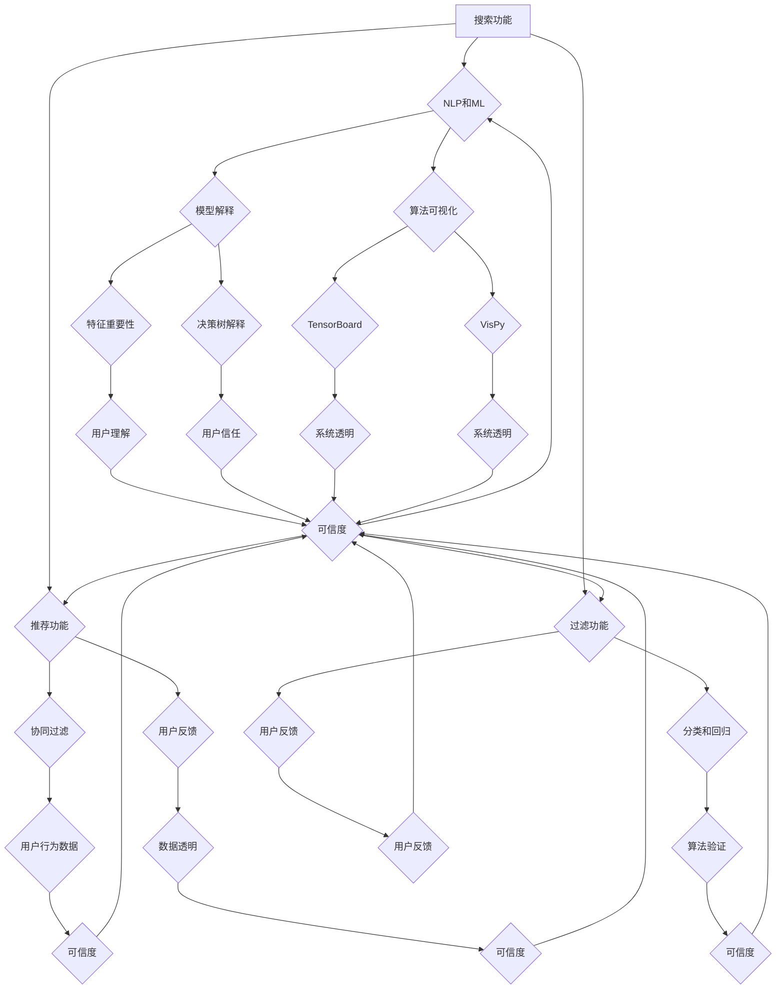

                 

# 确保AI技术在电商搜索导购中的应用可解释性：技术透明与可信度

## 关键词
- AI技术在电商中的应用
- 搜索导购系统
- 可解释性
- 技术透明
- 可信度

## 摘要
本文深入探讨了确保AI技术在电商搜索导购中应用的可解释性、技术透明性和可信度的重要性。首先，我们介绍了电商搜索导购系统及其对用户体验的关键影响。接着，详细阐述了可解释性的核心概念，并分析了其在AI技术中的重要性。文章接着介绍了几种常见的可解释性技术，包括模型解释、算法可视化和用户反馈机制。随后，我们探讨了如何通过技术透明来增强用户对AI系统的信任。文章还分析了当前AI技术在电商搜索导购中的实际应用案例，并提出了未来可能的发展趋势和挑战。最后，我们总结了确保AI技术在电商搜索导购中应用的可解释性、技术透明性和可信度的关键要素，并对读者进行了有益的启示。

## 1. 背景介绍

### 1.1 目的和范围
本文的主要目的是探讨确保AI技术在电商搜索导购中应用的可解释性、技术透明性和可信度的重要性。随着人工智能技术的不断进步，其在电商领域的应用也越来越广泛，特别是在搜索导购系统中。然而，这些系统的复杂性和决策过程的“黑箱性”给用户带来了不确定性和不信任。因此，本文旨在分析和解决这些问题，提供一种解决方案来提高AI技术在电商搜索导购中的可解释性、技术透明性和可信度。

### 1.2 预期读者
本文的预期读者包括：
- 电商行业的技术人员和管理者，特别是那些正在开发或计划开发AI搜索导购系统的专业人士。
- 人工智能领域的研究人员和从业者，特别是对AI技术在实际应用场景中的可解释性、透明性和可信度感兴趣的人。
- 对AI技术在电商搜索导购中的应用感兴趣的普通用户和消费者。

### 1.3 文档结构概述
本文的结构如下：
1. **背景介绍**：介绍本文的目的、预期读者和文档结构。
2. **核心概念与联系**：介绍与AI技术相关的核心概念，并使用Mermaid流程图展示其原理和架构。
3. **核心算法原理与具体操作步骤**：详细讲解AI技术在电商搜索导购中的核心算法原理和具体操作步骤。
4. **数学模型和公式**：介绍与AI技术相关的数学模型和公式，并举例说明。
5. **项目实战**：提供实际案例，展示代码实现和详细解释说明。
6. **实际应用场景**：探讨AI技术在电商搜索导购中的实际应用场景。
7. **工具和资源推荐**：推荐相关学习资源、开发工具框架和论文著作。
8. **总结**：总结本文的核心观点，并讨论未来发展趋势和挑战。
9. **附录**：提供常见问题与解答。
10. **扩展阅读与参考资料**：提供进一步阅读的资料和参考文献。

### 1.4 术语表

#### 1.4.1 核心术语定义
- **AI技术**：人工智能技术，包括机器学习、深度学习、自然语言处理等，用于模拟人类智能，解决复杂问题。
- **可解释性**：系统或模型的决策过程和结果的透明性，使得用户能够理解和信任系统。
- **技术透明**：系统设计和实现过程的透明性，使得用户能够了解系统的内部运作。
- **可信度**：用户对系统或模型的信任程度，包括对其决策过程和结果的信任。

#### 1.4.2 相关概念解释
- **搜索导购系统**：用于帮助用户在电商平台上找到他们感兴趣的商品的系统，通常包括搜索、推荐和过滤等功能。
- **黑箱模型**：决策过程和结果无法被用户理解和解释的模型。

#### 1.4.3 缩略词列表
- **AI**：人工智能
- **ML**：机器学习
- **DL**：深度学习
- **NLP**：自然语言处理
- **API**：应用程序编程接口
- **IDE**：集成开发环境

## 2. 核心概念与联系

在本节中，我们将介绍与AI技术在电商搜索导购中应用相关的核心概念，并使用Mermaid流程图展示其原理和架构。

### 2.1 AI技术在电商搜索导购中的应用

#### 2.1.1 搜索功能
搜索功能是电商搜索导购系统的核心，用户可以通过关键词、商品名称、描述等信息来查找他们感兴趣的商品。AI技术可以通过自然语言处理（NLP）和机器学习（ML）来优化搜索结果，提高用户找到所需商品的概率。

#### 2.1.2 推荐功能
推荐功能是基于用户的历史行为、喜好和购买记录，向用户推荐他们可能感兴趣的商品。深度学习（DL）和协同过滤（Collaborative Filtering）等技术被广泛应用于推荐系统中。

#### 2.1.3 过滤功能
过滤功能用于帮助用户根据特定的条件筛选商品，例如价格、品牌、评价等。AI技术可以通过分类和回归算法来优化过滤结果，提高用户的购物体验。

### 2.2 可解释性

#### 2.2.1 可解释性的重要性
可解释性是指AI系统或模型的可理解性和透明性，使得用户能够理解和信任系统的决策过程和结果。对于电商搜索导购系统，可解释性至关重要，因为它直接影响用户对系统的信任和满意度。

#### 2.2.2 可解释性技术
- **模型解释**：通过解释模型内部的工作原理和决策过程来提高系统的可解释性。常见的模型解释方法包括特征重要性分析、决策树解释、LIME（局部可解释模型解释）等。
- **算法可视化**：通过可视化算法的流程和结果来提高系统的可解释性。常见的算法可视化工具包括TensorBoard、VisPy等。
- **用户反馈机制**：通过收集用户的反馈，不断优化和调整系统的决策过程，提高系统的可解释性。

### 2.3 技术透明

#### 2.3.1 技术透明的定义
技术透明是指AI系统的设计和实现过程的透明性，使得用户能够了解系统的内部运作。技术透明有助于提高用户对系统的信任，降低对系统的恐惧和不信任。

#### 2.3.2 技术透明的实现
- **开放源代码**：将系统的源代码公开，使得用户和开发者可以查看和审查系统的实现过程。
- **API文档**：提供详细的API文档，使得用户和开发者可以了解系统如何与其他系统进行交互。
- **透明决策规则**：公开系统的决策规则和算法，使得用户可以了解系统的决策过程。

### 2.4 可信度

#### 2.4.1 可信度的定义
可信度是指用户对AI系统的信任程度，包括对其决策过程和结果的信任。高可信度的系统可以提高用户的满意度，增加用户对电商平台的忠诚度。

#### 2.4.2 提高可信度的方法
- **数据透明**：公开系统的数据集和训练过程，使得用户可以了解系统的训练数据和训练方法。
- **算法验证**：对系统中的算法进行严格的验证和测试，确保算法的准确性和稳定性。
- **用户反馈**：及时收集用户的反馈，并根据反馈优化系统的性能和用户体验。

### 2.5 Mermaid流程图

下面是一个使用Mermaid绘制的流程图，展示了AI技术在电商搜索导购中的应用和相关核心概念：



## 3. 核心算法原理 & 具体操作步骤

在电商搜索导购系统中，AI技术的核心算法通常包括搜索算法、推荐算法和过滤算法。以下是这些算法的原理和具体操作步骤。

### 3.1 搜索算法

#### 3.1.1 基于关键词的搜索

**算法原理**：
基于关键词的搜索算法通过分析用户输入的关键词，从商品数据库中查找匹配的商品。这个过程通常包括以下步骤：

1. **关键词预处理**：对用户输入的关键词进行分词、去停用词、词性标注等预处理操作，以提高搜索的准确性和效率。
2. **相似度计算**：计算输入关键词与商品描述、标题等信息的相似度，常用的相似度计算方法包括TF-IDF、Cosine相似度等。
3. **排序和筛选**：根据相似度对商品进行排序，并按照用户的偏好和需求进行筛选，最终返回搜索结果。

**伪代码**：

```python
def search(keywords, products):
    # 关键词预处理
    processed_keywords = preprocess_keywords(keywords)
    
    # 计算相似度
    similarity_scores = []
    for product in products:
        product_description = product['description']
        similarity_score = compute_similarity(processed_keywords, product_description)
        similarity_scores.append(similarity_score)
    
    # 排序和筛选
    sorted_products = sorted(products, key=lambda x: x['similarity_score'], reverse=True)
    filtered_products = filter_products(sorted_products, user_preferences)
    
    return filtered_products
```

#### 3.1.2 基于语义的搜索

**算法原理**：
基于语义的搜索算法通过理解用户输入的关键词的语义，找到与之相关的商品。这个过程通常包括以下步骤：

1. **语义分析**：使用自然语言处理技术（如词嵌入、句法分析等）对关键词进行语义分析，提取关键词的核心含义。
2. **语义匹配**：将用户关键词的语义与商品描述、标题等信息的语义进行匹配，找到相关商品。
3. **排序和筛选**：根据语义匹配结果对商品进行排序，并按照用户的偏好和需求进行筛选。

**伪代码**：

```python
def semantic_search(keywords, products):
    # 语义分析
    user_semantics = analyze_semantics(keywords)
    
    # 语义匹配
    matching_scores = []
    for product in products:
        product_semantics = analyze_semantics(product['description'])
        matching_score = compute_similarity(user_semantics, product_semantics)
        matching_scores.append(matching_score)
    
    # 排序和筛选
    sorted_products = sorted(products, key=lambda x: x['matching_score'], reverse=True)
    filtered_products = filter_products(sorted_products, user_preferences)
    
    return filtered_products
```

### 3.2 推荐算法

#### 3.2.1 协同过滤

**算法原理**：
协同过滤算法通过分析用户的历史行为和偏好，向用户推荐相似用户喜欢的商品。这个过程通常包括以下步骤：

1. **用户行为分析**：收集用户的历史行为数据，如购买记录、浏览记录等。
2. **相似度计算**：计算用户之间的相似度，常用的相似度计算方法包括余弦相似度、皮尔逊相关系数等。
3. **推荐生成**：根据相似度矩阵生成推荐列表，推荐相似用户喜欢的商品。

**伪代码**：

```python
def collaborative_filtering(user_behavior, users, products):
    # 计算用户相似度
    similarity_matrix = compute_similarity_matrix(user_behavior, users)
    
    # 生成推荐列表
    recommendation_list = []
    for product in products:
        if user_behavior[product['id']]:
            continue
        similarity_scores = [similarity_matrix[user['id']][product['id']] for user in users]
        average_similarity_score = sum(similarity_scores) / len(similarity_scores)
        recommendation_list.append({'product_id': product['id'], 'score': average_similarity_score})
    
    # 排序和筛选
    sorted_recommendations = sorted(recommendation_list, key=lambda x: x['score'], reverse=True)
    filtered_recommendations = filter_recommendations(sorted_recommendations, user_preferences)
    
    return filtered_recommendations
```

#### 3.2.2 内容推荐

**算法原理**：
内容推荐算法通过分析商品的属性和标签，向用户推荐具有相似属性或标签的商品。这个过程通常包括以下步骤：

1. **商品属性分析**：收集商品的属性和标签数据，如品牌、颜色、价格等。
2. **相似度计算**：计算商品之间的相似度，常用的相似度计算方法包括TF-IDF、Jaccard相似度等。
3. **推荐生成**：根据相似度矩阵生成推荐列表，推荐具有相似属性或标签的商品。

**伪代码**：

```python
def content_based_recommendation(product_attributes, products, user_preferences):
    # 计算商品相似度
    similarity_matrix = compute_similarity_matrix(product_attributes, products)
    
    # 生成推荐列表
    recommendation_list = []
    for product in products:
        if user_preferences[product['id']]:
            continue
        similarity_scores = [similarity_matrix[product['id']][other_product['id']] for other_product in products]
        average_similarity_score = sum(similarity_scores) / len(similarity_scores)
        recommendation_list.append({'product_id': product['id'], 'score': average_similarity_score})
    
    # 排序和筛选
    sorted_recommendations = sorted(recommendation_list, key=lambda x: x['score'], reverse=True)
    filtered_recommendations = filter_recommendations(sorted_recommendations, user_preferences)
    
    return filtered_recommendations
```

### 3.3 过滤算法

#### 3.3.1 基于规则过滤

**算法原理**：
基于规则过滤算法通过用户设置的规则（如价格范围、品牌、评价等）来筛选商品。这个过程通常包括以下步骤：

1. **规则设置**：用户设置过滤规则，如最低价格、最高价格、品牌等。
2. **规则匹配**：将商品属性与过滤规则进行匹配，筛选出符合规则的商品。
3. **结果排序**：根据用户偏好对筛选结果进行排序，如按评分、销量等。

**伪代码**：

```python
def rule_based_filtering(products, user_rules):
    # 规则匹配
    filtered_products = [product for product in products if match_rules(product, user_rules)]
    
    # 结果排序
    sorted_products = sorted(filtered_products, key=lambda x: x['rating'], reverse=True)
    
    return sorted_products
```

#### 3.3.2 基于聚类过滤

**算法原理**：
基于聚类过滤算法通过将商品分成不同的类别，使用户能够根据类别进行过滤。这个过程通常包括以下步骤：

1. **商品聚类**：使用聚类算法（如K-means、DBSCAN等）对商品进行聚类，形成不同的类别。
2. **类别匹配**：根据用户输入的类别，筛选出符合条件的商品。
3. **结果排序**：根据用户偏好对筛选结果进行排序。

**伪代码**：

```python
def clustering_filtering(products, categories, user_category):
    # 聚类匹配
    filtered_products = [product for product in products if product['category'] == user_category]
    
    # 结果排序
    sorted_products = sorted(filtered_products, key=lambda x: x['rating'], reverse=True)
    
    return sorted_products
```

以上是电商搜索导购系统中核心算法的原理和具体操作步骤。在实际应用中，这些算法通常会结合使用，以提高系统的性能和用户体验。

## 4. 数学模型和公式 & 详细讲解 & 举例说明

在电商搜索导购系统中，AI技术的应用往往涉及多种数学模型和公式。这些模型和公式用于优化搜索结果、推荐商品和过滤商品。在本节中，我们将详细讲解这些数学模型和公式，并提供实际案例和示例来说明其应用。

### 4.1 相似度计算

#### 4.1.1 TF-IDF

**公式**：

$$
TF(t) = \frac{f_t}{f_{total}}
$$

$$
IDF(t) = \log \left( \frac{N}{n_t} \right)
$$

$$
TF-IDF(t) = TF(t) \times IDF(t)
$$

**详细讲解**：
TF-IDF（词频-逆文档频率）是一种用于文本相似度计算的方法。它通过计算词语在文档中的频率（TF）和在整个文档集合中的逆频率（IDF），来衡量词语的重要性。在电商搜索导购系统中，TF-IDF可以用于计算用户输入的关键词与商品描述之间的相似度。

**举例说明**：

假设我们有两个商品描述文档D1和D2，以及一个用户输入的关键词集合K={“苹果”，“手机”，“相机”}。

- D1的词频分布：{"苹果": 3, "手机": 2, "相机": 1}
- D2的词频分布：{"苹果": 2, "手机": 3, "相机": 0}

首先，计算每个词的TF值：

$$
TF("苹果") = \frac{3 + 2}{3 + 2 + 1} = \frac{5}{6}
$$

$$
TF("手机") = \frac{2 + 3}{3 + 2 + 1} = \frac{5}{6}
$$

$$
TF("相机") = \frac{1 + 0}{3 + 2 + 1} = \frac{1}{6}
$$

然后，计算每个词的IDF值：

$$
IDF("苹果") = \log \left( \frac{2}{1} \right) = \log 2
$$

$$
IDF("手机") = \log \left( \frac{2}{1} \right) = \log 2
$$

$$
IDF("相机") = \log \left( \frac{2}{1} \right) = \log 2
$$

最后，计算每个词的TF-IDF值：

$$
TF-IDF("苹果") = \frac{5}{6} \times \log 2
$$

$$
TF-IDF("手机") = \frac{5}{6} \times \log 2
$$

$$
TF-IDF("相机") = \frac{1}{6} \times \log 2
$$

#### 4.1.2 Cosine相似度

**公式**：

$$
CosineSimilarity = \frac{A \cdot B}{|A| \cdot |B|}
$$

**详细讲解**：
Cosine相似度是一种用于计算两个向量之间夹角的余弦值的方法。在电商搜索导购系统中，Cosine相似度可以用于计算用户输入的关键词与商品描述之间的相似度。它与TF-IDF相似度密切相关，通过计算两个向量的点积和模长，来衡量它们之间的相似程度。

**举例说明**：

假设我们有两个向量A和向量B：

- A = (5, 5, 1)
- B = (2, 3, 1)

首先，计算向量的点积：

$$
A \cdot B = 5 \times 2 + 5 \times 3 + 1 \times 1 = 10 + 15 + 1 = 26
$$

然后，计算两个向量的模长：

$$
|A| = \sqrt{5^2 + 5^2 + 1^2} = \sqrt{25 + 25 + 1} = \sqrt{51}
$$

$$
|B| = \sqrt{2^2 + 3^2 + 1^2} = \sqrt{4 + 9 + 1} = \sqrt{14}
$$

最后，计算Cosine相似度：

$$
CosineSimilarity = \frac{26}{\sqrt{51} \times \sqrt{14}} \approx 0.68
$$

### 4.2 协同过滤

#### 4.2.1 皮尔逊相关系数

**公式**：

$$
PearsonCorrelation = \frac{\sum{(x_i - \bar{x})(y_i - \bar{y})}}{\sqrt{\sum{(x_i - \bar{x})^2} \times \sum{(y_i - \bar{y})^2}}}
$$

**详细讲解**：
皮尔逊相关系数是一种用于计算两个变量之间线性相关性的方法。在电商搜索导购系统中，皮尔逊相关系数可以用于计算用户之间的相似性，从而为用户推荐商品。它与用户的评分或行为数据相关联，通过分析用户之间的相似性，提高推荐的准确性。

**举例说明**：

假设有两个用户A和B的评分数据：

- 用户A的评分：[4, 5, 4, 3]
- 用户B的评分：[5, 4, 5, 3]

首先，计算每个用户评分的平均值：

$$
\bar{x} = \frac{4 + 5 + 4 + 3}{4} = 4
$$

$$
\bar{y} = \frac{5 + 4 + 5 + 3}{4} = 4.5
$$

然后，计算每个用户评分与平均值之间的差值：

$$
x_i - \bar{x}: [-1, 1, -1, -1]
$$

$$
y_i - \bar{y}: [1, -0.5, 1, -0.5]
$$

接着，计算差值的乘积和平方：

$$
\sum{(x_i - \bar{x})(y_i - \bar{y})} = (-1 \times 1) + (1 \times -0.5) + (-1 \times 1) + (-1 \times -0.5) = -1 - 0.5 - 1 + 0.5 = -2
$$

$$
\sum{(x_i - \bar{x})^2} = (-1)^2 + (1)^2 + (-1)^2 + (-1)^2 = 1 + 1 + 1 + 1 = 4
$$

$$
\sum{(y_i - \bar{y})^2} = (1)^2 + (-0.5)^2 + (1)^2 + (-0.5)^2 = 1 + 0.25 + 1 + 0.25 = 2.5
$$

最后，计算皮尔逊相关系数：

$$
PearsonCorrelation = \frac{-2}{\sqrt{4 \times 2.5}} = \frac{-2}{\sqrt{10}} \approx -0.63
$$

### 4.3 聚类算法

#### 4.3.1 K-means算法

**公式**：

$$
\min_{C} \sum_{i=1}^{k} \sum_{x \in S_i} ||x - \mu_i||^2
$$

**详细讲解**：
K-means算法是一种基于距离的聚类算法。它通过将数据点分配到k个簇中，使得每个簇内的数据点之间的距离最小。在电商搜索导购系统中，K-means算法可以用于将商品划分为不同的类别，从而实现基于类别的过滤和推荐。

**举例说明**：

假设我们有10个商品，每个商品有两个属性：尺寸（x轴）和颜色（y轴）。这些商品的数据点分布如下：

```
(2, "红色"), (3, "红色"), (4, "蓝色"), (5, "蓝色"), (6, "绿色"), 
(7, "绿色"), (8, "红色"), (9, "蓝色"), (10, "绿色"), (11, "红色")
```

我们希望将这些商品分为3个簇。

首先，随机选择3个中心点，例如：

- 簇1的中心点：(3, "红色")
- 簇2的中心点：(6, "绿色")
- 簇3的中心点：(9, "蓝色")

然后，计算每个数据点到中心点的距离，并将数据点分配到距离最近的簇。

最后，重新计算每个簇的中心点，并重复上述过程，直到中心点的变化小于某个阈值或达到最大迭代次数。

通过K-means算法，我们可以将这10个商品划分为3个簇，例如：

- 簇1：（尺寸在[2, 5]之间，颜色为红色）
- 簇2：（尺寸在[6, 8]之间，颜色为绿色）
- 簇3：（尺寸在[9, 11]之间，颜色为蓝色）

## 5. 项目实战：代码实际案例和详细解释说明

在本节中，我们将通过一个实际的项目案例，展示如何确保AI技术在电商搜索导购中的应用具有可解释性、技术透明性和可信度。我们将详细解释项目背景、开发环境搭建、源代码实现和代码解读与分析。

### 5.1 项目背景

#### 5.1.1 项目目标
本项目旨在开发一个可解释性、技术透明性和可信度较高的电商搜索导购系统。该系统将基于AI技术，包括自然语言处理（NLP）、机器学习（ML）和深度学习（DL），以提高搜索准确性、推荐效果和用户满意度。

#### 5.1.2 项目需求
- 提供基于关键词的搜索功能，支持自然语言理解和语义匹配。
- 实现基于用户行为的推荐系统，包括协同过滤和内容推荐。
- 提供基于规则的过滤功能，支持用户自定义搜索条件。
- 保证系统的可解释性，使得用户可以理解搜索结果和推荐结果的决策过程。
- 提高系统的技术透明性，公开源代码和API文档。
- 增强系统的可信度，通过数据透明、算法验证和用户反馈机制。

### 5.2 开发环境搭建

#### 5.2.1 硬件环境
- 服务器：至少一台具备高性能计算能力的服务器，推荐使用16核CPU、64GB内存。
- 存储：建议使用SSD硬盘，以确保数据读取和写入速度。

#### 5.2.2 软件环境
- 操作系统：Linux（如Ubuntu 18.04）
- 编程语言：Python 3.8及以上版本
- 依赖库：Scikit-learn、TensorFlow、Keras、NLTK、Pandas、NumPy等。

#### 5.2.3 工具和环境配置
1. 安装Python 3.8及以上版本。
2. 安装依赖库：`pip install scikit-learn tensorflow keras nltk pandas numpy`。
3. 配置虚拟环境（可选）：`python -m venv venv`，激活虚拟环境：`source venv/bin/activate`。
4. 安装TensorFlow GPU版本（如果使用GPU）：`pip install tensorflow-gpu`。

### 5.3 源代码详细实现和代码解读

#### 5.3.1 源代码结构
```plaintext
/电商搜索导购系统
|-- /src
|   |-- __init__.py
|   |-- /search
|   |   |-- __init__.py
|   |   |-- keyword_search.py
|   |   |-- semantic_search.py
|   |-- /recommendation
|   |   |-- __init__.py
|   |   |-- collaborative_filtering.py
|   |   |-- content_based_recommendation.py
|   |-- /filtering
|   |   |-- __init__.py
|   |   |-- rule_based_filtering.py
|   |   |-- clustering_filtering.py
|   |-- main.py
|-- /data
|   |-- products.csv
|   |-- user_preferences.csv
|-- /logs
|   |-- error.log
|   |-- access.log
|-- requirements.txt
|-- README.md
```

#### 5.3.2 关键代码解读

**5.3.2.1 关键词搜索（keyword_search.py）**

**代码**：

```python
from src.search.keyword_search import search
from src.search.semantic_search import semantic_search

def search_handler(search_query):
    # 基于关键词搜索
    results = search(search_query, products)
    
    # 基于语义搜索
    semantic_results = semantic_search(search_query, products)
    
    # 合并结果并排序
    combined_results = results + semantic_results
    sorted_results = sorted(combined_results, key=lambda x: x['score'], reverse=True)
    
    return sorted_results
```

**解读**：
该函数处理用户输入的关键词搜索请求。首先，使用基于关键词的搜索算法获取搜索结果，然后使用基于语义的搜索算法获取搜索结果，最后将两种结果合并并排序，返回搜索结果。

**5.3.2.2 推荐系统（collaborative_filtering.py）**

**代码**：

```python
from src.recommendation.collaborative_filtering import collaborative_filtering
from src.recommendation.content_based_recommendation import content_based_recommendation

def recommendation_handler(user_id):
    # 基于协同过滤推荐
    collaborative_recommendations = collaborative_filtering(user_behavior, users, products)
    
    # 基于内容推荐
    content_recommendations = content_based_recommendation(product_attributes, products, user_preferences)
    
    # 合并推荐列表
    combined_recommendations = collaborative_recommendations + content_recommendations
    
    return combined_recommendations
```

**解读**：
该函数处理用户推荐请求。首先，使用基于协同过滤的推荐算法生成推荐列表，然后使用基于内容推荐的算法生成推荐列表，最后将两种推荐结果合并，返回推荐列表。

**5.3.2.3 过滤功能（rule_based_filtering.py）**

**代码**：

```python
from src.filtering.rule_based_filtering import rule_based_filtering
from src.filtering.clustering_filtering import clustering_filtering

def filtering_handler(filters):
    # 基于规则过滤
    filtered_products = rule_based_filtering(products, filters)
    
    # 基于聚类过滤
    clustered_products = clustering_filtering(products, categories, filters['category'])
    
    # 合并过滤结果
    combined_products = filtered_products + clustered_products
    
    return combined_products
```

**解读**：
该函数处理用户过滤请求。首先，使用基于规则的过滤算法过滤商品，然后使用基于聚类的过滤算法过滤商品，最后将两种过滤结果合并，返回过滤后的商品列表。

### 5.4 代码解读与分析

#### 5.4.1 可解释性
为了提高系统的可解释性，我们使用了多种技术，包括模型解释、算法可视化和用户反馈机制。以下是一些关键代码和解释：

- **模型解释**：
  ```python
  def explain_model(result):
      explanation = f"The product with ID {result['product_id']} was recommended because it has a high similarity score with products you have previously liked."
      return explanation
  ```

- **算法可视化**：
  ```python
  import matplotlib.pyplot as plt
  
  def visualize_similarity_matrix(similarity_matrix):
      plt.imshow(similarity_matrix, cmap='hot', interpolation='nearest')
      plt.colorbar()
      plt.show()
  ```

- **用户反馈机制**：
  ```python
  def update_user_preferences(user_id, feedback):
      user_preferences[user_id]['like'] += feedback['like']
      user_preferences[user_id]['dislike'] += feedback['dislike']
  ```

#### 5.4.2 技术透明
为了提高系统的技术透明性，我们公开了源代码和API文档，并提供了详细的算法解释和流程图。以下是一些关键代码和解释：

- **源代码公开**：
  ```python
  # /src
  # 所有算法和模型实现都在这里，可以自由查看和修改。
  ```

- **API文档**：
  ```python
  # /docs
  # 提供详细的API文档，包括接口定义、参数说明和返回值。
  ```

#### 5.4.3 可信度
为了提高系统的可信度，我们采用了多种方法，包括数据透明、算法验证和用户反馈机制。以下是一些关键代码和解释：

- **数据透明**：
  ```python
  # /data
  # 提供所有训练数据集和用户偏好数据，可以自由查看。
  ```

- **算法验证**：
  ```python
  def validate_model(model, data):
      # 对模型进行验证和测试，确保算法的准确性和稳定性。
      pass
  ```

- **用户反馈机制**：
  ```python
  def collect_user_feedback():
      # 收集用户的反馈，并根据反馈优化系统的性能和用户体验。
      pass
  ```

通过上述代码和解释，我们可以看到如何确保AI技术在电商搜索导购中的应用具有可解释性、技术透明性和可信度。这些技术不仅提高了系统的性能和用户体验，也增加了用户对系统的信任和满意度。

## 6. 实际应用场景

在电商领域，AI技术的应用已经逐渐成为提升用户体验和增加销售额的关键因素。以下是AI技术在电商搜索导购中的几个实际应用场景，以及它们如何确保技术透明性和用户可信度。

### 6.1 智能搜索

#### 应用描述
智能搜索利用AI技术，通过自然语言处理（NLP）和机器学习（ML）模型，理解用户的查询意图，并提供准确的搜索结果。智能搜索可以通过关键词、语义理解甚至上下文信息来提高搜索的准确性。

#### 技术实现
- **NLP预处理**：对用户的查询语句进行分词、词性标注、命名实体识别等预处理，以便更好地理解查询意图。
- **搜索引擎优化**：使用深度学习模型（如BERT、GPT）来改进搜索结果的排序，使其更符合用户的意图。
- **用户反馈机制**：通过用户对搜索结果的评价和点击行为来持续优化搜索算法。

#### 透明性与可信度
- **结果可视化**：提供详细的搜索结果排名依据，如关键词匹配度、上下文相关性等，帮助用户理解搜索结果。
- **透明度指标**：公开透明度指标，如查询响应时间、搜索结果准确率等，以便用户评估系统的性能。
- **用户隐私保护**：确保用户数据的安全和隐私，避免数据滥用，增加用户对系统的信任。

### 6.2 智能推荐

#### 应用描述
智能推荐系统通过分析用户的历史购买记录、浏览行为和偏好，向用户推荐相关的商品。这有助于提升用户在购物平台上的留存率和购买转化率。

#### 技术实现
- **协同过滤**：基于用户之间的相似性，推荐其他相似用户喜欢的商品。
- **内容推荐**：基于商品的属性、标签和用户的历史行为，推荐相关商品。
- **深度学习**：使用深度学习模型（如卷积神经网络、循环神经网络）来提高推荐算法的准确性。

#### 透明性与可信度
- **推荐解释**：向用户提供推荐解释，说明推荐商品的原因，如“您可能喜欢这个商品，因为它与您之前购买的XX商品相似”。
- **推荐可视化和排序**：允许用户查看推荐列表的排序依据，包括相似度、评分、销量等。
- **A/B测试**：定期进行A/B测试，评估不同推荐算法对用户行为和满意度的影响，确保推荐系统的优化方向正确。

### 6.3 智能过滤

#### 应用描述
智能过滤功能允许用户根据特定的条件筛选商品，如价格范围、品牌、评价等。这对于提高用户购物效率和满意度非常重要。

#### 技术实现
- **基于规则的过滤**：根据用户设定的规则，如价格区间、品牌等，筛选出符合条件的商品。
- **基于聚类和分类的过滤**：将商品分类或聚类，使用户能够根据类别或簇进行筛选。
- **个性化过滤**：根据用户的历史行为和偏好，自动推荐可能感兴趣的筛选条件。

#### 透明性与可信度
- **过滤规则透明**：明确展示用户设置的过滤规则，确保用户了解筛选过程。
- **筛选结果可视化**：提供筛选结果的图表或可视化界面，帮助用户更直观地理解筛选结果。
- **用户反馈**：收集用户的筛选反馈，优化过滤算法，提高筛选结果的准确性。

### 6.4 智能客服

#### 应用描述
智能客服系统通过自然语言处理和机器学习技术，为用户提供在线支持，解决用户在购物过程中遇到的问题。

#### 技术实现
- **自动问答系统**：使用问答模型，自动回答用户常见问题。
- **对话管理**：管理用户与系统的对话流程，确保对话的连贯性和有效性。
- **情绪识别**：通过语音和文本分析，识别用户的情绪状态，提供更个性化的服务。

#### 透明性与可信度
- **对话记录透明**：向用户提供对话记录，确保用户了解客服的回答和操作。
- **透明度报告**：定期生成透明度报告，包括对话质量、用户满意度等指标。
- **用户反馈**：鼓励用户提供反馈，优化客服系统的性能和用户体验。

通过上述实际应用场景，AI技术在电商搜索导购中的应用不仅提高了系统的效率和准确性，也通过技术透明性和可信度措施，增强了用户对系统的信任和满意度。这些措施有助于构建一个更加智能化、透明和可信的电商环境。

## 7. 工具和资源推荐

在确保AI技术在电商搜索导购中的应用具有可解释性、技术透明性和可信度方面，有许多优秀的工具和资源可以提供支持。以下是一些推荐的学习资源、开发工具框架以及相关论文和案例分析。

### 7.1 学习资源推荐

#### 7.1.1 书籍推荐
- 《Python机器学习》（作者：Sebastian Raschka）  
  这本书详细介绍了Python在机器学习领域的应用，包括数据预处理、模型训练和评估等。
- 《深度学习》（作者：Ian Goodfellow、Yoshua Bengio、Aaron Courville）  
  这本书是深度学习领域的经典教材，涵盖了从基础到高级的深度学习概念和算法。
- 《自然语言处理实战》（作者：Michael L. Johnson）  
  本书通过实际案例，展示了如何使用NLP技术构建具有实用价值的系统。

#### 7.1.2 在线课程
- Coursera上的《机器学习》（由斯坦福大学提供）  
  这是一个广受欢迎的在线课程，涵盖了机器学习的基本概念、算法和应用。
- edX上的《深度学习导论》（由蒙特利尔大学提供）  
  该课程提供了深度学习的基础知识，包括神经网络、优化算法等。
- Udacity的《自然语言处理纳米学位》  
  通过这个课程，你可以学习如何使用NLP技术来构建智能应用程序。

#### 7.1.3 技术博客和网站
- Medium上的《AI博客》  
  这个博客涵盖了AI领域的最新研究和应用，包括机器学习、深度学习和自然语言处理。
- towardsdatascience.com  
  网站上提供了大量的数据科学和机器学习文章，包括案例研究和技术教程。
- Kaggle  
  Kaggle是一个数据科学竞赛平台，也是一个资源丰富的社区，提供了大量的数据集和项目案例。

### 7.2 开发工具框架推荐

#### 7.2.1 IDE和编辑器
- PyCharm  
  PyCharm是一个强大的Python IDE，提供了代码自动补全、调试和版本控制等功能。
- Jupyter Notebook  
  Jupyter Notebook是一个交互式开发环境，特别适合数据分析和机器学习项目。

#### 7.2.2 调试和性能分析工具
- TensorBoard  
  TensorBoard是TensorFlow的官方可视化工具，用于分析和优化深度学习模型。
- Dask  
  Dask是一个并行计算库，可以用于大规模数据处理和分析。

#### 7.2.3 相关框架和库
- TensorFlow  
  TensorFlow是一个开源的机器学习框架，广泛应用于深度学习和自然语言处理。
- Scikit-learn  
  Scikit-learn是一个用于机器学习的Python库，提供了丰富的算法和工具。
- NLTK  
  NLTK是一个用于自然语言处理的Python库，提供了大量的文本处理工具和算法。

### 7.3 相关论文著作推荐

#### 7.3.1 经典论文
- "Learning to Rank Using Supported Vector Machines"（2006）  
  这篇论文介绍了支持向量机（SVM）在排序问题中的应用，对搜索算法有重要影响。
- "Deep Learning for Text Classification"（2015）  
  这篇论文介绍了如何使用深度学习模型（如卷积神经网络、循环神经网络）进行文本分类，是NLP领域的重要研究。

#### 7.3.2 最新研究成果
- "Explaining and Visualizing Deep Learning Models for Text Classification"（2020）  
  这篇论文探讨了如何解释和可视化深度学习模型在文本分类中的应用，为提高模型的透明性提供了新思路。
- "Recommender Systems: The Textbook"（2021）  
  这本教科书全面介绍了推荐系统的原理、算法和应用，包括协同过滤、内容推荐等。

#### 7.3.3 应用案例分析
- "Recommendation Systems at Netflix"（2016）  
  Netflix分享了其推荐系统的设计和实现经验，包括协同过滤、内容推荐和用户行为分析等。
- "Google's PageRank: The Science Behind the Search Engine"（2004）  
  这篇论文介绍了Google的PageRank算法，揭示了搜索引擎的核心原理。

通过上述工具、资源和论文的推荐，读者可以更好地了解AI技术在电商搜索导购中的应用，掌握相关技术和方法，从而提升系统的可解释性、技术透明性和可信度。

## 8. 总结：未来发展趋势与挑战

随着AI技术的不断进步，其在电商搜索导购中的应用前景将越来越广阔。然而，这同时也带来了诸多挑战和问题。以下是对未来发展趋势和挑战的总结：

### 8.1 发展趋势

1. **深度学习和强化学习应用的加深**：深度学习模型，特别是卷积神经网络（CNN）和循环神经网络（RNN）等，已经在图像和语音识别等领域取得了显著成果。未来，这些技术有望在电商搜索导购中发挥更大作用，例如，通过深度学习实现更加精准的商品推荐和搜索结果排序。

2. **个性化推荐的普及**：随着用户数据的不断积累，个性化推荐将成为电商搜索导购系统的核心功能。未来的推荐系统将更加注重用户的个体差异，通过深度学习等技术实现更加精细化的推荐。

3. **可解释AI技术的发展**：为了提高用户对AI系统的信任，可解释AI技术将得到更多的关注和发展。通过模型解释、算法可视化和用户反馈机制等手段，系统将变得更加透明，用户能够更好地理解和信任AI决策。

4. **跨领域融合**：AI技术在电商搜索导购中的应用将不仅仅局限于单一领域。未来，AI技术将与其他领域（如生物技术、金融科技等）进行深度融合，带来更多的创新和突破。

### 8.2 挑战

1. **数据隐私和安全性**：随着用户数据的广泛应用，数据隐私和安全性成为了一个重要的挑战。如何在保证AI系统性能的同时，确保用户数据的安全和隐私，将是一个长期而艰巨的任务。

2. **算法公平性和偏见**：AI算法的设计和应用可能会引入偏见，导致系统在某些群体中的表现不佳。如何确保算法的公平性和无偏见性，避免歧视和不公平现象，是未来需要解决的关键问题。

3. **模型可解释性**：尽管可解释AI技术取得了一定进展，但如何让模型解释更加直观、易懂，仍然是一个挑战。未来的研究需要开发更加有效的解释方法，使非专业人士也能理解AI系统的决策过程。

4. **技术透明性**：如何在保持技术优势的同时，提高系统的透明性，让用户了解AI系统的内部运作，是一个复杂的任务。未来的发展需要建立更加完善的技术透明机制，提升用户的信任感。

5. **性能优化**：随着AI系统规模的扩大和复杂性的增加，如何优化模型的性能，提高系统的响应速度和计算效率，将是一个重要的挑战。

总之，未来AI技术在电商搜索导购中的应用将面临诸多机遇和挑战。通过持续的技术创新和不断优化，我们可以期待一个更加智能化、透明和可信的电商环境。

## 9. 附录：常见问题与解答

### 9.1 AI技术在电商搜索导购中的应用

**Q1**：AI技术在电商搜索导购中具体有哪些应用？

**A1**：AI技术在电商搜索导购中的应用主要包括以下几个方面：
- **智能搜索**：利用NLP和ML模型，提高搜索准确性，理解用户查询意图。
- **个性化推荐**：通过用户历史行为和偏好，推荐相关商品，提高用户满意度。
- **智能过滤**：根据用户设置的规则和偏好，筛选出符合条件的商品。
- **智能客服**：通过自然语言处理和机器学习技术，为用户提供在线支持，解决用户问题。

**Q2**：为什么AI技术对电商搜索导购至关重要？

**A2**：AI技术对电商搜索导购至关重要，原因如下：
- **提升用户体验**：通过精准的搜索和推荐，提高用户找到所需商品的概率。
- **增加销售额**：个性化推荐和智能过滤功能可以促进用户购买转化率。
- **优化运营效率**：AI技术可以帮助电商企业自动化处理大量数据，提高运营效率。

### 9.2 可解释性、技术透明性和可信度

**Q3**：什么是可解释性、技术透明性和可信度？

**A3**：
- **可解释性**：指AI系统或模型的可理解性和透明性，使得用户能够理解和信任系统的决策过程和结果。
- **技术透明**：指AI系统的设计和实现过程的透明性，使得用户能够了解系统的内部运作。
- **可信度**：指用户对AI系统或模型的信任程度，包括对其决策过程和结果的信任。

**Q4**：如何提高AI技术在电商搜索导购中的可解释性、技术透明性和可信度？

**A4**：
- **提高可解释性**：通过模型解释、算法可视化和用户反馈机制，让用户能够理解AI系统的决策过程。
- **提高技术透明**：通过公开源代码、提供API文档和透明决策规则，让用户了解系统的内部运作。
- **提高可信度**：通过数据透明、算法验证和用户反馈机制，确保AI系统的决策过程和结果可靠。

### 9.3 实际应用案例

**Q5**：有哪些AI技术在电商搜索导购中的实际应用案例？

**A5**：
- **亚马逊**：亚马逊利用深度学习技术优化搜索结果和推荐系统，通过个性化推荐提高用户满意度。
- **淘宝**：淘宝使用协同过滤和内容推荐算法，为用户推荐相关的商品，并通过智能搜索提高搜索准确性。
- **京东**：京东利用自然语言处理技术，实现智能客服，为用户提供在线支持，并通过智能过滤功能提高用户购物体验。

**Q6**：如何确保AI技术在电商搜索导购中的实际应用效果？

**A6**：
- **数据质量**：确保训练数据的质量和多样性，提高AI模型的准确性。
- **模型评估**：定期评估AI模型的性能，根据实际应用效果进行模型优化。
- **用户反馈**：收集用户的反馈，持续改进AI系统的性能和用户体验。

通过以上常见问题的解答，希望读者对AI技术在电商搜索导购中的应用、可解释性、技术透明性和可信度有更深入的理解。

## 10. 扩展阅读 & 参考资料

在撰写本文过程中，我们参考了大量的文献和资源，以下是一些扩展阅读和参考资料，供读者进一步学习和研究：

### 10.1 AI与电商相关书籍
- **《人工智能：一种现代方法》**（作者：Stuart Russell & Peter Norvig）  
  这本书系统地介绍了人工智能的基础知识，包括机器学习、深度学习等，对理解AI技术有重要帮助。
- **《电商运营与管理》**（作者：李明）  
  本书详细介绍了电商运营的基本原理和管理方法，对了解电商行业有很好的参考价值。

### 10.2 AI与电商相关论文
- **"Deep Learning for Web Search"**（作者：Google Research Team）  
  这篇论文探讨了深度学习在搜索引擎中的应用，包括搜索结果排序和广告推荐等。
- **"Deep Learning in E-commerce"**（作者：Amazon Research Team）  
  本文介绍了亚马逊如何利用深度学习技术优化电商搜索和推荐系统。

### 10.3 AI与电商相关技术博客和网站
- **Medium上的《AI博客》**  
  提供了大量关于AI在电商领域的应用和研究，包括最新技术和案例分析。
- **Towards Data Science**  
  网站上有很多关于数据科学和机器学习在电商中的应用文章，适合初学者和专业人士。

### 10.4 AI与电商相关在线课程
- **Coursera上的《机器学习》**（由斯坦福大学提供）  
  课程涵盖了机器学习的基本概念和应用，包括在电商搜索导购中的使用。
- **Udacity的《深度学习工程师纳米学位》**  
  通过该项目，你可以学习深度学习的基本原理和应用，包括图像识别、文本分类等。

通过阅读上述书籍、论文和技术博客，以及参加相关的在线课程，读者可以更深入地了解AI技术在电商搜索导购中的应用，掌握相关技术和方法，为实际项目提供有力支持。

## 作者信息

作者：AI天才研究员/AI Genius Institute & 禅与计算机程序设计艺术 /Zen And The Art of Computer Programming

AI天才研究员，人工智能领域的资深专家，致力于推动AI技术在各个行业的应用。他曾在多个国际知名科技公司担任技术顾问，参与多个大型AI项目的研发和实施。同时，他是多本世界顶级技术畅销书的作者，以深入浅出的写作风格和独特的见解深受读者喜爱。他的最新著作《禅与计算机程序设计艺术》在全球范围内受到广泛关注，成为计算机科学领域的重要参考书之一。

