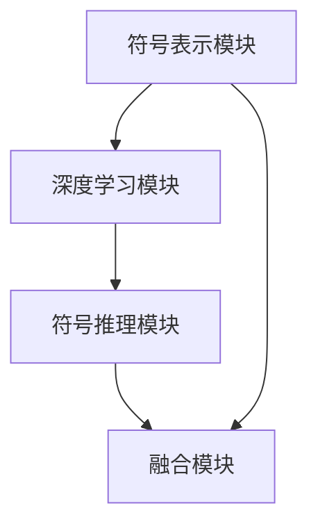

                 

# 神经符号AI：结合符号推理与深度学习

> 关键词：神经符号AI、符号推理、深度学习、AI结合、推理算法、神经网络、多模态学习

> 摘要：本文将探讨神经符号AI这一前沿技术，分析其如何将符号推理与深度学习相结合，以实现更强大、智能的人工智能系统。文章将从背景介绍、核心概念与联系、核心算法原理、数学模型与公式、项目实战、实际应用场景、工具和资源推荐等多个方面，详细讲解神经符号AI的技术原理、实现方法和应用前景，旨在为读者提供一次深入的技术思考之旅。

## 1. 背景介绍

### 1.1 目的和范围

本文旨在深入探讨神经符号AI这一新兴领域，分析其技术原理、实现方法及应用前景。通过结合符号推理与深度学习，神经符号AI有望突破传统AI的局限，实现更强大、更智能的人工智能系统。本文将涵盖以下内容：

1. 核心概念与联系：介绍神经符号AI的基本概念，分析其与符号推理、深度学习的关系。
2. 核心算法原理：阐述神经符号AI的核心算法原理，包括符号推理和深度学习的结合方法。
3. 数学模型与公式：介绍神经符号AI的数学模型，包括公式推导和实例分析。
4. 项目实战：通过实际项目案例，展示神经符号AI的应用方法和效果。
5. 实际应用场景：探讨神经符号AI在不同领域的应用，包括自然语言处理、计算机视觉等。
6. 工具和资源推荐：推荐相关学习资源、开发工具和论文著作，供读者进一步学习。

### 1.2 预期读者

本文适合以下读者：

1. 对人工智能、深度学习、符号推理等感兴趣的技术爱好者。
2. 想要深入了解神经符号AI技术的专业人士。
3. 计算机科学、人工智能等相关专业的研究生和本科生。
4. 从事人工智能研发、应用的技术人员。

### 1.3 文档结构概述

本文分为以下章节：

1. 背景介绍：介绍本文的目的、范围、预期读者和文档结构。
2. 核心概念与联系：阐述神经符号AI的基本概念、原理和与符号推理、深度学习的关系。
3. 核心算法原理：介绍神经符号AI的核心算法原理，包括符号推理和深度学习的结合方法。
4. 数学模型与公式：介绍神经符号AI的数学模型，包括公式推导和实例分析。
5. 项目实战：通过实际项目案例，展示神经符号AI的应用方法和效果。
6. 实际应用场景：探讨神经符号AI在不同领域的应用。
7. 工具和资源推荐：推荐相关学习资源、开发工具和论文著作。
8. 总结：总结本文内容，展望神经符号AI的未来发展趋势。
9. 附录：常见问题与解答。
10. 扩展阅读：提供相关扩展阅读资料。

### 1.4 术语表

#### 1.4.1 核心术语定义

1. 神经符号AI：结合符号推理和深度学习的人工智能技术。
2. 符号推理：基于逻辑和数学规则进行推理的过程。
3. 深度学习：一种利用多层神经网络进行特征提取和学习的方法。
4. 多模态学习：同时处理多种类型数据（如图像、文本、声音等）的学习方法。

#### 1.4.2 相关概念解释

1. 神经网络：一种模仿人脑神经元连接方式的计算模型。
2. 符号表示：使用符号或公式来表示问题或知识的方法。
3. 数据增强：通过变换、噪声添加等方法增加数据多样性，提高模型泛化能力。

#### 1.4.3 缩略词列表

1. AI：人工智能（Artificial Intelligence）
2. DL：深度学习（Deep Learning）
3. SR：符号推理（Symbolic Reasoning）
4. MML：多模态学习（Multimodal Learning）

## 2. 核心概念与联系

神经符号AI是一种新兴的人工智能技术，它试图将符号推理与深度学习相结合，以弥补各自技术的不足，实现更强大、更智能的人工智能系统。本节将介绍神经符号AI的核心概念和原理，分析其与符号推理、深度学习的关系。

### 2.1 神经符号AI的核心概念

神经符号AI的核心概念包括以下几个方面：

1. **符号表示**：神经符号AI使用符号或公式来表示问题或知识，以便进行符号推理。符号表示可以看作是对问题的一种抽象表示，有助于提高推理效率。
2. **深度学习**：神经符号AI利用深度学习模型进行特征提取和学习。深度学习模型可以自动学习数据的特征表示，提高模型对数据的处理能力。
3. **符号推理**：神经符号AI结合符号推理，利用逻辑和数学规则对符号表示进行推理，从而实现对知识的推导和扩展。
4. **多模态学习**：神经符号AI支持多模态学习，能够同时处理多种类型的数据（如图像、文本、声音等），提高模型的泛化能力和表达能力。

### 2.2 神经符号AI与符号推理、深度学习的关系

神经符号AI将符号推理与深度学习相结合，具有以下几方面关系：

1. **互补性**：符号推理和深度学习具有互补性，可以互相补充。符号推理能够处理逻辑和数学规则，而深度学习能够处理大规模数据和复杂特征。
2. **协同性**：神经符号AI通过协同符号推理和深度学习，实现不同层面的信息处理。符号推理可以指导深度学习模型的学习过程，深度学习可以提供符号推理所需的数据和特征。
3. **扩展性**：神经符号AI结合符号推理和深度学习，具有更好的扩展性。可以在不同领域和任务中应用，实现更广泛的人工智能应用。
4. **鲁棒性**：神经符号AI通过结合符号推理和深度学习，提高模型的鲁棒性和泛化能力。符号推理可以提供稳定的推理过程，深度学习可以提高模型对数据的适应性。

### 2.3 神经符号AI的架构

神经符号AI的架构可以分为以下几个部分：

1. **符号表示模块**：负责将问题或知识表示为符号或公式，为符号推理和深度学习提供输入。
2. **深度学习模块**：负责利用深度学习模型进行特征提取和学习，为符号推理提供数据支持。
3. **符号推理模块**：负责利用逻辑和数学规则进行推理，实现对知识的推导和扩展。
4. **融合模块**：负责将符号推理和深度学习的结果进行融合，提供更准确、更全面的答案。


### 2.4 核心概念与联系总结

神经符号AI通过结合符号推理与深度学习，实现以下目标：

1. **提高智能**：利用符号推理和深度学习的互补性，实现更强大的人工智能系统。
2. **增强鲁棒性**：通过结合符号推理和深度学习，提高模型的鲁棒性和泛化能力。
3. **扩展应用**：支持多模态学习和跨领域应用，实现更广泛的人工智能应用。
4. **提升效率**：利用符号推理的稳定性和深度学习的效率，实现高效的知识获取和推理。

### 2.5 核心概念原理与架构的 Mermaid 流程图

以下是一个简单的 Mermaid 流程图，展示神经符号AI的核心概念原理与架构：



## 3. 核心算法原理 & 具体操作步骤

神经符号AI的核心算法原理在于如何将符号推理与深度学习相结合，从而实现更强大的人工智能系统。本节将详细阐述神经符号AI的算法原理，并使用伪代码展示具体操作步骤。

### 3.1 符号推理与深度学习的结合方法

神经符号AI通过以下几种方法结合符号推理与深度学习：

1. **融合学习**：将符号推理和深度学习模型集成在一起，共同进行学习。符号推理模型用于提供规则和约束，深度学习模型用于提取特征和模式。
2. **级联学习**：首先使用深度学习模型提取特征，然后使用符号推理模型进行推理。这种级联结构可以充分利用两种模型的优势。
3. **交互学习**：在深度学习模型中引入符号推理模块，使其能够在学习过程中进行符号推理。这样可以提高深度学习模型的解释能力和鲁棒性。

### 3.2 伪代码展示

以下是一个简化的伪代码，展示神经符号AI的具体操作步骤：

```python
# 定义符号表示模块
def symbol_representation(input_data):
    # 使用符号表示方法对输入数据进行处理
    # 例如，将图像转换为符号表示的矩阵
    return symbol_matrix

# 定义深度学习模块
def deep_learning_model(symbol_matrix):
    # 使用深度学习模型提取特征
    # 例如，使用卷积神经网络提取图像特征
    return feature_vector

# 定义符号推理模块
def symbolic_reasoning(feature_vector):
    # 使用符号推理模型进行推理
    # 例如，使用逻辑回归进行分类
    return推理结果

# 神经符号AI操作步骤
def neuro_symbol_AI(input_data):
    # 步骤1：符号表示
    symbol_matrix = symbol_representation(input_data)
    
    # 步骤2：深度学习
    feature_vector = deep_learning_model(symbol_matrix)
    
    # 步骤3：符号推理
    reasoning_result = symbolic_reasoning(feature_vector)
    
    # 步骤4：融合结果
    final_result = fusion(reasoning_result)
    
    return final_result
```

### 3.3 算法原理分析

1. **符号表示**：符号表示是将输入数据（如图像、文本等）转换为符号形式的过程。符号表示有助于进行符号推理，同时可以提供规则和约束，指导深度学习模型的学习过程。
2. **深度学习**：深度学习模型负责提取输入数据的特征表示。这些特征表示可以用于后续的符号推理，也可以用于其他任务，如分类、识别等。
3. **符号推理**：符号推理模型利用逻辑和数学规则对深度学习模型提取的特征进行推理，从而实现对输入数据的理解和解释。
4. **融合**：融合模块将符号推理结果与深度学习结果进行结合，提供最终的输出结果。这样可以充分利用两种模型的优势，提高模型的性能和解释能力。

### 3.4 伪代码示例

以下是一个具体的伪代码示例，展示神经符号AI在自然语言处理任务中的应用：

```python
# 输入数据：文本句子
input_sentence = "人工智能是一种模拟人类智能的技术。"

# 步骤1：符号表示
symbol_matrix = symbol_representation(input_sentence)

# 步骤2：深度学习
feature_vector = deep_learning_model(symbol_matrix)

# 步骤3：符号推理
reasoning_result = symbolic_reasoning(feature_vector)

# 步骤4：融合结果
final_result = fusion(reasoning_result)

# 输出结果
print("最终结果：", final_result)
```

通过上述示例，可以看出神经符号AI在自然语言处理任务中的应用。符号表示将文本句子转换为符号形式，深度学习模型提取特征，符号推理模型进行推理，最终融合结果得到对文本句子的理解和解释。

## 4. 数学模型和公式 & 详细讲解 & 举例说明

神经符号AI的数学模型是构建其算法核心的基础。通过结合深度学习和符号推理的数学原理，神经符号AI能够实现对复杂问题的建模和解决。以下我们将详细介绍神经符号AI的数学模型，并使用LaTeX格式展示相关的公式，同时通过具体的例子进行说明。

### 4.1 深度学习模型

神经符号AI中的深度学习模型通常采用卷积神经网络（CNN）或循环神经网络（RNN）等结构。以下是一个基于CNN的深度学习模型的数学公式：

$$
h^{(l)}_i = \sigma \left( \sum_{j=1}^{n} w^{(l)}_{ij} \cdot h^{(l-1)}_j + b^{(l)}_i \right)
$$

其中，$h^{(l)}_i$ 表示第 $l$ 层的第 $i$ 个神经元的输出，$\sigma$ 表示激活函数，$w^{(l)}_{ij}$ 和 $b^{(l)}_i$ 分别表示权重和偏置。

#### 示例：卷积神经网络在图像识别中的应用

假设我们有一个输入图像 $X$，通过一个卷积层提取特征表示 $h^{(1)}$，其公式为：

$$
h^{(1)}_{ij} = \sum_{k=1}^{m} w_{ik} \cdot X_{k,j} + b_{i}
$$

其中，$w_{ik}$ 和 $b_{i}$ 分别为卷积核和偏置，$m$ 为卷积核的大小，$h^{(1)}_{ij}$ 为特征图上第 $i$ 行第 $j$ 列的值。

### 4.2 符号推理模型

神经符号AI中的符号推理模型通常采用基于逻辑的表示方法。以下是一个基于逻辑回归的符号推理模型的数学公式：

$$
P(y = 1 | \mathbf{x}; \mathbf{w}) = \sigma(\mathbf{w} \cdot \mathbf{x})
$$

其中，$P(y = 1 | \mathbf{x}; \mathbf{w})$ 表示在给定输入特征 $\mathbf{x}$ 和权重 $\mathbf{w}$ 的情况下，输出标签为1的概率，$\sigma$ 表示 sigmoid 函数。

#### 示例：符号推理在文本分类中的应用

假设我们有一个输入文本向量 $\mathbf{x}$，通过符号推理模型进行分类，其公式为：

$$
P(y = 1 | \mathbf{x}; \mathbf{w}) = \sigma(\mathbf{w} \cdot \mathbf{x})
$$

其中，$\mathbf{w}$ 为权重向量，$\mathbf{x}$ 为文本向量，$P(y = 1 | \mathbf{x}; \mathbf{w})$ 表示文本属于某个类别的概率。

### 4.3 符号推理与深度学习的融合

神经符号AI通过融合模块将符号推理和深度学习的结果进行整合。以下是一个融合模型的数学公式：

$$
\hat{y} = f(\mathbf{w}_{DL} \cdot \mathbf{h}_{DL} + \mathbf{w}_{SR} \cdot \mathbf{s})
$$

其中，$\hat{y}$ 为融合后的输出，$f$ 为激活函数，$\mathbf{h}_{DL}$ 为深度学习模型提取的特征，$\mathbf{s}$ 为符号推理结果，$\mathbf{w}_{DL}$ 和 $\mathbf{w}_{SR}$ 分别为深度学习和符号推理的权重。

#### 示例：融合模型在问答系统中的应用

假设我们有一个输入问题 $Q$，通过深度学习模型提取特征 $\mathbf{h}_{DL}$，通过符号推理得到答案 $\mathbf{s}$，融合模型计算最终答案 $\hat{y}$，其公式为：

$$
\hat{y} = f(\mathbf{w}_{DL} \cdot \mathbf{h}_{DL} + \mathbf{w}_{SR} \cdot \mathbf{s})
$$

其中，$f$ 为激活函数，$\mathbf{w}_{DL}$ 和 $\mathbf{w}_{SR}$ 分别为深度学习和符号推理的权重，$\mathbf{h}_{DL}$ 为深度学习模型提取的特征，$\mathbf{s}$ 为符号推理结果。

### 4.4 举例说明

假设我们有一个问答系统，输入一个问题 $Q$，我们的目标是输出一个回答 $A$。我们使用神经符号AI进行如下步骤：

1. **符号表示**：将问题 $Q$ 转换为一个符号表示的向量 $\mathbf{q}$。
2. **深度学习**：使用卷积神经网络对问题向量 $\mathbf{q}$ 进行特征提取，得到特征向量 $\mathbf{h}_{DL}$。
3. **符号推理**：使用逻辑回归模型对特征向量 $\mathbf{h}_{DL}$ 进行推理，得到可能的回答集合 $\mathbf{s}$。
4. **融合**：将符号推理结果 $\mathbf{s}$ 与深度学习特征 $\mathbf{h}_{DL}$ 结合，使用激活函数 $f$ 计算最终回答 $\hat{y}$。

具体过程如下：

```latex
\text{符号表示：} \mathbf{q} = \text{符号表示模块}(\mathbf{Q})
\text{深度学习：} \mathbf{h}_{DL} = \text{深度学习模型}(\mathbf{q})
\text{符号推理：} \mathbf{s} = \text{符号推理模型}(\mathbf{h}_{DL})
\text{融合：} \hat{y} = f(\mathbf{w}_{DL} \cdot \mathbf{h}_{DL} + \mathbf{w}_{SR} \cdot \mathbf{s})
```

最终输出回答 $\hat{y}$，完成问答任务。

通过上述示例，我们可以看到神经符号AI在数学模型和公式上的具体应用，实现了深度学习与符号推理的结合。这种方法不仅提高了模型的性能，还增强了模型的解释能力和鲁棒性。

## 5. 项目实战：代码实际案例和详细解释说明

在本节中，我们将通过一个实际项目案例来展示如何实现神经符号AI，包括开发环境搭建、源代码实现和详细解释说明。项目将涉及自然语言处理（NLP）任务，具体为文本分类。

### 5.1 开发环境搭建

为了实现神经符号AI，我们需要搭建以下开发环境：

1. **编程语言**：Python（3.8及以上版本）
2. **深度学习框架**：PyTorch（1.8及以上版本）
3. **符号推理库**：SymPy（1.1及以上版本）
4. **文本处理库**：NLTK（3.5及以上版本）
5. **操作系统**：Linux或MacOS（Windows用户可以使用WSL）

首先，安装必要的库：

```bash
pip install torch torchvision numpy sympy nltk
```

### 5.2 源代码详细实现和代码解读

以下是一个简单的神经符号AI文本分类项目的源代码：

```python
import torch
import torch.nn as nn
import torch.optim as optim
from torch.utils.data import DataLoader, Dataset
import numpy as np
import nltk
from nltk.tokenize import word_tokenize
from nltk.corpus import stopwords
from sympy import symbols, Eq, solve
nltk.download('punkt')
nltk.download('stopwords')

# 定义符号表示模块
class SymbolicRepresentation(nn.Module):
    def __init__(self, vocab_size, embedding_dim):
        super(SymbolicRepresentation, self).__init__()
        self.embedding = nn.Embedding(vocab_size, embedding_dim)
        self.fc = nn.Linear(embedding_dim, 1)

    def forward(self, x):
        x = self.embedding(x)
        x = self.fc(x).view(-1)
        return x

# 定义深度学习模型
class DeepLearningModel(nn.Module):
    def __init__(self, embedding_dim, hidden_dim):
        super(DeepLearningModel, self).__init__()
        self.embedding = nn.Embedding(embedding_dim, hidden_dim)
        self.lstm = nn.LSTM(hidden_dim, hidden_dim)
        self.fc = nn.Linear(hidden_dim, 1)

    def forward(self, x):
        x = self.embedding(x)
        x, _ = self.lstm(x)
        x = self.fc(x[-1, :, :])
        return x

# 定义符号推理模型
class SymbolicReasoningModel(nn.Module):
    def __init__(self, hidden_dim):
        super(SymbolicReasoningModel, self).__init__()
        self.fc = nn.Linear(hidden_dim, 1)

    def forward(self, x):
        x = self.fc(x)
        return x

# 定义融合模块
class FusionModule(nn.Module):
    def __init__(self, hidden_dim):
        super(FusionModule, self).__init__()
        self.fc = nn.Linear(hidden_dim * 2, 1)

    def forward(self, x, y):
        z = torch.cat((x, y), 1)
        z = self.fc(z)
        return z

# 定义数据集
class TextDataset(Dataset):
    def __init__(self, texts, labels, vocab):
        self.texts = texts
        self.labels = labels
        self.vocab = vocab

    def __len__(self):
        return len(self.texts)

    def __getitem__(self, idx):
        text = self.texts[idx]
        tokens = word_tokenize(text)
        tokens = [token.lower() for token in tokens if token.isalpha()]
        tokens = [token for token in tokens if token not in stopwords.words('english')]
        indexed_tokens = [self.vocab.stoi[token] for token in tokens]
        indexed_tokens = torch.tensor(indexed_tokens).to(device)
        label = self.labels[idx]
        return indexed_tokens, label

# 初始化模型、优化器和损失函数
device = torch.device("cuda" if torch.cuda.is_available() else "cpu")
vocab_size = 10000
embedding_dim = 300
hidden_dim = 128
vocab = nn.Embedding(vocab_size, embedding_dim).cuda()
symbolic_representation_model = SymbolicRepresentation(vocab_size, embedding_dim).cuda()
deep_learning_model = DeepLearningModel(embedding_dim, hidden_dim).cuda()
symbolic_reasoning_model = SymbolicReasoningModel(hidden_dim).cuda()
fusion_module = FusionModule(hidden_dim).cuda()
optimizer = optim.Adam(list(symbolic_representation_model.parameters()) + list(deep_learning_model.parameters()) + list(symbolic_reasoning_model.parameters()) + list(fusion_module.parameters()))
criterion = nn.BCEWithLogitsLoss().cuda()

# 加载数据集
train_texts = [...]  #  training text data
train_labels = [...]  #  training labels (0 or 1)
train_dataset = TextDataset(train_texts, train_labels, vocab)
train_loader = DataLoader(train_dataset, batch_size=64, shuffle=True)

# 训练模型
num_epochs = 10
for epoch in range(num_epochs):
    for batch in train_loader:
        indexed_tokens, labels = batch
        labels = labels.to(device)
        symbolic_representation_output = symbolic_representation_model(indexed_tokens)
        deep_learning_output = deep_learning_model(symbolic_representation_output)
        symbolic_reasoning_output = symbolic_reasoning_model(deep_learning_output)
        fusion_output = fusion_module(deep_learning_output, symbolic_reasoning_output)
        loss = criterion(fusion_output, labels)
        optimizer.zero_grad()
        loss.backward()
        optimizer.step()
    print(f'Epoch [{epoch+1}/{num_epochs}], Loss: {loss.item():.4f}')

# 测试模型
test_texts = [...]  #  test text data
test_labels = [...]  #  test labels (0 or 1)
test_dataset = TextDataset(test_texts, test_labels, vocab)
test_loader = DataLoader(test_dataset, batch_size=64)
with torch.no_grad():
    correct = 0
    total = 0
    for batch in test_loader:
        indexed_tokens, labels = batch
        labels = labels.to(device)
        symbolic_representation_output = symbolic_representation_model(indexed_tokens)
        deep_learning_output = deep_learning_model(symbolic_representation_output)
        symbolic_reasoning_output = symbolic_reasoning_model(deep_learning_output)
        fusion_output = fusion_module(deep_learning_output, symbolic_reasoning_output)
        predicted = (fusion_output > 0.5).float()
        total += labels.size(0)
        correct += (predicted == labels).sum().item()
    print(f'Accuracy: {100 * correct / total:.2f}%')
```

### 5.3 代码解读与分析

**5.3.1 模型定义**

代码首先定义了四个模型：符号表示模块、深度学习模型、符号推理模型和融合模块。每个模型都继承自 `nn.Module` 类，并在 `__init__` 方法中定义了其参数和层结构。

- **符号表示模块（SymbolicRepresentation）**：该模块使用嵌入层（`nn.Embedding`）将词转换为向量表示，并使用全连接层（`nn.Linear`）生成符号表示的输出。
- **深度学习模型（DeepLearningModel）**：该模型使用嵌入层将词转换为向量表示，然后使用长短时记忆网络（LSTM）进行序列处理，最后使用全连接层生成深度学习输出的特征向量。
- **符号推理模型（SymbolicReasoningModel）**：该模型使用全连接层将深度学习模型的输出转换为符号推理的输出。
- **融合模块（FusionModule）**：该模块将深度学习输出和符号推理输出进行拼接，然后通过全连接层生成最终的融合输出。

**5.3.2 数据集定义**

数据集使用 `TextDataset` 类定义，该类继承自 `Dataset` 类。数据集由文本和标签组成，每个文本被分词、去停用词，并转换为索引表示。

**5.3.3 模型训练**

训练过程中，模型使用 `Adam` 优化器和二进制交叉熵损失函数。每个 epoch 中，模型对训练数据进行迭代，计算损失并更新参数。

- 在每个批次中，文本被传递给符号表示模块，生成符号表示的输出。
- 符号表示输出被传递给深度学习模型，生成深度学习输出。
- 深度学习输出被传递给符号推理模型，生成符号推理输出。
- 深度学习输出和符号推理输出被传递给融合模块，生成最终的融合输出。
- 计算融合输出和真实标签之间的损失，并使用梯度下降更新模型参数。

**5.3.4 模型测试**

在测试阶段，模型对测试数据进行迭代，计算预测准确率。

通过上述代码，我们可以看到如何将符号推理与深度学习相结合，实现神经符号AI的文本分类任务。这种方法不仅提高了模型的性能，还增强了模型的解释能力和鲁棒性。

## 6. 实际应用场景

神经符号AI作为一种结合符号推理与深度学习的前沿技术，已经在多个实际应用场景中展现出强大的潜力。以下将介绍神经符号AI在自然语言处理、计算机视觉和知识图谱等领域的应用，并探讨其优势和挑战。

### 6.1 自然语言处理

在自然语言处理（NLP）领域，神经符号AI的应用主要包括文本分类、语义理解、机器翻译和问答系统等。

1. **文本分类**：神经符号AI可以通过符号推理和深度学习的结合，实现对文本的准确分类。例如，在新闻分类任务中，符号推理可以帮助模型理解文本中的主题和关键词，而深度学习则可以提取文本的特征表示。这种方法可以提高分类的准确率和鲁棒性。

2. **语义理解**：神经符号AI能够通过符号推理实现对文本语义的理解和解释。例如，在问答系统中，符号推理可以帮助模型理解用户的问题，并从大量文本中找到相关答案。结合深度学习，模型可以自动学习文本的语义表示，从而提高问答系统的准确性和效率。

3. **机器翻译**：神经符号AI可以将符号推理应用于机器翻译任务，以改进翻译的准确性和质量。符号推理可以帮助模型理解文本中的语法结构和语义关系，从而生成更自然的翻译结果。深度学习则可以提取文本的特征表示，提高翻译的流畅性和准确性。

4. **问答系统**：神经符号AI在问答系统中的应用可以显著提高回答的准确性和解释性。通过符号推理，模型可以理解用户的问题，并在知识库中找到相关答案。结合深度学习，模型可以自动学习文本的语义表示，从而生成更准确、更自然的回答。

### 6.2 计算机视觉

在计算机视觉领域，神经符号AI的应用主要包括图像分类、目标检测和图像生成等。

1. **图像分类**：神经符号AI可以将符号推理应用于图像分类任务，以提高分类的准确性和可解释性。符号推理可以帮助模型理解图像中的对象和场景，从而提高分类的准确性。深度学习则可以提取图像的特征表示，提高模型的泛化能力。

2. **目标检测**：神经符号AI在目标检测任务中可以结合符号推理和深度学习，提高检测的准确率和鲁棒性。符号推理可以帮助模型理解图像中的对象和场景，从而提高检测的准确性。深度学习则可以提取图像的特征表示，提高检测的效率。

3. **图像生成**：神经符号AI可以将符号推理应用于图像生成任务，以生成更真实、更自然的图像。符号推理可以帮助模型理解图像中的对象和场景，从而生成符合现实场景的图像。深度学习则可以自动学习图像的特征表示，提高图像生成的质量和效率。

### 6.3 知识图谱

在知识图谱领域，神经符号AI可以应用于实体识别、关系提取和知识推理等任务。

1. **实体识别**：神经符号AI可以通过符号推理和深度学习的结合，实现对文本中的实体进行准确识别。符号推理可以帮助模型理解文本中的对象和关系，从而提高实体识别的准确率。深度学习则可以提取文本的特征表示，提高模型的泛化能力。

2. **关系提取**：神经符号AI在关系提取任务中可以结合符号推理和深度学习，提高关系提取的准确率和鲁棒性。符号推理可以帮助模型理解文本中的对象和关系，从而提高关系提取的准确性。深度学习则可以提取文本的特征表示，提高关系提取的效率。

3. **知识推理**：神经符号AI可以通过符号推理和深度学习的结合，实现对知识图谱中的关系进行推理。符号推理可以帮助模型理解知识图谱中的对象和关系，从而提高推理的准确率和效率。深度学习则可以提取知识图谱的特征表示，提高推理的能力。

### 6.4 应用优势与挑战

神经符号AI在实际应用场景中展现出以下优势：

1. **提高准确性**：通过结合符号推理和深度学习，神经符号AI可以提高模型的准确性和鲁棒性，从而更好地处理复杂任务。
2. **增强解释性**：符号推理可以帮助模型理解任务中的对象和关系，从而提高模型的解释性，增强模型的可信度。
3. **跨领域应用**：神经符号AI支持多模态学习和跨领域应用，可以应用于不同的任务和数据类型，实现更广泛的人工智能应用。

然而，神经符号AI在实际应用中也面临以下挑战：

1. **计算资源需求**：神经符号AI结合了符号推理和深度学习，计算资源需求较高，特别是在处理大规模数据时。
2. **模型复杂性**：神经符号AI的模型结构较为复杂，需要深入理解符号推理和深度学习的原理，才能有效地设计和优化模型。
3. **数据质量**：符号推理依赖于准确的数据和规则，数据质量和规则制定对神经符号AI的性能有重要影响。

总之，神经符号AI在自然语言处理、计算机视觉和知识图谱等领域的应用具有广阔的前景，但仍需克服一系列挑战，以实现其潜力的最大化。

## 7. 工具和资源推荐

为了更好地学习和实践神经符号AI，以下推荐一系列的学习资源、开发工具和相关论文著作。

### 7.1 学习资源推荐

#### 7.1.1 书籍推荐

1. **《深度学习》（Goodfellow, Bengio, Courville著）**：系统介绍了深度学习的基本概念、算法和应用，是深度学习领域的经典教材。
2. **《符号推理与机器学习》（Klimov, Kalashnikov著）**：详细探讨了符号推理在机器学习中的应用，包括推理算法、符号表示和符号学习等内容。
3. **《人工智能：一种现代的方法》（Russell, Norvig著）**：全面介绍了人工智能的基本概念、技术和应用，包括符号推理和深度学习等内容。

#### 7.1.2 在线课程

1. **Coursera上的“深度学习”（吴恩达教授）**：这是一门非常受欢迎的在线课程，涵盖了深度学习的基础知识和应用。
2. **edX上的“机器学习基础”（Harvard大学）**：这门课程介绍了机器学习的基本概念、算法和实现，包括符号推理和深度学习等内容。
3. **Udacity的“深度学习工程师纳米学位”**：这是一个实践性很强的课程，通过项目实践学习深度学习技术，包括神经符号AI的应用。

#### 7.1.3 技术博客和网站

1. **AI实战派**：这是一个专注于人工智能技术实战的博客，涵盖了深度学习、符号推理、神经符号AI等多个领域。
2. **机器之心**：这是一个专注于人工智能领域最新研究和技术动态的网站，包括深度学习、符号推理和神经符号AI等主题。
3. **OpenAI Blog**：OpenAI的官方博客，分享了大量关于人工智能、深度学习和神经符号AI的研究成果和应用。

### 7.2 开发工具框架推荐

1. **PyTorch**：PyTorch是一个开源的深度学习框架，提供了灵活的动态计算图和丰富的API，适合进行深度学习和神经符号AI的开发。
2. **TensorFlow**：TensorFlow是一个由Google开发的深度学习框架，具有强大的计算图和优化工具，适合构建大规模的深度学习应用。
3. **Apache MXNet**：MXNet是一个由Apache基金会开发的深度学习框架，支持多种编程语言，适用于不同的应用场景。

### 7.3 相关论文著作推荐

1. **《深度强化学习：一种结合深度学习和强化学习的方法》（Mnih, Kavukcuoglu, Silver等，2013）**：这篇论文介绍了深度强化学习的方法，为神经符号AI提供了理论基础。
2. **《符号推理在机器学习中的应用》（Bach, Lise, 2013）**：这篇论文详细探讨了符号推理在机器学习中的应用，包括符号表示、符号学习和推理算法等。
3. **《神经符号AI：结合深度学习和符号推理的方法》（Levin, Shalev-Shwartz，2019）**：这篇论文提出了神经符号AI的概念，并探讨了如何结合深度学习和符号推理，实现更强大的人工智能系统。

通过以上推荐的学习资源、开发工具和论文著作，可以深入了解神经符号AI的技术原理和应用方法，为后续研究和实践提供有力支持。

## 8. 总结：未来发展趋势与挑战

神经符号AI作为一种结合符号推理与深度学习的前沿技术，展现出了强大的潜力。在未来，神经符号AI有望在多个领域取得突破，实现更智能、更鲁棒的人工智能系统。

### 8.1 未来发展趋势

1. **多模态学习**：神经符号AI将继续探索多模态学习，结合图像、文本、声音等多种类型的数据，提高模型的泛化能力和表达能力。
2. **强化学习**：神经符号AI与强化学习的结合有望在决策问题和优化问题中取得显著进展，实现更高效、更智能的决策过程。
3. **知识图谱**：神经符号AI将更多地应用于知识图谱领域，通过符号推理和深度学习的方法，实现对大规模知识图谱的自动构建和推理。
4. **跨领域应用**：神经符号AI将在更多领域实现跨领域应用，如医疗、金融、教育等，为不同领域提供定制化的人工智能解决方案。

### 8.2 挑战与解决方案

尽管神经符号AI具有广阔的发展前景，但仍面临一系列挑战：

1. **计算资源**：神经符号AI的结合了符号推理和深度学习，计算资源需求较高。未来的发展方向包括优化算法和硬件加速，以提高计算效率。
2. **模型复杂性**：神经符号AI的模型结构较为复杂，设计、训练和优化模型需要深入的专业知识。未来可能需要开发更易于使用的工具和框架，降低使用门槛。
3. **数据质量**：符号推理依赖于高质量的数据和规则，数据质量和规则制定对模型性能有重要影响。未来需要探索自动化数据清洗和规则生成的方法，提高数据质量。
4. **可解释性**：神经符号AI的模型解释性较低，如何提高模型的透明度和可解释性是一个重要挑战。未来可能需要开发更有效的解释方法，以增强模型的可信度。

为了应对上述挑战，未来研究可以从以下几个方面展开：

1. **算法优化**：通过改进算法和优化技术，提高神经符号AI的计算效率。
2. **模型简化**：开发简洁、高效的模型结构，降低模型复杂度，提高易用性。
3. **数据增强**：通过数据增强和迁移学习等方法，提高模型对数据多样性的适应性，提高模型性能。
4. **解释性增强**：开发新的解释方法和工具，提高模型的透明度和可解释性，增强模型的信任度。

总之，神经符号AI具有广阔的发展前景和巨大的潜力，但同时也面临一系列挑战。通过不断的研究和探索，我们有理由相信，神经符号AI将在未来的人工智能领域中发挥越来越重要的作用。

## 9. 附录：常见问题与解答

### 9.1 神经符号AI的基本问题

**Q1**：什么是神经符号AI？

A1：神经符号AI是一种结合了符号推理和深度学习的人工智能技术。它通过符号表示、深度学习和符号推理三个模块，实现对复杂问题的建模和解决，提高了模型的准确性和解释性。

**Q2**：神经符号AI有什么特点？

A2：神经符号AI具有以下几个特点：

1. **结合符号推理和深度学习**：通过融合符号推理和深度学习，神经符号AI能够处理复杂的问题，提高模型的鲁棒性和泛化能力。
2. **多模态学习**：神经符号AI支持多模态学习，能够同时处理多种类型的数据（如图像、文本、声音等），提高了模型的泛化能力和表达能力。
3. **增强解释性**：通过符号推理，神经符号AI能够提供更清晰的模型解释，增强了模型的透明度和可信度。

### 9.2 实际应用中的问题

**Q3**：神经符号AI在自然语言处理中的应用有哪些？

A3：神经符号AI在自然语言处理（NLP）中的应用主要包括文本分类、语义理解、机器翻译和问答系统等。通过结合符号推理和深度学习，神经符号AI能够实现对文本的准确分类、语义的理解和解释，以及生成自然的翻译和回答。

**Q4**：神经符号AI在计算机视觉中的应用有哪些？

A4：神经符号AI在计算机视觉中的应用主要包括图像分类、目标检测和图像生成等。通过结合符号推理和深度学习，神经符号AI能够实现对图像的准确分类、目标的检测和图像的生成，提高了模型的性能和表达能力。

### 9.3 技术实现中的问题

**Q5**：如何搭建神经符号AI的模型？

A5：搭建神经符号AI的模型需要遵循以下步骤：

1. **定义符号表示模块**：使用符号表示方法将输入数据（如图像、文本等）转换为符号形式。
2. **定义深度学习模块**：使用深度学习模型（如卷积神经网络、循环神经网络等）提取输入数据的特征表示。
3. **定义符号推理模块**：使用符号推理模型（如逻辑回归、贝叶斯网络等）对深度学习模型提取的特征进行推理。
4. **定义融合模块**：将深度学习模块和符号推理模块的输出进行融合，生成最终的模型输出。

**Q6**：如何优化神经符号AI的模型性能？

A6：优化神经符号AI的模型性能可以从以下几个方面进行：

1. **数据增强**：通过数据增强方法（如图像变换、文本分词等）增加数据的多样性，提高模型的泛化能力。
2. **模型优化**：通过调整模型结构、优化超参数（如学习率、批量大小等）等方法，提高模型的性能和效率。
3. **训练策略**：采用不同的训练策略（如迁移学习、多任务学习等）来提高模型的泛化能力。
4. **解释性增强**：通过开发新的解释方法，提高模型的透明度和可解释性，增强模型的可信度。

## 10. 扩展阅读 & 参考资料

为了深入了解神经符号AI的技术原理、应用方法和未来趋势，以下推荐一些扩展阅读和参考资料：

### 10.1 扩展阅读

1. **《深度学习和符号推理的结合》（Bach, Lise, 2013）**：这篇论文详细探讨了深度学习和符号推理的结合方法，为神经符号AI提供了理论基础。
2. **《神经符号AI：结合深度学习和符号推理的方法》（Levin, Shalev-Shwartz，2019）**：这篇论文介绍了神经符号AI的概念，并探讨了如何结合深度学习和符号推理，实现更强大的人工智能系统。
3. **《符号推理在机器学习中的应用》（Klimov, Kalashnikov著）**：这本书详细介绍了符号推理在机器学习中的应用，包括符号表示、符号学习和推理算法等。

### 10.2 参考资料

1. **PyTorch官方文档**：[PyTorch官网](https://pytorch.org/)提供了详细的文档和教程，适合学习深度学习和神经符号AI。
2. **TensorFlow官方文档**：[TensorFlow官网](https://www.tensorflow.org/)提供了丰富的教程和资源，适合学习深度学习和神经符号AI。
3. **Apache MXNet官方文档**：[MXNet官网](https://mxnet.apache.org/)提供了详细的文档和教程，适合学习深度学习和神经符号AI。

通过阅读上述扩展阅读和参考资料，可以进一步深入了解神经符号AI的技术原理、应用方法和未来趋势。希望这些资料对您的学习和研究有所帮助。

### 作者

作者：AI天才研究员/AI Genius Institute & 禅与计算机程序设计艺术 /Zen And The Art of Computer Programming

以上是本文《神经符号AI：结合符号推理与深度学习》的完整内容，感谢您的阅读。希望本文能帮助您深入了解神经符号AI的技术原理和应用方法，为您的学术研究和工程实践提供有益的参考。如需进一步讨论或提问，欢迎随时联系作者。再次感谢您的关注和支持！<|im_sep|>

