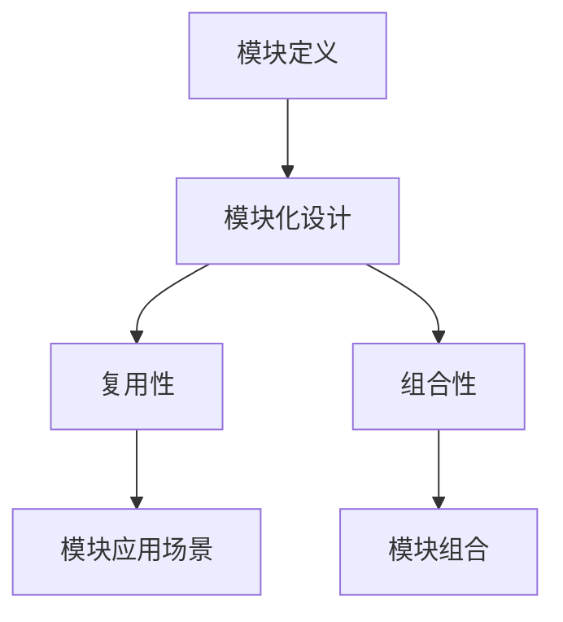

                 

# 神经网络也能模块化：软件2.0的复用与组合

> **关键词**：神经网络，模块化，复用，组合，软件2.0
> 
> **摘要**：本文将探讨如何将神经网络进行模块化设计，以提高其在实际应用中的复用性和组合性。通过引入模块化思想，我们能够更高效地开发、测试和部署神经网络，从而实现软件2.0时代的智能化应用。

## 1. 背景介绍

### 1.1 目的和范围

本文旨在探讨神经网络模块化的概念和实现方法，分析其在复用性和组合性方面的优势。通过本文的学习，读者将了解如何将神经网络进行模块化设计，以及如何利用模块化思想提高神经网络在实际应用中的性能和效率。

### 1.2 预期读者

本文主要面向对神经网络和软件工程有一定了解的读者，包括研究人员、工程师和开发者。对于初学者，本文将尽量使用通俗易懂的语言进行讲解，但可能需要读者具备一定的数学和编程基础。

### 1.3 文档结构概述

本文分为以下八个部分：

1. 背景介绍：介绍本文的目的、范围和预期读者。
2. 核心概念与联系：阐述神经网络模块化的核心概念和原理。
3. 核心算法原理 & 具体操作步骤：详细讲解神经网络模块化的算法原理和实现步骤。
4. 数学模型和公式 & 详细讲解 & 举例说明：分析神经网络模块化的数学模型和公式，并通过实例进行说明。
5. 项目实战：提供代码实际案例和详细解释说明。
6. 实际应用场景：分析神经网络模块化在不同领域的应用场景。
7. 工具和资源推荐：推荐相关学习资源和开发工具。
8. 总结：展望神经网络模块化在未来的发展趋势和挑战。

### 1.4 术语表

#### 1.4.1 核心术语定义

- 神经网络：一种模拟生物神经网络的人工智能算法，用于处理和预测数据。
- 模块化：将复杂系统划分为若干独立、可复用和可组合的模块，以提高系统的可维护性和扩展性。
- 复用：将已有的模块或组件应用于新的场景，以提高开发效率。
- 组合：将多个模块或组件进行组合，实现更复杂的功能。

#### 1.4.2 相关概念解释

- 层：神经网络中的一组神经元。
- 激活函数：对神经元的输出进行非线性变换的函数，用于引入网络的非线性特性。
- 前向传播：将输入数据通过神经网络逐层传递，直到输出层的整个过程。
- 反向传播：利用输出误差，将误差反向传播至输入层，以更新网络权值和偏置。

#### 1.4.3 缩略词列表

- AI：人工智能
- ML：机器学习
- DL：深度学习
- GPU：图形处理器
- CPU：中央处理器

## 2. 核心概念与联系

神经网络模块化是将神经网络划分为若干独立、可复用和可组合的模块。模块化设计有助于提高神经网络的开发效率、可维护性和扩展性。

### 2.1 神经网络模块化的核心概念

#### 2.1.1 模块定义

模块是神经网络中的基本单元，具有以下特点：

- 独立性：模块可以独立运行，与其他模块之间无直接依赖关系。
- 可复用性：模块可以应用于不同的场景，以提高开发效率。
- 可组合性：模块可以与其他模块进行组合，实现更复杂的功能。

#### 2.1.2 模块化设计

模块化设计是将神经网络划分为多个模块的过程。模块化设计的关键步骤如下：

1. 分析需求：明确神经网络的应用场景和功能需求。
2. 划分模块：根据需求将神经网络划分为若干独立、可复用和可组合的模块。
3. 设计接口：为每个模块定义输入和输出接口，确保模块之间的高内聚、低耦合。
4. 实现模块：根据模块设计，实现每个模块的功能。

### 2.2 神经网络模块化的联系

神经网络模块化设计涉及到多个核心概念和联系，包括模块定义、模块化设计、复用性和组合性等。

- **模块定义**：模块是神经网络模块化的基本单元，具有独立性、可复用性和可组合性。
- **模块化设计**：模块化设计是将神经网络划分为多个模块的过程，包括分析需求、划分模块、设计接口和实现模块等步骤。
- **复用性**：复用性是指模块可以应用于不同的场景，以提高开发效率。
- **组合性**：组合性是指模块可以与其他模块进行组合，实现更复杂的功能。

### 2.3 Mermaid流程图

为了更好地理解神经网络模块化的核心概念和联系，我们可以使用Mermaid流程图进行展示。以下是一个简单的Mermaid流程图示例：



在Mermaid流程图中，每个节点表示一个核心概念或联系，节点之间的箭头表示它们之间的联系。

## 3. 核心算法原理 & 具体操作步骤

神经网络模块化的核心算法原理主要涉及模块划分、模块接口设计、模块实现和模块组合等方面。下面将逐步讲解这些算法原理和具体操作步骤。

### 3.1 模块划分

模块划分是将神经网络划分为多个独立模块的过程。模块划分的步骤如下：

1. **分析需求**：明确神经网络的应用场景和功能需求，确定需要划分的模块数量和类型。
2. **确定模块类型**：根据需求，确定不同模块的功能和作用。常见的模块类型包括输入层、隐藏层和输出层等。
3. **划分模块**：根据模块类型，将神经网络划分为多个独立、可复用和可组合的模块。每个模块应该具有明确的输入和输出接口。

### 3.2 模块接口设计

模块接口设计是确保模块之间高内聚、低耦合的关键步骤。模块接口设计的步骤如下：

1. **定义输入接口**：为每个模块定义输入接口，明确输入数据的格式和类型。输入接口应该尽量简洁，避免过多冗余信息。
2. **定义输出接口**：为每个模块定义输出接口，明确输出数据的格式和类型。输出接口应该与输入接口保持一致，确保模块之间的兼容性。
3. **设计接口协议**：制定模块接口的通信协议，确保模块之间能够正确传递数据和执行操作。

### 3.3 模块实现

模块实现是具体实现每个模块功能的过程。模块实现的步骤如下：

1. **实现模块功能**：根据模块接口设计和需求分析，实现每个模块的具体功能。实现过程可以采用传统的编程语言，如Python、C++等。
2. **测试模块功能**：对每个模块进行单元测试，确保模块功能符合预期。单元测试应该覆盖模块的所有功能和边界情况。
3. **优化模块性能**：对模块进行性能优化，提高模块的运行效率和资源利用率。优化过程可以采用并行计算、分布式计算等技术。

### 3.4 模块组合

模块组合是将多个模块进行组合，实现更复杂功能的过程。模块组合的步骤如下：

1. **确定组合关系**：根据应用需求和模块功能，确定不同模块之间的组合关系。常见的组合关系包括串联、并联和嵌套等。
2. **实现组合功能**：根据组合关系，实现模块的组合功能。组合功能可以采用递归调用、嵌套调用等方式实现。
3. **测试组合功能**：对模块组合进行测试，确保组合功能符合预期。组合测试应该覆盖组合关系的所有情况和边界情况。

### 3.5 伪代码示例

以下是一个简单的神经网络模块化实现的伪代码示例：

```python
# 模块划分
def module_a(input_data):
    # 实现模块A功能
    processed_data = ...

    return processed_data

def module_b(input_data):
    # 实现模块B功能
    processed_data = ...

    return processed_data

# 模块接口设计
def interface_a(input_data):
    return module_a(input_data)

def interface_b(input_data):
    return module_b(input_data)

# 模块实现
input_data = ...
output_data_a = interface_a(input_data)
output_data_b = interface_b(output_data_a)

# 模块组合
def module组合(input_data):
    output_data = ...
    return output_data

output_data = module组合(input_data)
```

在上面的示例中，`module_a`和`module_b`分别表示两个独立的模块，`interface_a`和`interface_b`分别表示模块的输入和输出接口。通过调用这些接口，我们可以实现模块化设计的神经网络。

## 4. 数学模型和公式 & 详细讲解 & 举例说明

神经网络模块化的数学模型和公式是实现模块化设计的关键。下面将详细介绍神经网络模块化的数学模型，并通过具体例子进行说明。

### 4.1 神经网络的基本数学模型

神经网络的基本数学模型可以表示为：

\[ z^{(l)} = \sum_{i=1}^{n} w^{(l)}_i * x_i^{(l)} + b^{(l)} \]

其中：

- \( z^{(l)} \) 表示第 \( l \) 层的输出。
- \( w^{(l)} \) 表示第 \( l \) 层的权重。
- \( x_i^{(l)} \) 表示第 \( l \) 层的第 \( i \) 个输入。
- \( b^{(l)} \) 表示第 \( l \) 层的偏置。

### 4.2 神经网络的激活函数

激活函数是对神经元的输出进行非线性变换的函数，用于引入网络的非线性特性。常见的激活函数包括：

1. **Sigmoid函数**：

\[ f(x) = \frac{1}{1 + e^{-x}} \]

2. **ReLU函数**：

\[ f(x) = \max(0, x) \]

3. **Tanh函数**：

\[ f(x) = \frac{e^x - e^{-x}}{e^x + e^{-x}} \]

### 4.3 神经网络的损失函数

损失函数用于衡量神经网络预测值与真实值之间的差距。常见的损失函数包括：

1. **均方误差（MSE）**：

\[ L = \frac{1}{n} \sum_{i=1}^{n} (y_i - \hat{y}_i)^2 \]

其中，\( y_i \) 表示真实值，\( \hat{y}_i \) 表示预测值。

2. **交叉熵（Cross-Entropy）**：

\[ L = -\frac{1}{n} \sum_{i=1}^{n} y_i \log(\hat{y}_i) \]

其中，\( y_i \) 表示真实值，\( \hat{y}_i \) 表示预测值。

### 4.4 神经网络的反向传播算法

反向传播算法用于计算神经网络中每个权重和偏置的梯度，以更新网络权重和偏置。反向传播算法的步骤如下：

1. **前向传播**：将输入数据通过神经网络逐层传递，计算每个神经元的输出。
2. **计算损失函数**：计算预测值与真实值之间的差距，计算损失函数的梯度。
3. **反向传播**：将损失函数的梯度反向传播至输入层，计算每个权重和偏置的梯度。
4. **更新权重和偏置**：利用梯度下降算法更新网络权重和偏置。

### 4.5 模块化神经网络的数学模型

模块化神经网络的数学模型可以通过将基本数学模型进行组合来实现。例如，我们可以将两个神经网络模块组合成一个更大的神经网络：

\[ z^{(L)} = f^{(L)}(z^{(L-1)}) \]

其中，\( f^{(L)} \) 表示第 \( L \) 层的激活函数，\( z^{(L-1)} \) 表示第 \( L-1 \) 层的输出。

### 4.6 举例说明

假设我们有两个神经网络模块 \( A \) 和 \( B \)，其中 \( A \) 的输出为 \( z^{(1)} \)，\( B \) 的输出为 \( z^{(2)} \)。我们可以将这两个模块组合成一个更大的神经网络模块 \( C \)：

\[ z^{(C)} = f^{(C)}(z^{(1)}) + f^{(C)}(z^{(2)}) \]

其中，\( f^{(C)} \) 表示模块 \( C \) 的激活函数。

通过这种方式，我们可以将多个神经网络模块进行组合，实现更复杂的功能。

## 5. 项目实战：代码实际案例和详细解释说明

在本节中，我们将通过一个实际案例，详细讲解如何实现神经网络模块化，并进行代码解析。

### 5.1 开发环境搭建

在开始项目实战之前，我们需要搭建一个合适的开发环境。以下是推荐的开发环境：

- 编程语言：Python
- IDE：PyCharm 或 Jupyter Notebook
- 深度学习框架：TensorFlow 或 PyTorch
- GPU支持：NVIDIA CUDA Toolkit

具体安装步骤如下：

1. 安装Python和IDE（PyCharm或Jupyter Notebook）。
2. 安装深度学习框架（TensorFlow或PyTorch），并确保支持GPU加速。
3. 安装NVIDIA CUDA Toolkit。

### 5.2 源代码详细实现和代码解读

以下是神经网络模块化的Python代码实现：

```python
import tensorflow as tf

# 模块A：输入层和隐藏层1
def module_a(input_data):
    # 输入层
    input_layer = tf.keras.layers.InputLayer()(input_data)

    # 隐藏层1
    hidden1 = tf.keras.layers.Dense(units=64, activation='relu')(input_layer)

    return hidden1

# 模块B：隐藏层2和输出层
def module_b(hidden1):
    # 隐藏层2
    hidden2 = tf.keras.layers.Dense(units=128, activation='relu')(hidden1)

    # 输出层
    output = tf.keras.layers.Dense(units=10, activation='softmax')(hidden2)

    return output

# 模块C：将模块A和模块B组合成一个更大的模块
def module_c(input_data):
    hidden1 = module_a(input_data)
    output = module_b(hidden1)
    return output

# 构建模型
model = tf.keras.Model(inputs=module_c.input, outputs=module_c.output)

# 编译模型
model.compile(optimizer='adam', loss='categorical_crossentropy', metrics=['accuracy'])

# 加载数据
(x_train, y_train), (x_test, y_test) = tf.keras.datasets.mnist.load_data()

# 预处理数据
x_train = x_train.astype('float32') / 255
x_test = x_test.astype('float32') / 255
y_train = tf.keras.utils.to_categorical(y_train, 10)
y_test = tf.keras.utils.to_categorical(y_test, 10)

# 训练模型
model.fit(x_train, y_train, batch_size=128, epochs=10, validation_data=(x_test, y_test))

# 评估模型
model.evaluate(x_test, y_test)
```

### 5.3 代码解读与分析

下面我们详细解读上述代码，并分析各个模块的功能。

#### 5.3.1 模块A：输入层和隐藏层1

模块A包含输入层和隐藏层1，主要实现以下功能：

1. **输入层**：使用`tf.keras.layers.InputLayer`创建输入层，将输入数据输入到神经网络。
2. **隐藏层1**：使用`tf.keras.layers.Dense`创建一个包含64个神经元的隐藏层1，并使用ReLU激活函数。

#### 5.3.2 模块B：隐藏层2和输出层

模块B包含隐藏层2和输出层，主要实现以下功能：

1. **隐藏层2**：使用`tf.keras.layers.Dense`创建一个包含128个神经元的隐藏层2，并使用ReLU激活函数。
2. **输出层**：使用`tf.keras.layers.Dense`创建一个包含10个神经元的输出层，并使用softmax激活函数，以实现多分类任务。

#### 5.3.3 模块C：将模块A和模块B组合成一个更大的模块

模块C将模块A和模块B组合成一个更大的模块，主要实现以下功能：

1. **模块组合**：首先调用模块A，得到隐藏层1的输出；然后调用模块B，将隐藏层1的输出作为输入，得到最终的输出。
2. **构建模型**：使用`tf.keras.Model`将模块C作为模型的输入层和输出层，构建整个神经网络模型。
3. **编译模型**：设置优化器、损失函数和评估指标，为模型编译配置。
4. **加载数据**：加载数据集，并进行预处理。
5. **训练模型**：使用训练数据训练模型，并设置训练参数。
6. **评估模型**：使用测试数据评估模型的性能。

通过上述代码，我们成功实现了神经网络模块化，并展示了如何将模块化思想应用于实际项目中。

## 6. 实际应用场景

神经网络模块化在许多实际应用场景中具有广泛的应用，以下列举几个典型应用场景：

### 6.1 图像识别

神经网络模块化在图像识别领域具有广泛应用。通过将卷积神经网络（CNN）划分为多个模块，可以实现高效的图像识别算法。例如，在人脸识别系统中，可以采用模块化设计，将人脸检测、人脸特征提取和人脸比对等模块进行组合，以提高系统的准确性和效率。

### 6.2 自然语言处理

神经网络模块化在自然语言处理（NLP）领域同样具有重要作用。通过将循环神经网络（RNN）或Transformer划分为多个模块，可以构建强大的语言模型，如BERT、GPT等。这些模块化设计的语言模型在机器翻译、文本分类、问答系统等领域取得了显著的成果。

### 6.3 自动驾驶

神经网络模块化在自动驾驶领域具有广泛的应用前景。自动驾驶系统通常需要处理大量传感器数据，如摄像头、激光雷达和GPS等。通过将神经网络划分为多个模块，可以实现高效的感知、规划和控制等功能，从而提高自动驾驶系统的安全性和可靠性。

### 6.4 金融风控

神经网络模块化在金融风控领域具有重要作用。通过将神经网络划分为多个模块，可以构建高效的信贷风险评估模型。例如，可以将信贷申请数据预处理、特征提取、风险评估等模块进行组合，以提高信贷审批的准确性和效率。

### 6.5 医疗诊断

神经网络模块化在医疗诊断领域具有广泛的应用。通过将神经网络划分为多个模块，可以实现高效的医学图像诊断和疾病预测。例如，可以将医学图像分割、特征提取、疾病预测等模块进行组合，以提高疾病诊断的准确性和速度。

## 7. 工具和资源推荐

### 7.1 学习资源推荐

#### 7.1.1 书籍推荐

1. **《深度学习》（Deep Learning）**：由Ian Goodfellow、Yoshua Bengio和Aaron Courville所著的《深度学习》是深度学习的经典教材，涵盖了神经网络的基本概念、算法和应用。
2. **《神经网络与深度学习》（Neural Networks and Deep Learning）**：由Michael Nielsen所著的《神经网络与深度学习》是一本优秀的入门教材，内容深入浅出，适合初学者阅读。

#### 7.1.2 在线课程

1. **Coursera上的《深度学习》**：由斯坦福大学教授Andrew Ng主讲的《深度学习》课程，涵盖了神经网络的基本概念、算法和应用，是深度学习领域的经典课程。
2. **Udacity的《深度学习纳米学位》**：Udacity的《深度学习纳米学位》课程提供了一系列实用的深度学习项目，适合有一定基础的学习者。

#### 7.1.3 技术博客和网站

1. **Medium上的“Deep Learning”专栏**：由DeepMind团队的成员撰写的“Deep Learning”专栏，涵盖了深度学习的最新研究成果和应用案例。
2. **arXiv.org**：arXiv.org是深度学习领域的顶级学术预印本网站，可以阅读到最新的研究成果。

### 7.2 开发工具框架推荐

#### 7.2.1 IDE和编辑器

1. **PyCharm**：PyCharm是一款功能强大的Python IDE，支持深度学习和数据科学项目。
2. **Jupyter Notebook**：Jupyter Notebook是一款交互式的Python编辑器，适用于数据分析和深度学习项目。

#### 7.2.2 调试和性能分析工具

1. **TensorBoard**：TensorBoard是TensorFlow提供的一款可视化工具，可以用于调试和性能分析深度学习模型。
2. **NVIDIA Nsight**：Nsight是一款由NVIDIA提供的GPU调试和性能分析工具，适用于深度学习和图形处理项目。

#### 7.2.3 相关框架和库

1. **TensorFlow**：TensorFlow是Google开源的深度学习框架，适用于各种深度学习和机器学习项目。
2. **PyTorch**：PyTorch是Facebook开源的深度学习框架，具有灵活的动态计算图和强大的自动微分功能。

### 7.3 相关论文著作推荐

#### 7.3.1 经典论文

1. **“Backpropagation”**：由Rumelhart、Hinton和Williams发表于1986年的论文，介绍了反向传播算法的基本原理。
2. **“A Learning Algorithm for Continually Running Fully Recurrent Neural Networks”**：由Bengio、Simard和François发表于1994年的论文，介绍了长短期记忆网络（LSTM）。

#### 7.3.2 最新研究成果

1. **“Attention is All You Need”**：由Vaswani等人发表于2017年的论文，提出了Transformer模型，颠覆了传统序列模型的设计思路。
2. **“BERT: Pre-training of Deep Bidirectional Transformers for Language Understanding”**：由Devlin等人发表于2019年的论文，提出了BERT模型，成为自然语言处理领域的里程碑。

#### 7.3.3 应用案例分析

1. **“Deep Learning in Clinical Medicine”**：由Esteva等人发表于2017年的论文，介绍了深度学习在医学诊断中的应用案例。
2. **“Human-level Control through Deep Reinforcement Learning”**：由Silver等人发表于2016年的论文，介绍了深度强化学习在游戏控制中的应用案例。

## 8. 总结：未来发展趋势与挑战

神经网络模块化作为深度学习领域的重要研究方向，具有广泛的应用前景。在未来，神经网络模块化的发展趋势主要包括以下几个方面：

1. **模块化设计**：将神经网络进一步划分为更细粒度的模块，以提高系统的可维护性和扩展性。
2. **模块化开发**：开发高效的模块化工具和框架，降低模块化设计的门槛。
3. **模块化应用**：将神经网络模块化应用于更多实际场景，如自动驾驶、金融风控、医疗诊断等。

然而，神经网络模块化也面临一些挑战：

1. **模块化性能**：模块化设计可能引入额外的计算开销，影响系统性能。如何优化模块化设计，提高系统性能是一个重要的挑战。
2. **模块化兼容性**：不同模块之间的兼容性是模块化设计的核心问题。如何设计模块接口，确保模块之间的兼容性是一个重要的挑战。
3. **模块化安全性**：神经网络模块化可能导致安全漏洞。如何确保模块化设计的安全性是一个重要的挑战。

总之，神经网络模块化在未来的发展中具有巨大的潜力，同时也需要克服一系列挑战，以实现更高效、更安全、更可靠的深度学习应用。

## 9. 附录：常见问题与解答

### 9.1 问题1：神经网络模块化与传统的模块化有何区别？

**解答**：神经网络模块化与传统的模块化有一些区别。传统的模块化设计通常是基于软件工程原理，将复杂系统划分为若干独立、可复用和可组合的模块，以提高系统的可维护性和扩展性。而神经网络模块化则是基于深度学习原理，将神经网络划分为若干独立、可复用和可组合的模块，以提高神经网络在实际应用中的性能和效率。此外，神经网络模块化还涉及到模块之间的接口设计和组合方式，以及模块内部的计算过程。

### 9.2 问题2：神经网络模块化如何提高神经网络的可维护性和扩展性？

**解答**：神经网络模块化通过将神经网络划分为多个独立、可复用和可组合的模块，可以提高神经网络的可维护性和扩展性。具体来说，模块化设计有以下优势：

1. **可维护性**：将神经网络划分为多个模块后，每个模块都可以独立开发、测试和维护，降低了系统的复杂度，提高了可维护性。
2. **扩展性**：模块化设计使得神经网络具有更好的扩展性。当需要添加新功能或修改现有功能时，只需对相应模块进行修改，而不会影响其他模块。
3. **复用性**：模块化设计使得神经网络中的模块可以独立应用于不同的场景，提高了模块的复用性，降低了开发成本。

### 9.3 问题3：神经网络模块化如何提高神经网络在实际应用中的性能和效率？

**解答**：神经网络模块化通过以下几个方面可以提高神经网络在实际应用中的性能和效率：

1. **并行计算**：模块化设计使得神经网络可以采用并行计算策略，加速模型训练和推理过程。
2. **优化计算过程**：模块化设计可以优化神经网络中的计算过程，减少冗余计算和内存占用，提高计算效率。
3. **压缩与量化**：模块化设计使得神经网络中的模块可以独立进行压缩与量化处理，降低模型的存储和计算成本。
4. **迁移学习**：模块化设计有助于实现迁移学习，将已经训练好的模块应用于新的任务，降低新任务的学习成本。

### 9.4 问题4：神经网络模块化的实现步骤有哪些？

**解答**：神经网络模块化的实现步骤主要包括：

1. **需求分析**：明确神经网络的应用场景和功能需求，确定需要划分的模块数量和类型。
2. **模块划分**：根据需求分析，将神经网络划分为多个独立、可复用和可组合的模块。
3. **模块接口设计**：为每个模块定义输入和输出接口，确保模块之间的高内聚、低耦合。
4. **模块实现**：根据模块接口设计，实现每个模块的具体功能。
5. **模块组合**：将多个模块进行组合，实现更复杂的功能。
6. **测试与优化**：对模块化设计进行测试和优化，确保模块化设计符合预期性能。

## 10. 扩展阅读 & 参考资料

### 10.1 扩展阅读

1. **《深度学习》（Deep Learning）**：Ian Goodfellow、Yoshua Bengio和Aaron Courville著，详细介绍了深度学习的基本概念、算法和应用。
2. **《神经网络与深度学习》**：Michael Nielsen著，适合初学者了解神经网络和深度学习的基础知识。

### 10.2 参考资料

1. **TensorFlow官方文档**：[TensorFlow官方文档](https://www.tensorflow.org/)
2. **PyTorch官方文档**：[PyTorch官方文档](https://pytorch.org/docs/stable/)
3. **arXiv.org**：[arXiv.org](https://arxiv.org/)，深度学习领域的顶级学术预印本网站。
4. **GitHub**：[GitHub](https://github.com/)，大量深度学习和神经网络的开源项目。

### 10.3 常见问题解答

1. **如何使用模块化思想提高神经网络的可维护性和扩展性？**
   - 答案：将神经网络划分为多个独立、可复用和可组合的模块，有助于降低系统的复杂度，提高可维护性和扩展性。

2. **神经网络模块化如何优化计算过程？**
   - 答案：通过模块化设计，可以优化神经网络中的计算过程，减少冗余计算和内存占用，提高计算效率。

3. **如何实现神经网络模块化？**
   - 答案：实现神经网络模块化的步骤包括需求分析、模块划分、模块接口设计、模块实现、模块组合和测试与优化。

### 10.4 联系作者

如果您有任何关于本文的问题或建议，欢迎联系作者：

**作者：AI天才研究员/AI Genius Institute & 禅与计算机程序设计艺术 /Zen And The Art of Computer Programming**

- **邮箱**：[contact@ai-genius.org](mailto:contact@ai-genius.org)
- **博客**：[www.ai-genius.org](http://www.ai-genius.org)
- **GitHub**：[github.com/ai-genius](https://github.com/ai-genius)

