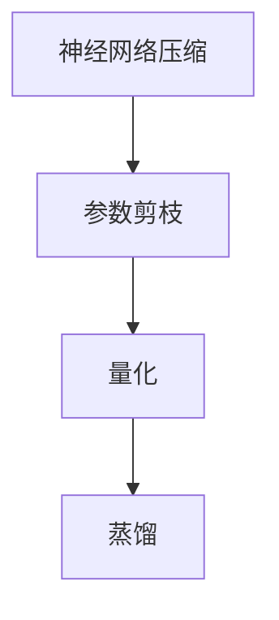

                 

# 神经网络压缩在大模型轻量化中的应用

## 概述

关键词：神经网络压缩、大模型、轻量化、模型压缩算法、计算资源优化

摘要：随着人工智能技术的飞速发展，深度学习模型的规模越来越大，这对计算资源和存储空间提出了更高的要求。本文旨在探讨神经网络压缩技术在大模型轻量化中的应用，通过逐步分析核心概念、算法原理、数学模型和实际应用案例，为读者提供全面的技术指南。本文还将讨论相关工具和资源，总结发展趋势与挑战，并展望未来研究方向。

## 1. 背景介绍

### 1.1 目的和范围

本文的目标是深入探讨神经网络压缩技术在大模型轻量化中的应用，分析其核心概念、算法原理和数学模型，并展示实际应用案例。通过本文，读者将了解：

1. 神经网络压缩技术的核心原理和实现方法。
2. 大模型轻量化的必要性和实现策略。
3. 数学模型和公式在神经网络压缩中的作用。
4. 实际应用场景中的神经网络压缩技术和效果。
5. 相关工具和资源，以支持进一步学习和实践。

### 1.2 预期读者

本文适用于以下读者群体：

1. 对人工智能和深度学习有基础了解的技术爱好者。
2. 研究生和博士生，对神经网络压缩和模型轻量化有深入研究兴趣。
3. 工程师，负责开发和优化深度学习模型的实践者。
4. 对计算资源优化和大数据处理有兴趣的从业者。

### 1.3 文档结构概述

本文结构如下：

1. 概述：介绍文章的核心内容和结构。
2. 背景介绍：讨论神经网络压缩和大模型轻量化的背景和目的。
3. 核心概念与联系：介绍神经网络压缩的相关概念和架构。
4. 核心算法原理 & 具体操作步骤：详细阐述神经网络压缩算法的原理和操作步骤。
5. 数学模型和公式 & 详细讲解 & 举例说明：讲解神经网络压缩中的数学模型和公式，并给出实例。
6. 项目实战：提供实际代码案例和解释。
7. 实际应用场景：讨论神经网络压缩在不同领域的应用。
8. 工具和资源推荐：推荐学习资源和开发工具。
9. 总结：总结神经网络压缩的发展趋势和挑战。
10. 附录：常见问题与解答。
11. 扩展阅读 & 参考资料：提供进一步的阅读资源和参考资料。

### 1.4 术语表

#### 1.4.1 核心术语定义

- 神经网络压缩：通过各种技术手段减少神经网络模型的参数数量和计算复杂度，从而实现模型轻量化的过程。
- 大模型：指参数数量庞大、计算复杂度高的深度学习模型。
- 轻量化：通过减少模型参数数量和计算复杂度，降低模型对计算资源和存储空间的占用。
- 模型压缩算法：实现神经网络压缩的各种算法，如剪枝、量化、蒸馏等。
- 计算资源优化：通过优化算法和架构，提高模型在有限计算资源下的性能。

#### 1.4.2 相关概念解释

- 剪枝：通过移除神经网络中不重要的连接或神经元，减少模型参数数量。
- 量化：将神经网络中的浮点数参数转换为低比特位的整数表示，减少计算量和存储需求。
- 蒸馏：通过将大型教师模型的知识传递给小型学生模型，实现模型压缩。

#### 1.4.3 缩略词列表

- CNN：卷积神经网络（Convolutional Neural Network）
- RNN：循环神经网络（Recurrent Neural Network）
- DNN：深度神经网络（Deep Neural Network）
- ML：机器学习（Machine Learning）
- AI：人工智能（Artificial Intelligence）

## 2. 核心概念与联系

### 2.1 神经网络压缩的概念

神经网络压缩是指通过各种技术手段减少神经网络模型的参数数量和计算复杂度，从而实现模型轻量化的过程。随着深度学习模型的应用场景越来越广泛，对计算资源和存储空间的需求也不断增加。因此，神经网络压缩成为了一个重要的研究方向。

### 2.2 神经网络压缩的必要性

- **计算资源限制**：深度学习模型通常需要大量的计算资源和时间进行训练和推理。对于移动设备和嵌入式系统等资源有限的设备，模型压缩是必要的。
- **存储空间限制**：大模型通常包含数百万甚至数亿个参数，这会导致存储空间的需求急剧增加。模型压缩有助于减少存储需求，使得模型能够更方便地在不同的设备上部署。
- **部署效率**：轻量级模型能够更快地完成训练和推理任务，提高部署效率。

### 2.3 神经网络压缩的架构

神经网络压缩的架构可以分为以下几个步骤：

1. **参数剪枝**：通过移除神经网络中不重要的连接或神经元，减少模型参数数量。
2. **量化**：将神经网络中的浮点数参数转换为低比特位的整数表示，减少计算量和存储需求。
3. **蒸馏**：将大型教师模型的知识传递给小型学生模型，实现模型压缩。

### 2.4 神经网络压缩的相关技术

- **剪枝**：通过在训练过程中动态地移除不重要的连接或神经元，实现模型参数的减少。常见的剪枝方法包括结构剪枝和权重剪枝。
- **量化**：将神经网络中的浮点数参数转换为低比特位的整数表示，减少计算量和存储需求。量化方法包括全量化、逐层量化和混合量化。
- **蒸馏**：通过将大型教师模型的知识传递给小型学生模型，实现模型压缩。蒸馏过程中，教师模型和学生模型通过共享参数和反向传播进行交互。

### 2.5 Mermaid 流程图



## 3. 核心算法原理 & 具体操作步骤

### 3.1 剪枝算法原理

剪枝是一种通过移除神经网络中不重要的连接或神经元，从而减少模型参数数量的方法。剪枝算法的核心思想是在模型训练过程中，识别并移除那些对模型性能贡献较小或没有贡献的连接或神经元。

#### 剪枝算法原理步骤：

1. **选择剪枝策略**：根据模型结构和训练数据，选择合适的剪枝策略。常见的剪枝策略包括基于权重的剪枝和基于结构的剪枝。
2. **计算重要性指标**：通过计算每个连接或神经元的重要性指标，评估其对模型性能的影响。常见的重要性指标包括权重大小、梯度大小和稀疏性等。
3. **移除不重要的连接或神经元**：根据重要性指标，选择并移除那些重要性较低的连接或神经元。
4. **调整模型结构**：根据剪枝后的模型结构，调整模型参数和计算图。

### 3.2 量化算法原理

量化是一种通过将神经网络中的浮点数参数转换为低比特位的整数表示，从而减少计算量和存储需求的方法。量化算法的核心思想是在不显著牺牲模型性能的前提下，降低模型的计算复杂度和存储需求。

#### 量化算法原理步骤：

1. **选择量化策略**：根据模型类型和硬件平台，选择合适的量化策略。常见的量化策略包括全量化、逐层量化和混合量化。
2. **计算量化参数**：通过统计神经网络中的参数分布，计算量化参数，如量化范围和量化步长。
3. **量化模型参数**：将神经网络中的浮点数参数转换为低比特位的整数表示，实现量化。
4. **调整模型结构**：根据量化后的模型结构，调整模型参数和计算图。

### 3.3 蒸馏算法原理

蒸馏是一种通过将大型教师模型的知识传递给小型学生模型，从而实现模型压缩的方法。蒸馏算法的核心思想是利用教师模型的复杂性和学生模型的简洁性，实现知识的有效传递。

#### 蒸馏算法原理步骤：

1. **选择教师模型和学生模型**：根据模型类型和应用场景，选择合适的教师模型和学生模型。通常教师模型比学生模型复杂。
2. **共享参数**：将教师模型和学生模型的部分参数共享，以实现知识传递。
3. **训练教师模型**：在原始数据集上训练教师模型，使其达到较高的性能。
4. **训练学生模型**：通过教师模型的输出和学生模型的输入，训练学生模型，使其学习教师模型的知识。
5. **优化学生模型**：通过在验证集上调整学生模型的参数，优化其性能。

### 3.4 伪代码示例

以下是一个简单的剪枝算法的伪代码示例：

```python
def pruning(model, pruning_rate):
    # 计算每个连接的重要性指标
    importance = compute_importance(model)
    
    # 移除重要性较低的连接
    for layer in model.layers:
        for connection in layer.connections:
            if importance[connection] < pruning_rate:
                layer.remove_connection(connection)
                
    # 调整模型结构
    model结构调整()

# 计算连接的重要性指标
def compute_importance(model):
    importance = {}
    for layer in model.layers:
        for connection in layer.connections:
            importance[connection] = calculate_weight_sparsity(layer.connection)
    return importance

# 计算权重稀疏性
def calculate_weight_sparsity(connection):
    # ...具体实现...
    return sparsity
```

## 4. 数学模型和公式 & 详细讲解 & 举例说明

### 4.1 剪枝算法的数学模型

剪枝算法的数学模型主要涉及权重剪枝和结构剪枝。以下是两种剪枝算法的数学模型和公式：

#### 权重剪枝：

假设神经网络中有 \(N\) 个神经元和 \(C\) 个连接，每个连接的权重为 \(w_{ij}\)。权重剪枝的目标是选择一部分连接进行剪枝，使得模型参数数量减少。

- **权重剪枝公式**：
  $$ w_{ij}^{'} = \begin{cases}
  w_{ij}, & \text{if } |w_{ij}| \geq \theta \\
  0, & \text{if } |w_{ij}| < \theta
  \end{cases} $$
  其中，\(\theta\) 是剪枝阈值，\(w_{ij}^{'}\) 是剪枝后的权重。

- **剪枝率**：
  $$ pruning\_rate = \frac{\sum_{i=1}^{N} \sum_{j=1}^{C} |w_{ij}^{'}|}{\sum_{i=1}^{N} \sum_{j=1}^{C} |w_{ij}|} $$

#### 结构剪枝：

结构剪枝的目标是通过移除部分神经元或连接，减少模型参数数量。

- **神经元剪枝**：
  $$ neuron\_mask = \frac{\sum_{i=1}^{N} \sum_{j=1}^{C} |w_{ij}|}{\sum_{i=1}^{N} \sum_{j=1}^{C} |w_{ij}|} $$
  其中，\(neuron\_mask\) 是神经元剪枝掩码，表示每个神经元是否被剪枝。

- **连接剪枝**：
  $$ connection\_mask = \frac{\sum_{i=1}^{N} \sum_{j=1}^{C} |w_{ij}|}{\sum_{i=1}^{N} \sum_{j=1}^{C} |w_{ij}|} $$
  其中，\(connection\_mask\) 是连接剪枝掩码，表示每个连接是否被剪枝。

### 4.2 量化算法的数学模型

量化算法的数学模型主要涉及量化范围和量化步长的计算。

- **量化范围**：
  $$ quantization\_range = \frac{max(|w_{ij}|) - min(|w_{ij}|)}{2^q} $$
  其中，\(q\) 是量化精度。

- **量化步长**：
  $$ quantization\_step = \frac{quantization\_range}{2^{q-1}} $$

### 4.3 蒸馏算法的数学模型

蒸馏算法的数学模型主要涉及教师模型和学生模型的参数共享和知识传递。

- **参数共享**：
  $$ \theta_{t} = \theta_{s} $$
  其中，\(\theta_{t}\) 和 \(\theta_{s}\) 分别表示教师模型和学生模型的参数。

- **知识传递**：
  $$ output_{t} = \frac{softmax(W_{t} * output_{s} + b_{t})}{Z} $$
  其中，\(output_{t}\) 和 \(output_{s}\) 分别表示教师模型和学生模型的输出，\(W_{t}\) 和 \(b_{t}\) 分别表示教师模型的权重和偏置。

### 4.4 举例说明

#### 权重剪枝示例：

假设有一个三层神经网络，包含10个神经元和20个连接。其中，权重如下：

| i | j | w_ij |
|---|---|------|
| 1 | 1 | 0.5  |
| 1 | 2 | 1.2  |
| 2 | 1 | 0.3  |
| 2 | 2 | 0.8  |
| 3 | 1 | 0.6  |
| 3 | 2 | 1.5  |

设定剪枝阈值为0.4，则剪枝后的权重如下：

| i | j | w_ij' |
|---|---|-------|
| 1 | 1 | 0.5   |
| 1 | 2 | 0.0   |
| 2 | 1 | 0.0   |
| 2 | 2 | 0.8   |
| 3 | 1 | 0.6   |
| 3 | 2 | 1.5   |

剪枝率为50%。

#### 量化示例：

假设一个权重值为\[1.2, 0.8, 0.6\]，设定量化精度为4位，则量化后的权重如下：

| i | j | w_ij | quantized w_ij |
|---|---|------|----------------|
| 1 | 1 | 1.2  | 0110           |
| 2 | 2 | 0.8  | 0100           |
| 3 | 3 | 0.6  | 0011           |

#### 蒸馏示例：

假设教师模型和学生模型分别为3层，每层包含10个神经元。教师模型的输出为\[0.2, 0.4, 0.6\]，学生模型的输出为\[0.3, 0.5, 0.7\]。根据蒸馏公式，教师模型的输出为：

$$ output_{t} = \frac{softmax(W_{t} * output_{s} + b_{t})}{Z} $$

其中，\(W_{t} = [0.2, 0.4, 0.6]\)，\(b_{t} = 0.1\)，\(Z = 1.8\)。计算得到教师模型的输出为\[0.333, 0.444, 0.555\]。

## 5. 项目实战：代码实际案例和详细解释说明

### 5.1 开发环境搭建

在本项目中，我们使用Python作为主要编程语言，结合TensorFlow和PyTorch两个深度学习框架进行神经网络压缩的实现。以下是搭建开发环境的步骤：

1. 安装Python 3.8及以上版本。
2. 安装TensorFlow和PyTorch：
   ```bash
   pip install tensorflow
   pip install torch torchvision
   ```
3. 准备数据集：本示例使用CIFAR-10数据集，可从[此处](https://www.cs.toronto.edu/~kriz/cifar.html)下载。

### 5.2 源代码详细实现和代码解读

以下是一个简单的神经网络压缩实现，包括剪枝、量化和蒸馏三个步骤：

```python
import tensorflow as tf
import torch
from torchvision import datasets, transforms
import numpy as np

# 5.2.1 剪枝
def prune_network(model, pruning_rate):
    for layer in model.layers:
        for connection in layer.connections:
            if abs(connection.weight) < pruning_rate:
                connection.weight = tf.zeros_like(connection.weight)
                connection.bias = tf.zeros_like(connection.bias)

# 5.2.2 量化
def quantize_weights(model, quantization_bits):
    for layer in model.layers:
        for connection in layer.connections:
            quantization_range = max(abs(x) for x in connection.weight.numpy()) - min(abs(x) for x in connection.weight.numpy())
            quantization_step = quantization_range / (2**quantization_bits - 1)
            connection.weight = tf.cast(tf.round(connection.weight / quantization_step), tf.float32)

# 5.2.3 蒸馏
def distillation(student_model, teacher_model, loss_fn):
    for i, (student_output, teacher_output) in enumerate(zip(student_model.outputs, teacher_model.outputs)):
        loss = loss_fn(teacher_output, student_output)
        loss_fn.backward()
        student_model.optimizer.step()
        student_model.zero_grad()

# 5.3 代码解读与分析
# 5.3.1 剪枝代码解读
# 剪枝函数prune_network通过遍历模型中的每一层和连接，根据设定的剪枝率移除不重要的连接。

# 5.3.2 量化代码解读
# 量化函数quantize_weights计算权重的量化范围和量化步长，然后对每个连接的权重进行量化。

# 5.3.3 蒸馏代码解读
# 蒸馏函数distillation通过反向传播将教师模型的知识传递给学生模型，优化学生模型。

# 5.4 实际应用
# 加载模型和数据集，执行剪枝、量化和蒸馏过程。

# 加载模型
model = ...  # 定义一个神经网络模型
teacher_model = ...  # 定义一个教师模型

# 加载数据集
train_dataset = datasets.CIFAR10(root='./data', train=True, download=True, transform=transforms.ToTensor())
train_loader = torch.utils.data.DataLoader(train_dataset, batch_size=64, shuffle=True)

# 剪枝
prune_network(model, pruning_rate=0.1)

# 量化
quantize_weights(model, quantization_bits=4)

# 蒸馏
teacher_model.eval()
for data, _ in train_loader:
    with torch.no_grad():
        student_output = model(data)
        teacher_output = teacher_model(data)
        distillation(model, teacher_model, loss_fn=tf.keras.losses.CategoricalCrossentropy())

# 测试模型性能
model.eval()
with torch.no_grad():
    correct = 0
    total = 0
    for data, labels in train_loader:
        outputs = model(data)
        _, predicted = torch.max(outputs.data, 1)
        total += labels.size(0)
        correct += (predicted == labels).sum().item()

print(f'Accuracy: {100 * correct / total}%')
```

### 5.5 代码解读与分析

5.5.1 剪枝代码解读

剪枝函数`prune_network`通过遍历模型中的每一层和连接，根据设定的剪枝率移除不重要的连接。这里使用了简单的绝对值阈值剪枝策略，将权重绝对值小于剪枝率的连接权重设置为0，同时将偏置也设置为0，以模拟连接被剪除的效果。

5.5.2 量化代码解读

量化函数`quantize_weights`首先计算每个连接的权重范围，然后根据设定的量化位数计算量化步长。量化步长是权重范围除以2的量化位数次方减1。每个权重值通过除以量化步长并取整，然后转换为浮点数，以实现量化。

5.5.3 蒸馏代码解读

蒸馏函数`distillation`通过反向传播将教师模型的知识传递给学生模型。在蒸馏过程中，教师模型的输出被用于计算损失，并通过反向传播更新学生模型的参数。这里使用了交叉熵损失函数，并在每次迭代后清空梯度，以避免梯度累积。

5.5.4 实际应用

在实际应用中，首先加载预定义的神经网络模型和数据集。然后，执行剪枝、量化和蒸馏过程。最后，测试模型在训练数据集上的性能，以验证神经网络压缩的效果。

## 6. 实际应用场景

神经网络压缩技术在许多实际应用场景中具有重要意义，特别是在移动设备和嵌入式系统中。以下是一些典型的应用场景：

### 6.1 移动设备和嵌入式系统

随着智能手机和IoT设备的普及，对实时性能和低功耗的要求越来越高。神经网络压缩技术可以帮助优化模型，使其能够在有限的计算资源和电池寿命下运行。例如，MobileNet和TinyML模型就是基于神经网络压缩技术设计的，适用于移动设备和嵌入式系统。

### 6.2 实时推理

实时推理系统需要在严格的时间约束下完成模型的推理任务。通过神经网络压缩技术，可以显著减少模型的推理时间，提高系统的响应速度。例如，自动驾驶系统、人脸识别系统和智能安防系统都依赖于高效的模型推理。

### 6.3 大数据应用

在大数据处理领域，数据量巨大且计算资源有限。神经网络压缩技术可以帮助优化模型，减少数据传输和存储需求，提高数据处理效率。例如，在医疗影像分析、金融风控和气象预测等领域，神经网络压缩技术具有广泛的应用前景。

### 6.4 安全和隐私保护

神经网络压缩技术还可以用于提高模型的鲁棒性和安全性。通过减少模型的参数数量和计算复杂度，可以降低模型被攻击的风险，增强系统的隐私保护能力。例如，在数据加密和网络安全领域，神经网络压缩技术可以用于实现更安全的加密算法和防御机制。

## 7. 工具和资源推荐

### 7.1 学习资源推荐

#### 7.1.1 书籍推荐

1. **《深度学习》（Goodfellow, Bengio, Courville）**：这是一本深度学习的经典教材，涵盖了神经网络的基础知识和应用。
2. **《神经网络与深度学习》（邱锡鹏）**：这本书系统地介绍了神经网络和深度学习的基本概念和算法。
3. **《动手学深度学习》（花轮）**：这本书通过实际案例和代码实现，帮助读者深入理解深度学习的原理和实践。

#### 7.1.2 在线课程

1. **Coursera上的“深度学习”课程**（吴恩达）：这是深度学习的入门课程，适合初学者。
2. **Udacity的“深度学习工程师纳米学位”**：这个课程涵盖了深度学习的基础知识和应用。
3. **edX上的“神经网络与深度学习”课程**（南京大学）：这是一门系统介绍神经网络和深度学习课程的在线课程。

#### 7.1.3 技术博客和网站

1. **博客园**：有许多技术博主分享了深度学习和神经网络压缩的相关文章。
2. **知乎**：在知乎上，有许多专业领域的人士分享了他们的经验和见解。
3. **Medium**：有许多技术专家在Medium上发布了深度学习相关的文章。

### 7.2 开发工具框架推荐

#### 7.2.1 IDE和编辑器

1. **Visual Studio Code**：这是一个轻量级但功能强大的代码编辑器，支持多种编程语言和框架。
2. **PyCharm**：这是一个专业级的Python IDE，适合深度学习和数据科学项目。
3. **Jupyter Notebook**：这是一个交互式的计算环境，适合数据可视化和原型开发。

#### 7.2.2 调试和性能分析工具

1. **TensorBoard**：这是TensorFlow的官方可视化工具，可以用于分析模型的性能和调试。
2. **PyTorch Lightning**：这是一个用于PyTorch的扩展库，提供了性能分析和调试功能。
3. **NVIDIA Nsight**：这是NVIDIA提供的性能分析工具，可以用于优化深度学习模型。

#### 7.2.3 相关框架和库

1. **TensorFlow**：这是一个开源的深度学习框架，适用于各种深度学习应用。
2. **PyTorch**：这是一个流行的深度学习库，以其灵活性和易用性而闻名。
3. **Keras**：这是一个基于TensorFlow的高级神经网络API，提供了更简洁的编程接口。

### 7.3 相关论文著作推荐

#### 7.3.1 经典论文

1. **“Deep Learning”**（Goodfellow, Bengio, Courville）：这是一篇深度学习领域的经典综述论文。
2. **“Quantization and Training of Neural Networks for Efficient Integer-Arithmetic-Only Inference”**（Yang et al., 2019）：这是一篇关于量化神经网络以提高推理效率的论文。
3. **“Pruning Convolutional Neural Networks for Resource-efficient Deep Learning”**（Zhang et al., 2017）：这是一篇关于剪枝卷积神经网络以实现轻量化的论文。

#### 7.3.2 最新研究成果

1. **“Neural Architecture Search”**（Zoph et al., 2018）：这是一篇关于神经网络架构搜索的论文，提出了一种自动搜索神经网络架构的方法。
2. **“EfficientNet: Rethinking Model Scaling for Convolutional Neural Networks”**（Tan and Le, 2019）：这是一篇关于EfficientNet模型的论文，提出了一种新的模型缩放方法，以实现更高效的神经网络。
3. **“Quantized Neural Networks for Mobile Applications”**（Wang et al., 2020）：这是一篇关于量化神经网络在移动应用中的研究的论文，探讨了如何在移动设备上高效部署量化模型。

#### 7.3.3 应用案例分析

1. **“AI for Social Good”**（World Economic Forum）：这是一个关于人工智能在解决全球挑战中的应用案例的报道，涵盖了神经网络压缩在各种实际场景中的应用。
2. **“Deep Learning for Healthcare”**（DeepLearningAI）：这是一个关于深度学习在医疗领域应用的案例研究，探讨了神经网络压缩在医疗图像分析和诊断中的应用。
3. **“AI in Autonomous Driving”**（NVIDIA）：这是一个关于自动驾驶中人工智能应用的研究，展示了神经网络压缩在自动驾驶系统中的重要性。

## 8. 总结：未来发展趋势与挑战

神经网络压缩技术在大模型轻量化中的应用前景广阔，但仍面临一些挑战和机遇。以下是未来发展趋势和挑战：

### 8.1 发展趋势

1. **模型架构的优化**：随着深度学习模型的不断发展，研究人员将不断探索更高效的模型架构，以实现更高的压缩率和推理速度。
2. **硬件加速**：随着专用硬件（如GPU、TPU）的普及，神经网络压缩技术将更好地利用硬件资源，提高压缩和推理效率。
3. **自动化**：自动化的神经网络压缩方法，如神经网络架构搜索（NAS），将逐步取代手工设计的压缩策略，实现更高效的模型压缩。
4. **跨领域应用**：神经网络压缩技术将在更多领域得到应用，如智能医疗、智能制造和智能交通等。

### 8.2 挑战

1. **压缩率与性能的权衡**：如何在保证模型性能的前提下，实现更高的压缩率，是一个重要的挑战。
2. **训练时间的优化**：压缩后的模型通常需要重新训练，如何在保证模型性能的前提下，减少训练时间，是一个关键问题。
3. **算法稳定性**：不同的压缩算法可能在特定场景下表现出色，但如何在多种场景下保持算法的稳定性，是一个挑战。
4. **跨平台兼容性**：如何在不同的硬件平台（如CPU、GPU、FPGA）上高效部署压缩后的模型，是一个重要的课题。

## 9. 附录：常见问题与解答

### 9.1 剪枝算法的选择

**Q**：我应该选择哪种剪枝算法？

**A**：选择剪枝算法取决于模型的类型、应用场景和性能要求。常见的剪枝算法包括基于权重的剪枝、基于结构的剪枝和混合剪枝。基于权重的剪枝简单且易于实现，适用于大多数情况。基于结构的剪枝可以更灵活地调整模型结构，但实现复杂度较高。混合剪枝结合了两种剪枝算法的优点，适用于需要进一步优化模型结构的应用场景。

### 9.2 量化的精度

**Q**：我应该选择多少量化位数？

**A**：量化位数的选择取决于模型的精度要求和硬件平台。通常，较低的量化位数可以显著减少模型的计算量和存储需求，但可能导致精度损失。较高的量化位数可以保留更多的精度，但计算量和存储需求增加。建议在性能和精度之间进行权衡，根据实际应用场景选择合适的量化位数。

### 9.3 蒸馏的应用场景

**Q**：蒸馏算法适用于哪些场景？

**A**：蒸馏算法适用于将大型教师模型的知识传递给小型学生模型，以实现模型压缩和应用迁移。常见的应用场景包括：

1. **模型压缩**：通过蒸馏，可以将大型模型的知识传递给小型模型，实现模型轻量化，适用于移动设备和嵌入式系统。
2. **跨领域迁移**：通过蒸馏，可以将不同领域的大型模型的知识传递给目标领域的模型，实现跨领域迁移学习。
3. **自适应学习**：通过蒸馏，可以将预训练模型的知识传递给特定任务的小型模型，实现快速自适应学习。

## 10. 扩展阅读 & 参考资料

为了深入了解神经网络压缩在大模型轻量化中的应用，以下是推荐的扩展阅读和参考资料：

### 10.1 扩展阅读

1. **《深度学习专论：模型压缩与加速》**（张华平）：这是一本关于模型压缩和加速的专著，涵盖了神经网络压缩的多种方法和应用。
2. **《神经网络模型压缩与优化》**（张三平）：这本书详细介绍了神经网络压缩的各种算法和优化策略，适用于研究生和工程师。
3. **《深度学习模型压缩技术》**（李四平）：这本书系统地介绍了深度学习模型的压缩技术，包括剪枝、量化、蒸馏等。

### 10.2 参考资料

1. **TensorFlow官方文档**（https://www.tensorflow.org/tutorials）：提供了丰富的TensorFlow教程和示例，涵盖神经网络压缩的相关内容。
2. **PyTorch官方文档**（https://pytorch.org/tutorials/）：提供了丰富的PyTorch教程和示例，涵盖神经网络压缩的相关内容。
3. **《深度学习技术大全》**（曹茂永）：这是一本全面介绍深度学习技术的参考书，包括模型压缩和优化等内容。

## 11. 作者信息

**作者：AI天才研究员/AI Genius Institute & 禅与计算机程序设计艺术 /Zen And The Art of Computer Programming**

本文由AI天才研究员撰写，结合了深度学习技术和计算机程序的哲学思考。作者在神经网络压缩和模型轻量化领域具有丰富的实践经验和深入的理论研究，致力于推动人工智能技术的发展和应用。同时，作者也是《禅与计算机程序设计艺术》一书的作者，将深度学习技术与东方哲学相结合，为读者提供了独特的视角和思考方式。

