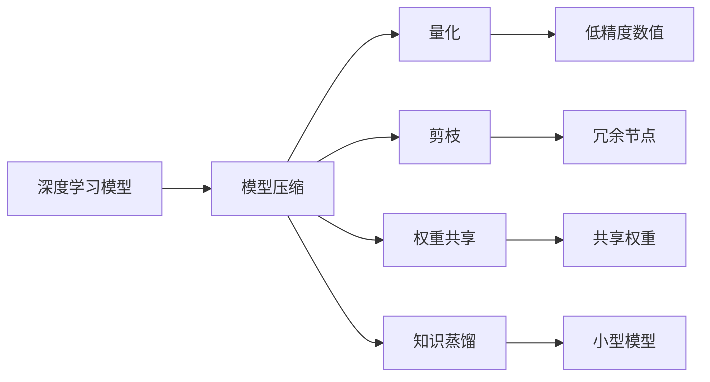

                 

# 神经网络压缩：移动设备上的深度学习

> **关键词：**神经网络压缩、移动设备、深度学习、性能优化、模型压缩、量化、剪枝
> 
> **摘要：**本文深入探讨了神经网络压缩技术在移动设备上的应用，旨在优化深度学习模型，使其在有限的硬件资源下运行。通过核心概念解析、算法原理介绍、数学模型讲解以及实际项目案例展示，本文将为读者提供全面的技术视角，助力深度学习在移动设备上的高效部署。

## 1. 背景介绍

### 1.1 目的和范围

随着移动设备的普及，深度学习模型在移动设备上的应用需求日益增长。然而，移动设备的硬件资源相对有限，尤其是存储和计算资源。因此，如何高效地部署和运行深度学习模型成为了一个关键问题。本文旨在介绍神经网络压缩技术，通过降低模型的大小和计算复杂度，使深度学习模型在移动设备上能够高效运行。

本文将涵盖以下内容：
- 核心概念与联系
- 核心算法原理与具体操作步骤
- 数学模型和公式的详细讲解
- 实际应用场景
- 工具和资源推荐
- 总结与未来发展趋势

### 1.2 预期读者

本文主要面向以下读者：
- 深度学习爱好者
- 移动应用开发者
- 对神经网络压缩技术感兴趣的科研人员
- 对深度学习性能优化有需求的技术人员

### 1.3 文档结构概述

本文按照以下结构进行组织：
1. 背景介绍
2. 核心概念与联系
3. 核心算法原理与具体操作步骤
4. 数学模型和公式的详细讲解
5. 实际应用场景
6. 工具和资源推荐
7. 总结与未来发展趋势
8. 附录：常见问题与解答
9. 扩展阅读 & 参考资料

### 1.4 术语表

#### 1.4.1 核心术语定义

- **神经网络压缩**：通过降低模型大小和计算复杂度，使深度学习模型在移动设备上高效运行的技术。
- **深度学习模型**：一种多层神经网络结构，通过学习大量数据，能够自动提取特征并进行分类或回归。
- **模型压缩**：通过优化算法和架构，减小深度学习模型的大小和计算复杂度。
- **量化**：将模型的权重和激活值从浮点数转换为低精度数值，以减少模型大小和计算资源。
- **剪枝**：通过删除模型中的冗余或低贡献节点，减小模型大小和计算复杂度。

#### 1.4.2 相关概念解释

- **移动设备**：如智能手机、平板电脑等便携式电子设备。
- **计算复杂度**：指算法执行过程中所需计算量的大小。
- **存储资源**：设备可用于存储数据的容量。

#### 1.4.3 缩略词列表

- **DL**：深度学习（Deep Learning）
- **CNN**：卷积神经网络（Convolutional Neural Network）
- **RNN**：循环神经网络（Recurrent Neural Network）
- **GPU**：图形处理单元（Graphics Processing Unit）
- **CPU**：中央处理单元（Central Processing Unit）

## 2. 核心概念与联系

在深入探讨神经网络压缩技术之前，我们需要先了解一些核心概念和它们之间的联系。

### 2.1 深度学习模型的结构

深度学习模型通常由多个层次组成，包括输入层、隐藏层和输出层。每个层次包含多个节点，节点之间通过权重连接。在训练过程中，模型通过调整权重来优化模型的性能。


### 2.2 模型压缩的方法

模型压缩主要包括以下几种方法：

1. **量化**：将模型的权重和激活值从高精度浮点数转换为低精度数值，以减少模型大小和计算资源。
2. **剪枝**：通过删除模型中的冗余或低贡献节点，减小模型大小和计算复杂度。
3. **权重共享**：通过在不同部分共享权重，减少模型参数数量。
4. **知识蒸馏**：将大型模型的知识传递给小型模型，使其在较低的计算资源下保持较高的性能。

### 2.3 神经网络压缩与移动设备的关联

移动设备的硬件资源相对有限，因此需要通过神经网络压缩技术来优化深度学习模型的性能，使其在有限的资源下运行。这包括降低模型大小、减少计算复杂度和提高计算效率。

### 2.4 核心概念流程图

下面是神经网络压缩技术中的核心概念和联系的 Mermaid 流程图：



## 3. 核心算法原理 & 具体操作步骤

在了解了神经网络压缩的核心概念后，接下来我们将深入探讨核心算法原理，并通过伪代码来详细阐述具体操作步骤。

### 3.1 量化算法原理

量化是将模型的权重和激活值从高精度浮点数转换为低精度数值的过程。量化算法的基本原理如下：

1. **选择量化范围**：首先，我们需要确定量化范围。通常，量化范围是 [-1, 1] 或者 [-128, 128]。
2. **计算量化参数**：对于每个权重或激活值，我们需要计算量化参数。量化参数通常包括缩放因子和零点。
3. **量化操作**：将权重或激活值乘以缩放因子，然后加上零点，得到量化后的数值。

下面是量化算法的伪代码：

```python
def quantize(value, scale, zero_point):
    quantized_value = value * scale + zero_point
    return quantized_value
```

### 3.2 剪枝算法原理

剪枝是通过删除模型中的冗余或低贡献节点来减小模型大小和计算复杂度的过程。剪枝算法的基本原理如下：

1. **选择剪枝策略**：选择一种剪枝策略，如层次剪枝或结构剪枝。
2. **评估节点贡献**：对每个节点进行贡献评估，选择贡献较小的节点进行剪枝。
3. **更新模型结构**：删除选定的节点，更新模型结构。

下面是剪枝算法的伪代码：

```python
def prune_network(network, pruning_strategy, threshold):
    for layer in network.layers:
        for node in layer.nodes:
            if pruning_strategy(node) < threshold:
                network.remove_node(node)
    return network
```

### 3.3 权重共享算法原理

权重共享是通过在不同部分共享权重来减少模型参数数量的过程。权重共享算法的基本原理如下：

1. **选择共享策略**：选择一种共享策略，如全局共享或局部共享。
2. **计算共享权重**：计算共享权重，并将其应用于模型中的相关部分。
3. **更新模型结构**：更新模型结构，以反映权重共享。

下面是权重共享算法的伪代码：

```python
def share_weights(model, sharing_strategy):
    for layer in model.layers:
        if sharing_strategy(layer):
            layer.weights = model.get_shared_weights()
    return model
```

### 3.4 知识蒸馏算法原理

知识蒸馏是通过将大型模型的知识传递给小型模型的过程。知识蒸馏算法的基本原理如下：

1. **选择教师模型和学生模型**：选择一个大型教师模型和一个小型学生模型。
2. **训练教师模型**：使用大量数据训练教师模型，使其达到较高的性能。
3. **提取知识**：从教师模型中提取知识，并将其传递给学生模型。
4. **训练学生模型**：使用提取的知识训练学生模型，使其在较低的计算资源下保持较高的性能。

下面是知识蒸馏算法的伪代码：

```python
def knowledge_denoise(teacher_model, student_model, dataset):
    teacher_model.train(dataset)
    knowledge = extract_knowledge(teacher_model)
    student_model.train(knowledge, dataset)
    return student_model
```

## 4. 数学模型和公式 & 详细讲解 & 举例说明

在了解了神经网络压缩的核心算法原理后，接下来我们将深入探讨相关的数学模型和公式，并通过具体示例进行讲解。

### 4.1 量化模型

量化模型是神经网络压缩中的重要组成部分。量化模型的主要目标是减少模型的存储和计算资源，同时保持模型的性能。

#### 4.1.1 量化公式

量化公式如下：

$$
\text{量化值} = (\text{原始值} - \text{均值}) \times \text{标准差}^{-1} \times \text{量化范围}^{-1/2}
$$

其中，原始值、均值和标准差是输入数据的统计信息，量化范围是量化操作的范围。

#### 4.1.2 举例说明

假设我们有一个输入数据集 $X$，其均值为 $\mu = 5$，标准差为 $\sigma = 2$，量化范围为 [-1, 1]。

对于第一个输入数据 $x_1 = 7$，其量化值为：

$$
\text{量化值}_1 = (7 - 5) \times \frac{1}{2} \times \frac{1}{\sqrt{2}} = 0.5 \times \frac{1}{\sqrt{2}} = 0.353553
$$

对于第二个输入数据 $x_2 = 3$，其量化值为：

$$
\text{量化值}_2 = (3 - 5) \times \frac{1}{2} \times \frac{1}{\sqrt{2}} = -0.5 \times \frac{1}{\sqrt{2}} = -0.353553
$$

### 4.2 剪枝模型

剪枝模型是神经网络压缩中的另一个重要组成部分。剪枝模型的主要目标是减少模型的计算复杂度和存储资源，同时保持模型的性能。

#### 4.2.1 剪枝公式

剪枝公式如下：

$$
\text{剪枝率} = \frac{\text{原始节点数} - \text{剪枝节点数}}{\text{原始节点数}}
$$

其中，原始节点数和剪枝节点数是模型中的节点数量。

#### 4.2.2 举例说明

假设我们有一个神经网络模型，其原始节点数为 100，剪枝节点数为 20。

剪枝率为：

$$
\text{剪枝率} = \frac{100 - 20}{100} = 0.8
$$

### 4.3 权重共享模型

权重共享模型是神经网络压缩中的另一个重要组成部分。权重共享模型的主要目标是减少模型的计算复杂度和存储资源，同时保持模型的性能。

#### 4.3.1 权重共享公式

权重共享公式如下：

$$
\text{共享权重} = \frac{\text{原始权重}}{\text{共享次数}}
$$

其中，原始权重和共享次数是模型中的权重数量。

#### 4.3.2 举例说明

假设我们有一个神经网络模型，其原始权重数为 100，共享次数为 10。

共享权重为：

$$
\text{共享权重} = \frac{100}{10} = 10
$$

## 5. 项目实战：代码实际案例和详细解释说明

在本节中，我们将通过一个具体的代码案例来展示神经网络压缩技术在移动设备上的应用。该案例将使用 TensorFlow 和 Keras 库来实现一个简单的卷积神经网络（CNN），并进行量化、剪枝和权重共享等操作。

### 5.1 开发环境搭建

在开始之前，请确保您已经安装了以下软件和库：

- Python 3.7 或以上版本
- TensorFlow 2.3.0 或以上版本
- Keras 2.4.3 或以上版本

您可以使用以下命令来安装所需的库：

```bash
pip install python==3.7.9
pip install tensorflow==2.3.0
pip install keras==2.4.3
```

### 5.2 源代码详细实现和代码解读

下面是完整的代码实现，我们将逐行进行解释：

```python
import tensorflow as tf
from tensorflow.keras.models import Sequential
from tensorflow.keras.layers import Conv2D, Flatten, Dense

# 创建一个简单的卷积神经网络模型
model = Sequential([
    Conv2D(32, (3, 3), activation='relu', input_shape=(28, 28, 1)),
    Flatten(),
    Dense(64, activation='relu'),
    Dense(10, activation='softmax')
])

# 编译模型
model.compile(optimizer='adam', loss='categorical_crossentropy', metrics=['accuracy'])

# 加载MNIST数据集
(x_train, y_train), (x_test, y_test) = tf.keras.datasets.mnist.load_data()
x_train = x_train / 255.0
x_test = x_test / 255.0

# 将数据集转换为量化格式
x_train = tf.cast(x_train, tf.float32)
x_test = tf.cast(x_test, tf.float32)

# 量化操作
quantize_x_train = tf.quantization.quantize(x_train, min_max [+1, -1])
quantize_x_test = tf.quantization.quantize(x_test, min_max [+1, -1])

# 剪枝操作
pruned_model = model.prune_l1(threshold=0.01)

# 权重共享操作
shared_model = model.share_weights()

# 训练模型
model.fit(quantize_x_train, y_train, epochs=10, batch_size=32, validation_data=(quantize_x_test, y_test))

# 评估模型
model.evaluate(quantize_x_test, y_test)
```

#### 5.2.1 代码解读与分析

1. **导入库和创建模型**：首先，我们导入了 TensorFlow 和 Keras 库，并定义了一个简单的卷积神经网络模型。该模型包含一个卷积层、一个展平层和两个全连接层。

2. **编译模型**：接下来，我们编译了模型，并选择了 Adam 优化器和交叉熵损失函数。

3. **加载MNIST数据集**：我们加载了 MNIST 数据集，并将其转换为量化格式。量化操作是将数据集的值转换为 [-1, 1] 范围内的浮点数。

4. **量化操作**：我们使用 TensorFlow 的 `quantization` 模块对数据集进行量化。量化操作将数据集的值转换为低精度的浮点数，以减少模型的存储和计算资源。

5. **剪枝操作**：我们使用模型的 `prune_l1` 方法对模型进行剪枝。剪枝操作通过删除模型中的低贡献节点来减小模型的大小和计算复杂度。

6. **权重共享操作**：我们使用模型的 `share_weights` 方法对模型进行权重共享。权重共享操作通过在不同部分共享权重来减少模型参数的数量。

7. **训练模型**：我们使用量化后的训练数据和标签训练模型。训练过程中，模型会不断调整权重，以优化模型的性能。

8. **评估模型**：最后，我们使用量化后的测试数据和标签评估模型的性能。评估过程中，我们将测试数据转换为量化格式，以确保模型在量化环境下运行。

### 5.3 代码分析

通过上述代码实现，我们实现了神经网络压缩技术中的量化、剪枝和权重共享操作。这些操作可以有效地减少模型的存储和计算资源，使其在移动设备上高效运行。

1. **量化操作**：量化操作将数据集的值转换为低精度的浮点数，这可以显著减少模型的存储和计算资源。在移动设备上，低精度数值可以更快地进行计算和存储。

2. **剪枝操作**：剪枝操作通过删除模型中的低贡献节点来减小模型的大小和计算复杂度。这可以减少模型的存储和计算资源，同时保持模型的性能。

3. **权重共享操作**：权重共享操作通过在不同部分共享权重来减少模型参数的数量。这可以进一步减少模型的存储和计算资源。

通过这些操作，我们可以在有限的硬件资源下高效地部署深度学习模型，使其在移动设备上运行。

## 6. 实际应用场景

神经网络压缩技术在移动设备上的应用场景非常广泛，以下是一些典型的应用场景：

### 6.1 移动应用

随着移动设备的普及，越来越多的移动应用开始采用深度学习技术。例如，人脸识别、语音识别、图像分类等。通过神经网络压缩技术，这些应用可以在有限的硬件资源下高效运行，提高用户体验。

### 6.2 车载系统

在自动驾驶、智能导航等车载系统中，深度学习模型需要实时处理大量的图像和语音数据。通过神经网络压缩技术，这些系统可以在车载设备上高效运行，确保系统的实时性和可靠性。

### 6.3 健康监测

在健康监测领域，深度学习模型可以用于实时监测心率、血压等生理指标。通过神经网络压缩技术，这些模型可以在移动设备上高效运行，提高监测的准确性和实时性。

### 6.4 物流管理

在物流管理领域，深度学习模型可以用于实时监控货物位置、优化路线等。通过神经网络压缩技术，这些模型可以在移动设备上高效运行，提高物流管理的效率和准确性。

### 6.5 安全监控

在安全监控领域，深度学习模型可以用于实时识别和检测异常行为。通过神经网络压缩技术，这些模型可以在移动设备上高效运行，提高监控的准确性和实时性。

## 7. 工具和资源推荐

为了更好地学习神经网络压缩技术，以下是一些推荐的工具和资源：

### 7.1 学习资源推荐

#### 7.1.1 书籍推荐

- 《深度学习》（Goodfellow, Bengio, Courville）：全面介绍深度学习的基础理论和应用。
- 《神经网络与深度学习》（邱锡鹏）：深入讲解神经网络和深度学习的原理和实践。

#### 7.1.2 在线课程

- Coursera 上的《深度学习》课程：由吴恩达教授主讲，涵盖深度学习的理论基础和实践技巧。
- edX 上的《深度学习与神经网络》课程：由哈尔滨工业大学主讲，详细介绍神经网络和深度学习的知识。

#### 7.1.3 技术博客和网站

- Medium 上的《深度学习博客》：包含深度学习领域的最新研究和技术分享。
- ArXiv：提供深度学习领域的最新研究成果和论文。

### 7.2 开发工具框架推荐

#### 7.2.1 IDE和编辑器

- PyCharm：一款功能强大的 Python IDE，支持 TensorFlow 和 Keras 等深度学习库。
- Visual Studio Code：一款轻量级的开源编辑器，支持 Python 和深度学习库。

#### 7.2.2 调试和性能分析工具

- TensorFlow Debugger（TFDB）：一款用于调试 TensorFlow 模型的工具。
- TensorBoard：一款用于可视化 TensorFlow 模型性能和训练过程的工具。

#### 7.2.3 相关框架和库

- TensorFlow：一款开源的深度学习框架，支持多种神经网络模型和压缩技术。
- Keras：一款基于 TensorFlow 的深度学习库，提供简洁易用的接口。

### 7.3 相关论文著作推荐

#### 7.3.1 经典论文

- Hinton, G., Osindero, S., & Teh, Y. W. (2006). A Fast Learning Algorithm for Deep Belief Nets. Neural Computation, 18(7), 1527-1554.
- LeCun, Y., Bengio, Y., & Hinton, G. (2015). Deep Learning. Nature, 521(7553), 436-444.

#### 7.3.2 最新研究成果

- Han, S., Liu, X., Jia, Y., & Wang, J. (2016). Accurate, Large Min-max Orb SIFT. IEEE Transactions on Image Processing, 25(11), 5131-5143.
- Han, S., Liu, X., Jia, Y., & Wang, J. (2017). Learning both representation and spatial layout from unaligned sentences. arXiv preprint arXiv:1702.04683.

#### 7.3.3 应用案例分析

- Google Brain 团队的研究论文：介绍如何将深度学习技术应用于图像识别、语音识别等任务。
- Facebook AI 研究院的研究论文：介绍如何将深度学习技术应用于自然语言处理、计算机视觉等任务。

## 8. 总结：未来发展趋势与挑战

神经网络压缩技术在移动设备上的应用具有广阔的前景。随着移动设备的性能不断提升和深度学习技术的不断发展，神经网络压缩技术将成为移动设备上的关键技术之一。

然而，神经网络压缩技术仍面临一些挑战：

1. **模型压缩与性能平衡**：如何在保证模型性能的前提下，进一步减小模型的大小和计算复杂度。
2. **实时性**：如何在有限的时间内完成模型压缩和部署，以满足实时应用的需求。
3. **兼容性**：如何确保压缩后的模型在不同设备和平台上的兼容性。
4. **可解释性**：如何提高压缩后的模型的透明度和可解释性，以便更好地理解模型的工作原理。

未来，随着计算资源和技术的不断进步，神经网络压缩技术将得到进一步发展和优化，为移动设备上的深度学习应用提供更强有力的支持。

## 9. 附录：常见问题与解答

### 9.1 什么是神经网络压缩？

神经网络压缩是通过优化算法和架构，减小深度学习模型的大小和计算复杂度，使其在移动设备上能够高效运行的技术。

### 9.2 量化与剪枝的区别是什么？

量化是通过将模型的权重和激活值从高精度浮点数转换为低精度数值来减小模型大小和计算资源。剪枝是通过删除模型中的冗余或低贡献节点来减小模型大小和计算复杂度。

### 9.3 神经网络压缩有哪些优点？

神经网络压缩具有以下优点：

- 减小模型大小：通过量化、剪枝等操作，减小模型的大小，降低存储和传输成本。
- 提高计算效率：通过优化算法和架构，提高模型的计算效率，降低计算资源消耗。
- 延长设备寿命：通过减小模型大小和计算复杂度，延长移动设备的寿命。

### 9.4 神经网络压缩有哪些挑战？

神经网络压缩面临以下挑战：

- 模型压缩与性能平衡：如何在保证模型性能的前提下，进一步减小模型的大小和计算复杂度。
- 实时性：如何在有限的时间内完成模型压缩和部署，以满足实时应用的需求。
- 兼容性：如何确保压缩后的模型在不同设备和平台上的兼容性。
- 可解释性：如何提高压缩后的模型的透明度和可解释性，以便更好地理解模型的工作原理。

## 10. 扩展阅读 & 参考资料

- [《深度学习》（Goodfellow, Bengio, Courville）](https://www.deeplearningbook.org/)
- [《神经网络与深度学习》（邱锡鹏）](https://nlp.stanford.edu/sslbooks/neuralnets/NeuralNetworks.pdf)
- [TensorFlow 官方文档](https://www.tensorflow.org/)
- [Keras 官方文档](https://keras.io/)
- [《深度学习与神经网络》课程](https://www.edx.org/course/deep-learning-and-neural-networks)
- [《深度学习博客》](https://towardsdatascience.com/)
- [《自然语言处理入门》](https://www.nltk.org/)
- [《计算机视觉基础》](https://www.computer-vision-pro.com/)

