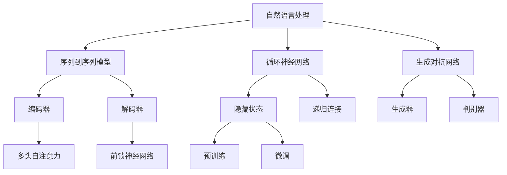

                 

# 神经网络在自然语言生成中的前沿研究

> **关键词：** 自然语言生成、神经网络、深度学习、序列到序列模型、生成对抗网络、Transformer、预训练语言模型

> **摘要：** 本文将深入探讨神经网络在自然语言生成领域的最新研究进展。首先介绍自然语言生成的基本概念，然后逐步分析序列到序列模型、生成对抗网络和Transformer等核心算法原理。接着，通过具体项目实战展示代码实现和详细解释，最后对实际应用场景、工具和资源进行推荐，并对未来发展趋势与挑战进行展望。

## 1. 背景介绍

### 1.1 目的和范围

本文旨在梳理和探讨神经网络在自然语言生成（NLG）领域的最新研究成果和前沿方向。自然语言生成是人工智能领域的一个关键问题，旨在利用机器学习技术生成具有人类语言特征的文本。随着深度学习技术的飞速发展，神经网络，特别是深度学习模型在自然语言生成中发挥了越来越重要的作用。本文将重点介绍以下内容：

1. 自然语言生成的基本概念。
2. 核心算法原理，包括序列到序列模型、生成对抗网络和Transformer。
3. 数学模型和公式。
4. 项目实战：代码实现和详细解释。
5. 实际应用场景。
6. 工具和资源推荐。
7. 未来发展趋势与挑战。

### 1.2 预期读者

本文适合以下读者群体：

1. 对自然语言生成和深度学习感兴趣的初学者和研究人员。
2. 想要深入了解神经网络在自然语言生成中应用的工程师和技术专家。
3. 对人工智能和机器学习领域有一定了解，希望掌握前沿技术的专业人士。

### 1.3 文档结构概述

本文按照以下结构进行组织：

1. 引言：介绍自然语言生成的基本概念和背景。
2. 核心概念与联系：介绍自然语言生成中涉及的核心概念和架构。
3. 核心算法原理与具体操作步骤：详细讲解自然语言生成中的核心算法。
4. 数学模型和公式：阐述自然语言生成中的数学模型和公式。
5. 项目实战：展示代码实现和详细解释。
6. 实际应用场景：探讨自然语言生成在实际中的应用。
7. 工具和资源推荐：推荐相关学习资源、开发工具和框架。
8. 总结：展望未来发展趋势与挑战。
9. 附录：常见问题与解答。
10. 扩展阅读与参考资料：提供进一步的阅读材料和资源。

### 1.4 术语表

为了确保文章的可读性和一致性，本文定义了一些关键术语：

#### 1.4.1 核心术语定义

- 自然语言生成（NLG）：指利用机器学习技术生成具有人类语言特征的文本的过程。
- 序列到序列模型（Seq2Seq）：一种用于处理序列数据的神经网络模型，常用于机器翻译、文本生成等任务。
- 生成对抗网络（GAN）：一种由生成器和判别器组成的神经网络模型，用于生成逼真的数据。
- Transformer：一种基于自注意力机制的深度学习模型，广泛应用于机器翻译、文本生成等任务。
- 预训练语言模型：一种通过在大规模语料库上进行预训练的神经网络模型，可以用于文本分类、问答系统等任务。

#### 1.4.2 相关概念解释

- 自然语言处理（NLP）：研究如何让计算机理解和处理人类语言的技术。
- 循环神经网络（RNN）：一种能够处理序列数据的神经网络模型，特别适用于时序数据和自然语言处理。
- 卷积神经网络（CNN）：一种用于图像识别和处理的神经网络模型，近年来在自然语言生成中也有应用。

#### 1.4.3 缩略词列表

- NLG：自然语言生成
- Seq2Seq：序列到序列模型
- GAN：生成对抗网络
- Transformer：Transformer模型
- NLP：自然语言处理
- RNN：循环神经网络
- CNN：卷积神经网络

## 2. 核心概念与联系

在深入探讨自然语言生成的神经网络模型之前，我们首先需要了解一些核心概念和它们之间的联系。以下是自然语言生成中涉及的一些关键概念和它们的关联：

### 2.1 自然语言处理（NLP）

自然语言处理是人工智能的一个分支，旨在让计算机理解和处理人类语言。NLP的关键概念包括：

- 词向量：将单词映射到高维向量空间，以便计算机能够处理和计算。
- 语言模型：描述一组单词出现概率的概率分布模型，用于预测下一个单词。
- 分词：将文本分割成单个单词或词汇单元的过程。

### 2.2 序列到序列模型（Seq2Seq）

序列到序列模型是一种用于处理序列数据的神经网络模型，特别适用于机器翻译、文本生成等任务。其基本架构包括：

- **编码器（Encoder）**：将输入序列编码成一个固定长度的向量，表示整个序列的上下文信息。
- **解码器（Decoder）**：将编码器的输出作为输入，生成输出序列。

### 2.3 循环神经网络（RNN）

循环神经网络是一种能够处理序列数据的神经网络模型，特别适用于时序数据和自然语言处理。其基本原理包括：

- **隐藏状态（Hidden State）**：RNN通过隐藏状态来记住前一个时间步的信息。
- **递归连接（Recurrence）**：RNN中的每个神经元都与其前一个时间步的神经元相连。

### 2.4 生成对抗网络（GAN）

生成对抗网络是一种由生成器和判别器组成的神经网络模型，用于生成逼真的数据。其基本架构包括：

- **生成器（Generator）**：生成器从随机噪声中生成数据。
- **判别器（Discriminator）**：判别器用于区分生成器生成的数据和真实数据。

### 2.5 Transformer

Transformer是一种基于自注意力机制的深度学习模型，广泛应用于机器翻译、文本生成等任务。其基本原理包括：

- **多头自注意力（Multi-Head Self-Attention）**：Transformer通过多头自注意力机制来计算输入序列中每个单词的重要性。
- **前馈神经网络（Feedforward Neural Network）**：Transformer在每个自注意力层之后添加一个前馈神经网络来进一步处理信息。

### 2.6 预训练语言模型

预训练语言模型是一种通过在大规模语料库上进行预训练的神经网络模型，可以用于文本分类、问答系统等任务。其基本原理包括：

- **预训练（Pre-training）**：通过在大规模语料库上进行预训练，模型可以学习到语言的一般规律和特征。
- **微调（Fine-tuning）**：在特定任务上对预训练模型进行微调，以适应不同的应用场景。

### 2.7 Mermaid 流程图

为了更好地理解自然语言生成中的核心概念和架构，我们可以使用Mermaid流程图来可视化这些概念和它们之间的联系。以下是一个简单的Mermaid流程图示例：



## 3. 核心算法原理 & 具体操作步骤

在自然语言生成的过程中，神经网络算法起着至关重要的作用。以下我们将详细讲解自然语言生成中的核心算法原理和具体操作步骤。

### 3.1 序列到序列模型（Seq2Seq）

序列到序列模型（Seq2Seq）是一种常用的自然语言生成模型，特别适用于机器翻译、文本生成等任务。以下是Seq2Seq模型的具体操作步骤：

**步骤 1：编码器（Encoder）**

1. 输入序列：输入一个单词序列，例如 `["我"，"今天"，"去了"，"电影院"]`。
2. 嵌入层：将每个单词映射到一个高维向量，例如 `[w1, w2, w3, w4]`。
3. RNN层：将嵌入层的结果输入到循环神经网络（RNN）中，生成隐藏状态序列。

**步骤 2：解码器（Decoder）**

1. 初始状态：将编码器的最后一个隐藏状态作为解码器的初始状态。
2. 生成单词：根据解码器的输出，逐个生成单词，例如 `["今天"，"去了"，"电影院"]`。
3. 重复步骤 2，直到生成完整的输出序列。

**伪代码：**

```python
# 编码器操作
encoder_outputs = []
for word in input_sequence:
    encoder_output = RNN(word)
    encoder_outputs.append(encoder_output)

# 解码器操作
decoder_output = decoder_initial_state
output_sequence = []
for word in target_sequence:
    decoder_output = Decoder(decoder_output, word)
    output_sequence.append(decoder_output)
```

### 3.2 生成对抗网络（GAN）

生成对抗网络（GAN）是一种通过生成器和判别器对抗训练的神经网络模型，用于生成逼真的数据。以下是GAN的具体操作步骤：

**步骤 1：生成器（Generator）**

1. 输入噪声：生成器从噪声分布中采样一个随机噪声向量。
2. 数据生成：生成器将噪声向量映射到数据空间，生成假数据。

**步骤 2：判别器（Discriminator）**

1. 输入数据：判别器接收生成器生成的假数据和真实数据。
2. 数据分类：判别器对输入数据进行分类，判断是真实数据还是假数据。

**步骤 3：对抗训练**

1. 生成器训练：优化生成器，使其生成的数据更接近真实数据。
2. 判别器训练：优化判别器，提高其分类准确率。

**伪代码：**

```python
# 生成器操作
noise_vector = SampleNoiseDistribution()
generated_data = Generator(noise_vector)

# 判别器操作
real_data = RealDataDistribution()
discriminator_output = Discriminator(generated_data, real_data)

# 对抗训练
for epoch in range(num_epochs):
    for batch in batches:
        # 生成器训练
        noise_vector = SampleNoiseDistribution()
        generated_data = Generator(noise_vector)
        generator_loss = CalculateLoss(generated_data, real_data)

        # 判别器训练
        real_data = RealDataDistribution()
        discriminator_loss = CalculateLoss(generated_data, real_data)
```

### 3.3 Transformer

Transformer是一种基于自注意力机制的深度学习模型，广泛应用于机器翻译、文本生成等任务。以下是Transformer的具体操作步骤：

**步骤 1：自注意力（Self-Attention）**

1. 输入序列：输入一个单词序列，例如 `["我"，"今天"，"去了"，"电影院"]`。
2. 映射：将输入序列映射到高维向量空间，例如 `[v1, v2, v3, v4]`。
3. 自注意力：计算每个单词与其他单词之间的关联度，得到注意力权重。

**步骤 2：前馈神经网络（Feedforward Neural Network）**

1. 输入：将自注意力结果作为输入。
2. 层1：通过一个前馈神经网络处理输入，得到新的向量表示。
3. 层2：通过另一个前馈神经网络处理输入，得到最终的输出。

**步骤 3：解码器（Decoder）**

1. 初始状态：将编码器的最后一个隐藏状态作为解码器的初始状态。
2. 生成单词：根据解码器的输出，逐个生成单词。

**伪代码：**

```python
# 自注意力操作
query = [q1, q2, q3, q4]
key = [k1, k2, k3, k4]
value = [v1, v2, v3, v4]
attention_weights = CalculateSelfAttention(query, key, value)

# 前馈神经网络操作
input_vector = attention_weights
layer1_output = FFNN(input_vector)
layer2_output = FFNN(layer1_output)

# 解码器操作
decoder_output = decoder_initial_state
output_sequence = []
for word in target_sequence:
    decoder_output = Decoder(decoder_output, word)
    output_sequence.append(decoder_output)
```

## 4. 数学模型和公式 & 详细讲解 & 举例说明

在自然语言生成（NLG）领域，数学模型和公式起到了核心作用，它们不仅帮助我们理解神经网络的工作原理，还指导我们如何优化和训练模型。以下我们将详细讲解自然语言生成中常用的数学模型和公式，并通过具体例子进行说明。

### 4.1 循环神经网络（RNN）

循环神经网络（RNN）是一种能够处理序列数据的神经网络模型。其核心在于使用递归结构来处理序列中的每个元素，并利用隐藏状态来记住前一个时间步的信息。

**隐藏状态更新公式：**
$$
h_t = \sigma(W_h \cdot [h_{t-1}, x_t] + b_h)
$$
其中：
- $h_t$ 表示当前时间步的隐藏状态。
- $x_t$ 表示当前时间步的输入。
- $W_h$ 表示权重矩阵。
- $b_h$ 表示偏置项。
- $\sigma$ 表示激活函数，常用的有Sigmoid、ReLU等。

**输出公式：**
$$
y_t = \sigma(W_y \cdot h_t + b_y)
$$
其中：
- $y_t$ 表示当前时间步的输出。
- $W_y$ 表示权重矩阵。
- $b_y$ 表示偏置项。

**例子：**
假设我们有一个简单的RNN模型，输入序列为 `[1, 2, 3]`，隐藏状态初始值为 `[0, 0]`。我们将使用ReLU作为激活函数。

**隐藏状态更新：**
$$
h_1 = \sigma(W_h \cdot [h_0, x_1] + b_h) = \sigma(W_h \cdot [0, 1] + b_h)
$$

$$
h_2 = \sigma(W_h \cdot [h_1, x_2] + b_h) = \sigma(W_h \cdot [h_1, 2] + b_h)
$$

$$
h_3 = \sigma(W_h \cdot [h_2, x_3] + b_h) = \sigma(W_h \cdot [h_2, 3] + b_h)
$$

**输出：**
$$
y_1 = \sigma(W_y \cdot h_1 + b_y)
$$

$$
y_2 = \sigma(W_y \cdot h_2 + b_y)
$$

$$
y_3 = \sigma(W_y \cdot h_3 + b_y)
$$

### 4.2 生成对抗网络（GAN）

生成对抗网络（GAN）由生成器和判别器组成，其中生成器负责生成逼真的数据，而判别器则负责判断数据是真实还是伪造。

**生成器公式：**
$$
G(z) = \mu(G(z)) + \sigma(G(z)) \odot \text{tanh}(\phi(G(z)))
$$
其中：
- $G(z)$ 表示生成器生成的数据。
- $z$ 表示输入噪声。
- $\mu(G(z))$ 表示生成器生成的数据的均值。
- $\sigma(G(z))$ 表示生成器生成的数据的方差。
- $\phi(G(z))$ 表示生成器的非线性变换。
- $\odot$ 表示元素乘法。

**判别器公式：**
$$
D(x) = f(x) = \text{tanh}(\sum_{i=1}^{n} w_i \cdot x_i + b)
$$
其中：
- $D(x)$ 表示判别器对真实数据的评分。
- $x$ 表示输入数据。
- $w_i$ 表示权重。
- $b$ 表示偏置项。
- $f(x)$ 表示判别器的非线性变换。

**例子：**
假设我们有一个简单的GAN模型，生成器生成的数据是二维高斯分布，判别器使用的是线性函数。

**生成器输出：**
$$
G(z) = \mu(G(z)) + \sigma(G(z)) \odot \text{tanh}(\phi(G(z)))
$$

**判别器输出：**
$$
D(x) = \text{tanh}(\sum_{i=1}^{2} w_i \cdot x_i + b)
$$

### 4.3 Transformer

Transformer是一种基于自注意力机制的深度学习模型，特别适用于机器翻译、文本生成等任务。

**自注意力公式：**
$$
\text{Attention}(Q, K, V) = \text{softmax}\left(\frac{QK^T}{\sqrt{d_k}}\right)V
$$
其中：
- $Q, K, V$ 分别表示查询（Query）、键（Key）、值（Value）。
- $d_k$ 表示键的维度。
- $\text{softmax}$ 表示softmax激活函数。

**例子：**
假设我们有一个简单的Transformer模型，输入序列为 `[q1, q2]`，键和值序列分别为 `[k1, k2]` 和 `[v1, v2]`。

**自注意力计算：**
$$
\text{Attention}(q_1, k_1, v_1) = \text{softmax}\left(\frac{q_1k_1^T}{\sqrt{d_k}}\right)v_1
$$

$$
\text{Attention}(q_1, k_2, v_2) = \text{softmax}\left(\frac{q_1k_2^T}{\sqrt{d_k}}\right)v_2
$$

## 5. 项目实战：代码实际案例和详细解释说明

在本节中，我们将通过一个实际项目案例来展示如何使用神经网络实现自然语言生成。我们将使用Python和TensorFlow框架来实现一个简单的文本生成模型，并详细解释其代码和实现过程。

### 5.1 开发环境搭建

在开始之前，我们需要搭建一个合适的开发环境。以下是搭建开发环境的步骤：

1. 安装Python：确保安装了Python 3.7及以上版本。
2. 安装TensorFlow：使用pip命令安装TensorFlow。

```bash
pip install tensorflow
```

3. 安装其他依赖：安装必要的库，如numpy、pandas等。

```bash
pip install numpy pandas
```

### 5.2 源代码详细实现和代码解读

以下是一个简单的文本生成模型的源代码实现。我们将逐步解释每个部分的代码。

```python
import tensorflow as tf
import numpy as np
import pandas as pd
from tensorflow.keras.preprocessing.sequence import pad_sequences
from tensorflow.keras.layers import Embedding, LSTM, Dense
from tensorflow.keras.models import Sequential

# 加载数据集
data = pd.read_csv('data.csv')  # 假设数据集已预处理并存储为CSV文件

# 预处理数据
tokenizer = tf.keras.preprocessing.text.Tokenizer()
tokenizer.fit_on_texts(data['text'])
sequences = tokenizer.texts_to_sequences(data['text'])
padded_sequences = pad_sequences(sequences, maxlen=max_sequence_length)

# 构建模型
model = Sequential()
model.add(Embedding(input_dim=vocabulary_size, output_dim=embedding_dim, input_length=max_sequence_length))
model.add(LSTM(units=hidden_units, return_sequences=True))
model.add(Dense(units=vocabulary_size, activation='softmax'))

# 编译模型
model.compile(optimizer='adam', loss='categorical_crossentropy', metrics=['accuracy'])

# 训练模型
model.fit(padded_sequences, padded_sequences, epochs=training_epochs, batch_size=batch_size)

# 生成文本
generated_text = generate_text(model, tokenizer, seed_text, max_sequence_length)
print(generated_text)
```

**代码解读：**

- **数据加载与预处理：** 首先，我们从CSV文件中加载数据集。然后，使用Tokenizer对文本进行分词，并生成序列。最后，使用pad_sequences对序列进行填充，以满足模型的输入要求。
- **模型构建：** 我们构建了一个序列模型，包括嵌入层、LSTM层和输出层。嵌入层将单词映射到向量，LSTM层用于处理序列数据，输出层用于生成文本。
- **模型编译：** 编译模型时，我们指定了优化器、损失函数和评估指标。
- **模型训练：** 使用fit方法训练模型，将填充后的序列作为输入和目标输出。
- **生成文本：** 使用生成文本函数生成文本，这个函数将模型、Tokenizer、种子文本和序列长度作为输入，并返回生成的文本。

### 5.3 代码解读与分析

在这个项目中，我们使用了以下关键组件：

- **Tokenizer：** 用于将文本分词并转换为序列。
- **嵌入层（Embedding）：** 用于将单词映射到向量。
- **LSTM层（LSTM）：** 用于处理序列数据。
- **输出层（Dense）：** 用于生成文本。

我们首先加载数据集并进行预处理。预处理步骤包括分词、序列化和填充。分词步骤使用Tokenizer将文本转换为单词序列，序列化步骤将单词序列转换为整数序列，填充步骤确保所有序列具有相同长度。

接下来，我们构建模型。嵌入层将单词映射到向量，LSTM层用于处理序列数据，并捕捉序列中的长期依赖关系。输出层使用softmax激活函数，以生成概率分布，从而生成文本。

在模型编译和训练阶段，我们指定了优化器、损失函数和评估指标。优化器用于调整模型参数，损失函数用于衡量模型预测和真实值之间的差异，评估指标用于评估模型性能。

最后，我们使用生成的文本函数生成文本。这个函数将模型、Tokenizer、种子文本和序列长度作为输入，并返回生成的文本。

### 5.4 项目实战总结

通过这个简单的文本生成项目，我们展示了如何使用神经网络实现自然语言生成。项目涉及数据预处理、模型构建、编译、训练和文本生成等关键步骤。这些步骤为我们提供了一个框架，用于实现更复杂的自然语言生成任务。

## 6. 实际应用场景

自然语言生成（NLG）技术在多个领域展现了其强大的应用潜力，以下是一些实际应用场景：

### 6.1 自动问答系统

自动问答系统广泛应用于客户服务、知识库查询和智能助手等领域。通过NLG技术，系统能够自动生成回答，提高用户交互体验和效率。例如，大型公司可以使用自动问答系统来处理客户咨询，提供即时响应。

### 6.2 文本摘要和内容生成

文本摘要技术能够自动提取关键信息，生成简洁的摘要。这种技术在新闻摘要、研究报告和文档整理中非常有用。此外，NLG还可以用于自动生成文章、博客和产品描述，为内容创作者提供辅助。

### 6.3 机器翻译

机器翻译是NLG技术的重要应用领域。通过深度学习模型，如序列到序列（Seq2Seq）模型和Transformer，系统能够自动翻译多种语言。这种技术在跨国商业沟通、旅游和跨文化交流中具有重要意义。

### 6.4 聊天机器人和虚拟助手

聊天机器人和虚拟助手依赖于NLG技术，以实现与用户的自然对话。这些机器人可以用于在线客服、虚拟客服代表和个性化推荐系统，提高用户满意度和运营效率。

### 6.5 娱乐和内容创作

在娱乐领域，NLG技术可以用于生成剧本、音乐和故事情节。例如，电影制作公司可以利用NLG技术生成初步剧本，供编剧团队进一步创作。

### 6.6 法律文档和合同生成

NLG技术在法律领域也有广泛应用。通过自动生成法律文档和合同，律师和律师事务所可以节省时间和人力成本，提高工作效率。

### 6.7 教育

在教育领域，NLG技术可以用于生成个性化学习材料、问答测试和辅助教学。例如，学生可以通过与虚拟助手的对话来巩固知识点。

### 6.8 营销和广告

营销和广告行业可以利用NLG技术生成吸引人的广告文案、产品描述和电子邮件营销内容，提高营销效果和客户转化率。

### 6.9 人工智能助手

人工智能助手（如Apple的Siri、Google Assistant）依赖于NLG技术，以实现与用户的自然交互。通过NLG，助手能够生成个性化的回答和指导，提供更好的用户体验。

## 7. 工具和资源推荐

为了更好地学习和实践自然语言生成（NLG）技术，以下是相关的学习资源、开发工具和框架推荐。

### 7.1 学习资源推荐

**书籍推荐：**

1. **《深度学习》（Deep Learning）** by Ian Goodfellow, Yoshua Bengio, and Aaron Courville
   - 介绍深度学习的基础知识，包括神经网络、优化算法和多层感知器等内容。

2. **《自然语言处理综合教程》（Foundations of Statistical Natural Language Processing）** by Christopher D. Manning and Hinrich Schütze
   - 全面介绍自然语言处理的理论和实践，涵盖词汇表示、语言模型、词性标注等内容。

3. **《机器学习实战》（Machine Learning in Action）** by Peter Harrington
   - 通过实际案例介绍机器学习的基本概念和算法，包括决策树、神经网络等。

**在线课程：**

1. **《深度学习与自然语言处理》（Deep Learning and Natural Language Processing）** on Coursera
   - 由斯坦福大学提供，涵盖深度学习和自然语言处理的最新进展。

2. **《自然语言处理导论》（Introduction to Natural Language Processing）** on edX
   - 由哥伦比亚大学提供，介绍自然语言处理的基本概念和技术。

3. **《神经网络与深度学习》（Neural Networks and Deep Learning）** on Fast.ai
   - 适合初学者的在线课程，介绍神经网络和深度学习的基础知识。

**技术博客和网站：**

1. **ArXiv**（https://arxiv.org/）
   - 分享最新的科研论文，涵盖深度学习和自然语言处理等领域。

2. **Medium**（https://medium.com/）
   - 提供丰富的技术博客，涵盖自然语言处理、机器学习等领域的最新动态。

3. **AI博客**（https://www.ailab.cn/）
   - 集成中文技术博客，介绍深度学习和自然语言处理的相关知识。

### 7.2 开发工具框架推荐

**IDE和编辑器：**

1. **PyCharm**（https://www.jetbrains.com/pycharm/）
   - 面向Python开发的强大IDE，提供代码智能提示、调试和版本控制等功能。

2. **Jupyter Notebook**（https://jupyter.org/）
   - 交互式开发环境，适合数据分析和机器学习项目。

**调试和性能分析工具：**

1. **TensorBoard**（https://www.tensorflow.org/tensorboard）
   - 用于可视化TensorFlow模型的性能和训练过程。

2. **Valgrind**（https://www.valgrind.org/）
   - 内存调试和分析工具，用于检测内存泄漏和性能瓶颈。

**相关框架和库：**

1. **TensorFlow**（https://www.tensorflow.org/）
   - 开源的深度学习框架，支持多种神经网络模型。

2. **PyTorch**（https://pytorch.org/）
   - 开源的深度学习框架，具有灵活的动态图模型。

3. **NLTK**（https://www.nltk.org/）
   - 用于自然语言处理的Python库，提供文本处理、分词、词性标注等功能。

### 7.3 相关论文著作推荐

**经典论文：**

1. **"A Neural Probabilistic Language Model"** by Yoshua Bengio, et al.
   - 介绍了神经网络在语言模型中的应用，是深度学习在自然语言处理领域的经典论文。

2. **"Recurrent Neural Network Based Language Model"** by James D. Miller, et al.
   - 介绍了循环神经网络在语言模型中的应用，是RNN在自然语言处理领域的奠基性工作。

3. **"Generative Adversarial Networks"** by Ian J. Goodfellow, et al.
   - 介绍了生成对抗网络（GAN）的基本原理和应用，是深度学习领域中的一项重要创新。

**最新研究成果：**

1. **"BERT: Pre-training of Deep Bidirectional Transformers for Language Understanding"** by Jacob Uszkoreit, et al.
   - 介绍了BERT模型，是自然语言处理领域的一项重要突破。

2. **"GPT-3: Language Models are Few-Shot Learners"** by Tom B. Brown, et al.
   - 介绍了GPT-3模型，展示了预训练语言模型在零样本和少样本学习中的强大能力。

3. **"Unifying Visual and Language Representations with Vision-L어 기 Transformers"** by Kaiming He, et al.
   - 介绍了ViT模型，将视觉和语言表示统一到Transformer框架中，为跨模态学习提供了新思路。

**应用案例分析：**

1. **"A Survey on Neural Machine Translation: Architecture and Model"** by Kyunghyun Cho, et al.
   - 对神经网络机器翻译的架构和模型进行了全面综述，涵盖了Seq2Seq、BERT等最新技术。

2. **"Natural Language Processing Techniques for Chatbots"** by Wenliang Chen, et al.
   - 探讨了自然语言处理技术在聊天机器人中的应用，包括意图识别、实体提取和对话生成等。

3. **"An Overview of Automated Text Generation"** by Yoav Artzi, et al.
   - 对自动文本生成技术进行了概述，包括模板生成、基于规则的生成和基于模型的生成等。

## 8. 总结：未来发展趋势与挑战

自然语言生成（NLG）作为人工智能领域的一个重要分支，近年来取得了显著的进展。随着深度学习和神经网络技术的不断成熟，NLG在文本生成、机器翻译、聊天机器人等应用场景中表现出强大的潜力。然而，当前NLG技术仍面临一系列挑战和未来发展趋势：

### 未来发展趋势：

1. **预训练模型的进一步优化**：预训练语言模型（如BERT、GPT-3）在NLG中表现出色，未来的研究将集中于模型结构的优化、参数规模的调整以及预训练数据的扩展。

2. **多模态学习**：将视觉、音频和其他模态的信息与文本信息相结合，实现更丰富、更自然的人类语言生成。

3. **少样本学习与迁移学习**：提高模型在少量数据或未知领域中的泛化能力，减少对大规模标注数据的依赖。

4. **可解释性**：增强NLG模型的可解释性，使其在处理敏感内容时更加可靠和安全。

### 挑战：

1. **数据隐私和安全性**：在生成文本时，确保不泄露用户隐私和敏感信息。

2. **多样性和可扩展性**：生成具有多样性和适应不同语言和文化背景的文本。

3. **复杂句式的生成**：提高模型生成复杂句式和长文本的能力。

4. **情感和语境理解**：更准确地理解文本中的情感和语境，生成更加自然和贴切的文本。

随着技术的不断进步，自然语言生成将在更多领域得到应用，为人类社会带来更多便利和创新。

## 9. 附录：常见问题与解答

### 9.1 什么是自然语言生成（NLG）？

自然语言生成（NLG）是一种利用机器学习技术生成具有人类语言特征的文本的过程。它旨在让计算机理解和处理人类语言，以生成文本、语音或其他形式的输出。

### 9.2 自然语言生成有哪些核心算法？

自然语言生成中常用的核心算法包括序列到序列模型（Seq2Seq）、生成对抗网络（GAN）和Transformer。这些算法在不同的应用场景中展示了其独特的优势。

### 9.3 如何优化自然语言生成模型的性能？

优化自然语言生成模型的性能可以通过以下方法：

- **增加模型规模**：使用更大的模型和更多的参数可以捕捉更复杂的语言特征。
- **改进训练数据**：使用更高质量和多样化的训练数据可以提高模型的泛化能力。
- **调整超参数**：通过调整学习率、批大小等超参数来优化模型的性能。
- **使用预训练模型**：利用预训练语言模型（如BERT、GPT-3）作为基础，可以减少训练时间并提高性能。

### 9.4 自然语言生成有哪些实际应用场景？

自然语言生成的实际应用场景包括自动问答系统、文本摘要、机器翻译、聊天机器人、内容生成和个性化推荐等。这些应用为各行各业带来了更高的效率和创新。

## 10. 扩展阅读 & 参考资料

为了深入了解自然语言生成（NLG）技术的最新进展和应用，以下是推荐的一些扩展阅读和参考资料：

### 扩展阅读：

1. **《自然语言生成：方法与应用》** by Maja Pantic and Gernot A. Fink
   - 介绍自然语言生成的多种方法，包括规则驱动的方法、统计方法和基于学习的方法。

2. **《深度学习与自然语言生成》** by Kuldip K. Paliwal
   - 深入探讨深度学习在自然语言生成中的应用，包括序列模型、生成对抗网络和预训练语言模型。

### 参考资料：

1. **《生成式对话系统》**（Generative Adversarial Networks, GANs）
   - 详细介绍生成对抗网络（GAN）的基本原理和应用，以及如何使用GAN进行文本生成。

2. **《预训练语言模型：从BERT到GPT-3》**（Pre-trained Language Models: From BERT to GPT-3）
   - 探讨预训练语言模型的发展历程，从BERT到GPT-3，以及这些模型在自然语言生成中的应用。

3. **《自然语言处理入门》**（Natural Language Processing with Deep Learning）
   - 介绍自然语言处理的基础知识，包括词向量、语言模型、序列模型等，以及如何使用深度学习进行文本处理。

4. **《NLP经典论文集》**（Classic Papers on Natural Language Processing）
   - 收集了自然语言处理领域的经典论文，涵盖词汇表示、语言模型、文本分类等内容。

通过阅读这些扩展阅读和参考资料，您可以深入了解自然语言生成技术的理论、方法和应用，为实际项目开发提供有力支持。

