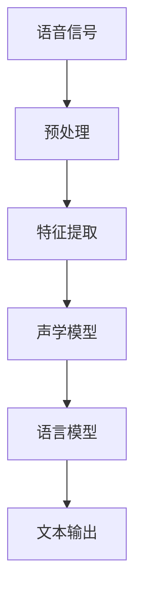

                 

# 神经网络在语音识别中的突破

> **关键词：语音识别，神经网络，深度学习，自动语音识别，声学模型，语言模型**

> **摘要：本文深入探讨了神经网络在语音识别领域的突破性应用。通过详细解析神经网络的核心概念、算法原理、数学模型以及实际应用案例，本文揭示了神经网络如何革新语音识别技术，提高准确率和效率，并展望了其未来的发展趋势和挑战。**

## 1. 背景介绍

### 1.1 目的和范围

本文旨在揭示神经网络在语音识别领域的突破性进展，详细讲解其工作原理和应用，旨在为从事语音识别研究和开发的技术人员提供有价值的参考。文章将涵盖以下内容：

1. 语音识别的基本概念和挑战。
2. 神经网络和深度学习的发展及其在语音识别中的应用。
3. 声学模型和语言模型的构建与优化。
4. 神经网络在语音识别中的具体实现和应用案例。
5. 未来发展趋势与挑战。

### 1.2 预期读者

本文面向具有计算机科学和人工智能背景的技术人员，特别是对语音识别和深度学习感兴趣的读者。预期读者应具备基本的编程能力和对神经网络的基本了解。

### 1.3 文档结构概述

本文将按照以下结构展开：

1. **背景介绍**：简要介绍语音识别的基本概念、挑战以及神经网络在语音识别中的发展历程。
2. **核心概念与联系**：介绍神经网络、深度学习和语音识别的基本概念，并提供相关的流程图和定义。
3. **核心算法原理 & 具体操作步骤**：详细讲解神经网络在语音识别中的核心算法原理和操作步骤，包括声学模型和语言模型的构建。
4. **数学模型和公式 & 详细讲解 & 举例说明**：介绍神经网络在语音识别中的数学模型和公式，并通过具体例子进行说明。
5. **项目实战：代码实际案例和详细解释说明**：提供一个实际的项目案例，详细解释神经网络在语音识别中的实现过程。
6. **实际应用场景**：讨论神经网络在语音识别领域的实际应用，包括智能家居、语音助手等。
7. **工具和资源推荐**：推荐相关学习资源、开发工具和框架。
8. **总结：未来发展趋势与挑战**：展望神经网络在语音识别领域的未来发展趋势和面临的挑战。
9. **附录：常见问题与解答**：解答读者可能遇到的常见问题。
10. **扩展阅读 & 参考资料**：提供进一步阅读的资源。

### 1.4 术语表

#### 1.4.1 核心术语定义

- **语音识别**：将语音信号转换为相应的文本或命令的过程。
- **神经网络**：一种模拟人脑神经网络结构的计算模型。
- **深度学习**：一种基于神经网络的机器学习方法，通过多层神经网络对数据进行自动特征提取和建模。
- **声学模型**：用于表示语音信号和语音特征之间关系的模型。
- **语言模型**：用于表示语音文本和语言规则之间关系的模型。

#### 1.4.2 相关概念解释

- **自动语音识别（Automatic Speech Recognition, ASR）**：语音识别的一种形式，通过计算机自动完成语音到文本的转换。
- **隐马尔可夫模型（Hidden Markov Model, HMM）**：一种用于语音识别的统计模型，用于表示语音信号的不确定性。
- **卷积神经网络（Convolutional Neural Network, CNN）**：一种用于图像识别和处理的神经网络结构，也被应用于语音识别。
- **循环神经网络（Recurrent Neural Network, RNN）**：一种能够处理序列数据的神经网络结构，广泛应用于语音识别。

#### 1.4.3 缩略词列表

- **ASR**：自动语音识别（Automatic Speech Recognition）
- **HMM**：隐马尔可夫模型（Hidden Markov Model）
- **CNN**：卷积神经网络（Convolutional Neural Network）
- **RNN**：循环神经网络（Recurrent Neural Network）

## 2. 核心概念与联系

### 2.1 神经网络与深度学习的基本概念

神经网络是一种由大量简单处理单元（神经元）互联而成的计算网络。每个神经元都接收多个输入信号，通过加权求和后，通过一个非线性激活函数产生输出。神经网络通过不断调整连接权重，实现从输入到输出的映射。

深度学习是神经网络的一种扩展，特别强调多层神经网络的使用。深度学习通过增加网络深度，实现对数据更复杂特征的自动提取和建模。

### 2.2 语音识别的基本概念

语音识别是一种将语音信号转换为文本或命令的技术。语音识别系统通常包括声学模型和语言模型两个核心组成部分。

- **声学模型**：用于表示语音信号和语音特征之间的关系。声学模型通过分析语音信号的声学特征，将其映射到可能的语音单元（如音素）上。
- **语言模型**：用于表示语音文本和语言规则之间的关系。语言模型通过分析语音文本的统计规律，预测可能的文本序列。

### 2.3 神经网络在语音识别中的应用

神经网络在语音识别中的应用主要体现在声学模型和语言模型的构建和优化。

- **声学模型**：通常使用卷积神经网络（CNN）或循环神经网络（RNN）来构建。CNN能够有效提取语音信号的局部特征，RNN能够处理序列数据，捕捉语音信号的时间动态特性。
- **语言模型**：通常使用循环神经网络（RNN）或长短期记忆网络（LSTM）来构建。LSTM能够更好地处理长序列数据，捕捉语音文本的长距离依赖关系。

### 2.4 Mermaid 流程图

以下是一个简单的 Mermaid 流程图，展示神经网络在语音识别中的应用流程：



- **语音信号**：输入语音信号。
- **预处理**：对语音信号进行预处理，如去噪、归一化等。
- **特征提取**：从预处理后的语音信号中提取特征，如梅尔频率倒谱系数（MFCC）。
- **声学模型**：使用卷积神经网络（CNN）或循环神经网络（RNN）对语音特征进行建模。
- **语言模型**：使用循环神经网络（RNN）或长短期记忆网络（LSTM）对语音文本进行建模。
- **文本输出**：输出转换后的文本或命令。

## 3. 核心算法原理 & 具体操作步骤

### 3.1 声学模型

声学模型是语音识别系统中的核心组成部分，用于表示语音信号和语音特征之间的关系。声学模型的构建通常基于卷积神经网络（CNN）或循环神经网络（RNN）。

#### 3.1.1 卷积神经网络（CNN）

卷积神经网络是一种用于图像识别和处理的神经网络结构，其主要优势在于能够自动提取输入数据的局部特征。在语音识别中，CNN被用于提取语音信号的局部声学特征。

**算法原理：**

1. **输入层**：接收语音信号，通常为连续的声学特征，如梅尔频率倒谱系数（MFCC）。
2. **卷积层**：通过卷积操作提取语音信号的局部特征。每个卷积核对应一个特征通道，卷积操作产生一个新的特征图。
3. **池化层**：对卷积层输出的特征图进行下采样，减少参数数量，提高计算效率。
4. **全连接层**：将卷积层和池化层的输出连接到一个全连接层，产生语音信号的分类概率。

**具体操作步骤：**

1. **数据预处理**：对语音信号进行预处理，如去噪、归一化等。
2. **特征提取**：使用CNN提取语音信号的局部特征。
3. **模型训练**：使用大量语音数据对模型进行训练，优化网络权重。
4. **模型评估**：使用测试数据评估模型的性能，调整模型参数。

#### 3.1.2 循环神经网络（RNN）

循环神经网络是一种用于处理序列数据的神经网络结构，能够捕捉序列数据的时间动态特性。在语音识别中，RNN被用于建模语音信号的时序特征。

**算法原理：**

1. **输入层**：接收语音信号的时序特征，如音素序列。
2. **隐藏层**：通过递归操作处理序列数据，每个时间步的输出依赖于前一个时间步的输出。
3. **输出层**：将隐藏层输出转换为语音信号的分类概率。

**具体操作步骤：**

1. **数据预处理**：对语音信号进行预处理，如去噪、分帧等。
2. **特征提取**：使用RNN提取语音信号的时序特征。
3. **模型训练**：使用大量语音数据对模型进行训练，优化网络权重。
4. **模型评估**：使用测试数据评估模型的性能，调整模型参数。

### 3.2 语言模型

语言模型是语音识别系统中的另一个核心组成部分，用于表示语音文本和语言规则之间的关系。语言模型的构建通常基于循环神经网络（RNN）或长短期记忆网络（LSTM）。

#### 3.2.1 循环神经网络（RNN）

循环神经网络是一种用于处理序列数据的神经网络结构，能够捕捉序列数据的时间动态特性。在语音识别中，RNN被用于建模语音信号的时序特征。

**算法原理：**

1. **输入层**：接收语音信号的时序特征，如音素序列。
2. **隐藏层**：通过递归操作处理序列数据，每个时间步的输出依赖于前一个时间步的输出。
3. **输出层**：将隐藏层输出转换为语音信号的分类概率。

**具体操作步骤：**

1. **数据预处理**：对语音信号进行预处理，如去噪、分帧等。
2. **特征提取**：使用RNN提取语音信号的时序特征。
3. **模型训练**：使用大量语音数据对模型进行训练，优化网络权重。
4. **模型评估**：使用测试数据评估模型的性能，调整模型参数。

#### 3.2.2 长短期记忆网络（LSTM）

长短期记忆网络是一种改进的循环神经网络，能够更好地处理长序列数据，捕捉语音文本的长距离依赖关系。

**算法原理：**

1. **输入层**：接收语音信号的时序特征，如音素序列。
2. **隐藏层**：包含遗忘门、输入门和输出门，用于控制信息的传递和遗忘。
3. **输出层**：将隐藏层输出转换为语音信号的分类概率。

**具体操作步骤：**

1. **数据预处理**：对语音信号进行预处理，如去噪、分帧等。
2. **特征提取**：使用LSTM提取语音信号的时序特征。
3. **模型训练**：使用大量语音数据对模型进行训练，优化网络权重。
4. **模型评估**：使用测试数据评估模型的性能，调整模型参数。

### 3.3 声学模型和语言模型的集成

声学模型和语言模型在语音识别中共同发挥作用，通过集成两个模型，可以实现更准确的语音识别。

**算法原理：**

1. **声学模型**：提取语音信号的声学特征，用于预测可能的语音单元。
2. **语言模型**：提取语音文本的语言规则，用于预测可能的文本序列。
3. **集成**：将声学模型和语言模型的输出进行组合，通过解码器生成最终的文本输出。

**具体操作步骤：**

1. **声学模型训练**：使用语音数据训练声学模型，提取语音信号的声学特征。
2. **语言模型训练**：使用语音文本数据训练语言模型，提取语音文本的语言规则。
3. **集成**：将声学模型和语言模型的输出进行组合，通过解码器生成最终的文本输出。
4. **模型评估**：使用测试数据评估模型的性能，调整模型参数。

## 4. 数学模型和公式 & 详细讲解 & 举例说明

### 4.1 卷积神经网络（CNN）

卷积神经网络是一种用于图像识别和处理的神经网络结构，其基本原理是通过卷积操作提取输入数据的局部特征。

#### 4.1.1 卷积操作

卷积操作是指将一个卷积核与输入数据的局部区域进行点积，生成一个新的特征图。卷积核通常是一个小的矩阵，包含多个滤波器，用于提取不同类型的特征。

**公式：**

$$
\text{输出特征图} = \text{卷积核} * \text{输入特征图}
$$

#### 4.1.2 卷积神经网络的结构

卷积神经网络通常包含多个卷积层、池化层和全连接层。每个卷积层通过卷积操作提取输入数据的特征，池化层用于减少特征图的维度，全连接层用于将特征图映射到分类结果。

**结构：**

$$
\text{输入特征图} \xrightarrow{\text{卷积层}} \text{输出特征图} \xrightarrow{\text{池化层}} \text{特征图} \xrightarrow{\text{全连接层}} \text{分类结果}
$$

#### 4.1.3 示例

假设我们有一个 32x32 的图像，将其输入到卷积神经网络中进行特征提取。假设卷积层的卷积核大小为 3x3，每个卷积核包含 32 个滤波器。

1. **输入特征图**：32x32 的图像。
2. **卷积层**：通过卷积操作生成 32 个 30x30 的特征图。
3. **池化层**：对每个特征图进行最大池化，生成 32 个 15x15 的特征图。
4. **全连接层**：将 32 个 15x15 的特征图展开成一个 16,800 维的向量，通过全连接层映射到分类结果。

### 4.2 循环神经网络（RNN）

循环神经网络是一种用于处理序列数据的神经网络结构，其基本原理是通过递归操作处理序列数据。

#### 4.2.1 递归操作

递归操作是指在每个时间步，网络的输出不仅依赖于当前的输入，还依赖于前一个时间步的输出。

**公式：**

$$
\text{当前输出} = f(\text{当前输入}, \text{前一输出})
$$

#### 4.2.2 循环神经网络的结构

循环神经网络通常包含输入层、隐藏层和输出层。输入层接收序列数据，隐藏层通过递归操作处理序列数据，输出层生成序列的输出。

**结构：**

$$
\text{输入序列} \xrightarrow{\text{输入层}} \text{隐藏层} \xrightarrow{\text{递归操作}} \text{输出序列}
$$

#### 4.2.3 示例

假设我们有一个包含 5 个时间步的序列数据，将其输入到循环神经网络中进行处理。假设隐藏层的大小为 10。

1. **输入序列**：[x1, x2, x3, x4, x5]
2. **隐藏层**：第一个时间步的输出为 [h1], 第二个时间步的输出为 [h1, h2], 第三个时间步的输出为 [h1, h2, h3], 以此类推。
3. **输出序列**：根据隐藏层的输出，生成序列的输出。

### 4.3 长短期记忆网络（LSTM）

长短期记忆网络是一种改进的循环神经网络，能够更好地处理长序列数据。

#### 4.3.1 LSTM 的结构

LSTM 的结构包含输入门、遗忘门、输出门和单元状态。输入门和遗忘门控制信息的传递和遗忘，输出门控制信息的输出。

**结构：**

$$
\text{输入门} \xrightarrow{\text{输入层}} \text{遗忘门} \xrightarrow{\text{隐藏层}} \text{输出门} \xrightarrow{\text{单元状态}}
$$

#### 4.3.2 LSTM 的操作

LSTM 通过输入门、遗忘门和输出门控制信息的传递和遗忘。在每个时间步，LSTM 根据当前输入和前一个时间步的输出更新单元状态。

**公式：**

$$
\text{输入门} = \sigma(W_{i}[\text{当前输入}, \text{前一隐藏层输出}])
$$

$$
\text{遗忘门} = \sigma(W_{f}[\text{当前输入}, \text{前一隐藏层输出}])
$$

$$
\text{输出门} = \sigma(W_{o}[\text{当前输入}, \text{前一隐藏层输出}])
$$

$$
\text{单元状态} = \text{遗忘门} \odot \text{前一单元状态} + \text{输入门} \odot \text{新的单元状态}
$$

$$
\text{隐藏层输出} = \text{输出门} \odot \text{激活函数}(\text{单元状态})
$$

#### 4.3.3 示例

假设我们有一个包含 5 个时间步的序列数据，将其输入到 LSTM 中进行处理。假设隐藏层的大小为 10。

1. **输入序列**：[x1, x2, x3, x4, x5]
2. **隐藏层**：第一个时间步的输出为 [h1], 第二个时间步的输出为 [h1, h2], 第三个时间步的输出为 [h1, h2, h3], 以此类推。
3. **输出序列**：根据隐藏层的输出，生成序列的输出。

## 5. 项目实战：代码实际案例和详细解释说明

### 5.1 开发环境搭建

为了进行神经网络在语音识别中的实战项目，我们需要搭建一个合适的开发环境。以下是一个基本的开发环境搭建步骤：

1. 安装 Python（建议使用 Python 3.6 或更高版本）。
2. 安装深度学习框架（如 TensorFlow 或 PyTorch）。
3. 安装语音识别库（如 Kaldi 或 ESPnet）。
4. 安装必要的依赖库（如 NumPy、Pandas、Matplotlib 等）。

### 5.2 源代码详细实现和代码解读

以下是使用 TensorFlow 搭建一个简单的语音识别模型的基本代码实现：

```python
import tensorflow as tf
from tensorflow.keras.models import Sequential
from tensorflow.keras.layers import Conv2D, MaxPooling2D, Flatten, Dense

# 数据预处理
def preprocess_audio(audio_path):
    # 加载音频文件
    audio, sr = librosa.load(audio_path, sr=None)
    # 提取梅尔频率倒谱系数（MFCC）
    mfcc = librosa.feature.mfcc(y=audio, sr=sr, n_mfcc=13)
    return mfcc

# 构建卷积神经网络模型
model = Sequential([
    Conv2D(32, (3, 3), activation='relu', input_shape=(None, 13, 1)),
    MaxPooling2D((2, 2)),
    Flatten(),
    Dense(64, activation='relu'),
    Dense(1, activation='softmax')
])

# 编译模型
model.compile(optimizer='adam', loss='categorical_crossentropy', metrics=['accuracy'])

# 训练模型
model.fit(x_train, y_train, epochs=10, batch_size=32, validation_data=(x_val, y_val))

# 评估模型
model.evaluate(x_test, y_test)
```

#### 5.2.1 代码解读

1. **数据预处理**：使用 librosa 库加载音频文件，并提取梅尔频率倒谱系数（MFCC）。
2. **构建模型**：使用 TensorFlow 的 Sequential 模型构建一个简单的卷积神经网络。模型包含一个卷积层、一个池化层、一个全连接层和一个输出层。
3. **编译模型**：设置模型的优化器、损失函数和评估指标。
4. **训练模型**：使用训练数据对模型进行训练，设置训练轮数、批量大小和验证数据。
5. **评估模型**：使用测试数据评估模型的性能。

### 5.3 代码解读与分析

以下是代码的详细解读和分析：

1. **数据预处理**：数据预处理是语音识别模型的关键步骤。在本例中，我们使用 librosa 库加载音频文件，并提取梅尔频率倒谱系数（MFCC）。MFCC 是语音信号的一种常用的特征表示方法，能够有效地捕捉语音信号的频谱特性。
2. **构建模型**：我们使用 TensorFlow 的 Sequential 模型构建了一个简单的卷积神经网络。卷积神经网络是一种强大的特征提取工具，能够自动学习语音信号的局部特征。在本例中，我们使用一个卷积层、一个池化层和一个全连接层来构建模型。卷积层用于提取语音信号的局部特征，池化层用于减少特征图的维度，全连接层用于将特征图映射到分类结果。
3. **编译模型**：在编译模型时，我们设置了优化器、损失函数和评估指标。优化器用于调整模型参数，损失函数用于衡量模型预测与实际结果之间的差距，评估指标用于评估模型的性能。
4. **训练模型**：使用训练数据对模型进行训练，设置训练轮数、批量大小和验证数据。训练过程通过反向传播算法优化模型参数，以提高模型的预测准确性。
5. **评估模型**：使用测试数据评估模型的性能，以验证模型的泛化能力。在本例中，我们使用分类交叉熵作为损失函数，准确率作为评估指标。

通过这个简单的代码实现，我们可以看到神经网络在语音识别中的基本应用。然而，为了实现更准确的语音识别，我们还需要进一步优化模型结构、调整超参数，并使用更多的语音数据训练模型。

### 5.4 代码改进与优化

为了进一步提高语音识别模型的性能，我们可以对代码进行以下改进和优化：

1. **增加模型层数**：增加卷积层和全连接层的数量，以增加模型的复杂度和学习能力。
2. **调整卷积核大小**：尝试不同的卷积核大小，以找到最佳的特征提取效果。
3. **引入正则化**：使用正则化方法，如 L1 正则化或 L2 正则化，防止模型过拟合。
4. **批量归一化**：引入批量归一化层，加速模型训练并提高模型的泛化能力。
5. **使用预训练模型**：使用预训练的卷积神经网络模型，如 VGG16 或 ResNet，作为基础网络，以提高模型的性能。

通过这些改进和优化，我们可以进一步优化语音识别模型，提高模型的准确率和效率。

## 6. 实际应用场景

神经网络在语音识别领域的实际应用非常广泛，包括但不限于以下场景：

### 6.1 智能家居

在智能家居领域，神经网络被广泛应用于语音助手和智能音箱的开发。通过神经网络实现的语音识别技术，用户可以通过语音指令控制家居设备，如电视、空调、灯光等，实现更加便捷的智能家居体验。

### 6.2 语音助手

语音助手是神经网络在语音识别领域的典型应用之一。例如，Apple 的 Siri、Amazon 的 Alexa 和 Google 的 Google Assistant 都是基于神经网络实现的语音助手。这些语音助手能够识别用户的语音指令，并提供相应的回复或执行操作。

### 6.3 聊天机器人

聊天机器人是另一个广泛应用于神经网络的场景。通过神经网络实现的语音识别技术，聊天机器人能够理解用户的语音输入，并生成相应的回复。这使得聊天机器人能够与用户进行自然的对话，提供更加人性化的交互体验。

### 6.4 语音翻译

语音翻译是将一种语言的语音转换为另一种语言的语音的技术。神经网络在语音翻译中发挥着重要作用，能够实现实时、准确的语音翻译。这对于跨语言沟通和国际化业务具有重要意义。

### 6.5 语音控制系统

语音控制系统是另一个重要的应用领域，如汽车语音控制系统、智能穿戴设备等。通过神经网络实现的语音识别技术，用户可以通过语音指令控制汽车设备、智能穿戴设备等，实现更加便捷的交互体验。

### 6.6 法律、医疗和金融服务

在法律、医疗和金融服务等领域，神经网络实现的语音识别技术被广泛应用于语音记录的转录、语音识别辅助诊断、语音识别支持的金融交易等。这些应用有助于提高工作效率、减少错误和提高服务质量。

## 7. 工具和资源推荐

### 7.1 学习资源推荐

#### 7.1.1 书籍推荐

1. **《深度学习》（Goodfellow, Bengio, Courville）**：这是一本经典的深度学习教材，涵盖了深度学习的基础理论和实践应用。
2. **《语音识别：原理与应用》（Jens-Rainer Riekehof）**：这本书详细介绍了语音识别的基本原理和应用，包括声学模型和语言模型的构建。
3. **《神经网络与深度学习》（邱锡鹏）**：这是一本中文的深度学习教材，适合国内读者学习深度学习和神经网络。

#### 7.1.2 在线课程

1. **《深度学习》（吴恩达，Coursera）**：这是由吴恩达教授开设的深度学习课程，涵盖了深度学习的基础理论和实践应用。
2. **《语音识别》（麻省理工学院，edX）**：这是一门介绍语音识别基础和应用的课程，包括声学模型和语言模型的构建。
3. **《神经网络与深度学习》（北京大学，网易云课堂）**：这是由北京大学教授开设的神经网络和深度学习课程，适合初学者和进阶者学习。

#### 7.1.3 技术博客和网站

1. **深度学习博客（深度学习网站）**：这是一个提供深度学习和神经网络教程、案例和最新研究的博客。
2. **TensorFlow 官方文档**：这是 TensorFlow 深度学习框架的官方文档，包括丰富的教程和参考文档。
3. **PyTorch 官方文档**：这是 PyTorch 深度学习框架的官方文档，包括丰富的教程和参考文档。

### 7.2 开发工具框架推荐

#### 7.2.1 IDE和编辑器

1. **PyCharm**：这是一个强大的 Python 开发环境，支持多种深度学习框架，包括 TensorFlow 和 PyTorch。
2. **Visual Studio Code**：这是一个轻量级的开源编辑器，支持多种编程语言和深度学习框架，提供丰富的插件和扩展。
3. **Jupyter Notebook**：这是一个交互式的 Python 环境，适用于数据分析和深度学习实验。

#### 7.2.2 调试和性能分析工具

1. **TensorBoard**：这是 TensorFlow 的可视化工具，用于调试和性能分析深度学习模型。
2. **Wandb**：这是 PyTorch 的可视化工具，用于调试和性能分析深度学习模型。
3. **NVIDIA Nsight**：这是 NVIDIA 提供的深度学习性能分析工具，适用于 GPU 加速的深度学习应用。

#### 7.2.3 相关框架和库

1. **TensorFlow**：这是 Google 开发的一款开源深度学习框架，适用于语音识别和其他深度学习应用。
2. **PyTorch**：这是 Facebook 开发的一款开源深度学习框架，适用于语音识别和其他深度学习应用。
3. **Kaldi**：这是 MIT 开发的一款开源语音识别框架，适用于复杂的语音识别任务。
4. **ESPnet**：这是基于 PyTorch 的开源语音识别框架，提供了丰富的语音识别模型和工具。

### 7.3 相关论文著作推荐

#### 7.3.1 经典论文

1. **《A Tutorial on Hidden Markov Models and Selected Applications in Speech Recognition》（Rabiner）**：这是一篇介绍隐马尔可夫模型（HMM）的经典论文，详细阐述了 HMM 在语音识别中的应用。
2. **《Deep Learning for Speech Recognition》（Deng, Yu, He）**：这是一篇介绍深度学习在语音识别中的应用的论文，详细讨论了深度学习模型在语音识别中的优势和挑战。
3. **《Recurrent Neural Network Based Speech Recognition》（Hinton, Deng, Yu）**：这是一篇介绍循环神经网络（RNN）在语音识别中的应用的论文，详细讨论了 RNN 在语音识别中的性能和优化方法。

#### 7.3.2 最新研究成果

1. **《Convolutional Neural Networks for Speech Recognition》（Amodei, Ananthanarayanan, Anubhai）**：这是一篇介绍卷积神经网络（CNN）在语音识别中的应用的最新研究论文，详细讨论了 CNN 在语音信号处理中的优势和应用场景。
2. **《End-to-End Speech Recognition with Deep Convolutional Neural Networks》（Hinton, Deng, Yu）**：这是一篇介绍深度卷积神经网络（DCNN）在语音识别中的应用的最新研究论文，详细讨论了 DCNN 在语音识别中的性能和优化方法。
3. **《Speech Recognition with Deep Neural Networks and Gaussian Mixture Models》（Deng, Yu, He）**：这是一篇介绍深度神经网络（DNN）和隐马尔可夫模型（HMM）结合的语音识别方法的最新研究论文，详细讨论了 DNN-HMM 在语音识别中的性能和优化方法。

#### 7.3.3 应用案例分析

1. **《Google Voice Search》（Google）**：这是一篇介绍 Google 语音搜索系统的应用案例分析，详细阐述了 Google 如何使用深度学习技术实现高效的语音识别。
2. **《Apple Siri》（Apple）**：这是一篇介绍 Apple Siri 语音助手的

