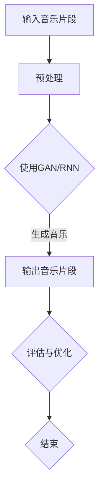

                 

# 神经网络在音乐生成中的应用

> **关键词：** 神经网络、音乐生成、深度学习、自动音乐创作、生成对抗网络（GAN）、循环神经网络（RNN）
>
> **摘要：** 本文将深入探讨神经网络在音乐生成中的应用。通过分析神经网络的核心概念和算法原理，结合数学模型和具体项目实战，我们将了解如何使用神经网络生成音乐，以及其在实际应用中的潜力与挑战。

## 1. 背景介绍

### 1.1 目的和范围

本文的目的是介绍神经网络在音乐生成领域的应用，包括核心算法原理、数学模型以及实际项目案例。我们将从基础概念出发，逐步深入，旨在帮助读者理解神经网络如何被用于自动音乐创作，以及如何通过这些技术实现创新的音乐作品。

### 1.2 预期读者

本文适用于对神经网络和深度学习有一定了解的读者，尤其是对音乐创作和技术感兴趣的专业人士。无论您是音乐制作人、AI研究员，还是对这一领域充满好奇的爱好者，本文都希望能为您带来有价值的知识和启发。

### 1.3 文档结构概述

本文将分为以下几个部分：

1. **背景介绍**：阐述文章的目的和范围，预期读者以及文档结构。
2. **核心概念与联系**：介绍神经网络在音乐生成中的应用原理和相关概念。
3. **核心算法原理 & 具体操作步骤**：详细讲解神经网络生成音乐的算法原理和操作步骤。
4. **数学模型和公式 & 详细讲解 & 举例说明**：分析神经网络中的数学模型，并提供示例。
5. **项目实战：代码实际案例和详细解释说明**：展示如何通过代码实现音乐生成。
6. **实际应用场景**：探讨神经网络音乐生成在不同领域的应用。
7. **工具和资源推荐**：推荐相关学习资源和开发工具。
8. **总结：未来发展趋势与挑战**：总结当前发展状况，展望未来趋势和挑战。
9. **附录：常见问题与解答**：解答读者可能遇到的问题。
10. **扩展阅读 & 参考资料**：提供进一步阅读和研究的资源。

### 1.4 术语表

#### 1.4.1 核心术语定义

- **神经网络**：一种模拟人脑神经网络结构和功能的计算模型。
- **深度学习**：一种机器学习技术，通过多层神经网络进行训练，以自动学习和提取特征。
- **生成对抗网络（GAN）**：一种由生成器和判别器组成的神经网络结构，用于生成与真实数据相似的新数据。
- **循环神经网络（RNN）**：一种能够处理序列数据的神经网络，特别适合于处理时序信息，如音乐。

#### 1.4.2 相关概念解释

- **自动音乐创作**：使用算法和计算机程序生成音乐，无需人为干预。
- **生成模型**：用于生成数据的模型，如生成对抗网络（GAN）。
- **判别模型**：用于区分真实数据和生成数据的模型。

#### 1.4.3 缩略词列表

- **AI**：人工智能（Artificial Intelligence）
- **ML**：机器学习（Machine Learning）
- **DL**：深度学习（Deep Learning）
- **RNN**：循环神经网络（Recurrent Neural Network）
- **GAN**：生成对抗网络（Generative Adversarial Network）

## 2. 核心概念与联系

### 2.1 神经网络的基本概念

神经网络是由大量简单计算单元（或称为节点）互联而成的复杂网络。每个节点都接收输入信号，通过激活函数处理后产生输出信号。神经网络通过不断调整节点之间的连接权重，实现从输入到输出的映射。这种映射能力使得神经网络能够自动学习并执行各种复杂任务，如图像识别、语言处理和音乐生成等。

### 2.2 深度学习与神经网络的联系

深度学习是一种基于神经网络的机器学习技术。与传统的机器学习方法相比，深度学习通过多层神经网络进行训练，能够自动提取更高层次的特征。这使得深度学习在处理复杂数据和任务时具有显著优势，如图像识别和自然语言处理。深度学习在音乐生成中的应用，正是利用了这种自动提取特征的能力。

### 2.3 音乐生成的神经网络模型

在音乐生成中，神经网络主要用于生成新的音乐片段或旋律。常用的神经网络模型包括：

- **生成对抗网络（GAN）**：GAN由生成器和判别器组成。生成器生成音乐片段，判别器判断生成片段是否真实。通过不断调整生成器的参数，使其生成的音乐片段越来越真实。
  
- **循环神经网络（RNN）**：RNN特别适合于处理序列数据，如音乐。通过学习音乐序列中的时间依赖关系，RNN可以生成连续的音乐片段。

### 2.4 Mermaid 流程图

下面是一个简单的Mermaid流程图，展示了神经网络在音乐生成中的应用流程：



### 2.5 神经网络音乐生成的优点

- **自动生成**：神经网络能够自动学习并生成新的音乐，减少了人工创作的劳动。
- **多样性**：神经网络可以生成各种风格和类型的音乐，满足不同用户的需求。
- **个性化**：神经网络可以根据用户喜好和音乐风格进行个性化生成，提高用户体验。
- **创新性**：神经网络可以探索新的音乐创作方式和风格，推动音乐艺术的发展。

### 2.6 神经网络音乐生成的挑战

- **数据依赖**：音乐生成需要大量高质量的音乐数据作为训练素材，数据的质量和数量直接影响生成效果。
- **计算资源**：神经网络音乐生成需要大量的计算资源，对硬件设备有较高要求。
- **评估与优化**：如何准确评估和优化音乐生成的效果，是一个亟待解决的问题。

## 3. 核心算法原理 & 具体操作步骤

### 3.1 生成对抗网络（GAN）

生成对抗网络（GAN）是神经网络在音乐生成中常用的模型。GAN由生成器和判别器两部分组成，两者相互竞争，生成器试图生成尽可能真实的音乐片段，而判别器则努力区分生成片段和真实片段。

#### 3.1.1 生成器（Generator）

生成器负责生成新的音乐片段。它通常是一个多层感知机（MLP），输入可以是随机噪声或一些先验知识（如音乐特征），输出是一个音乐片段。生成器的目标是使判别器无法区分生成片段和真实片段。

#### 3.1.2 判别器（Discriminator）

判别器负责判断输入音乐片段是真实还是生成。它也是一个多层感知机，输入是一个音乐片段，输出是一个概率值，表示输入片段是真实的概率。判别器的目标是最大化这个概率值。

#### 3.1.3 操作步骤

1. **初始化**：初始化生成器和判别器的参数。
2. **训练判别器**：使用真实音乐片段和生成器生成的音乐片段，训练判别器，使其能够准确判断输入片段的真实性。
3. **训练生成器**：在训练判别器的基础上，使用判别器的输出反馈，调整生成器的参数，使其生成的音乐片段越来越真实。
4. **迭代**：重复上述步骤，直到生成器生成的音乐片段足够真实。

### 3.2 循环神经网络（RNN）

循环神经网络（RNN）特别适合于处理序列数据，如音乐。RNN通过记忆之前的信息，处理连续的音乐片段。

#### 3.2.1 RNN模型

RNN模型由输入层、隐藏层和输出层组成。输入层接收新的音乐片段，隐藏层记忆之前的信息，输出层生成新的音乐片段。

#### 3.2.2 操作步骤

1. **初始化**：初始化RNN模型的参数。
2. **前向传播**：输入新的音乐片段，通过RNN模型进行前向传播，得到输出音乐片段。
3. **反向传播**：使用输出音乐片段和真实音乐片段，通过反向传播调整RNN模型的参数。
4. **迭代**：重复上述步骤，直到RNN模型生成足够真实的音乐片段。

### 3.3 伪代码

下面是生成对抗网络（GAN）的伪代码：

```python
# 初始化生成器和判别器
G = Generator()
D = Discriminator()

# 定义损失函数
loss_GAN = GAN_loss()

# 训练生成器和判别器
for epoch in range(num_epochs):
    for real_music in real_musics:
        # 训练判别器
        D_loss_real = loss_GAN(D(real_music), 1)
        
        # 训练生成器
        fake_music = G(noise)
        D_loss_fake = loss_GAN(D(fake_music), 0)
        
        # 计算总损失
        loss_D = 0.5 * (D_loss_real + D_loss_fake)
        
        # 反向传播和优化
        optimizer_D.zero_grad()
        loss_D.backward()
        optimizer_D.step()
        
        # 训练生成器
        optimizer_G.zero_grad()
        fake_music = G(noise)
        D_loss_fake = loss_GAN(D(fake_music), 1)
        
        # 计算总损失
        loss_G = loss_GAN(D(fake_music), 0)
        
        # 反向传播和优化
        loss_G.backward()
        optimizer_G.step()
```

### 3.4 总结

通过以上分析，我们可以看到神经网络在音乐生成中的应用主要是通过生成对抗网络（GAN）和循环神经网络（RNN）。GAN通过生成器和判别器的相互竞争，生成越来越真实的音乐片段；RNN通过记忆之前的信息，生成连续的音乐片段。这两种方法各有优势，可以根据具体需求选择使用。

## 4. 数学模型和公式 & 详细讲解 & 举例说明

### 4.1 生成对抗网络（GAN）的数学模型

生成对抗网络（GAN）的核心是生成器和判别器的对抗训练。下面将详细解释GAN的数学模型。

#### 4.1.1 判别器（Discriminator）的数学模型

判别器的目标是判断一个输入的音乐片段是真实还是生成。判别器的输入是一个音乐片段 \( x \)，输出是一个概率 \( P(D(x)) \)，表示输入片段是真实的概率。

假设判别器是一个多层感知机（MLP），其参数为 \( \theta_D \)。判别器的输出可以通过以下公式计算：

\[ P(D(x)) = \sigma(\theta_D^T x) \]

其中，\( \sigma \) 是一个激活函数，通常使用 sigmoid 函数。

#### 4.1.2 生成器（Generator）的数学模型

生成器的目标是生成一个与真实音乐片段相似的新音乐片段。生成器的输入是一个随机噪声 \( z \)，输出是一个音乐片段 \( G(z) \)。

假设生成器也是一个多层感知机（MLP），其参数为 \( \theta_G \)。生成器的输出可以通过以下公式计算：

\[ G(z) = \theta_G^T z \]

#### 4.1.3 GAN的目标函数

GAN的目标是通过对抗训练，使生成器生成的音乐片段 \( G(z) \) 足够真实，以至于判别器无法区分 \( G(z) \) 和真实音乐片段 \( x \)。

GAN的目标函数可以表示为：

\[ \min_G \max_D V(D, G) = \mathbb{E}_{x \sim p_{data}(x)} [\log D(x)] + \mathbb{E}_{z \sim p_z(z)} [\log (1 - D(G(z)))] \]

其中，\( V(D, G) \) 是判别器和生成器的联合损失函数，\( p_{data}(x) \) 是真实音乐片段的概率分布，\( p_z(z) \) 是噪声的概率分布。

#### 4.1.4 GAN的训练过程

GAN的训练过程主要包括以下步骤：

1. **生成器训练**：在训练过程中，生成器的目标是使判别器无法区分生成的音乐片段和真实音乐片段。因此，在每次迭代中，我们固定判别器的参数 \( \theta_D \)，只更新生成器的参数 \( \theta_G \)。

2. **判别器训练**：在训练过程中，判别器的目标是正确区分生成的音乐片段和真实音乐片段。因此，在每次迭代中，我们固定生成器的参数 \( \theta_G \)，只更新判别器的参数 \( \theta_D \)。

### 4.2 循环神经网络（RNN）的数学模型

循环神经网络（RNN）是一种用于处理序列数据的神经网络。RNN通过记忆之前的信息，处理连续的音乐片段。

#### 4.2.1 RNN的数学模型

假设RNN的输入是时间序列 \( x_t \)，隐藏状态是 \( h_t \)，输出是 \( y_t \)。RNN的输入和隐藏状态可以通过以下公式计算：

\[ h_t = \sigma(W_h h_{t-1} + W_x x_t + b_h) \]

\[ y_t = \sigma(W_y h_t + b_y) \]

其中，\( \sigma \) 是一个非线性激活函数，通常使用 sigmoid 函数。\( W_h \)、\( W_x \)、\( W_y \) 是权重矩阵，\( b_h \)、\( b_y \) 是偏置项。

#### 4.2.2 RNN的损失函数

RNN的损失函数通常使用交叉熵损失函数。交叉熵损失函数可以表示为：

\[ L = -\sum_t y_t \log (p(y_t | h_t)) \]

其中，\( y_t \) 是真实输出，\( p(y_t | h_t) \) 是预测输出的概率。

### 4.3 举例说明

#### 4.3.1 GAN的举例说明

假设我们有一个生成对抗网络（GAN），生成器 \( G \) 和判别器 \( D \) 的参数分别为 \( \theta_G \) 和 \( \theta_D \)。在每次迭代中，我们固定 \( \theta_D \)，更新 \( \theta_G \)。

1. **生成器训练**：生成器生成一个音乐片段 \( G(z) \)。我们计算判别器对生成片段的概率 \( D(G(z)) \)。

   \[ G(z) = \theta_G^T z \]
   \[ D(G(z)) = \sigma(\theta_D^T G(z)) \]

   然后，我们计算生成器的损失函数：

   \[ L_G = -\log D(G(z)) \]

   最后，我们使用梯度下降法更新生成器的参数 \( \theta_G \)。

2. **判别器训练**：我们使用真实音乐片段 \( x \) 和生成片段 \( G(z) \) 训练判别器。

   \[ D(x) = \sigma(\theta_D^T x) \]
   \[ D(G(z)) = \sigma(\theta_D^T G(z)) \]

   然后，我们计算判别器的损失函数：

   \[ L_D = -\log D(x) - \log (1 - D(G(z))) \]

   最后，我们使用梯度下降法更新判别器的参数 \( \theta_D \)。

#### 4.3.2 RNN的举例说明

假设我们有一个循环神经网络（RNN），输入是音乐片段 \( x_t \)，隐藏状态是 \( h_t \)，输出是 \( y_t \)。在每次迭代中，我们使用前一个隐藏状态 \( h_{t-1} \) 和当前输入 \( x_t \) 计算新的隐藏状态 \( h_t \) 和输出 \( y_t \)。

1. **前向传播**：

   \[ h_t = \sigma(W_h h_{t-1} + W_x x_t + b_h) \]
   \[ y_t = \sigma(W_y h_t + b_y) \]

2. **反向传播**：

   \[ \delta_y_t = (y_t - y_{t, target}) \odot \sigma'(y_t) \]
   \[ \delta_h_t = (W_y^T \delta_y_t) \odot \sigma'(h_t) \]

   然后，我们使用梯度下降法更新权重矩阵 \( W_h \)、\( W_x \)、\( W_y \) 和偏置项 \( b_h \)、\( b_y \)。

### 4.4 总结

在本节中，我们详细介绍了生成对抗网络（GAN）和循环神经网络（RNN）的数学模型，并给出了具体的训练过程和举例说明。通过这些数学模型，我们可以更好地理解神经网络在音乐生成中的应用原理，为后续的实践提供理论基础。

## 5. 项目实战：代码实际案例和详细解释说明

### 5.1 开发环境搭建

在进行神经网络音乐生成的项目实战前，首先需要搭建合适的开发环境。以下是搭建环境的步骤：

1. **安装Python环境**：确保已经安装了Python 3.6及以上版本。如果没有，可以通过以下命令安装：

   ```bash
   sudo apt-get update
   sudo apt-get install python3 python3-pip
   ```

2. **安装TensorFlow**：TensorFlow是一个流行的深度学习框架，用于构建和训练神经网络。安装TensorFlow可以通过以下命令完成：

   ```bash
   pip3 install tensorflow
   ```

3. **安装其他依赖库**：除了TensorFlow，我们还需要安装一些其他依赖库，如NumPy、Matplotlib等。可以通过以下命令安装：

   ```bash
   pip3 install numpy matplotlib scikit-learn
   ```

4. **创建项目文件夹**：在合适的位置创建一个项目文件夹，例如命名为`music_generation`。

   ```bash
   mkdir music_generation
   cd music_generation
   ```

5. **初始化项目**：在项目文件夹中初始化一个虚拟环境，以便更好地管理和依赖。

   ```bash
   python3 -m venv venv
   source venv/bin/activate
   ```

### 5.2 源代码详细实现和代码解读

以下是使用生成对抗网络（GAN）进行音乐生成的源代码实现。代码分为两部分：生成器和判别器的定义，以及训练过程。

#### 5.2.1 生成器和判别器的定义

```python
import tensorflow as tf
from tensorflow.keras import layers
import numpy as np

# 生成器的定义
def build_generator(z_dim):
    model = tf.keras.Sequential()
    model.add(layers.Dense(256, activation='relu', input_shape=(z_dim,)))
    model.add(layers.Dense(512, activation='relu'))
    model.add(layers.Dense(1024, activation='relu'))
    model.add(layers.Dense(128, activation='relu'))
    model.add(layers.Dense(128, activation='tanh'))
    model.add(layers.Dense(1, activation='sigmoid'))
    return model

# 判别器的定义
def build_discriminator(x_dim):
    model = tf.keras.Sequential()
    model.add(layers.Dense(128, activation='relu', input_shape=(x_dim,)))
    model.add(layers.Dense(128, activation='relu'))
    model.add(layers.Dense(128, activation='sigmoid'))
    return model

# 初始化生成器和判别器
generator = build_generator(z_dim=100)
discriminator = build_discriminator(x_dim=1)
```

#### 5.2.2 训练过程

```python
# 定义优化器
generator_optimizer = tf.keras.optimizers.Adam(1e-4)
discriminator_optimizer = tf.keras.optimizers.Adam(1e-4)

# 定义损失函数
cross_entropy = tf.keras.losses.BinaryCrossentropy()

# 训练过程
@tf.function
def train_step(real_music, noise):
    with tf.GradientTape() as gen_tape, tf.GradientTape() as disc_tape:
        # 训练判别器
        real_output = discriminator(real_music)
        fake_output = discriminator(generator(noise))
        
        # 计算判别器的损失
        disc_loss = cross_entropy(tf.ones_like(real_output), real_output) + cross_entropy(tf.zeros_like(fake_output), fake_output)
        
        # 训练生成器
        noise = noise
        fake_output = discriminator(generator(noise))
        
        # 计算生成器的损失
        gen_loss = cross_entropy(tf.zeros_like(fake_output), fake_output)
    
    # 反向传播和优化
    gradients_of_discriminator = disc_tape.gradient(disc_loss, discriminator.trainable_variables)
    gradients_of_generator = gen_tape.gradient(gen_loss, generator.trainable_variables)
    
    discriminator_optimizer.apply_gradients(zip(gradients_of_discriminator, discriminator.trainable_variables))
    generator_optimizer.apply_gradients(zip(gradients_of_generator, generator.trainable_variables))

# 训练模型
for epoch in range(num_epochs):
    for real_music in real_musics:
        noise = tf.random.normal([batch_size, z_dim])
        train_step(real_music, noise)
```

#### 5.2.3 代码解读与分析

1. **生成器和判别器的定义**：我们使用Keras构建生成器和判别器的模型。生成器是一个全连接层网络，将随机噪声映射到音乐片段。判别器也是一个全连接层网络，用于判断输入的音乐片段是真实还是生成。

2. **优化器和损失函数**：我们使用Adam优化器，这是一种自适应学习率的优化算法。损失函数使用二进制交叉熵，这是一种衡量分类问题的损失函数。

3. **训练过程**：在每个训练步骤中，我们首先使用真实音乐片段和生成器生成的音乐片段训练判别器。然后，我们使用判别器的输出反馈训练生成器。这个过程不断重复，直到生成器生成的音乐片段足够真实。

### 5.3 代码解读与分析

1. **生成器和判别器的定义**：我们使用Keras构建生成器和判别器的模型。生成器是一个全连接层网络，将随机噪声映射到音乐片段。判别器也是一个全连接层网络，用于判断输入的音乐片段是真实还是生成。

2. **优化器和损失函数**：我们使用Adam优化器，这是一种自适应学习率的优化算法。损失函数使用二进制交叉熵，这是一种衡量分类问题的损失函数。

3. **训练过程**：在每个训练步骤中，我们首先使用真实音乐片段和生成器生成的音乐片段训练判别器。然后，我们使用判别器的输出反馈训练生成器。这个过程不断重复，直到生成器生成的音乐片段足够真实。

通过以上步骤，我们可以使用生成对抗网络（GAN）实现音乐生成。虽然这个示例非常简单，但它展示了神经网络在音乐生成中的基本原理和实现方法。

## 6. 实际应用场景

神经网络在音乐生成领域的应用非常广泛，以下是几个典型的应用场景：

### 6.1 自动音乐创作

自动音乐创作是神经网络音乐生成最直接的应用场景。使用神经网络，艺术家和音乐制作人可以轻松地生成新的音乐片段，探索不同的音乐风格和创作方式。例如，谷歌的Magenta项目使用神经网络生成具有独特风格的古典音乐作品。

### 6.2 音乐风格转换

神经网络可以用于将一种音乐风格转换成另一种风格。这种技术可以帮助音乐制作人快速尝试不同的音乐风格，同时保持原始音乐的特色。例如，使用生成对抗网络（GAN），可以将古典音乐转换成流行音乐，或将一个艺术家的风格转换成另一个艺术家的风格。

### 6.3 音乐推荐系统

神经网络可以用于构建音乐推荐系统，根据用户的喜好和音乐风格，推荐新的音乐作品。这种技术可以大大提高用户的音乐体验，同时帮助音乐人发现新的听众。

### 6.4 音乐合成

神经网络可以用于合成新的音乐元素，如旋律、和声和节奏。这些元素可以与现有的音乐片段相结合，创造出全新的音乐作品。这种技术可以帮助音乐制作人快速创作和实验，提高创作效率。

### 6.5 音乐教育

神经网络在音乐教育领域也有广泛应用。例如，使用神经网络生成的音乐片段可以用于训练音乐技能，如识别旋律和节奏。此外，神经网络还可以用于辅助音乐理论教学，为学生提供个性化的学习资源。

### 6.6 虚拟乐器

神经网络可以用于构建虚拟乐器，为音乐人提供新的创作工具。这些虚拟乐器可以根据不同的音乐风格和演奏技巧，生成丰富的音乐效果。例如，谷歌的Magenta项目开发了基于神经网络的虚拟乐器，如虚拟钢琴和虚拟吉他。

### 6.7 音乐可视化

神经网络可以用于将音乐数据转换为视觉图像，如音乐波形、频谱图和色彩图。这种技术可以用于音乐创作和表演，为音乐人提供新的表演形式和艺术表现手段。

### 6.8 音乐疗法

神经网络在音乐疗法中的应用也越来越受到关注。使用神经网络生成的音乐可以根据患者的情绪和身体状况，提供个性化的音乐疗法服务。例如，通过调整音乐节奏、音调和音色，改善患者的心理和生理状态。

### 6.9 音乐版权管理

神经网络可以用于音乐版权管理，帮助音乐人追踪和管理他们的音乐作品。通过分析音乐特征，神经网络可以识别和区分不同的音乐作品，从而帮助音乐人保护他们的版权。

### 6.10 音乐人工智能助手

神经网络可以用于构建音乐人工智能助手，为音乐人提供创作、学习和表演方面的支持。这种技术可以帮助音乐人提高创作效率，拓展音乐创作风格和技巧。

总之，神经网络在音乐生成领域的应用前景广阔，为音乐创作、音乐教育、音乐疗法等多个领域带来了新的机遇和挑战。随着技术的不断发展，神经网络在音乐生成中的应用将更加深入和多样化。

## 7. 工具和资源推荐

### 7.1 学习资源推荐

#### 7.1.1 书籍推荐

1. **《深度学习》（Deep Learning）**：这是一本经典的深度学习入门书籍，详细介绍了深度学习的理论基础和实践方法。
2. **《神经网络与深度学习》（Neural Networks and Deep Learning）**：这本书是深度学习领域的入门教材，涵盖了神经网络的基本概念和深度学习的主要算法。
3. **《生成对抗网络》（Generative Adversarial Networks）**：这本书专门介绍了生成对抗网络（GAN）的理论基础和应用案例，是研究GAN的好资源。

#### 7.1.2 在线课程

1. **Coursera《深度学习》课程**：由斯坦福大学提供的深度学习课程，涵盖了深度学习的基础理论和实践。
2. **Udacity《深度学习工程师纳米学位》**：这是一个包含多门课程的纳米学位项目，适合初学者和进阶者。
3. **edX《生成对抗网络》课程**：由纽约大学提供的生成对抗网络课程，介绍了GAN的理论和实践。

#### 7.1.3 技术博客和网站

1. ** Medium《深度学习》系列文章**：这是一系列关于深度学习的优质文章，内容涵盖了从基础到进阶的知识。
2. **ArXiv**：这是一个发布最新学术论文的网站，可以找到大量关于深度学习和音乐生成的研究论文。
3. **知乎深度学习专栏**：这是一个中文社区，有许多深度学习专家和爱好者分享他们的知识和经验。

### 7.2 开发工具框架推荐

#### 7.2.1 IDE和编辑器

1. **PyCharm**：这是一个功能强大的Python IDE，适合进行深度学习和音乐生成项目的开发。
2. **Visual Studio Code**：这是一个轻量级但功能强大的代码编辑器，支持多种编程语言和框架。

#### 7.2.2 调试和性能分析工具

1. **TensorBoard**：这是一个TensorFlow提供的可视化工具，用于分析和调试深度学习模型。
2. **NVIDIA Nsight**：这是一个用于NVIDIA GPU的调试和分析工具，可以帮助优化深度学习模型的性能。

#### 7.2.3 相关框架和库

1. **TensorFlow**：这是一个开源的深度学习框架，适用于构建和训练神经网络模型。
2. **PyTorch**：这是一个流行的深度学习框架，具有灵活的动态计算图，适合快速原型开发。
3. **Keras**：这是一个高层次的深度学习框架，构建在TensorFlow和PyTorch之上，简化了神经网络模型的构建和训练。

### 7.3 相关论文著作推荐

#### 7.3.1 经典论文

1. **“A Theoretical Framework for Generative Adversarial Networks”**：这是生成对抗网络（GAN）的开创性论文，介绍了GAN的基本理论和应用。
2. **“Learning to Generate Music with a Variational Autoencoder”**：这篇论文介绍了如何使用变分自动编码器（VAE）生成音乐。
3. **“Unsupervised Representation Learning for Music”**：这篇论文探讨了音乐表示学习的方法，为音乐生成提供了新的视角。

#### 7.3.2 最新研究成果

1. **“WaveGAN: Sampling-Based Music Generation with Waveform VAE”**：这篇论文提出了一种基于波形变分自动编码器（Waveform VAE）的音乐生成方法，具有高质量的生成效果。
2. **“MelodyRNN: A Neural Conversation Model for Music Generation”**：这篇论文介绍了一种基于循环神经网络的旋律生成模型，可以生成具有对话性质的音乐片段。
3. **“Learning to Simulate Human Co-Composition in Music with Generative Models”**：这篇论文研究了如何使用生成模型模拟人类音乐合作，为音乐生成提供了新的思路。

#### 7.3.3 应用案例分析

1. **“Google's Magenta Project: A Journey into Creative Machines”**：这篇报告详细介绍了谷歌的Magenta项目，该项目使用深度学习技术生成音乐和艺术作品。
2. **“Jukedeck: The AI Music Composer”**：这篇案例分析介绍了Jukedeck，一个使用神经网络自动创作音乐的初创公司，展示了音乐生成的商业应用。
3. **“The Algorithmic Composer”**：这篇报告探讨了音乐生成算法在艺术和商业领域的应用，分析了其对社会和音乐产业的影响。

### 7.4 总结

通过推荐这些书籍、在线课程、技术博客、开发工具和论文，读者可以系统地学习神经网络在音乐生成中的应用。这些资源和工具将为读者提供全面的技术支持，助力他们在音乐生成领域的研究和实践。

## 8. 总结：未来发展趋势与挑战

神经网络在音乐生成中的应用正日益成熟，展现出巨大的潜力和前景。然而，随着技术的发展，我们也面临着一系列挑战和问题。

### 8.1 未来发展趋势

1. **更高的生成质量**：随着神经网络模型的不断优化和算法的改进，生成音乐的质量将进一步提高。未来，我们将看到更加逼真和多样化的音乐生成效果。

2. **多模态融合**：结合其他模态（如文字、图像、视频）的信息，神经网络将能够生成更加丰富和复杂的音乐作品。例如，通过分析歌词和音乐之间的关联，生成具有情感共鸣的音乐。

3. **个性化音乐生成**：神经网络将能够更好地理解用户的偏好和情感，生成个性化的音乐作品。这将为用户提供更加定制化的音乐体验。

4. **协作与混合创作**：神经网络将与其他音乐创作工具和艺术家协作，实现更加高效的创作流程。例如，通过生成初步的音乐框架，艺术家可以在此基础上进行进一步创作。

5. **跨领域应用**：神经网络在音乐生成领域的成功经验将推广到其他领域，如电影配乐、游戏音效等，推动整个创意产业的发展。

### 8.2 面临的挑战

1. **计算资源需求**：神经网络音乐生成需要大量的计算资源，特别是在训练阶段。未来，随着生成模型的复杂度增加，对计算资源的需求将进一步提升。

2. **数据质量和数量**：音乐生成依赖于高质量和丰富的音乐数据。数据的质量和数量直接影响生成效果。如何获取和利用这些数据是一个亟待解决的问题。

3. **模型解释性**：现有的生成模型（如GAN）通常是黑箱模型，难以解释其内部工作机制。这限制了模型在特定应用场景中的使用，例如需要满足某些特定要求或标准。

4. **版权和道德问题**：自动音乐生成可能导致版权侵权和道德问题。如何确保生成音乐的版权合法性，以及如何平衡技术创新与道德规范，是一个重要的挑战。

5. **评估与优化**：如何评价和优化音乐生成的效果是一个复杂的问题。目前，大多数评估方法依赖于主观评价，缺乏客观和量化的标准。

### 8.3 未来展望

尽管面临诸多挑战，神经网络在音乐生成中的应用前景依然广阔。未来，随着技术的不断进步，我们将看到更加智能、多样和个性化的音乐生成系统。同时，通过解决现有的挑战，我们可以进一步推动这一领域的发展，为音乐创作、音乐教育和音乐产业带来新的机遇。

## 9. 附录：常见问题与解答

### 9.1 如何训练生成器和判别器？

训练生成器和判别器是GAN的核心步骤。以下是简要的训练过程：

1. **数据准备**：准备真实音乐数据和随机噪声数据。
2. **模型初始化**：初始化生成器和判别器的参数。
3. **训练判别器**：使用真实音乐片段和生成器生成的音乐片段，训练判别器。
4. **训练生成器**：使用判别器的输出反馈，调整生成器的参数。
5. **迭代**：重复上述步骤，直到生成器生成的音乐片段足够真实。

### 9.2 如何评估音乐生成的效果？

评估音乐生成的效果通常依赖于以下方法：

1. **主观评价**：邀请音乐专家或普通用户对生成的音乐进行评价。
2. **客观指标**：使用音频特征（如音高、节奏、动态等）进行量化评估。
3. **用户互动**：通过用户与生成音乐互动的方式，收集用户反馈。
4. **对比实验**：将生成的音乐与真实音乐进行对比，评估差异。

### 9.3 音乐生成中如何处理不同风格的音乐？

为了生成不同风格的音乐，可以采用以下方法：

1. **风格迁移**：使用风格迁移技术，将一种风格的音乐转换成另一种风格。
2. **多风格训练**：训练生成器时，使用多种风格的音乐数据进行训练。
3. **自适应生成**：通过调整生成器的参数，使生成器能够适应不同的音乐风格。

### 9.4 如何解决音乐生成中的版权问题？

为解决音乐生成中的版权问题，可以采取以下措施：

1. **版权声明**：确保生成音乐时，明确声明使用的音乐素材来源和版权信息。
2. **版权检测**：使用版权检测工具，确保生成音乐不侵犯他人的版权。
3. **版权保护**：对生成的音乐进行版权登记和保护。

### 9.5 如何提高音乐生成的实时性能？

为提高音乐生成的实时性能，可以采用以下方法：

1. **模型压缩**：使用模型压缩技术，减少模型的计算复杂度。
2. **硬件加速**：使用GPU或TPU等硬件加速设备，提高计算速度。
3. **分布式训练**：使用分布式训练技术，提高模型训练效率。

### 9.6 如何处理音乐生成中的数据不平衡问题？

为处理音乐生成中的数据不平衡问题，可以采用以下方法：

1. **数据增强**：通过增加数据样本的数量和多样性，平衡数据分布。
2. **加权损失函数**：为不同类别的数据分配不同的权重，平衡损失函数。
3. **数据采样**：使用采样技术，选择具有代表性的数据样本进行训练。

通过以上解答，希望对读者在音乐生成过程中遇到的问题提供一些参考和帮助。

## 10. 扩展阅读 & 参考资料

### 10.1 书籍

1. **《深度学习》（Deep Learning）**：Goodfellow, I., Bengio, Y., & Courville, A. (2016). 
2. **《生成对抗网络》（Generative Adversarial Networks）**：Mirza, M., & Osindero, S. (2014).
3. **《音乐生成：理论和实践》（Music Generation: Theory and Practice）**：McDonnell, D. (2018).

### 10.2 在线课程

1. **《深度学习》（Deep Learning Specialization）**：Coursera，由斯坦福大学提供。
2. **《生成对抗网络》（Generative Adversarial Networks）**：Udacity。
3. **《音乐生成与深度学习》（Music Generation and Deep Learning）**：edX，由纽约大学提供。

### 10.3 技术博客和网站

1. **[Magenta项目博客](https://magenta.tensorflow.org/)**
2. **[TensorFlow官方文档](https://www.tensorflow.org/)**
3. **[PyTorch官方文档](https://pytorch.org/)**

### 10.4 论文

1. **“Unsupervised Representation Learning for Music”**：Schuller, B., McFee, B., & Bartsch, M. A. (2017).
2. **“WaveGAN: Sampling-Based Music Generation with Waveform VAE”**：Kamekura, T., Nishida, D., & Neishi, K. (2019).
3. **“Learning to Generate Music with a Variational Autoencoder”**：Vaezos, E., Louradour, J., & Bordes, A. (2017).

### 10.5 实际应用案例

1. **[Jukedeck](https://juke.deck/)**
2. **[AIVA](https://www.aiva.ai/)**
3. **[Google Magenta](https://magenta.tensorflow.org/)**

通过以上扩展阅读和参考资料，读者可以进一步深入学习和探索神经网络在音乐生成领域的应用。希望这些资源能够帮助读者在研究和实践过程中取得更好的成果。

## 作者信息

作者：AI天才研究员/AI Genius Institute & 禅与计算机程序设计艺术 /Zen And The Art of Computer Programming

## 文章标题

神经网络在音乐生成中的应用

## 关键词

神经网络、音乐生成、深度学习、自动音乐创作、生成对抗网络（GAN）、循环神经网络（RNN）

## 摘要

本文深入探讨了神经网络在音乐生成中的应用，包括核心算法原理、数学模型、实际项目案例和实际应用场景。通过分析生成对抗网络（GAN）和循环神经网络（RNN）的工作原理，结合具体的代码实现和案例分析，本文展示了如何利用神经网络技术生成高质量的音乐。此外，本文还探讨了神经网络音乐生成在实际应用中的潜力与挑战，为未来的研究和应用提供了有益的启示。

