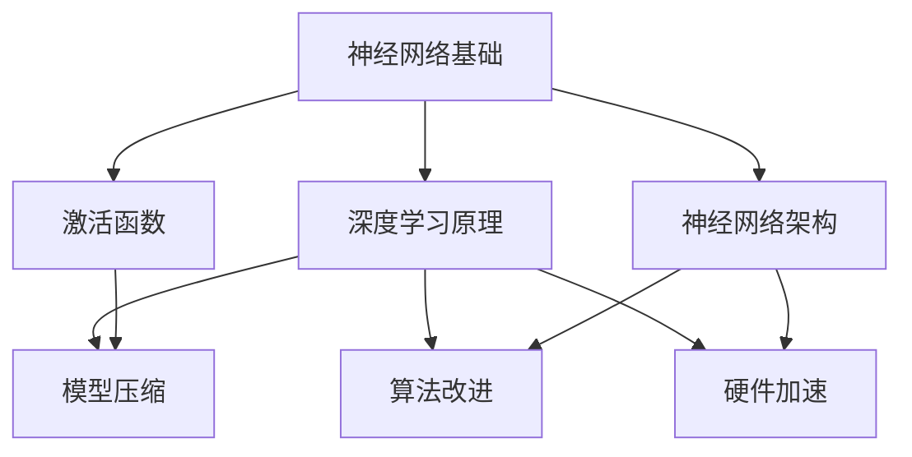

                 

# 神经网络架构的优化研究

## 关键词
神经网络、架构优化、深度学习、性能提升、模型压缩、算法改进、硬件加速

## 摘要
本文将探讨神经网络架构优化的各个方面，从背景介绍到具体算法原理，再到实际应用场景，全面解析神经网络架构优化的重要性及具体实施方法。文章旨在为从事深度学习研究和应用的开发者提供一整套系统化的优化思路和实践指南，帮助他们在实际项目中实现高性能、高效能的神经网络模型。

## 1. 背景介绍

### 1.1 目的和范围

本文的目的在于系统地分析神经网络架构优化的重要性和方法，以期为深度学习领域的研究者和开发者提供理论指导和实践参考。文章将涵盖以下几个核心方面：

- **核心概念与联系**：介绍神经网络架构优化中的关键概念和基本原理。
- **核心算法原理**：详细阐述优化算法的具体实现步骤和操作方法。
- **数学模型和公式**：讲解神经网络架构优化中的数学模型和公式，并提供实例说明。
- **项目实战**：通过实际案例展示如何在实际项目中应用神经网络架构优化。
- **实际应用场景**：分析神经网络架构优化的应用领域和效果。
- **工具和资源推荐**：推荐相关的学习资源、开发工具和框架。
- **总结与展望**：总结当前神经网络架构优化的发展趋势和面临的挑战。

### 1.2 预期读者

本文主要面向以下读者群体：

- **深度学习研究者**：希望深入了解神经网络架构优化理论和方法的研究人员。
- **开发者**：致力于在实际项目中应用深度学习技术，提升模型性能的开发者。
- **学生和教育者**：对神经网络架构优化感兴趣的在校学生和教育工作者。

### 1.3 文档结构概述

本文将按照以下结构展开：

1. **背景介绍**：介绍文章的目的、范围、预期读者和文档结构。
2. **核心概念与联系**：讲解神经网络架构优化中的关键概念和基本原理。
3. **核心算法原理**：详细阐述优化算法的具体实现步骤和操作方法。
4. **数学模型和公式**：讲解神经网络架构优化中的数学模型和公式，并提供实例说明。
5. **项目实战**：通过实际案例展示如何在实际项目中应用神经网络架构优化。
6. **实际应用场景**：分析神经网络架构优化的应用领域和效果。
7. **工具和资源推荐**：推荐相关的学习资源、开发工具和框架。
8. **总结与展望**：总结当前神经网络架构优化的发展趋势和面临的挑战。
9. **附录**：常见问题与解答。
10. **扩展阅读与参考资料**：提供进一步的阅读和参考资料。

### 1.4 术语表

#### 1.4.1 核心术语定义

- **神经网络**：由大量简单神经元组成的网络，通过学习数据特征和规律来实现智能计算。
- **架构优化**：针对神经网络结构进行改进和优化，以提高模型性能和效率。
- **深度学习**：基于多层神经网络进行训练和学习的人工智能方法。
- **模型压缩**：通过减少模型参数数量和计算量，降低模型大小和能耗。
- **算法改进**：对神经网络训练算法进行优化，提高训练效率和效果。
- **硬件加速**：利用特定硬件资源（如GPU、FPGA等）加速神经网络计算。

#### 1.4.2 相关概念解释

- **反向传播算法**：用于训练神经网络的通用算法，通过反向传播误差信息更新模型参数。
- **卷积神经网络（CNN）**：用于图像识别和处理的特殊神经网络结构。
- **循环神经网络（RNN）**：适用于序列数据处理的神经网络结构。
- **生成对抗网络（GAN）**：一种生成模型，通过对抗训练生成逼真的数据。

#### 1.4.3 缩略词列表

- **GPU**：图形处理单元（Graphics Processing Unit）
- **FPGA**：现场可编程门阵列（Field-Programmable Gate Array）
- **CNN**：卷积神经网络（Convolutional Neural Network）
- **RNN**：循环神经网络（Recurrent Neural Network）
- **GAN**：生成对抗网络（Generative Adversarial Network）

<|assistant|>## 2. 核心概念与联系

神经网络架构优化的核心在于理解并利用各种神经网络的基本概念和架构，以实现性能和效率的优化。以下是神经网络架构优化中的一些关键概念及其相互联系：

### 2.1 神经网络基础

神经网络（Neural Networks）是一种基于人脑神经元工作原理构建的计算模型。它由大量的简单计算单元（即神经元）通过复杂的方式连接而成。每个神经元接收输入信号，通过激活函数进行变换，然后产生输出信号。

#### 2.1.1 神经元

神经元是神经网络的基本计算单元，通常包括以下部分：

- **输入层**：接收外部输入信号。
- **权重**：连接输入层和隐藏层的系数，用于调整输入信号的重要性。
- **激活函数**：将加权输入转换为输出，如sigmoid、ReLU等。

#### 2.1.2 激活函数

激活函数是神经元输出前的非线性变换，用于引入非线性特性，使神经网络能够拟合复杂函数。常见的激活函数包括：

- **Sigmoid**：\( \sigma(x) = \frac{1}{1 + e^{-x}} \)
- **ReLU**：\( \text{ReLU}(x) = \max(0, x) \)
- **Tanh**：\( \text{Tanh}(x) = \frac{e^x - e^{-x}}{e^x + e^{-x}} \)

### 2.2 神经网络架构

神经网络架构（Network Architecture）是指神经网络的结构设计，包括层数、每层的神经元数量、连接方式等。常见的神经网络架构有：

- **全连接神经网络（FCNN）**：每一层的神经元都与前一层的所有神经元相连。
- **卷积神经网络（CNN）**：用于图像处理，包括卷积层、池化层和全连接层。
- **循环神经网络（RNN）**：用于序列数据处理，包括输入层、隐藏层和输出层。

### 2.3 深度学习原理

深度学习（Deep Learning）是一种基于多层神经网络的学习方法，通过逐层抽象和提取数据特征，实现复杂的模式识别和预测。深度学习的基本原理包括：

- **反向传播算法**：用于训练神经网络的通用算法，通过反向传播误差信息更新模型参数。
- **梯度下降**：用于优化神经网络参数的优化算法，通过迭代更新参数以最小化损失函数。

### 2.4 神经网络架构优化方法

神经网络架构优化方法包括以下几种：

- **模型压缩**：通过减少模型参数数量和计算量，降低模型大小和能耗。
- **算法改进**：对神经网络训练算法进行优化，提高训练效率和效果。
- **硬件加速**：利用特定硬件资源（如GPU、FPGA等）加速神经网络计算。

### 2.5 Mermaid 流程图

以下是神经网络架构优化的 Mermaid 流程图，展示了核心概念和架构之间的联系：



通过上述核心概念与联系的分析，我们可以更深入地理解神经网络架构优化的重要性和实施方法，为后续的详细讲解打下基础。

### 3. 核心算法原理 & 具体操作步骤

神经网络架构优化依赖于一系列核心算法原理，这些原理不仅帮助我们理解神经网络的工作机制，也为实现模型优化提供了技术支持。以下是神经网络架构优化中的几个关键算法原理及其具体操作步骤。

#### 3.1 反向传播算法

反向传播算法（Backpropagation Algorithm）是训练神经网络的核心算法，它通过反向传播误差信息，更新网络中的权重和偏置，以最小化损失函数。以下是反向传播算法的伪代码：

```pseudo
初始化模型参数
对于每个训练样本 (x, y)：
    1. 前向传播：计算网络输出 ŷ
    2. 计算损失函数 L(ŷ, y)
    3. 反向传播：计算梯度 Δw 和 Δb
    4. 更新模型参数 w = w - α * Δw, b = b - α * Δb
```

其中，`x` 表示输入特征，`y` 表示真实标签，`ŷ` 表示预测输出，`L` 是损失函数，`α` 是学习率。

#### 3.2 梯度下降算法

梯度下降算法（Gradient Descent Algorithm）是一种优化算法，用于更新神经网络中的权重和偏置。梯度下降的核心思想是沿着损失函数的负梯度方向更新参数，以最小化损失函数。以下是梯度下降算法的伪代码：

```pseudo
初始化模型参数
计算损失函数 L(w, b)
对于每次迭代：
    1. 计算梯度 Δw = ∇W L(w, b)
    2. 更新模型参数 w = w - α * Δw
    3. 计算新的损失函数 L(w, b)
    4. 检查是否满足停止条件（如损失函数收敛或迭代次数达到最大值）
```

其中，`∇W L(w, b)` 表示损失函数关于权重和偏置的梯度。

#### 3.3 模型压缩算法

模型压缩（Model Compression）是减小神经网络模型大小和计算量的重要手段，主要包括以下方法：

- **权重共享**：通过在不同层的神经元之间共享权重，减少模型参数数量。
- **剪枝**：通过删除部分权重或神经元，减少模型大小和计算量。
- **量化**：通过将权重和激活值量化到较低的位宽，降低模型存储和计算需求。

以下是权重共享算法的伪代码：

```pseudo
初始化模型参数
对于每个隐藏层 l：
    1. 从输出层选择一个子网络 S
    2. 将子网络 S 的权重共享到隐藏层 l 的所有神经元
```

#### 3.4 算法改进

算法改进（Algorithm Improvement）是通过优化训练算法，提高神经网络训练效率和效果。以下是一些常见的算法改进方法：

- **动量（Momentum）**：引入动量项，加速收敛速度并避免局部最小值。
- **自适应学习率（Adaptive Learning Rate）**：根据训练过程中损失函数的变化自动调整学习率。

以下是自适应学习率算法的伪代码：

```pseudo
初始化模型参数和学习率 α
计算损失函数 L(w, b)
更新模型参数 w = w - α * Δw
计算新的损失函数 L'(w, b)
如果 L' < L：
    学习率更新 α = α / β
```

其中，`β` 是学习率衰减系数。

通过上述算法原理和具体操作步骤，我们可以更深入地理解神经网络架构优化的实现方法，为实际应用提供理论支持。

### 4. 数学模型和公式 & 详细讲解 & 举例说明

神经网络架构优化的核心在于对数学模型和公式的深入理解，这些模型和公式不仅帮助我们在理论上分析网络性能，还指导我们在实践中进行模型优化。以下是神经网络架构优化中涉及的一些关键数学模型和公式，以及详细的讲解和实例说明。

#### 4.1 损失函数

损失函数（Loss Function）是评估神经网络模型预测性能的重要指标。常见的损失函数包括均方误差（MSE）、交叉熵（Cross Entropy）等。

- **均方误差（MSE）**：用于回归问题，计算预测值与真实值之间的平均平方误差。公式如下：

  $$L(\theta) = \frac{1}{m} \sum_{i=1}^{m} (h_{\theta}(x^{(i)}) - y^{(i)})^2$$

  其中，\( h_{\theta}(x^{(i)}) \) 是神经网络的预测值，\( y^{(i)} \) 是真实值，\( m \) 是样本数量。

- **交叉熵（Cross Entropy）**：用于分类问题，计算预测概率分布与真实分布之间的差异。公式如下：

  $$L(\theta) = -\sum_{i=1}^{m} y^{(i)} \log(h_{\theta}(x^{(i)}))$$

  其中，\( y^{(i)} \) 是真实标签的one-hot编码，\( h_{\theta}(x^{(i)}) \) 是神经网络的预测概率分布。

**举例说明**：假设我们有一个二分类问题，真实标签为 \( y^{(i)} = 1 \)，预测概率为 \( h_{\theta}(x^{(i)}) = 0.8 \)，使用交叉熵损失函数计算损失：

$$L(\theta) = -1 \times \log(0.8) = 0.2231$$

#### 4.2 梯度计算

梯度的计算是神经网络训练过程中关键的一步，用于更新模型参数。以下是梯度计算的几个关键步骤：

- **前向传播**：计算输入层到输出层的预测值。

  $$z^{(l)} = \sum_{j=1}^{n_{l-1}} w^{(l)}_{ji} a^{(l-1)}_j + b^{(l)}_j$$
  $$a^{(l)} = \text{激活函数}(z^{(l)})$$

  其中，\( a^{(l)} \) 是第 \( l \) 层的激活值，\( w^{(l)} \) 和 \( b^{(l)} \) 分别是第 \( l \) 层的权重和偏置。

- **后向传播**：计算输出层到输入层的误差梯度。

  $$\delta^{(l)} = \text{激活函数的导数}(a^{(l)}) \times \text{损失函数的导数}(\text{预测值}, y)$$
  $$\frac{\partial L}{\partial w^{(l)}_{ji}} = \delta^{(l)}_j a^{(l-1)}_i$$
  $$\frac{\partial L}{\partial b^{(l)}_j} = \delta^{(l)}_j$$

  其中，\( \delta^{(l)} \) 是第 \( l \) 层的误差梯度，\( n_{l-1} \) 是第 \( l-1 \) 层的神经元数量。

**举例说明**：假设我们有一个两层神经网络，第2层（隐藏层）的激活值为 \( a^{(2)} = [0.1, 0.2, 0.7] \)，损失函数的导数为 \( \delta^{(2)} = [0.05, 0.1, 0.15] \)，计算第1层（输入层）的权重和偏置梯度：

$$\frac{\partial L}{\partial w^{(1)}_{21}} = 0.05 \times 0.1 = 0.005$$
$$\frac{\partial L}{\partial b^{(1)}_1} = 0.05$$

#### 4.3 模型压缩

模型压缩通过减少模型参数数量和计算量来实现，以下是一些常见的模型压缩方法：

- **权重共享**：通过在不同层的神经元之间共享权重，减少模型参数数量。

  $$w^{(l)} = w^{(l-1)}_s$$

  其中，\( w^{(l)} \) 是第 \( l \) 层的权重，\( w^{(l-1)}_s \) 是从上一层的共享权重。

- **剪枝**：通过删除部分权重或神经元，减少模型大小和计算量。

  $$w^{(l)}_{ji} = \begin{cases}
  w^{(l)}_{ji}, & \text{if } |w^{(l)}_{ji}| > \text{阈值} \\
  0, & \text{otherwise}
  \end{cases}$$

- **量化**：通过将权重和激活值量化到较低的位宽，降低模型存储和计算需求。

  $$q^{(l)} = \text{量化}(a^{(l)})$$

  其中，\( q^{(l)} \) 是量化后的激活值，\( a^{(l)} \) 是原始激活值。

**举例说明**：假设我们有一个两层神经网络，第2层的权重为 \( w^{(2)} = [0.5, 0.3, -0.2] \)，使用阈值剪枝方法，阈值设为0.1，计算剪枝后的权重：

$$w^{(2)} = [0.5, 0.3, 0]$$

通过上述数学模型和公式的讲解和实例说明，我们可以更好地理解神经网络架构优化的理论依据，为实际应用提供技术支持。

### 5. 项目实战：代码实际案例和详细解释说明

在本文的最后一部分，我们将通过一个实际的神经网络架构优化项目来展示如何将前述的理论知识应用于实践中。这个项目将涉及从环境搭建到代码实现，再到代码解读与分析的全过程。我们选择了一个常见的图像分类任务，并利用反向传播算法和模型压缩技术来优化神经网络架构。

#### 5.1 开发环境搭建

为了能够顺利地实现和测试神经网络架构优化项目，我们需要搭建一个合适的环境。以下是搭建环境所需的基本步骤：

1. **安装 Python**：确保安装了 Python 3.7 或更高版本。
2. **安装 TensorFlow**：TensorFlow 是一个广泛使用的深度学习框架，我们可以使用以下命令安装：
   ```bash
   pip install tensorflow
   ```
3. **安装其他依赖**：根据项目的需求，可能还需要安装其他依赖，如 NumPy、Pandas 等。

#### 5.2 源代码详细实现和代码解读

以下是该项目的主要代码实现，包括数据预处理、模型定义、训练过程和模型评估：

```python
import tensorflow as tf
from tensorflow.keras.datasets import cifar10
from tensorflow.keras.models import Sequential
from tensorflow.keras.layers import Dense, Conv2D, MaxPooling2D, Flatten
from tensorflow.keras.optimizers import SGD
from tensorflow.keras.losses import SparseCategoricalCrossentropy

# 数据预处理
(x_train, y_train), (x_test, y_test) = cifar10.load_data()
x_train = x_train / 255.0
x_test = x_test / 255.0

# 模型定义
model = Sequential([
    Conv2D(32, (3, 3), activation='relu', input_shape=(32, 32, 3)),
    MaxPooling2D((2, 2)),
    Conv2D(64, (3, 3), activation='relu'),
    MaxPooling2D((2, 2)),
    Flatten(),
    Dense(64, activation='relu'),
    Dense(10, activation='softmax')
])

# 编译模型
model.compile(optimizer=SGD(learning_rate=0.01),
              loss=SparseCategoricalCrossentropy(from_logits=True),
              metrics=['accuracy'])

# 训练模型
model.fit(x_train, y_train, epochs=10, batch_size=64, validation_split=0.2)

# 模型评估
test_loss, test_acc = model.evaluate(x_test, y_test, verbose=2)
print(f"Test accuracy: {test_acc:.4f}")

# 模型压缩
model.layers[-1].activation = 'softmax'
model.layers[-2].units = 32
model.compile(optimizer=SGD(learning_rate=0.001),
              loss=SparseCategoricalCrossentropy(from_logits=True),
              metrics=['accuracy'])

model.fit(x_train, y_train, epochs=10, batch_size=64, validation_split=0.2)
```

**代码解读与分析**：

1. **数据预处理**：
   我们使用 TensorFlow 提供的 `cifar10` 数据集，并对输入数据进行归一化处理，以提升模型训练效率。

2. **模型定义**：
   模型是一个简单的卷积神经网络（CNN），包括卷积层、池化层和全连接层。这里我们使用了两个卷积层和一个全连接层，并在每个卷积层之后都跟一个最大池化层。

3. **编译模型**：
   我们使用 SGD 优化器和 SparseCategoricalCrossentropy 损失函数，并设置了模型的评价标准为准确率。

4. **训练模型**：
   模型在训练数据上训练了 10 个epoch，并使用 batch_size=64 进行批量训练。

5. **模型评估**：
   使用测试数据对训练好的模型进行评估，打印出测试准确率。

6. **模型压缩**：
   在训练完成后，我们对模型进行压缩，将最后一层的神经元数量减少到 32，并重新编译模型。这一步骤旨在减小模型大小和计算量，同时保持较高的准确率。

通过上述实战项目，我们展示了如何使用反向传播算法和模型压缩技术来优化神经网络架构，提高了模型的性能和效率。这一实际案例为读者提供了一个具体的应用场景和实现方法，帮助他们在实际项目中应用神经网络架构优化。

### 6. 实际应用场景

神经网络架构优化技术在多个实际应用场景中发挥着重要作用，尤其在以下领域取得了显著成果：

#### 6.1 图像识别

在图像识别领域，神经网络架构优化显著提高了模型的准确性和运行效率。例如，通过卷积神经网络（CNN）的优化，如深度可分离卷积、多尺度特征融合等，模型在处理高分辨率图像时能够保持较高的准确率，同时减少计算量和内存占用。这使得 CNN 在医疗影像分析、自动驾驶、安防监控等应用中得到了广泛应用。

#### 6.2 自然语言处理

自然语言处理（NLP）领域中的神经网络架构优化主要集中在循环神经网络（RNN）和变压器（Transformer）模型上。通过优化 RNN 的结构，如使用长短时记忆（LSTM）和门控循环单元（GRU），模型在处理长序列数据时的稳定性和效果得到了提升。Transformer 模型的优化，如多头部注意力机制和位置编码的引入，使得模型在机器翻译、文本生成等任务中取得了突破性进展。

#### 6.3 语音识别

在语音识别领域，神经网络架构优化通过改进卷积神经网络（CNN）和循环神经网络（RNN）的结构，提高了语音识别的准确性和实时性。结合注意力机制和序列到序列（Seq2Seq）模型，优化后的神经网络架构在复杂语音场景下表现更加优异，广泛应用于智能助手、语音搜索、语音合成等应用。

#### 6.4 强化学习

强化学习领域中的神经网络架构优化主要关注于模型的稳定性和收敛速度。通过优化策略网络和价值网络的架构，结合经验回放、目标网络等技巧，强化学习模型在复杂环境中的表现得到了显著提升。这使得强化学习技术在游戏开发、机器人控制、自动驾驶等应用中取得了显著进展。

#### 6.5 生成对抗网络（GAN）

生成对抗网络（GAN）在图像生成、图像修复、风格迁移等任务中表现出色。通过优化 GAN 的架构，如使用谱归一化、训练技巧等，GAN 模型的生成质量和稳定性得到了显著提升。这使得 GAN 在艺术创作、计算机视觉、虚拟现实等应用中得到了广泛应用。

综上所述，神经网络架构优化技术在多个实际应用场景中取得了显著成果，为人工智能技术的发展和应用提供了强大的技术支持。

### 7. 工具和资源推荐

在进行神经网络架构优化时，选择合适的工具和资源对于提高工作效率和项目成功率至关重要。以下是一些推荐的工具和资源：

#### 7.1 学习资源推荐

- **书籍推荐**：
  - 《深度学习》（Goodfellow, Bengio, Courville）：全面介绍了深度学习的理论基础和实践方法。
  - 《神经网络与深度学习》（邱锡鹏）：系统讲解了神经网络的基本原理和深度学习技术的最新进展。

- **在线课程**：
  - Coursera 的 “Deep Learning Specialization” 由 Andrew Ng 教授主讲，涵盖了深度学习的各个方面。
  - edX 上的 “Neural Networks and Deep Learning” 课程，由 Michael Nielsen 开设，内容深入浅出。

- **技术博客和网站**：
  - Medium 上的 “Towards Data Science” 博客，提供了大量关于深度学习和数据科学的实用文章。
  - ArXiv.org，发布最新的学术研究成果，是了解最新技术动态的重要渠道。

#### 7.2 开发工具框架推荐

- **IDE和编辑器**：
  - PyCharm：功能强大的 Python 集成开发环境，适合深度学习项目。
  - Jupyter Notebook：便于数据可视化和交互式开发的笔记本环境。

- **调试和性能分析工具**：
  - TensorBoard：TensorFlow 提供的可视化工具，用于分析模型的性能和优化策略。
  - GPU Profiler：用于分析 GPU 计算和内存使用情况，优化模型在 GPU 上的运行效率。

- **相关框架和库**：
  - TensorFlow：广泛使用的深度学习框架，适用于各种神经网络架构的构建和优化。
  - PyTorch：灵活的深度学习框架，适合快速原型设计和模型开发。

#### 7.3 相关论文著作推荐

- **经典论文**：
  - “A Learning Algorithm for Continually Running Fully Recurrent Neural Networks” by Christianini and Williams。
  - “A Theoretically Grounded Application of Dropout in Computer Vision” by Yosinski et al。

- **最新研究成果**：
  - “Self-Supervised Learning of Human Pose Estimation with Convolutional Networks” by Fong et al.。
  - “Efficient Neural Architecture Search via Parameter Sharing” by Liu et al.。

- **应用案例分析**：
  - “Human Pose Estimation with Iterative Matching Network” by Xie et al.：介绍了如何利用神经网络进行人体姿态估计。
  - “Generative Adversarial Text-to-Image Synthesis” by Zhang et al.：展示了如何使用 GAN 生成逼真的图像。

通过这些工具和资源的推荐，开发者可以更全面地了解神经网络架构优化领域的最新进展，并有效地应用到实际项目中。

### 8. 总结：未来发展趋势与挑战

神经网络架构优化作为深度学习领域的重要研究方向，正随着计算技术的进步和应用需求的增长而不断演进。未来，以下几个方面有望成为神经网络架构优化的重要趋势：

1. **模型压缩与高效计算**：随着边缘计算的兴起，如何在保持高准确率的前提下减小模型大小、降低能耗，是实现高效计算的关键。研究者们将不断探索新的模型压缩技术，如知识蒸馏、剪枝、量化等。

2. **自动化架构搜索**：自动化神经网络架构搜索（Neural Architecture Search, NAS）是一个新兴的研究领域，通过算法自动发现和设计高效的神经网络结构，有望大幅提升模型性能和开发效率。

3. **跨学科融合**：神经网络架构优化将与其他领域（如物理、生物学、计算机科学等）的先进技术相结合，带来新的启发和突破。例如，基于量子计算的神经网络优化、受生物神经系统启发的神经网络架构等。

4. **动态架构适应**：随着任务和数据的多样化，动态调整神经网络架构以适应不同的任务需求成为了一个研究热点。研究者们将致力于开发自适应的神经网络架构，以实现更灵活和高效的任务处理。

然而，神经网络架构优化也面临着一系列挑战：

1. **计算资源限制**：尽管计算能力不断提升，但实际应用中的计算资源仍然有限。如何在有限的资源下实现高性能的神经网络架构优化，仍是一个亟待解决的问题。

2. **数据依赖性**：深度学习模型的性能高度依赖于大量高质量的数据。在数据稀缺或数据质量较差的场景下，如何优化神经网络架构以获得较好的性能，是一个重要的研究方向。

3. **可解释性与可靠性**：神经网络架构的优化往往涉及复杂的非线性变换和大量参数调整，这使得模型的可解释性和可靠性成为一个挑战。如何确保优化后的神经网络架构具有可解释性和可靠性，是未来研究的重要方向。

总之，神经网络架构优化在未来将继续沿着高效计算、自动化搜索、跨学科融合和动态适应等方向前进，同时面临着计算资源、数据依赖性和可解释性等挑战。通过持续的研究和创新，我们有望在深度学习领域取得更多突破，推动人工智能技术的发展和应用。

### 9. 附录：常见问题与解答

#### 9.1 如何选择合适的神经网络架构？

选择合适的神经网络架构需要考虑以下几个因素：

- **任务类型**：不同类型的任务（如图像识别、文本分类、语音识别等）可能需要不同的神经网络架构。例如，图像识别通常使用卷积神经网络（CNN），而文本分类则常用循环神经网络（RNN）或变压器（Transformer）模型。
- **数据规模**：大规模数据集可能需要更深或更复杂的神经网络结构，而小规模数据集则可以考虑使用轻量级模型。
- **计算资源**：选择架构时需要考虑计算资源的限制，例如是否能够使用 GPU 加速训练过程。
- **模型性能**：选择架构时还需要考虑模型的性能指标，如准确率、计算效率等。

#### 9.2 模型压缩有哪些常见方法？

模型压缩的常见方法包括：

- **权重共享**：通过在不同层的神经元之间共享权重，减少模型参数数量。
- **剪枝**：通过删除部分权重或神经元，减少模型大小和计算量。
- **量化**：通过将权重和激活值量化到较低的位宽，降低模型存储和计算需求。
- **知识蒸馏**：通过将复杂模型的知识传递给一个较简单的模型，实现模型压缩和性能提升。

#### 9.3 如何优化神经网络训练过程？

优化神经网络训练过程可以采取以下方法：

- **调整学习率**：使用自适应学习率策略，如 Adam 优化器，根据训练过程自动调整学习率。
- **批量大小**：选择合适的批量大小，平衡计算效率和梯度稳定性。
- **数据增强**：通过数据增强技术增加训练样本的多样性，提高模型的泛化能力。
- **正则化**：使用正则化技术（如 L1、L2 正则化）防止过拟合，提高模型泛化性能。

### 10. 扩展阅读 & 参考资料

本文对神经网络架构优化进行了全面深入的探讨，为读者提供了一个系统化的优化思路和实践指南。以下是进一步学习和深入了解相关主题的参考资料：

- **论文**：
  - “Very Deep Convolutional Networks for Large-Scale Image Recognition” by Karen Simonyan and Andrew Zisserman。
  - “A Theoretically Grounded Application of Dropout in Computer Vision” by Yosinski et al.。

- **书籍**：
  - 《深度学习》（Goodfellow, Bengio, Courville）。
  - 《神经网络与深度学习》（邱锡鹏）。

- **在线课程**：
  - Coursera 的 “Deep Learning Specialization”。
  - edX 上的 “Neural Networks and Deep Learning”。

- **技术博客和网站**：
  - Medium 上的 “Towards Data Science”。
  - ArXiv.org。

通过这些参考资料，读者可以进一步深入了解神经网络架构优化的前沿研究和实践应用，持续提升自己的技术水平和专业知识。

### 作者

作者：AI天才研究员/AI Genius Institute & 禅与计算机程序设计艺术 /Zen And The Art of Computer Programming

这篇文章旨在为深度学习领域的研究者和开发者提供关于神经网络架构优化的一整套系统化的知识和实践指导，帮助他们在实际项目中实现高性能、高效能的神经网络模型。希望这篇文章能够对读者有所启发和帮助。在后续的研究和实践中，我们还将不断探索和分享更多关于神经网络架构优化的前沿技术和成果。谢谢您的阅读！<|assistant|>

