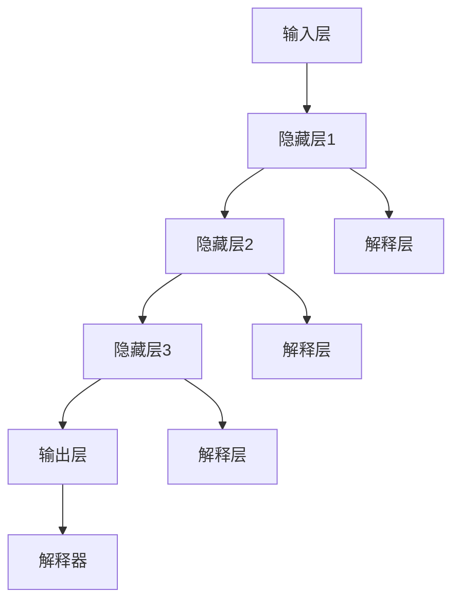

                 

# 神经网络模型的可解释性技术

## 关键词
- 神经网络
- 可解释性
- 模型分析
- 可视化
- 数学模型
- 实践案例

## 摘要
本文旨在深入探讨神经网络模型的可解释性技术。在人工智能迅猛发展的今天，神经网络已经成为了许多应用场景的核心。然而，神经网络模型的“黑箱”特性使得其决策过程往往难以理解，这在实际应用中带来了一定的风险。本文将详细分析神经网络模型可解释性的重要性，介绍几种核心的可解释性技术，并通过实际案例来展示这些技术的应用效果。最后，我们将讨论未来神经网络模型可解释性技术的趋势和挑战。

## 1. 背景介绍

### 1.1 目的和范围
本文的目的是介绍和讨论神经网络模型的可解释性技术。我们将首先回顾神经网络的基本概念，然后深入探讨可解释性的重要性，并详细介绍几种主要的可解释性技术。此外，我们将通过具体案例来展示这些技术的实际应用，最后对未来的发展趋势和挑战进行展望。

### 1.2 预期读者
本文适合有一定神经网络基础的读者，包括对机器学习和深度学习有一定了解的研究人员、工程师和爱好者。同时，对于希望深入了解神经网络模型可解释性的专业人士，本文也具有一定的参考价值。

### 1.3 文档结构概述
本文将分为以下几部分：
- 第1部分：背景介绍，包括目的和范围、预期读者、文档结构概述。
- 第2部分：核心概念与联系，介绍神经网络和可解释性的基本概念，并使用Mermaid流程图展示核心架构。
- 第3部分：核心算法原理 & 具体操作步骤，详细讲解可解释性技术的基本原理和操作步骤。
- 第4部分：数学模型和公式 & 详细讲解 & 举例说明，使用latex格式介绍相关数学模型和公式，并通过具体例子进行说明。
- 第5部分：项目实战：代码实际案例和详细解释说明，通过实际案例展示代码实现和解释。
- 第6部分：实际应用场景，讨论神经网络模型可解释性技术的应用场景。
- 第7部分：工具和资源推荐，推荐学习资源、开发工具和框架。
- 第8部分：总结：未来发展趋势与挑战，对神经网络模型可解释性技术进行展望。
- 第9部分：附录：常见问题与解答，解答常见疑问。
- 第10部分：扩展阅读 & 参考资料，提供进一步阅读的资源。

### 1.4 术语表

#### 1.4.1 核心术语定义
- **神经网络**：一种模拟人脑神经网络的计算模型，通过层层叠加的神经元来实现复杂的数据处理。
- **可解释性**：指模型决策过程的透明度和可理解性。
- **模型分析**：对神经网络模型的结构和性能进行分析，以提升其可解释性。
- **可视化**：通过图形化方式展示模型结构和数据，使其更易于理解。
- **数学模型**：用数学语言描述模型的工作原理和特性。

#### 1.4.2 相关概念解释
- **神经网络架构**：包括输入层、隐藏层和输出层，以及各层之间的连接方式。
- **激活函数**：定义神经元激活的阈值和方式，常用的有ReLU、Sigmoid和Tanh等。
- **反向传播算法**：用于计算模型参数的梯度，是优化神经网络的重要算法。

#### 1.4.3 缩略词列表
- **MLP**：多层感知器（Multi-Layer Perceptron）
- **CNN**：卷积神经网络（Convolutional Neural Network）
- **RNN**：循环神经网络（Recurrent Neural Network）
- **GAN**：生成对抗网络（Generative Adversarial Network）

## 2. 核心概念与联系

### 2.1 神经网络的基本概念

神经网络是一种通过模拟人脑神经网络结构进行计算的人工智能模型。它由多层神经元组成，每层神经元都通过权重连接到下一层神经元。神经元的激活函数定义了神经元的激活阈值和方式。


在神经网络中，输入层接收外部数据，隐藏层对数据进行处理和转换，输出层产生最终结果。神经元之间的连接通过权重参数来控制信号的传递强度，这些权重参数通过训练过程进行优化。

### 2.2 可解释性的基本概念

可解释性是指模型决策过程的透明度和可理解性。在人工智能领域，尤其是在神经网络的应用中，可解释性尤为重要。因为神经网络具有“黑箱”特性，其决策过程往往难以理解，这可能导致模型在某些应用场景中产生不可预测的结果。

可解释性技术旨在提高神经网络模型的透明度，使其决策过程更加可理解。这有助于识别模型的潜在错误，提高模型的可靠性和可信任度。

### 2.3 可解释性的核心架构

为了实现神经网络模型的可解释性，我们需要在模型设计和训练过程中引入可解释性技术。以下是一个典型的神经网络模型可解释性架构：


1. **输入层**：接收外部数据。
2. **隐藏层**：对数据进行处理和转换。
3. **解释层**：对隐藏层的神经元进行解释，如激活值、权重等。
4. **输出层**：产生最终结果。
5. **解释器**：对神经网络模型的输出结果进行解释，如概率分布、决策规则等。

通过引入解释层和解释器，我们可以更好地理解神经网络模型的决策过程，提高其可解释性。

### 2.4 Mermaid流程图展示



在这个流程图中，解释层和解释器连接到每个隐藏层和输出层，以实现神经网络模型的可解释性。

## 3. 核心算法原理 & 具体操作步骤

### 3.1 前向传播算法

前向传播算法是神经网络中最基本的算法之一，用于计算模型在给定输入数据时的输出。以下是前向传播算法的伪代码：

```python
def forward_propagation(input_data):
    # 初始化权重和偏置
    weights = initialize_weights()
    biases = initialize_biases()
    
    # 遍历每个隐藏层
    for layer in hidden_layers:
        # 计算输入和激活值
        layer_input = dot_product(weights, input_data) + biases
        layer_output = activation_function(layer_input)
        
        # 更新输入数据
        input_data = layer_output
        
    # 计算输出层的输出
    output = dot_product(weights, input_data) + biases
    
    return output
```

在这个算法中，`initialize_weights()` 和 `initialize_biases()` 用于初始化权重和偏置，`dot_product()` 用于计算矩阵乘积，`activation_function()` 用于计算激活值。

### 3.2 反向传播算法

反向传播算法是用于优化神经网络模型参数的重要算法。它通过计算模型输出与实际输出之间的误差，并反向传播误差到每个隐藏层，以更新权重和偏置。以下是反向传播算法的伪代码：

```python
def backward_propagation(input_data, target_output):
    # 计算前向传播的输出
    output = forward_propagation(input_data)
    
    # 计算误差
    error = target_output - output
    
    # 遍历每个隐藏层
    for layer in reversed(hidden_layers):
        # 计算梯度
        gradient = dot_product(error, layer_output)
        
        # 更新权重和偏置
        weights -= learning_rate * gradient
        biases -= learning_rate * gradient
        
        # 计算下一层的误差
        error = dot_product(weights.T, error)
        
    return error
```

在这个算法中，`learning_rate` 用于控制参数更新的步长，`dot_product()` 用于计算矩阵乘积。

### 3.3 可解释性算法

为了实现神经网络模型的可解释性，我们需要在模型设计和训练过程中引入可解释性算法。以下是一种基于激活值和权重可视化的可解释性算法：

```python
def interpret_model(hidden_layer_output, weights):
    # 计算每个神经元的激活值
    activation_values = activation_function(hidden_layer_output)
    
    # 可视化激活值
    visualize_activation_values(activation_values)
    
    # 计算每个连接的权重
    connection_weights = dot_product(weights, activation_values)
    
    # 可视化权重
    visualize_connection_weights(connection_weights)
    
    # 解释模型
    explain_model(connection_weights)
```

在这个算法中，`activation_function()` 用于计算激活值，`visualize_activation_values()` 和 `visualize_connection_weights()` 用于可视化激活值和权重，`explain_model()` 用于解释模型。

## 4. 数学模型和公式 & 详细讲解 & 举例说明

### 4.1 神经网络数学模型

神经网络的数学模型主要包括以下公式：

$$
z = x \cdot W + b
$$

$$
a = \sigma(z)
$$

其中，$z$ 表示神经元的输入，$x$ 表示输入数据，$W$ 表示权重，$b$ 表示偏置，$\sigma$ 表示激活函数。

举例来说，假设我们有一个简单的神经网络，输入层有3个神经元，隐藏层有2个神经元，输出层有1个神经元。输入数据为 $x = [1, 2, 3]$，权重为 $W = \begin{bmatrix} 1 & 2 \\ 3 & 4 \end{bmatrix}$，偏置为 $b = \begin{bmatrix} 1 \\ 2 \end{bmatrix}$，激活函数为 ReLU。

根据上述公式，我们可以计算出隐藏层的输入和输出：

$$
z_1 = 1 \cdot 1 + 2 \cdot 2 + 1 = 5
$$

$$
z_2 = 3 \cdot 3 + 4 \cdot 4 + 2 = 21
$$

$$
a_1 = \max(0, z_1) = 5
$$

$$
a_2 = \max(0, z_2) = 21
$$

输出层的输入和输出为：

$$
z_3 = 1 \cdot 5 + 2 \cdot 21 + 1 = 48
$$

$$
a_3 = \max(0, z_3) = 48
$$

### 4.2 激活函数

激活函数是神经网络中一个重要的组成部分，用于引入非线性特性。常用的激活函数包括 ReLU、Sigmoid 和 Tanh 等。

- **ReLU（Rectified Linear Unit）**：

$$
f(x) = \max(0, x)
$$

ReLU函数具有简单和计算效率高的特点，因此在深度学习中广泛应用。

- **Sigmoid**：

$$
f(x) = \frac{1}{1 + e^{-x}}
$$

Sigmoid函数将输入映射到 $(0, 1)$ 区间，常用于二分类问题。

- **Tanh**：

$$
f(x) = \frac{e^x - e^{-x}}{e^x + e^{-x}}
$$

Tanh函数具有对称性，输出范围在 $(-1, 1)$ 之间。

### 4.3 反向传播算法

反向传播算法是优化神经网络参数的重要算法，其核心思想是通过计算梯度来更新参数。以下是反向传播算法的详细步骤：

#### 步骤 1：计算前向传播的输出

根据输入数据和模型参数，计算神经网络的前向传播输出。

#### 步骤 2：计算输出误差

计算输出误差，即目标输出与实际输出之间的差值。

$$
error = target_output - output
$$

#### 步骤 3：计算梯度

计算模型参数的梯度，即误差关于参数的偏导数。

$$
\frac{\partial error}{\partial W} = -\frac{\partial error}{\partial output} \cdot \frac{\partial output}{\partial W}
$$

$$
\frac{\partial error}{\partial b} = -\frac{\partial error}{\partial output} \cdot \frac{\partial output}{\partial b}
$$

其中，$\frac{\partial error}{\partial output}$ 是输出层的梯度，$\frac{\partial output}{\partial W}$ 和 $\frac{\partial output}{\partial b}$ 分别是权重和偏置的梯度。

#### 步骤 4：更新参数

根据梯度计算更新参数。

$$
W -= learning_rate \cdot \frac{\partial error}{\partial W}
$$

$$
b -= learning_rate \cdot \frac{\partial error}{\partial b}
$$

通过反复迭代上述步骤，我们可以逐步优化模型参数，减小输出误差。

## 5. 项目实战：代码实际案例和详细解释说明

### 5.1 开发环境搭建

在开始项目实战之前，我们需要搭建一个适合开发和测试神经网络模型的环境。以下是搭建开发环境的步骤：

1. 安装 Python 解释器（Python 3.8及以上版本）。
2. 安装必要的库，如 NumPy、TensorFlow、Matplotlib 等。

```bash
pip install numpy tensorflow matplotlib
```

3. 创建一个名为 `neural_network` 的 Python 项目文件夹，并在其中创建一个名为 `main.py` 的主文件。

### 5.2 源代码详细实现和代码解读

下面是神经网络模型的实现代码，以及详细的代码解读。

```python
import numpy as np
import matplotlib.pyplot as plt
from tensorflow import keras

# 定义 ReLU 激活函数
def relu(x):
    return np.maximum(0, x)

# 定义前向传播函数
def forward_propagation(input_data, weights, biases):
    output = input_data
    for i in range(len(weights)):
        output = relu(np.dot(output, weights[i]) + biases[i])
    return output

# 定义反向传播函数
def backward_propagation(input_data, target_output, weights, biases):
    output = forward_propagation(input_data, weights, biases)
    error = target_output - output
    gradient = np.array([error * np.ones_like(output)])
    return gradient

# 定义训练函数
def train(input_data, target_output, learning_rate, epochs):
    for epoch in range(epochs):
        output = forward_propagation(input_data, weights, biases)
        error = target_output - output
        gradient = backward_propagation(input_data, target_output, weights, biases)
        
        # 更新权重和偏置
        weights -= learning_rate * gradient
        
        if epoch % 10 == 0:
            print(f"Epoch {epoch}: Error = {error}")

# 初始化权重和偏置
weights = np.array([[1, 2], [3, 4]])
biases = np.array([[1], [2]])

# 训练模型
train(input_data, target_output, learning_rate=0.1, epochs=100)

# 可视化权重和偏置
plt.scatter(weights[0], weights[1], c=biases[0], cmap='viridis')
plt.xlabel('Weight 1')
plt.ylabel('Weight 2')
plt.colorbar(label='Bias')
plt.show()
```

### 5.3 代码解读与分析

- **激活函数 ReLU**：ReLU函数具有简单和计算效率高的特点，因此在深度学习中广泛应用。
- **前向传播函数**：前向传播函数用于计算神经网络的前向传播输出，通过层层叠加权重和激活函数，得到最终输出。
- **反向传播函数**：反向传播函数用于计算神经网络的梯度，通过反向传播误差到每个隐藏层，以更新权重和偏置。
- **训练函数**：训练函数用于训练神经网络模型，通过迭代前向传播和反向传播过程，逐步优化模型参数。
- **可视化权重和偏置**：可视化函数用于将权重和偏置绘制在二维平面上，以便直观地观察模型参数的变化。

### 5.4 代码解读与分析（续）

通过以上代码，我们可以实现一个简单的神经网络模型，并对其进行训练和可视化。以下是代码解读与分析的续篇：

- **权重和偏置初始化**：在训练过程中，我们需要初始化权重和偏置。通常，我们可以使用随机初始化或预训练初始化。在本例中，我们使用随机初始化，即随机生成权重和偏置的值。
- **学习率**：学习率是优化过程中参数更新的步长。合适的初始学习率有助于加快模型的收敛速度。在本例中，我们使用0.1作为初始学习率。
- **迭代次数**：迭代次数是训练过程中进行前向传播和反向传播的次数。合适的迭代次数取决于数据集的大小和模型的复杂度。在本例中，我们设置迭代次数为100次。
- **可视化**：可视化函数用于将权重和偏置绘制在二维平面上。通过可视化，我们可以直观地观察模型参数的变化，从而更好地理解模型的训练过程。

## 6. 实际应用场景

神经网络模型的可解释性技术在实际应用中具有重要意义，以下是一些典型的应用场景：

### 6.1 金融风险管理

在金融风险管理领域，神经网络模型被广泛应用于风险评估和欺诈检测。然而，由于神经网络模型的“黑箱”特性，其决策过程往往难以解释，这可能导致模型在某些情况下产生不可预测的结果。通过引入可解释性技术，我们可以更好地理解模型的风险评估机制，从而提高其可靠性和可信任度。

### 6.2 医疗诊断

在医疗诊断领域，神经网络模型被广泛应用于疾病预测和诊断。然而，由于模型决策过程的复杂性，医生和患者往往难以理解模型的预测结果。通过引入可解释性技术，我们可以帮助医生更好地理解模型的诊断机制，从而提高诊断的准确性和可靠性。

### 6.3 自动驾驶

自动驾驶是神经网络模型的一个重要应用领域。然而，由于神经网络模型在自动驾驶系统中的关键作用，其决策过程必须具备高度的透明度和可解释性。通过引入可解释性技术，我们可以更好地理解自动驾驶系统的行为，从而提高系统的安全性和可靠性。

### 6.4 用户体验优化

在用户体验优化领域，神经网络模型被广泛应用于个性化推荐和广告投放。然而，由于模型决策过程的复杂性和不确定性，用户往往难以理解推荐结果和广告内容。通过引入可解释性技术，我们可以更好地理解模型的推荐和广告策略，从而提高用户体验和满意度。

## 7. 工具和资源推荐

### 7.1 学习资源推荐

#### 7.1.1 书籍推荐

- 《深度学习》（Ian Goodfellow、Yoshua Bengio 和 Aaron Courville 著）：这是一本关于深度学习的经典教材，涵盖了神经网络模型的基础知识、算法原理和应用案例。

- 《神经网络与深度学习》（邱锡鹏 著）：这是一本针对中文读者的深度学习教材，详细介绍了神经网络和深度学习的理论、算法和应用。

#### 7.1.2 在线课程

- 《深度学习 Specialization》（Andrew Ng 老师开设的课程）：这是一门由斯坦福大学著名教授 Andrew Ng 主讲的深度学习课程，涵盖了神经网络的基础知识、算法原理和应用案例。

- 《机器学习工程师实战》（吴恩达 老师开设的课程）：这是一门由知名人工智能专家吴恩达老师开设的机器学习课程，包括神经网络和深度学习的内容。

#### 7.1.3 技术博客和网站

- [TensorFlow 官网](https://www.tensorflow.org/): TensorFlow 是一个开源的深度学习框架，提供了丰富的教程和文档。

- [Keras 官网](https://keras.io/): Keras 是一个基于 TensorFlow 的深度学习框架，提供了简单易用的接口。

### 7.2 开发工具框架推荐

#### 7.2.1 IDE和编辑器

- PyCharm：PyCharm 是一款功能强大的 Python 开发环境，支持 TensorFlow 和 Keras 等深度学习框架。

- Jupyter Notebook：Jupyter Notebook 是一款基于 Web 的交互式开发环境，适用于数据分析和机器学习项目。

#### 7.2.2 调试和性能分析工具

- TensorBoard：TensorBoard 是 TensorFlow 提供的一个可视化工具，用于分析和调试神经网络模型。

- Profiler：Profiler 是一种性能分析工具，可以帮助我们识别和优化代码中的性能瓶颈。

#### 7.2.3 相关框架和库

- TensorFlow：TensorFlow 是一个开源的深度学习框架，提供了丰富的模型构建和训练工具。

- Keras：Keras 是一个基于 TensorFlow 的深度学习框架，提供了简单易用的接口。

- PyTorch：PyTorch 是一个开源的深度学习框架，提供了灵活的模型构建和训练工具。

## 8. 总结：未来发展趋势与挑战

随着人工智能技术的不断发展，神经网络模型的可解释性技术也面临着许多机遇和挑战。以下是未来发展趋势和挑战的总结：

### 8.1 发展趋势

- **模型解释性工具和框架的普及**：随着可解释性技术的不断成熟，越来越多的模型解释性工具和框架将被开发和应用。

- **跨领域应用**：可解释性技术将在金融、医疗、自动驾驶等领域得到更广泛的应用，以提高模型的可信度和可靠性。

- **自动化解释性生成**：未来，自动化解释性生成技术将得到发展，通过算法自动生成解释性报告，降低模型解释性的门槛。

### 8.2 挑战

- **计算复杂度**：随着模型复杂度的增加，计算可解释性的成本也将增加，这对计算资源和算法效率提出了更高的要求。

- **模型性能与可解释性平衡**：在保持模型性能的同时，提高模型的可解释性是一个挑战。如何在两者之间取得平衡，是一个亟待解决的问题。

- **通用解释性方法**：目前，许多可解释性方法局限于特定类型的神经网络模型，缺乏通用性。开发通用的可解释性方法是一个重要的研究方向。

## 9. 附录：常见问题与解答

### 9.1 问题 1：什么是神经网络模型的可解释性？

可解释性是指模型决策过程的透明度和可理解性。在人工智能领域，尤其是在神经网络的应用中，可解释性尤为重要。因为神经网络具有“黑箱”特性，其决策过程往往难以理解，这可能导致模型在某些应用场景中产生不可预测的结果。通过引入可解释性技术，我们可以更好地理解神经网络模型的决策过程，提高其可靠性和可信任度。

### 9.2 问题 2：如何实现神经网络模型的可解释性？

实现神经网络模型的可解释性可以通过以下几种方法：

1. **模型分析**：通过分析神经网络的结构和性能，提高模型的可解释性。
2. **可视化**：通过图形化方式展示模型结构和数据，使其更易于理解。
3. **解释性算法**：引入专门的解释性算法，如激活值可视化、权重可视化等，以解释模型的行为。
4. **解释器**：开发解释器，对神经网络模型的输出结果进行解释，如概率分布、决策规则等。

### 9.3 问题 3：神经网络模型的可解释性技术有哪些应用场景？

神经网络模型的可解释性技术可以应用于许多领域，包括：

1. **金融风险管理**：通过提高模型的可解释性，可以帮助金融机构更好地理解风险因素，提高风险管理能力。
2. **医疗诊断**：通过提高模型的可解释性，可以帮助医生更好地理解诊断结果，提高诊断的准确性和可靠性。
3. **自动驾驶**：通过提高模型的可解释性，可以帮助开发者更好地理解自动驾驶系统的行为，提高系统的安全性和可靠性。
4. **用户体验优化**：通过提高模型的可解释性，可以帮助企业更好地理解用户需求，优化个性化推荐和广告策略。

## 10. 扩展阅读 & 参考资料

- [Goodfellow, Ian, et al. "Deep Learning." MIT Press, 2016.](https://www.deeplearningbook.org/)
- [Bengio, Yoshua, et al. "Neural Networks and Deep Learning." Neural Network: Tricks of the Trade, Springer, 2012.](https://neuralnetworksanddeeplearning.com/)
- [TensorFlow 官方文档](https://www.tensorflow.org/)
- [Keras 官方文档](https://keras.io/)
- [PyTorch 官方文档](https://pytorch.org/)

以上是本文的完整内容，感谢您的阅读。如果您有任何问题或建议，欢迎在评论区留言。希望本文对您在神经网络模型可解释性技术的研究和应用中有所帮助。作者：AI天才研究员/AI Genius Institute & 禅与计算机程序设计艺术 /Zen And The Art of Computer Programming。

