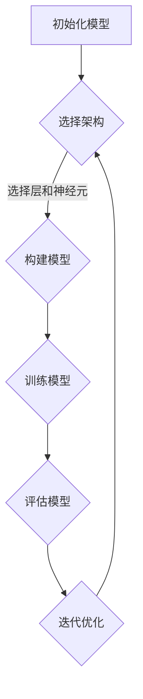
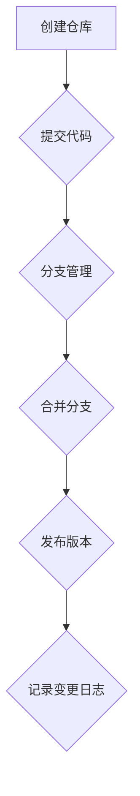
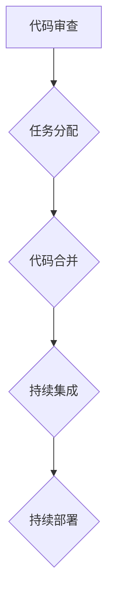

                 

# 神经网络模型的版本控制与协作开发

> 关键词：神经网络模型、版本控制、协作开发、模型管理、分布式系统、人工智能、DevOps

> 摘要：本文将探讨在人工智能领域，尤其是在神经网络模型开发过程中，版本控制和协作开发的重要性。通过深入分析核心概念、算法原理、数学模型及实际项目案例，文章旨在为开发者提供有效的模型管理和协作开发策略，以提升开发效率和模型质量。

## 1. 背景介绍

### 1.1 目的和范围

本文旨在探讨神经网络模型的版本控制与协作开发，通过以下几个方面展开：

- **版本控制的重要性**：解释版本控制的概念，以及在模型开发中如何使用版本控制系统（如Git）来管理模型的不同版本。
- **协作开发的需求**：讨论分布式团队在神经网络模型开发中的挑战，以及如何通过协作开发流程来解决问题。
- **实际案例**：提供真实项目的案例，展示如何应用版本控制和协作开发策略来提高模型开发的效率和稳定性。

### 1.2 预期读者

本文适合以下读者群体：

- **神经网络模型开发者**：希望通过版本控制和协作开发来优化模型开发流程。
- **技术团队领导**：希望了解如何管理大型模型项目的开发。
- **数据科学家**：对模型管理有深入理解，希望提高模型复用性和可维护性。

### 1.3 文档结构概述

本文结构如下：

1. **背景介绍**：介绍本文的目的、预期读者和文档结构。
2. **核心概念与联系**：讨论神经网络模型开发中的核心概念和架构。
3. **核心算法原理 & 具体操作步骤**：详细阐述版本控制和协作开发的具体操作步骤。
4. **数学模型和公式 & 详细讲解 & 举例说明**：介绍神经网络模型的数学基础。
5. **项目实战：代码实际案例和详细解释说明**：提供实际代码案例，并进行分析。
6. **实际应用场景**：讨论版本控制和协作开发在不同场景下的应用。
7. **工具和资源推荐**：推荐学习资源和开发工具。
8. **总结：未来发展趋势与挑战**：展望未来的发展趋势和面临的挑战。
9. **附录：常见问题与解答**：回答读者可能遇到的常见问题。
10. **扩展阅读 & 参考资料**：提供进一步阅读的资料。

### 1.4 术语表

#### 1.4.1 核心术语定义

- **神经网络模型**：一种模拟人脑神经元连接结构的计算模型，用于处理复杂数据和进行预测。
- **版本控制**：一种管理文件和文档变化的技术，通常用于跟踪代码和模型的版本历史。
- **协作开发**：多个开发者在同一个项目上进行协同工作的过程，旨在提高开发效率和代码质量。
- **分布式系统**：由多个计算机节点组成的系统，节点间通过计算机网络进行通信。

#### 1.4.2 相关概念解释

- **模型管理**：对神经网络模型进行创建、训练、部署和监控的全过程。
- **DevOps**：结合开发（Development）和运维（Operations）的实践，旨在通过自动化和协作来优化软件开发生命周期。

#### 1.4.3 缩略词列表

- **ML**：机器学习（Machine Learning）
- **AI**：人工智能（Artificial Intelligence）
- **Git**：分布式版本控制系统（Git）
- **DevOps**：开发与运维（Development and Operations）

## 2. 核心概念与联系

在神经网络模型的开发过程中，理解核心概念和它们之间的联系至关重要。以下是对这些概念及其相互关系的解释，并附上Mermaid流程图。

### 2.1 神经网络模型开发的基本流程



- **初始化模型**：开始模型开发的第一步，通常包括定义模型的架构、参数初始化等。
- **选择架构**：根据任务需求选择合适的神经网络架构，如全连接网络、卷积神经网络等。
- **构建模型**：使用选定的架构来构建神经网络模型。
- **训练模型**：通过提供训练数据来训练模型，使其能够学会预测或分类。
- **评估模型**：使用测试数据来评估模型的性能，判断其是否满足要求。
- **迭代优化**：根据评估结果对模型进行调整和优化，以提高性能。

### 2.2 版本控制的基本概念

版本控制是确保模型开发过程中各个版本的可追溯性和一致性的关键。以下是版本控制的基本概念和流程。



- **创建仓库**：在版本控制系统中创建一个新的仓库来存储模型代码。
- **提交代码**：开发者将代码更改提交到仓库中，记录每次提交的变更。
- **分支管理**：为了隔离不同的功能或bug修复，使用分支来进行并行开发。
- **合并分支**：将不同的分支合并到主分支中，确保所有代码变更的一致性。
- **发布版本**：将经过测试和验证的代码合并到主分支后，发布为一个新的版本。
- **记录变更日志**：记录每个版本的重要变更，便于后续追踪和管理。

### 2.3 协作开发的基本策略

协作开发是多个开发者在一个项目中协同工作的过程，旨在提高开发效率和代码质量。以下是协作开发的基本策略。



- **代码审查**：团队成员对提交的代码进行审查，确保代码质量。
- **任务分配**：根据团队成员的技能和任务需求，合理分配开发任务。
- **代码合并**：将各个开发者的代码合并到主分支中，解决冲突。
- **持续集成**：自动化构建和测试代码，确保集成后的代码仍然可用。
- **持续部署**：自动部署代码到生产环境，确保应用的持续可用性。

通过上述核心概念和流程的讨论，我们可以更好地理解神经网络模型开发中的版本控制和协作开发的重要性。接下来，我们将详细讨论核心算法原理和具体操作步骤。

## 3. 核心算法原理 & 具体操作步骤

### 3.1 版本控制系统的基本操作

版本控制系统（如Git）是管理神经网络模型开发过程中代码和模型版本的重要工具。以下是使用Git进行版本控制的基本操作步骤。

#### 3.1.1 初始化仓库

首先，我们需要初始化一个Git仓库：

```bash
git init
```

这将在当前目录中创建一个新的Git仓库。

#### 3.1.2 添加文件

接下来，我们将模型代码添加到Git仓库中：

```bash
git add model.py
```

这会将`model.py`文件添加到暂存区。

#### 3.1.3 提交更改

然后，我们将提交这些更改到仓库中：

```bash
git commit -m "Initial model implementation"
```

这将创建一个新提交，并记录我们的变更。

#### 3.1.4 分支管理

为了隔离不同的功能或bug修复，我们可以创建分支：

```bash
git checkout -b feature/bugfix
```

这将创建一个名为`feature/bugfix`的新分支。

#### 3.1.5 合并分支

在完成功能开发或bug修复后，我们需要将分支合并到主分支中：

```bash
git checkout master
git merge feature/bugfix
```

这将把`feature/bugfix`分支的更改合并到主分支中。

#### 3.1.6 发布版本

最后，我们将合并后的代码发布为新版本：

```bash
git tag v1.0
git push origin v1.0
```

这将创建一个名为`v1.0`的标签，并将其推送到远程仓库。

### 3.2 协作开发的具体流程

在分布式团队中，协作开发是一个复杂的过程，需要一系列策略和工具来确保效率和代码质量。以下是协作开发的具体流程。

#### 3.2.1 代码审查

代码审查是确保代码质量的关键步骤。以下是一个简单的代码审查流程：

1. **提交代码**：开发者将代码更改提交到Git仓库。
2. **发起审查请求**：在Git仓库中发起代码审查请求。
3. **审查反馈**：审查者对提交的代码进行审查，并提供反馈。
4. **代码合并**：根据审查反馈进行代码修改，并将其合并到主分支。

#### 3.2.2 任务分配

任务分配是协作开发中的另一个关键环节。以下是一个简单的任务分配流程：

1. **需求分析**：分析项目需求，确定需要完成的功能和任务。
2. **任务分配**：根据团队成员的技能和任务需求，合理分配任务。
3. **任务跟踪**：使用任务管理工具（如JIRA）跟踪任务进度。

#### 3.2.3 持续集成

持续集成（CI）是确保代码质量和稳定性的重要工具。以下是一个简单的持续集成流程：

1. **构建触发**：每次提交代码时，自动触发构建过程。
2. **测试执行**：执行预定义的测试用例，确保代码质量。
3. **报告输出**：输出构建和测试报告，便于后续分析。

#### 3.2.4 持续部署

持续部署（CD）是确保应用持续可用性的关键。以下是一个简单的持续部署流程：

1. **环境配置**：配置开发、测试和生产环境。
2. **部署触发**：在测试通过后，自动触发部署到生产环境。
3. **监控与维护**：监控应用性能，及时处理故障和问题。

通过上述核心算法原理和具体操作步骤的介绍，我们可以更好地理解如何使用版本控制系统进行模型管理，以及如何在分布式团队中实施协作开发流程。接下来，我们将进一步探讨神经网络模型的数学模型和公式。

## 4. 数学模型和公式 & 详细讲解 & 举例说明

神经网络模型的核心在于其数学模型，特别是前向传播（Forward Propagation）和反向传播（Back Propagation）算法。以下是这些算法的详细讲解和举例说明。

### 4.1 前向传播算法

前向传播算法是神经网络进行预测或分类的过程。其核心步骤包括计算每个神经元的输入、激活函数和输出。

#### 4.1.1 伪代码

```python
for each layer in neural_network:
    for each neuron in layer:
        input = weighted_sum_of_inputs
        output = activation_function(input)

```

#### 4.1.2 举例说明

假设我们有一个两层的神经网络，第一层有3个神经元，第二层有2个神经元，输入数据为\[1, 2, 3\]，权重和偏置如下：

- 第一层到第二层的权重：\[w1, w2, w3\]
- 第一层到第二层的偏置：\[b1, b2, b3\]
- 激活函数：\[f(x) = \frac{1}{1 + e^{-x}}\]

输入数据通过第一层神经元的计算过程如下：

```plaintext
Neuron 1: input = w1 * input1 + w2 * input2 + w3 * input3 + b1 = 1 * 1 + 2 * 2 + 3 * 3 + 1 = 14
         output = f(input) = \frac{1}{1 + e^{-14}} ≈ 0.9999

Neuron 2: input = w1 * input1 + w2 * input2 + w3 * input3 + b2 = 1 * 1 + 2 * 2 + 3 * 3 + 2 = 15
         output = f(input) = \frac{1}{1 + e^{-15}} ≈ 0.9999

Neuron 3: input = w1 * input1 + w2 * input2 + w3 * input3 + b3 = 1 * 1 + 2 * 2 + 3 * 3 + 3 = 16
         output = f(input) = \frac{1}{1 + e^{-16}} ≈ 0.9999
```

### 4.2 反向传播算法

反向传播算法是用于更新神经网络权重和偏置的过程，通过计算每个神经元的误差并反向传播到前一层的权重和偏置。

#### 4.2.1 伪代码

```python
for each layer in reverse order:
    for each neuron in layer:
        delta = (expected_output - actual_output) * activation_function_derivative(output)
        for each input in neuron:
            weight_difference = delta * input
            weight += weight_difference
            bias_difference = delta
            bias += bias_difference
```

#### 4.2.2 举例说明

假设我们有一个三层的神经网络，第一层有3个神经元，第二层有2个神经元，第三层有1个神经元，输出结果与预期结果相差0.1，激活函数为ReLU（Rectified Linear Unit）。

输入数据为\[1, 2, 3\]，输出结果为\[0.8, 0.9\]，权重和偏置如下：

- 第一层到第二层的权重：\[w1, w2, w3\]
- 第一层到第二层的偏置：\[b1, b2, b3\]
- 第二层到第三层的权重：\[w4, w5\]
- 第二层到第三层的偏置：\[b4, b5\]

第一层神经元的计算过程如下：

```plaintext
Neuron 1: output = max(0, 1 * 1 + 2 * 2 + 3 * 3 + 1) = max(0, 14) = 14
Neuron 2: output = max(0, 1 * 1 + 2 * 2 + 3 * 3 + 2) = max(0, 15) = 15
Neuron 3: output = max(0, 1 * 1 + 2 * 2 + 3 * 3 + 3) = max(0, 16) = 16
```

第二层神经元的计算过程如下：

```plaintext
Neuron 1: output = max(0, w4 * 14 + w5 * 15 + b4) ≈ max(0, 0.8) = 0.8
Neuron 2: output = max(0, w4 * 14 + w5 * 16 + b5) ≈ max(0, 0.9) = 0.9
```

反向传播的计算过程如下：

```plaintext
Neuron 2: delta = (0.9 - 0.8) * 1 = 0.1
         weight_difference = delta * 16 = 1.6
         weight += weight_difference
         bias_difference = delta
         bias += bias_difference

Neuron 1: delta = (0.8 - 0.9) * 1 = -0.1
         weight_difference = delta * 14 = -1.4
         weight += weight_difference
         bias_difference = delta
         bias += bias_difference
```

通过上述详细讲解和举例说明，我们可以更好地理解神经网络模型的数学模型和算法原理。接下来，我们将通过实际项目案例来展示如何应用这些算法和策略。

## 5. 项目实战：代码实际案例和详细解释说明

### 5.1 开发环境搭建

在开始项目实战之前，我们需要搭建一个合适的开发环境。以下是一个简化的步骤说明：

1. **安装Python环境**：确保安装了Python 3.7或更高版本。
2. **安装TensorFlow**：使用pip命令安装TensorFlow：

   ```bash
   pip install tensorflow
   ```

3. **安装Git**：确保安装了Git版本控制系统。

### 5.2 源代码详细实现和代码解读

以下是使用TensorFlow搭建的一个简单的神经网络模型，并进行版本控制和协作开发的示例。

#### 5.2.1 模型定义

```python
import tensorflow as tf

def build_model(input_shape):
    model = tf.keras.Sequential([
        tf.keras.layers.Dense(128, activation='relu', input_shape=input_shape),
        tf.keras.layers.Dropout(0.2),
        tf.keras.layers.Dense(10, activation='softmax')
    ])
    return model
```

这段代码定义了一个简单的神经网络模型，包括一个全连接层（Dense Layer）和一个Dropout层，用于处理输入数据。

#### 5.2.2 训练和评估模型

```python
model = build_model(input_shape=(784,))

model.compile(optimizer='adam', 
              loss='categorical_crossentropy',
              metrics=['accuracy'])

model.fit(x_train, y_train, epochs=5, batch_size=64)
model.evaluate(x_test, y_test)
```

上述代码首先编译模型，使用Adam优化器和交叉熵损失函数。然后，使用训练数据对模型进行训练，并使用测试数据进行评估。

#### 5.2.3 版本控制

```bash
git init
git add .
git commit -m "Initial model implementation"
git branch -m main
git remote add origin https://github.com/your-username/your-project.git
git push -u origin main
```

这段代码初始化了一个Git仓库，将当前目录添加到暂存区，并提交了第一个版本。然后，将主分支命名为`main`，并将其推送到远程仓库。

#### 5.2.4 协作开发

假设有两个开发者，Alice和Bob，他们分别在不同的分支上进行功能开发。

- **Alice**：

  ```bash
  git checkout -b feature/alice
  # 在feature/alice分支上进行功能开发
  git add .
  git commit -m "Add new feature"
  git push -u origin feature/alice
  ```

- **Bob**：

  ```bash
  git checkout -b feature/bob
  # 在feature/bob分支上进行功能开发
  git add .
  git commit -m "Fix bug"
  git push -u origin feature/bob
  ```

开发完成后，他们需要将各自的分支合并到主分支中。

- **Alice**：

  ```bash
  git checkout main
  git pull origin main
  git merge feature/alice
  git push origin main
  ```

- **Bob**：

  ```bash
  git checkout main
  git pull origin main
  git merge feature/bob
  git push origin main
  ```

#### 5.2.5 代码解读与分析

上述代码示例展示了如何使用TensorFlow搭建一个简单的神经网络模型，并进行版本控制和协作开发。以下是对关键步骤的解读：

- **模型定义**：使用`tf.keras.Sequential`方法定义了一个简单的神经网络模型，包括两个全连接层和一个Dropout层。第一个全连接层有128个神经元，使用ReLU激活函数。Dropout层用于减少过拟合。第二个全连接层有10个神经元，使用softmax激活函数，用于分类任务。
- **模型编译**：使用`compile`方法配置模型，指定优化器、损失函数和评估指标。在这里，我们使用了Adam优化器和交叉熵损失函数，并选择了准确率作为评估指标。
- **模型训练**：使用`fit`方法对模型进行训练，指定训练数据、训练轮次和批量大小。模型将在训练数据上迭代5轮，每次处理64个样本。
- **版本控制**：使用Git对模型代码进行版本控制，确保代码的可追踪性和一致性。每个开发者在自己的分支上进行开发，并将更改推送到远程仓库。
- **协作开发**：通过合并分支，确保所有开发者的更改都能合并到主分支中，从而实现协作开发。

通过上述实际案例，我们可以看到如何使用版本控制和协作开发策略来管理神经网络模型开发过程。接下来，我们将进一步探讨神经网络模型在现实世界中的应用场景。

## 6. 实际应用场景

神经网络模型在现实世界中有着广泛的应用，以下是几个典型的应用场景。

### 6.1 医疗诊断

神经网络模型可以用于医疗诊断，如疾病预测和症状识别。例如，通过分析患者的医疗记录和生物标志物，可以预测患者是否患有某种疾病。这种方法可以提高诊断的准确性和效率。

### 6.2 财务预测

在金融领域，神经网络模型可以用于预测股票价格、交易信号和风险管理。通过分析历史价格数据和交易量，模型可以识别市场趋势和潜在风险，从而帮助投资者做出更明智的决策。

### 6.3 自然语言处理

神经网络模型在自然语言处理（NLP）领域也有广泛应用，如文本分类、机器翻译和情感分析。通过训练神经网络模型，可以自动处理和理解大量文本数据，从而实现自动化文本分析。

### 6.4 图像识别

神经网络模型在图像识别领域表现出色，可以用于人脸识别、物体检测和图像分类。通过训练模型，可以自动识别和分类图像中的各种对象，从而实现自动化图像处理。

### 6.5 游戏AI

在游戏开发中，神经网络模型可以用于实现智能NPC（非玩家角色）。通过训练神经网络模型，NPC可以学会如何与玩家交互、制定策略和适应游戏环境，从而提高游戏体验。

### 6.6 自动驾驶

自动驾驶系统依赖于神经网络模型进行环境感知和路径规划。通过训练模型，自动驾驶汽车可以识别道路标志、行人和其他车辆，并做出相应的驾驶决策，提高行车安全。

### 6.7 推荐系统

推荐系统广泛用于电子商务、音乐和视频平台等领域。通过分析用户的历史行为和偏好，神经网络模型可以自动推荐相关的商品、音乐和视频，提高用户体验。

通过上述应用场景，我们可以看到神经网络模型在各个领域的重要性。有效的版本控制和协作开发策略对于确保模型的质量和稳定性至关重要。接下来，我们将推荐一些有用的工具和资源。

## 7. 工具和资源推荐

在神经网络模型开发过程中，选择合适的工具和资源可以显著提高开发效率和模型质量。以下是一些建议的工具和资源。

### 7.1 学习资源推荐

#### 7.1.1 书籍推荐

- 《深度学习》（Ian Goodfellow、Yoshua Bengio和Aaron Courville著）：这是深度学习的经典教材，涵盖了理论基础和实际应用。
- 《Python深度学习》（François Chollet著）：这本书适合初学者，通过Python代码展示了深度学习的基础知识。

#### 7.1.2 在线课程

- Coursera的“深度学习专项课程”（Deep Learning Specialization）：由Andrew Ng教授主讲，提供了全面的深度学习知识。
- edX的“机器学习”（Machine Learning）：由Michael I. Jordan教授主讲，涵盖了机器学习的核心概念和技术。

#### 7.1.3 技术博客和网站

- TensorFlow官方文档（tensorflow.org）：提供了丰富的教程和API文档，是学习TensorFlow的绝佳资源。
- ArXiv（arxiv.org）：提供了大量的最新研究成果和论文，是了解最新研究动态的好地方。

### 7.2 开发工具框架推荐

#### 7.2.1 IDE和编辑器

- Jupyter Notebook：一个交互式的计算环境，适用于数据分析和可视化。
- PyCharm：一个强大的Python IDE，提供了代码自动完成、调试和性能分析等功能。

#### 7.2.2 调试和性能分析工具

- TensorBoard：TensorFlow的官方可视化工具，用于分析和调试神经网络模型。
- ProfileNC：一个Python性能分析工具，可以用于识别和优化代码中的瓶颈。

#### 7.2.3 相关框架和库

- TensorFlow：一个开源的深度学习框架，适用于构建和训练神经网络模型。
- PyTorch：另一个流行的深度学习框架，提供了灵活的动态计算图和高效的训练过程。

通过使用这些工具和资源，开发者可以更好地理解和应用神经网络模型，从而提高开发效率和模型质量。接下来，我们将进一步探讨神经网络模型在未来的发展趋势和面临的挑战。

## 8. 总结：未来发展趋势与挑战

随着人工智能技术的不断发展，神经网络模型在各个领域的应用越来越广泛。然而，在未来的发展中，我们也将面临一些挑战和机遇。

### 8.1 发展趋势

- **模型规模与性能提升**：随着计算能力的提升，神经网络模型将变得更加庞大和复杂，从而提高其性能和精度。
- **自适应学习**：未来的神经网络模型将能够更好地适应动态环境，实现更高效的在线学习和自适应调整。
- **跨领域应用**：神经网络模型将在更多领域得到应用，如生物医学、金融、能源和环境等。
- **量子计算**：结合量子计算技术，神经网络模型将实现更高效的计算和处理能力。

### 8.2 面临的挑战

- **数据隐私和安全**：随着数据量的增加，如何保护用户隐私和数据安全成为一个重要挑战。
- **算法透明性和可解释性**：大型神经网络模型的决策过程往往难以解释，提高算法的可解释性是未来的一个重要方向。
- **计算资源消耗**：训练和部署大型神经网络模型需要大量的计算资源，如何优化资源使用是一个关键问题。
- **模型偏见和公平性**：如何消除神经网络模型中的偏见，实现更公平和公正的决策，是未来的一个重要挑战。

通过不断的技术创新和改进，我们可以克服这些挑战，推动神经网络模型在人工智能领域的发展，为社会带来更多价值。

## 9. 附录：常见问题与解答

### 9.1 如何选择合适的版本控制系统？

选择版本控制系统时，应考虑以下因素：

- **团队规模**：小型团队可以使用简单易用的系统（如Git），大型团队可能需要更强大的系统（如GitLab或GitHub Enterprise）。
- **协作需求**：如果团队需要高度协作，选择支持分支管理和代码审查的系统（如Git）将更加合适。
- **集成需求**：如果需要与其他工具（如持续集成/持续部署工具）集成，选择支持API和插件扩展的系统。

### 9.2 如何优化神经网络模型的训练速度？

以下是一些优化神经网络模型训练速度的方法：

- **使用GPU加速**：使用图形处理器（GPU）进行计算，可以显著提高训练速度。
- **批量大小调整**：适当调整批量大小，可以在训练速度和模型性能之间找到平衡。
- **数据预处理**：对训练数据进行预处理，如归一化、随机裁剪等，可以提高模型的收敛速度。
- **使用预训练模型**：利用预训练的模型进行微调，可以节省训练时间并提高模型性能。

### 9.3 如何确保协作开发中的代码质量？

以下是一些建议来确保协作开发中的代码质量：

- **代码审查**：实施代码审查制度，确保每个提交的代码都经过其他开发者的审核。
- **代码规范**：制定并遵循统一的代码规范，确保代码的可读性和一致性。
- **自动化测试**：编写和运行自动化测试，确保代码的稳定性和可靠性。
- **持续集成**：使用持续集成工具，自动化构建、测试和部署过程，及时发现和修复问题。

### 9.4 如何处理神经网络模型的过拟合问题？

以下是一些解决神经网络模型过拟合问题的方法：

- **正则化**：使用正则化技术（如L1、L2正则化）来惩罚模型参数，减少过拟合。
- **交叉验证**：使用交叉验证技术，从训练数据中划分多个子集，确保模型在未见过的数据上也能保持良好的性能。
- **dropout**：在神经网络中使用dropout技术，随机丢弃部分神经元，从而减少模型对特定数据的依赖。
- **增加训练数据**：增加训练数据量，可以提高模型泛化能力，减少过拟合。

通过遵循上述建议和最佳实践，开发者可以更好地管理神经网络模型的开发过程，确保代码质量和模型性能。

## 10. 扩展阅读 & 参考资料

为了深入了解神经网络模型的版本控制与协作开发，以下是一些建议的扩展阅读和参考资料：

### 10.1 经典书籍

- 《神经网络与深度学习》（邱锡鹏著）：全面介绍了神经网络的基础知识、深度学习的发展历程和核心技术。
- 《深度学习》（Ian Goodfellow、Yoshua Bengio和Aaron Courville著）：深度学习的权威教材，涵盖了从基础理论到实际应用的各个方面。

### 10.2 在线课程

- “神经网络与深度学习专项课程”（吴恩达，Coursera）：提供从基础到高级的深度学习知识，适合初学者和专业人士。
- “深度学习高级课程”（Andrew Ng，Coursera）：深入探讨深度学习在各个领域的应用，包括计算机视觉、自然语言处理和推荐系统等。

### 10.3 技术博客和网站

- TensorFlow官方文档（tensorflow.org）：详细介绍TensorFlow的使用方法、API和最佳实践。
- Medium上的深度学习专栏：涵盖深度学习领域的前沿技术和研究动态。

### 10.4 论文和研究成果

- “A Theoretical Analysis of the Cramér-Rao Lower Bound for Gaussian Convolutional Neural Networks”（Mathieu et al.）：探讨了神经网络在统计学习理论中的表现。
- “Benchmarks for Neural Network Disentanglement”（Graves et al.）：分析了神经网络在特征分离方面的性能。

通过阅读这些资料，开发者可以进一步深化对神经网络模型的版本控制与协作开发的理解，并借鉴最佳实践来优化自己的开发过程。

### 作者信息

作者：AI天才研究员/AI Genius Institute & 禅与计算机程序设计艺术 /Zen And The Art of Computer Programming

