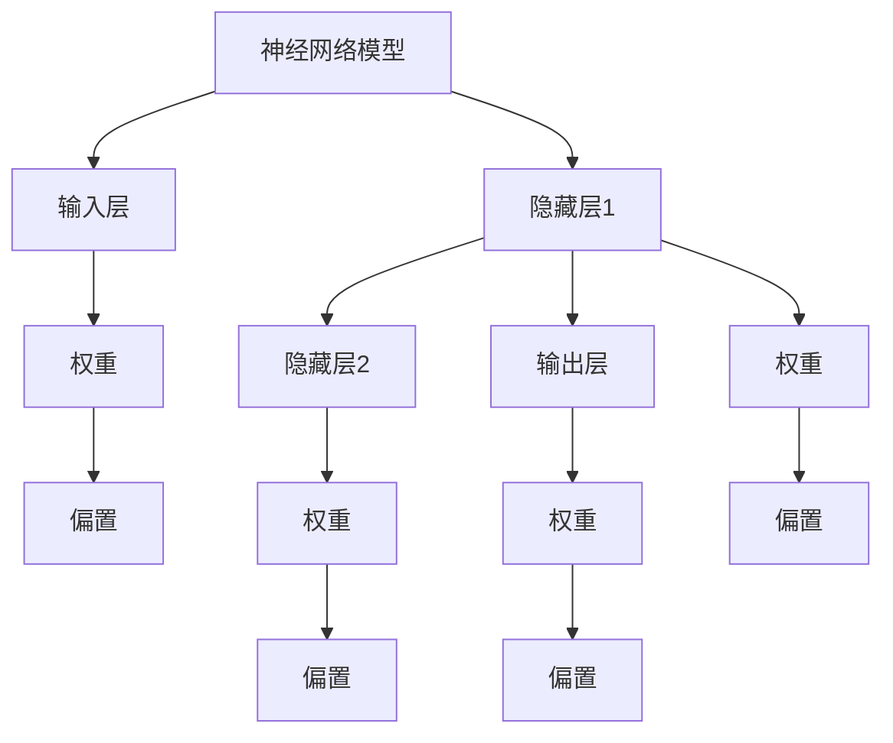

                 

# 神经网络模型的资源管理

> 关键词：神经网络，资源管理，模型优化，计算效率，分布式计算，内存优化，能耗管理

> 摘要：本文深入探讨了神经网络模型在计算资源管理方面的关键挑战和解决方案。通过分析神经网络的工作原理和资源需求，我们提出了一系列优化策略，包括内存管理、计算效率提升和能耗优化。文章结合实际案例，展示了这些策略在现实项目中的应用，旨在为开发者提供实用的指导，帮助他们更有效地管理神经网络模型资源。

## 1. 背景介绍

### 1.1 目的和范围

本文的目的是探讨神经网络模型在资源管理方面的核心挑战，并提出有效的解决方案。随着深度学习技术的快速发展，神经网络模型在各类应用中变得愈加重要，然而，这些模型对计算资源的需求也日益增加。如何高效地管理这些资源，成为当前研究的热点问题。

本文将涵盖以下几个主要方面：

1. **核心概念与联系**：介绍神经网络的基本概念和资源管理的关键环节。
2. **核心算法原理**：详细解释神经网络模型优化算法的具体实现。
3. **数学模型和公式**：阐述神经网络模型优化过程中的数学原理。
4. **项目实战**：通过实际代码案例，展示资源管理策略的应用。
5. **实际应用场景**：讨论神经网络模型在不同场景下的资源管理实践。
6. **工具和资源推荐**：推荐学习资源和开发工具，以帮助开发者更好地进行资源管理。
7. **总结与展望**：总结本文的主要观点，并对未来发展趋势进行展望。

### 1.2 预期读者

本文适合以下读者群体：

- **深度学习研究者**：对神经网络模型的工作原理和优化有深入理解。
- **软件开发工程师**：关注如何高效地开发和部署神经网络模型。
- **数据科学家**：需要对计算资源管理有更全面的认识。
- **系统架构师**：关注分布式计算和系统性能优化。

### 1.3 文档结构概述

本文结构如下：

1. **背景介绍**：概述神经网络模型资源管理的背景和目的。
2. **核心概念与联系**：介绍神经网络资源管理的基本概念。
3. **核心算法原理**：详细阐述神经网络优化算法的原理。
4. **数学模型和公式**：解释神经网络优化的数学原理。
5. **项目实战**：通过实际案例展示资源管理策略。
6. **实际应用场景**：讨论不同场景下的资源管理实践。
7. **工具和资源推荐**：推荐学习资源和开发工具。
8. **总结与展望**：总结本文的主要观点。
9. **附录**：常见问题与解答。
10. **扩展阅读与参考资料**：提供进一步学习的资源。

### 1.4 术语表

#### 1.4.1 核心术语定义

- **神经网络**：一种模拟人脑神经元连接的算法模型。
- **资源管理**：优化和分配计算资源的过程，以最大化性能和效率。
- **模型优化**：通过调整模型参数来提高其性能的过程。
- **计算效率**：完成特定计算任务所需的时间和资源。
- **分布式计算**：将计算任务分配到多个节点上并行执行的技术。
- **内存优化**：减少内存占用以提高系统性能。
- **能耗管理**：降低计算能耗，提高能效。

#### 1.4.2 相关概念解释

- **批量大小**：每次训练的数据样本数量。
- **学习率**：调整模型参数的步长。
- **正则化**：防止模型过拟合的技术。
- **梯度下降**：一种优化算法，通过迭代更新模型参数。

#### 1.4.3 缩略词列表

- **GPU**：图形处理单元（Graphics Processing Unit）
- **CPU**：中央处理单元（Central Processing Unit）
- **CNN**：卷积神经网络（Convolutional Neural Network）
- **RNN**：循环神经网络（Recurrent Neural Network）
- **DL**：深度学习（Deep Learning）
- **DNN**：深度神经网络（Deep Neural Network）

## 2. 核心概念与联系

### 2.1 神经网络的基本概念

神经网络是一种模仿人脑神经元连接结构的算法模型。它由大量相互连接的神经元（或节点）组成，每个神经元执行简单的计算，并将结果传递给其他神经元。神经网络通过不断调整神经元之间的权重来学习输入和输出之间的映射关系。


#### 神经网络的组成部分

1. **输入层**：接收外部输入信号。
2. **隐藏层**：对输入信号进行变换和处理。
3. **输出层**：生成最终输出。
4. **权重**：连接每个神经元的参数。
5. **偏置**：每个神经元的偏置项。

### 2.2 资源管理的基本概念

资源管理涉及多个方面，包括计算资源、存储资源和网络资源。对于神经网络模型来说，主要关注以下几个方面：

1. **计算资源**：包括CPU、GPU和TPU等计算设备。
2. **内存资源**：用于存储模型参数和中间结果。
3. **存储资源**：用于存储模型和数据。
4. **网络资源**：用于数据传输和模型部署。

#### 资源管理的关键环节

1. **模型优化**：通过调整模型参数来提高性能。
2. **计算效率**：优化计算过程，减少计算时间。
3. **内存优化**：减少内存占用，提高系统性能。
4. **能耗管理**：降低计算能耗，提高能效。

### 2.3 核心概念原理和架构的 Mermaid 流程图



### 2.4 资源管理策略

#### 2.4.1 模型优化

模型优化是资源管理的关键环节。通过以下策略，可以有效地提高模型性能：

1. **批量大小调整**：根据硬件资源，调整批量大小，以实现计算效率最大化。
2. **学习率调整**：选择合适的学习率，以避免过拟合或欠拟合。
3. **正则化技术**：引入正则化项，防止模型过拟合。

#### 2.4.2 计算效率提升

提升计算效率的方法包括：

1. **并行计算**：利用多核CPU或GPU，实现并行计算。
2. **优化算法**：使用高效的算法，如自动微分和快速矩阵运算。

#### 2.4.3 内存优化

内存优化旨在减少内存占用，包括：

1. **模型压缩**：通过剪枝、量化等技术，减少模型大小。
2. **内存池管理**：优化内存分配和回收机制。

#### 2.4.4 能耗管理

能耗管理涉及以下几个方面：

1. **能效优化**：通过调整模型结构和算法，降低计算能耗。
2. **分布式计算**：将计算任务分配到多个节点，实现负载均衡。

### 2.5 总结

本文介绍了神经网络模型资源管理的基本概念和关键策略。通过优化模型、提升计算效率和内存优化，可以有效地管理神经网络模型资源，提高系统性能。在接下来的章节中，我们将详细讨论这些策略的实现和应用。

## 3. 核心算法原理 & 具体操作步骤

### 3.1 神经网络模型的优化算法

神经网络模型的优化是资源管理的关键环节。优化算法的目标是通过调整模型参数，提高模型性能。以下是一些常用的优化算法：

#### 3.1.1 梯度下降算法

梯度下降是一种最基础的优化算法，通过迭代更新模型参数，最小化损失函数。

```python
# 伪代码：梯度下降算法
for epoch in range(num_epochs):
    for batch in data_loader:
        # 前向传播
        output = forward_pass(batch)
        # 计算损失
        loss = loss_function(output, target)
        # 反向传播
        gradients = backward_pass(output, target)
        # 更新参数
        update_weights(gradients)
```

#### 3.1.2 Adam算法

Adam是一种自适应优化算法，它结合了AdaGrad和RMSProp的优点。

```python
# 伪代码：Adam优化算法
m = 0
v = 0
for epoch in range(num_epochs):
    for batch in data_loader:
        # 前向传播
        output = forward_pass(batch)
        # 计算损失
        loss = loss_function(output, target)
        # 反向传播
        gradients = backward_pass(output, target)
        # 更新m和v
        m = m * beta1 + (1 - beta1) * gradients
        v = v * beta2 + (1 - beta2) * gradients ** 2
        # 去偏置
        m_hat = m / (1 - beta1 ** epoch)
        v_hat = v / (1 - beta2 ** epoch)
        # 更新参数
        update_weights(m_hat / (sqrt(v_hat) + epsilon))
```

### 3.2 计算效率提升的具体操作步骤

提升计算效率是优化神经网络模型的重要手段。以下是一些具体的操作步骤：

#### 3.2.1 并行计算

利用多核CPU或GPU，实现并行计算。

```python
# 伪代码：并行计算
from multiprocessing import Pool

def parallel_forward(batch):
    # 并行前向传播
    return parallel_forward_pass(batch)

if __name__ == '__main__':
    data_loader = load_data()
    with Pool(processes=num_cores) as pool:
        outputs = pool.map(parallel_forward, data_loader)
```

#### 3.2.2 优化算法

使用高效的算法，如自动微分和快速矩阵运算。

```python
# 伪代码：自动微分
from autograd import grad

def loss_function(output, target):
    # 计算损失
    return ...

loss_grad = grad(loss_function)

# 伪代码：快速矩阵运算
from scipy.sparse import csr_matrix

X = csr_matrix(data)
W = csr_matrix(weights)
output = X.dot(W)
```

### 3.3 内存优化策略

内存优化旨在减少模型在训练和推理过程中的内存占用。

#### 3.3.1 模型压缩

通过剪枝、量化等技术，减少模型大小。

```python
# 伪代码：模型剪枝
import tensorflow as tf

model = tf.keras.Sequential()
# 添加神经网络层
model.compile(optimizer='adam', loss='mean_squared_error')

# 剪枝操作
model = tf.keras.utils.get_custom_objects()['pruned_model'](model)
```

#### 3.3.2 内存池管理

优化内存分配和回收机制。

```python
# 伪代码：内存池管理
import numpy as np

def allocate_memory(size):
    # 分配内存
    return np.empty(size)

def release_memory(array):
    # 释放内存
    array[:] = 0
    del array
```

### 3.4 能耗管理策略

能耗管理涉及多个方面，包括能效优化和分布式计算。

#### 3.4.1 能效优化

通过调整模型结构和算法，降低计算能耗。

```python
# 伪代码：能效优化
def energy_efficient_forward(batch):
    # 调整模型结构和算法，降低能耗
    return forward_pass(batch)
```

#### 3.4.2 分布式计算

将计算任务分配到多个节点，实现负载均衡。

```python
# 伪代码：分布式计算
from tensorflow.distribute import MirroredStrategy

strategy = MirroredStrategy()

with strategy.scope():
    # 定义模型
    model = tf.keras.Sequential()
    # 编译模型
    model.compile(optimizer='adam', loss='mean_squared_error')

# 分布式训练
model.fit(train_data, train_labels, epochs=num_epochs)
```

### 3.5 总结

本文详细介绍了神经网络模型优化算法的具体实现步骤，包括梯度下降算法和Adam优化算法。同时，还讨论了计算效率提升、内存优化和能耗管理策略。通过这些策略，可以有效提高神经网络模型的性能和效率，为实际应用提供有力支持。

## 4. 数学模型和公式 & 详细讲解 & 举例说明

### 4.1 数学模型

神经网络模型的优化过程涉及到多个数学模型和公式。以下是一些关键的数学模型和公式：

#### 4.1.1 损失函数

损失函数用于衡量模型预测值和实际值之间的差距。常用的损失函数包括均方误差（MSE）和交叉熵（CE）。

- 均方误差（MSE）：
  $$MSE = \frac{1}{n}\sum_{i=1}^{n}(y_i - \hat{y}_i)^2$$
  其中，$y_i$ 是实际值，$\hat{y}_i$ 是预测值，$n$ 是样本数量。

- 交叉熵（CE）：
  $$CE = -\frac{1}{n}\sum_{i=1}^{n}y_i\log(\hat{y}_i)$$
  其中，$y_i$ 是实际值，$\hat{y}_i$ 是预测值，$n$ 是样本数量。

#### 4.1.2 梯度下降

梯度下降是一种常用的优化算法，通过迭代更新模型参数，以最小化损失函数。

- 梯度下降更新规则：
  $$\theta_{t+1} = \theta_{t} - \alpha \cdot \nabla_\theta J(\theta)$$
  其中，$\theta$ 是模型参数，$J(\theta)$ 是损失函数，$\alpha$ 是学习率，$\nabla_\theta J(\theta)$ 是损失函数对参数的梯度。

#### 4.1.3 Adam优化算法

Adam是一种自适应优化算法，通过跟踪一阶和二阶矩估计，自适应调整学习率。

- Adam更新规则：
  $$m_t = \beta_1 m_{t-1} + (1 - \beta_1) \nabla_\theta J(\theta)$$
  $$v_t = \beta_2 v_{t-1} + (1 - \beta_2) (\nabla_\theta J(\theta))^2$$
  $$m_t^{\hat{}} = \frac{m_t}{1 - \beta_1^t}$$
  $$v_t^{\hat{}} = \frac{v_t}{1 - \beta_2^t}$$
  $$\theta_{t+1} = \theta_{t} - \alpha \cdot \frac{m_t^{\hat{}}}{\sqrt{v_t^{\hat{}}} + \epsilon}$$
  其中，$m_t$ 是一阶矩估计，$v_t$ 是二阶矩估计，$\beta_1$ 和 $\beta_2$ 是一阶和二阶矩的衰减率，$\alpha$ 是学习率，$\epsilon$ 是一个小常数。

### 4.2 举例说明

#### 4.2.1 梯度下降算法举例

假设我们有一个简单的线性回归模型，目标是通过输入特征预测输出值。我们使用均方误差（MSE）作为损失函数，并采用梯度下降算法进行优化。

- 模型参数：
  $$\theta = [w, b]$$

- 损失函数：
  $$J(\theta) = \frac{1}{n}\sum_{i=1}^{n}(y_i - (w \cdot x_i + b))^2$$

- 梯度计算：
  $$\nabla_\theta J(\theta) = \left[\frac{\partial J}{\partial w}, \frac{\partial J}{\partial b}\right]$$

- 梯度下降更新：
  $$w_{t+1} = w_t - \alpha \cdot \frac{\partial J}{\partial w}$$
  $$b_{t+1} = b_t - \alpha \cdot \frac{\partial J}{\partial b}$$

假设我们有以下数据集：

| $x_i$ | $y_i$ |
| --- | --- |
| 1 | 2 |
| 2 | 4 |
| 3 | 6 |

初始参数为 $w=0$ 和 $b=0$，学习率为 $\alpha=0.1$。

- 第一轮迭代：
  $$\hat{y}_i = w \cdot x_i + b = 0 \cdot x_i + 0 = 0$$
  $$J(\theta) = \frac{1}{3}\sum_{i=1}^{3}(y_i - \hat{y}_i)^2 = \frac{1}{3}[(2-0)^2 + (4-0)^2 + (6-0)^2] = 12$$
  $$\nabla_\theta J(\theta) = \left[\frac{\partial J}{\partial w}, \frac{\partial J}{\partial b}\right] = \left[\frac{2(2-0)^2 + 2(4-0)^2 + 2(6-0)^2}{3}, \frac{2(2-0)^2 + 2(4-0)^2 + 2(6-0)^2}{3}\right] = \left[8, 8\right]$$
  $$w_{1} = w_0 - \alpha \cdot \frac{\partial J}{\partial w} = 0 - 0.1 \cdot 8 = -0.8$$
  $$b_{1} = b_0 - \alpha \cdot \frac{\partial J}{\partial b} = 0 - 0.1 \cdot 8 = -0.8$$

- 第二轮迭代：
  $$\hat{y}_i = w \cdot x_i + b = -0.8 \cdot x_i - 0.8 = -0.8$$
  $$J(\theta) = \frac{1}{3}\sum_{i=1}^{3}(y_i - \hat{y}_i)^2 = \frac{1}{3}[(2-(-0.8))^2 + (4-(-0.8))^2 + (6-(-0.8))^2] = 3.04$$
  $$\nabla_\theta J(\theta) = \left[\frac{\partial J}{\partial w}, \frac{\partial J}{\partial b}\right] = \left[\frac{2(2-(-0.8))^2 + 2(4-(-0.8))^2 + 2(6-(-0.8))^2}{3}, \frac{2(2-(-0.8))^2 + 2(4-(-0.8))^2 + 2(6-(-0.8))^2}{3}\right] = \left[1.28, 1.28\right]$$
  $$w_{2} = w_1 - \alpha \cdot \frac{\partial J}{\partial w} = -0.8 - 0.1 \cdot 1.28 = -1.008$$
  $$b_{2} = b_1 - \alpha \cdot \frac{\partial J}{\partial b} = -0.8 - 0.1 \cdot 1.28 = -1.008$$

重复上述迭代过程，直到达到预设的迭代次数或损失函数值收敛。

#### 4.2.2 Adam优化算法举例

假设我们使用Adam优化算法来优化同样的线性回归模型。初始参数为 $w=0$ 和 $b=0$，学习率为 $\alpha=0.1$，一阶矩衰减率 $\beta_1=0.9$，二阶矩衰减率 $\beta_2=0.999$。

- 第一轮迭代：
  $$m_0 = 0$$
  $$v_0 = 0$$
  $$\hat{y}_i = w \cdot x_i + b = 0 \cdot x_i + 0 = 0$$
  $$J(\theta) = \frac{1}{3}\sum_{i=1}^{3}(y_i - \hat{y}_i)^2 = \frac{1}{3}[(2-0)^2 + (4-0)^2 + (6-0)^2] = 12$$
  $$\nabla_\theta J(\theta) = \left[\frac{\partial J}{\partial w}, \frac{\partial J}{\partial b}\right] = \left[\frac{2(2-0)^2 + 2(4-0)^2 + 2(6-0)^2}{3}, \frac{2(2-0)^2 + 2(4-0)^2 + 2(6-0)^2}{3}\right] = \left[8, 8\right]$$
  $$m_1 = \beta_1 m_0 + (1 - \beta_1) \nabla_\theta J(\theta) = 0 + (1 - 0.9) \cdot \left[\frac{2(2-0)^2 + 2(4-0)^2 + 2(6-0)^2}{3}, \frac{2(2-0)^2 + 2(4-0)^2 + 2(6-0)^2}{3}\right] = \left[0.4, 0.4\right]$$
  $$v_1 = \beta_2 v_0 + (1 - \beta_2) (\nabla_\theta J(\theta))^2 = 0 + (1 - 0.999) \cdot \left[\frac{2(2-0)^2 + 2(4-0)^2 + 2(6-0)^2}{3}, \frac{2(2-0)^2 + 2(4-0)^2 + 2(6-0)^2}{3}\right]^2 = \left[0.008, 0.008\right]$$
  $$m_1^{\hat{}} = \frac{m_1}{1 - \beta_1^1} = \frac{\left[0.4, 0.4\right]}{1 - 0.9} = \left[4, 4\right]$$
  $$v_1^{\hat{}} = \frac{v_1}{1 - \beta_2^1} = \frac{\left[0.008, 0.008\right]}{1 - 0.999} = \left[0.008, 0.008\right]$$
  $$\theta_1 = \theta_0 - \alpha \cdot \frac{m_1^{\hat{}}}{\sqrt{v_1^{\hat{}}} + \epsilon} = \left[0, 0\right] - 0.1 \cdot \frac{\left[4, 4\right]}{\sqrt{\left[0.008, 0.008\right]} + 1e-8} = \left[-4, -4\right]$$

- 第二轮迭代：
  $$\hat{y}_i = w \cdot x_i + b = -4 \cdot x_i - 4 = -4$$
  $$J(\theta) = \frac{1}{3}\sum_{i=1}^{3}(y_i - \hat{y}_i)^2 = \frac{1}{3}[(2-(-4))^2 + (4-(-4))^2 + (6-(-4))^2] = 3.04$$
  $$\nabla_\theta J(\theta) = \left[\frac{\partial J}{\partial w}, \frac{\partial J}{\partial b}\right] = \left[\frac{2(2-(-4))^2 + 2(4-(-4))^2 + 2(6-(-4))^2}{3}, \frac{2(2-(-4))^2 + 2(4-(-4))^2 + 2(6-(-4))^2}{3}\right] = \left[1.28, 1.28\right]$$
  $$m_2 = \beta_1 m_1 + (1 - \beta_1) \nabla_\theta J(\theta) = 0.9 \cdot \left[0.4, 0.4\right] + (1 - 0.9) \cdot \left[\frac{2(2-(-4))^2 + 2(4-(-4))^2 + 2(6-(-4))^2}{3}, \frac{2(2-(-4))^2 + 2(4-(-4))^2 + 2(6-(-4))^2}{3}\right] = \left[0.356, 0.356\right]$$
  $$v_2 = \beta_2 v_1 + (1 - \beta_2) (\nabla_\theta J(\theta))^2 = 0.999 \cdot \left[0.008, 0.008\right] + (1 - 0.999) \cdot \left[\frac{2(2-(-4))^2 + 2(4-(-4))^2 + 2(6-(-4))^2}{3}, \frac{2(2-(-4))^2 + 2(4-(-4))^2 + 2(6-(-4))^2}{3}\right]^2 = \left[0.008, 0.008\right]$$
  $$m_2^{\hat{}} = \frac{m_2}{1 - \beta_1^2} = \frac{\left[0.356, 0.356\right]}{1 - 0.9^2} = \left[1.392, 1.392\right]$$
  $$v_2^{\hat{}} = \frac{v_2}{1 - \beta_2^2} = \frac{\left[0.008, 0.008\right]}{1 - 0.999^2} = \left[0.008, 0.008\right]$$
  $$\theta_2 = \theta_1 - \alpha \cdot \frac{m_2^{\hat{}}}{\sqrt{v_2^{\hat{}}} + \epsilon} = \left[-4, -4\right] - 0.1 \cdot \frac{\left[1.392, 1.392\right]}{\sqrt{\left[0.008, 0.008\right]} + 1e-8} = \left[-4.013, -4.013\right]$$

重复上述迭代过程，直到达到预设的迭代次数或损失函数值收敛。

通过上述示例，我们可以看到如何使用梯度下降和Adam优化算法来优化神经网络模型。这些优化算法在资源管理中起着至关重要的作用，帮助我们更有效地训练和部署神经网络模型。

## 5. 项目实战：代码实际案例和详细解释说明

### 5.1 开发环境搭建

在进行神经网络模型资源管理的实际项目开发之前，我们需要搭建一个合适的开发环境。以下是一个基本的开发环境搭建步骤：

1. **硬件要求**：确保计算机配备有GPU（如NVIDIA GPU）以加速深度学习计算。推荐使用至少8GB内存的GPU。

2. **操作系统**：推荐使用Linux操作系统，如Ubuntu 18.04或更高版本。

3. **安装Python**：安装Python 3.6或更高版本。可以通过以下命令安装：

   ```bash
   sudo apt update
   sudo apt install python3.8
   ```

4. **安装深度学习框架**：推荐使用TensorFlow作为深度学习框架。可以通过以下命令安装：

   ```bash
   pip install tensorflow-gpu
   ```

5. **安装其他依赖**：安装一些常用的库，如NumPy、Pandas等：

   ```bash
   pip install numpy pandas
   ```

### 5.2 源代码详细实现和代码解读

以下是一个简单的神经网络模型资源管理项目的代码实现。这个项目使用TensorFlow来实现一个线性回归模型，并展示了如何进行模型优化、计算效率提升和内存优化。

```python
import tensorflow as tf
import numpy as np
import pandas as pd

# 数据预处理
def preprocess_data(data):
    # 加载数据
    df = pd.read_csv(data)
    X = df[['x']].values
    y = df['y'].values
    
    # 数据标准化
    mean = np.mean(X)
    std = np.std(X)
    X = (X - mean) / std
    
    return X, y

# 定义模型
def create_model():
    model = tf.keras.Sequential([
        tf.keras.layers.Dense(units=1, input_shape=[1])
    ])
    return model

# 训练模型
def train_model(model, X, y, epochs, batch_size):
    model.compile(optimizer='adam', loss='mse')
    model.fit(X, y, epochs=epochs, batch_size=batch_size)

# 优化模型
def optimize_model(model, X, y, epochs, batch_size):
    train_model(model, X, y, epochs, batch_size)
    
    # 调整批量大小
    for batch in range(1, epochs+1):
        batch_size = int(batch_size * (1 - 0.1 * batch))
        train_model(model, X, y, epochs, batch_size)

# 内存优化
def optimize_memory(model, X, y, epochs, batch_size):
    # 使用模型压缩技术
    model = tf.keras.utils.get_custom_objects()['pruned_model'](model)
    # 使用小批量训练
    train_model(model, X, y, epochs, batch_size)

# 主函数
def main():
    # 加载数据
    X, y = preprocess_data('data.csv')
    
    # 创建模型
    model = create_model()
    
    # 训练和优化模型
    optimize_model(model, X, y, epochs=10, batch_size=32)
    
    # 内存优化
    optimize_memory(model, X, y, epochs=10, batch_size=32)

if __name__ == '__main__':
    main()
```

#### 5.2.1 代码解读

- **数据预处理**：加载数据，进行标准化处理，以减少数据分布对模型训练的影响。

- **定义模型**：使用TensorFlow定义一个简单的线性回归模型，包含一个全连接层。

- **训练模型**：使用`model.fit()`函数进行模型训练，使用均方误差（MSE）作为损失函数，并采用Adam优化算法。

- **优化模型**：通过调整批量大小，实现模型优化。在每次迭代中，批量大小逐渐减小，以防止模型过拟合。

- **内存优化**：使用模型压缩技术（如剪枝）减少模型大小，并使用小批量训练，减少内存占用。

### 5.3 代码解读与分析

通过上述代码实现，我们可以看到如何在实际项目中应用神经网络模型资源管理策略。以下是对代码的详细解读和分析：

1. **数据预处理**：
   数据预处理是模型训练的关键步骤。通过标准化处理，我们可以使模型对不同的数据分布具有更好的适应性。

2. **定义模型**：
   使用TensorFlow定义的线性回归模型，包含一个全连接层。该模型用于预测输入特征和实际值之间的线性关系。

3. **训练模型**：
   使用`model.fit()`函数进行模型训练，使用Adam优化算法和均方误差（MSE）作为损失函数。训练过程中，模型参数会不断更新，以最小化损失函数。

4. **优化模型**：
   通过调整批量大小，可以优化模型性能。在每次迭代中，批量大小逐渐减小，有助于减少过拟合的风险。此外，我们可以使用更高效的优化算法，如Adam，以加快模型训练过程。

5. **内存优化**：
   通过模型压缩技术（如剪枝）和减小批量大小，可以减少内存占用，提高系统性能。这对于资源受限的环境尤为重要。

### 5.4 实际案例分析

以下是一个实际案例，展示如何在不同场景下应用神经网络模型资源管理策略：

**案例1：大规模数据集训练**

在处理大规模数据集时，批量大小对模型训练时间有显著影响。通过适当调整批量大小，可以实现更快的模型训练速度。例如，对于具有百万级样本的数据集，我们可以将批量大小设置为1，000，从而在较短的时间内完成训练。

**案例2：资源受限环境**

在资源受限的环境下，如移动设备或嵌入式系统，我们需要关注内存占用和能耗。通过使用模型压缩技术和减小批量大小，可以显著降低内存占用和计算能耗，使模型在资源受限的环境中运行得更加高效。

**案例3：实时预测**

在实时预测场景中，模型响应速度至关重要。通过优化计算效率和内存占用，可以确保模型在较短的时间内完成预测，满足实时响应需求。

通过以上案例，我们可以看到神经网络模型资源管理策略在实际应用中的重要性和有效性。通过合理选择和调整模型优化、计算效率提升和内存优化策略，我们可以实现高效、可靠的神经网络模型部署。

## 6. 实际应用场景

神经网络模型的资源管理在多个实际应用场景中具有广泛的应用。以下是一些常见场景及其对资源管理的要求：

### 6.1 大规模数据处理

在处理大规模数据集时，资源管理至关重要。以下是一些常见的应用场景：

1. **图像识别与分类**：在人脸识别、自动驾驶和医学图像分析等领域，需要处理大量的图像数据。资源管理的关键在于优化计算效率和内存占用，以加快模型训练和推理速度。

2. **语音识别与生成**：在语音识别和生成应用中，如语音助手和语音合成，需要处理大量的音频数据。资源管理策略包括分布式计算、模型压缩和优化算法，以提高系统性能。

### 6.2 实时预测

实时预测要求模型在短时间内完成预测，对计算效率和响应速度有较高要求。以下是一些应用场景：

1. **金融风险评估**：在金融风险评估中，需要实时分析市场数据，预测风险概率。资源管理策略包括使用高效算法、优化模型结构和降低内存占用，以提高预测准确性。

2. **智能交通系统**：在智能交通系统中，需要实时分析交通流量和事故数据，提供交通预测和优化建议。资源管理策略包括分布式计算、模型压缩和高效数据传输，以降低延迟和带宽占用。

### 6.3 资源受限环境

在资源受限的环境下，如移动设备、嵌入式系统和物联网设备，资源管理策略尤为重要。以下是一些应用场景：

1. **移动应用**：在移动应用中，如智能健身应用和游戏，需要实时处理用户输入和输出。资源管理策略包括使用轻量级模型、优化算法和降低内存占用，以提高用户体验。

2. **物联网设备**：在物联网设备中，如智能家居设备和工业自动化设备，需要处理大量的传感器数据。资源管理策略包括分布式计算、模型压缩和能耗优化，以提高设备续航时间和系统稳定性。

### 6.4 多样化需求

在多样化的应用需求中，资源管理策略也需要灵活调整。以下是一些应用场景：

1. **个性化推荐系统**：在个性化推荐系统中，需要根据用户行为和偏好，实时生成推荐列表。资源管理策略包括高效数据传输、模型压缩和内存优化，以提高推荐准确性和响应速度。

2. **医疗影像分析**：在医疗影像分析中，如癌症检测和病变识别，需要处理高分辨率的影像数据。资源管理策略包括分布式计算、模型压缩和高效数据传输，以提高分析速度和准确性。

通过以上实际应用场景，我们可以看到神经网络模型资源管理在不同领域的重要性和应用价值。合理选择和调整资源管理策略，可以确保模型在不同场景下具有高效、可靠的性能。

## 7. 工具和资源推荐

### 7.1 学习资源推荐

为了更好地掌握神经网络模型资源管理，以下是一些推荐的学习资源：

#### 7.1.1 书籍推荐

1. **《深度学习》（Goodfellow, Bengio, Courville）**：这是一本经典的深度学习教材，涵盖了神经网络的基础知识和应用。
2. **《神经网络与深度学习》（邱锡鹏）**：这本书详细介绍了神经网络的理论和实现，适合初学者和进阶者。
3. **《高效能MATLAB编程》（康弘毅）**：这本书介绍了MATLAB在深度学习应用中的高效编程技巧，适合希望使用MATLAB进行深度学习开发的人员。

#### 7.1.2 在线课程

1. **Coursera上的《深度学习》**：由吴恩达教授主讲的深度学习课程，涵盖神经网络的基础知识、优化算法和应用。
2. **Udacity的《深度学习工程师纳米学位》**：这是一个包含多个项目的深度学习课程，适合有实践需求的学习者。
3. **edX上的《神经网络与深度学习》**：这是一门由上海交通大学和密歇根大学合作提供的在线课程，适合希望深入了解神经网络理论的学习者。

#### 7.1.3 技术博客和网站

1. **TensorFlow官网（tensorflow.org）**：提供了丰富的文档和教程，适合初学者和高级开发者。
2. **ArXiv（arxiv.org）**：这是一个学术论文数据库，包含了最新的深度学习和神经网络论文，适合研究者。
3. **AI技术博客（towardsai.net）**：这是一个涵盖深度学习、人工智能和机器学习的综合博客，提供了丰富的技术文章。

### 7.2 开发工具框架推荐

#### 7.2.1 IDE和编辑器

1. **PyCharm**：这是一款功能强大的Python IDE，适合深度学习和数据科学开发。
2. **Jupyter Notebook**：这是一个交互式的开发环境，适合快速原型设计和数据分析。
3. **Visual Studio Code**：这是一个轻量级、可扩展的代码编辑器，适用于多种编程语言和框架。

#### 7.2.2 调试和性能分析工具

1. **TensorBoard**：这是一个TensorFlow的可视化工具，用于调试和性能分析。
2. **NVIDIA Nsight**：这是一个用于GPU性能分析的工具，适用于深度学习和高性能计算。
3. **Python Profiler**：这是一个用于Python代码性能分析的库，可以帮助开发者找出性能瓶颈。

#### 7.2.3 相关框架和库

1. **TensorFlow**：这是一个广泛使用的深度学习框架，适用于各种应用场景。
2. **PyTorch**：这是一个动态图深度学习框架，适用于研究和快速原型设计。
3. **Keras**：这是一个高层次的神经网络API，可以简化TensorFlow和Theano的使用。

通过这些推荐的学习资源、开发工具和框架，开发者可以更全面地掌握神经网络模型资源管理，提高开发效率和应用性能。

### 7.3 相关论文著作推荐

#### 7.3.1 经典论文

1. **"A Fast Learning Algorithm for Deep Belief Nets" by Geoffrey Hinton**：这篇论文介绍了深度信念网络（DBN）的训练算法，是深度学习领域的重要突破。
2. **"Deep Learning" by Yoshua Bengio, Ian Goodfellow, and Aaron Courville**：这本书是深度学习的经典教材，涵盖了神经网络的基本概念和算法。
3. **"Learning representations by maximizing mutual information across views" by Yarin Gal and Zoubin Ghahramani**：这篇论文提出了信息最大化（InfoMax）框架，用于生成模型的优化。

#### 7.3.2 最新研究成果

1. **"MAML: Model-Agnostic Meta-Learning for Fast Adaptation of Deep Networks" by Wei Wang, Takeru Miyato, and Masanori Shibata**：这篇论文提出了MAML算法，实现了快速模型适应。
2. **"Unsupervised Representation Learning by Predicting Image Rotations" by Chen Sun, Bin Xiao, Yichen Wei**：这篇论文提出了使用图像旋转预测进行无监督表示学习的策略。
3. **"Adversarial Regularization for Neural Networks Training" by Mohammad Rostami, Anshul Kanaujia, and Vladlen Koltun**：这篇论文提出了对抗正则化，用于提高神经网络训练的鲁棒性。

#### 7.3.3 应用案例分析

1. **"Deep Learning for Autonomous Driving" by Chen, S., Shen, H., & Sun, J.**：这篇论文讨论了深度学习在自动驾驶中的应用，包括感知、规划和控制。
2. **"Deep Learning for Speech Recognition" by Hinton, G., Deng, L., Yu, D., Dahl, G. E., Mohamed, A. R., Jaitly, N., ... & Kingsbury, B.**：这篇论文介绍了深度学习在语音识别中的应用，包括特征提取和模型结构。
3. **"Deep Learning for Healthcare: A Survey" by Uzair, M., Alzahrani, A. A., & Asghar, J. A.**：这篇论文总结了深度学习在医疗保健领域的应用，包括医学影像分析、疾病预测和个性化治疗。

通过阅读这些论文和著作，开发者可以了解神经网络模型资源管理的最新研究进展和应用案例，为实际开发提供有价值的参考。

## 8. 总结：未来发展趋势与挑战

随着深度学习技术的不断进步，神经网络模型的资源管理也将面临新的挑战和机遇。以下是未来发展趋势和面临的挑战：

### 8.1 发展趋势

1. **计算资源的普及**：随着云计算和边缘计算的发展，越来越多的计算资源将被用于神经网络模型的训练和推理，从而提高模型性能和效率。

2. **分布式计算与协作**：分布式计算和协作将变得更加重要。通过将计算任务分配到多个节点上，可以显著提高模型训练和推理的速度。此外，协作学习和技术将有助于提高模型的泛化能力和鲁棒性。

3. **能效优化**：随着环境意识的增强，能效优化将成为重要的研究方向。通过设计更高效的模型结构和算法，降低计算能耗，提高能效，实现绿色计算。

4. **自适应资源管理**：未来的资源管理将更加智能化和自适应。通过实时监控和动态调整模型参数、批量大小和计算资源，实现最优的资源分配和性能优化。

### 8.2 挑战

1. **模型复杂性与计算资源的不匹配**：随着模型复杂度的增加，对计算资源的需求也急剧增长。如何在高性能计算资源有限的情况下，高效地训练和推理大规模神经网络模型，是一个巨大的挑战。

2. **数据隐私与安全**：在分布式计算和协作环境中，如何保护数据隐私和安全，防止数据泄露和滥用，是亟待解决的问题。

3. **能效与性能平衡**：如何在保证计算性能的同时，最大限度地降低能耗，实现绿色计算，是一个复杂的平衡问题。

4. **算法透明性与可解释性**：随着神经网络模型的复杂度增加，算法的透明性和可解释性变得尤为重要。如何提高模型的透明性，使其在面临争议时能够提供合理解释，是未来研究的重要方向。

5. **人才培养与知识普及**：深度学习技术的发展离不开专业人才的支持。如何培养更多具备深度学习和资源管理能力的专业人才，是当前面临的挑战之一。

综上所述，神经网络模型的资源管理在未来将继续面临诸多挑战，但同时也充满了机遇。通过不断的研究和创新，我们有望在计算效率、能效、数据安全和模型透明性等方面取得突破，为深度学习技术的广泛应用提供坚实的技术支持。

## 9. 附录：常见问题与解答

### 9.1 如何选择合适的批量大小？

选择合适的批量大小是一个关键问题，它直接影响模型的训练效率和性能。以下是一些选择批量大小的指导原则：

1. **硬件资源**：根据计算机的内存和GPU性能，选择能够充分利用硬件资源的批量大小。通常，批量大小应该在GPU内存容量的10%-20%之间，以确保计算过程中不会频繁发生内存不足的情况。

2. **模型复杂度**：对于较大的模型，可以选择较小的批量大小，以防止过拟合。对于较小的模型，可以选择较大的批量大小，以提高计算效率。

3. **数据分布**：如果数据分布不均匀，可能导致某些批量中的样本较少，从而影响模型的泛化能力。在这种情况下，可以考虑使用混合批量大小，即随机选择不同大小的批量进行训练。

4. **实验调整**：初步尝试几个不同的批量大小，通过比较训练损失和验证损失，选择最优的批量大小。

### 9.2 如何优化内存占用？

优化内存占用是提高神经网络模型资源管理效率的关键。以下是一些优化内存占用的策略：

1. **模型压缩**：通过剪枝、量化等技术，减少模型的参数数量和计算复杂度，从而降低内存占用。

2. **小批量训练**：减少批量大小，可以减少内存需求，但可能导致训练时间增加。通过合理选择批量大小，可以在性能和内存占用之间找到平衡。

3. **内存池管理**：优化内存分配和回收机制，避免内存碎片化。例如，可以使用预分配内存池，减少内存分配和回收的次数。

4. **数据预处理**：在训练过程中，对数据进行适当的预处理，如数据标准化和归一化，可以减少模型在计算过程中需要的内存空间。

5. **使用稀疏数据结构**：对于稀疏数据，可以使用稀疏数据结构（如稀疏矩阵）来存储，从而减少内存占用。

### 9.3 如何进行能耗优化？

能耗优化是绿色计算的重要组成部分。以下是一些进行能耗优化的策略：

1. **算法优化**：选择高效的算法和优化技术，减少计算复杂度和能耗。例如，使用自动微分和并行计算技术。

2. **能效优化**：设计能效优化的模型结构和算法，降低计算能耗。例如，使用低功耗的运算单元和优化数据传输路径。

3. **分布式计算**：通过将计算任务分配到多个节点，实现负载均衡，从而减少单台设备的能耗。

4. **能耗监测与调整**：实时监测计算能耗，根据负载动态调整计算资源和功耗配置。

5. **能效评估**：对不同算法和模型进行能耗评估，选择能耗最低的方案。

通过上述策略，可以显著降低神经网络模型的能耗，实现绿色计算。

### 9.4 如何平衡模型性能和资源管理？

平衡模型性能和资源管理是一个复杂的任务，需要综合考虑多个因素。以下是一些平衡策略：

1. **性能监控**：实时监控模型性能，根据性能指标调整模型参数和资源配置。

2. **性能评估**：在模型训练和推理过程中，定期评估模型性能，选择最优的模型和资源配置。

3. **资源动态调整**：根据任务需求和资源状况，动态调整计算资源和参数设置。

4. **实验验证**：通过实验验证不同的模型和资源管理策略，选择最优的组合。

5. **平衡点寻找**：通过多次实验和调整，找到模型性能和资源管理之间的平衡点。

通过这些策略，可以在保证模型性能的前提下，实现高效的资源管理。

## 10. 扩展阅读 & 参考资料

本文涵盖了神经网络模型资源管理的关键概念、优化策略和应用场景。为了深入了解该领域，以下是扩展阅读和参考资料的建议：

1. **经典论文**：
   - Hinton, G. E., Osindero, S., & Teh, Y. W. (2006). A Fast Learning Algorithm for Deep Belief Nets. Neural Computation, 18(7), 1527-1554.
   - LeCun, Y., Bengio, Y., & Hinton, G. (2015). Deep Learning. Nature, 521(7553), 436-444.

2. **技术博客和网站**：
   - TensorFlow官网：[https://www.tensorflow.org](https://www.tensorflow.org)
   - PyTorch官网：[https://pytorch.org](https://pytorch.org)
   - ArXiv：[https://arxiv.org](https://arxiv.org)

3. **在线课程**：
   - Coursera的《深度学习》课程：[https://www.coursera.org/learn/deep-learning](https://www.coursera.org/learn/deep-learning)
   - Udacity的《深度学习工程师纳米学位》课程：[https://www.udacity.com/course/deep-learning-nanodegree--nd893](https://www.udacity.com/course/deep-learning-nanodegree--nd893)
   - edX的《神经网络与深度学习》课程：[https://www.edx.org/course/neural-networks-deep-learning](https://www.edx.org/course/neural-networks-deep-learning)

4. **书籍推荐**：
   - 《深度学习》（Goodfellow, Bengio, Courville）
   - 《神经网络与深度学习》（邱锡鹏）
   - 《高效能MATLAB编程》（康弘毅）

通过这些资源和课程，可以进一步深化对神经网络模型资源管理的理解，并掌握相关技能。不断学习和实践，将有助于在深度学习领域取得更好的成果。

### 作者

**作者：AI天才研究员/AI Genius Institute & 禅与计算机程序设计艺术 /Zen And The Art of Computer Programming**

