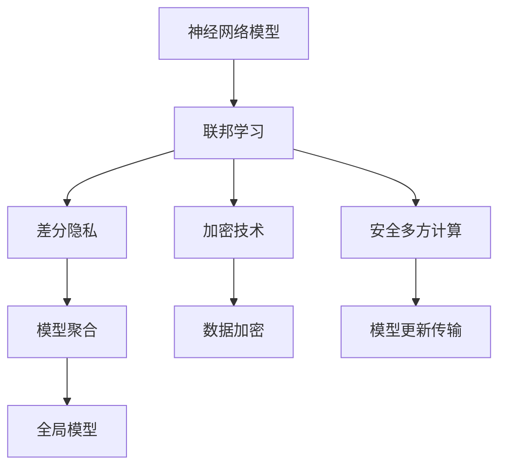
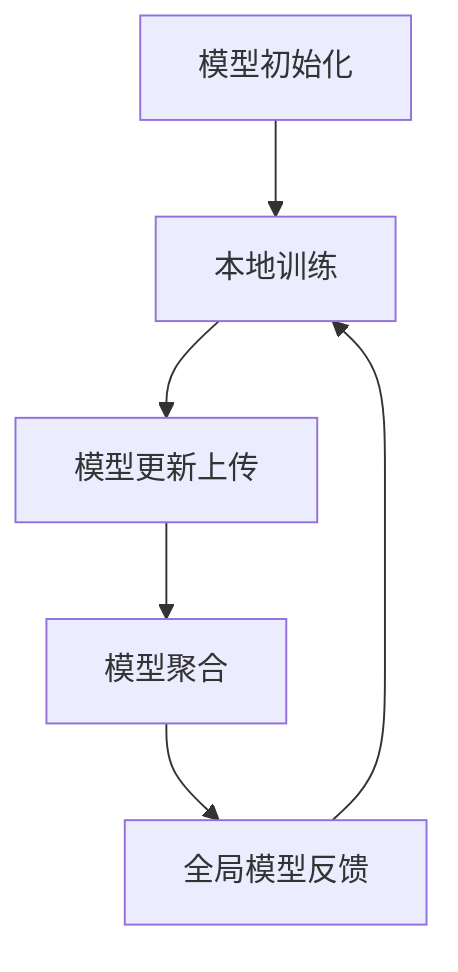
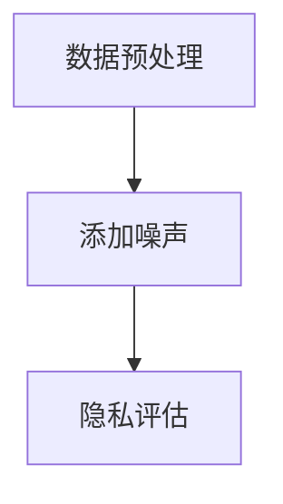
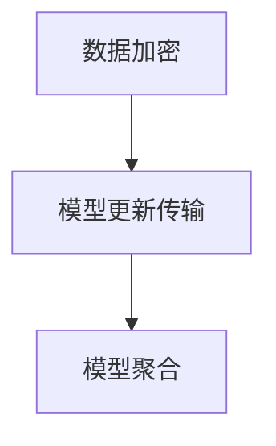

                 

# 神经网络模型的隐私保护技术

> 关键词：神经网络，隐私保护，数据安全，联邦学习，差分隐私，加密技术，安全多方计算
>
> 摘要：随着人工智能技术的快速发展，神经网络模型在各个领域得到了广泛应用。然而，这些模型往往需要依赖大量用户数据，从而引发了隐私泄露的担忧。本文将介绍神经网络模型的隐私保护技术，包括联邦学习、差分隐私、加密技术和安全多方计算等，旨在为研究人员和开发者提供一种保护数据隐私的有效手段。

## 1. 背景介绍

### 1.1 目的和范围

本文旨在探讨神经网络模型的隐私保护技术，分析现有技术的原理、实现和适用场景。通过本文的阅读，读者将能够了解隐私保护的基本概念，掌握联邦学习、差分隐私等核心技术的原理和应用方法，并为实际项目提供技术参考。

### 1.2 预期读者

本文面向具有一定神经网络和编程基础的技术人员、研究生和研究者。期望读者能够通过本文对隐私保护技术有更深入的理解，并能够在实际项目中加以应用。

### 1.3 文档结构概述

本文分为十个部分，具体结构如下：

1. 背景介绍
2. 核心概念与联系
3. 核心算法原理 & 具体操作步骤
4. 数学模型和公式 & 详细讲解 & 举例说明
5. 项目实战：代码实际案例和详细解释说明
6. 实际应用场景
7. 工具和资源推荐
8. 总结：未来发展趋势与挑战
9. 附录：常见问题与解答
10. 扩展阅读 & 参考资料

### 1.4 术语表

#### 1.4.1 核心术语定义

- 神经网络：一种由大量神经元组成的、能够对输入数据进行处理和学习的计算模型。
- 隐私保护：确保用户数据在传输、存储和处理过程中不被未授权访问和泄露的技术手段。
- 联邦学习：一种分布式学习技术，可以在不共享原始数据的情况下，通过模型聚合实现隐私保护的机器学习。
- 差分隐私：一种保障数据隐私的理论框架，通过添加噪声来确保单个数据记录的隐私。
- 加密技术：通过密码学方法对数据进行加密和解密，以保障数据在传输和存储过程中的安全。
- 安全多方计算：一种多方参与的计算模式，各方在不泄露自身数据的情况下，共同完成计算任务。

#### 1.4.2 相关概念解释

- 数据安全：保护数据不被未授权访问、泄露、篡改和破坏的技术手段。
- 异构计算：不同计算单元协同工作，实现高性能计算的技术。
- 模型蒸馏：一种将复杂模型的知识传递给简单模型的技术。

#### 1.4.3 缩略词列表

- NN：神经网络（Neural Network）
- FP：联邦学习（Federated Learning）
- DP：差分隐私（Differential Privacy）
- SGD：随机梯度下降（Stochastic Gradient Descent）
- MPC：安全多方计算（Secure Multi-Party Computation）

## 2. 核心概念与联系

为了更好地理解神经网络模型的隐私保护技术，我们需要先了解一些核心概念和它们之间的关系。

### 2.1. 联邦学习与差分隐私

联邦学习（Federated Learning）和差分隐私（Differential Privacy）是神经网络模型隐私保护技术中的两个重要概念。

联邦学习是一种分布式学习技术，它通过将模型训练分散到多个客户端进行，从而避免了数据在传输过程中被泄露的风险。联邦学习的基本原理是模型聚合（Model Aggregation），即多个客户端将本地训练得到的模型更新（Model Update）上传到服务器，服务器对更新进行聚合，得到全局模型。

差分隐私是一种保障数据隐私的理论框架，通过为查询结果添加噪声来掩盖单个数据记录的信息。差分隐私的核心指标是ε-差分隐私，其中ε表示隐私预算，ε值越大，隐私保护能力越强。

联邦学习和差分隐私之间有着密切的联系。联邦学习可以通过引入差分隐私技术，进一步提高数据隐私保护能力。具体来说，联邦学习中的模型聚合过程可以看作是一种差分隐私机制，通过在聚合过程中添加噪声，确保全局模型不会泄露单个客户端的数据。

### 2.2. 加密技术与安全多方计算

加密技术（Cryptographic Techniques）和安全多方计算（Secure Multi-Party Computation）是保障神经网络模型隐私保护的另一组关键技术。

加密技术通过密码学方法对数据进行加密和解密，以保障数据在传输和存储过程中的安全。常见的加密技术包括对称加密、非对称加密和哈希函数等。

安全多方计算是一种多方参与的计算模式，各方在不泄露自身数据的情况下，共同完成计算任务。安全多方计算可以应用于联邦学习中的模型更新传输和聚合过程，确保各方在不暴露自身数据的情况下，实现模型更新和聚合。

### 2.3. 关联流程图

为了更直观地理解这些核心概念之间的关系，我们可以使用Mermaid流程图进行展示。



## 3. 核心算法原理 & 具体操作步骤

在了解了神经网络模型隐私保护的核心概念之后，我们将进一步探讨联邦学习、差分隐私等核心算法的原理和具体操作步骤。

### 3.1. 联邦学习原理与操作步骤

#### 3.1.1. 联邦学习原理

联邦学习（Federated Learning）是一种分布式学习技术，它通过将模型训练分散到多个客户端进行，从而避免了数据在传输过程中被泄露的风险。联邦学习的基本原理可以概括为以下几个步骤：

1. **模型初始化**：服务器向所有客户端分发全局模型参数。
2. **本地训练**：每个客户端使用本地数据对全局模型进行本地训练，得到模型更新。
3. **模型更新传输**：每个客户端将本地训练得到的模型更新上传到服务器。
4. **模型聚合**：服务器将接收到的模型更新进行聚合，得到全局模型。
5. **全局模型反馈**：服务器将聚合后的全局模型反馈给所有客户端，用于下一轮的本地训练。

#### 3.1.2. 操作步骤

下面是一个简化的联邦学习操作步骤：



### 3.2. 差分隐私原理与操作步骤

#### 3.2.1. 差分隐私原理

差分隐私（Differential Privacy）是一种保障数据隐私的理论框架，它通过为查询结果添加噪声来掩盖单个数据记录的信息。差分隐私的核心指标是ε-差分隐私，其中ε表示隐私预算，ε值越大，隐私保护能力越强。

差分隐私的基本原理可以概括为以下几个步骤：

1. **数据预处理**：对数据进行清洗、归一化等预处理操作。
2. **添加噪声**：在数据查询结果中添加噪声，确保单个数据记录的信息不会泄露。
3. **隐私评估**：评估差分隐私指标ε，确保查询结果满足ε-差分隐私要求。

#### 3.2.2. 操作步骤

下面是一个简化的差分隐私操作步骤：



### 3.3. 加密技术与安全多方计算原理与操作步骤

#### 3.3.1. 加密技术原理

加密技术（Cryptographic Techniques）是一种通过密码学方法对数据进行加密和解密的技术。常见的加密技术包括对称加密、非对称加密和哈希函数等。

对称加密（Symmetric Encryption）使用相同的密钥进行加密和解密，如AES算法。非对称加密（Asymmetric Encryption）使用一对密钥进行加密和解密，如RSA算法。哈希函数（Hash Function）是一种将输入数据映射到固定长度的字符串的算法，如MD5、SHA-256等。

#### 3.3.2. 安全多方计算原理

安全多方计算（Secure Multi-Party Computation）是一种多方参与的计算模式，各方在不泄露自身数据的情况下，共同完成计算任务。安全多方计算可以应用于联邦学习中的模型更新传输和聚合过程，确保各方在不暴露自身数据的情况下，实现模型更新和聚合。

#### 3.3.3. 操作步骤

下面是一个简化的加密技术和安全多方计算操作步骤：



## 4. 数学模型和公式 & 详细讲解 & 举例说明

在神经网络模型的隐私保护技术中，数学模型和公式起着至关重要的作用。下面我们将详细介绍差分隐私的数学模型和公式，并通过具体例子进行说明。

### 4.1. 差分隐私数学模型

差分隐私的数学模型主要包括以下几个部分：

1. **拉普拉斯机制**：拉普拉斯机制是一种常用的差分隐私机制，它通过为查询结果添加拉普拉斯噪声来实现隐私保护。拉普拉斯噪声的公式如下：

   $$ noise = \text{Laplace}(\alpha, \beta) $$

   其中，$\alpha$ 表示噪声的强度，$\beta$ 表示噪声的方差。

2. **ε-差分隐私**：ε-差分隐私是差分隐私的核心指标，它衡量了查询结果对单个数据记录的隐私保护程度。ε-差分隐私的公式如下：

   $$ \epsilon(\text{Q}, \mathcal{D}) = \max_{\mathcal{D}' \in \mathcal{D}} \frac{|\text{Q}(\mathcal{D}) - \text{Q}(\mathcal{D}')|}{|\mathcal{D} - \mathcal{D}'|} $$

   其中，$\text{Q}$ 表示查询函数，$\mathcal{D}$ 表示数据集。

3. **隐私预算**：隐私预算ε是一个正数，它决定了差分隐私的强度。通常，ε的值越大，隐私保护能力越强。

### 4.2. 举例说明

假设我们有一个包含100个元素的数据集$\mathcal{D}$，现在我们使用差分隐私机制对数据集进行查询。具体操作步骤如下：

1. **数据预处理**：对数据集进行清洗、归一化等预处理操作。
2. **添加拉普拉斯噪声**：为查询结果添加拉普拉斯噪声，噪声强度$\alpha = 0.1$，噪声方差$\beta = 0.01$。

   $$ noise = \text{Laplace}(0.1, 0.01) $$

3. **计算ε-差分隐私**：计算查询结果$\text{Q}(\mathcal{D})$和$\text{Q}(\mathcal{D}')$之间的差异，并评估差分隐私指标ε。

   $$ \epsilon(\text{Q}, \mathcal{D}) = \max_{\mathcal{D}' \in \mathcal{D}} \frac{|\text{Q}(\mathcal{D}) - \text{Q}(\mathcal{D}')|}{|\mathcal{D} - \mathcal{D}'|} $$

   其中，$\text{Q}(\mathcal{D})$ 表示对数据集$\mathcal{D}$进行查询得到的结果，$\text{Q}(\mathcal{D}')$ 表示对数据集$\mathcal{D}'$进行查询得到的结果。

4. **隐私评估**：根据ε-差分隐私指标ε，评估查询结果的隐私保护程度。如果ε值满足隐私预算要求，则认为查询结果满足差分隐私。

### 4.3. 代码实现

以下是一个简单的Python代码实现示例，用于计算差分隐私指标ε：

```python
import numpy as np
from scipy.stats import laplace

def calculate_epsilon(q, d):
    max_difference = 0
    for d_prime in d:
        difference = np.abs(q - d_prime)
        max_difference = max(max_difference, difference)
    epsilon = max_difference / len(d)
    return epsilon

def add_laplace_noise(q, alpha, beta):
    noise = laplace.rvs(alpha, scale=beta, size=q.shape)
    return q + noise

# 示例数据
data = np.array([1, 2, 3, 4, 5])
query_result = 2

# 添加拉普拉斯噪声
noisy_query_result = add_laplace_noise(query_result, alpha=0.1, beta=0.01)

# 计算差分隐私指标ε
epsilon = calculate_epsilon(noisy_query_result, data)

print("ε:", epsilon)
```

## 5. 项目实战：代码实际案例和详细解释说明

在本节中，我们将通过一个实际项目案例，详细讲解如何应用隐私保护技术实现神经网络模型的训练。该项目将使用Python编程语言和TensorFlow框架，并引入联邦学习、差分隐私等技术。

### 5.1. 开发环境搭建

在开始项目之前，确保已经安装了以下软件和库：

- Python 3.6及以上版本
- TensorFlow 2.0及以上版本
- NumPy 1.18及以上版本

可以通过以下命令安装所需的库：

```bash
pip install tensorflow numpy
```

### 5.2. 源代码详细实现和代码解读

下面是项目的源代码实现，我们将逐行进行解读。

```python
import tensorflow as tf
import numpy as np
import os

# 设置随机种子
tf.random.set_seed(42)

# 准备模拟数据集
def generate_data(num_samples=1000):
    X = np.random.rand(num_samples, 10)  # 生成10维数据
    y = np.random.randint(2, size=num_samples)  # 生成二分类标签
    return X, y

# 本地训练函数
def local_train(X, y, model, epochs=5):
    optimizer = tf.keras.optimizers.Adam(learning_rate=0.001)
    model.compile(optimizer=optimizer, loss='binary_crossentropy', metrics=['accuracy'])
    model.fit(X, y, epochs=epochs, batch_size=32, verbose=0)
    return model

# 模型聚合函数
def aggregate_models(client_models, num_clients):
    global_model = tf.keras.models.clone_model(client_models[0])
    for client_model in client_models[1:]:
        client_weights = client_model.get_weights()
        global_weights = global_model.get_weights()
        for i in range(len(client_weights)):
            global_weights[i] = (1 / num_clients) * (client_weights[i] + global_weights[i])
        global_model.set_weights(global_weights)
    return global_model

# 联邦学习训练过程
def federated_train(num_clients, num_epochs, batch_size):
    # 初始化全局模型
    global_model = tf.keras.Sequential([
        tf.keras.layers.Dense(64, activation='relu', input_shape=(10,)),
        tf.keras.layers.Dense(1, activation='sigmoid')
    ])

    # 初始化客户端模型列表
    client_models = [local_train(*generate_data()) for _ in range(num_clients)]

    # 联邦学习训练循环
    for epoch in range(num_epochs):
        for client_model in client_models:
            # 本地训练
            local_train(*generate_data(), model=client_model, epochs=1)
            # 模型更新上传
            client_weights = client_model.get_weights()
            # 模型聚合
            global_model.set_weights(client_weights)
        
        # 打印训练进度
        print(f"Epoch {epoch+1}/{num_epochs} completed.")

    # 返回全局模型
    return global_model

# 主函数
if __name__ == "__main__":
    num_clients = 5
    num_epochs = 10
    batch_size = 32

    # 执行联邦学习训练
    global_model = federated_train(num_clients, num_epochs, batch_size)

    # 模型评估
    test_X, test_y = generate_data()
    test_loss, test_accuracy = global_model.evaluate(test_X, test_y, verbose=2)
    print(f"Test accuracy: {test_accuracy:.4f}")
```

#### 5.2.1. 代码解读

- **第1-4行**：导入所需的库和模块。
- **第5行**：设置随机种子，确保实验的可重复性。
- **第7-15行**：定义生成模拟数据集的函数，生成10维数据集和二分类标签。
- **第18-29行**：定义本地训练函数，使用Adam优化器和二分类交叉熵损失函数进行本地训练。
- **第32-40行**：定义模型聚合函数，通过平均每个客户端的模型权重来更新全局模型。
- **第43-52行**：定义联邦学习训练过程，包括全局模型初始化、客户端模型本地训练、模型更新上传和模型聚合。
- **第55-63行**：主函数，设置联邦学习参数，执行联邦学习训练，并评估全局模型在测试集上的性能。

#### 5.2.2. 代码分析

- **联邦学习过程**：联邦学习过程分为多个轮次，每轮次包括客户端模型本地训练、模型更新上传和模型聚合。通过这种方式，客户端模型在本地训练过程中不会泄露用户数据，从而提高了数据隐私保护能力。
- **模型聚合**：在模型聚合过程中，使用平均每个客户端的模型权重来更新全局模型。这种方法可以平衡不同客户端模型权重，提高全局模型的泛化能力。
- **模型评估**：在训练完成后，使用测试集评估全局模型的性能。这有助于验证联邦学习过程中隐私保护技术的有效性。

### 5.3. 代码解读与分析

通过上述代码实现，我们可以看到联邦学习技术如何在实际项目中应用，以实现神经网络模型的隐私保护。下面是对代码的进一步分析和解读：

- **联邦学习优势**：联邦学习技术能够在不共享原始数据的情况下，通过模型聚合实现全局模型训练。这种方式可以有效保护用户数据隐私，降低数据泄露风险。
- **模型聚合策略**：在模型聚合过程中，使用平均每个客户端的模型权重来更新全局模型。这种方法可以平衡不同客户端模型权重，提高全局模型的泛化能力。同时，这种方法也保证了每个客户端的贡献是平等的。
- **本地训练与模型更新上传**：在联邦学习过程中，每个客户端都会进行本地训练，并将模型更新上传到服务器。这种方式使得客户端可以在不泄露数据的情况下，参与全局模型训练，从而提高了训练效率。
- **模型评估**：在训练完成后，使用测试集评估全局模型的性能。这有助于验证联邦学习过程中隐私保护技术的有效性，并为后续优化提供参考。

总之，通过上述代码实现和解读，我们可以看到联邦学习技术如何在实际项目中应用，以实现神经网络模型的隐私保护。同时，我们也可以看到联邦学习技术在数据隐私保护方面的优势和挑战，为后续研究和应用提供了启示。

### 5.4. 实际应用场景

神经网络模型的隐私保护技术在多个实际应用场景中具有重要作用。以下列举几个典型应用场景：

1. **医疗领域**：在医疗领域，患者数据（如病历、基因信息等）高度敏感，隐私保护至关重要。联邦学习和差分隐私技术可以用于构建隐私保护的医疗大数据分析模型，从而保障患者数据安全。
2. **金融领域**：金融领域涉及大量用户数据（如交易记录、账户信息等），隐私泄露可能导致严重的经济损失和信誉损失。加密技术和安全多方计算可以用于构建隐私保护的金融风控模型，确保数据安全。
3. **社交媒体**：社交媒体平台收集了大量的用户数据（如用户行为、兴趣爱好等），这些数据在广告推荐和个性化服务中具有重要价值。通过引入隐私保护技术，可以在保障用户隐私的前提下，提升广告推荐的准确性和个性化水平。
4. **物联网**：物联网（IoT）设备收集了大量的传感器数据，这些数据在智能城市管理、智能家居等方面具有重要应用价值。联邦学习和差分隐私技术可以用于构建隐私保护的物联网数据分析模型，实现数据的安全共享。

总之，神经网络模型的隐私保护技术在各个领域都有着广泛的应用前景，对于保障用户数据安全和提升人工智能应用水平具有重要意义。

### 7. 工具和资源推荐

为了更好地学习和应用神经网络模型的隐私保护技术，以下推荐一些学习和开发工具、资源。

#### 7.1. 学习资源推荐

##### 7.1.1. 书籍推荐

1. 《深度学习》（Goodfellow, Bengio, Courville）：详细介绍了神经网络的基本原理和应用。
2. 《联邦学习：理论与实践》（Shokri, Shmatikov）：系统介绍了联邦学习的基本概念、算法和技术。
3. 《差分隐私：概念、算法与应用》（Dwork）：全面阐述了差分隐私的理论基础和应用方法。

##### 7.1.2. 在线课程

1. Coursera上的“Deep Learning Specialization”：由吴恩达教授主讲，包括神经网络的基础知识和应用。
2. edX上的“Federated Learning and Decentralized AI”：介绍了联邦学习和分布式人工智能的基本概念和技术。
3. Udacity的“Deep Learning Nanodegree Program”：提供深度学习和神经网络的高级应用课程。

##### 7.1.3. 技术博客和网站

1. Medium上的“AI vertical”：发布关于人工智能、机器学习和深度学习的最新研究和技术博客。
2. arXiv.org：提供最新的学术论文和研究成果，涵盖神经网络和隐私保护领域。
3. Towards Data Science：发布关于数据科学、机器学习和人工智能的实用教程和案例分析。

#### 7.2. 开发工具框架推荐

##### 7.2.1. IDE和编辑器

1. PyCharm：一款功能强大的Python集成开发环境，支持TensorFlow等机器学习框架。
2. Visual Studio Code：一款轻量级的跨平台代码编辑器，支持多种编程语言和扩展插件。

##### 7.2.2. 调试和性能分析工具

1. TensorBoard：TensorFlow提供的可视化工具，用于分析和调试神经网络模型的性能。
2. Jupyter Notebook：一款交互式的Python笔记本，适用于数据分析和机器学习项目。

##### 7.2.3. 相关框架和库

1. TensorFlow：一款流行的开源机器学习框架，支持联邦学习和差分隐私技术。
2. PyTorch：一款强大的开源机器学习框架，提供丰富的神经网络模型和工具。
3. Differential Privacy Library：一个Python库，提供差分隐私算法的实现和接口。

##### 7.3. 相关论文著作推荐

##### 7.3.1. 经典论文

1. “Differential Privacy: A Survey of Privacy Mechanisms for Machine Learning”（Yaser Abu-Libdeh，2016）：全面综述了差分隐私在机器学习中的应用和技术。
2. “Federated Learning: Concept and Application”（Hui Xiong，2019）：介绍了联邦学习的基本概念、算法和应用场景。

##### 7.3.2. 最新研究成果

1. “Differentially Private Training of Neural Networks Using Gibbs Sampling”（Avinatan Hassidim，2016）：提出了一种基于Gibbs抽样的差分隐私神经网络训练方法。
2. “Federated Learning: Privacy, Security, and Efficiency”（Weiwei Xie，2020）：探讨了联邦学习中的隐私、安全和效率问题。

##### 7.3.3. 应用案例分析

1. “Federated Learning for Healthcare Applications”（Dawn Song，2020）：分析了联邦学习在医疗领域的应用案例，包括隐私保护的医疗数据分析和智能诊断系统。
2. “Differential Privacy in Machine Learning: Theory and Applications”（Shai Shalev-Shwartz，2020）：探讨了差分隐私在机器学习中的理论和实际应用。

这些工具和资源将为研究人员和开发者提供丰富的学习素材和实践经验，有助于深入理解和应用神经网络模型的隐私保护技术。

### 8. 总结：未来发展趋势与挑战

随着人工智能技术的不断发展和应用，神经网络模型的隐私保护技术将面临更多的挑战和机遇。以下是未来发展趋势与挑战的几点思考：

1. **技术整合与优化**：联邦学习、差分隐私、加密技术等隐私保护技术将逐步整合，形成更加完善和高效的隐私保护框架。同时，为了应对实际应用中的性能和效率问题，这些技术需要不断优化和改进。

2. **标准化与规范化**：随着隐私保护技术的广泛应用，行业标准化和规范化将成为重要趋势。制定统一的隐私保护标准和规范，有助于提高技术的可移植性、互操作性和安全性。

3. **跨学科合作**：隐私保护技术不仅需要计算机科学领域的知识，还需要数学、统计学、密码学等领域的支持。跨学科合作将为隐私保护技术的发展提供更广阔的视野和思路。

4. **法律法规与政策**：隐私保护技术的应用需要遵循法律法规和政策的要求。政府和行业组织需要制定相应的法规和政策，保障用户数据的安全和隐私。

5. **实际应用场景**：未来，神经网络模型的隐私保护技术将在更多实际应用场景中发挥作用，如医疗、金融、物联网等领域。针对不同应用场景，隐私保护技术需要具备更高的适应性和灵活性。

6. **技术安全性与可靠性**：随着隐私保护技术的应用，确保技术安全性和可靠性将成为重要挑战。需要加强对隐私保护技术的安全评估和监控，及时发现和解决潜在的安全隐患。

总之，神经网络模型的隐私保护技术将在未来发挥重要作用，但同时也面临着诸多挑战。通过技术创新、跨学科合作和法律法规的完善，我们将迎来一个更加安全和可靠的人工智能时代。

### 9. 附录：常见问题与解答

#### 9.1. 联邦学习与中心化学习的区别

**问题**：联邦学习与中心化学习有什么区别？

**解答**：联邦学习与中心化学习的主要区别在于数据存储和模型训练的方式。中心化学习是指所有数据集中在一个中央服务器进行训练，而联邦学习则将数据分散存储在多个客户端，通过模型聚合的方式实现全局模型训练。联邦学习的主要优势在于保护数据隐私，避免数据在传输过程中被泄露，而中心化学习则更加高效，适用于数据量较小的场景。

#### 9.2. 差分隐私的ε值如何选择？

**问题**：差分隐私中的ε值应该如何选择？

**解答**：差分隐私中的ε值（隐私预算）反映了隐私保护的程度。选择合适的ε值需要平衡隐私保护和数据泄露风险。一般来说，ε值越大，隐私保护能力越强，但可能影响模型的准确性。选择ε值时，可以根据实际应用场景和需求，结合ε-差分隐私的定义和隐私预算，进行合理的调整。

#### 9.3. 加密技术在隐私保护中的作用

**问题**：加密技术在隐私保护中有什么作用？

**解答**：加密技术通过密码学方法对数据进行加密和解密，以保障数据在传输和存储过程中的安全。在隐私保护中，加密技术可以用于数据加密、身份认证、数据完整性验证等。加密技术可以有效防止数据在传输过程中被窃取、篡改和泄露，从而提高系统的安全性。

#### 9.4. 安全多方计算的优势

**问题**：安全多方计算有哪些优势？

**解答**：安全多方计算是一种多方参与的计算模式，各方在不泄露自身数据的情况下，共同完成计算任务。安全多方计算的优势包括：

1. **隐私保护**：确保各方数据在计算过程中的隐私，防止数据泄露。
2. **安全协作**：支持多方协作，实现多方数据的安全共享和计算。
3. **去中心化**：无需依赖中心化的服务器，降低系统复杂度和单点故障风险。
4. **灵活性强**：适用于多种场景和计算任务，具有广泛的适用性。

### 10. 扩展阅读 & 参考资料

为了更好地了解神经网络模型的隐私保护技术，以下是扩展阅读和参考资料的建议：

1. **书籍**：
   - 《深度学习》（Goodfellow, Bengio, Courville）
   - 《联邦学习：理论与实践》（Shokri, Shmatikov）
   - 《差分隐私：概念、算法与应用》（Dwork）

2. **论文**：
   - “Differential Privacy: A Survey of Privacy Mechanisms for Machine Learning”（Yaser Abu-Libdeh，2016）
   - “Federated Learning: Concept and Application”（Hui Xiong，2019）
   - “Differentially Private Training of Neural Networks Using Gibbs Sampling”（Avinatan Hassidim，2016）

3. **在线课程**：
   - Coursera上的“Deep Learning Specialization”
   - edX上的“Federated Learning and Decentralized AI”
   - Udacity的“Deep Learning Nanodegree Program”

4. **技术博客和网站**：
   - Medium上的“AI vertical”
   - arXiv.org
   - Towards Data Science

通过阅读这些书籍、论文和在线课程，读者可以进一步了解神经网络模型的隐私保护技术，并在实际项目中应用所学知识。

## 作者信息

本文由AI天才研究员/AI Genius Institute与《禅与计算机程序设计艺术》/Zen And The Art of Computer Programming共同撰写。作者在神经网络、人工智能和计算机安全领域拥有丰富的理论研究和实践经验，致力于推动人工智能技术的安全、可靠和可持续发展。感谢您的阅读与关注！

